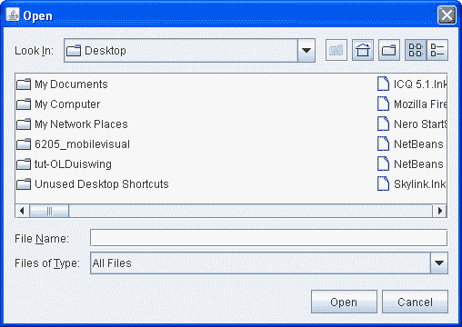

# 如何使用文件选择器

> 原文：[`docs.oracle.com/javase/tutorial/uiswing/components/filechooser.html`](https://docs.oracle.com/javase/tutorial/uiswing/components/filechooser.html)

文件选择器提供了一个用于浏览文件系统的 GUI，然后从列表中选择文件或目录，或输入文件或目录的名称。要显示文件选择器，通常使用`JFileChooser` API 显示包含文件选择器的模态对话框。另一种呈现文件选择器的方法是将[`JFileChooser`](https://docs.oracle.com/javase/8/docs/api/javax/swing/JFileChooser.html)的实例添加到容器中。

* * *

**注意：**

如果您打算将程序作为沙箱 Java Web Start 应用程序进行分发，则应使用 JNLP API 提供的文件服务，而不是使用`JFileChooser` API。这些服务 — `FileOpenService` 和 `FileSaveService` — 不仅提供了在受限环境中选择文件的支持，还负责实际打开和保存文件。使用这些服务的示例在 JWSFileChooserDemo 中。有关使用 JNLP API 的文档可以在 Java Web Start 课程中找到。

* * *

单击“启动”按钮以使用[Java™ Web Start](http://www.oracle.com/technetwork/java/javase/javawebstart/index.html)运行 JWSFileChooserDemo（[下载 JDK 7 或更高版本](http://www.oracle.com/technetwork/java/javase/downloads/index.html)）。或者，要自行编译和运行示例，请参考示例索引。


在使用`JWSFileChooserDemo`示例时，请注意不要丢失所需的文件。每当单击保存按钮并选择现有文件时，此演示会弹出“文件已存在”对话框，并要求替换文件。接受请求会覆盖文件。

本节的其余部分讨论如何使用`JFileChooser` API。`JFileChooser`对象仅呈现用于选择文件的 GUI。您的程序负责处理所选文件，例如打开或保存文件。请参考基本 I/O 获取有关如何读取和写入文件的信息。

`JFileChooser` API 使打开和保存对话框变得简单。外观和感觉的类型决定了这些标准对话框的外观以及它们的区别。在 Java 外观和感觉中，保存对话框看起来与打开对话框相同，除了对话框窗口上的标题和批准操作的按钮上的文本不同。这是 Java 外观和感觉中标准打开对话框的图片：



这是一个名为`FileChooserDemo`的应用程序的图片，它会弹出一个打开对话框和一个保存对话框。


* * *

**试一试：**

1.  编译并运行示例，参考示例索引。

1.  点击“打开文件”按钮。在文件选择器中浏览，选择一个文件，然后点击对话框的“打开”按钮。

1.  使用“保存文件”按钮来弹出保存对话框。尝试使用文件选择器上的所有控件。

1.  在源文件`FileChooserDemo.java`中，将文件选择模式更改为仅目录模式。（搜索`DIRECTORIES_ONLY`并取消注释包含它的行。）然后重新编译并运行示例。您只能看到并选择目录，而不能选择普通文件。

* * *

弹出标准打开对话框只需要两行代码：

```java
//Create a file chooser
final JFileChooser fc = new JFileChooser();
...
*//In response to a button click:*
int returnVal = fc.showOpenDialog(*aComponent*);

```

`showOpenDialog`方法的参数指定对话框的父组件。父组件影响对话框的位置以及对话框所依赖的框架。例如，Java 外观将对话框直接放在父组件上。如果父组件在一个框架中，则对话框依赖于该框架。当框架最小化时，此对话框消失，当框架最大化时重新出现。

默认情况下，之前未显示过的文件选择器会显示用户主目录中的所有文件。您可以使用`JFileChooser`的其他构造函数之一指定文件选择器的初始目录，或者可以使用`setCurrentDirectory`方法设置目录。

调用`showOpenDialog`出现在“打开文件”按钮的动作监听器的`actionPerformed`方法中：

```java
public void actionPerformed(ActionEvent e) {
    //Handle open button action.
    if (e.getSource() == openButton) {
        int returnVal = fc.showOpenDialog(FileChooserDemo.this);

        if (returnVal == JFileChooser.APPROVE_OPTION) {
            File file = fc.getSelectedFile();
            //This is where a real application would open the file.
            log.append("Opening: " + file.getName() + "." + newline);
        } else {
            log.append("Open command cancelled by user." + newline);
        }
   } ...
}

```

`show*Xxx*Dialog`方法返回一个整数，指示用户是否选择了文件。根据文件选择器的使用方式，通常只需检查返回值是否为`APPROVE_OPTION`，然后不更改任何其他值。要获取所选文件（或目录，如果设置文件选择器以允许选择目录），请在文件选择器上调用`getSelectedFile`方法。此方法返回一个[`File`](https://docs.oracle.com/javase/8/docs/api/java/io/File.html)的实例。

该示例获取文件的名称并在日志消息中使用。你可以在`File`对象上调用其他方法，比如`getPath`、`isDirectory`或`exists`来获取有关文件的信息。你也可以调用其他方法，比如`delete`和`rename`来以某种方式更改文件。当然，你可能还想通过使用 Java 平台提供的读取器或写入器类之一来打开或保存文件。有关使用读取器和写入器将数据读取和写入文件系统的信息，请参阅基本 I/O。

示例程序使用相同的`JFileChooser`类实例来显示标准保存对话框。这次程序调用`showSaveDialog`：

```java
int returnVal = fc.showSaveDialog(FileChooserDemo.this);

```

通过使用相同的文件选择器实例来显示其打开和保存对话框，程序获得以下好处：

+   选择器在使用之间记住当前目录，因此打开和保存版本会自动共享相同的当前目录。

+   你只需自定义一个文件选择器，自定义将应用于打开和保存版本。

最后，示例程序中有被注释掉的代码行，让你可以更改文件选择模式。例如，以下代码行使文件选择器只能选择目录，而不能选择文件：

```java
fc.setFileSelectionMode(JFileChooser.DIRECTORIES_ONLY);

```

另一种可能的选择模式是`FILES_AND_DIRECTORIES`。默认值是`FILES_ONLY`。以下图片显示了一个打开对话框，文件选择模式设置为`DIRECTORIES_ONLY`。请注意，至少在 Java 外观中，只有目录可见，而不是文件。


如果你想为除了打开或保存之外的任务创建一个文件选择器，或者想要自定义文件选择器，请继续阅读。我们将讨论以下主题：

+   另一个示例：FileChooserDemo2

+   为自定义任务使用文件选择器

+   过滤文件列表

+   自定义文件视图

+   提供附件组件

+   文件选择器 API

+   使用文件选择器的示例

## 另一个示例：FileChooserDemo2

让我们看看`FileChooserDemo2`示例，这是前一个演示程序的修改版本，使用了更多的`JFileChooser`API。该示例使用了多种方式自定义的文件选择器。与原始示例一样，用户通过按下按钮调用文件选择器。这是文件选择器的图片：


如图所示，此文件选择器已经为一个特殊任务（附件）进行了定制，提供了一个用户可选择的文件过滤器（仅图像），对图像文件使用了特殊的文件视图，并具有一个附件组件，显示当前选定图像文件的缩略图。

本节的其余部分向您展示了创建和自定义此文件选择器的代码。请参阅示例索引以获取此示例所需的所有文件的链接。

## 使用文件选择器执行自定义任务

正如您所见，`JFileChooser`类提供了`showOpenDialog`方法用于显示打开对话框，以及`showSaveDialog`方法用于显示保存对话框。

该类还有另一个方法`showDialog`，用于在对话框中显示用于自定义任务的文件选择器。在 Java 外观中，此对话框与其他文件选择器对话框之间唯一的区别是对话框窗口上的标题和批准按钮上的标签。以下是从`FileChooserDemo2`中调用的代码，用于打开附件任务的文件选择器对话框：

```java
JFileChooser fc = new JFileChooser();
int returnVal = fc.showDialog(FileChooserDemo2.this, "Attach");

```

`showDialog`方法的第一个参数是对话框的父组件。第二个参数是一个`String`对象，提供对话框窗口的标题和批准按钮的标签。

再次强调，文件选择器不会对所选文件执行任何操作。程序负责实现文件选择器创建的自定义任务。

## 过滤文件列表

默认情况下，文件选择器显示它检测到的所有文件和目录，除了隐藏文件。程序可以向文件选择器应用一个或多个*文件过滤器*，以便选择器仅显示一些文件。文件选择器调用过滤器的`accept`方法来确定是否应显示该文件。文件过滤器根据文件类型、大小、所有权等标准接受或拒绝文件。过滤器影响文件选择器显示的文件列表。用户可以输入任何文件的名称，即使它没有显示。

`JFileChooser`支持三种不同类型的过滤。这些过滤器按照列出的顺序进行检查。例如，应用程序控制的过滤器只能看到内置过滤器接受的文件。

**内置过滤**

通过文件选择器上的特定方法调用来设置过滤。目前，唯一可用的内置过滤器是用于隐藏文件的，例如在 UNIX 系统上以句点（.）开头的文件。默认情况下，不显示隐藏文件。调用`setFileHidingEnabled(false)`以显示隐藏文件。

**应用程序控制的过滤**

应用程序确定显示哪些文件。创建[`FileFilter`](https://docs.oracle.com/javase/8/docs/api/javax/swing/filechooser/FileFilter.html)的自定义子类，实例化它，并将实例用作`setFileFilter`方法的参数。安装的过滤器显示在用户可选择的过滤器列表中。文件选择器仅显示过滤器接受的文件。

**用户可选择的过滤**

文件选择器 GUI 提供了用户可以选择的过滤器列表。当用户选择一个过滤器时，文件选择器只显示被该过滤器接受的文件。`FileChooserDemo2` 将一个自定义文件过滤器添加到用户可选择的过滤器列表中：

```java
fc.addChoosableFileFilter(new ImageFilter());

```

默认情况下，用户可选择的过滤器列表包括“接受所有”过滤器，该过滤器使用户可以查看所有非隐藏文件。以下示例使用以下代码禁用“接受所有”过滤器：

```java
fc.setAcceptAllFileFilterUsed(false);

```

我们的自定义文件过滤器在 `ImageFilter.java` 中实现，是 `FileFilter` 的子类。`ImageFilter` 类实现了 `getDescription` 方法，返回“Just Images”——一个要放在用户可选择过滤器列表中的字符串。`ImageFilter` 还实现了 `accept` 方法，以便接受所有目录和具有 `.png`、`.jpg`、`.jpeg`、`.gif`、`.tif` 或 `.tiff` 文件扩展名的文件。

```java
public boolean accept(File f) {
    if (f.isDirectory()) {
        return true;
    }

    String extension = Utils.getExtension(f);
    if (extension != null) {
        if (extension.equals(Utils.tiff) ||
            extension.equals(Utils.tif) ||
            extension.equals(Utils.gif) ||
            extension.equals(Utils.jpeg) ||
            extension.equals(Utils.jpg) ||
            extension.equals(Utils.png)) {
                return true;
        } else {
            return false;
        }
    }

    return false;
}

```

通过接受所有目录，此过滤器允许用户在文件系统中导航。如果从此方法中省略了粗体行，则用户将受限于选择器初始化的目录。

前面的代码示例使用了 `getExtension` 方法和几个字符串常量，来自 `Utils.java`，如下所示：

```java
public class Utils {

    public final static String jpeg = "jpeg";
    public final static String jpg = "jpg";
    public final static String gif = "gif";
    public final static String tiff = "tiff";
    public final static String tif = "tif";
    public final static String png = "png";

    /*
     * Get the extension of a file.
     */  
    public static String getExtension(File f) {
        String ext = null;
        String s = f.getName();
        int i = s.lastIndexOf('.');

        if (i > 0 &&  i < s.length() - 1) {
            ext = s.substring(i+1).toLowerCase();
        }
        return ext;
    }
}

```

## 自定义文件视图

在 Java 外观中，选择器的列表显示每个文件的名称，并显示一个小图标，表示文件是真实文件还是目录。您可以通过创建 [`FileView`](https://docs.oracle.com/javase/8/docs/api/javax/swing/filechooser/FileView.html) 的自定义子类并将该类的实例用作 `setFileView` 方法的参数来自定义此*文件视图*。该示例使用一个自定义类的实例，实现在 `ImageFileView.java` 中，作为文件选择器的文件视图。

```java
fc.setFileView(new ImageFileView());

```

`ImageFileView` 类为先前描述的图像过滤器接受的每种类型的图像显示不同的图标。

`ImageFileView` 类重写了 `FileView` 中定义的五个抽象方法，如下所示。

**`String getTypeDescription(File f)`**

返回文件类型的描述。这是 `ImageFileView` 对此方法的实现：

```java
public String getTypeDescription(File f) {
    String extension = Utils.getExtension(f);
    String type = null;

    if (extension != null) {
        if (extension.equals(Utils.jpeg) ||
            extension.equals(Utils.jpg)) {
            type = "JPEG Image";
        } else if (extension.equals(Utils.gif)){
            type = "GIF Image";
        } else if (extension.equals(Utils.tiff) ||
                   extension.equals(Utils.tif)) {
            type = "TIFF Image";
        } else if (extension.equals(Utils.png)){
            type = "PNG Image";
        }
    }
    return type;
}

```

**`Icon getIcon(File f)`**

返回表示文件或其类型的图标。这是 `ImageFileView` 对此方法的实现：

```java
public Icon getIcon(File f) {
    String extension = Utils.getExtension(f);
    Icon icon = null;

    if (extension != null) {
        if (extension.equals(Utils.jpeg) ||
            extension.equals(Utils.jpg)) {
            icon = jpgIcon;
        } else if (extension.equals(Utils.gif)) {
            icon = gifIcon;
        } else if (extension.equals(Utils.tiff) ||
                   extension.equals(Utils.tif)) {
            icon = tiffIcon;
        } else if (extension.equals(Utils.png)) {
            icon = pngIcon;
        }
    }
    return icon;
}

```

**`String getName(File f)`**

返回文件的名称。大多数此方法的实现应返回 `null`，表示外观和感觉应该自行解决。另一个常见的实现返回 `f.getName()`。

**`String getDescription(File f)`**

返回文件的描述。意图是更具体地描述单个文件。此方法的常见实现返回 `null`，表示外观和感觉应该自行解决。

**`Boolean isTraversable(File f)`**

返回目录是否可遍历。大多数此方法的实现应返回`null`以指示外观和感觉应该解决这个问题。一些应用程序可能希望阻止用户进入某种类型的目录，因为它代表一个复合文档。`isTraversable`方法永远不应为非目录返回`true`。

## 提供一个附件组件

`FileChooserDemo2`中的自定义文件选择器具有一个附件组件。如果当前选择的项目是 PNG、JPEG、TIFF 或 GIF 图像，则附件组件显示图像的缩略图草图。否则，附件组件为空。除了预览器，附件组件最常见的用途可能是一个面板，上面有更多控件，如切换功能的复选框。

示例调用`setAccessory`方法来建立`ImagePreview`类的一个实例，实现在`ImagePreview.java`中，作为选择器的附件组件：

```java
fc.setAccessory(new ImagePreview(fc));

```

任何继承自`JComponent`类的对象都可以是附件组件。组件应具有在文件选择器中看起来不错的首选大小。

当用户在列表中选择项目时，文件选择器会触发属性更改事件。具有附件组件的程序必须注册以接收这些事件，以便在选择更改时更新附件组件。在示例中，`ImagePreview`对象本身注册了这些事件。这样可以将所有与附件组件相关的代码放在一个类中。

这是示例中`propertyChange`方法的实现，当触发属性更改事件时调用该方法：

```java
//*where member variables are declared*
File file = null;
...
public void propertyChange(PropertyChangeEvent e) {
    boolean update = false;
    String prop = e.getPropertyName();

    //If the directory changed, don't show an image.
    if (JFileChooser.DIRECTORY_CHANGED_PROPERTY.equals(prop)) {
        file = null;
        update = true;

    //If a file became selected, find out which one.
    } else if (JFileChooser.SELECTED_FILE_CHANGED_PROPERTY.equals(prop)) {
        file = (File) e.getNewValue();
        update = true;
    }

    //Update the preview accordingly.
    if (update) {
        thumbnail = null;
        if (isShowing()) {
            loadImage();
            repaint();
        }
    }
}

```

如果`SELECTED_FILE_CHANGED_PROPERTY`是更改的属性，则此方法从文件选择器获取一个`File`对象。`loadImage`和`repaint`方法使用`File`对象加载图像并重绘附件组件。

## 文件选择器 API

使用文件选择器的 API 分为以下几类：

+   创建和显示文件选择器

+   选择文件和目录

+   导航文件选择器的列表

+   自定义文件选择器

创建和显示文件选择器

| 方法或构造函数 | 目的 |
| --- | --- |

| [JFileChooser()](https://docs.oracle.com/javase/8/docs/api/javax/swing/JFileChooser.html#JFileChooser--) [JFileChooser(File)](https://docs.oracle.com/javase/8/docs/api/javax/swing/JFileChooser.html#JFileChooser-java.io.File-)

[JFileChooser(String)](https://docs.oracle.com/javase/8/docs/api/javax/swing/JFileChooser.html#JFileChooser-java.lang.String-) | 创建一个文件选择器实例。当存在`File`和`String`参数时，提供初始目录。 |

| [int showOpenDialog(Component)](https://docs.oracle.com/javase/8/docs/api/javax/swing/JFileChooser.html#showOpenDialog-java.awt.Component-) [int showSaveDialog(Component)](https://docs.oracle.com/javase/8/docs/api/javax/swing/JFileChooser.html#showSaveDialog-java.awt.Component-)

[int showDialog(Component, String)](https://docs.oracle.com/javase/8/docs/api/javax/swing/JFileChooser.html#showDialog-java.awt.Component-java.lang.String-) | 显示包含文件选择器的模态对话框。如果用户批准操作，则这些方法返回`APPROVE_OPTION`，如果用户取消操作，则返回`CANCEL_OPTION`。另一个可能的返回值是`ERROR_OPTION`，表示发生了意外错误。

选择文件和目录

| 方法 | 目的 |
| --- | --- |
| [void setSelectedFile(File)](https://docs.oracle.com/javase/8/docs/api/javax/swing/JFileChooser.html#setSelectedFile-java.io.File-) [File getSelectedFile()](https://docs.oracle.com/javase/8/docs/api/javax/swing/JFileChooser.html#getSelectedFile--) | 设置或获取当前选定的文件或（如果启用了目录选择）目录。 |
| [void setSelectedFiles(File[])](https://docs.oracle.com/javase/8/docs/api/javax/swing/JFileChooser.html#setSelectedFiles-java.io.File:A-) [File[] getSelectedFiles()](https://docs.oracle.com/javase/8/docs/api/javax/swing/JFileChooser.html#getSelectedFiles--) | 设置或获取当前选定的文件（如果文件选择器设置为允许多选）。 |

| [void setFileSelectionMode(int)](https://docs.oracle.com/javase/8/docs/api/javax/swing/JFileChooser.html#setFileSelectionMode-int-) [void getFileSelectionMode()](https://docs.oracle.com/javase/8/docs/api/javax/swing/JFileChooser.html#getFileSelectionMode--)

[boolean isDirectorySelectionEnabled()](https://docs.oracle.com/javase/8/docs/api/javax/swing/JFileChooser.html#isDirectorySelectionEnabled--) | 检查目录选择是否已启用。

[boolean isFileSelectionEnabled()](https://docs.oracle.com/javase/8/docs/api/javax/swing/JFileChooser.html#isFileSelectionEnabled--) | 设置或获取文件选择模式。可接受的值为`FILES_ONLY`（默认值）、`DIRECTORIES_ONLY`和`FILES_AND_DIRECTORIES`。根据当前选择模式解释目录或文件是否可选择。

| [void setMultiSelectionEnabled(boolean)](https://docs.oracle.com/javase/8/docs/api/javax/swing/JFileChooser.html#setMultiSelectionEnabled-boolean-) [boolean isMultiSelectionEnabled()](https://docs.oracle.com/javase/8/docs/api/javax/swing/JFileChooser.html#isMultiSelectionEnabled--) | 设置或解释是否可以一次选择多个文件。默认情况下，用户只能选择一个文件。 |
| --- | --- |
| [void setAcceptAllFileFilterUsed(boolean)](https://docs.oracle.com/javase/8/docs/api/javax/swing/JFileChooser.html#setAcceptAllFileFilterUsed-boolean-) [boolean isAcceptAllFileFilterUsed()](https://docs.oracle.com/javase/8/docs/api/javax/swing/JFileChooser.html#isAcceptAllFileFilterUsed--) | 设置或获取是否在可选择的过滤器列表中使用`AcceptAll`文件过滤器作为可接受的选择；默认值为`true`。 |
| [Dialog createDialog(Component)](https://docs.oracle.com/javase/8/docs/api/javax/swing/JFileChooser.html#createDialog-java.awt.Component-) | 给定一个父组件，创建并返回一个包含此文件选择器的新对话框，依赖于父窗口的框架，并居中于父窗口。 |

导航文件选择器的列表

| 方法 | 目的 |
| --- | --- |
| [void ensureFileIsVisible(File)](https://docs.oracle.com/javase/8/docs/api/javax/swing/JFileChooser.html#ensureFileIsVisible-java.io.File-) | 滚动文件选择器的列表，使指定的文件可见。 |
| [void setCurrentDirectory(File)](https://docs.oracle.com/javase/8/docs/api/javax/swing/JFileChooser.html#setCurrentDirectory-java.io.File-) [File getCurrentDirectory()](https://docs.oracle.com/javase/8/docs/api/javax/swing/JFileChooser.html#getCurrentDirectory--) | 设置或获取在文件选择器的列表中显示的目录。 |
| [void changeToParentDirectory()](https://docs.oracle.com/javase/8/docs/api/javax/swing/JFileChooser.html#changeToParentDirectory--) | 将列表更改为显示当前目录的父目录。 |
| [void rescanCurrentDirectory()](https://docs.oracle.com/javase/8/docs/api/javax/swing/JFileChooser.html#rescanCurrentDirectory--) | 检查文件系统并更新选择器的列表。 |
| [void setDragEnabled(boolean)](https://docs.oracle.com/javase/8/docs/api/javax/swing/JFileChooser.html#setDragEnabled-boolean-) [boolean getDragEnabled()](https://docs.oracle.com/javase/8/docs/api/javax/swing/JFileChooser.html#getDragEnabled--) | 设置或获取确定是否启用自动拖放处理的属性。有关更多详细信息，请参阅拖放和数据传输。 |

自定义文件选择器

| 方法 | 目的 |
| --- | --- |
| [void setAccessory(javax.swing.JComponent)](https://docs.oracle.com/javase/8/docs/api/javax/swing/JFileChooser.html#setAccessory-javax.swing.JComponent-) [JComponent getAccessory()](https://docs.oracle.com/javase/8/docs/api/javax/swing/JFileChooser.html#getAccessory--) | 设置或获取文件选择器的附件组件。 |
| [void setFileFilter(FileFilter)](https://docs.oracle.com/javase/8/docs/api/javax/swing/JFileChooser.html#setFileFilter-javax.swing.filechooser.FileFilter-) [FileFilter getFileFilter()](https://docs.oracle.com/javase/8/docs/api/javax/swing/JFileChooser.html#getFileFilter--) | 设置或获取文件选择器的主要文件过滤器。 |
| [void setFileView(FileView)](https://docs.oracle.com/javase/8/docs/api/javax/swing/JFileChooser.html#setFileView-javax.swing.filechooser.FileView-) [FileView getFileView()](https://docs.oracle.com/javase/8/docs/api/javax/swing/JFileChooser.html#getFileView--) | 设置或获取选择器的文件视图。 |

| [FileFilter[] getChoosableFileFilters()](https://docs.oracle.com/javase/8/docs/api/javax/swing/JFileChooser.html#getChoosableFileFilters--) [void addChoosableFileFilter(FileFilter)](https://docs.oracle.com/javase/8/docs/api/javax/swing/JFileChooser.html#addChoosableFileFilter-javax.swing.filechooser.FileFilter-) | 设置、获取或修改可供用户选择的文件过滤器列表。 |

[boolean removeChoosableFileFilter(FileFilter)](https://docs.oracle.com/javase/8/docs/api/javax/swing/JFileChooser.html#removeChoosableFileFilter-javax.swing.filechooser.FileFilter-)

[void resetChoosableFileFilters()](https://docs.oracle.com/javase/8/docs/api/javax/swing/JFileChooser.html#resetChoosableFileFilters--)

[FileFilter getAcceptAllFileFilter()](https://docs.oracle.com/javase/8/docs/api/javax/swing/JFileChooser.html#getAcceptAllFileFilter--) | 设置、获取或修改用户可选择的文件过滤器列表。 |

| [void setFileHidingEnabled(boolean)](https://docs.oracle.com/javase/8/docs/api/javax/swing/JFileChooser.html#setFileHidingEnabled-boolean-) [boolean isFileHidingEnabled()](https://docs.oracle.com/javase/8/docs/api/javax/swing/JFileChooser.html#isFileHidingEnabled--) | 设置或获取是否显示隐藏文件。 |
| --- | --- |
| [void setControlButtonsAreShown(boolean)](https://docs.oracle.com/javase/8/docs/api/javax/swing/JFileChooser.html#setControlButtonsAreShown-boolean-) [boolean getControlButtonsAreShown()](https://docs.oracle.com/javase/8/docs/api/javax/swing/JFileChooser.html#getControlButtonsAreShown--) | 设置或获取指示文件选择器中是否显示“批准”和“取消”按钮的属性。默认情况下，此属性为 true。 |

## 使用文件选择器的示例

这个表格展示了使用文件选择器的示例，并指向这些示例所描述的位置。

| 示例 | 描述位置 | 注释 |
| --- | --- | --- |
| `FileChooserDemo` | 这一部分 | 显示一个打开对话框和一个保存对话框。 |
| `FileChooserDemo2` | 这一部分 | 使用具有自定义过滤、自定义文件视图和附件组件的文件选择器。 |
| `JWSFileChooserDemo` | 这一部分 | 使用 JNLP API 来打开和保存文件。 |
