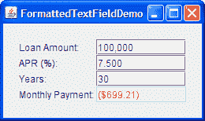
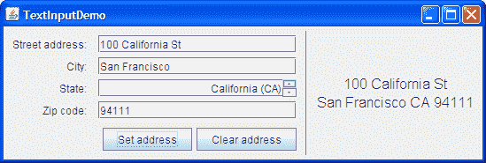
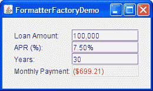
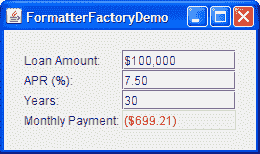

# 如何使用格式化文本字段

> 原文：[`docs.oracle.com/javase/tutorial/uiswing/components/formattedtextfield.html`](https://docs.oracle.com/javase/tutorial/uiswing/components/formattedtextfield.html)

格式化文本字段为开发人员提供了一种指定可以在文本字段中键入的有效字符集的方法。具体而言，[`JFormattedTextField`](https://docs.oracle.com/javase/8/docs/api/javax/swing/JFormattedTextField.html)类添加了一个*格式化器*和一个对象*值*到从`JTextField`类继承的特性中。格式化器将字段的值转换为其显示的文本，将文本转换为字段的值。

使用 Swing 提供的格式化器，您可以设置格式化文本字段以在本地化格式中输入日期和数字。另一种格式化器使您可以使用字符掩码来指定可以在字段中的每个位置键入的字符集。例如，您可以指定一个用于以特定格式输入电话号码的掩码，如（XX）X-XX-XX-XX-XX。

如果格式化文本字段的可能值具有明显的顺序，请改用微调器。微调器默认使用格式化文本字段，但添加了两个按钮，使用户可以在序列中选择一个值。

使用格式化文本字段的另一种选择或辅助方法是在字段上安装输入验证器。组件的输入验证器在组件几乎失去键盘焦点时被调用。输入验证器使您能够检查组件的值是否有效，并可选择更改它或阻止焦点转移。

此 GUI 使用格式化文本字段以四种不同格式显示数字。



* * *

**试试这个：**

1.  单击“启动”按钮以使用[Java™ Web Start](http://www.oracle.com/technetwork/java/javase/javawebstart/index.html)运行 FormattedTextFieldDemo（[下载 JDK 7 或更高版本](http://www.oracle.com/technetwork/java/javase/downloads/index.html)）。或者，要自行编译和运行示例，请参考示例索引。

1.  尝试不同的贷款金额、年利率（APR）和贷款期限。

    请注意，只要您输入的文本有效，当您按 Enter 键或将焦点移出您正在编辑的字段时，月付款字段将更新。

1.  在贷款金额字段中键入无效文本，如“abcd”，然后按 Enter 键。

    月付款字段保持不变。当您从贷款金额字段移动焦点时，文本将恢复到字段的最后一个有效值。

1.  在贷款金额字段中输入类似"2000abcd"这样边缘有效的文本，然后按 Enter 键。

    尽管贷款金额字段仍显示`2000abcd`，但月付款字段已更新。当您从贷款金额字段移开焦点时，它显示的文本会更新为其值的整洁格式，例如"2,000"。

* * *

您可以在``FormattedTextFieldDemo.java``中找到此程序的完整代码。此代码创建了第一个字段。

```java
amountField = new JFormattedTextField(amountFormat);
amountField.setValue(new Double(amount));
amountField.setColumns(10);
amountField.addPropertyChangeListener("value", this);
...
amountFormat = NumberFormat.getNumberInstance();

```

用于创建`amountField`对象的构造函数接受一个`java.text.Format`参数。`Format`对象由字段的格式化程序用于将字段的值转换为文本，以及将文本转换为字段的值。

其余代码设置了`amountField`对象。`setValue`方法将字段的值属性设置为表示为`Double`对象的浮点数。`setColumns`方法，从`JTextField`类继承而来，提示字段的首选大小。调用`addPropertyChangeListener`方法为字段的值属性注册了一个侦听器，因此当用户更改贷款金额时，程序可以更新月付款字段。

本节的其余部分涵盖以下主题：

+   创建和初始化格式化文本字段

+   设置和获取字段的值

+   指定格式

+   使用 MaskFormatter

+   指定格式化程序并使用格式化程序工厂

本节不解释从`JTextField`类继承的 API。该 API 在如何使用文本字段中有描述。

## 创建和初始化格式化文本字段

以下代码创建并初始化了示例中的其余三个字段。

```java
rateField = new JFormattedTextField(percentFormat);
rateField.setValue(new Double(rate));
rateField.setColumns(10);
rateField.addPropertyChangeListener("value", this);

numPeriodsField = new JFormattedTextField();
numPeriodsField.setValue(new Integer(numPeriods));
numPeriodsField.setColumns(10);
numPeriodsField.addPropertyChangeListener("value", this);

paymentField = new JFormattedTextField(paymentFormat);
paymentField.setValue(new Double(payment));
paymentField.setColumns(10);
paymentField.setEditable(false);
paymentField.setForeground(Color.red);

...
percentFormat = NumberFormat.getNumberInstance();
percentFormat.setMinimumFractionDigits(2);

paymentFormat = NumberFormat.getCurrencyInstance();

```

用于设置`rateField`对象的代码几乎与之前列出的其他字段的代码相同。唯一的区别在于格式略有不同，这要归功于代码`percentFormat.setMinimumFractionDigits(2)`。

用于创建`numPeriodsField`对象的代码没有显式设置格式或格式化程序。相反，它将值设置为`Integer`并启用字段使用`Integer`对象的默认格式化程序。之前两个字段的代码没有这样做，因为默认格式化程序不适用于`Double`对象。结果不是所需的。如何指定格式和格式化程序将在本节后面介绍。

付款字段与其他字段不同，因为它是不可编辑的，使用不同颜色的文本，并且没有属性更改侦听器。否则，它与其他字段相同。我们本可以选择使用文本字段或标签。无论使用哪种组件，我们仍然可以使用`paymentFormat`方法将付款金额解析为要显示的文本。

## 设置和获取字段的值

使用格式化文本字段时请记住以下内容：

* * *

**格式化文本字段的*文本*和*数值*是两个不同的属性，而数值通常落后于文本。**

* * *

*文本*属性由`JTextField`类定义。该属性始终反映字段显示的内容。*数值*属性由`JFormattedTextField`类定义，可能不会反映字段中显示的最新文本。当用户输入时，文本属性会更改，但数值属性直到更改被*提交*之前不会改变。

要更加精确，格式化文本字段的数值可以通过使用`setValue`方法或`commitEdit`方法来设置。`setValue`方法将数值设置为指定的参数。技术上，参数可以是任何`Object`，但格式化器需要能够将其转换为字符串。否则，文本字段不会显示任何实质性信息。

`commitEdit`方法将数值设置为格式化器确定由字段文本表示的任何对象。当发生以下情况之一时，`commitEdit`方法会自动调用：

+   当用户在字段具有焦点时按 Enter 键。

+   默认情况下，当字段失去焦点时，例如，当用户按 Tab 键将焦点切换到另一个组件时。您可以使用`setFocusLostBehavior`方法来指定字段失去焦点时的不同结果。

* * *

**注意：**

一些格式化器可能会不断更新数值，使失去焦点变得毫无意义，因为数值始终与文本指定的内容相同。

* * *

当您设置格式化文本字段的数值时，字段的文本会更新以反映数值。数值如何表示为文本取决于字段的格式化器。

请注意，虽然`JFormattedTextField`类从`JTextField`类继承了`setText`方法，但通常不会在格式化文本字段上调用`setText`方法。如果这样做，字段的显示会相应更改，但数值不会更新（除非字段的格式化器不断更新它）。

要获取格式化文本字段的当前数值，请使用`getValue`方法。如果需要，您可以在调用`getValue`之前调用`commitEdit`方法来确保数值反映文本内容。因为`getValue`方法返回一个`Object`，您需要将其转换为字段数值所使用的类型。例如：

```java
Date enteredDate = (Date)dateField.getValue();

```

要检测格式化文本字段数值的更改，您可以在格式化文本字段上注册一个属性更改监听器，以监听“value”属性的更改。属性更改监听器取自`FormattedTextFieldDemo`示例：

```java
*//The property change listener is registered on each
//field using code like this:
//    someField.addPropertyChangeListener("value", this);*

/** Called when a field's "value" property changes. */
public void propertyChange(PropertyChangeEvent e) {
    Object source = e.getSource();
    if (source == amountField) {
        amount = ((Number)amountField.getValue()).doubleValue();
    } else if (source == rateField) {
        rate = ((Number)rateField.getValue()).doubleValue();
    } else if (source == numPeriodsField) {
        numPeriods = ((Number)numPeriodsField.getValue()).intValue();
    }

    double payment = computePayment(amount, rate, numPeriods);
    paymentField.setValue(new Double(payment));
}

```

## 指定格式

[`Format`](https://docs.oracle.com/javase/8/docs/api/java/text/Format.html)类提供了一种格式化区域敏感信息（如日期和数字）的方法。从[`InternationalFormatter`](https://docs.oracle.com/javase/8/docs/api/javax/swing/text/InternationalFormatter.html)类继承的格式化程序，如[`DateFormatter`](https://docs.oracle.com/javase/8/docs/api/javax/swing/text/DateFormatter.html)和[`NumberFormatter`](https://docs.oracle.com/javase/8/docs/api/javax/swing/text/NumberFormatter.html)类，使用`Format`对象在字段文本和值之间进行转换。您可以通过调用[`DateFormat`](https://docs.oracle.com/javase/8/docs/api/java/text/DateFormat.html)或[`NumberFormat`](https://docs.oracle.com/javase/8/docs/api/java/text/NumberFormat.html)类中的工厂方法之一，或者使用[`SimpleDateFormat`](https://docs.oracle.com/javase/8/docs/api/java/text/SimpleDateFormat.html)构造函数之一来获取`Format`对象。

* * *

**注意：**

第三个常用的格式化类`MaskFormatter`，不是从`InternationalFormatter`类继承的，也不使用格式。关于`MaskFormatter`的讨论请参见使用 MaskFormatter。

* * *

在创建`Format`对象时，您可以自定义某些格式方面，而通过特定于格式的 API 可以自定义其他方面。例如，继承自`NumberFormat`并经常由其工厂方法返回的[`DecimalFormat`](https://docs.oracle.com/javase/8/docs/api/java/text/DecimalFormat.html)对象可以通过使用`setMaximumFractionDigits`和`setNegativePrefix`方法进行自定义。有关使用`Format`对象的信息，请参阅国际化教程的格式化部分。

将自定义格式与格式化文本字段关联的最简单方法是使用以`Format`作为参数的`JFormattedTextField`构造函数创建字段。您可以在前面创建`amountField`和`rateField`对象的代码示例中看到这种关联。

## 使用 MaskFormatter

[`MaskFormatter`](https://docs.oracle.com/javase/8/docs/api/javax/swing/text/MaskFormatter.html)类实现了一个指定每个字段文本位置中哪些字符有效的格式化程序。例如，以下代码创建了一个允许用户输入五位邮政编码的`MaskFormatter`：

```java
zipField = new JFormattedTextField(
                    createFormatter("#####"));
...
protected MaskFormatter createFormatter(String s) {
    MaskFormatter formatter = null;
    try {
        formatter = new MaskFormatter(s);
    } catch (java.text.ParseException exc) {
        System.err.println("formatter is bad: " + exc.getMessage());
        System.exit(-1);
    }
    return formatter;
}

```

你可以通过运行`TextInputDemo`来尝试上述代码的结果。点击启动按钮以使用[Java™ Web Start](http://www.oracle.com/technetwork/java/javase/javawebstart/index.html)运行 TextInputDemo（[下载 JDK 7 或更高版本](http://www.oracle.com/technetwork/java/javase/downloads/index.html)）。或者，要自行编译和运行示例，请参考示例索引。


程序的 GUI 被显示。



以下表格显示了您可以在格式化掩码中使用的字符：

| Character  | 描述 |
| --- | --- |
| # | 任何有效数字（`Character.isDigit`）。 |
| ' *(单引号)* | 转义字符，用于转义任何特殊格式化字符。 |
| U | 任何字符（`Character.isLetter`）。所有小写字母都映射为大写字母。 |
| L | 任何字符（`Character.isLetter`）。所有大写字母都映射为小写字母。 |
| A | 任何字符或数字（`Character.isLetter`或`Character.isDigit`）。 |
| ? | 任何字符（`Character.isLetter`）。 |
| * | 任何内容。 |
| H | 任何十六进制字符（0-9，a-f 或 A-F）。 |

## 指定格式化程序并使用格式化程序工厂

在指定格式化程序时，请记住每个格式化程序对象一次只能由一个格式化文本字段使用。每个字段应至少关联一个格式化程序，其中恰好有一个在任何时候被使用。

您可以通过几种方式指定要由格式化文本字段使用的格式化程序：

+   **使用带有`Format`参数的`JFormattedTextField`构造函数。**

    为字段自动创建一个使用指定格式的格式化程序。

+   **使用带有`JFormattedTextField.AbstractFormatter`参数的`JFormattedTextField`构造函数。**

    指定的格式化程序用于字段。

+   **设置没有指定格式、格式化程序或格式化程序工厂的格式化文本字段的值。**

    通过默认格式化程序工厂将格式化程序分配给字段，使用字段值的类型作为指南。如果值是`Date`，则格式化程序是`DateFormatter`。如果值是`Number`，则格式化程序是`NumberFormatter`。其他类型会导致`DefaultFormatter`的实例。

+   **使格式化文本字段使用返回定制格式化程序对象的格式化程序工厂。**

    这是最灵活的方法。当您想要将多个格式化程序与字段关联或添加新类型的格式化程序以用于多个字段时，这是非常有用的。前一种用法的示例是解释用户以某种方式输入但以另一种方式显示值（当用户不输入时）的字段。后一种用法的示例是具有自定义类值的多个字段，例如，`PhoneNumber`。您可以设置字段使用返回电话号码的专门格式化程序的格式化程序工厂。

您可以通过使用接受格式化工厂参数的构造函数创建字段，或者通过在字段上调用`setFormatterFactory`方法来设置字段的格式化工厂。要创建格式化工厂，通常可以使用[`DefaultFormatterFactory`](https://docs.oracle.com/javase/8/docs/api/javax/swing/text/DefaultFormatterFactory.html)类的实例。`DefaultFormatterFactory`对象使您能够指定在正在编辑值、未在编辑值或具有空值时返回的格式化程序。

以下图示显示了基于`FormattedTextFieldDemo`示例的应用程序，该应用程序使用格式化工厂为贷款金额和年利率字段设置多个编辑器。在用户编辑贷款金额时，不使用$字符，以便用户不必输入它。类似地，在用户编辑年利率字段时，不需要%字符。

点击“启动”按钮以使用[Java™ Web Start](http://www.oracle.com/technetwork/java/javase/javawebstart/index.html)运行 FormatterFactoryDemo（[下载 JDK 7 或更高版本](http://www.oracle.com/technetwork/java/javase/downloads/index.html)）。或者，要自行编译和运行示例，请参考示例索引。


 

以下代码创建了格式化程序，并通过使用`DefaultFormatterFactory`类的实例设置它们：

```java
private double rate = .075;  //7.5 %
...
amountField = new JFormattedTextField(
                    new DefaultFormatterFactory(
                        new NumberFormatter(amountDisplayFormat),
                        new NumberFormatter(amountDisplayFormat),
                        new NumberFormatter(amountEditFormat)));
...
NumberFormatter percentEditFormatter =
        new NumberFormatter(percentEditFormat) {
    public String valueToString(Object o)
          throws ParseException {
        Number number = (Number)o;
        if (number != null) {
            double d = number.doubleValue() * 100.0;
            number = new Double(d);
        }
        return super.valueToString(number);
    }
    public Object stringToValue(String s)
           throws ParseException {
        Number number = (Number)super.stringToValue(s);
        if (number != null) {
            double d = number.doubleValue() / 100.0;
            number = new Double(d);
        }
        return number;
    }
};
rateField = new JFormattedTextField(
                     new DefaultFormatterFactory(
                        new NumberFormatter(percentDisplayFormat),
                        new NumberFormatter(percentDisplayFormat),
                        percentEditFormatter));
...
amountDisplayFormat = NumberFormat.getCurrencyInstance();
amountDisplayFormat.setMinimumFractionDigits(0);
amountEditFormat = NumberFormat.getNumberInstance();

percentDisplayFormat = NumberFormat.getPercentInstance();
percentDisplayFormat.setMinimumFractionDigits(2);
percentEditFormat = NumberFormat.getNumberInstance();
percentEditFormat.setMinimumFractionDigits(2);

```

粗体代码突出显示了对`DefaultFormatterFactory`构造函数的调用。构造函数的第一个参数指定用于格式化文本字段的默认格式化程序。第二个参数指定显示格式化程序，在字段没有焦点时使用。第三个参数指定编辑格式化程序，在字段具有焦点时使用。代码没有使用第四个参数，但如果使用了，第四个参数将指定空格式化程序，在字段的值为 null 时使用。因为没有指定空格式化程序，所以在值为 null 时使用默认格式化程序。

该代码通过创建`NumberFormatter`类的子类来自定义使用`percentEditFormat`的格式化器。该子类重写了`NumberFormatter`的`valueToString`和`stringToValue`方法，以便将显示的数字转换为实际用于计算的值，并将值转换为数字。具体来说，显示的数字是实际值的 100 倍。原因是显示格式器使用的百分比格式会自动将文本显示为值的 100 倍，因此相应的编辑格式器必须以相同的值显示文本。`FormattedTextFieldDemo`示例不需要处理此转换，因为此演示仅对显示和编辑使用一种格式。

您可以在``FormatterFactoryDemo.java``中找到整个程序的代码。

## 格式化文本字段 API

以下表格列出了一些常用的用于使用格式化文本字段的 API。

+   与格式化文本字段相关的类

+   JFormattedTextField 方法

+   默认格式化器选项

与格式化文本字段相关的类

| 类或接口 | 目的 |
| --- | --- |
| [JFormattedTextField](https://docs.oracle.com/javase/8/docs/api/javax/swing/JFormattedTextField.html) | `JTextField`的子类，支持格式化任意值。 |
| [JFormattedTextField.AbstractFormatter](https://docs.oracle.com/javase/8/docs/api/javax/swing/JFormattedTextField.AbstractFormatter.html) | `JFormattedTextField`的所有格式化器的超类。格式化器实施编辑策略和导航策略，处理字符串到对象的转换，并根据需要操作`JFormattedTextField`以实施所需的策略。 |
| [JFormattedTextField.AbstractFormatterFactory](https://docs.oracle.com/javase/8/docs/api/javax/swing/JFormattedTextField.AbstractFormatterFactory.html) | 所有格式化器工厂的超类。每个`JFormattedTextField`使用格式化器工厂来获取最符合文本字段状态的格式化器。 |
| [默认格式化器工厂](https://docs.oracle.com/javase/8/docs/api/javax/swing/text/DefaultFormatterFactory.html) | 通常使用的格式化器工厂。根据传入的参数和焦点状态等详细信息提供格式化器。 |
| [默认格式化器](https://docs.oracle.com/javase/8/docs/api/javax/swing/text/DefaultFormatter.html) | `JFormattedTextField.AbstractFormatter`的子类，通过使用`toString`方法格式化任意对象。 |
| [掩码格式化器](https://docs.oracle.com/javase/8/docs/api/javax/swing/text/MaskFormatter.html) | `DefaultFormatter`的子类，使用指定的字符掩码格式化和编辑字符串。（例如，可以使用“###-####”指定七位电话号码。） |
| [InternationalFormatter](https://docs.oracle.com/javase/8/docs/api/javax/swing/text/InternationalFormatter.html) | 使用`java.text.Format`的实例处理与`String`之间的转换的`DefaultFormatter`的子类。 |
| [NumberFormatter](https://docs.oracle.com/javase/8/docs/api/javax/swing/text/NumberFormatter.html) | `InternationalFormatter`的子类，通过使用`NumberFormat`的实例支持数字格式。 |
| [DateFormatter](https://docs.oracle.com/javase/8/docs/api/javax/swing/text/DateFormatter.html) | `InternationalFormatter`的子类，通过使用`DateFormat`的实例支持日期格式。 |

JFormattedTextField 方法

| 方法或构造函数 | 目的 |
| --- | --- |

| [JFormattedTextField()](https://docs.oracle.com/javase/8/docs/api/javax/swing/JFormattedTextField.html#JFormattedTextField--) [JFormattedTextField(Object)](https://docs.oracle.com/javase/8/docs/api/javax/swing/JFormattedTextField.html#JFormattedTextField-java.lang.Object-) 

[JFormattedTextField(Format)](https://docs.oracle.com/javase/8/docs/api/javax/swing/JFormattedTextField.html#JFormattedTextField-java.text.Format-) 

[JFormattedTextField(AbstractFormatter)](https://docs.oracle.com/javase/8/docs/api/javax/swing/JFormattedTextField.html#JFormattedTextField-javax.swing.JFormattedTextField.AbstractFormatter-) 

[JFormattedTextField(AbstractFormatterFactory)](https://docs.oracle.com/javase/8/docs/api/javax/swing/JFormattedTextField.html#JFormattedTextField-javax.swing.JFormattedTextField.AbstractFormatterFactory-) 

[JFormattedTextField(AbstractFormatterFactory, Object)](https://docs.oracle.com/javase/8/docs/api/javax/swing/JFormattedTextField.html#JFormattedTextField-javax.swing.JFormattedTextField.AbstractFormatterFactory-java.lang.Object-) | 创建一个新的格式化文本字段。如果存在`Object`参数，则指定字段的初始值并导致创建适当的格式化程序工厂。`Format`或`AbstractFormatter`参数指定用于字段的格式或格式化程序，并导致创建适当的格式化程序工厂。`AbstractFormatterFactory`参数指定要使用的格式化程序工厂，该格式化程序工厂确定用于字段的格式化程序。

| [void setValue(Object)](https://docs.oracle.com/javase/8/docs/api/javax/swing/JFormattedTextField.html#setValue-java.lang.Object-) [Object getValue()](https://docs.oracle.com/javase/8/docs/api/javax/swing/JFormattedTextField.html#getValue--) | 设置或获取格式化文本字段的值。您必须根据`JFormattedTextField`的配置方式对返回类型进行转换。如果尚未设置格式化程序，则调用`setValue`会将格式化程序设置为字段的格式化程序工厂返回的格式化程序。 |
| --- | --- |
| [void setFormatterFactory(AbstractFormatterFactory)](https://docs.oracle.com/javase/8/docs/api/javax/swing/JFormattedTextField.html#setFormatterFactory-javax.swing.JFormattedTextField.AbstractFormatterFactory-) | 设置确定格式化文本字段使用的格式化程序的对象。该对象通常是`DefaultFormatterFactory`类的实例。 |
| [AbstractFormatter getFormatter()](https://docs.oracle.com/javase/8/docs/api/javax/swing/JFormattedTextField.html#getFormatter--) | 获取格式化文本字段的格式化程序。格式化程序通常是`DefaultFormatter`类的实例。 |
| [void setFocusLostBehavior(int)](https://docs.oracle.com/javase/8/docs/api/javax/swing/JFormattedTextField.html#setFocusLostBehavior-int-) | 指定字段失去焦点的结果。可能的值在`JFormattedTextField`中定义为`COMMIT_OR_REVERT`（默认值）、`COMMIT`（如果有效则提交，否则保持一切不变）、`PERSIST`（不执行任何操作）和`REVERT`（更改文本以反映值）。 |
| [void commitEdit()](https://docs.oracle.com/javase/8/docs/api/javax/swing/JFormattedTextField.html#commitEdit--) | 将值设置为由字段的格式化程序表示的对象，由字段的格式化程序确定。如果文本无效，则值保持不变，并抛出[`ParseException`](https://docs.oracle.com/javase/8/docs/api/java/text/ParseException.html)。 |
| [boolean isEditValid()](https://docs.oracle.com/javase/8/docs/api/javax/swing/JFormattedTextField.html#isEditValid--) | 如果格式化程序认为当前文本有效，则返回 true，由字段的格式化程序确定。 |

DefaultFormatter 选项

| 方法 | 目的 |
| --- | --- |
| [void setCommitsOnValidEdit(boolean)](https://docs.oracle.com/javase/8/docs/api/javax/swing/text/DefaultFormatter.html#setCommitsOnValidEdit-boolean-) [boolean getCommitsOnValidEdit()](https://docs.oracle.com/javase/8/docs/api/javax/swing/text/DefaultFormatter.html#getCommitsOnValidEdit--) | 在将编辑内容推回`JFormattedTextField`时设置或获取值。如果为`true`，则在每次有效编辑后调用`commitEdit`。此属性默认值为`false`。 |
| [void setOverwriteMode(boolean)](https://docs.oracle.com/javase/8/docs/api/javax/swing/text/DefaultFormatter.html#setOverwriteMode-boolean-) [boolean getOverwriteMode()](https://docs.oracle.com/javase/8/docs/api/javax/swing/text/DefaultFormatter.html#getOverwriteMode--) | 插入字符时设置或获取行为。如果为`true`，则新字符在插入时覆盖模型中的现有字符。此属性的默认值为`true`（在`DefaultFormatter`（因此在`MaskFormatter`）中）和`false`（在`InternationalFormatter`（因此在`DateFormatter`和`NumberFormatter`）中）。 |
| [void setAllowsInvalid(boolean)](https://docs.oracle.com/javase/8/docs/api/javax/swing/text/DefaultFormatter.html#setAllowsInvalid-boolean-) [boolean getAllowsInvalid()](https://docs.oracle.com/javase/8/docs/api/javax/swing/text/DefaultFormatter.html#getAllowsInvalid--) | 设置或解释正在编辑的值是否允许在一段时间内无效。通常情况下，允许用户输入无效值直到尝试`commitEdit`方法是很方便的。`DefaultFormatter`将此属性初始化为`true`。在标准的 Swing 格式化程序中，只有`MaskFormatter`将此属性设置为`false`。 |

## 使用格式化文本字段的示例

此表列出了使用格式化文本字段的示例，并指向这些示例的描述位置。

| 示例 | 描述位置 | 注释 |
| --- | --- | --- |
| FormattedTextFieldDemo | 本节 | 使用四个格式化文本字段。 |
| SpinnerDemo | 如何使用微调器 | 自定义两个微调器使用的格式化文本字段的外观。 |
| Converter | 使用模型 | 每个`ConversionPanel`将一个格式化文本字段与一个滑块配对。 |
| TextInputDemo | 本节 | 展示如何同时使用文本字段、微调器和格式化文本字段，并演示如何使用`MaskFormatter`。包括选择刚刚获得焦点的字段的文本的代码。 |
| FormatterFactoryDemo | 本节 | 是 FormattedTextFieldDemo 的变体，使用格式化工厂指定两个格式化文本字段的多个格式化程序。 |
