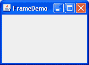
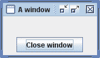
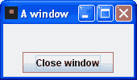

# 如何制作窗口（主窗口）

> 原文：[`docs.oracle.com/javase/tutorial/uiswing/components/frame.html`](https://docs.oracle.com/javase/tutorial/uiswing/components/frame.html)

窗口是具有标题和边框的顶级窗口。窗口的大小包括为边框指定的任何区域。可以使用`getInsets`方法获取边框区域的尺寸。由于边框区域包含在窗口的整体尺寸中，边框实际上遮挡了窗口的一部分，限制了用于渲染和/或显示子组件的区域为一个矩形，其左上角位置为`(insets.left`，`insets.top)`，大小为`width - (insets.left + insets.right)`乘以`height - (insets.top + insets.bottom)`。

作为[`JFrame`](https://docs.oracle.com/javase/8/docs/api/javax/swing/JFrame.html)类的实例实现的窗口具有装饰，如边框、标题，并支持关闭或最小化窗口的按钮组件。具有 GUI 的应用程序通常至少包括一个窗口。小程序有时也使用窗口。

要创建一个依赖于另一个窗口的窗口 — 例如在另一个窗口最小化时消失 — 请使用`dialog`而不是`frame.`。要创建出现在另一个窗口内的窗口，请使用内部窗口。

## 创建和显示窗口

这是`FrameDemo`演示应用程序创建的非常简单窗口的图片。您可以在`FrameDemo.java`中找到源代码。您可以[运行 FrameDemo](https://docs.oracle.com/javase/tutorialJWS/samples/uiswing/FrameDemoProject/FrameDemo.jnlp)（[下载 JDK 7 或更高版本](http://www.oracle.com/technetwork/java/javase/downloads/index.html)）。



以下`FrameDemo`代码显示了如何创建和设置窗口。

```java

//1\. Create the frame.
JFrame frame = new JFrame("FrameDemo");

//2\. Optional: What happens when the frame closes?
frame.setDefaultCloseOperation(JFrame.EXIT_ON_CLOSE);

//3\. Create components and put them in the frame.
*//...create emptyLabel...*
frame.getContentPane().add(emptyLabel, BorderLayout.CENTER);

//4\. Size the frame.
frame.pack();

//5\. Show it.
frame.setVisible(true);

```

以下是代码的一些细节：

1.  代码的第一行使用允许您设置窗口标题的构造函数创建了一个窗口。另一个经常使用的`JFrame`构造函数是无参数构造函数。

1.  接下来的代码指定了当用户关闭窗口时发生的情况。`EXIT_ON_CLOSE`操作在用户关闭窗口时退出程序。这种行为适用于此程序，因为程序只有一个窗口，关闭窗口会使程序变得无用。

    有关更多信息，请参阅响应窗口关闭事件。

1.  下一部分代码向窗口内容窗格添加了一个空标签。如果您还不熟悉内容窗格以及如何向其添加组件，请阅读向内容窗格添加组件。

    对于具有菜单的窗口，通常会使用`setJMenuBar`方法将菜单栏添加到窗口中。有关详细信息，请参阅如何使用菜单。

1.  `pack`方法调整框架大小，使得所有内容都达到或超过其首选大小。与`pack`相对的是通过调用`setSize`或`setBounds`（也设置框架位置）来明确建立框架大小。一般来说，使用`pack`比调用`setSize`更可取，因为`pack`让框架布局管理器负责框架大小，布局管理器擅长调整到平台依赖和其他影响组件大小的因素。

    这个示例没有设置框架位置，但可以使用`setLocationRelativeTo`或`setLocation`方法很容易地实现。例如，以下代码将框架居中显示在屏幕上：

    ```java
    frame.setLocationRelativeTo(null);

    ```

1.  调用`setVisible(true)`使框架显示在屏幕上。有时你可能会看到使用`show`方法。这两种用法是等效的，但为了一致性起见，我们使用`setVisible(true)`。

## 指定窗口装饰

默认情况下，窗口装饰由本机窗口系统提供。然而，你可以要求外观提供框架的装饰。你还可以指定框架根本没有窗口装饰，这是一个可以单独使用的功能，或者提供自己的装饰，或者与全屏独占模式一起使用。

除了指定谁提供窗口装饰，你还可以指定使用哪个图标来代表窗口。这个图标的使用方式取决于提供窗口装饰的窗口系统或外观。如果窗口系统支持最小化，那么图标将用于表示最小化的窗口。大多数窗口系统或外观也会在窗口装饰中显示图标。典型的图标大小是 16x16 像素，但有些窗口系统使用其他大小。

以下快照展示了三个相同的框架，除了它们的窗口装饰不同。通过每个框架中按钮的外观，你可以看出所有三个使用的是 Java 外观。第一个使用由窗口系统提供的装饰，这恰好是 Microsoft Windows，但也可以是运行 Java 平台的任何其他系统。第二个和第三个使用 Java 外观提供的窗口装饰。第三个框架使用 Java 外观提供的窗口装饰，但有一个自定义图标。

|  |  |  |
| --- | --- | --- |
| 由外观提供的窗口装饰 | 由窗口系统提供的窗口装饰 | 自定义图标；由外观提供的窗口装饰 |

这里有一个示例，创建一个带有自定义图标和由外观提供的窗口装饰的框架：

```java
//Ask for window decorations provided by the look and feel.
JFrame.setDefaultLookAndFeelDecorated(true);

//Create the frame.
JFrame frame = new JFrame("A window");

//Set the frame icon to an image loaded from a file.
frame.setIconImage(new ImageIcon(imgURL).getImage());

```

如前面的代码片段所示，您必须在创建希望影响其装饰的窗口之前调用`setDefaultLookAndFeelDecorated`方法。您使用`setDefaultLookAndFeelDecorated`设置的值将用于随后创建的所有`JFrame`。您可以通过调用`JFrame.setDefaultLookAndFeelDecorated(false)`来切换回使用窗口系统装饰。某些外观和感觉可能不支持窗口装饰；在这种情况下，将使用窗口系统装饰。

创建上述图片框架的应用程序的完整源代码在`FrameDemo2.java`中。除了显示如何选择窗口装饰外，FrameDemo2 还展示了如何禁用所有窗口装饰，并演示了定位窗口的示例。它包括两个创建用作图标的`Image`对象的方法 — 一个从文件加载，另一个从头开始绘制。

* * *

**试试这个：**

1.  单击“启动”按钮以使用[Java™ Web Start](http://www.oracle.com/technetwork/java/javase/javawebstart/index.html)运行 Frame Demo（[下载 JDK 7 或更高版本](http://www.oracle.com/technetwork/java/javase/downloads/index.html)）。或者，要自行编译和运行示例，请参考示例索引。

1.  弹出两个窗口，都带有外观提供的装饰，但具有不同的图标。

    Java 外观和感觉在其窗口装饰中显示图标。根据您的窗口系统，该图标可能会在其他地方用于表示窗口，特别是当窗口最小化时。

1.  弹出一个或多个带有窗口系统装饰的窗口。

    查看您的窗口系统是否以不同方式处理这些图标。

1.  弹出一个或多个没有窗口装饰的窗口。

    通过使用各种类型的窗口来查看窗口装饰、窗口系统和框架图标之间的交互。

* * *

## 响应窗口关闭事件

默认情况下，当用户在屏幕上关闭一个窗口时，该窗口会被隐藏。尽管不可见，窗口仍然存在，程序可以再次使其可见。如果您希望有不同的行为，则需要注册一个处理窗口关闭事件的窗口监听器，或者使用`setDefaultCloseOperation`方法指定默认关闭行为。您甚至可以两者都做。

`setDefaultCloseOperation`的参数必须是以下值之一，前三个值在[`WindowConstants`](https://docs.oracle.com/javase/8/docs/api/javax/swing/WindowConstants.html)接口中定义（由`JFrame`、`JInternalPane`和`JDialog`实现）：

`DO_NOTHING_ON_CLOSE`

当用户请求关闭窗口时不执行任何操作。相反，程序可能应该使用一个窗口监听器，在其`windowClosing`方法中执行其他操作。

`HIDE_ON_CLOSE`（`JDialog`和`JFrame`的默认值）

当用户关闭窗口时隐藏窗口。这将窗口从屏幕上移除，但保持可显示状态。

`DISPOSE_ON_CLOSE`（`JInternalFrame`的默认值）

当用户关闭窗口时隐藏并销毁窗口。这将窗口从屏幕上移除，并释放其使用的任何资源。

`EXIT_ON_CLOSE`（在[`JFrame`](https://docs.oracle.com/javase/8/docs/api/javax/swing/JFrame.html)类中定义）

退出应用程序，使用`System.exit(0)`。这仅适用于应用程序。如果在小程序中使用，可能会抛出`SecurityException`。

* * *

**注意：**

`DISPOSE_ON_CLOSE`如果屏幕上只有一个窗口，可能会产生与`EXIT_ON_CLOSE`类似的结果。更准确地说，当 Java 虚拟机（VM）中的最后一个可显示窗口被处理时，VM 可能会终止。详细信息请参见[AWT 线程问题](https://docs.oracle.com/javase/8/docs/api/java/awt/doc-files/AWTThreadIssues.html)。

* * *

默认关闭操作在任何窗口监听器处理窗口关闭事件之后执行。因此，例如，假设您指定默认关闭操作是销毁一个框架。您还实现了一个窗口监听器，测试框架是否是最后一个可见的框架，并在是的情况下保存一些数据并退出应用程序。在这些条件下，当用户关闭一个框架时，窗口监听器将首先被调用。如果它没有退出应用程序，那么默认关闭操作 — 销毁框架 — 将会被执行。

有关处理窗口关闭事件的更多信息，请参见如何编写窗口监听器。除了处理窗口关闭事件外，窗口监听器还可以对其他窗口状态更改做出反应，例如图标化和激活。

## 框架 API

以下表列出了常用的`JFrame`构造函数和方法。您可能想调用的其他方法由[`java.awt.Frame`](https://docs.oracle.com/javase/8/docs/api/java/awt/Frame.html)、[`java.awt.Window`](https://docs.oracle.com/javase/8/docs/api/java/awt/Window.html)和[`java.awt.Component`](https://docs.oracle.com/javase/8/docs/api/java/awt/Component.html)类定义，`JFrame`继承自这些类。

因为每个`JFrame`对象都有一个根窗格，所以框架支持在框架子元素前插入输入和绘制行为，将子元素放置在不同的“层”上，并支持 Swing 菜单栏。这些主题在使用顶级容器中介绍，并在如何使用根窗格中详细解释。

用于使用框架的 API 分为以下几类：

+   创建和设置框架

+   设置窗口大小和位置

+   与根窗格相关的方法

创建和设置一个窗口

| 方法或构造函数 | 目的 |
| --- | --- |
| [JFrame()](https://docs.oracle.com/javase/8/docs/api/javax/swing/JFrame.html#JFrame--) [JFrame(String)](https://docs.oracle.com/javase/8/docs/api/javax/swing/JFrame.html#JFrame-java.lang.String-) | 创建一个最初不可见的窗口。`String`参数为窗口提供标题。要使窗口可见，请在其上调用`setVisible(true)`。 |

| [void setDefaultCloseOperation(int)](https://docs.oracle.com/javase/8/docs/api/javax/swing/JFrame.html#setDefaultCloseOperation-int-) [int getDefaultCloseOperation()](https://docs.oracle.com/javase/8/docs/api/javax/swing/JFrame.html#getDefaultCloseOperation--) | 设置或获取用户在此窗口上按下关闭按钮时发生的操作。可能的选择是：

+   `DO_NOTHING_ON_CLOSE`

+   `HIDE_ON_CLOSE`

+   `DISPOSE_ON_CLOSE`

+   `EXIT_ON_CLOSE`

前三个常量在[`WindowConstants`](https://docs.oracle.com/javase/8/docs/api/javax/swing/WindowConstants.html)接口中定义，`JFrame`实现了该接口。`EXIT_ON_CLOSE`常量在[`JFrame`](https://docs.oracle.com/javase/8/docs/api/javax/swing/JFrame.html)类中定义。 |

| [void setIconImage(Image)](https://docs.oracle.com/javase/8/docs/api/java/awt/Frame.html#setIconImage-java.awt.Image-) [Image getIconImage()](https://docs.oracle.com/javase/8/docs/api/java/awt/Frame.html#getIconImage--)

*(in `Frame`)* | 设置或获取表示窗口的图标。请注意，参数是一个[java.awt.Image](https://docs.oracle.com/javase/8/docs/api/java/awt/Image.html)对象，而不是`javax.swing.ImageIcon`（或任何其他`javax.swing.Icon`实现）。 |

| [void setTitle(String)](https://docs.oracle.com/javase/8/docs/api/java/awt/Frame.html#setTitle-java.lang.String-) [String getTitle()](https://docs.oracle.com/javase/8/docs/api/java/awt/Frame.html#getTitle--)

*(in `Frame`)* | 设置或获取窗口标题。 |

| [void setUndecorated(boolean)](https://docs.oracle.com/javase/8/docs/api/java/awt/Frame.html#setUndecorated-boolean-) [boolean isUndecorated()](https://docs.oracle.com/javase/8/docs/api/java/awt/Frame.html#isUndecorated--)

*(in `Frame`)* | 设置或获取此窗口是否应该装饰。仅在窗口尚未可显示（未打包或显示）时才有效。通常与全屏独占模式一起使用，或者启用自定义窗口装饰。 |

| [static void setDefaultLookAndFeelDecorated(boolean)](https://docs.oracle.com/javase/8/docs/api/javax/swing/JFrame.html#setDefaultLookAndFeelDecorated-boolean-) [static boolean isDefaultLookAndFeelDecorated()](https://docs.oracle.com/javase/8/docs/api/javax/swing/JFrame.html#isDefaultLookAndFeelDecorated--) | 确定随后创建的`JFrame`是否应由当前外观提供其窗口装饰（如边框和用于关闭窗口的小部件）。请注意，这只是一个提示，因为某些外观可能不支持此功能。 |
| --- | --- |

设置窗口大小和位置

| 方法 | 目的 |
| --- | --- |
| [void pack()](https://docs.oracle.com/javase/8/docs/api/java/awt/Window.html#pack--) *(在`Window`中)* | 调整窗口大小，使其所有内容都达到或超过其首选大小。 |

| [void setSize(int, int)](https://docs.oracle.com/javase/8/docs/api/java/awt/Component.html#setSize-int-int-) [void setSize(Dimension)](https://docs.oracle.com/javase/8/docs/api/java/awt/Component.html#setSize-java.awt.Dimension-)

[Dimension getSize()](https://docs.oracle.com/javase/8/docs/api/java/awt/Component.html#getSize--)

*(在`Component`中)* | 设置或获取窗口的总大小。`setSize`的整数参数分别指定宽度和高度。|

| [void setBounds(int, int, int, int)](https://docs.oracle.com/javase/8/docs/api/java/awt/Component.html#setBounds-int-int-int-int-) [void setBounds(Rectangle)](https://docs.oracle.com/javase/8/docs/api/java/awt/Component.html#setBounds-java.awt.Rectangle-)

[Rectangle getBounds()](https://docs.oracle.com/javase/8/docs/api/java/awt/Component.html#getBounds--)

*(在`Component`中)* | 设置或获取窗口的大小和位置。对于`setBounds`的整数版本，窗口的左上角位于由前两个参数指定的*x, y*位置，并具有由最后两个参数指定的宽度和高度。|

| [void setLocation(int, int)](https://docs.oracle.com/javase/8/docs/api/java/awt/Component.html#setLocation-int-int-) [Point getLocation()](https://docs.oracle.com/javase/8/docs/api/java/awt/Component.html#getLocation--)

*(在`Component`中)* | 设置或获取窗口左上角的位置。参数分别是*x*和*y*的值。|

| [void setLocationRelativeTo(Component)](https://docs.oracle.com/javase/8/docs/api/java/awt/Window.html#setLocationRelativeTo-java.awt.Component-) *(在`Window`中)* | 将窗口定位在指定组件的中心。如果参数为`null`，窗口将居中显示在屏幕上。要正确居中窗口，应在设置窗口大小后调用此方法。 |
| --- | --- |

与根窗格相关的方法

| 方法 | 目的 |
| --- | --- |
| [void setContentPane(Container)](https://docs.oracle.com/javase/8/docs/api/javax/swing/JFrame.html#setContentPane-java.awt.Container-) [Container getContentPane()](https://docs.oracle.com/javase/8/docs/api/javax/swing/JFrame.html#getContentPane--) | 设置或获取框架的内容窗格。内容窗格包含框架内可见的 GUI 组件。 |

| [JRootPane createRootPane()](https://docs.oracle.com/javase/8/docs/api/javax/swing/JFrame.html#createRootPane--) [void setRootPane(JRootPane)](https://docs.oracle.com/javase/8/docs/api/javax/swing/JFrame.html#setRootPane-javax.swing.JRootPane-)

[JRootPane getRootPane()](https://docs.oracle.com/javase/8/docs/api/javax/swing/JFrame.html#getRootPane--) | 创建、设置或获取框架的根窗格。根窗格管理框架的内部，包括内容窗格、玻璃窗格等。

| [void setJMenuBar(JMenuBar)](https://docs.oracle.com/javase/8/docs/api/javax/swing/JFrame.html#setJMenuBar-javax.swing.JMenuBar-) [JMenuBar getJMenuBar()](https://docs.oracle.com/javase/8/docs/api/javax/swing/JFrame.html#getJMenuBar--) | 设置或获取框架的菜单栏，以管理框架的一组菜单。 |
| --- | --- |
| [void setGlassPane(Component)](https://docs.oracle.com/javase/8/docs/api/javax/swing/JFrame.html#setGlassPane-java.awt.Component-) [Component getGlassPane()](https://docs.oracle.com/javase/8/docs/api/javax/swing/JFrame.html#getGlassPane--) | 设置或获取框架的玻璃窗格。您可以使用玻璃窗格拦截鼠标事件或在程序 GUI 的顶部绘制。 |
| [void setLayeredPane(JLayeredPane)](https://docs.oracle.com/javase/8/docs/api/javax/swing/JFrame.html#setLayeredPane-javax.swing.JLayeredPane-) [JLayeredPane getLayeredPane()](https://docs.oracle.com/javase/8/docs/api/javax/swing/JFrame.html#getLayeredPane--) | 设置或获取框架的分层窗格。您可以使用框架的分层窗格将组件放置在其他组件的前面或后面。 |

## 使用框架的示例

本教程中的所有独立应用程序都使用`JFrame`。以下表格列出了一些应用程序，并告诉您每个应用程序的讨论位置。

| 示例 | 描述位置 | 备注 |
| --- | --- | --- |
| `FrameDemo` | 示例说明 | 显示一个带有一个组件的基本框架。 |
| `FrameDemo2` | 指定窗口装饰 | 允许您创建具有各种窗口装饰的框架。 |
| `Framework` | — | 研究如何创建和销毁窗口，实现菜单栏以及退出应用程序。 |
| `LayeredPaneDemo` | 如何使用分层窗格 | 演示如何使用分层窗格（但不是框架的分层窗格）。 |
| `GlassPaneDemo` | 玻璃窗格 | 演示了框架玻璃窗格的使用。 |
| `MenuDemo` | 如何使用菜单 | 展示如何将`JMenuBar`放入`JFrame`中。 |
