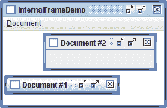

# 如何使用内部窗体

> 原文：[`docs.oracle.com/javase/tutorial/uiswing/components/internalframe.html`](https://docs.oracle.com/javase/tutorial/uiswing/components/internalframe.html)

使用 [`JInternalFrame`](https://docs.oracle.com/javase/8/docs/api/javax/swing/JInternalFrame.html) 类，您可以在另一个窗口内显示类似 `JFrame` 的窗口。通常，您将内部窗体添加到桌面窗格中。桌面窗格反过来可能被用作 `JFrame` 的内容窗格。桌面窗格是 [`JDesktopPane`](https://docs.oracle.com/javase/8/docs/api/javax/swing/JDesktopPane.html) 的一个实例，它是 `JLayeredPane` 的子类，具有用于管理多个重叠内部窗体的附加 API。

您应该仔细考虑是否要围绕框架或内部窗体构建程序的 GUI。从内部窗体切换到框架或反之并不一定是一项简单的任务。通过尝试框架和内部窗体，您可以了解选择其中一个的权衡。

这是一个应用程序的图片，其中有两个内部窗体（其中一个被图标化）在一个常规窗体内：



* * *

**试试这个：**

1.  点击“启动”按钮以使用 [Java™ Web Start](http://www.oracle.com/technetwork/java/javase/javawebstart/index.html) 运行 InternalFrameDemo（[下载 JDK 7 或更高版本](http://www.oracle.com/technetwork/java/javase/downloads/index.html)）。或者，要自行编译和运行示例，请参考 示例索引。

1.  使用“文档”菜单中的“创建”项创建新的内部窗体。

    每个内部窗体都会在前一个内部窗体首次出现的位置下方和右方 `30 像素` 的位置弹出。这一功能在 `MyInternalFrame` 类中实现，该类是 `JInternalFrame` 的自定义子类。

* * *

下面的代码取自 `InternalFrameDemo.java`，在前一个示例中创建了桌面和内部窗体。

```java
*...//In the constructor of InternalFrameDemo, a JFrame subclass:*
    desktop = new JDesktopPane();
    createFrame(); //Create first window
    setContentPane(desktop);
    ...
    //Make dragging a little faster but perhaps uglier.
    desktop.setDragMode(JDesktopPane.OUTLINE_DRAG_MODE);
...
protected void createFrame() {
    MyInternalFrame frame = new MyInternalFrame();
    frame.setVisible(true);
    desktop.add(frame);
    try {
        frame.setSelected(true);
    } catch (java.beans.PropertyVetoException e) {}
}

*...//In the constructor of MyInternalFrame, a JInternalFrame subclass:*
static int openFrameCount = 0;
static final int xOffset = 30, yOffset = 30;

public MyInternalFrame() {
    super("Document #" + (++openFrameCount),
          true, //resizable
          true, //closable
          true, //maximizable
          true);//iconifiable
    //...Create the GUI and put it in the window...
    //...Then set the window size or call pack...
    ...
    //Set the window's location.
    setLocation(xOffset*openFrameCount, yOffset*openFrameCount);
}

```

## 内部窗体 vs. 常规框架

使用内部窗体的代码在许多方面与使用常规 Swing 框架的代码类似。因为内部窗体有根窗格，为 `JInternalFrame` 设置 GUI 与为 `JFrame` 设置 GUI 非常相似。`JInternalFrame` 还提供其他 API，例如 `pack`，使其类似于 `JFrame`。

* * *

**注意：**

与常规框架一样，您必须在内部框架上调用 `setVisible(true)` 或 `show()` 才能显示它。内部框架直到您明确使其可见为止才会出现。

* * *

内部框架不是窗口或顶级容器，这使它们与框架不同。例如，您必须将内部框架添加到容器中（通常是 `JDesktopPane`）；内部框架不能是包含层次结构的根。此外，内部框架不会生成窗口事件。相反，会导致框架触发窗口事件的用户操作会导致内部框架触发内部框架事件。

由于内部框架是使用与平台无关的代码实现的，它们提供了一些框架无法提供的功能。其中一个功能是，内部框架比框架更具有控制其状态和功能的能力。您可以以编程方式将内部框架图标化或最大化。您还可以指定要放在内部框架标题栏中的图标。您甚至可以指定内部框架是否具有支持调整大小、图标化、关闭和最大化的窗口装饰。

另一个特点是内部框架设计用于在桌面窗格内工作。`JInternalFrame` API 包含诸如 `moveToFront` 这样的方法，只有当内部框架的容器是分层窗格（如 `JDesktopPane`）时才有效。

## 使用内部框架的规则

如果您已经使用 `JFrame` 和其他 Swing 组件构建过任何程序，那么您已经了解了如何使用内部框架的很多知识。以下列表总结了使用内部框架的规则。有关更多信息，请参阅如何创建框架和 JComponent 类。

**您必须设置内部框架的大小。**

如果您不设置内部框架的大小，它将具有零大小，因此永远不会可见。您可以使用以下方法之一设置大小：`setSize`、`pack` 或 `setBounds`。

**通常情况下，您应该设置内部框架的位置。**

如果您不设置内部框架的位置，它将出现在 0,0（其容器的左上角）。您可以使用 `setLocation` 或 `setBounds` 方法指定内部框架相对于其容器的左上点。

**要向内部框架添加组件，您需要将它们添加到内部框架的内容窗格中。**

这与 `JFrame` 的情况完全相同。有关详细信息，请参阅将组件添加到内容窗格。

**内部框架的对话框应该使用 `JOptionPane` 或 `JInternalFrame` 实现，而不是 `JDialog`。**

要创建一个简单的对话框，您可以使用 `JOptionPane` 的 `showInternal*Xxx*Dialog` 方法，如如何创建对话框中所述。

**你必须将内部框架添加到容器中。**

如果您不将内部框架添加到容器中（通常是 `JDesktopPane`），则内部框架将不会显示。

**您需要在内部框架上调用 `show` 或 `setVisible`。**

内部窗体默认是不可见的。您必须调用`setVisible(true)`或`show()`使其可见。

**内部窗体触发内部窗体事件，而不是窗口事件。**

处理内部窗体事件几乎与处理窗口事件相同。有关更多信息，请参阅 How to Write an Internal Frame Listener。

* * *

**性能提示：**

当桌面上有许多内部窗体时，用户可能会注意到移动它们似乎很慢。轮廓拖动是避免这个问题的一种方法。使用轮廓拖动时，只有内部窗体的轮廓在当前鼠标位置绘制，而内部窗体被拖动时不会重新绘制。内部窗体的内容在停止拖动之前不会在新位置重新绘制。默认行为（称为*实时*拖动）是在移动时连续重新定位和重绘部分或全部内部窗体；如果桌面上有许多内部窗体，这可能会很慢。

使用`JDesktopPane`方法`setDragMode`*来指定轮廓拖动。例如：

```java
desktop.setDragMode(JDesktopPane.OUTLINE_DRAG_MODE);

```

* * *

## 内部窗体 API

下表列出了常用的`JInternalFrame`构造函数和方法，以及`JDesktopPane`提供的一些方法。除了本节列出的 API 之外，`JInternalFrame`还从其父类`JComponent`、`Component`和`Container`继承了有用的 API。请参阅 The JComponent Class 以查看这些类的方法列表。

与`JInternalFrame`类似，`JDesktopPane`也是从`JComponent`继承而来，因此提供了 The JComponent Class 中描述的方法。由于`JDesktopPane`扩展自`JLayeredPane`，它还支持 The Layered Pane API 中描述的方法。

使用内部窗体的 API 可分为以下几类：

+   创建内部窗体

+   向内部窗体添加组件

+   指定内部窗体的可见性、大小和位置

+   在内部窗体上执行窗口操作

+   控制窗口装饰和功能

+   使用 JDesktopPane API

创建内部窗体

| 构造函数或方法 | 目的 |
| --- | --- |

| [JInternalFrame()](https://docs.oracle.com/javase/8/docs/api/javax/swing/JInternalFrame.html#JInternalFrame--) [JInternalFrame(String)](https://docs.oracle.com/javase/8/docs/api/javax/swing/JInternalFrame.html#JInternalFrame-java.lang.String-)

[JInternalFrame(String, boolean)](https://docs.oracle.com/javase/8/docs/api/javax/swing/JInternalFrame.html#JInternalFrame-java.lang.String-boolean-)

[JInternalFrame(String, boolean, boolean)](https://docs.oracle.com/javase/8/docs/api/javax/swing/JInternalFrame.html#JInternalFrame-java.lang.String-boolean-boolean-)

[JInternalFrame(String, boolean, boolean, boolean)](https://docs.oracle.com/javase/8/docs/api/javax/swing/JInternalFrame.html#JInternalFrame-java.lang.String-boolean-boolean-boolean-)

[JInternalFrame(String, boolean, boolean, boolean, boolean)](https://docs.oracle.com/javase/8/docs/api/javax/swing/JInternalFrame.html#JInternalFrame-java.lang.String-boolean-boolean-boolean-boolean-) | 创建一个`JInternalFrame`实例。第一个参数指定内部框架要显示的标题（如果有）。其余参数指定内部框架是否应包含允许用户调整大小、关闭、最大化和最小化内部框架的装饰（按照指定的顺序）。每个布尔参数的默认值为`false`，表示不允许该操作。 |

| [静态整数 showInternalConfirmDialog(Component, Object)](https://docs.oracle.com/javase/8/docs/api/javax/swing/JOptionPane.html#showInternalConfirmDialog-java.awt.Component-java.lang.Object-) [静态字符串 showInternalInputDialog(Component, Object)](https://docs.oracle.com/javase/8/docs/api/javax/swing/JOptionPane.html#showInternalInputDialog-java.awt.Component-java.lang.Object-) | 显示内部确认对话框或输入对话框。 |

[静态对象 showInternalMessageDialog(Component, Object)](https://docs.oracle.com/javase/8/docs/api/javax/swing/JOptionPane.html#showInternalMessageDialog-java.awt.Component-java.lang.Object-)

[静态整数 showInternalOptionDialog(Component, Object, String, int, int, Icon, Object[], Object)](https://docs.oracle.com/javase/8/docs/api/javax/swing/JOptionPane.html#showInternalOptionDialog-java.awt.Component-java.lang.Object-java.lang.String-int-int-javax.swing.Icon-java.lang.Object:A-java.lang.Object-) | 创建一个模拟对话框的`JInternalFrame`。有关详细信息，请参阅如何制作对话框。 |

添加组件到内部框架

| 方法 | 目的 |
| --- | --- |
| [void setContentPane(Container)](https://docs.oracle.com/javase/8/docs/api/javax/swing/JInternalFrame.html#setContentPane-java.awt.Container-) [Container getContentPane()](https://docs.oracle.com/javase/8/docs/api/javax/swing/JInternalFrame.html#getContentPane--) | 设置或获取内部框架的内容窗格，通常包含内部框架的所有 GUI，除了菜单栏和窗口装饰。 |
| [void setJMenuBar(JMenuBar)](https://docs.oracle.com/javase/8/docs/api/javax/swing/JInternalFrame.html#setJMenuBar-javax.swing.JMenuBar-) [JMenuBar getJMenuBar()](https://docs.oracle.com/javase/8/docs/api/javax/swing/JInternalFrame.html#getJMenuBar--) | 设置或获取内部框架的菜单栏。 |
| [void setLayeredPane(JLayeredPane)](https://docs.oracle.com/javase/8/docs/api/javax/swing/JInternalFrame.html#setLayeredPane-javax.swing.JLayeredPane-) [JLayeredPane getLayeredPane()](https://docs.oracle.com/javase/8/docs/api/javax/swing/JInternalFrame.html#getLayeredPane--) | 设置或获取内部框架的分层窗格。 |

指定内部框架的可见性、大小和位置

| 方法 | 目的 |
| --- | --- |
| [void setVisible(boolean)](https://docs.oracle.com/javase/8/docs/api/javax/swing/JComponent.html#setVisible-boolean-) | 使内部框架可见（如果为`true`）或不可见（如果为`false`）。在将每个`JInternalFrame`添加到其容器之前，应调用`setVisible(true)`。（从`Component`继承）。 |
| [void pack()](https://docs.oracle.com/javase/8/docs/api/javax/swing/JInternalFrame.html#pack--) | 调整内部框架的大小，使其组件达到其首选大小。 |
| [void setLocation(Point)](https://docs.oracle.com/javase/8/docs/api/java/awt/Component.html#setLocation-java.awt.Point-) [void setLocation(int, int)](https://docs.oracle.com/javase/8/docs/api/java/awt/Component.html#setLocation-int-int-) | 设置内部框架的位置。（从`Component`继承）。 |
| [void setBounds(Rectangle)](https://docs.oracle.com/javase/8/docs/api/java/awt/Component.html#setBounds-java.awt.Rectangle-) [void setBounds(int, int, int, int)](https://docs.oracle.com/javase/8/docs/api/java/awt/Component.html#setBounds-int-int-int-int-) | 明确设置内部框架的大小和位置。（从`Component`继承）。 |
| [void setSize(Dimension)](https://docs.oracle.com/javase/8/docs/api/java/awt/Component.html#setSize-java.awt.Dimension-) [void setSize(int, int)](https://docs.oracle.com/javase/8/docs/api/java/awt/Component.html#setSize-int-int-) | 明确设置内部框架的大小。（从`Component`继承）。 |

执行内部框架的窗口操作

| 方法 | 目的 |
| --- | --- |
| [void setDefaultCloseOperation(int)](https://docs.oracle.com/javase/8/docs/api/javax/swing/JInternalFrame.html#setDefaultCloseOperation-int-) [int getDefaultCloseOperation()](https://docs.oracle.com/javase/8/docs/api/javax/swing/JInternalFrame.html#getDefaultCloseOperation--) | 设置或获取用户尝试“关闭”内部框架时内部框架的操作。默认值为`DISPOSE_ON_CLOSE`。其他可能的值为`DO_NOTHING_ON_CLOSE`和`HIDE_ON_CLOSE`。详细信息请参见响应窗口关闭事件。 |
| [void addInternalFrameListener(InternalFrameListener)](https://docs.oracle.com/javase/8/docs/api/javax/swing/JInternalFrame.html#addInternalFrameListener-javax.swing.event.InternalFrameListener-) [void removeInternalFrameListener(InternalFrameListener)](https://docs.oracle.com/javase/8/docs/api/javax/swing/JInternalFrame.html#removeInternalFrameListener-javax.swing.event.InternalFrameListener-) | 添加或移除内部框架监听器（`JInternalFrame`的窗口监听器等效）。有关更多信息，请参见如何编写内部框架监听器。 |
| [void moveToFront()](https://docs.oracle.com/javase/8/docs/api/javax/swing/JInternalFrame.html#moveToFront--) [void moveToBack()](https://docs.oracle.com/javase/8/docs/api/javax/swing/JInternalFrame.html#moveToBack--) | 如果内部框架的父级是分层窗格，如桌面窗格，则将内部框架移动到其层的前端或后端（分别）。 |
| [void setClosed(boolean)](https://docs.oracle.com/javase/8/docs/api/javax/swing/JInternalFrame.html#setClosed-boolean-) [boolean isClosed()](https://docs.oracle.com/javase/8/docs/api/javax/swing/JInternalFrame.html#isClosed--) | 设置或获取内部框架当前是否关闭。`setClosed`的参数必须为`true`。重新打开已关闭的内部框架时，您需要将其设置为可见并添加到容器中（通常是您最初添加的桌面窗格）。 |
| [void setIcon(boolean)](https://docs.oracle.com/javase/8/docs/api/javax/swing/JInternalFrame.html#setIcon-boolean-) [boolean isIcon()](https://docs.oracle.com/javase/8/docs/api/javax/swing/JInternalFrame.html#isIcon--) | 将内部框架图标化或取消图标化，或确定其当前是否已图标化。 |
| [void setMaximum(boolean)](https://docs.oracle.com/javase/8/docs/api/javax/swing/JInternalFrame.html#setMaximum-boolean-) [boolean isMaximum()](https://docs.oracle.com/javase/8/docs/api/javax/swing/JInternalFrame.html#isMaximum--) | 最大化或恢复内部框架，或确定其是否已最大化。 |
| [void setSelected(boolean)](https://docs.oracle.com/javase/8/docs/api/javax/swing/JInternalFrame.html#setSelected-boolean-) [boolean isSelected()](https://docs.oracle.com/javase/8/docs/api/javax/swing/JInternalFrame.html#isSelected--) | 设置或获取内部框架当前是否为“选定”（激活）的内部框架。 |

控制窗口装饰和功能

| 方法 | 目的 |
| --- | --- |
| [void setFrameIcon(Icon)](https://docs.oracle.com/javase/8/docs/api/javax/swing/JInternalFrame.html#setFrameIcon-javax.swing.Icon-) [Icon getFrameIcon()](https://docs.oracle.com/javase/8/docs/api/javax/swing/JInternalFrame.html#getFrameIcon--) | 设置或获取显示在内部框架标题栏中的图标（通常位于左上角）。 |
| [void setClosable(boolean)](https://docs.oracle.com/javase/8/docs/api/javax/swing/JInternalFrame.html#setClosable-boolean-) [boolean isClosable()](https://docs.oracle.com/javase/8/docs/api/javax/swing/JInternalFrame.html#isClosable--) | 设置或获取用户是否可以关闭内部框架。 |
| [void setIconifiable(boolean)](https://docs.oracle.com/javase/8/docs/api/javax/swing/JInternalFrame.html#setIconifiable-boolean-) [boolean isIconifiable()](https://docs.oracle.com/javase/8/docs/api/javax/swing/JInternalFrame.html#isIconifiable--) | 设置或获取内部框架是否可以图标化。 |
| [void setMaximizable(boolean)](https://docs.oracle.com/javase/8/docs/api/javax/swing/JInternalFrame.html#setMaximizable-boolean-) [boolean isMaximizable()](https://docs.oracle.com/javase/8/docs/api/javax/swing/JInternalFrame.html#isMaximizable--) | 设置或获取用户是否可以最大化此内部框架。 |
| [void setResizable(boolean)](https://docs.oracle.com/javase/8/docs/api/javax/swing/JInternalFrame.html#setResizable-boolean-) [boolean isResizable()](https://docs.oracle.com/javase/8/docs/api/javax/swing/JInternalFrame.html#isResizable--) | 设置或获取内部框架是否可以调整大小。 |
| [void setTitle(String)](https://docs.oracle.com/javase/8/docs/api/javax/swing/JInternalFrame.html#setTitle-java.lang.String-) [String getTitle()](https://docs.oracle.com/javase/8/docs/api/javax/swing/JInternalFrame.html#getTitle--) | 设置或获取窗口标题。 |

使用`JDesktopPane` API

| 构造函数或方法 | 目的 |
| --- | --- |
| [JDesktopPane()](https://docs.oracle.com/javase/8/docs/api/javax/swing/JDesktopPane.html#JDesktopPane--) | 创建一个新的`JDesktopPane`实例。 |
| [JInternalFrame[] getAllFrames()](https://docs.oracle.com/javase/8/docs/api/javax/swing/JDesktopPane.html#getAllFrames--) | 返回桌面包含的所有`JInternalFrame`对象。 |
| [JInternalFrame[] getAllFramesInLayer(int)](https://docs.oracle.com/javase/8/docs/api/javax/swing/JDesktopPane.html#getAllFramesInLayer-int-) | 返回桌面包含的在指定层中的所有`JInternalFrame`对象。有关层的信息，请参阅如何使用分层窗格。 |
| [void setDragMode(int)](https://docs.oracle.com/javase/8/docs/api/javax/swing/JDesktopPane.html#setDragMode-int-) [int getDragMode()](https://docs.oracle.com/javase/8/docs/api/javax/swing/JDesktopPane.html#getDragMode--) | 设置或获取此桌面中内部框架使用的拖动模式。整数可以是`JDesktopPane.LIVE_DRAG_MODE`或`JDesktopPane.OUTLINE_DRAG_MODE`。Java 外观的默认值是实时拖动模式。 |

## 使用内部框架的示例

以下示例使用内部框架。由于内部框架类似于常规框架，您还应查看使用框架的示例。

| 示例 | 描述位置 | 注释 |
| --- | --- | --- |
| `MyInternalFrame` | 本页。 | 实现一个出现在先前创建的内部框架偏移位置的内部框架。 |
| `InternalFrameDemo` | 本页。 | 允许您创建进入应用程序的`JDesktopPane`的内部框架（`MyInternalFrame`的实例）。 |
| `InternalFrameEventDemo` | 如何编写内部框架侦听器 | 演示监听内部框架事件。还演示了在桌面窗格内定位内部框架。 |
