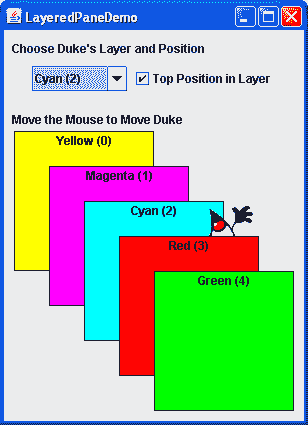
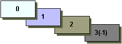
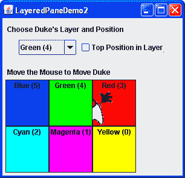

# 如何使用分层窗格

> 原文：[`docs.oracle.com/javase/tutorial/uiswing/components/layeredpane.html`](https://docs.oracle.com/javase/tutorial/uiswing/components/layeredpane.html)

分层窗格是一个提供第三维度用于定位组件的 Swing 容器：*深度*，也称为*Z 顺序*。将组件添加到分层窗格时，您将其深度指定为整数。数字越高，组件越接近容器内的“顶部”位置。如果组件重叠，那么“更接近”的组件将绘制在深度较低的组件之上。在相同深度的组件之间的关系由它们在深度内的位置决定。

* * *

**注意：**

AWT 容器具有一个 API，允许您操纵组件的*Z 顺序*。更多信息，请参阅[AWT 焦点规范](https://docs.oracle.com/javase/8/docs/api/java/awt/doc-files/FocusSpec.html#ZOrder)。

* * *

每个具有根窗格的 Swing 容器 — 例如`JFrame`、`JApplet`、`JDialog`或`JInternalFrame` — 都会自动拥有一个分层窗格。大多数程序不会显式使用根窗格的分层窗格，因此本节不会讨论它。您可以在根窗格中找到有关它的信息，该部分提供了概述，以及分层窗格，其中包含更多详细信息。本节告诉您如何创建自己的分层窗格，并在任何可以使用常规 Swing 容器的地方使用它。

Swing 提供了两个分层窗格类。第一个是[`JLayeredPane`](https://docs.oracle.com/javase/8/docs/api/javax/swing/JLayeredPane.html)，是根窗格使用的类，也是本节示例中使用的类。第二个是`JDesktopPane`，是一个专门用于容纳内部窗格的`JLayeredPane`子类。有关使用`JDesktopPane`的示例，请参阅如何使用内部窗格。

这是一个创建分层窗格并在不同深度放置重叠的彩色标签的应用程序图片：



* * *

**试试这个：**

1.  单击“启动”按钮以使用[Java™ Web Start](http://www.oracle.com/technetwork/java/javase/javawebstart/index.html)运行 LayeredPane Demo（[下载 JDK 7 或更高版本](http://www.oracle.com/technetwork/java/javase/downloads/index.html)）。或者，要自行编译和运行示例，请参阅示例索引。

1.  在窗口的下部四处移动鼠标。杜克的图像在绿色和红色标签后面拖动，但在其他三个标签前面。

1.  使用窗口顶部的组合框更改杜克的深度。使用复选框设置杜克是否在当前深度内的顶部位置 — 位置 0。

* * *

这里是`LayeredPaneDemo.java`中创建分层窗格的代码：

```java
layeredPane = new JLayeredPane();
layeredPane.setPreferredSize(new Dimension(300, 310));
layeredPane.setBorder(BorderFactory.createTitledBorder(
                                    "Move the Mouse to Move Duke"));
layeredPane.addMouseMotionListener(new MouseMotionAdapter() {
    ...
});

```

代码使用了`JLayeredPane`的唯一构造函数 — 无参数构造函数 — 来创建分层窗格。其余代码使用从超类继承的方法为分层窗格设置首选大小和边框，并向其添加鼠标移动监听器。鼠标移动监听器只是根据鼠标移动来移动杜克形象。虽然我们这里没有展示代码，但示例将分层窗格添加到了框架的内容窗格中。

正如我们稍后将展示的，您可以使用`add`方法将组件添加到分层窗格中。当向分层窗格添加组件时，您需要指定组件的深度，并可选地指定其在深度内的位置。演示程序中的分层窗格包含六个标签 — 五个彩色标签和一个显示杜克形象的标签。正如程序所示，组件的深度和其在该深度内的位置都可以动态更改。

本节的其余部分涵盖了以下主题：

+   添加组件和设置组件深度

+   设置组件在其深度内的位置

+   在分层窗格中布局组件

+   分层窗格 API

+   使用分层窗格的示例

## 添加组件和设置组件深度

这里是示例程序中将彩色标签添加到分层窗格的代码：

```java
for (int i = 0; i < *...number of labels...*; i++) {
    JLabel label = createColoredLabel(*...*);
    layeredPane.add(label, new Integer(i));
    ...
}

```

你可以在程序的源代码中找到`createColoredLabel`方法的实现。它只是创建了一个带有背景颜色、边框、一些文本和大小的不透明`JLabel`。

示例程序使用了`add`方法的两个参数版本。第一个参数是要添加的组件，第二个是一个`Integer`对象，指定深度。该程序使用`for`循环迭代变量来指定深度。实际值并不重要，重要的是深度的相对值以及在程序中如何一致地使用每个深度。

* * *

**注意：**

如果您使用根窗格的分层窗格，请确保使用其深度约定。有关详细信息，请参阅分层窗格。该部分向您展示如何修改`LayeredPaneDemo`以使用根窗格的分层窗格。通过这些修改，您可以看到拖动杜克形象与控制面板中的组合框之间的关系。

* * *

如示例程序所示，如果组件重叠，深度较高的组件位于深度较低的组件之上。要动态更改组件深度，请使用`setLayer`方法。在示例中，用户可以通过从组合框中进行选择来更改 Duke 的层。以下是注册在组合框上的动作监听器的`actionPerformed`方法：

```java
public void actionPerformed(ActionEvent e) {
    int position = onTop.isSelected() ? 0 : 1;
    layeredPane.setLayer(dukeLabel,
                         layerList.getSelectedIndex(),
                         position);
}

```

这里使用的`setLayer`方法需要三个参数：要设置深度的组件、新深度以及深度内的位置。`JLayeredPane`有一个只接受组件和新深度两个参数的`setLayer`版本。该方法将组件放在其深度的底部位置。

* * *

**注意：**

将组件添加到分层窗格时，您需要用一个`Integer`指定层。当使用`setLayer`来更改组件的层时，您需要使用一个`int`。您可能会认为，如果您在`add`方法中使用`int`而不是`Integer`，编译器会抱怨或您的程序会抛出非法参数异常。但编译器什么也不说，这导致了一个常见的分层窗格问题。您可以使用本节末尾的 API 表格来检查处理层的方法的参数和返回值的类型。

* * *

## 设置组件在其深度内的位置

以下代码创建显示 Duke 图像的标签，然后将标签添加到分层窗格中。

```java
final ImageIcon icon = createImageIcon("images/dukeWaveRed.gif");
...
dukeLabel = new JLabel(icon);
...
dukeLabel.setBounds(15, 225,
                    icon.getIconWidth(),
                    icon.getIconHeight());
...
layeredPane.add(dukeLabel, new Integer(2), 0);

```

此代码使用`add`方法的三个参数版本。第三个参数指定了 Duke 标签在其深度内的位置，这决定了组件与同一深度的其他组件的关系。

位置用介于-1 和(*n* - 1)之间的`int`指定，其中*n*是深度中组件的数量。与层号不同，位置数字越小，组件在其深度内的位置越高。使用-1 与使用*n* - 1 相同；它表示最底部的位置。使用 0 指定组件应位于其深度内的最顶部位置。如下图所示，除了-1 外，较低的位置数字表示深度内的较高位置。



组件在其层内的位置可以动态改变。在示例中，您可以使用复选框确定 Duke 标签是否在其深度的顶部位置。以下是注册在复选框上的动作监听器的`actionPerformed`方法：

```java
public void actionPerformed(ActionEvent e) {
    if (onTop.isSelected())
        layeredPane.moveToFront(dukeLabel);
    else
        layeredPane.moveToBack(dukeLabel);
}

```

当用户选择复选框时，`moveToFront`方法将 Duke 移至最前面（位置 0）。当用户取消选择复选框时，Duke 将通过`moveToBack`方法移至最后。您还可以使用`setPosition`方法或`setLayer`的三个参数版本来更改组件的位置。

## 在分层窗格中布置组件

默认情况下，分层窗格没有布局管理器。这意味着你通常需要编写代码来定位和调整分层窗格中放置的组件的位置和大小。

该示例使用`setBounds`方法来设置每个标签的大小和位置：

```java
dukeLabel.setBounds(15, 225,
                    icon.getIconWidth(),
                    icon.getIconHeight());
...
label.setBounds(origin.x, origin.y, 140, 140);

```

当用户移动鼠标时，程序调用`setPosition`来改变杜克的位置：

```java
dukeLabel.setLocation(e.getX()-XFUDGE, e.getY()-YFUDGE);

```

尽管默认情况下分层窗格没有布局管理器，但你仍然可以为分层窗格分配布局管理器。Java 平台提供的所有布局管理器都会将组件排列得好像它们都在一个层上。以下是将分层窗格的布局管理器设置为`GridLayout`实例的上一个演示的版本，使用该布局管理器来布置六个彩色标签。



你可以在`LayeredPaneDemo2.java`中找到此程序的代码。你可以[运行 LayeredPaneDemo2](https://docs.oracle.com/javase/tutorialJWS/samples/uiswing/LayeredPaneDemo2Project/LayeredPaneDemo2.jnlp)（[下载 JDK 7 或更高版本](http://www.oracle.com/technetwork/java/javase/downloads/index.html)）。如果你想编译示例，请查阅示例索引以获取所有必要文件的列表。

许多程序使用中间容器（如面板）及其布局管理器在同一层上布置组件，但使用绝对定位在不同层上布置组件。有关绝对定位的更多信息，请参阅无布局管理器（绝对定位）。

## 分层窗格 API

以下表格列出了常用的`JLayeredPane`构造函数和方法。你最有可能在`JLayeredPane`对象上调用的其他方法是它从超类继承的方法，如`setBorder`、`setPreferredSize`等。请参阅 The JComponent API 以获取常用继承方法的表格。

使用分层窗格的 API 分为以下几类：

+   创建或获取分层窗格

+   组件分层

+   设置组件的层内位置

创建或获取分层窗格

| 方法或构造函数 | 目的 |
| --- | --- |
| [JLayeredPane()](https://docs.oracle.com/javase/8/docs/api/javax/swing/JLayeredPane.html#JLayeredPane--) | 创建一个分层窗格。 |
| [JLayeredPane getLayeredPane()](https://docs.oracle.com/javase/8/docs/api/javax/swing/JApplet.html#getLayeredPane--) *(在`JApplet`、`JDialog`、`JFrame`和`JInternalFrame`中)* | 获取 applet、对话框、框架或内部框架中的自动分层窗格。 |

组件分层

| 方法 | 目的 |
| --- | --- |

| [void add(Component)](https://docs.oracle.com/javase/8/docs/api/java/awt/Container.html#add-java.awt.Component-) [void add(Component, Object)](https://docs.oracle.com/javase/8/docs/api/java/awt/Container.html#add-java.awt.Component-java.lang.Object-)

[void add(Component, Object, int)](https://docs.oracle.com/javase/8/docs/api/java/awt/Container.html#add-java.awt.Component-java.lang.Object-int-) | 将指定组件添加到分层窗格。第二个参数（如果存在）是一个`Integer`，表示层级。第三个参数（如果存在）表示组件在其层级内的位置。如果使用此方法的一参数版本，则组件将添加到层级 0。如果使用此方法的一或两参数版本，则组件将放置在当前位于同一层级中的所有其他组件的下方。

| [void setLayer(Component, int)](https://docs.oracle.com/javase/8/docs/api/javax/swing/JLayeredPane.html#setLayer-java.awt.Component-int-) [void setLayer(Component, int, int)](https://docs.oracle.com/javase/8/docs/api/javax/swing/JLayeredPane.html#setLayer-java.awt.Component-int-int-) | 更改组件的层级。第二个参数表示层级。第三个参数（如果存在）表示组件在其层级内的位置。 |
| --- | --- |
| [int getLayer(Component)](https://docs.oracle.com/javase/8/docs/api/javax/swing/JLayeredPane.html#getLayer-java.awt.Component-) [int getLayer(JComponent)](https://docs.oracle.com/javase/8/docs/api/javax/swing/JLayeredPane.html#getLayer-javax.swing.JComponent-) | 获取指定组件的层级。 |
| [int getComponentCountInLayer(int)](https://docs.oracle.com/javase/8/docs/api/javax/swing/JLayeredPane.html#getComponentCountInLayer-int-) | 获取指定层级中组件的数量。此方法返回的值对于计算位置值可能很有用。 |
| [Component[] getComponentsInLayer(int)](https://docs.oracle.com/javase/8/docs/api/javax/swing/JLayeredPane.html#getComponentsInLayer-int-) | 获取指定层级中所有组件的数组。 |
| [int highestLayer()](https://docs.oracle.com/javase/8/docs/api/javax/swing/JLayeredPane.html#highestLayer--) [int lowestLayer()](https://docs.oracle.com/javase/8/docs/api/javax/swing/JLayeredPane.html#lowestLayer--) | 计算当前使用的最高或最低层级。 |

设置组件的层内位置

| 方法 | 目的 |
| --- | --- |
| [void setPosition(Component, int)](https://docs.oracle.com/javase/8/docs/api/javax/swing/JLayeredPane.html#setPosition-java.awt.Component-int-) [int getPosition(Component)](https://docs.oracle.com/javase/8/docs/api/javax/swing/JLayeredPane.html#getPosition-java.awt.Component-) | 设置或获取指定组件在其层级内的位置。 |
| [将组件移至前端或后端](https://docs.oracle.com/javase/8/docs/api/javax/swing/JLayeredPane.html#moveToFront-java.awt.Component-) [将组件移至后端](https://docs.oracle.com/javase/8/docs/api/javax/swing/JLayeredPane.html#moveToBack-java.awt.Component-) | 将指定的组件移至其所在层的前端或后端。 |

## 使用层叠窗格的示例

这个表格展示了使用`JLayeredPane`的示例以及这些示例的描述位置。

| 示例 | 描述位置 | 备注 |
| --- | --- | --- |
| `LayeredPaneDemo` | 本节 | 展示了`JLayeredPane`的层和层内位置。 |
| `LayeredPaneDemo2` | 本节 | 使用布局管理器来帮助布置层叠窗格中的组件。 |
| `RootLayeredPaneDemo` | 层叠窗格 | 一个修改过的版本的`LayeredPaneDemo`，用于使用根窗格的层叠窗格。 |
| `InternalFrameDemo` | 如何使用内部框架 | 使用`JDesktopFrame`来管理内部框架。 |
