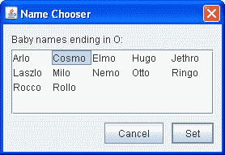
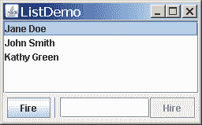
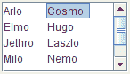
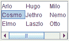
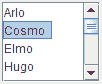
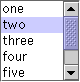
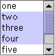
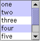

# 如何使用列表

> 原文：[`docs.oracle.com/javase/tutorial/uiswing/components/list.html`](https://docs.oracle.com/javase/tutorial/uiswing/components/list.html)

[`JList`](https://docs.oracle.com/javase/8/docs/api/javax/swing/JList.html)向用户显示一组项目，以一个或多个列显示，供选择。列表可能有许多项目，因此它们经常放在滚动窗格中。

除了列表外，以下 Swing 组件向用户呈现多个可选择项目：组合框、菜单、表格和复选框或单选按钮组。要显示分层数据，请使用树。

以下图显示了使用列表的两个应用程序。本节将使用这些示例作为后续讨论的基础。

|  |  |
| --- | --- |
| ListDialog（ListDialogRunner 使用） | ListDemo |

* * *

**试试这个：**

1.  点击“启动”按钮运行 ListDemo，使用[Java™ Web Start](http://www.oracle.com/technetwork/java/javase/javawebstart/index.html)（[下载 JDK 7 或更高版本](http://www.oracle.com/technetwork/java/javase/downloads/index.html)）。或者，要自行编译和运行示例，请参考示例索引。

1.  点击“启动”按钮运行 ListDialogRunner。或者，要自行编译和运行示例，请参考示例索引。

1.  要打开 ListDialog，请点击标题为“给宝宝起个新名字...”的窗口中的按钮。

    结果对话框是一个已经定制为标题为“名称选择器”的 ListDialog 实例。

1.  在 ListDemo 中，尝试添加（招聘）和移除（解雇）一些项目。

* * *

本节的其余部分讨论以下主题：

+   创建一个模型

+   初始化列表

+   在列表中选择项目

+   向列表添加项目和从列表中移除项目

+   编写自定义单元格渲染器

+   列表 API

+   使用列表的示例

## 创建一个模型

创建列表模型有三种方法：

+   [DefaultListModel](https://docs.oracle.com/javase/8/docs/api/javax/swing/DefaultListModel.html) — 一切都已经为您准备好了。本页中的示例使用`DefaultListModel`。

+   [AbstractListModel](https://docs.oracle.com/javase/8/docs/api/javax/swing/AbstractListModel.html) — 你管理数据并调用“fire”方法。对于这种方法，你必须继承`AbstractListModel`并实现从`ListModel`接口继承的`getSize`和`getElementAt`方法。

+   [ListModel](https://docs.oracle.com/javase/8/docs/api/javax/swing/ListModel.html) — 你管理一切。

## 初始化列表

这是从`ListDialog.java`中创建和设置其列表的代码：

```java
list = new JList(data); //data has type Object[]
list.setSelectionMode(ListSelectionModel.SINGLE_INTERVAL_SELECTION);
list.setLayoutOrientation(JList.HORIZONTAL_WRAP);
list.setVisibleRowCount(-1);
...
JScrollPane listScroller = new JScrollPane(list);
listScroller.setPreferredSize(new Dimension(250, 80));

```

代码将一个数组传递给列表的构造函数。该数组填充了从另一个对象传递过来的字符串。在我们的示例中，这些字符串恰好是男孩的名字。

其他`JList`构造函数允许你从`Vector`或遵循[`ListModel`](https://docs.oracle.com/javase/8/docs/api/javax/swing/ListModel.html)接口的对象初始化列表。如果用数组或向量初始化列表，构造函数会隐式创建一个默认列表模型。默认列表模型是不可变的 — 你不能向列表中添加、删除或替换项目。要创建一个可以单独更改项目的列表，请将列表的模型设置为可变列表模型类的实例，例如[`DefaultListModel`](https://docs.oracle.com/javase/8/docs/api/javax/swing/DefaultListModel.html)的实例。你可以在创建列表时设置列表的模型，也可以通过调用`setModel`方法来设置。查看向列表添加项目和从列表中删除项目以获取示例。

调用`setSelectionMode`指定用户可以选择多少项，以及它们是否必须是连续的；下一节将更多地告诉你有关选择模式的信息。

调用`setLayoutOrientation`让列表以多列显示其数据。值`JList.HORIZONTAL_WRAP`指定列表应该从左到右显示其项目，然后换行到新行。另一个可能的值是`JList.VERTICAL_WRAP`，它指定数据在从上到下（通常）显示后换行到新列。以下图显示了这两种换行可能性，以及默认的`JList.VERTICAL`。 

|  |  |  |
| --- | --- | --- |
| `HORIZONTAL_WRAP` | `VERTICAL_WRAP` | `VERTICAL` |

与调用`setLayoutOrientation`结合使用，调用`setVisibleRowCount(-1)`使列表在屏幕上的可用空间中显示尽可能多的项目。`setVisibleRowCount`的另一个常见用法是指定列表的滚动窗格应该显示多少行列表更喜欢显示。

## 在列表中选择项目

列表使用一个[`ListSelectionModel`](https://docs.oracle.com/javase/8/docs/api/javax/swing/ListSelectionModel.html)的实例来管理其选择。默认情况下，列表选择模型允许同时选择任意组合的项目。您可以通过在列表上调用`setSelectionMode`方法来指定不同的选择模式。例如，`ListDialog`和`ListDemo`都将选择模式设置为`SINGLE_SELECTION`（由`ListSelectionModel`定义的常量），以便列表中只能选择一个项目。以下表格描述了三种列表选择模式：

| 模式 | 描述 |
| --- | --- |

| `SINGLE_SELECTION` 

| 一次只能选择一个项目。当用户选择一个项目时，先取消选择任何先前选择的项目。 |
| --- |

| `SINGLE_INTERVAL_SELECTION` 

| 可以选择多个连续的项目。当用户开始新的选择范围时，先取消选择任何先前选择的项目。 |
| --- |

| `MULTIPLE_INTERVAL_SELECTION` 

| 默认值。可以选择任意组合的项目。用户必须明确取消选择项目。 |
| --- |

无论您的列表使用哪种选择模式，列表在选择更改时都会触发列表选择事件。您可以通过使用`addListSelectionListener`方法向列表添加一个 list selection listener 来处理这些事件。列表选择监听器必须实现一个方法：`valueChanged`。以下是`ListDemo`中监听器的`valueChanged`方法：

```java
public void valueChanged(ListSelectionEvent e) {
    if (e.getValueIsAdjusting() == false) {

        if (list.getSelectedIndex() == -1) {
        //No selection, disable fire button.
            fireButton.setEnabled(false);

        } else {
        //Selection, enable the fire button.
            fireButton.setEnabled(true);
        }
    }
}

```

一个用户操作（如鼠标点击）可能会生成许多列表选择事件。如果用户仍在操作选择，则`getValueIsAdjusting`方法返回`true`。这个特定程序只关心用户操作的最终结果，因此`valueChanged`方法只在`getValueIsAdjusting`返回`false`时执行操作。

因为列表处于单选模式，此代码可以使用`getSelectedIndex`来获取刚刚选择的项目的索引。当选择模式允许选择多个项目时，`JList`提供了其他设置或获取选择的方法。如果愿意，您可以在列表的列表选择模型上监听事件，而不是在列表本身上。ListSelectionDemo 是一个示例，展示了如何在列表选择模型上监听列表选择事件，并允许您动态更改列表的选择模式。

## 添加项目到列表和从列表中删除项目

我们之前展示的 ListDemo 示例具有内容可能会改变的列表。您可以在`ListDemo.java`中找到 ListDemo 的源代码。以下是创建可变列表模型对象、放入初始项目并使用列表模型创建列表的 ListDemo 代码：

```java
listModel = new DefaultListModel();
listModel.addElement("Jane Doe");
listModel.addElement("John Smith");
listModel.addElement("Kathy Green");

list = new JList(listModel);

```

这个特定程序使用了 Swing 提供的`DefaultListModel`类的一个实例。尽管类名为`DefaultListModel`，但列表不会有`DefaultListModel`，除非您的程序明确这样做。如果`DefaultListModel`不符合您的需求，您可以编写一个符合`ListModel`接口的自定义列表模型。

下面的代码片段显示了在**Fire**按钮上注册的动作监听器的`actionPerformed`方法。粗体代码行会移除列表中的选定项目。方法中的其余行会在列表现在为空时禁用火按钮，并在不为空时进行另一个选择。

```java
public void actionPerformed(ActionEvent e) {
    int index = list.getSelectedIndex();
    listModel.remove(index);

    int size = listModel.getSize();

    if (size == 0) { //Nobody's left, disable firing.
        fireButton.setEnabled(false);

    } else { //Select an index.
        if (index == listModel.getSize()) {
            //removed item in last position
            index--;
        }

        list.setSelectedIndex(index);
        list.ensureIndexIsVisible(index);
    }
}

```

这是由**Hire**按钮和文本字段共享的动作监听器的`actionPerformed`方法：

```java
public void actionPerformed(ActionEvent e) {
    String name = employeeName.getText();

    //User did not type in a unique name...
    if (name.equals("") || alreadyInList(name)) {
        Toolkit.getDefaultToolkit().beep();
        employeeName.requestFocusInWindow();
        employeeName.selectAll();
        return;
    }

    int index = list.getSelectedIndex(); //get selected index
    if (index == -1) { //no selection, so insert at beginning
        index = 0;
    } else {           //add after the selected item
        index++;
    }

    listModel.insertElementAt(employeeName.getText(), index);

    //Reset the text field.
    employeeName.requestFocusInWindow();
    employeeName.setText("");

    //Select the new item and make it visible.
    list.setSelectedIndex(index);
    list.ensureIndexIsVisible(index);
}

```

此代码使用列表模型的`insertElementAt`方法在当前选择后插入新名称，或者如果没有选择，则在列表开头插入。如果您只想添加到列表末尾，可以使用`DefaultListModel`的`addElement`方法。

每当向列表添加、移除或修改项目时，列表模型都会触发列表数据事件。请参考如何编写列表数据监听器以获取有关监听这些事件的信息。该部分包含一个类似于`ListDemo`的示例，但添加了按钮，用于将项目在列表中上移或下移。

## 编写自定义单元格渲染器

列表使用一个称为单元格渲染器的对象来显示其每个项目。默认单元格渲染器知道如何显示字符串和图标，并通过调用`toString`来显示`Object`。如果您想要更改默认渲染器显示图标或字符串的方式，或者如果您想要不同于`toString`提供的行为，您可以实现一个自定义单元格渲染器。按照以下步骤为列表提供自定义单元格渲染器：

+   编写一个实现[`ListCellRenderer`](https://docs.oracle.com/javase/8/docs/api/javax/swing/ListCellRenderer.html)接口的类。

+   创建您的类的一个实例，并使用该实例调用列表的`setCellRenderer`。

我们没有提供具有自定义单元格渲染器的列表示例，但我们有一个具有自定义渲染器的组合框示例，组合框使用与列表相同类型的渲染器。请参阅提供自定义渲染器中描述的示例。

## 列表 API

以下表格列出了常用的`JList`构造函数和方法。您最有可能在`JList`对象上调用的其他方法是其超类提供的`setPreferredSize`之类的方法。请参阅 The JComponent API 以查看常用继承方法的表格。

列表的大部分操作由其他对象管理。列表中的项目由列表模型对象管理，选择由列表选择模型对象管理，大多数程序将列表放在滚动窗格中以处理滚动。在大多数情况下，您不需要担心模型，因为`JList`会根据需要创建它们，并且您使用`JList`的便利方法隐式与它们交互。

也就是说，使用列表的 API 分为以下几类：

+   初始化列表数据

+   显示列表

+   管理列表的选择

+   管理列表数据

初始化列表数据

| 方法或构造函数 | 目的 |
| --- | --- |

| [JList(ListModel)](https://docs.oracle.com/javase/8/docs/api/javax/swing/JList.html#JList-javax.swing.ListModel-) [JList(Object[])](https://docs.oracle.com/javase/8/docs/api/javax/swing/JList.html#JList-java.lang.Object:A-)

[JList(Vector)](https://docs.oracle.com/javase/8/docs/api/javax/swing/JList.html#JList-java.util.Vector-)

[JList()](https://docs.oracle.com/javase/8/docs/api/javax/swing/JList.html#JList--) | 创建一个指定初始列表项的列表。第二和第三个构造函数隐式创建一个不可变的`ListModel`；您不应随后修改传入的数组或`Vector`。

| [void setModel(ListModel)](https://docs.oracle.com/javase/8/docs/api/javax/swing/JList.html#setModel-javax.swing.ListModel-) [ListModel getModel()](https://docs.oracle.com/javase/8/docs/api/javax/swing/JList.html#getModel--) | 设置或获取包含列表内容的模型。 |
| --- | --- |
| [void setListData(Object[])](https://docs.oracle.com/javase/8/docs/api/javax/swing/JList.html#setListData-java.lang.Object:A-) [void setListData(Vector)](https://docs.oracle.com/javase/8/docs/api/javax/swing/JList.html#setListData-java.util.Vector-) | 设置列表中的项目。这些方法隐式创建一个不可变的`ListModel`。 |

显示列表

| 方法 | 目的 |
| --- | --- |
| [void setVisibleRowCount(int)](https://docs.oracle.com/javase/8/docs/api/javax/swing/JList.html#setVisibleRowCount-int-) [int getVisibleRowCount()](https://docs.oracle.com/javase/8/docs/api/javax/swing/JList.html#getVisibleRowCount--) | 设置或获取`visibleRowCount`属性。对于`VERTICAL`布局方向，这设置或获取要显示的行数，而无需滚动。对于`HORIZONTAL_WRAP`或`VERTICAL_WRAP`布局方向，它定义了单元格如何换行。有关更多信息，请参见[setLayoutOrientation(int)](https://docs.oracle.com/javase/8/docs/api/javax/swing/JList.html#setLayoutOrientation-int-)。此属性的默认值为`VERTICAL`。 |
| [void setLayoutOrientation(int)](https://docs.oracle.com/javase/8/docs/api/javax/swing/JList.html#setLayoutOrientation-int-) [int getLayoutOrientation()](https://docs.oracle.com/javase/8/docs/api/javax/swing/JList.html#getLayoutOrientation--) | 设置或获取列表单元格的布局方式。可能的布局格式由`JList`定义的值指定，包括`VERTICAL`（单列单元格；默认值）、`HORIZONTAL_WRAP`（"报纸"风格，内容水平然后垂直流动）和`VERTICAL_WRAP`（"报纸"风格，内容垂直然后水平流动）。 |
| [int getFirstVisibleIndex()](https://docs.oracle.com/javase/8/docs/api/javax/swing/JList.html#getFirstVisibleIndex--) [int getLastVisibleIndex()](https://docs.oracle.com/javase/8/docs/api/javax/swing/JList.html#getLastVisibleIndex--) | 获取第一个或最后一个可见项目的索引。 |
| [void ensureIndexIsVisible(int)](https://docs.oracle.com/javase/8/docs/api/javax/swing/JList.html#ensureIndexIsVisible-int-) | 滚动，以使指定的索引在此列表所在的视口内可见。 |

管理列表的选择

| 方法 | 目的 |
| --- | --- |
| [void addListSelectionListener(ListSelectionListener)](https://docs.oracle.com/javase/8/docs/api/javax/swing/JList.html#addListSelectionListener-javax.swing.event.ListSelectionListener-) | 注册以接收选择更改的通知。 |

| [void setSelectedIndex(int)](https://docs.oracle.com/javase/8/docs/api/javax/swing/JList.html#setSelectedIndex-int-) [void setSelectedIndices(int[])](https://docs.oracle.com/javase/8/docs/api/javax/swing/JList.html#setSelectedIndices-int:A-)

[void setSelectedValue(Object, boolean)](https://docs.oracle.com/javase/8/docs/api/javax/swing/JList.html#setSelectedValue-java.lang.Object-boolean-)

[void setSelectionInterval(int, int)](https://docs.oracle.com/javase/8/docs/api/javax/swing/JList.html#setSelectionInterval-int-int-) | 将当前选择设置为指定的范围。使用`setSelectionMode`来设置可接受的选择范围。布尔参数指定列表是否应尝试滚动自身，以使所选项目可见。

| [int getAnchorSelectionIndex()](https://docs.oracle.com/javase/8/docs/api/javax/swing/JList.html#getAnchorSelectionIndex--) [int getLeadSelectionIndex()](https://docs.oracle.com/javase/8/docs/api/javax/swing/JList.html#getLeadSelectionIndex--)

[int getSelectedIndex()](https://docs.oracle.com/javase/8/docs/api/javax/swing/JList.html#getSelectedIndex--)

[int getMinSelectionIndex()](https://docs.oracle.com/javase/8/docs/api/javax/swing/JList.html#getMinSelectionIndex--)

[int getMaxSelectionIndex()](https://docs.oracle.com/javase/8/docs/api/javax/swing/JList.html#getMaxSelectionIndex--)

[int[] getSelectedIndices()](https://docs.oracle.com/javase/8/docs/api/javax/swing/JList.html#getSelectedIndices--)

[Object getSelectedValue()](https://docs.oracle.com/javase/8/docs/api/javax/swing/JList.html#getSelectedValue--)

[Object[] getSelectedValues()](https://docs.oracle.com/javase/8/docs/api/javax/swing/JList.html#getSelectedValues--) | 获取有关当前选择的信息。 |

| [void setSelectionMode(int)](https://docs.oracle.com/javase/8/docs/api/javax/swing/JList.html#setSelectionMode-int-) [int getSelectionMode()](https://docs.oracle.com/javase/8/docs/api/javax/swing/JList.html#getSelectionMode--) | 设置或获取选择模式。 可接受的值为：`SINGLE_SELECTION`，`SINGLE_INTERVAL_SELECTION`或`MULTIPLE_INTERVAL_SELECTION`（默认值），这些值在`ListSelectionModel`中定义。 |
| --- | --- |
| [void clearSelection()](https://docs.oracle.com/javase/8/docs/api/javax/swing/JList.html#clearSelection--) [boolean isSelectionEmpty()](https://docs.oracle.com/javase/8/docs/api/javax/swing/JList.html#isSelectionEmpty--) | 设置或获取是否有任何项目被选中。 |
| [boolean isSelectedIndex(int)](https://docs.oracle.com/javase/8/docs/api/javax/swing/JList.html#isSelectedIndex-int-) | 确定指定的索引是否被选中。 |

管理列表数据

| 类或方法 | 目的 |
| --- | --- |
| [int getNextMatch(String, int, javax.swing.text.Position.Bias)](https://docs.oracle.com/javase/8/docs/api/javax/swing/JList.html#getNextMatch-java.lang.String-int-javax.swing.text.Position.Bias-) | 给定起始索引，搜索列表中以指定字符串开头的项目并返回该索引（如果未找到字符串，则返回-1）。 第三个参数指定搜索方向，可以是`Position.Bias.Forward`或`Position.Bias.Backward`。 例如，如果您有一个包含 6 个项目的列表，`getNextMatch("Matisse", 5, javax.swing.text.Position.Bias.Forward)`会在索引 5 处搜索字符串"Matisse"，然后（如果需要）在索引 0、索引 1 等处搜索。 |
| [void setDragEnabled(boolean)](https://docs.oracle.com/javase/8/docs/api/javax/swing/JList.html#setDragEnabled-boolean-) [boolean getDragEnabled()](https://docs.oracle.com/javase/8/docs/api/javax/swing/JList.html#getDragEnabled--) | 设置或获取确定是否启用自动拖动处理的属性。 有关更多详细信息，请参阅拖放和数据传输。 |

## 使用列表的示例

这个表格展示了使用`JList`的示例以及这些示例的描述位置。

| 示例 | 描述位置 | 注释 |
| --- | --- | --- |
| `SplitPaneDemo` | 如何使用分割窗格 | 包含一个单选、不可变列表。 |
| `ListDemo` | 本节 | 演示如何在运行时向列表中添加和删除项目。 |
| `ListDialog` | 本节，如何使用 BoxLayout | 实现了一个带有单选列表的模态对话框。 |
| `ListDataEventDemo` | 如何编写列表数据监听器 | 演示如何监听列表模型上的列表数据事件。 |
| `ListSelectionDemo` | 如何编写列表选择监听器 | 包含一个列表和一个表，它们共享相同的选择模型。您可以动态选择选择模式。 |
| `SharedModelDemo` | 使用模型 | 修改`ListSelectionDemo`，使列表和表共享相同的数据模型。 |
| `CustomComboBoxDemo` | 提供自定义渲染器 | 展示如何为组合框提供自定义渲染器。因为列表和组合框使用相同类型的渲染器，您可以学到的内容也可以应用到列表上。事实上，列表和组合框可以共享一个渲染器。 |

查看[使用 JavaFX UI 控件：列表视图](https://docs.oracle.com/javase/8/javafx/user-interface-tutorial/list-view.htm)教程，了解如何在 JavaFX 中创建列表。
