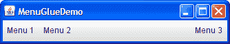

# 如何使用菜单

> 原文：[`docs.oracle.com/javase/tutorial/uiswing/components/menu.html`](https://docs.oracle.com/javase/tutorial/uiswing/components/menu.html)

菜单提供了一种节省空间的方式，让用户从几个选项中选择一个。用户可以使用其他组件进行一对多选择，包括组合框、列表、单选按钮、微调器和工具栏。如果你的任何菜单项执行的操作被另一个菜单项或工具栏按钮复制，那么除了本节，你还应该阅读如何使用操作。

菜单在独特之处在于，按照惯例，它们不会与 UI 中的其他组件放在一起。相反，菜单通常出现在*菜单栏*中或作为*弹出菜单*。菜单栏包含一个或多个菜单，并具有习惯的、平台相关的位置 — 通常位于窗口顶部。弹出菜单是一个在用户进行平台特定鼠标操作（例如按下右键）后才可见的菜单，弹出菜单会出现在光标下方。

以下图显示了许多与菜单相关的组件：菜单栏、菜单、菜单项、单选按钮菜单项、复选框菜单项和分隔线。正如你所见，菜单项可以具有图像、文本或两者。你还可以指定其他属性，如字体和颜色。


本节的其余部分将教你有关菜单组件并告诉你如何使用各种菜单功能：

+   菜单组件层次结构

+   创建菜单

+   处理菜单项的事件

+   启用键盘操作

+   弹出菜单

+   自定义菜单布局

+   菜单 API

+   使用菜单的示例

## 菜单组件层次结构

这是与菜单相关类的继承层次结构的图片：


正如图所示，菜单项（包括菜单）只是按钮。你可能想知道，如果菜单只是一个按钮，它如何显示其菜单项。答案是，当菜单被激活时，它会自动弹出一个显示菜单项的弹出菜单。

## 创建菜单

以下代码创建了显示在菜单部分开头附近的菜单。粗体代码行创建并连接菜单对象；其他代码设置或自定义菜单对象。你可以在`MenuLookDemo.java`中找到整个程序。其他所需文件在示例索引中列出。

* * *

**试试这个：**

+   点击“启动”按钮以使用[Java™ Web Start](http://www.oracle.com/technetwork/java/javase/javawebstart/index.html)运行 MenuLook 演示（[下载 JDK 7 或更高版本](http://www.oracle.com/technetwork/java/javase/downloads/index.html)）。或者，要自行编译和运行示例，请参考示例索引。

* * *

因为这段代码没有事件处理，菜单除了外观上看起来正常外并没有实际作用。如果运行示例，您会注意到尽管缺少自定义事件处理，菜单和子菜单在应该出现时会出现，并且当用户选择时复选框和单选按钮会做出适当响应。

```java
*//Where the GUI is created:*
JMenuBar menuBar;
JMenu menu, submenu;
JMenuItem menuItem;
JRadioButtonMenuItem rbMenuItem;
JCheckBoxMenuItem cbMenuItem;

//Create the menu bar.
menuBar = new JMenuBar();

//Build the first menu.
menu = new JMenu("A Menu");
menu.setMnemonic(KeyEvent.VK_A);
menu.getAccessibleContext().setAccessibleDescription(
        "The only menu in this program that has menu items");
menuBar.add(menu);

//a group of JMenuItems
menuItem = new JMenuItem("A text-only menu item",
                         KeyEvent.VK_T);
menuItem.setAccelerator(KeyStroke.getKeyStroke(
        KeyEvent.VK_1, ActionEvent.ALT_MASK));
menuItem.getAccessibleContext().setAccessibleDescription(
        "This doesn't really do anything");
menu.add(menuItem);

menuItem = new JMenuItem("Both text and icon",
                         new ImageIcon("images/middle.gif"));
menuItem.setMnemonic(KeyEvent.VK_B);
menu.add(menuItem);

menuItem = new JMenuItem(new ImageIcon("images/middle.gif"));
menuItem.setMnemonic(KeyEvent.VK_D);
menu.add(menuItem);

//a group of radio button menu items
menu.addSeparator();
ButtonGroup group = new ButtonGroup();
rbMenuItem = new JRadioButtonMenuItem("A radio button menu item");
rbMenuItem.setSelected(true);
rbMenuItem.setMnemonic(KeyEvent.VK_R);
group.add(rbMenuItem);
menu.add(rbMenuItem);

rbMenuItem = new JRadioButtonMenuItem("Another one");
rbMenuItem.setMnemonic(KeyEvent.VK_O);
group.add(rbMenuItem);
menu.add(rbMenuItem);

//a group of check box menu items
menu.addSeparator();
cbMenuItem = new JCheckBoxMenuItem("A check box menu item");
cbMenuItem.setMnemonic(KeyEvent.VK_C);
menu.add(cbMenuItem);

cbMenuItem = new JCheckBoxMenuItem("Another one");
cbMenuItem.setMnemonic(KeyEvent.VK_H);
menu.add(cbMenuItem);

//a submenu
menu.addSeparator();
submenu = new JMenu("A submenu");
submenu.setMnemonic(KeyEvent.VK_S);

menuItem = new JMenuItem("An item in the submenu");
menuItem.setAccelerator(KeyStroke.getKeyStroke(
        KeyEvent.VK_2, ActionEvent.ALT_MASK));
submenu.add(menuItem);

menuItem = new JMenuItem("Another item");
submenu.add(menuItem);
menu.add(submenu);

//Build second menu in the menu bar.
menu = new JMenu("Another Menu");
menu.setMnemonic(KeyEvent.VK_N);
menu.getAccessibleContext().setAccessibleDescription(
        "This menu does nothing");
menuBar.add(menu);

...
frame.setJMenuBar(*theJMenuBar*);

```

正如代码所示，要为`JFrame`设置菜单栏，您可以使用`setJMenuBar`方法。要将`JMenu`添加到`JMenuBar`，您可以使用`add(JMenu)`方法。要向`JMenu`添加菜单项和子菜单，您可以使用`add(JMenuItem)`方法。

* * *

**注意：**

菜单项，就像其他组件一样，最多可以在一个容器中。如果尝试将菜单项添加到第二个菜单中，菜单项将在添加到第二个菜单之前从第一个菜单中移除。要实现多个执行相同操作的组件，请参阅如何使用操作。

* * *

前述代码中的其他方法包括`setAccelerator`和`setMnemonic`，稍后在启用键盘操作中进行讨论。`setAccessibleDescription`方法在如何支持辅助技术中进行讨论。

## 处理菜单项的事件

要检测用户选择`JMenuItem`时，您可以监听动作事件（就像您为`JButton`所做的那样）。要检测用户选择`JRadioButtonMenuItem`时，您可以监听动作事件或项目事件，如如何使用单选按钮中所述。对于`JCheckBoxMenuItem`，通常监听项目事件，如如何使用复选框中所述。

* * *

**试试这个：**

+   点击“启动”按钮以使用[Java™ Web Start](http://www.oracle.com/technetwork/java/javase/javawebstart/index.html)运行菜单演示（[下载 JDK 7 或更高版本](http://www.oracle.com/technetwork/java/javase/downloads/index.html)）。或者，要自行编译和运行示例，请参考示例索引。

* * *


这是实现事件处理的代码：

```java
public class MenuDemo ... implements ActionListener,
                                     ItemListener {
    ...
    public MenuDemo() {
        *//...for each JMenuItem instance:*
        menuItem.addActionListener(this);
        ...
        *//for each JRadioButtonMenuItem:* 
        rbMenuItem.addActionListener(this);
        ...
        *//for each JCheckBoxMenuItem:* 
        cbMenuItem.addItemListener(this);
        ...
    }

    public void actionPerformed(ActionEvent e) {
        *//...Get information from the action event...
        //...Display it in the text area...*
    }

    public void itemStateChanged(ItemEvent e) {
        *//...Get information from the item event...
        //...Display it in the text area...*
    }

```

有关处理动作和项目事件的示例，请参见按钮、单选按钮和复选框部分，以及本节末尾的示例列表。

## 启用键盘操作

菜单支持两种键盘替代方式：助记符和加速键。*助记符*提供了一种使用键盘导航菜单层次结构的方法，增加了程序的可访问性。另一方面，*加速键*提供了绕过导航菜单层次结构的键盘快捷方式。助记符适用于所有用户；加速键适用于高级用户。

助记符是使已经可见的菜单项被选择的键。例如，在`MenuDemo`中，第一个菜单的助记符是 A，其第二个菜单项的助记符是 B。这意味着，当您在 Java 外观下运行`MenuDemo`时，按下 Alt 和 A 键会使第一个菜单出现。当第一个菜单可见时，按下 B 键（带有或不带有 Alt）会选择第二个菜单项。菜单项通常通过在菜单项文本中的助记字符的第一次出现下划线来显示其助记符，如下面的快照所示。


加速键是一种键组合，导致选择菜单项，无论它是否可见。例如，在`MenuDemo`中按下 Alt 和 2 键会选择第一个菜单的子菜单中的第一个项目，而不会弹出任何菜单。只有叶子菜单项 — 不弹出其他菜单的菜单 — 可以有加速键。以下快照显示了 Java 外观如何显示具有加速键的菜单项。


您可以在构造菜单项时或使用`setMnemonic`方法时指定助记符。要指定加速键，请使用`setAccelerator`方法。以下是设置助记符和加速键的示例：

```java
//Setting the mnemonic when constructing a menu item:
menuItem = new JMenuItem("A text-only menu item",
                         KeyEvent.VK_T);

//Setting the mnemonic after creation time:
menuItem.setMnemonic(KeyEvent.VK_T);

//Setting the accelerator:
menuItem.setAccelerator(KeyStroke.getKeyStroke(
        KeyEvent.VK_T, ActionEvent.ALT_MASK));

```

如您所见，您可以通过指定用户应按下的[`KeyEvent`](https://docs.oracle.com/javase/8/docs/api/java/awt/event/KeyEvent.html)常量来设置助记符。要指定加速键，必须使用[`KeyStroke`](https://docs.oracle.com/javase/8/docs/api/javax/swing/KeyStroke.html)对象，该对象结合了一个键（由`KeyEvent`常量指定）和一个修饰键掩码（由[`ActionEvent`](https://docs.oracle.com/javase/8/docs/api/java/awt/event/ActionEvent.html)常量指定）。

* * *

**注意：**

由于弹出菜单与常规菜单不同，不总是由组件包含，因此弹出菜单项中的加速键在弹出菜单不可见时不起作用。

* * *

## 弹出菜单

要显示弹出菜单（[`JPopupMenu`](https://docs.oracle.com/javase/8/docs/api/javax/swing/JPopupMenu.html)），必须在每个应与弹出菜单关联的组件上注册鼠标侦听器。鼠标侦听器必须检测用户请求显示弹出菜单。

弹出菜单应该如何显示的确切手势因外观和感觉而异。在 Microsoft Windows 中，用户按照惯例在鼠标光标位于启用弹出菜单的组件上时释放右鼠标按钮来显示弹出菜单。在 Java 外观中，通常的触发方式是按下右鼠标按钮（对于在释放按钮时弹出并消失的弹出菜单）或单击它（对于保持弹出状态的弹出菜单）。

* * *

**试试这个：**

+   点击“启动”按钮以使用[Java™ Web Start](http://www.oracle.com/technetwork/java/javase/javawebstart/index.html)运行 PopupMenu 演示（[下载 JDK 7 或更高版本](http://www.oracle.com/technetwork/java/javase/downloads/index.html)）。或者，要自行编译和运行示例，请参考示例索引。

* * *

```java
*//...where instance variables are declared:*
JPopupMenu popup;

    *//...where the GUI is constructed:*
    //Create the popup menu.
    popup = new JPopupMenu();
    menuItem = new JMenuItem("A popup menu item");
    menuItem.addActionListener(this);
    popup.add(menuItem);
    menuItem = new JMenuItem("Another popup menu item");
    menuItem.addActionListener(this);
    popup.add(menuItem);

    //Add listener to components that can bring up popup menus.
    MouseListener popupListener = new PopupListener();
    output.addMouseListener(popupListener);
    menuBar.addMouseListener(popupListener);
...
class PopupListener extends MouseAdapter {
    public void mousePressed(MouseEvent e) {
        maybeShowPopup(e);
    }

    public void mouseReleased(MouseEvent e) {
        maybeShowPopup(e);
    }

    private void maybeShowPopup(MouseEvent e) {
        if (e.isPopupTrigger()) {
            popup.show(e.getComponent(),
                       e.getX(), e.getY());
        }
    }
}

```

弹出菜单有一些有趣的实现细节。其中之一是每个菜单都有一个关联的弹出菜单。当菜单被激活时，它使用其关联的弹出菜单来显示其菜单项。

另一个细节是，弹出菜单本身使用另一个组件来实现包含菜单项的窗口。根据弹出菜单显示的情况，弹出菜单可能使用轻量级组件（如`JPanel`）、“中等重量”组件（如[`Panel`](https://docs.oracle.com/javase/8/docs/api/java/awt/Panel.html)）或重量级窗口（继承自[`Window`](https://docs.oracle.com/javase/8/docs/api/java/awt/Window.html)）来实现其“窗口”。

轻量级弹出窗口比重量级窗口更高效，但在 Java SE 平台 6 Update 12 发布之前，如果 GUI 中有任何重量级组件，它们的效果不佳。具体来说，当轻量级弹出显示区域与重量级组件的显示区域相交时，重量级组件会显示在顶部。这是在 6u12 发布之前我们建议不要混合使用重量级和轻量级组件的原因之一。如果您正在使用较旧的版本并且绝对需要在 GUI 中使用重量级组件，则可以调用`JPopupMenu.setLightWeightPopupEnabled(false)`来禁用轻量级弹出窗口。有关在 6u12 版本及更高版本中混合组件的信息，请参阅[混合重量级和轻量级组件](http://www.oracle.com/technetwork/articles/java/mixing-components-433992.html)。

## 自定义菜单布局

因为菜单由普通的 Swing 组件组成，所以你可以轻松地自定义它们。例如，你可以向`JMenu`或`JMenuBar`添加任何轻量级组件。而且因为`JMenuBar`使用了`BoxLayout`，你可以通过向其添加不可见组件来自定义菜单栏的布局。以下是向菜单栏添加填充物组件的示例，以便最后一个菜单位于菜单栏的右边缘：

```java
*//...create and add some menus...*
menuBar.add(Box.createHorizontalGlue());
*//...create the rightmost menu...*
menuBar.add(rightMenu);

```

* * *

**试试这个：**

+   点击启动按钮以使用[Java™ Web Start](http://www.oracle.com/technetwork/java/javase/javawebstart/index.html)运行 MenuGlue Demo（[下载 JDK 7 或更高版本](http://www.oracle.com/technetwork/java/javase/downloads/index.html)）。或者，要自行编译和运行示例，请参考示例索引。

* * *

这是 MenuGlueDemo 显示的修改后的菜单布局：



改变菜单外观的另一种方法是改变用于控制它们的布局管理器。例如，你可以将菜单栏的布局管理器从默认的左到右的`BoxLayout`更改为诸如`GridLayout`之类的东西。

* * *

**试试这个：**

+   点击启动按钮以使用[Java™ Web Start](http://www.oracle.com/technetwork/java/javase/javawebstart/index.html)运行 MenuLayout Demo（[下载 JDK 7 或更高版本](http://www.oracle.com/technetwork/java/javase/downloads/index.html)）。或者，要自行编译和运行示例，请参考示例索引。

* * *

这是`MenuLayoutDemo`创建的菜单布局的图片：


## 菜单 API

以下表格列出了常用的菜单构造函数和方法。使用菜单的 API 属于以下类别：

+   创建和设置菜单栏

+   创建和填充菜单

+   创建、填充和控制弹出菜单

+   实现菜单项

创建和设置菜单栏

| 构造函数或方法 | 目的 |
| --- | --- |
| [JMenuBar()](https://docs.oracle.com/javase/8/docs/api/javax/swing/JMenuBar.html#JMenuBar--) | 创建一个菜单栏。 |
| [JMenu add(JMenu)](https://docs.oracle.com/javase/8/docs/api/javax/swing/JMenuBar.html#add-javax.swing.JMenu-) | 将菜单添加到菜单栏的末尾。 |

| [void setJMenuBar(JMenuBar)](https://docs.oracle.com/javase/8/docs/api/javax/swing/JFrame.html#setJMenuBar-javax.swing.JMenuBar-) [JMenuBar getJMenuBar()](https://docs.oracle.com/javase/8/docs/api/javax/swing/JFrame.html#getJMenuBar--)

*(在`JApplet`、`JDialog`、`JFrame`、`JInternalFrame`、`JRootPane`中)* | 设置或获取 applet、dialog、frame、internal frame 或 root pane 的菜单栏。 |

创建和填充菜单

| 构造函数或方法 | 目的 |
| --- | --- |

| [JMenu()](https://docs.oracle.com/javase/8/docs/api/javax/swing/JMenu.html#JMenu--) [JMenu(String)](https://docs.oracle.com/javase/8/docs/api/javax/swing/JMenu.html#JMenu-java.lang.String-)

[JMenu(Action)](https://docs.oracle.com/javase/8/docs/api/javax/swing/JMenu.html#JMenu-javax.swing.Action-) | 创建一个菜单。字符串指定菜单显示的文本。`Action`指定菜单的文本和其他属性（参见如何使用操作）。 |

| [JMenuItem add(JMenuItem)](https://docs.oracle.com/javase/8/docs/api/javax/swing/JMenu.html#add-javax.swing.JMenuItem-) [JMenuItem add(String)](https://docs.oracle.com/javase/8/docs/api/javax/swing/JMenu.html#add-java.lang.String-) | 将菜单项添加到菜单的末尾。如果参数是一个字符串，则菜单会自动创建一个显示指定文本的`JMenuItem`对象。 |
| --- | --- |
| [void addSeparator()](https://docs.oracle.com/javase/8/docs/api/javax/swing/JMenu.html#addSeparator--) | 在菜单的末尾添加一个分隔符。 |

| [JMenuItem insert(JMenuItem, int)](https://docs.oracle.com/javase/8/docs/api/javax/swing/JMenu.html#insert-javax.swing.JMenuItem-int-) [void insert(String, int)](https://docs.oracle.com/javase/8/docs/api/javax/swing/JMenu.html#insert-java.lang.String-int-)

[void insertSeparator(int)](https://docs.oracle.com/javase/8/docs/api/javax/swing/JMenu.html#insertSeparator-int-) | 在指定位置向菜单中插入菜单项或分隔符。第一个菜单项在位置 0，第二个在位置 1，依此类推。`JMenuItem`和`String`参数在对应的`add`方法中的处理方式相同。 |

| [void remove(JMenuItem)](https://docs.oracle.com/javase/8/docs/api/javax/swing/JMenu.html#remove-javax.swing.JMenuItem-) [void remove(int)](https://docs.oracle.com/javase/8/docs/api/javax/swing/JMenu.html#remove-int-)

[void removeAll()](https://docs.oracle.com/javase/8/docs/api/javax/swing/JMenu.html#removeAll--) | 从菜单中移除指定的项。如果参数是一个整数，则指定要移除的菜单项的位置。 |

创建、填充和控制弹出菜单

| 构造函数或方法 | 目的 |
| --- | --- |
| [JPopupMenu()](https://docs.oracle.com/javase/8/docs/api/javax/swing/JPopupMenu.html#JPopupMenu--) [JPopupMenu(String)](https://docs.oracle.com/javase/8/docs/api/javax/swing/JPopupMenu.html#JPopupMenu-java.lang.String-) | 创建一个弹出菜单。可选的字符串参数指定外观和感觉可能作为弹出窗口的一部分显示的标题。 |
| [JMenuItem add(JMenuItem)](https://docs.oracle.com/javase/8/docs/api/javax/swing/JPopupMenu.html#add-javax.swing.JMenuItem-) [JMenuItem add(String)](https://docs.oracle.com/javase/8/docs/api/javax/swing/JPopupMenu.html#add-java.lang.String-) | 将菜单项添加到弹出菜单的末尾。如果参数是一个字符串，则菜单会自动创建一个显示指定文本的`JMenuItem`对象。 |
| [void addSeparator()](https://docs.oracle.com/javase/8/docs/api/javax/swing/JPopupMenu.html#addSeparator--) | 在弹出菜单的末尾添加一个分隔符。 |
| [void insert(Component, int)](https://docs.oracle.com/javase/8/docs/api/javax/swing/JPopupMenu.html#insert-java.awt.Component-int-) | 在指定位置将菜单项插入菜单中。第一个菜单项在位置 0，第二个在位置 1，依此类推。`Component`参数指定要添加的菜单项。 |
| [void remove(int)](https://docs.oracle.com/javase/8/docs/api/javax/swing/JPopupMenu.html#remove-int-) [void removeAll()](https://docs.oracle.com/javase/8/docs/api/java/awt/Container.html#removeAll--) | 从菜单中移除指定的项目。如果参数是一个整数，则指定要移除的菜单项的位置。 |
| [static void setLightWeightPopupEnabled(boolean)](https://docs.oracle.com/javase/8/docs/api/javax/swing/JPopupMenu.html#setLightWeightPopupEnabled-boolean-) | 默认情况下，Swing 使用轻量级组件来实现菜单的窗口。如果在 Swing 程序中使用任何重量级组件，可能会出现问题，如弹出菜单中所述。（这是避免使用重量级组件的几个原因之一。）作为解决方法，调用`JPopupMenu.setLightWeightPopupEnabled(false)`。 |
| [void show(Component, int, int)](https://docs.oracle.com/javase/8/docs/api/javax/swing/JPopupMenu.html#show-java.awt.Component-int-int-) | 在指定的*x,y*位置（由整数参数按顺序指定）在指定组件的坐标系中显示弹出菜单。 |

菜单项的实现

| 构造函数或方法 | 目的 |
| --- | --- |

| [JMenuItem()](https://docs.oracle.com/javase/8/docs/api/javax/swing/JMenuItem.html#JMenuItem--) [JMenuItem(String)](https://docs.oracle.com/javase/8/docs/api/javax/swing/JMenuItem.html#JMenuItem-java.lang.String-)

[JMenuItem(Icon)](https://docs.oracle.com/javase/8/docs/api/javax/swing/JMenuItem.html#JMenuItem-javax.swing.Icon-)

[JMenuItem(String, Icon)](https://docs.oracle.com/javase/8/docs/api/javax/swing/JMenuItem.html#JMenuItem-java.lang.String-javax.swing.Icon-)

[JMenuItem(String, int)](https://docs.oracle.com/javase/8/docs/api/javax/swing/JMenuItem.html#JMenuItem-java.lang.String-int-)的创建方法受到**Java**中的启发。

[JMenuItem(Action)](https://docs.oracle.com/javase/8/docs/api/javax/swing/JMenuItem.html#JMenuItem-javax.swing.Action-) | 创建一个普通的菜单项。如果存在图标参数，则指定菜单项应显示的图标。类似地，字符串参数指定菜单项应显示的文本。整数参数指定要使用的键盘助记符。您可以指定[KeyEvent](https://docs.oracle.com/javase/8/docs/api/java/awt/event/KeyEvent.html)类中定义的任何相关 VK 常量。例如，要指定 A 键，请使用`KeyEvent.VK_A`。具有`Action`参数的构造函数设置菜单项的`Action`，导致菜单项的属性从`Action`初始化。有关详细信息，请参阅如何使用操作。 |

| [JCheckBoxMenuItem()](https://docs.oracle.com/javase/8/docs/api/javax/swing/JCheckBoxMenuItem.html#JCheckBoxMenuItem--) [JCheckBoxMenuItem(String)](https://docs.oracle.com/javase/8/docs/api/javax/swing/JCheckBoxMenuItem.html#JCheckBoxMenuItem-java.lang.String-)的创建方法受到**Java**中的启发。

[JCheckBoxMenuItem(Icon)](https://docs.oracle.com/javase/8/docs/api/javax/swing/JCheckBoxMenuItem.html#JCheckBoxMenuItem-javax.swing.Icon-)的创建方法受到**Java**中的启发。

[JCheckBoxMenuItem(String, Icon)](https://docs.oracle.com/javase/8/docs/api/javax/swing/JCheckBoxMenuItem.html#JCheckBoxMenuItem-java.lang.String-javax.swing.Icon-)的创建方法受到**Java**中的启发。

[JCheckBoxMenuItem(String, boolean)](https://docs.oracle.com/javase/8/docs/api/javax/swing/JCheckBoxMenuItem.html#JCheckBoxMenuItem-java.lang.String-boolean-)的创建方法受到**Java**中的启发。

[JCheckBoxMenuItem(String, Icon, boolean)](https://docs.oracle.com/javase/8/docs/api/javax/swing/JCheckBoxMenuItem.html#JCheckBoxMenuItem-java.lang.String-javax.swing.Icon-boolean-) | 创建一个外观和行为类似复选框的菜单项。如果有字符串参数，则指定菜单项应显示的文本。如果为布尔参数指定`true`，则菜单项最初为选中状态（已选中）。否则，菜单项最初未选中。 |

| [JRadioButtonMenuItem()](https://docs.oracle.com/javase/8/docs/api/javax/swing/JRadioButtonMenuItem.html#JRadioButtonMenuItem--) [JRadioButtonMenuItem(String)](https://docs.oracle.com/javase/8/docs/api/javax/swing/JRadioButtonMenuItem.html#JRadioButtonMenuItem-java.lang.String-)的创建方法受到**Java**中的启发。

[JRadioButtonMenuItem(Icon)](https://docs.oracle.com/javase/8/docs/api/javax/swing/JRadioButtonMenuItem.html#JRadioButtonMenuItem-javax.swing.Icon-)的创建方法受到**Java**中的启发。

[JRadioButtonMenuItem(String, Icon)](https://docs.oracle.com/javase/8/docs/api/javax/swing/JRadioButtonMenuItem.html#JRadioButtonMenuItem-java.lang.String-javax.swing.Icon-)的创建方法受到**Java**中的启发。

[JRadioButtonMenuItem(String, boolean)](https://docs.oracle.com/javase/8/docs/api/javax/swing/JRadioButtonMenuItem.html#JRadioButtonMenuItem-java.lang.String-boolean-)的创建方法受到**Java**中的启发。

[JRadioButtonMenuItem(Icon, boolean)](https://docs.oracle.com/javase/8/docs/api/javax/swing/JRadioButtonMenuItem.html#JRadioButtonMenuItem-javax.swing.Icon-boolean-)

[JRadioButtonMenuItem(String, Icon, boolean)](https://docs.oracle.com/javase/8/docs/api/javax/swing/JRadioButtonMenuItem.html#JRadioButtonMenuItem-java.lang.String-javax.swing.Icon-boolean-) | 创建一个外观和行为类似单选按钮的菜单项。如果有字符串参数，则指定菜单项应显示的文本。如果为布尔参数指定`true`，则菜单项最初被选中。否则，菜单项最初未选中。 |

| [void setState(boolean)](https://docs.oracle.com/javase/8/docs/api/javax/swing/JCheckBoxMenuItem.html#setState-boolean-) [boolean getState()](https://docs.oracle.com/javase/8/docs/api/javax/swing/JCheckBoxMenuItem.html#getState--)

*(在`JCheckBoxMenuItem`中)* | 设置或获取复选框菜单项的选择状态。 |

| [void setEnabled(boolean)](https://docs.oracle.com/javase/8/docs/api/javax/swing/AbstractButton.html#setEnabled-boolean-) | 如果参数为 true，则启用菜单项。否则，禁用菜单项。 |
| --- | --- |
| [void setMnemonic(int)](https://docs.oracle.com/javase/8/docs/api/javax/swing/AbstractButton.html#setMnemonic-int-) | 设置启用键盘导航到菜单或菜单项的助记符。使用`KeyEvent`类中定义的 VK 常量之一。 |
| [void setAccelerator(KeyStroke)](https://docs.oracle.com/javase/8/docs/api/javax/swing/JMenuItem.html#setAccelerator-javax.swing.KeyStroke-) | 设置激活菜单项的加速键。 |
| [void setActionCommand(String)](https://docs.oracle.com/javase/8/docs/api/javax/swing/AbstractButton.html#setActionCommand-java.lang.String-) | 设置菜单项执行的操作的名称。 |
| [void addActionListener(ActionListener)](https://docs.oracle.com/javase/8/docs/api/javax/swing/AbstractButton.html#addActionListener-java.awt.event.ActionListener-) [void addItemListener(ItemListener)](https://docs.oracle.com/javase/8/docs/api/javax/swing/AbstractButton.html#addItemListener-java.awt.event.ItemListener-) | 向菜单项添加事件侦听器。有关详细信息，请参考处理菜单项事件。 |
| [void setAction(Action)](https://docs.oracle.com/javase/8/docs/api/javax/swing/AbstractButton.html#setAction-javax.swing.Action-) | 设置与菜单项关联的`Action`。有关详细信息，请参阅如何使用操作。 |
|  | 许多前述方法都是从`AbstractButton`继承而来的。查看按钮 API 以获取`AbstractButton`提供的其他有用方法的信息。 |

## 使用菜单的示例

菜单在我们的一些示例中使用。

| 示例 | 描述位置 | 注释 |
| --- | --- | --- |
| `MenuLookDemo` | 此部分（创建菜单） | 一个简单的示例，创建除弹出菜单之外的所有类型的菜单，但不处理来自菜单项的事件。 |
| `MenuDemo` | 此部分（处理菜单项事件） | 为`MenuLookDemo`添加事件处理。 |
| `PopupMenuDemo` | 此部分（弹出菜单） | 为`MenuDemo`添加弹出菜单。 |
| `MenuGlueDemo` | 此部分（自定义菜单布局） | 通过向菜单栏添加不可见组件演示影响菜单布局。 |
| `MenuLayoutDemo` | 此部分（自定义菜单布局） | 实现侧向打开的菜单，排列在垂直菜单栏中。 |
| `MenuSelectionManagerDemo` | — | 为 MenuDemo 添加高亮检测。要查看此功能，请单击菜单，然后将鼠标移动到任何菜单项或子菜单上。每秒钟，文本区域将更新有关当前高亮菜单项的信息，不要与用户最终选择的菜单项混淆。此演示使用默认的[`MenuSelectionManager`](https://docs.oracle.com/javase/8/docs/api/javax/swing/MenuSelectionManager.html)，用于跟踪菜单层次结构的状态。 |
| `ActionDemo` | 如何使用操作 | 使用`Action`对象实现通过工具栏按钮提供的功能的菜单项。 |
| `Framework` | — | 弹出多个具有菜单栏的相同框架。 |
| `InternalFrameDemo` | 如何使用内部框架 | 使用菜单项创建窗口。 |

查看[使用 JavaFX UI 控件：菜单](https://docs.oracle.com/javase/8/javafx/user-interface-tutorial/menu_controls.htm)教程，了解如何在 JavaFX 中创建菜单。
