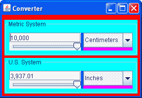
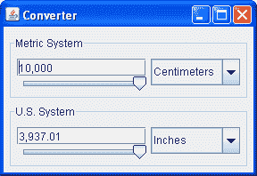

# 如何使用面板

> 原文：[`docs.oracle.com/javase/tutorial/uiswing/components/panel.html`](https://docs.oracle.com/javase/tutorial/uiswing/components/panel.html)

[`JPanel`](https://docs.oracle.com/javase/8/docs/api/javax/swing/JPanel.html)类提供了用于轻量级组件的通用容器。默认情况下，面板除了自己的背景之外不会添加颜色；但是，您可以轻松地向其添加边框并自定义其绘制。详细信息请参见执行自定义绘制。

在许多外观类型中，面板默认是不透明的。不透明的面板作为内容窗格效果很好，并且可以帮助高效绘制，如使用顶级容器中所述。您可以通过调用`setOpaque`方法来改变面板的透明度。透明面板不绘制背景，因此底部的任何组件都会透过显示出来。

## 一个例子

下图展示了一个有颜色的`Converter`应用程序版本，更详细地讨论在使用模型中。



`Converter`示例以多种方式使用面板：

+   在前面的快照中，一个被涂成红色的`JPanel`实例作为应用程序框架的内容窗格。这个内容窗格使用自上而下的`BoxLayout`来布局其内容，并使用一个空边框在它们周围留出 5 像素的空间。有关内容窗格的信息，请参见使用顶级容器。

+   两个自定义`JPanel`子类的实例，命名为`ConversionPanel`，被用来包含组件并协调组件之间的通信，这些`ConversionPanel`面板也有标题边框，描述其内容并用一条线围住内容。每个`ConversionPanel`面板使用从左到右的`BoxLayout`对象来布局其内容。

+   在每个`ConversionPanel`中，一个被涂成品红色的`JPanel`实例用于确保组合框的正确大小和位置。每个这样的`JPanel`实例使用自上而下的`BoxLayout`对象（通过一个不可见的填充组件的帮助）来布局组合框。

+   在每个`ConversionPanel`中，一个未命名的`JPanel`子类的实例，被涂成蓝色，将两个组件（文本字段和滑块）分组并限制它们的大小。每个这样的`JPanel`实例使用自上而下的`BoxLayout`对象来布局其内容。

这就是`Converter`应用程序的正常外观。



正如`Converter`示例所展示的，面板对于组合组件、简化组件布局以及在组件组周围放置边框非常有用。本节的其余部分提供了有关组合和布局组件的提示。有关使用边框的信息，请参见如何使用边框。

## 设置布局管理器

与其他容器一样，面板使用布局管理器来定位和调整其组件的大小。默认情况下，面板的布局管理器是`FlowLayout`的一个实例，它将面板的内容放在一行中。您可以通过调用`setLayout`方法或在创建面板时指定布局管理器来轻松使面板使用任何其他布局管理器。由于避免了不必要创建`FlowLayout`对象，因此后一种方法在性能方面更可取。

这是在创建面板时设置布局管理器的示例。

```java
JPanel p = new JPanel(new BorderLayout()); //PREFERRED!

```

这种方法不适用于`BoxLayout`，因为`BoxLayout`构造函数需要一个现有的容器。这是一个使用`BoxLayout`的示例。

```java
JPanel p = new JPanel();
p.setLayout(new BoxLayout(p, BoxLayout.PAGE_AXIS));

```

## 添加组件

当您向面板添加组件时，您使用`add`方法。您指定给`add`方法的参数取决于面板使用的布局管理器。当布局管理器为`FlowLayout`、`BoxLayout`、`GridLayout`或`SpringLayout`时，您通常会使用单参数的`add`方法，如下所示：

```java
aFlowPanel.add(aComponent);
aFlowPanel.add(anotherComponent);

```

当布局管理器为`BorderLayout`时，您需要提供一个参数，指定添加的组件在面板内的位置。例如：

```java
aBorderPanel.add(aComponent, BorderLayout.CENTER);
aBorderPanel.add(anotherComponent, BorderLayout.PAGE_END);

```

使用`GridBagLayout`，您可以使用`add`方法，但必须以某种方式为每个组件指定网格包约束。

有关选择和使用标准布局管理器的信息，请参阅使用布局管理器。

## 面板 API

`JPanel`类本身的 API 很少。您最有可能在`JPanel`对象上调用的方法是它从其超类继承的方法 — [`JComponent`](https://docs.oracle.com/javase/8/docs/api/javax/swing/JComponent.html)、[`Container`](https://docs.oracle.com/javase/8/docs/api/java/awt/Container.html)和[`Component`](https://docs.oracle.com/javase/8/docs/api/java/awt/Component.html)。以下表列出了您最有可能使用的 API，除了与边框和布局提示相关的方法。有关所有`JComponent`对象都可以使用的 API 的更多信息，请参阅 JComponent 类。

+   创建一个`JPanel`

+   管理容器的组件

+   设置或获取布局管理器

创建一个`JPanel`

| 构造函数 | 目的 |
| --- | --- |
| [JPanel()](https://docs.oracle.com/javase/8/docs/api/javax/swing/JPanel.html#JPanel--) [JPanel(LayoutManager)](https://docs.oracle.com/javase/8/docs/api/javax/swing/JPanel.html#JPanel-java.awt.LayoutManager-) | 创建一个面板。`LayoutManager`参数为新面板提供布局管理器。默认情况下，面板使用`FlowLayout`来布置其组件。 |

管理容器的组件

| 方法 | 目的 |
| --- | --- |

| [void add(Component)](https://docs.oracle.com/javase/8/docs/api/java/awt/Container.html#add-java.awt.Component-) [void add(Component, int)](https://docs.oracle.com/javase/8/docs/api/java/awt/Container.html#add-java.awt.Component-int-)

[void add(Component, Object)](https://docs.oracle.com/javase/8/docs/api/java/awt/Container.html#add-java.awt.Component-java.lang.Object-)

[void add(Component, Object, int)](https://docs.oracle.com/javase/8/docs/api/java/awt/Container.html#add-java.awt.Component-java.lang.Object-int-)

[void add(String, Component)](https://docs.oracle.com/javase/8/docs/api/java/awt/Container.html#add-java.lang.String-java.awt.Component-) | 将指定的组件添加到面板中。当存在时，`int`参数是容器中组件的索引。默认情况下，第一个添加的组件位于索引 0，第二个位于索引 1，依此类推。`Object`参数取决于布局管理器，通常为布局管理器提供有关添加组件的定位和其他布局约束的信息。`String`参数类似于`Object`参数。 |

| [int getComponentCount()](https://docs.oracle.com/javase/8/docs/api/java/awt/Container.html#getComponentCount--) | 获取此面板中的组件数。 |
| --- | --- |

| [Component getComponent(int)](https://docs.oracle.com/javase/8/docs/api/java/awt/Container.html#getComponent-int-) [Component getComponentAt(int, int)](https://docs.oracle.com/javase/8/docs/api/java/awt/Container.html#getComponentAt-int-int-)

[Component getComponentAt(Point)](https://docs.oracle.com/javase/8/docs/api/java/awt/Container.html#getComponentAt-java.awt.Point-)

[Component[] getComponents()](https://docs.oracle.com/javase/8/docs/api/java/awt/Container.html#getComponents--) | 获取指定的组件或组件。您可以根据索引或*x, y*位置获取组件。 |

| [void remove(Component)](https://docs.oracle.com/javase/8/docs/api/java/awt/Container.html#remove-java.awt.Component-) [void remove(int)](https://docs.oracle.com/javase/8/docs/api/java/awt/Container.html#remove-int-)

[void removeAll()](https://docs.oracle.com/javase/8/docs/api/java/awt/Container.html#removeAll--) | 移除指定的组件。 |

设置或获取布局管理器

| 方法 | 目的 |
| --- | --- |
| [void setLayout(LayoutManager)](https://docs.oracle.com/javase/8/docs/api/java/awt/Container.html#setLayout-java.awt.LayoutManager-) [LayoutManager getLayout()](https://docs.oracle.com/javase/8/docs/api/java/awt/Container.html#getLayout--) | 设置或获取此面板的布局管理器。布局管理器负责根据某种理念在面板的边界内定位面板的组件。 |

## 使用面板的示例

此课程中的许多示例使用`JPanel`对象。以下表格列出了一些。

| 示例 | 描述位置 | 注意事项 |
| --- | --- | --- |
| `Converter` | 这一部分 | 使用五个面板，其中四个使用`BoxLayout`，一个使用`GridLayout`。这些面板使用边框，并根据需要使用大小和对齐提示来影响布局。 |
| `ListDemo` | 如何使用列表 | 使用一个面板，默认使用`FlowLayout`管理器，将三个组件居中排列在一行。 |
| `ToolBarDemo` | 如何使用工具栏 | 使用一个面板作为内容窗格。该面板包含三个组件，由`BorderLayout`布局。 |
| `BorderDemo` | 如何使用边框 | 包含许多具有各种边框的面板。几个面板使用`BoxLayout`。 |
| `BoxLayoutDemo` | 如何使用 BoxLayout | 演示了一个使用 Swing 的`BoxLayout`管理器的面板。 |
