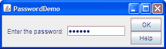

# 如何使用密码字段

> 原文：[`docs.oracle.com/javase/tutorial/uiswing/components/passwordfield.html`](https://docs.oracle.com/javase/tutorial/uiswing/components/passwordfield.html)

[`JPasswordField`](https://docs.oracle.com/javase/8/docs/api/javax/swing/JPasswordField.html)类是`JTextField`的子类，为密码输入提供了专门的文本字段。出于安全原因，密码字段不显示用户输入的字符。相反，该字段显示与键入字符不同的字符，例如星号'*'。作为另一个安全预防措施，密码字段将其值存储为字符数组，而不是字符串。与普通的文本字段一样，当用户指示文本输入完成时，例如按下回车按钮时，密码字段会触发操作事件。

这是一个演示的图片，打开一个小窗口并提示用户输入密码。



点击“启动”按钮以使用[Java™ Web Start](http://www.oracle.com/technetwork/java/javase/javawebstart/index.html)运行 PasswordDemo（[下载 JDK 7 或更高版本](http://www.oracle.com/technetwork/java/javase/downloads/index.html)）。或者，要自行编译和运行示例，请参考示例索引。


密码是"bugaboo"。密码"bugaboo"仅为示例。在生产系统中使用安全的身份验证方法。您可以在``PasswordDemo.java``中找到此程序的完整代码。以下是创建和设置密码字段的代码：

```java
passwordField = new JPasswordField(10);
passwordField.setActionCommand(OK);
passwordField.addActionListener(this);

```

传递给`JPasswordField`构造函数的参数指示字段的首选大小，在这种情况下至少为 10 列宽。默认情况下，密码字段显示每个键入字符的点。如果要更改回显字符，请调用`setEchoChar`方法。然后，代码向密码字段添加了一个操作监听器，该监听器检查用户键入的值。以下是操作监听器的`actionPerformed`方法的实现：

```java
public void actionPerformed(ActionEvent e) {
    String cmd = e.getActionCommand();

    if (OK.equals(cmd)) { //Process the password.
        char[] input = passwordField.getPassword();
        if (isPasswordCorrect(input)) {
            JOptionPane.showMessageDialog(controllingFrame,
                "Success! You typed the right password.");
        } else {
            JOptionPane.showMessageDialog(controllingFrame,
                "Invalid password. Try again.",
                "Error Message",
                JOptionPane.ERROR_MESSAGE);
        }

        //Zero out the possible password, for security.
        Arrays.fill(input, '0');

        passwordField.selectAll();
        resetFocus();
    } else *...//handle the Help button...*
}

```

* * *

**安全提示：** 为了进一步增强安全性，一旦您完成了`getPassword`方法返回的字符数组，您应该将其每个元素都设置为零。前面的代码片段展示了如何做到这一点。

* * *

通常使用密码字段的程序在执行需要密码的任何操作之前会验证密码。该程序调用一个私有方法 `isPasswordCorrect`，该方法将 `getPassword` 方法返回的值与存储在字符数组中的值进行比较。以下是其代码：

```java
private static boolean isPasswordCorrect(char[] input) {
    boolean isCorrect = true;
    char[] correctPassword = { 'b', 'u', 'g', 'a', 'b', 'o', 'o' };

    if (input.length != correctPassword.length) {
        isCorrect = false;
    } else {
        isCorrect = Arrays.equals (input, correctPassword);
    }

    //Zero out the password.
    Arrays.fill(correctPassword,'0');

    return isCorrect;
}

```

## 密码字段 API

以下表格列出了常用的 `JPasswordField` 构造函数和方法。有关密码字段继承的 API 信息，请参阅如何使用文本字段。

常用的 JPasswordField 构造函数和方法

| 构造函数或方法 | 目的 |
| --- | --- |

| [JPasswordField()](https://docs.oracle.com/javase/8/docs/api/javax/swing/JPasswordField.html#JPasswordField--) [JPasswordField(String)](https://docs.oracle.com/javase/8/docs/api/javax/swing/JPasswordField.html#JPasswordField-java.lang.String-)

[JPasswordField(String, int)](https://docs.oracle.com/javase/8/docs/api/javax/swing/JPasswordField.html#JPasswordField-java.lang.String-int-)

[JPasswordField(int)](https://docs.oracle.com/javase/8/docs/api/javax/swing/JPasswordField.html#JPasswordField-int-)

[JPasswordField(Document, String, int)](https://docs.oracle.com/javase/8/docs/api/javax/swing/JPasswordField.html#JPasswordField-javax.swing.text.Document-java.lang.String-int-) | 创建一个密码字段。当存在时，`int`参数指定所需的列宽。`String`参数包含字段的初始文本。`Document`参数为字段提供自定义模型。 |

| [char[] getPassword()](https://docs.oracle.com/javase/8/docs/api/javax/swing/JPasswordField.html#getPassword--) | 将密码作为字符数组返回。 |
| --- | --- |
| [void setEchoChar(char)](https://docs.oracle.com/javase/8/docs/api/javax/swing/JPasswordField.html#setEchoChar-char-) [char getEchoChar()](https://docs.oracle.com/javase/8/docs/api/javax/swing/JPasswordField.html#getEchoChar--) | 设置或获取代替用户键入的实际字符显示的回显字符。 |

| [void addActionListener(ActionListener)](https://docs.oracle.com/javase/8/docs/api/javax/swing/JTextField.html#addActionListener-java.awt.event.ActionListener-) [void removeActionListener(ActionListener)](https://docs.oracle.com/javase/8/docs/api/javax/swing/JTextField.html#removeActionListener-java.awt.event.ActionListener-)

*(在 `JTextField` 中定义)* | 添加或移除动作监听器。 |

| [void selectAll()](https://docs.oracle.com/javase/8/docs/api/javax/swing/text/JTextComponent.html#selectAll--) *(在 `JTextComponent` 中定义)* | 选择密码字段中的所有字符。 |
| --- | --- |

## 使用密码字段的示例

PasswordDemo 是教程中唯一使用 `JPasswordField` 对象的示例。然而，教程中有许多示例使用 `JTextField` 对象，其 API 被 `JPasswordField` 继承。有关更多信息，请参阅使用文本字段的示例。

如果你正在使用 JavaFX 进行编程，请查看[密码字段](https://docs.oracle.com/javase/8/javafx/user-interface-tutorial/password-field.htm)。
