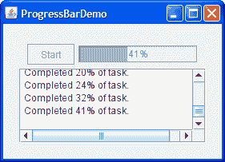
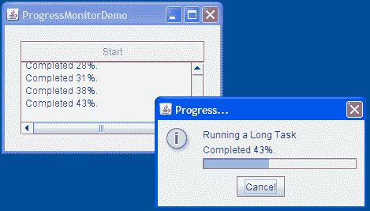

# 如何使用进度条

> 译文：[`docs.oracle.com/javase/tutorial/uiswing/components/progress.html`](https://docs.oracle.com/javase/tutorial/uiswing/components/progress.html)

有时候程序中运行的任务可能需要一段时间才能完成。用户友好的程序会向用户提供一些指示，表明任务正在进行，任务可能需要多长时间，以及已经完成了多少工作。指示工作和可能的进度量的一种方式是使用动画图像。

另一种指示工作的方法是设置等待光标，使用[`Cursor`](https://docs.oracle.com/javase/8/docs/api/java/awt/Cursor.html)类和`Component`定义的[`setCursor`](https://docs.oracle.com/javase/8/docs/api/java/awt/Component.html#setCursor-java.awt.Cursor-)方法。例如，以下代码在光标悬停在`container`上时显示等待光标（包括未指定光标的任何组件）：

```java
container.setCursor(Cursor.getPredefinedCursor(Cursor.WAIT_CURSOR));

```

为了传达任务完成的程度，你可以使用类似这样的进度条：


有时候你无法立即确定长时间运行任务的长度，或者任务可能在完成的同一状态停滞很长时间。你可以通过将进度条设置为*不确定模式*来展示没有可测量进度的工作。不确定模式下的进度条显示动画以指示工作正在进行。一旦进度条可以显示更有意义的信息，你应该将其切换回默认的确定模式。在 Java 外观中，不确定模式的进度条看起来像这样：


Swing 提供了三个类来帮助你使用进度条：

[**`JProgressBar`**](https://docs.oracle.com/javase/8/docs/api/javax/swing/JProgressBar.html)

一个可见的组件，用于图形显示已完成总任务的百分比。查看使用确定性进度条以获取有关使用典型进度条的信息和示例。章节使用不确定模式告诉你如何为显示活动而对进度条进行动画处理，直到任务的范围被确定。

[**`ProgressMonitor`**](https://docs.oracle.com/javase/8/docs/api/javax/swing/ProgressMonitor.html)

*不是*一个可见的组件。相反，这个类的一个实例监视任务的进度，并在必要时弹出一个对话框。查看如何使用进度监视器获取详细信息和使用进度监视器的示例。

[**`ProgressMonitorInputStream`**](https://docs.oracle.com/javase/8/docs/api/javax/swing/ProgressMonitorInputStream.html)

一个带有附加进度监视器的输入流，用于监视从流中读取的内容。您可以像使用基本 I/O 中描述的其他输入流一样使用此流的实例。您可以通过调用`getProgressMonitor`获取流的进度监视器，并按照如何使用进度监视器中的描述进行配置。

在看到进度条和进度监视器实际运行后，决定使用进度条还是进度监视器可以帮助您确定哪种适合您的应用程序。

## 使用确定性进度条

这是一个小型演示应用程序的图片，该应用程序使用进度条来测量在其自己的线程中运行的任务的进度：



* * *

**试试这个：**

+   点击启动按钮以使用[Java™ Web Start](http://www.oracle.com/technetwork/java/javase/javawebstart/index.html)运行 ProgressBar Demo（[下载 JDK 7 或更高版本](http://www.oracle.com/technetwork/java/javase/downloads/index.html)）。或者，要自行编译和运行示例，请参考示例索引。

* * *

以下代码来自`ProgressBarDemo.java`，创建并设置了进度条：

```java
*//Where member variables are declared:*
JProgressBar progressBar;
...
*//Where the GUI is constructed:*
progressBar = new JProgressBar(0, task.getLengthOfTask());
progressBar.setValue(0);
progressBar.setStringPainted(true);

```

创建进度条的构造函数设置了进度条的最小值和最大值。您也可以使用`setMinimum`和`setMaximum`设置这些值。此程序中使用的最小值和最大值为 0 和任务的长度，这是许多程序和任务的典型值。但是，进度条的最小值和最大值可以是任何值，甚至是负值。代码片段还将进度条的当前值设置为 0。

调用`setStringPainted`会导致进度条在其边界内显示任务完成的百分比的文本指示。默认情况下，进度条显示其`getPercentComplete`方法返回的值格式化为百分比，例如**33%**。或者，您可以通过调用`setString`替换默认值为其他字符串。例如，

```java
if (*/*...half way done...*/*)
    progressBar.setString("Half way there!");

```

当用户点击**开始**时，会创建并执行内部类`Task`的一个实例。

```java
public void actionPerformed(ActionEvent evt) {
    startButton.setEnabled(false);
    setCursor(Cursor.getPredefinedCursor(Cursor.WAIT_CURSOR));
    done = false;
    task = new Task();
    task.addPropertyChangeListener(this);
    task.execute();
}

```

`Task`是[`javax.swing.SwingWorker`](https://docs.oracle.com/javase/8/docs/api/javax/swing/SwingWorker.html)的子类。`Task`实例为`ProgressBarDemo`执行了三个重要的操作：

1.  实例在单独的线程中调用`doInBackground`。这是实际执行长时间任务的地方。在后台线程中使用而不是事件分派线程可以防止用户界面在任务运行时冻结。

1.  当后台任务完成时，实例在事件分派线程中调用`done`方法。

1.  实例维护一个绑定属性`progress`，该属性更新以指示任务的进度。每次`progress`更改时，都会调用`propertyChange`方法。

有关`SwingWorker`的更多信息，请参阅 Worker Threads and SwingWorker 在 Swing 中的并发性。

`ProgressBarDemo`中的后台任务通过在随机时间间隔报告随机进度量来模拟真实任务。`propertyChange`方法响应任务的`progress`属性的更改，从而更新进度条：

```java
public void propertyChange(PropertyChangeEvent evt) {
    if (!done) {
        int progress = task.getProgress();
        progressBar.setValue(progress);
        taskOutput.append(String.format(
                "Completed %d%% of task.\n", progress));
    }

```

当后台任务完成时，任务的`done`方法会重置进度条：

```java
public void done() {
    //Tell progress listener to stop updating progress bar.
    done = true;
    Toolkit.getDefaultToolkit().beep();
    startButton.setEnabled(true);
    setCursor(null); //turn off the wait cursor
    progressBar.setValue(progressBar.getMinimum());
    taskOutput.append("Done!\n");
}

```

请注意，`done`方法将`done`字段设置为`true`，防止`propertyChange`进一步更新进度条。这是必要的，因为对`progress`属性的最终更新可能发生在调用`done`之后。

## 使用不确定模式

在`ProgressBarDemo2`中，直到实际进度开始，不确定模式被设置：

```java
public void propertyChange(PropertyChangeEvent evt) {
    if (!done) {
        int progress = task.getProgress();
        if (progress == 0) {
            progressBar.setIndeterminate(true);
            taskOutput.append("No progress yet\n");
        } else {
            progressBar.setIndeterminate(false); 
            progressBar.setString(null);
            progressBar.setValue(progress);
            taskOutput.append(String.format(
                    "Completed %d%% of task.\n", progress));
        }
    }
}

```

代码中的其他更改与字符串显示有关。显示字符串的进度条可能比不显示的进度条更高，作为演示设计者，我们随意决定该进度条仅在默认的确定模式下显示字符串。然而，我们希望避免布局丑陋，这可能会导致进度条在更改模式时改变高度。因此，代码保留了对`setStringPainted(true)`的调用，但添加了对`setString("")`的调用，以便不显示任何文本。稍后，当进度条从不确定模式切换到确定模式时，调用`setString(null)`会使进度条显示其默认字符串。

我们没有做的一个改变是从`progress`事件处理程序中删除对`progressBar.setValue`的调用。这个调用不会造成任何伤害，因为不确定的进度条不使用其值属性，除非可能在状态字符串中显示它。事实上，尽可能保持进度条的数据最新是一个好习惯，因为一些外观和感觉可能不支持不确定模式。

* * *

**试试这个：**

1.  点击启动按钮以使用[Java™ Web Start](http://www.oracle.com/technetwork/java/javase/javawebstart/index.html)运行 ProgressBar2 演示（[下载 JDK 7 或更高版本](http://www.oracle.com/technetwork/java/javase/downloads/index.html)）。或者，要自行编译和运行示例，请参考示例索引。

1.  按下**Start**按钮。请注意，进度条在按下按钮后立即开始动画，然后切换回确定模式（类似于 ProgressBarDemo）。

* * *

## 如何使用进度监视器

现在让我们重写 ProgressBarDemo，使用进度监视器而不是进度条。这是新演示程序 ProgressMonitorDemo 的图片：



* * *

**试试这个：**

1.  点击启动按钮以使用[Java™ Web Start](http://www.oracle.com/technetwork/java/javase/javawebstart/index.html)运行 ProgressMonitor 演示（[下载 JDK 7 或更高版本](http://www.oracle.com/technetwork/java/javase/downloads/index.html)）。或者，要自行编译和运行示例，请参考示例索引。

1.  按下**Start**按钮。一段时间后，程序会显示一个进度对话框。

1.  点击**OK**按钮。请注意，即使对话框消失，任务仍在继续。

1.  启动另一个任务。对话框弹出后，点击**Cancel**按钮。对话框消失，任务停止。

* * *

进度监视器不能再次使用，因此每次启动新任务时都必须创建一个新的。该程序每次用户通过**Start**按钮启动新任务时都会创建一个进度监视器。

创建进度监视器的语句如下：

```java
progressMonitor = new ProgressMonitor(ProgressMonitorDemo.this,
                                      "Running a Long Task",
                                      "", 0, task.getLengthOfTask());

```

此代码使用`ProgressMonitor`的唯一构造函数来创建监视器并初始化几个参数：

+   第一个参数提供了由进度监视器弹出的对话框的父组件。

+   第二个参数是描述正在监视的任务性质的字符串。此字符串显示在对话框上。有关此参数的详细信息，请参阅进度监视 API。

+   第三个参数是另一个字符串，用于提供可变的状态说明。示例使用空字符串表示对话框应为可变状态说明腾出空间，但初始时为空。如果为此参数提供`null`，则对话框中将省略说明。示例在每次`progress`属性更改时更新说明。同时更新监视器的当前值：

    ```java
    int progress = task.getProgress();
    String message = String.format("Completed %d%%.\n", progress);
    progressMonitor.setNote(message);
    progressMonitor.setProgress(progress);
    taskOutput.append(message);

    ```

+   最后两个参数分别提供对话框中显示的进度条的最小值和最大值。

默认情况下，进度监视器在决定是否弹出对话框之前等待至少 500 毫秒。它还等待进度超过最小值。如果计算出任务将需要超过 2000 毫秒才能完成，进度对话框将出现。要调整最小等待时间，调用`setMillisToDecidedToPopup`。要调整对话框出现所需的最小进度时间，调用`setMillisToPopup`。

通过这个例子使用进度监视器，添加了一个在使用进度条版本中不存在的功能：用户可以通过在对话框上点击**取消**按钮来取消任务。以下是示例中检查用户是否取消任务或任务是否正常退出的代码：

```java
if (progressMonitor.isCanceled() || task.isDone()) {
    progressMonitor.close();
    Toolkit.getDefaultToolkit().beep();
    if (progressMonitor.isCanceled()) {
        task.cancel(true);
        taskOutput.append("Task canceled.\n");
    } else {
        taskOutput.append("Task completed.\n");
    }
    startButton.setEnabled(true);
}

```

请注意，进度监视器本身不会取消任务。它提供了 GUI 和 API，使程序可以轻松地这样做。

## 决定使用进度条还是进度监视器

如果需要，可以使用*进度条*：

+   您希望更多地控制进度条的配置。如果直接使用进度条，可以将其设置为不确定状态，使其垂直显示，提供要显示的字符串，在其上注册更改侦听器，并为其提供有界范围模型以控制进度条的最小、最大和当前值。

+   程序需要在进度条旁边显示其他组件。

+   需要多个进度条。对于某些任务，您需要监视多个参数。例如，安装程序可能会监视磁盘空间使用情况以及成功安装的文件数量。

+   需要重复使用进度条。进度条可以重复使用；进度监视器则不行。一旦进度监视器决定显示对话框（或不显示），进度监视器就无法再次执行此操作。

如果需要，可以使用*进度监视器*：

+   您希望以一种简单的方式在对话框中显示进度。

+   运行的任务是次要的，用户可能对任务的进度不感兴趣。进度监视器提供了一种让用户在任务仍在运行时关闭对话框的方法。

+   您希望以一种简单的方式取消任务。进度监视器为用户提供了一个 GUI 来取消任务。您只需调用进度监视器的`isCanceled`方法，就可以找出用户是否按下了**取消**按钮。

+   您的任务在运行时定期显示一条简短的消息。进度监视器对话框提供了`setNote`方法，以便任务可以提供关于正在执行的操作的更多信息。例如，安装任务可能会报告每个文件的名称在安装时的情况。

+   任务可能不需要很长时间才能完成。您可以决定在何时运行的任务花费的时间足够长，以至于需要让用户知道。如果任务在您设置的时间范围内完成，进度监视器不会弹出对话框。

如果您决定使用进度监视器*并且*您正在监视的任务正在从输入流中读取，请使用[**`ProgressMonitorInputStream`**](https://docs.oracle.com/javase/8/docs/api/javax/swing/ProgressMonitorInputStream.html)类。

## 进度监视 API

以下表格列出了常用的用于使用进度条和进度监视器的 API。因为`JProgressBar`是`JComponent`的子类，您可能会在`JProgressBar`上调用的其他方法列在 The JComponent Class 中。请注意，`ProgressMonitor`是`Object`的子类，不是一个可视组件。

用于监视进度的 API 分为以下几类：

+   创建进度条

+   设置或获取进度条的约束/值

+   控制进度条的外观

+   创建进度监视器

+   配置进度监视器

+   终止进度监视器

创建进度条

| 构造函数 | 目的 |
| --- | --- |
| [JProgressBar()](https://docs.oracle.com/javase/8/docs/api/javax/swing/JProgressBar.html#JProgressBar--) [JProgressBar(int, int)](https://docs.oracle.com/javase/8/docs/api/javax/swing/JProgressBar.html#JProgressBar-int-int-) | 创建水平进度条。无参数构造函数将进度条初始化为最小值和初始值为 0，最大值为 100。具有两个整数参数的构造函数指定最小值和最大值。 |
| [JProgressBar(int)](https://docs.oracle.com/javase/8/docs/api/javax/swing/JProgressBar.html#JProgressBar-int-) [JProgressBar(int, int, int)](https://docs.oracle.com/javase/8/docs/api/javax/swing/JProgressBar.html#JProgressBar-int-int-int-) | 创建具有指定方向的进度条，可以是`JProgressBar.HORIZONTAL`或`JProgressBar.VERTICAL`。可选的第二个和第三个参数指定最小值和最大值。 |
| [JProgressBar(BoundedRangeModel)](https://docs.oracle.com/javase/8/docs/api/javax/swing/JProgressBar.html#JProgressBar-javax.swing.BoundedRangeModel-) | 使用指定的范围模型创建水平进度条。 |

设置或获取进度条的约束/值

| 方法 | 目的 |
| --- | --- |
| [void setValue(int)](https://docs.oracle.com/javase/8/docs/api/javax/swing/JProgressBar.html#setValue-int-) [int getValue()](https://docs.oracle.com/javase/8/docs/api/javax/swing/JProgressBar.html#getValue--) | 设置或获取进度条的当前值。该值受最小值和最大值的约束。 |
| [double getPercentComplete()](https://docs.oracle.com/javase/8/docs/api/javax/swing/JProgressBar.html#getPercentComplete--) | 获取进度条的完成百分比。 |
| [void setMinimum(int)](https://docs.oracle.com/javase/8/docs/api/javax/swing/JProgressBar.html#setMinimum-int-) [int getMinimum()](https://docs.oracle.com/javase/8/docs/api/javax/swing/JProgressBar.html#getMinimum--) | 设置或获取进度条的最小值。 |
| [void setMaximum(int)](https://docs.oracle.com/javase/8/docs/api/javax/swing/JProgressBar.html#setMaximum-int-) [int getMaximum()](https://docs.oracle.com/javase/8/docs/api/javax/swing/JProgressBar.html#getMaximum--) | 设置或获取进度条的最大值。 |
| [void setModel(BoundedRangeModel)](https://docs.oracle.com/javase/8/docs/api/javax/swing/JProgressBar.html#setModel-javax.swing.BoundedRangeModel-) [BoundedRangeModel getModel()](https://docs.oracle.com/javase/8/docs/api/javax/swing/JProgressBar.html#getModel--) | 设置或获取进度条使用的模型。该模型确定了进度条的约束和值，因此您可以直接使用它作为使用上述单独设置/获取方法的替代方法。 |

控制进度条的外观

| 方法 | 目的 |
| --- | --- |
| [void setIndeterminate(boolean)](https://docs.oracle.com/javase/8/docs/api/javax/swing/JProgressBar.html#setIndeterminate-boolean-) | 通过指定`true`，将进度条置于不确定模式。指定`false`将进度条恢复到默认的确定模式。 |
| [void setOrientation(int)](https://docs.oracle.com/javase/8/docs/api/javax/swing/JProgressBar.html#setOrientation-int-) [int getOrientation()](https://docs.oracle.com/javase/8/docs/api/javax/swing/JProgressBar.html#getOrientation--) | 设置或获取进度条是垂直还是水平。可接受的值为`JProgressBar.VERTICAL`或`JProgressBar.HORIZONTAL`。 |
| [void setBorderPainted(boolean)](https://docs.oracle.com/javase/8/docs/api/javax/swing/JProgressBar.html#setBorderPainted-boolean-) [boolean isBorderPainted()](https://docs.oracle.com/javase/8/docs/api/javax/swing/JProgressBar.html#isBorderPainted--) | 设置或获取进度条是否有边框。 |
| [void setStringPainted(boolean)](https://docs.oracle.com/javase/8/docs/api/javax/swing/JProgressBar.html#setStringPainted-boolean-) [boolean isStringPainted()](https://docs.oracle.com/javase/8/docs/api/javax/swing/JProgressBar.html#isStringPainted--) | 设置或获取进度条是否显示百分比字符串。默认情况下，百分比字符串的值是由`getPercentComplete`返回的值格式化为百分比。您可以使用`setString`设置要显示的字符串。 |
| [void setString(String)](https://docs.oracle.com/javase/8/docs/api/javax/swing/JProgressBar.html#setString-java.lang.String-) [String getString()](https://docs.oracle.com/javase/8/docs/api/javax/swing/JProgressBar.html#getString--) | 设置或获取百分比字符串。 |

创建进度监视器

| 方法或构造函数 | 目的 |
| --- | --- |
| [ProgressMonitor(Component, Object, String, int, int)](https://docs.oracle.com/javase/8/docs/api/javax/swing/ProgressMonitor.html#ProgressMonitor-java.awt.Component-java.lang.Object-java.lang.String-int-int-) | 创建一个进度监视器。`Component` 参数是监视器对话框的父级。`Object` 参数是要放在对话框内的选项窗格上的消息。该对象的值通常是一个`String`。`String` 参数是一个可变的状态注释。最后两个`int` 参数分别设置对话框中使用的进度条的最小值和最大值。 |
| [ProgressMonitor getProgressMonitor()](https://docs.oracle.com/javase/8/docs/api/javax/swing/ProgressMonitorInputStream.html#getProgressMonitor--) *(在`ProgressMonitorInputStream`中)* | 获取一个监视从输入流读取的进度监视器。 |

配置进度监视器

| 方法 | 目的 |
| --- | --- |
| [void setMinimum(int)](https://docs.oracle.com/javase/8/docs/api/javax/swing/JProgressBar.html#setMinimum-int-) [int getMinimum()](https://docs.oracle.com/javase/8/docs/api/javax/swing/JProgressBar.html#getMinimum--) | 设置或获取进度监视器的最小值。该值由监视器用于在对话框中设置进度条。 |
| [void setMaximum(int)](https://docs.oracle.com/javase/8/docs/api/javax/swing/JProgressBar.html#setMaximum-int-) [int getMaximum()](https://docs.oracle.com/javase/8/docs/api/javax/swing/JProgressBar.html#getMaximum--) | 设置或获取进度监视器的最大值。该值由监视器用于在对话框中设置进度条。 |
| [void setProgress(int)](https://docs.oracle.com/javase/8/docs/api/javax/swing/ProgressMonitor.html#setProgress-int-) | 更新监视器的进度。 |
| [`void setNote(String)`](https://docs.oracle.com/javase/8/docs/api/javax/swing/ProgressMonitor.html#setNote-java.lang.String-) [`String getNote()`](https://docs.oracle.com/javase/8/docs/api/javax/swing/ProgressMonitor.html#getNote--) | 设置或获取状态注释。此注释显示在对话框中。要从对话框中省略状态注释，请在监视器的构造函数的第三个参数中提供`null`。 |
| [`void setMillisToDecideToPopup(int)`](https://docs.oracle.com/javase/8/docs/api/javax/swing/ProgressMonitor.html#setMillisToDecideToPopup-int-) [`int getMillisToDecideToPopup()`](https://docs.oracle.com/javase/8/docs/api/javax/swing/ProgressMonitor.html#getMillisToDecideToPopup--) | 设置或获取监视器在多长时间后决定弹出对话框。 |

终止进度监视器

| 方法 | 目的 |
| --- | --- |
| [`void close()`](https://docs.oracle.com/javase/8/docs/api/javax/swing/ProgressMonitor.html#close--) | 关闭进度监视器。这将销毁对话框。 |
| [`boolean isCanceled()`](https://docs.oracle.com/javase/8/docs/api/javax/swing/ProgressMonitor.html#isCanceled--) | 确定用户是否按下了**取消**按钮。 |

## 监控进度的示例

以下示例使用`JProgressBar`或`ProgressMonitor`。

| 示例 | 描述位置 | 备注 |
| --- | --- | --- |
| `ProgressBarDemo` | 本节 | 使用基本进度条显示在单独线程中运行的任务的进度。 |
| `ProgressBarDemo2` | 本节 | 使用基本进度条显示在单独线程中运行的任务的进度。 |
| `ProgressMonitorDemo` | 本节 | 修改前一个示例，使用进度监视器而不是进度条。 |

如果您在 JavaFX 中编程，请参阅[进度条和进度指示器](https://docs.oracle.com/javase/8/javafx/user-interface-tutorial/progress.htm)。
