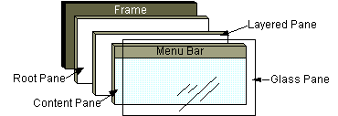
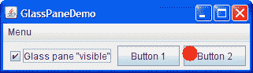
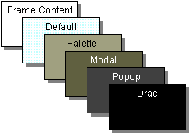
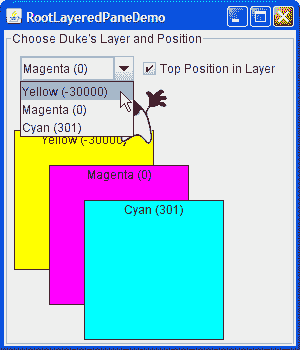

# 如何使用根窗格

> 原文：[`docs.oracle.com/javase/tutorial/uiswing/components/rootpane.html`](https://docs.oracle.com/javase/tutorial/uiswing/components/rootpane.html)

通常情况下，你不会直接创建一个[`JRootPane`](https://docs.oracle.com/javase/8/docs/api/javax/swing/JRootPane.html)对象。相反，当你实例化`JInternalFrame`或其中一个顶级 Swing 容器时，例如`JApplet`、`JDialog`和`JFrame`，你会得到一个`JRootPane`（不管你是否想要！）。

使用顶级容器告诉你如何使用根窗格的基础知识 — 获取内容窗格，设置其布局管理器，并向其添加 Swing 组件。本节将告诉你更多关于根窗格的内容，包括组成根窗格的组件以及如何使用它们。



如前图所示，根窗格有四个部分：

**玻璃窗格**

默认情况下隐藏。如果使玻璃窗格可见，那么它就像是覆盖在根窗格的所有其他部分上的一块玻璃板。除非你实现了玻璃窗格的`paintComponent`方法以执行某些操作，并且它可以拦截根窗格的输入事件，否则它是完全透明的。在下一节中，你将看到使用玻璃窗格的示例。

**分层窗格**

用于定位其内容的位置，包括内容窗格和可选菜单栏。还可以按指定的 Z 顺序容纳其他组件。有关详细信息，请参见分层窗格。

**内容窗格**

根窗格可见组件的容器，不包括菜单栏。有关使用内容窗格的信息，请参见使用顶级容器。

**可选菜单栏**

根窗格容器菜单的所在地。如果容器有一个菜单栏，通常使用容器的`setJMenuBar`方法将菜单栏放在适当的位置。有关使用菜单和菜单栏的更多信息，请参见如何启用菜单。

## 玻璃窗格

当你想要捕获事件或在已包含一个或多个组件的区域上绘制时，玻璃窗格非常有用。例如，你可以通过让玻璃窗格拦截事件来禁用多组件区域的鼠标事件。或者你可以使用玻璃窗格在多个组件上显示图像。

这是一个演示玻璃窗格功能的应用程序的图片。它包含一个复选框，让你设置玻璃窗格是否“可见” — 是否可以接收事件并在屏幕上绘制自己。当玻璃窗格可见时，它会阻止所有输入事件到达内容窗格中的组件。它还会在上次检测到鼠标按下事件的位置绘制一个红点。



* * *

**试试这个：**

1.  点击“启动”按钮以使用[Java™ Web Start](http://www.oracle.com/technetwork/java/javase/javawebstart/index.html)运行 GlassPaneDemo（[下载 JDK 7 或更高版本](http://www.oracle.com/technetwork/java/javase/downloads/index.html)）。或者，要自行编译和运行示例，请参考示例索引。

1.  点击按钮 1。

    按钮的外观会发生变化，显示已被点击。

1.  点击复选框，使玻璃窗格“可见”，然后再次点击按钮 1。

    按钮不会被点击，因为玻璃窗格拦截了所有鼠标事件。玻璃窗格在释放鼠标的位置绘制一个红色圆圈。

1.  再次点击复选框，使玻璃窗格隐藏。

    当玻璃窗格检测到在复选框上方发生事件时，它会将其转发给复选框。否则，复选框将不会响应点击。

* * *

以下来自`GlassPaneDemo.java`的代码显示和隐藏了玻璃窗格。该程序恰好创建了自己的玻璃窗格。但是，如果玻璃窗格不进行任何绘制，程序可能会简单地将侦听器附加到由`getGlassPane`返回的默认玻璃窗格。

```java
myGlassPane = new MyGlassPane(...);
changeButton.addItemListener(myGlassPane);
frame.setGlassPane(myGlassPane);
...
class MyGlassPane extends JComponent
                  implements ItemListener {
    ...
    //React to change button clicks.
    public void itemStateChanged(ItemEvent e) {
        setVisible(e.getStateChange() == ItemEvent.SELECTED);
    }
...
}

```

下一个代码片段实现了玻璃窗格的鼠标事件处理。如果鼠标事件发生在复选框上方，则玻璃窗格会重新分发事件，以便复选框接收到事件。

```java
*...//In the implementation of the glass pane's mouse listener:*
public void mouseMoved(MouseEvent e) {
    redispatchMouseEvent(e, false);
}

*.../* The mouseDragged, mouseClicked, mouseEntered,
    * mouseExited, and mousePressed methods have the same
    * implementation as mouseMoved. */...*

public void mouseReleased(MouseEvent e) {
    redispatchMouseEvent(e, true);
}

private void redispatchMouseEvent(MouseEvent e,
                                  boolean repaint) {
    Point glassPanePoint = e.getPoint();
    Container container = contentPane;
    Point containerPoint = SwingUtilities.convertPoint(
                                    glassPane,
                                    glassPanePoint,
                                    contentPane);

    if (containerPoint.y < 0) { //we're not in the content pane
        *//Could have special code to handle mouse events over
        //the menu bar or non-system window decorations, such as
        //the ones provided by the Java look and feel.*
    } else {
        //The mouse event is probably over the content pane.
        //Find out exactly which component it's over.
        Component component =
            SwingUtilities.getDeepestComponentAt(
                                    container,
                                    containerPoint.x,
                                    containerPoint.y);

        if ((component != null)
            && (component.equals(liveButton))) {
            //Forward events over the check box.
            Point componentPoint = SwingUtilities.convertPoint(
                                        glassPane,
                                        glassPanePoint,
                                        component);
            component.dispatchEvent(new MouseEvent(component,
                                                 e.getID(),
                                                 e.getWhen(),
                                                 e.getModifiers(),
                                                 componentPoint.x,
                                                 componentPoint.y,
                                                 e.getClickCount(),
                                                 e.isPopupTrigger()));
        }
    }

    //Update the glass pane if requested.
    if (repaint) {
        glassPane.setPoint(glassPanePoint);
        glassPane.repaint();
    }
}

```

这是在`MyGlassPane`中实现绘制的代码。

```java
protected void paintComponent(Graphics g) {
    if (point != null) {
        g.setColor(Color.red);
        g.fillOval(point.x - 10, point.y - 10, 20, 20);
    }
}

```

## 分层窗格

分层窗格是一个具有深度的容器，使得重叠的组件可以相互覆盖。有关分层窗格的一般信息，请参阅如何使用分层窗格。本节讨论了根窗格如何使用分层窗格。

每个根窗格都将其菜单栏和内容窗格放在`JLayeredPane`的一个实例中。分层窗格提供的 Z 排序使得可以在其他组件上方显示弹出菜单等行为。

您可以选择将组件放在根窗格的分层窗格中。如果这样做，那么您应该意识到某些深度被定义为用于特定功能，并且应该按照预期使用这些深度。否则，您的组件可能无法与其他组件很好地配合。以下是显示功能图层及其关系的图表：



下表描述了每个图层的预期用途，并列出了与每个图层对应的`JLayeredPane`常量：

| 图层名称 | 值 | 描述 |
| --- | --- | --- |
| `FRAME_CONTENT_LAYER` | `new Integer(-30000)` | 根窗格将菜单栏和内容窗格添加到此深度的分层窗格中。 |
| `DEFAULT_LAYER` | `new Integer(0)` | 如果在将组件添加到分层窗格时未指定组件的深度，则分层窗格会将其放在此深度处。 |
| `PALETTE_LAYER` | `new Integer(100)` | 此层对于浮动工具栏和调色板非常有用。 |
| `MODAL_LAYER` | `new Integer(200)` | 模态内部框对话框应属于此层。 |
| `POPUP_LAYER` | `new Integer(300)` | 弹出窗口应放在此层，因为它们需要出现在几乎所有内容的上方。 |
| `DRAG_LAYER` | `new Integer(400)` | 当组件被拖动时应使用。组件应在放下时返回到其常规层。 |

这是 RootLayeredPaneDemo 的图片，这是一个使用根窗格的分层窗格而不是创建新的分层窗格的版本的 LayeredPaneDemo。



* * *

**试一试：**

1.  单击“启动”按钮以使用[Java™ Web Start](http://www.oracle.com/technetwork/java/javase/javawebstart/index.html)运行 RootLayeredPaneDemo（[下载 JDK 7 或更高版本](http://www.oracle.com/technetwork/java/javase/downloads/index.html)）。或者，要自行编译和运行示例，请参考示例索引。

1.  在窗口中移动光标，使得杜克出现在其他组件的顶部。

    请注意，当光标停留在非标签组件上时 — 无论是在内容窗格中还是在 Java 外观提供的标题栏中 — 杜克的移动会暂时停止。这是因为鼠标移动事件传递给包含层次结构中最深且对鼠标事件感兴趣的组件。移动杜克的鼠标移动监听器已在分层窗格上注册，并且该窗格中的大多数组件（除了标签）恰好具有鼠标移动监听器。当鼠标移动到分层窗格中的一个感兴趣的组件上时，分层窗格不会收到事件，而感兴趣的组件会收到。

1.  确保选择了“在层中的顶部位置”复选框，将杜克的层更改为黄色（-30000）。

    与以前一样，他会出现在其他组件的顶部，除了品红色（0）和青色（301）的矩形。

1.  保持杜克在黄色层中，单击复选框将杜克发送到层的后面 -30000。

    杜克消失了，因为内容窗格及其中的所有组件现在都在他的上方。

1.  将杜克的层更改为青色（301），将杜克向下移动一点，使其站在黄色矩形的顶边上，然后按空格键打开组合框的下拉列表。

    如果外观实现下拉列表作为轻量级弹出窗口，杜克会出现在下拉列表的顶部。

* * *

## 根窗格 API

接下来的表格列出了使用根窗格、玻璃窗格和内容窗格的 API。有关使用内容窗格的更多信息，请转到使用顶层容器。本节中的表格如下：

+   使用根窗格

+   设置或获取根窗格的内容

使用根窗格的 API 描述在其他地方：

+   分层窗格 API

+   菜单 API

使用根窗格

| 方法 | 目的 |
| --- | --- |
| [JRootPane getRootPane()](https://docs.oracle.com/javase/8/docs/api/javax/swing/JFrame.html#getRootPane--) *(在`JApplet`、`JDialog`、`JFrame`、`JInternalFrame`和`JWindow`中)* | 获取 applet、dialog、frame、internal frame 或 window 的根窗格。 |
| [static JRootPane getRootPane(Component)](https://docs.oracle.com/javase/8/docs/api/javax/swing/SwingUtilities.html#getRootPane-java.awt.Component-) *(在`SwingUtilities`中)* | 如果组件包含根窗格，则返回该根窗格。否则，返回包含该组件的根窗格（如果有）。 |
| [JRootPane getRootPane()](https://docs.oracle.com/javase/8/docs/api/javax/swing/JComponent.html#getRootPane--) *(在`JComponent`中)* | 为`JComponent`调用`SwingUtilities`的`getRootPane`方法。 |
| [void setDefaultButton(JButton)](https://docs.oracle.com/javase/8/docs/api/javax/swing/JRootPane.html#setDefaultButton-javax.swing.JButton-) [JButton getDefaultButton()](https://docs.oracle.com/javase/8/docs/api/javax/swing/JRootPane.html#getDefaultButton--) | 设置或获取根窗格中的默认按钮（如果有）。特定外观和感觉的操作，如按下 Enter 键，会执行按钮的操作。 |

设置或获取根窗格的内容

*以下方法在`JApplet`、`JDialog`、`JFrame`、`JInternalFrame`、`JRootPane`和`JWindow`中定义，除非另有说明。*

| 方法 | 目的 |
| --- | --- |
| [void setGlassPane(Component)](https://docs.oracle.com/javase/8/docs/api/javax/swing/JFrame.html#setGlassPane-java.awt.Component-) [Component getGlassPane()](https://docs.oracle.com/javase/8/docs/api/javax/swing/JFrame.html#getGlassPane--) | 设置或获取玻璃窗格。 |
| [void setLayeredPane(JLayeredPane)](https://docs.oracle.com/javase/8/docs/api/javax/swing/JFrame.html#setLayeredPane-javax.swing.JLayeredPane-) [Container getLayeredPane()](https://docs.oracle.com/javase/8/docs/api/javax/swing/JFrame.html#getLayeredPane--) | 设置或获取分层窗格。 |
| [void setContentPane(Container)](https://docs.oracle.com/javase/8/docs/api/javax/swing/JFrame.html#setContentPane-java.awt.Container-) [Container getContentPane()](https://docs.oracle.com/javase/8/docs/api/javax/swing/JFrame.html#getContentPane--) | 设置或获取内容面板。 |

| [void setJMenuBar(JMenuBar)](https://docs.oracle.com/javase/8/docs/api/javax/swing/JFrame.html#setJMenuBar-javax.swing.JMenuBar-) [JMenuBar getJMenuBar()](https://docs.oracle.com/javase/8/docs/api/javax/swing/JFrame.html#getJMenuBar--)

*(未在`JWindow`中定义)* | 设置或获取菜单栏。

## 使用根窗格的示例

每个 Swing 程序都有一个根窗格，但很少直接引用它。以下列表中的示例演示了如何使用`JRootPane`或玻璃窗格的功能。还请参阅以下列表：

+   使用分层窗格的示例

+   使用菜单的示例

+   使用框架的示例（用于使用内容窗格的示例）

| 示例 | 描述位置 | 注释 |
| --- | --- | --- |
| `GlassPaneDemo` | 本节 | 使用绘制位和重新分发事件的玻璃窗格。 |
| `RootLayeredPaneDemo` | 本节 | 调整 LayeredPaneDemo 以使用根窗格的分层窗格。 |
| `ListDialog` | 如何使用列表 | 设置`JDialog`的默认按钮。 |
| `FrameDemo2` | 如何制作框架 | 为`JFrame`设置默认按钮。 |
