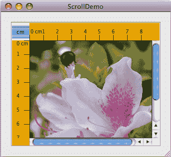

# 如何使用滚动窗格

> 原文：[`docs.oracle.com/javase/tutorial/uiswing/components/scrollpane.html`](https://docs.oracle.com/javase/tutorial/uiswing/components/scrollpane.html)

[`JScrollPane`](https://docs.oracle.com/javase/8/docs/api/javax/swing/JScrollPane.html)提供了一个组件的可滚动视图。当屏幕空间有限时，使用滚动窗格来显示一个大的组件或一个大小可以动态改变的组件。用于节省屏幕空间的其他容器包括分割窗格和选项卡窗格。

创建滚动窗格的代码可以很简洁。例如，这里有一个演示程序的图片，将一个文本区域放入滚动窗格中，因为随着文本的追加，文本区域的大小会动态增长：


这是创建文本区域、将其设置为滚动窗格的客户端并将滚动窗格添加到容器的代码：

```java
*//In a container that uses a BorderLayout:*
textArea = new JTextArea(5, 30);
...
JScrollPane scrollPane = new JScrollPane(textArea);
...
setPreferredSize(new Dimension(450, 110));
...
add(scrollPane, BorderLayout.CENTER);

```

粗体代码行创建了`JScrollPane`，指定文本区域为滚动窗格的客户端。程序不会在`JScrollPane`对象上调用任何方法，因为滚动窗格会自动处理一切：在必要时创建滚动条，当用户移动滚动条时重新绘制客户端等。

您可能已经注意到前面的代码设置了滚动窗格容器的首选大小。在 Java 外观中，这个首选大小恰好比我们在创建时请求的 5 行文本区域显示所需的高度要低一点，因此滚动条最初会显示一个垂直滚动条。如果我们不限制滚动窗格容器的大小，滚动窗格将足够大，以便文本区域显示使用`JTextArea`构造函数指定的完整 5 行和 30 列。有关使滚动窗格达到所需大小的技术信息，请参考 Sizing a Scroll Pane。

本节的其余部分讨论以下主题：

+   滚动窗格的工作原理

+   设置滚动条策略

+   提供自定义装饰

+   实现具有滚动功能的客户端

+   调整滚动窗格大小

+   动态更改客户端大小

+   滚动窗格 API

+   使用滚动窗格的示例

## 滚动窗格的工作原理

这是一个应用程序的快照，使用定制的滚动窗格查看照片：



此应用程序中的滚动窗格与先前的演示程序中的滚动窗格非常不同。这个滚动窗格不是显示文本，而是包含一个图像。滚动窗格还有两个滚动条，一个行标题，一个列标题和四个角，其中三个已经定制。

* * *

**试试这个：**

1.  点击“启动”按钮以使用[Java™ Web Start](http://www.oracle.com/technetwork/java/javase/javawebstart/index.html)运行 ScrollDemo（[下载 JDK 7 或更高版本](http://www.oracle.com/technetwork/java/javase/downloads/index.html)）。或者，要自行编译和运行示例，请参考示例索引。

1.  移动滚动条上的旋钮。观察图像滚动以及水平和垂直标尺的滚动。

1.  如果您的鼠标带有滚轮（通常位于鼠标按钮之间），请使用鼠标滚轮垂直滚动图像。

1.  点击滚动窗格左上角的**cm**切换按钮。行和列标题上的单位将更改为英寸（或切换回厘米）。

1.  点击滚动条上的箭头按钮。还可以尝试点击垂直滚动条旋钮上方或下方的轨道，或水平滚动条左侧或右侧。

1.  将光标移动到图像上并按下光标。继续按住光标，拖动到图像外部的某个点并暂停。图像的可见区域朝光标移动。这种通过拖动进行滚动的功能由滚动窗格和`JComponent` API 启用，但由显示图像的自定义组件实现。

1.  调整窗口大小。注意当滚动窗格足够大以显示整个图像时，滚动条会消失，并在滚动窗格太小以显示整个图像时重新出现。

* * *

在创建滚动窗格时，ScrollDemo 程序会建立滚动窗格的客户端：

```java
//*Where the member variables are declared:*
private ScrollablePicture picture;
...
//*Where the GUI is created:*
picture = new ScrollablePicture( *...* );
JScrollPane pictureScrollPane = new JScrollPane(picture);

```

滚动窗格的客户端也被称为*视图*或*视口视图*。您可以通过调用`setViewportView`方法动态更改客户端。请注意，`JScrollPane`没有对应的`getViewportView`方法。如果您需要再次引用客户端对象，可以将其缓存在变量中，或在滚动窗格上调用`getViewport().getViewportView()`。

当用户操作滚动窗格中的滚动条时，客户端可见区域相应地发生变化。这张图片展示了滚动窗格与其客户端之间的关系，并指示了滚动窗格委托的类来帮助：


滚动窗格使用[`JViewport`](https://docs.oracle.com/javase/8/docs/api/javax/swing/JViewport.html)实例来管理客户端的可见区域。视口负责根据滚动条的位置来定位和调整客户端的大小，并显示它。

滚动窗格可能使用两个单独的[`JScrollBar`](https://docs.oracle.com/javase/8/docs/api/javax/swing/JScrollBar.html)实例作为滚动条。滚动条为用户提供操作可见区域的接口。下图显示了滚动条的三个区域：滑块（有时称为*拇指*）、（箭头）按钮和轨道。


当用户上下移动垂直滚动条上的滑块时，客户端的可见区域上下移动。类似地，当用户左右移动水平滚动条上的滑块时，客户端的可见区域相应地左右移动。滑块相对于其轨道的位置与可见区域相对于客户端的位置成比例。在 Java 外观和其他一些外观中，滑块的大小给出了客户端可见部分的视觉线索。

通过单击箭头按钮，用户可以按*单位增量*滚动。通过在轨道内部单击，用户可以按*块增量*滚动。如果用户使用带有滚轮的鼠标，则用户可以使用鼠标滚轮垂直滚动。鼠标滚轮滚动的量取决于平台。例如，在 Windows XP 上，默认情况下，鼠标滚轮每次滚动三个单位增量；鼠标控制面板允许您指定不同数量的单位增量或使用块增量。有关单位和块增量的更多信息，请参阅实现滚动智能客户端。

典型的程序不会直接实例化或调用视口或滚动条的方法。相反，程序使用`JScrollPane` API 和实现滚动智能客户端中讨论的 API 来实现滚动行为。一些具有滚动智能的组件，如`JList`、`JTable`和`JTree`，还提供其他 API 来帮助您影响它们的滚动行为。

## 设置滚动条策略

在`ScrollDemo`应用程序启动时，滚动窗格有两个滚动条。如果将窗口放大，两个滚动条都会消失，因为它们不再需要。然后，如果只缩小窗口的高度而不改变宽度，则垂直滚动条会重新出现。进一步的实验将显示，在此应用程序中，根据需要，两个滚动条都会消失和重新出现。此行为由滚动窗格的*滚动条策略*控制，实际上，有两种策略：每个滚动条都有自己的策略。

`ScrollDemo`没有明确设置滚动窗格的滚动条策略 — 它使用默认值。您可以在创建滚动窗格时设置策略，或在运行时动态更改它们。

在`JScrollPane`提供的构造函数中，这两个构造函数允许您在创建滚动窗格时设置滚动条策略：

```java
JScrollPane(Component, int, int)
JScrollPane(int, int)

```

第一个`int`指定垂直滚动条的策略；第二个指定水平滚动条的策略。您还可以使用`setHorizontalScrollBarPolicy`和`setVerticalScrollBarPolicy`方法动态设置策略。在构造函数和方法中，使用[`ScrollPaneConstants`](https://docs.oracle.com/javase/8/docs/api/javax/swing/ScrollPaneConstants.html)接口中定义的以下常量之一（该接口由`JScrollPane`实现）：

| 策略 | 描述 |
| --- | --- |
| `VERTICAL_SCROLLBAR_AS_NEEDED` `HORIZONTAL_SCROLLBAR_AS_NEEDED` | 默认选项。当视口小于客户端时，滚动条出现；当视口大于客户端时，滚动条消失。 |
| `VERTICAL_SCROLLBAR_ALWAYS` `HORIZONTAL_SCROLLBAR_ALWAYS` | 总是显示滚动条。如果视口足够大以显示整个客户端，则滑块会消失。 |
| `VERTICAL_SCROLLBAR_NEVER` `HORIZONTAL_SCROLLBAR_NEVER` | 从不显示滚动条。如果您不希望用户直接控制客户端显示的部分，或者希望他们仅使用非滚动条技术（如拖动），请使用此选项。 |

## 提供自定义装饰

滚动窗格绘制的区域由最多九个部分组成：中心、四边和四个角。中心是所有滚动窗格中始终存在的唯一组件。除了滚动条，边可以包含列和行标题。只有当相交于该角的两边包含可见组件时，角组件才可见。


如图所示，在`ScrollDemo`中的滚动窗格具有自定义的行和列标题。此外，因为所有四边都被填充，所有四个角都存在。程序自定义了三个角——两个只是用与`Rule`相同颜色填充其区域，另一个包含一个切换按钮。第四个角，右下角，是滚动窗格提供的默认角。请注意，因为在此示例中行和列标题始终存在，切换按钮也始终存在。

如果一个角落包含用户始终需要访问的控件，请确保相交于该角落的边始终存在。例如，如果该应用程序将切换放置在下右角，与滚动条相交的地方，那么如果用户调整窗口大小，甚至一个滚动条消失，切换也会消失。

滚动窗格的行和列标题由自定义的`JComponent`子类`Rule`提供，该子类以厘米或英寸绘制标尺。以下是创建并设置滚动窗格的行和列标题的代码：

```java
*//Where the member variables are defined:*
private Rule columnView;
private Rule rowView;
...
*//Where the GUI is initialized:*
ImageIcon bee = createImageIcon("images/flyingBee.jpg");
...
//Create the row and column headers.
columnView = new Rule(Rule.HORIZONTAL, true);
rowView = new Rule(Rule.VERTICAL, true);

...
pictureScrollPane.setColumnHeaderView(columnView);
pictureScrollPane.setRowHeaderView(rowView);

```

您可以为滚动窗格的行和列标题使用任何组件。滚动窗格将行和列标题放在它们自己的`JViewPort`中。因此，水平滚动时，列标题会跟随移动，垂直滚动时，行标题会跟随移动。确保行和列与视图具有相同的宽度和高度，因为`JScrollPane`不强制执行这些值具有相同的大小。如果一个与另一个不同，您可能无法获得所需的行为。

作为`JComponent`子类，我们的自定义`Rule`类将其渲染代码放在其`paintComponent`方法中。`Rule`渲染代码确保仅在当前裁剪边界内绘制，以确保快速滚动。您的自定义行和列标题应该做同样的事情。

您还可以为滚动窗格的角使用任何组件。`ScrollDemo`通过在左上角放置一个切换按钮，并在右上角和左下角放置自定义`Corner`对象来说明这一点。以下是创建`Corner`对象并调用`setCorner`将它们放置的代码：

```java
//Create the corners.
JPanel buttonCorner = new JPanel(); //use FlowLayout
isMetric = new JToggleButton("cm", true);
isMetric.setFont(new Font("SansSerif", Font.PLAIN, 11));
isMetric.setMargin(new Insets(2,2,2,2));
isMetric.addItemListener(this);
buttonCorner.add(isMetric);
...
//Set the corners.
pictureScrollPane.setCorner(JScrollPane.UPPER_LEFT_CORNER,
                            buttonCorner);
pictureScrollPane.setCorner(JScrollPane.LOWER_LEFT_CORNER,
                            new Corner());
pictureScrollPane.setCorner(JScrollPane.UPPER_RIGHT_CORNER,
                            new Corner());

```

记住，每个角的大小由相交的边的大小确定。对于某些组件，您必须确保组件的特定实例适合其角落。例如，程序设置了切换按钮的字体和边距，以使其适应标题所确定的空间。这不是`Corner`类的问题，因为该类用单一颜色填充其整个边界，无论它们是什么颜色。

从代码中可以看出，常量指示角的位置。此图显示了每个位置的常量：


这些常量在[`ScrollPaneConstants`](https://docs.oracle.com/javase/8/docs/api/javax/swing/ScrollPaneConstants.html)接口中定义，`JScrollPane`实现了该接口。

## 实现滚动智能客户端

要自定义客户端组件与其滚动窗格的交互方式，您可以使组件实现[`Scrollable`](https://docs.oracle.com/javase/8/docs/api/javax/swing/Scrollable.html)接口。通过实现`Scrollable`，客户端可以指定用于查看它的视口的大小以及单击滚动条上不同控件时滚动的量。您还可以指定视图是否应跟踪视口的大小。当视口大于视图时，但视图应填充可用空间时，通常会使用此选项。

* * *

**注意：**如果您无法或不想实现可滚动的客户端，可以使用`setUnitIncrement`和`setBlockIncrement`方法来指定单位和块增量[`JScrollBar`](https://docs.oracle.com/javase/8/docs/api/javax/swing/JScrollBar.html)。例如，以下代码将垂直滚动的单位增量设置为 10 像素：

```java
scrollPane.getVerticalScrollBar().setUnitIncrement(10);

```

* * *

这里再次介绍滚动条的三个控制区域：旋钮、按钮和轨道。


您可能已经注意到，在`ScrollDemo`中操作滚动条时，单击按钮会将图像滚动到刻度边界。您可能还注意到，在轨道上单击会将图片滚动一个“屏幕”。更一般地，按钮按单位增量滚动可见区域，轨道按块增量滚动可见区域。您在示例中看到的行为不是滚动窗格的默认行为，而是由客户端在其实现`Scrollable`接口时指定的。

`ScrollDemo`程序的客户端是`ScrollablePicture`。`ScrollablePicture`是`JLabel`的子类，提供了所有五个`Scrollable`方法的实现：

+   `getScrollableBlockIncrement`

+   `getScrollableUnitIncrement`

+   `getPreferredScrollableViewportSize`

+   `getScrollableTracksViewportHeight`

+   `getScrollableTracksViewportWidth`

`ScrollablePicture`主要实现`Scrollable`接口以影响单位和块增量。但是，它必须为所有五个方法提供实现。因此，它为其他三个方法提供了合理的默认值，您可能希望为您的滚动类复制这些默认值。

每当用户单击滚动条上的按钮时，滚动窗格都会调用客户端的`getScrollableUnitIncrement`方法。只要客户端实现了 Scrollable 接口，这就是真的。此方法返回要滚动的像素数。该方法的一个明显实现是返回标头标尺上刻度标记之间的像素数。然而，`ScrollablePicture`做了不同的事情：它返回将图像定位在刻度标记边界上所需的值。以下是实现：

```java
public int getScrollableUnitIncrement(Rectangle visibleRect,
                                      int orientation,
                                      int direction) {
    //Get the current position.
    int currentPosition = 0;
    if (orientation == SwingConstants.HORIZONTAL) {
        currentPosition = visibleRect.x;
    } else {
        currentPosition = visibleRect.y;
    }

    //Return the number of pixels between currentPosition
    //and the nearest tick mark in the indicated direction.
    if (direction < 0) {
        int newPosition = currentPosition -
                         (currentPosition / maxUnitIncrement)
                          * maxUnitIncrement;
        return (newPosition == 0) ? maxUnitIncrement : newPosition;
    } else {
        return ((currentPosition / maxUnitIncrement) + 1)
                 * maxUnitIncrement
                 - currentPosition;
    }
}

```

如果图像已经在刻度标记边界上，此方法返回刻度之间的像素数。否则，它返回从当前位置到最近刻度的像素数。

同样，滚动窗格在用户点击轨道时调用客户端的`getScrollableBlockIncrement`方法，但仅当客户端实现了 Scrollable 接口时才调用。这是`ScrollablePicture`对该方法的实现：

```java
public int getScrollableBlockIncrement(Rectangle visibleRect,
                                       int orientation,
                                       int direction) {
    if (orientation == SwingConstants.HORIZONTAL)
        return visibleRect.width - maxUnitIncrement;
    else
        return visibleRect.height - maxUnitIncrement;
}

```

此方法返回可见矩形的高度减去一个刻度标记。这种行为在垂直滚动时很典型，否则，它是宽度。块增量应略小于视口，以留下一点之前可见区域的上下文。例如，文本区域可能留下一两行文本作为上下文，表格可能留下一行或一列（取决于滚动方向）。

`ScrollablePicture.java`还有一段代码，这段代码不是`Scrollable`接口所必需的，但在可滚动组件中很常见：一个鼠标移动监听器，让用户通过从图片上拖动来滚动图片。以下代码中的粗体代码实现了通过拖动来滚动：

```java
public class ScrollablePicture extends JLabel
                               implements Scrollable,
                                          MouseMotionListener {
    ...
    public ScrollablePicture(...) {
        ...
        setAutoscrolls(true); //enable synthetic drag events
        addMouseMotionListener(this); //handle mouse drags
    }
    ...
    public void mouseDragged(MouseEvent e) {
        //The user is dragging us, so scroll!
        Rectangle r = new Rectangle(e.getX(), e.getY(), 1, 1);
        scrollRectToVisible(r);
    }
...
}

```

当用户从图片拖动到图片外部位置并暂停时，此代码片段会滚动图片。`setAutoscrolls`方法由`JComponent`定义，用于辅助滚动而不是实现拖动滚动。将 autoscrolls 属性设置为`true`会使组件即使鼠标没有移动（因为它在组件外部停止拖动），也会触发合成鼠标拖动事件。组件的鼠标移动监听器应该监听这些事件并做出相应反应。

## 调整滚动窗格大小

除非你明确设置了滚动窗格的首选大小，否则滚动窗格会根据其九个组件的首选大小来计算它的首选大小（视口以及如果存在的话，两个滚动条，行和列标题以及四个角）。最大的因素，也是大多数程序员关心的因素，是用于显示客户端的视口的大小。

如果客户端不懂滚动，那么滚动窗格会自动调整大小，以便客户端以其首选大小显示。对于典型的不懂滚动的客户端，这使得滚动窗格变得多余。也就是说，滚动窗格没有滚动条，因为客户端的首选大小足够显示整个客户端。在这种情况下，如果客户端不会动态改变大小，你应该通过设置其首选大小或其容器的首选大小来限制滚动窗格的大小。

如果客户端懂滚动，那么滚动窗格会使用客户端的`getPreferredScrollableViewportSize`方法返回的值来计算其视口的大小。该方法的实现通常报告一个比组件的标准首选大小小的滚动的首选大小。例如，默认情况下，`JList`的`getPreferredScrollableViewportSize`实现返回的值刚好足够显示八行。

像列表、表格、文本组件和树形结构这样的懂滚动的类通常提供一个或多个方法，让程序员影响`getPreferredScrollableViewportSize`返回的大小。例如，你可以通过调用`setVisibleRowCount`方法来设置列表或树中可见行的数量。列表或树会负责计算显示该行数所需的大小。

参考与滚动相关的其他类中的方法以获取除`JScrollPane`之外的类提供的与滚动相关的方法的信息。记住，如果你不喜欢`getPreferredScrollableViewportSize`返回的值，你总是可以设置滚动窗格或其容器的首选大小。

## 动态更改客户端的大小

更改滚动窗格客户端的大小是一个两步过程。首先，设置客户端的首选大小。然后，在客户端上调用`revalidate`，让滚动窗格知道它应该更新自身和其滚动条。让我们看一个例子。

这是一个应用程序的图片，当用户放置一个边界超出当前边界的圆圈时，客户端的大小会发生变化。当用户清除绘图区域时，程序也会更改客户端的大小：


你可以在`ScrollDemo2.java`中找到此示例的完整源代码，该示例基于教程读者约翰·维拉提供的示例。你可以[运行 ScrollDemo2](https://docs.oracle.com/javase/tutorialJWS/samples/uiswing/ScrollDemo2Project/ScrollDemo2.jnlp)（[下载 JDK 7 或更高版本](http://www.oracle.com/technetwork/java/javase/downloads/index.html)）。

这是在必要时更改绘图区域大小的代码：

```java
if (changed) {
    //Update client's preferred size because
    //the area taken up by the graphics has
    //gotten larger or smaller (if cleared).
    drawingArea.setPreferredSize(*/* the new size */*);

    //Let the scroll pane know to update itself
    //and its scroll bars.
    drawingArea.revalidate();
}

```

请注意，当客户端更改大小时，滚动条会调整。滚动窗格不会调整大小，视口也不会调整大小。

参考`SplitPaneDemo`以查看另一个客户端对象大小变化的示例。

## 滚动窗格 API

以下表格列出了常用的与滚动相关的构造函数和方法。您最有可能在`JScrollPane`对象上调用的其他方法是其超类提供的`setPreferredSize`等方法。请参阅 The JComponent API 以查看常用继承方法的表格。

使用滚动窗格的 API 分为以下几类：

+   设置滚动窗格

+   装饰滚动窗格

+   实现滚动智能客户端

+   与滚动相关的其他类中的方法

设置滚动窗格

（`JScrollPane`构造函数和方法）

| 方法或构造函数 | 目的 |
| --- | --- |

| [JScrollPane()](https://docs.oracle.com/javase/8/docs/api/javax/swing/JScrollPane.html#JScrollPane--) [JScrollPane(Component)](https://docs.oracle.com/javase/8/docs/api/javax/swing/JScrollPane.html#JScrollPane-java.awt.Component-)

[JScrollPane(int, int)](https://docs.oracle.com/javase/8/docs/api/javax/swing/JScrollPane.html#JScrollPane-int-int-)

[JScrollPane(Component, int, int)](https://docs.oracle.com/javase/8/docs/api/javax/swing/JScrollPane.html#JScrollPane-java.awt.Component-int-int-) | 创建一个滚动窗格。`Component`参数在存在时设置滚动窗格的客户端。两个`int`参数在存在时分别设置垂直和水平滚动条策略。|

| [`void setViewportView(Component)`](https://docs.oracle.com/javase/8/docs/api/javax/swing/JScrollPane.html#setViewportView-java.awt.Component-) | 设置滚动窗格的客户端。 |
| --- | --- |
| [`void setVerticalScrollBarPolicy(int)`](https://docs.oracle.com/javase/8/docs/api/javax/swing/JScrollPane.html#setVerticalScrollBarPolicy-int-) [`int getVerticalScrollBarPolicy()`](https://docs.oracle.com/javase/8/docs/api/javax/swing/JScrollPane.html#getVerticalScrollBarPolicy--) | 设置或获取垂直滚动策略。`ScrollPaneConstants`定义了三个值来指定此策略：`VERTICAL_SCROLLBAR_AS_NEEDED`（默认值）、`VERTICAL_SCROLLBAR_ALWAYS`和`VERTICAL_SCROLLBAR_NEVER`。 |
| [void setHorizontalScrollBarPolicy(int)](https://docs.oracle.com/javase/8/docs/api/javax/swing/JScrollPane.html#setHorizontalScrollBarPolicy-int-) [int getHorizontalScrollBarPolicy()](https://docs.oracle.com/javase/8/docs/api/javax/swing/JScrollPane.html#getHorizontalScrollBarPolicy--) | 设置或获取水平滚动策略。`ScrollPaneConstants`定义了三个值来指定此策略：`HORIZONTAL_SCROLLBAR_AS_NEEDED`（默认值）、`HORIZONTAL_SCROLLBAR_ALWAYS`和`HORIZONTAL_SCROLLBAR_NEVER`。 |
| [void setViewportBorder(Border)](https://docs.oracle.com/javase/8/docs/api/javax/swing/JScrollPane.html#setViewportBorder-javax.swing.border.Border-) [Border getViewportBorder()](https://docs.oracle.com/javase/8/docs/api/javax/swing/JScrollPane.html#getViewportBorder--) | 设置或获取视口周围的边框。这比在组件上设置边框更可取。 |
| [boolean isWheelScrollingEnabled()](https://docs.oracle.com/javase/8/docs/api/javax/swing/JScrollPane.html#isWheelScrollingEnabled--) | 设置或获取是否响应鼠标滚轮进行滚动。默认情况下启用鼠标滚轮滚动。 |

装饰滚动窗格

(`JScrollPane` 方法)

| 方法 | 目的 |
| --- | --- |
| [void setColumnHeaderView(Component)](https://docs.oracle.com/javase/8/docs/api/javax/swing/JScrollPane.html#setColumnHeaderView-java.awt.Component-) [void setRowHeaderView(Component)](https://docs.oracle.com/javase/8/docs/api/javax/swing/JScrollPane.html#setRowHeaderView-java.awt.Component-) | 设置滚动窗格的列或行标题。 |
| [void setCorner(String, Component)](https://docs.oracle.com/javase/8/docs/api/javax/swing/JScrollPane.html#setCorner-java.lang.String-java.awt.Component-) [Component getCorner(String)](https://docs.oracle.com/javase/8/docs/api/javax/swing/JScrollPane.html#getCorner-java.lang.String-) | 设置或获取指定的角落。`int` 参数指定哪个角落，并且必须是`ScrollPaneConstants`中定义的以下常量之一：`UPPER_LEFT_CORNER`、`UPPER_RIGHT_CORNER`、`LOWER_LEFT_CORNER`、`LOWER_RIGHT_CORNER`、`LOWER_LEADING_CORNER`、`LOWER_TRAILING_CORNER`、`UPPER_LEADING_CORNER`和`UPPER_TRAILING_CORNER`。 |

实现滚动智能客户端

| 方法 | 目的 |
| --- | --- |

| [int getScrollableUnitIncrement(Rectangle, int, int)](https://docs.oracle.com/javase/8/docs/api/javax/swing/Scrollable.html#getScrollableUnitIncrement-java.awt.Rectangle-int-int-) [int getScrollableBlockIncrement(Rectangle, int, int)](https://docs.oracle.com/javase/8/docs/api/javax/swing/Scrollable.html#getScrollableBlockIncrement-java.awt.Rectangle-int-int-)

*(`Scrollable` 接口所需)* | 获取以像素为单位的单位或块增量。`Rectangle` 参数是当前可见矩形的边界。第一个 `int` 参数是根据用户单击的滚动条是 `SwingConstants.HORIZONTAL` 还是 `SwingConstants.VERTICAL`。第二个 `int` 参数指示要滚动的方向。小于 0 的值表示向上或向左。大于 0 的值表示向下或向右。

| [Dimension getPreferredScrollableViewportSize()](https://docs.oracle.com/javase/8/docs/api/javax/swing/Scrollable.html#getPreferredScrollableViewportSize--) *(`Scrollable` 接口所需)* | 获取视口的首选大小。这允许客户端影响其显示的视口的大小。如果视口大小不重要，实现此方法以返回 `getPreferredSize`。 |
| --- | --- |

| [boolean getScrollableTracksViewportWidth()](https://docs.oracle.com/javase/8/docs/api/javax/swing/Scrollable.html#getScrollableTracksViewportWidth--) [boolean getScrollableTracksViewportHeight()](https://docs.oracle.com/javase/8/docs/api/javax/swing/Scrollable.html#getScrollableTracksViewportHeight--)

*(`Scrollable` 接口所需)* | 获取滚动窗格是否应强制客户端与视口的宽度或高度相同。这两种方法中的任何一个返回 `true` 效果上都禁止水平或垂直滚动。

| [void setAutoscrolls(boolean)](https://docs.oracle.com/javase/8/docs/api/javax/swing/JComponent.html#setAutoscrolls-boolean-) *(在 `JComponent` 中)* | 设置当用户将鼠标拖动到组件外部并停止时是否生成合成的鼠标拖动事件；这些事件对于通过拖动进行滚动是必要的。默认情况下，该值为 `false`，但许多可滚动的组件如 `JTable` 和自定义组件会将该值设置为 `true`。 |
| --- | --- |

与滚动相关的其他类中的方法

| 方法 | 目的 |
| --- | --- |
| [void scrollRectToVisible(Rectangle)](https://docs.oracle.com/javase/8/docs/api/javax/swing/JComponent.html#scrollRectToVisible-java.awt.Rectangle-) *(在 `JComponent` 中)* | 如果组件位于支持滚动的容器中，如滚动窗格，则调用此方法会滚动滚动窗格，使指定的矩形可见。 |

| [void setVisibleRowCount(int)](https://docs.oracle.com/javase/8/docs/api/javax/swing/JList.html#setVisibleRowCount-int-) [int getVisibleRowCount()](https://docs.oracle.com/javase/8/docs/api/javax/swing/JList.html#getVisibleRowCount--)

*(在`JList`中)* | 设置或获取列表中有多少行是可见的。`getPreferredScrollableViewportSize`方法使用可见行数来计算其返回值。

| [void ensureIndexIsVisible(int)](https://docs.oracle.com/javase/8/docs/api/javax/swing/JList.html#ensureIndexIsVisible-int-) *(在`JList`中)* | 滚动以使指定索引处的行可见。此方法调用`scrollRectToVisible`，仅在列表位于支持滚动的容器中（如滚动窗格）时有效。 |
| --- | --- |

| [void setVisibleRowCount(int)](https://docs.oracle.com/javase/8/docs/api/javax/swing/JTree.html#setVisibleRowCount-int-) [int getVisibleRowCount()](https://docs.oracle.com/javase/8/docs/api/javax/swing/JTree.html#getVisibleRowCount--)

*(在`JTree`中)* | 设置或获取树中有多少行是可见的。`getPreferredScrollableViewportSize`方法使用可见行数来计算其返回值。

| [void scrollPathToVisible(TreePath)](https://docs.oracle.com/javase/8/docs/api/javax/swing/JTree.html#scrollPathToVisible-javax.swing.tree.TreePath-) [void scrollRowToVisible(int)](https://docs.oracle.com/javase/8/docs/api/javax/swing/JTree.html#scrollRowToVisible-int-)

*(在`JTree`中)* | 滚动以使指定的树路径或指定索引处的行可见。这些方法调用`scrollRectToVisible`，仅在树位于支持滚动的容器中（如滚动窗格）时有效。

| [void setScrollsOnExpand(boolean)](https://docs.oracle.com/javase/8/docs/api/javax/swing/JTree.html#setScrollsOnExpand-boolean-) [boolean getScrollsOnExpand()](https://docs.oracle.com/javase/8/docs/api/javax/swing/JTree.html#getScrollsOnExpand--)

*(在`JTree`中)* | 设置或获取用户展开节点时是否自动滚动。默认为 True。此功能仅在树位于支持滚动的容器中（如滚动窗格）时有效。

| [void setPreferredScrollableViewportSize(Dimension)](https://docs.oracle.com/javase/8/docs/api/javax/swing/JTable.html#setPreferredScrollableViewportSize-java.awt.Dimension-) *(在`JTable`中)* | 设置`getPreferredScrollableViewportSize`返回的值。 |
| --- | --- |

## 使用滚动窗格的示例

此表显示了使用`JScrollPane`的示例以及这些示例的描述位置。

| 示例 | 描述位置 | 备注 |
| --- | --- | --- |
| `ToolBarDemo` | 这一部分，如何使用工具栏 | 展示了滚动窗格的简单而典型的用法。 |
| `ScrollDemo` | 这一部分 | 使用了滚动窗格的许多功能。 |
| `ScrollDemo2` | 这一部分 | 展示了如何更改客户端的大小。 |
| `SplitPaneDemo` | 如何使用分割窗格, 如何使用列表 | 将列表和标签放入滚动窗格中。同时，展示了处理滚动窗格客户端大小变化的情况。 |
| `TableDemo` | 如何使用表格 | 将表格放入滚动窗格中。 |
| `TextSamplerDemo` | 使用文本组件 | 将文本区域、编辑器窗格和文本窗格放入滚动窗格中。 |
| `TreeDemo` | 如何使用树 | 将树放入滚动窗格中。 |

如果您正在使用 JavaFX 进行编程，请参阅[滚动窗格](https://docs.oracle.com/javase/8/javafx/user-interface-tutorial/scrollpane.htm)。
