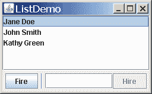

# 如何使用分隔符

> 原文：[`docs.oracle.com/javase/tutorial/uiswing/components/separator.html`](https://docs.oracle.com/javase/tutorial/uiswing/components/separator.html)

[`JSeparator`](https://docs.oracle.com/javase/8/docs/api/javax/swing/JSeparator.html)类提供水平或垂直的分隔线或空白空间。它最常用于菜单和工具栏。实际上，您甚至可以在不知道`JSeparator`类存在的情况下使用分隔符，因为菜单和工具栏提供了方便的方法来创建并添加针对其容器定制的分隔符。分隔符与边框有些相似，只是它们是真正的组件，因此会在容器内绘制，而不是在特定组件的边缘周围。

这是一个菜单的图片，其中有三个分隔符，用于将菜单分成四组项目：


将菜单项和分隔符添加到菜单的代码非常简单，大致如下：

```java
menu.add(menuItem1);
menu.add(menuItem2);
menu.add(menuItem3);
menu.addSeparator();
menu.add(rbMenuItem1);
menu.add(rbMenuItem2);
menu.addSeparator();
menu.add(cbMenuItem1);
menu.add(cbMenuItem2);
menu.addSeparator();
menu.add(submenu);

```

将分隔符添加到工具栏类似。您可以在菜单和工具栏的操作部分找到完整的代码解释。如果您想对菜单和工具栏中的分隔符有更多控制，可以直接使用实现它们的`JSeparator`子类：[JPopupMenu.Separator](https://docs.oracle.com/javase/8/docs/api/javax/swing/JPopupMenu.Separator.html)和[JToolBar.Separator](https://docs.oracle.com/javase/8/docs/api/javax/swing/JToolBar.Separator.html)。特别是，`JToolBar.Separator`具有用于指定分隔符大小的 API。

## 使用 JSeparator

您可以直接使用`JSeparator`类在任何容器中提供分隔线。以下图片显示了一个 GUI，其中在标有 Fire 的按钮右侧有一个分隔符。



分隔符几乎没有 API，并且非常容易使用，只要记住一件事：在大多数实现中，垂直分隔符的首选高度为 0，水平分隔符的首选宽度为 0。这意味着分隔符**不可见**，除非您设置其首选大小或将其放在像`BorderLayout`或`BoxLayout`这样的布局管理器的控制下，以拉伸以填充其可用的显示区域。

垂直分隔符确实有一定的宽度（水平分隔符有一定的高度），因此您应该看到分隔符所在的空间。但是，除非宽度和高度都不为零，否则不会绘制实际的分隔线。

以下代码片段显示了 ListDemo 如何组合包含垂直分隔符的面板。您可以在`ListDemo.java`中找到 ListDemo 的完整源代码。

```java
JPanel buttonPane = new JPanel();
buttonPane.setLayout(new BoxLayout(buttonPane,
                                   BoxLayout.LINE_AXIS));
buttonPane.add(fireButton);
buttonPane.add(Box.createHorizontalStrut(5));
buttonPane.add(new JSeparator(SwingConstants.VERTICAL));
buttonPane.add(Box.createHorizontalStrut(5));
buttonPane.add(employeeName);
buttonPane.add(hireButton);
buttonPane.setBorder(BorderFactory.createEmptyBorder(5,5,5,5));

```

正如代码所示，按钮、分隔符和文本字段都共享一个容器 — 一个使用从左到右的盒式布局的 `JPanel` 实例。由于布局管理器（以及分隔符具有无限的最大尺寸），分隔符会自动调整为其可用的显示区域一样高。

在上述代码中，水平支撑是不可见的组件，用于在分隔符周围提供空间。5 像素的空边框在面板周围提供缓冲，并防止分隔符延伸到其上方的组件和下方窗口的边缘。

这是另一个使用分隔符的 GUI 的图片，这次是为了在一组控件和显示区域之间放置一个分隔线。


您可以在示例索引中找到代码。以下是设置分隔符容器的代码：

```java
JPanel panel = new JPanel(new BorderLayout());
...
panel.setBorder(BorderFactory.createEmptyBorder(
                        GAP/2, //top
                        0,     //left
                        GAP/2, //bottom
                        0));   //right
panel.add(new JSeparator(JSeparator.VERTICAL),
          BorderLayout.LINE_START);
panel.add(addressDisplay,
          BorderLayout.CENTER);

```

与上一个示例一样，面板使用空边框，以便分隔符不会延伸到其容器的边缘。将分隔符放在由 `BorderLayout` 控制的容器的最左侧区域使分隔符与容器中心的地址显示组件一样高。有关边框布局工作原理的详细信息，请参阅如何使用 BorderLayout。

## 分隔符 API

使用分隔符的 API 很少，因为它们没有内容，也不响应用户输入。

创建和初始化分隔符

| 构造函数或方法 | 目的 |
| --- | --- |

| [void addSeparator()](https://docs.oracle.com/javase/8/docs/api/javax/swing/JToolBar.html#addSeparator--) [void addSeparator(Dimension)](https://docs.oracle.com/javase/8/docs/api/javax/swing/JToolBar.html#addSeparator-java.awt.Dimension-)

*(在 `JToolBar` 中)* | 在工具栏的当前末尾附加一个工具栏分隔符（在大多数情况下是不可见的），可选参数指定分隔符的大小。此方法的无参数版本使用默认大小的分隔符，由当前外观和感觉确定。 |

| [void addSeparator()](https://docs.oracle.com/javase/8/docs/api/javax/swing/JMenu.html#addSeparator--) [void insertSeparator(int)](https://docs.oracle.com/javase/8/docs/api/javax/swing/JMenu.html#insertSeparator-int-)

*(在 `JMenu` 中)* | 在菜单中放置一个分隔符。`addSeparator` 方法将分隔符放在菜单的当前末尾。`insertSeparator` 方法在指定位置将分隔符插入菜单中。 |

| [void addSeparator()](https://docs.oracle.com/javase/8/docs/api/javax/swing/JPopupMenu.html#addSeparator--) *(在 `JPopupMenu` 中)* | 在弹出菜单的当前末尾放置一个分隔符。 |
| --- | --- |
| [JSeparator()](https://docs.oracle.com/javase/8/docs/api/javax/swing/JSeparator.html#JSeparator--) [JSeparator(int)](https://docs.oracle.com/javase/8/docs/api/javax/swing/JSeparator.html#JSeparator-int-) | 创建一个分隔符。如果不指定参数，分隔符是水平的。参数可以是`SwingConstants.HORIZONTAL`或`SwingConstants.VERTICAL`。 |

| [void setOrientation(int)](https://docs.oracle.com/javase/8/docs/api/javax/swing/JSeparator.html#setOrientation-int-) [int getOrientation()](https://docs.oracle.com/javase/8/docs/api/javax/swing/JSeparator.html#getOrientation--)

*(在`JSeparator`中)* | 获取或设置分隔符的方向，可以是`SwingConstants.HORIZONTAL`或`SwingConstants.VERTICAL`。 |

| [JToolBar.Separator()](https://docs.oracle.com/javase/8/docs/api/javax/swing/JToolBar.Separator.html#JToolBar.Separator--) [JToolBar.Separator(Dimension)](https://docs.oracle.com/javase/8/docs/api/javax/swing/JToolBar.Separator.html#JToolBar.Separator-java.awt.Dimension-) | 创建用于工具栏的分隔符。可选参数指定分隔符的大小。 |
| --- | --- |
| [setSeparatorSize(Dimension)](https://docs.oracle.com/javase/8/docs/api/javax/swing/JToolBar.Separator.html#setSeparatorSize-java.awt.Dimension-) *(在`JToolBar.Separator`中)* | 指定分隔符的大小。更具体地说，指定的`Dimension`用作分隔符的最小、首选和最大大小。 |
| [JPopupMenu.Separator()](https://docs.oracle.com/javase/8/docs/api/javax/swing/JPopupMenu.Separator.html#JPopupMenu.Separator--) | 创建用于菜单的分隔符。 |

## 使用分隔符的示例

本课程的几个示例使用分隔符，通常在菜单中。以下是一些更有趣的示例列表。

| 示例 | 描述位置 | 备注 |
| --- | --- | --- |
| `ListDemo` | 本节和如何使用列表 | 在由水平盒式布局控制的面板中使用垂直分隔符。 |
| `TextInputDemo` | 本节和如何使用格式化文本字段 | 在由边界布局控制的面板左侧使用垂直分隔符。 |
| `MenuDemo` | 本节和如何使用菜单 | 使用`JMenu`方法`addSeparator`在菜单中放置分隔符。 |
| `ToolBarDemo2` | 如何使用工具栏 | 使用`JToolBar`方法`addSeparator`在两种按钮之间放置空间。 |

如果您正在使用 JavaFX 编程，请参阅[使用 JavaFX UI 控件](https://docs.oracle.com/javase/8/javafx/user-interface-tutorial/separator.htm)。
