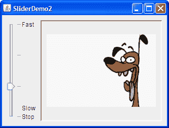

# 如何使用滑块

> 原文：[`docs.oracle.com/javase/tutorial/uiswing/components/slider.html`](https://docs.oracle.com/javase/tutorial/uiswing/components/slider.html)

[`JSlider`](https://docs.oracle.com/javase/8/docs/api/javax/swing/JSlider.html)组件旨在让用户轻松输入由最小值和最大值限定的数值。如果空间有限，spinner 是滑块的一个可能替代品。

以下图片显示了一个应用程序，该应用程序使用滑块来控制动画速度：


* * *

**试试这个：**

1.  单击“启动”按钮以使用[Java™ Web Start](http://www.oracle.com/technetwork/java/javase/javawebstart/index.html)运行 SliderDemo（[下载 JDK 7 或更高版本](http://www.oracle.com/technetwork/java/javase/downloads/index.html)）。或者，要自行编译和运行示例，请参考示例索引。

1.  使用滑块调整动画速度。

1.  将滑块推到 0 以停止动画。

* * *

以下是创建上一个示例中滑块的`SliderDemo.java`文件中的代码。

```java
static final int FPS_MIN = 0;
static final int FPS_MAX = 30;
static final int FPS_INIT = 15;    //initial frames per second
. . .
JSlider framesPerSecond = new JSlider(JSlider.HORIZONTAL,
                                      FPS_MIN, FPS_MAX, FPS_INIT);
framesPerSecond.addChangeListener(this);

//Turn on labels at major tick marks.
framesPerSecond.setMajorTickSpacing(10);
framesPerSecond.setMinorTickSpacing(1);
framesPerSecond.setPaintTicks(true);
framesPerSecond.setPaintLabels(true);

```

默认情况下，主要和次要刻度线的间距为零。要查看刻度线，必须显式设置主要或次要刻度线（或两者）的间距为非零值，并调用`setPaintTicks(true)`方法。但是，您还需要标签来标记刻度线。要在主要刻度线位置显示标准数字标签，请设置主要刻度线间距，然后调用`setPaintLabels(true)`方法。示例程序以这种方式为其滑块提供标签。但您不仅限于使用这些标签。自定义滑块上的标签向您展示如何自定义滑块标签。此外，滑块功能允许您为`JSlider`组件设置字体。

```java
Font font = new Font("Serif", Font.ITALIC, 15);
framesPerSecond.setFont(font);

```

当您移动滑块的旋钮时，将调用滑块的`ChangeListener`的`stateChanged`方法。有关更改侦听器的信息，请参阅如何编写更改侦听器。以下是对滑块值更改做出反应的更改侦听器代码：

```java
public void stateChanged(ChangeEvent e) {
    JSlider source = (JSlider)e.getSource();
    if (!source.getValueIsAdjusting()) {
        int fps = (int)source.getValue();
        if (fps == 0) {
            if (!frozen) stopAnimation();
        } else {
            delay = 1000 / fps;
            timer.setDelay(delay);
            timer.setInitialDelay(delay * 10);
            if (frozen) startAnimation();
        }
    }
}

```

请注意，只有当`getValueIsAdjusting`方法返回`false`时，`stateChanged`方法才会更改动画速度。当用户移动滑块旋钮时，会触发许多更改事件。该程序只对用户操作的最终结果感兴趣。

## 自定义滑块上的标签

下面的演示是使用具有自定义标签的滑块的 SliderDemo 的修改版本：



此程序的源代码可以在`SliderDemo2.java`中找到。点击“启动”按钮以使用[Java™ Web Start](http://www.oracle.com/technetwork/java/javase/javawebstart/index.html)运行 SliderDemo2（[下载 JDK 7 或更高版本](http://www.oracle.com/technetwork/java/javase/downloads/index.html)）。或者，要自行编译和运行示例，请参考示例索引。


以下代码创建滑块并自定义其标签：

```java
//Create the slider
JSlider framesPerSecond = new JSlider(JSlider.VERTICAL,
                                      FPS_MIN, FPS_MAX, FPS_INIT);
framesPerSecond.addChangeListener(this);
framesPerSecond.setMajorTickSpacing(10);
framesPerSecond.setPaintTicks(true);

//Create the label table
Hashtable labelTable = new Hashtable();
labelTable.put( new Integer( 0 ), new JLabel("Stop") );
labelTable.put( new Integer( FPS_MAX/10 ), new JLabel("Slow") );
labelTable.put( new Integer( FPS_MAX ), new JLabel("Fast") );
framesPerSecond.setLabelTable( labelTable );

framesPerSecond.setPaintLabels(true);

```

`setLabelTable`方法指定的哈希表中的每个键值对给出一个标签的位置和值。哈希表键必须是`Integer`类型，并且必须具有滑块范围内的一个值，以便放置标签。与每个键关联的哈希表值必须是一个`Component`对象。此演示使用仅包含文本的`JLabel`实例。一个有趣的修改是使用包含图标或按钮的`JLabel`实例，这些按钮可以将旋钮移动到标签的位置。

使用`JSlider`类的`createStandardLabels`方法创建一组在特定间隔位置的数字标签。您还可以修改`createStandardLabels`方法返回的表格，以进行自定义。

## 滑块 API

以下表格列出了常用的`JSlider`构造函数和方法。请参阅 The JComponent Class 以查看常用继承方法的表格。

使用滑块的 API 分为以下几个类别：

+   创建滑块

+   微调滑块的外观

+   观察滑块操作

+   直接使用数据模型

创建滑块

| 构造函数 | 目的 |
| --- | --- |
| [JSlider()](https://docs.oracle.com/javase/8/docs/api/javax/swing/JSlider.html#JSlider--) | 创建具有范围从 0 到 100 和初始值为 50 的水平滑块。 |
| [JSlider(int min, int max)](https://docs.oracle.com/javase/8/docs/api/javax/swing/JSlider.html#JSlider-int-int-) [JSlider(int min, int max, int value)](https://docs.oracle.com/javase/8/docs/api/javax/swing/JSlider.html#JSlider-int-int-int-) | 创建具有指定最小值和最大值的水平滑块。第三个`int`参数（如果存在）指定滑块的初始值。 |
| [JSlider(int orientation)](https://docs.oracle.com/javase/8/docs/api/javax/swing/JSlider.html#JSlider-int-) [JSlider(int orientation, int min, int max, int value)](https://docs.oracle.com/javase/8/docs/api/javax/swing/JSlider.html#JSlider-int-int-int-int-) | 创建具有指定方向的滑块，该方向必须是`JSlider.HORIZONTAL`或`JSlider.VERTICAL`。最后三个`int`参数（如果存在）分别指定滑块的最小值、最大值和初始值。 |
| [JSlider(BoundedRangeModel)](https://docs.oracle.com/javase/8/docs/api/javax/swing/JSlider.html#JSlider-javax.swing.BoundedRangeModel-) | 使用指定的模型创建水平滑块，该模型管理滑块的最小值、最大值和当前值及它们之间的关系。 |

调整滑块外观

| 方法 | 目的 |
| --- | --- |
| [void setValue(int)](https://docs.oracle.com/javase/8/docs/api/javax/swing/JSlider.html#setValue-int-) [int getValue()](https://docs.oracle.com/javase/8/docs/api/javax/swing/JSlider.html#getValue--) | 设置或获取滑块的当前值。设置方法还会定位滑块的旋钮。 |
| [void setOrientation(int)](https://docs.oracle.com/javase/8/docs/api/javax/swing/JSlider.html#setOrientation-int-) [int getOrientation()](https://docs.oracle.com/javase/8/docs/api/javax/swing/JSlider.html#getOrientation--) | 设置或获取滑块的方向。可能的值为`JSlider.HORIZONTAL`或`JSlider.VERTICAL`。 |
| [void setInverted(boolean)](https://docs.oracle.com/javase/8/docs/api/javax/swing/JSlider.html#setInverted-boolean-) [boolean getInverted()](https://docs.oracle.com/javase/8/docs/api/javax/swing/JSlider.html#getInverted--) | 设置或获取是否在水平滑块的左侧或垂直滑块的底部显示最大值，从而反转滑块的范围。 |

| [void setMinimum(int)](https://docs.oracle.com/javase/8/docs/api/javax/swing/JSlider.html#setMinimum-int-) [int getMinimum()](https://docs.oracle.com/javase/8/docs/api/javax/swing/JSlider.html#getMinimum--)

[void setMaximum(int)](https://docs.oracle.com/javase/8/docs/api/javax/swing/JSlider.html#setMaximum-int-)

[int getMaximum()](https://docs.oracle.com/javase/8/docs/api/javax/swing/JSlider.html#getMaximum--) | 设置或获取滑块的最小值或最大值。这些方法一起设置或获取滑块的范围。 |

| [void setMajorTickSpacing(int)](https://docs.oracle.com/javase/8/docs/api/javax/swing/JSlider.html#setMajorTickSpacing-int-) [int getMajorTickSpacing()](https://docs.oracle.com/javase/8/docs/api/javax/swing/JSlider.html#getMajorTickSpacing--)

[void setMinorTickSpacing(int)](https://docs.oracle.com/javase/8/docs/api/javax/swing/JSlider.html#setMinorTickSpacing-int-)

[int getMinorTickSpacing()](https://docs.oracle.com/javase/8/docs/api/javax/swing/JSlider.html#getMinorTickSpacing--) | 设置或获取主刻度和次刻度之间的范围。必须调用`setPaintTicks(true)`才能显示刻度标记。 |

| [void setPaintTicks(boolean)](https://docs.oracle.com/javase/8/docs/api/javax/swing/JSlider.html#setPaintTicks-boolean-) [boolean getPaintTicks()](https://docs.oracle.com/javase/8/docs/api/javax/swing/JSlider.html#getPaintTicks--) | 设置或获取是否在滑块上绘制刻度标记。 |
| --- | --- |
| [void setPaintLabels(boolean)](https://docs.oracle.com/javase/8/docs/api/javax/swing/JSlider.html#setPaintLabels-boolean-) [boolean getPaintLabels()](https://docs.oracle.com/javase/8/docs/api/javax/swing/JSlider.html#getPaintLabels--) | 设置或获取是否在滑块上绘制标签。您可以通过`setLabelTable`提供自定义标签，或者通过将主刻度间距设置为非零值来获取自动标签。 |
| [void setLabelTable(Dictionary)](https://docs.oracle.com/javase/8/docs/api/javax/swing/JSlider.html#setLabelTable-java.util.Dictionary-) [Dictionary getLabelTable()](https://docs.oracle.com/javase/8/docs/api/javax/swing/JSlider.html#getLabelTable--) | 设置或获取滑块的标签。您必须调用`setPaintLabels(true)`才能显示标签。 |
| [Hashtable createStandardLabels(int)](https://docs.oracle.com/javase/8/docs/api/javax/swing/JSlider.html#createStandardLabels-int-) [Hashtable createStandardLabels(int, int)](https://docs.oracle.com/javase/8/docs/api/javax/swing/JSlider.html#createStandardLabels-int-int-) | 创建一组标准的数字标签。第一个`int`参数指定增量，第二个`int`参数指定起始点。当未指定时，起始点设置为滑块的最小数字。 |
| [setFont(java.awt.Font)](https://docs.oracle.com/javase/8/docs/api/javax/swing/JSlider.html#setFont-java.awt.Font-) | 设置滑块标签的字体。 |

观察滑块操作

| 方法 | 目的 |
| --- | --- |
| [void addChangeListener(ChangeListener)](https://docs.oracle.com/javase/8/docs/api/javax/swing/JSlider.html#addChangeListener-javax.swing.event.ChangeListener-) | 向滑块注册一个变更监听器。 |
| [boolean getValueIsAdjusting()](https://docs.oracle.com/javase/8/docs/api/javax/swing/JSlider.html#getValueIsAdjusting--) | 确定用户移动滑块按钮的手势是否完成。 |

直接使用数据模型

| 类、接口或方法 | 目的 |
| --- | --- |
| [BoundedRangeModel](https://docs.oracle.com/javase/8/docs/api/javax/swing/BoundedRangeModel.html) | 滑块数据模型所需的接口。 |
| [DefaultBoundedRangeModel](https://docs.oracle.com/javase/8/docs/api/javax/swing/DefaultBoundedRangeModel.html) | `BoundedRangeModel`接口的实现。 |

| [void setModel()](https://docs.oracle.com/javase/8/docs/api/javax/swing/JSlider.html#setModel-javax.swing.BoundedRangeModel-) [getModel()](https://docs.oracle.com/javase/8/docs/api/javax/swing/JSlider.html#getModel--)

*(在`JSlider`中)* | 设置或获取滑块使用的数据模型。您也可以通过使用接受`BoundedRangeModel`类型单一参数的构造函数来设置模型。 |

## 使用滑块的示例

该表格展示了使用`JSlider`的示例以及这些示例的描述位置。

| 示例 | 描述位置 | 备注 |
| --- | --- | --- |
| `SliderDemo` | 本节 | 展示了带有主要刻度标签的滑块。 |
| `SliderDemo2` | 本节 | 展示了带有自定义标签的垂直滑块。 |
| `Converter` | 使用模型, 如何使用面板 | 一个特色是两个共享数据并具有自定义`BoundedRangeModel`的滑块的测量转换应用程序。 |

如果您正在使用 JavaFX 进行编程，请参阅[滑块](https://docs.oracle.com/javase/8/javafx/user-interface-tutorial/slider.htm)。
