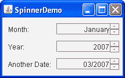

# 如何使用旋转器

> 原文：[`docs.oracle.com/javase/tutorial/uiswing/components/spinner.html`](https://docs.oracle.com/javase/tutorial/uiswing/components/spinner.html)

旋转器类似于组合框和列表，允许用户从一系列值中选择。与可编辑的组合框类似，旋转器允许用户输入值。与组合框不同，旋转器没有可以覆盖其他组件的下拉列表。因为旋转器不显示可能值 - 只有当前值可见 - 当可能值集合非常大时，通常使用旋转器代替组合框或列表。但是，只有在可能值及其顺序明显时才应使用旋转器。

旋转器是一个复合组件，包含三个子组件：两个小按钮和一个*编辑器*。编辑器可以是任何`JComponent`，但默认情况下实现为包含格式化文本字段的面板。旋转器的可能值和当前值由其*模型*管理。

这是一个名为`SpinnerDemo`的应用程序的图片，其中有三个用于指定日期的旋转器：



主类的代码可以在`SpinnerDemo.java`中找到。月份旋转器显示用户所在地区的第一个月的名称。此旋转器的可能值是使用字符串数组指定的。年份旋转器显示整数范围内的一个值，初始化为当前年份。另一个日期旋转器显示`Date`对象范围内的一个值（最初是当前日期），以自定义格式显示仅月份和年份。

* * *

**试试这个：**

1.  单击“启动”按钮以使用[Java™ Web Start](http://www.oracle.com/technetwork/java/javase/javawebstart/index.html)运行 SpinnerDemo（[下载 JDK 7 或更高版本](http://www.oracle.com/technetwork/java/javase/downloads/index.html)）。或者，要自行编译和运行示例，请参考示例索引。

1.  使用月份旋转器时，使用箭头按钮或键向前和向后循环浏览可能值。

    请注意，最小值是一年中的第一个月（例如，一月），最大值是最后一个月（例如，十二月）。确切的值取决于您所在地区。还要注意，这些值不会循环 - 您不能使用上箭头按钮或键直接从十二月跳到一月 - 因为标准旋转器模型不支持循环。

1.  输入您所在地区的有效月份名称，例如，七月。

    请注意，旋转器会自动完成月份名称。

1.  接下来是年份旋转器，尝试输入一个 100 年前的年份 — 例如，1800 — 然后单击另一个旋转器或按 Tab 键移出旋转器的焦点。

    因为此程序将旋转器的模型限制在当前年份的 100 年内的数字范围内，所以 1800 是无效的。当焦点移出旋转器时，显示的文本会更改回上一个有效值。

1.  移动到另一个日期旋转器，使用箭头按钮或键来更改日期。

    请注意，默认情况下日期的第一部分 — 在本例中是月份数字 — 会更改。您可以通过单击鼠标或使用箭头键移动到日期的另一部分来更改日期的哪一部分更改。

* * *

要创建一个旋转器，首先创建其模型，然后将模型传递给 [JSpinner](https://docs.oracle.com/javase/8/docs/api/javax/swing/JSpinner.html) 构造函数。例如：

```java
String[] monthStrings = getMonthStrings(); //get month names
SpinnerListModel monthModel = new SpinnerListModel(monthStrings);
JSpinner spinner = new JSpinner(monthModel);

```

本节的其余部分涵盖以下主题：

+   使用标准旋转器模型和编辑器

+   指定旋转器格式

+   创建自定义旋转器模型和编辑器

+   检测旋转器值的更改

+   旋转器 API

+   使用旋转器的示例

## 使用标准旋转器模型和编辑器

Swing API 提供了三种旋转器模型：

[SpinnerListModel](https://docs.oracle.com/javase/8/docs/api/javax/swing/SpinnerListModel.html)

`SpinnerListModel` 是一个模型，其值由对象数组或 `List` 对象定义。`SpinnerDemo` 示例中的月份旋转器使用了这个模型，初始化为从 `java.text.DateFormatSymbols` 类的 `getMonths` 方法返回的值派生的数组。有关详细信息，请参见 `SpinnerDemo.java`。

[SpinnerNumberModel](https://docs.oracle.com/javase/8/docs/api/javax/swing/SpinnerNumberModel.html)

`SpinnerNumberModel` 支持可以表示为 `double` 对象、`int` 对象或 `Number` 对象的数字序列。您可以指定允许的最小和最大值，以及*步长* — 每次增加或减少的量。年份旋转器使用了这个模型，使用以下代码创建：

```java
SpinnerModel model =
        new SpinnerNumberModel(currentYear, //initial value
                               currentYear - 100, //min
                               currentYear + 100, //max
                               1);                //step

```

[SpinnerDateModel](https://docs.oracle.com/javase/8/docs/api/javax/swing/SpinnerDateModel.html)

`SpinnerDateModel` 支持 `Date` 对象的序列。您可以指定最小和最大日期，以及要增加或减少的字段（例如 `Calendar.YEAR`）。但请注意，某些类型的外观和感觉会忽略指定的字段，而是更改所选的字段。另一个日期旋转器使用了这个模型，使用以下代码创建：

```java
Date initDate = calendar.getTime();
calendar.add(Calendar.YEAR, -100);
Date earliestDate = calendar.getTime();
calendar.add(Calendar.YEAR, 200);
Date latestDate = calendar.getTime();
model = new SpinnerDateModel(initDate,
                             earliestDate,
                             latestDate,
                             Calendar.YEAR);

```

当您设置微调器模型时，微调器的编辑器会自动设置。Swing API 为上述三个模型类中的每一个提供了相应的编辑器类。这些类 — [JSpinner.ListEditor](https://docs.oracle.com/javase/8/docs/api/javax/swing/JSpinner.ListEditor.html)、[JSpinner.NumberEditor](https://docs.oracle.com/javase/8/docs/api/javax/swing/JSpinner.NumberEditor.html) 和 [JSpinner.DateEditor](https://docs.oracle.com/javase/8/docs/api/javax/swing/JSpinner.DateEditor.html) — 都是 [JSpinner.DefaultEditor](https://docs.oracle.com/javase/8/docs/api/javax/swing/JSpinner.DefaultEditor.html) 类的子类，具有可编辑的格式化文本字段。如果使用没有与之关联的编辑器的模型，则编辑器默认为具有不可编辑格式化文本字段的`JSpinner.DefaultEditor`实例。

## 指定微调器格式

要更改标准微调器编辑器中使用的格式，您可以自行创建并设置编辑器。

`JSpinner.NumberEditor` 和 `JSpinner.DateEditor` 类具有构造函数，允许您创建以特定方式格式化其数据的编辑器。例如，以下代码设置了另一个日期微调器，以便不使用默认的长日期格式（包括时间），而是以紧凑的方式显示月份和年份。

```java
spinner.setEditor(new JSpinner.DateEditor(spinner, "MM/yyyy"));

```

* * *

**注意：**

您可以通过运行`ComboBoxDemo2`示例来尝试日期格式。单击“启动”按钮以使用[Java™ Web Start](http://www.oracle.com/technetwork/java/javase/javawebstart/index.html)运行 ComboBoxDemo2（[下载 JDK 7 或更高版本](http://www.oracle.com/technetwork/java/javase/downloads/index.html)）。或者，要自行编译和运行示例，请参考示例索引。


有关格式字符串的信息，请参阅国际化教程中的格式化部分。

* * *

在使用默认编辑器时更改格式，您可以获取编辑器的格式化文本字段并调用其方法。您可以使用`JSpinner.DefaultEditor`类中定义的`getTextField`方法调用这些方法。请注意，Swing 提供的编辑器不是格式化文本字段。相反，它们是包含格式化文本字段的`JPanel`实例。以下是获取并调用编辑器格式化文本字段方法的示例：

```java
//Tweak the spinner's formatted text field.
ftf = getTextField(spinner);
if (ftf != null ) {
    ftf.setColumns(8); //specify more width than we need
    ftf.setHorizontalAlignment(JTextField.RIGHT);
}
...

public JFormattedTextField getTextField(JSpinner spinner) {
    JComponent editor = spinner.getEditor();
    if (editor instanceof JSpinner.DefaultEditor) {
        return ((JSpinner.DefaultEditor)editor).getTextField();
    } else {
        System.err.println("Unexpected editor type: "
                           + spinner.getEditor().getClass()
                           + " isn't a descendant of DefaultEditor");
        return null;
    }
}

```

## 创建自定义微调器模型和编辑器

如果现有的微调器模型或编辑器不符合您的需求，您可以创建自己的。

创建自定义微调器模型的最简单方法是创建现有`AbstractSpinnerModel`子类的子类，该子类已经实现了大部分您需要的内容。另一种方法是通过扩展[`AbstractSpinnerModel`](https://docs.oracle.com/javase/8/docs/api/javax/swing/AbstractSpinnerModel.html)类来实现自己的类，该类实现了所有微调器模型所需的事件通知。

下面的`SpinnerListModel`子类实现了一个循环遍历对象数组的微调器模型。它还允许您指定第二个微调器模型，每当循环重新开始时将更新该模型。例如，如果对象数组是一个月份列表，则链接的模型可以用于显示年份的微调器。当月份从十二月翻转到一月时，年份会增加。类似地，当月份从一月翻回到十二月时，年份会减少。

```java
public class CyclingSpinnerListModel extends SpinnerListModel {
    Object firstValue, lastValue;
    SpinnerModel linkedModel = null;

    public CyclingSpinnerListModel(Object[] values) {
        super(values);
        firstValue = values[0];
        lastValue = values[values.length - 1];
    }

    public void setLinkedModel(SpinnerModel linkedModel) {
        this.linkedModel = linkedModel;
    }

    public Object getNextValue() {
        Object value = super.getNextValue();
        if (value == null) {
            value = firstValue;
            if (linkedModel != null) {
                linkedModel.setValue(linkedModel.getNextValue());
            }
        }
        return value;
    }

    public Object getPreviousValue() {
        Object value = super.getPreviousValue();
        if (value == null) {
            value = lastValue;
            if (linkedModel != null) {
                linkedModel.setValue(linkedModel.getPreviousValue());
            }
        }
        return value;
    }
}

```

`CyclingSpinnerListModel`模型用于`SpinnerDemo2`示例中的月份微调器，该示例几乎与`SpinnerDemo`相同。单击启动按钮以使用[Java™ Web Start](http://www.oracle.com/technetwork/java/javase/javawebstart/index.html)运行 SpinnerDemo2（[下载 JDK 7 或更高版本](http://www.oracle.com/technetwork/java/javase/downloads/index.html)）。或者，要自行编译和运行示例，请参考示例索引。


正如我们之前提到的，如果您实现的微调器模型不是从`SpinnerListModel`、`SpinnerNumberModel`或`SpinnerDateModel`继承的，那么微调器的默认编辑器是`JSpinner.DefaultEditor`的不可编辑实例。正如您已经看到的，您可以在设置微调器的模型属性后，通过调用微调器的`setEditor`方法来设置微调器的编辑器。使用`setEditor`的替代方法是创建`JSpinner`类的子类，并覆盖其`createEditor`方法，以便在微调器模型是某种类型时返回特定类型的编辑器。

理论上，您可以使用任何`JComponent`实例作为编辑器。可能的选择包括使用标准组件的子类，如`JLabel`，或者您从头开始实现的组件，或者`JSpinner.DefaultEditor`的子类。唯一的要求是编辑器必须更新以反映微调器值的更改，并且必须具有合理的首选大小。编辑器通常还应将其工具提示文本设置为微调器指定的工具提示文本。下一节提供了实现编辑器的示例。

## 检测微调器值更改

您可以通过在微调器或其模型上注册更改侦听器来检测微调器的值已更改。以下是实现此类更改侦听器的示例。此示例来自`SpinnerDemo3`，它基于`SpinnerDemo`，并使用更改侦听器将某些文本的颜色更改为与另一个日期微调器的值匹配。单击“启动”按钮以使用[Java™ Web Start](http://www.oracle.com/technetwork/java/javase/javawebstart/index.html)运行 SpinnerDemo3（[下载 JDK 7 或更高版本](http://www.oracle.com/technetwork/java/javase/downloads/index.html)）。或者，要自行编译和运行示例，请参考示例索引。


```java
public class SpinnerDemo3 extends JPanel
                          implements ChangeListener {
    protected Calendar calendar;
    protected JSpinner dateSpinner;
    ...
    public SpinnerDemo3() {
        ...
        SpinnerDateModel dateModel = ...;
        ...
        setSeasonalColor(dateModel.getDate()); //initialize color

        //Listen for changes on the date spinner.
        dateSpinner.addChangeListener(this);
        ...
    }

    public void stateChanged(ChangeEvent e) {
        SpinnerModel dateModel = dateSpinner.getModel();
        if (dateModel instanceof SpinnerDateModel) {
            setSeasonalColor(((SpinnerDateModel)dateModel).getDate());
        }
    }

    protected void setSeasonalColor(Date date) {
        calendar.setTime(date);
        int month = calendar.get(Calendar.MONTH);
        JFormattedTextField ftf = getTextField(dateSpinner);
        if (ftf == null) return;

        //Set the color to match northern hemisphere seasonal conventions.
        switch (month) {
            case 2:  //March
            case 3:  //April
            case 4:  //May
                     ftf.setForeground(SPRING_COLOR);
                     break;
            ...
            default: //December, January, February
                     ftf.setForeground(WINTER_COLOR);
        }
    }
    ...
}

```

以下示例实现了一个具有更改侦听器的编辑器，以便它可以反映微调器的当前值。此特定编辑器显示了从白色到黑色的任何位置的灰色实色。单击“启动”按钮以使用[Java™ Web Start](http://www.oracle.com/technetwork/java/javase/javawebstart/index.html)运行 SpinnerDemo4（[下载 JDK 7 或更高版本](http://www.oracle.com/technetwork/java/javase/downloads/index.html)）。或者，要自行编译和运行示例，请参考示例索引。


```java
*...//Where the components are created:*
JSpinner spinner = new JSpinner(new GrayModel(170));
spinner.setEditor(new GrayEditor(spinner));

class GrayModel extends SpinnerNumberModel {
    ...
}

class GrayEditor extends JLabel
                 implements ChangeListener {
    public GrayEditor(JSpinner spinner) {
        setOpaque(true);
        ...
        //Get info from the model.
        GrayModel myModel = (GrayModel)(spinner.getModel());
        setBackground(myModel.getColor());
        spinner.addChangeListener(this);
        ...
        updateToolTipText(spinner);
    }

    protected void updateToolTipText(JSpinner spinner) {
        String toolTipText = spinner.getToolTipText();
        if (toolTipText != null) {
            //JSpinner has tool tip text.  Use it.
            if (!toolTipText.equals(getToolTipText())) {
                setToolTipText(toolTipText);
            }
        } else {
            //Define our own tool tip text.
            GrayModel myModel = (GrayModel)(spinner.getModel());
            int rgb = myModel.getIntValue();
            setToolTipText("(" + rgb + "," + rgb + "," + rgb + ")");
        }
    }

    public void stateChanged(ChangeEvent e) {
            JSpinner mySpinner = (JSpinner)(e.getSource());
            GrayModel myModel = (GrayModel)(mySpinner.getModel());
            setBackground(myModel.getColor());
            updateToolTipText(mySpinner);
    }
}

```

## 微调器 API

以下表格列出了一些常用的用于使用微调器的 API。如果您需要直接处理编辑器的格式化文本字段，还应查看格式化文本字段 API。您可能使用的其他方法列在 JComponent 类的 API 表中。

+   与微调器相关的类

+   JSpinner 构造函数和方法

+   有用的编辑器构造函数和方法

+   SpinnerListModel 方法

+   SpinnerDateModel 方法

+   SpinnerNumberModel 方法

与微调器相关的类

| 类或接口 | 目的 |
| --- | --- |
| [JSpinner](https://docs.oracle.com/javase/8/docs/api/javax/swing/JSpinner.html) | 允许用户从有序序列中选择数字或对象值的单行输入字段。 |
| [SpinnerModel](https://docs.oracle.com/javase/8/docs/api/javax/swing/SpinnerModel.html) | 所有微调器模型实现的接口。 |
| [AbstractSpinnerModel](https://docs.oracle.com/javase/8/docs/api/javax/swing/AbstractSpinnerModel.html) | 微调器模型实现的通常超类。 |
| [SpinnerListModel](https://docs.oracle.com/javase/8/docs/api/javax/swing/SpinnerListModel.html) | 其值由数组或`List`定义的`AbstractSpinnerModel`的子类。 |
| [SpinnerDateModel](https://docs.oracle.com/javase/8/docs/api/javax/swing/SpinnerDateModel.html) | 支持`Date`实例序列的`AbstractSpinnerModel`的子类。 |
| [SpinnerNumberModel](https://docs.oracle.com/javase/8/docs/api/javax/swing/SpinnerNumberModel.html) | 支持数字序列的`AbstractSpinnerModel`的子类。 |
| [JSpinner.DefaultEditor](https://docs.oracle.com/javase/8/docs/api/javax/swing/JSpinner.DefaultEditor.html) | 实现一个显示微调器值的不可编辑组件。该类的子类通常更专业化（可编辑）。 |
| [JSpinner.ListEditor](https://docs.oracle.com/javase/8/docs/api/javax/swing/JSpinner.ListEditor.html) | `JSpinner.DefaultEditor`的子类，其值由数组或`List`定义。 |
| [JSpinner.DateEditor](https://docs.oracle.com/javase/8/docs/api/javax/swing/JSpinner.DateEditor.html) | 支持`Date`实例序列的`JSpinner.DefaultEditor`的子类。 |
| [JSpinner.NumberEditor](https://docs.oracle.com/javase/8/docs/api/javax/swing/JSpinner.NumberEditor.html) | 支持数字序列的`JSpinner.DefaultEditor`的子类。 |

有用的 JSpinner 构造函数和方法

| 构造函数或方法 | 目的 |
| --- | --- |
| [JSpinner()](https://docs.oracle.com/javase/8/docs/api/javax/swing/JSpinner.html#JSpinner--) [JSpinner(SpinnerModel)](https://docs.oracle.com/javase/8/docs/api/javax/swing/JSpinner.html#JSpinner-javax.swing.SpinnerModel-) | 创建一个新的`JSpinner`。无参数构造函数创建一个带有整数`SpinnerNumberModel`的微调器，初始值为 0，没有最小或最大限制。第二个构造函数上的可选参数允许您指定自己的`SpinnerModel`。 |
| [void setValue(java.lang.Object)](https://docs.oracle.com/javase/8/docs/api/javax/swing/JSpinner.html#setValue-java.lang.Object-) [Object getValue()](https://docs.oracle.com/javase/8/docs/api/javax/swing/JSpinner.html#getValue--) | 设置或获取当前显示的序列元素。 |
| [Object getNextValue()](https://docs.oracle.com/javase/8/docs/api/javax/swing/JSpinner.html#getNextValue--) [Object getPreviousValue()](https://docs.oracle.com/javase/8/docs/api/javax/swing/JSpinner.html#getPreviousValue--) | 获取`getValue`方法返回的对象之前或之后的序列中的对象。 |
| [SpinnerModel getModel()](https://docs.oracle.com/javase/8/docs/api/javax/swing/JSpinner.html#getModel--) [void setModel(SpinnerModel)](https://docs.oracle.com/javase/8/docs/api/javax/swing/JSpinner.html#setModel-javax.swing.SpinnerModel-) | 获取或设置微调器的模型。 |
| [JComponent getEditor()](https://docs.oracle.com/javase/8/docs/api/javax/swing/JSpinner.html#getEditor--) [void setEditor(JComponent)](https://docs.oracle.com/javase/8/docs/api/javax/swing/JSpinner.html#setEditor-javax.swing.JComponent-) | 获取或设置微调器的编辑器，通常是`JSpinner.DefaultEditor`类型的对象。 |
| [protected JComponent createEditor(SpinnerModel)](https://docs.oracle.com/javase/8/docs/api/javax/swing/JSpinner.html#createEditor-javax.swing.SpinnerModel-) | `JSpinner`构造函数调用此方法来创建微调器的编辑器。重写此方法以将编辑器与特定类型的模型关联起来。 |

有用的编辑器构造函数和方法

| 构造函数或方法 | 目的 |
| --- | --- |
| [JSpinner.NumberEditor(JSpinner, String)](https://docs.oracle.com/javase/8/docs/api/javax/swing/JSpinner.NumberEditor.html#JSpinner.NumberEditor-javax.swing.JSpinner-java.lang.String-) | 创建一个`JSpinner.NumberEditor`实例，显示并允许编辑指定微调器的数字值。字符串参数指定用于显示数字的格式。有关十进制格式字符串的信息，请参阅[DecimalFormat](https://docs.oracle.com/javase/8/docs/api/java/text/DecimalFormat.html)的 API 文档。 |
| [JSpinner.DateEditor(JSpinner, String)](https://docs.oracle.com/javase/8/docs/api/javax/swing/JSpinner.DateEditor.html#JSpinner.DateEditor-javax.swing.JSpinner-java.lang.String-) | 创建一个`JSpinner.DateEditor`实例，显示并允许编辑指定微调器的`Date`值。字符串参数指定用于显示日期的格式。有关日期格式字符串的信息，请参阅[SimpleDateFormat](https://docs.oracle.com/javase/8/docs/api/java/text/SimpleDateFormat.html)的 API 文档。 |
| [JFormattedTextField getTextField()](https://docs.oracle.com/javase/8/docs/api/javax/swing/JSpinner.DefaultEditor.html#getTextField--) *(在`JSpinner.DefaultEditor`中定义)* | 获取提供此编辑器主要 GUI 的格式化文本字段。 |

SpinnerListModel 方法

| 方法 | 目的 |
| --- | --- |
| [void setList(List)](https://docs.oracle.com/javase/8/docs/api/javax/swing/SpinnerListModel.html#setList-java.util.List-) [List getList()](https://docs.oracle.com/javase/8/docs/api/javax/swing/SpinnerListModel.html#getList--) | 设置或获取定义此模型序列的`List`。 |

SpinnerDateModel 方法

| 方法 | 目的 |
| --- | --- |
|  |

| [void setValue(Object)](https://docs.oracle.com/javase/8/docs/api/javax/swing/SpinnerDateModel.html#setValue-java.lang.Object-) [Date getDate()](https://docs.oracle.com/javase/8/docs/api/javax/swing/SpinnerDateModel.html#getDate--)

[Object getValue()](https://docs.oracle.com/javase/8/docs/api/javax/swing/SpinnerDateModel.html#getValue--) | 设置或获取此序列的当前`Date`。 |

| [void setStart(Comparable)](https://docs.oracle.com/javase/8/docs/api/javax/swing/SpinnerDateModel.html#setStart-java.lang.Comparable-) [Comparable getStart()](https://docs.oracle.com/javase/8/docs/api/javax/swing/SpinnerDateModel.html#getStart--) | 设置或获取此序列中的第一个`Date`。使用`null`指定微调器没有下限。 |
| --- | --- |
| [void setEnd(Comparable)](https://docs.oracle.com/javase/8/docs/api/javax/swing/SpinnerDateModel.html#setEnd-java.lang.Comparable-) [Comparable getEnd()](https://docs.oracle.com/javase/8/docs/api/javax/swing/SpinnerDateModel.html#getEnd--) | 设置或获取此序列中的最后一个`Date`。使用`null`指定微调器没有上限。 |
| [void setCalendarField(int)](https://docs.oracle.com/javase/8/docs/api/javax/swing/SpinnerDateModel.html#setCalendarField-int-) [int getCalendarField()](https://docs.oracle.com/javase/8/docs/api/javax/swing/SpinnerDateModel.html#getCalendarField--) | 设置或获取`getNextValue`和`getPreviousValue`方法使用的日期值增量的大小。当用户明确增加或减少值时，不使用此属性；相反，格式化文本字段的选定部分会增加或减少。指定的参数必须是`Calendar`中定义的以下常量之一：`ERA`、`YEAR`、`MONTH`、`WEEK_OF_YEAR`、`WEEK_OF_MONTH`、`DAY_OF_MONTH`、`DAY_OF_YEAR`、`DAY_OF_WEEK`、`DAY_OF_WEEK_IN_MONTH`、`AM_PM`、`HOUR_OF_DAY`、`MINUTE`、`SECOND`、`MILLISECOND`。 |

微调器数字模型方法

| 方法 | 目的 |
| --- | --- |
|  |
| [void setValue(Object)](https://docs.oracle.com/javase/8/docs/api/javax/swing/SpinnerNumberModel.html#setValue-java.lang.Object-) [Number getNumber()](https://docs.oracle.com/javase/8/docs/api/javax/swing/SpinnerNumberModel.html#getNumber--) | 设置或获取此序列的当前值。 |
| [void setMaximum(Comparable)](https://docs.oracle.com/javase/8/docs/api/javax/swing/SpinnerNumberModel.html#setMaximum-java.lang.Comparable-) [Comparable getMaximum()](https://docs.oracle.com/javase/8/docs/api/javax/swing/SpinnerNumberModel.html#getMaximum--) | 设置或获取此序列中数字的上限。如果最大值为`null`，则没有上限。 |
| [void setMinimum(Comparable)](https://docs.oracle.com/javase/8/docs/api/javax/swing/SpinnerNumberModel.html#setMinimum-java.lang.Comparable-) [Comparable getMinimum()](https://docs.oracle.com/javase/8/docs/api/javax/swing/SpinnerNumberModel.html#getMinimum--) | 设置或获取此序列中数字的下限。如果最小值为`null`，则没有下限。 |
| [void setStepSize(Number)](https://docs.oracle.com/javase/8/docs/api/javax/swing/SpinnerNumberModel.html#setStepSize-java.lang.Number-) [Number getStepSize()](https://docs.oracle.com/javase/8/docs/api/javax/swing/SpinnerNumberModel.html#getStepSize--) | 设置或获取`getNextValue`和`getPreviousValue`方法使用的增量。 |

## 使用微调器的示例

这个表格列出了使用 Spinner 的示例，并指向这些示例的描述位置。

| 示例 | 描述位置 | 备注 |
| --- | --- | --- |
| `SpinnerDemo` | 这一部分 | 使用了所有三种标准的 Spinner 模型类。 包含使用自定义 Spinner 模型的代码，但默认情况下该代码被关闭。 |
| `SpinnerDemo2` | 这一部分 | 一个`SpinnerDemo`的子类，使用自定义的 Spinner 模型来显示月份的 Spinner。 |
| `SpinnerDemo3` | 这一部分 | 基于 SpinnerDemo，该应用程序展示了如何监听 Spinner 值的变化。 |
| `SpinnerDemo4` | 这一部分 | 实现了一个自定义模型和一个自定义编辑器，用于显示灰度的 Spinner。 |
