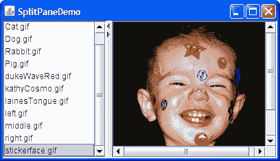
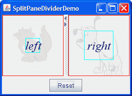
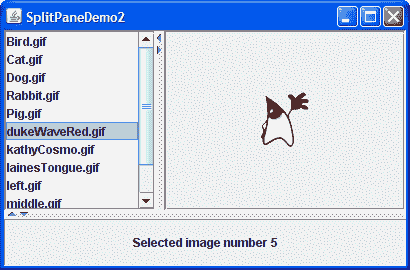

# 如何使用分割窗格

> 原文：[`docs.oracle.com/javase/tutorial/uiswing/components/splitpane.html`](https://docs.oracle.com/javase/tutorial/uiswing/components/splitpane.html)

一个[`JSplitPane`](https://docs.oracle.com/javase/8/docs/api/javax/swing/JSplitPane.html)显示两个组件，可以并排显示或者上下显示。通过拖动出现在组件之间的分隔符，用户可以指定分割窗格总面积中每个组件所占的比例。通过将分割窗格放入分割窗格中，可以在三个或更多组件之间划分屏幕空间，如 Nesting Split Panes 中所述。

与直接将感兴趣的组件添加到分割窗格不同，通常将每个组件放入滚动窗格中。然后将滚动窗格放入分割窗格中。这样用户可以查看感兴趣组件的任何部分，而无需组件占用大量屏幕空间或适应在不同屏幕空间中显示自身。

这是一个使用分割窗格并将列表和图像并排显示的应用程序的图片：



* * *

**试试这个：**

1.  单击“启动”按钮以使用[Java™ Web Start](http://www.oracle.com/technetwork/java/javase/javawebstart/index.html)运行 SplitPaneDemo（[下载 JDK 7 或更高版本](http://www.oracle.com/technetwork/java/javase/downloads/index.html)）。或者，要自行编译和运行示例，请参考示例索引。

1.  拖动分隔列表和图像的虚线，使其向左或向右移动。尝试将分隔线拖动到窗口边缘。

1.  单击分隔符上的小箭头可隐藏/展开左侧或右侧组件。

* * *

下面是从`SplitPaneDemo`中创建和设置分割窗格的代码。

```java
//Create a split pane with the two scroll panes in it.
splitPane = new JSplitPane(JSplitPane.HORIZONTAL_SPLIT,
                           listScrollPane, pictureScrollPane);
splitPane.setOneTouchExpandable(true);
splitPane.setDividerLocation(150);

//Provide minimum sizes for the two components in the split pane
Dimension minimumSize = new Dimension(100, 50);
listScrollPane.setMinimumSize(minimumSize);
pictureScrollPane.setMinimumSize(minimumSize);

```

此示例使用的构造函数接受三个参数。第一个参数表示分割方向。其他参数是要放入分割窗格的两个组件。有关动态设置组件的`JSplitPane`方法，请参考设置分割窗格中的组件。

此示例中的分割窗格水平分割 — 两个组件并排显示 — 如构造函数中的`JSplitPane.HORIZONTAL_SPLIT`参数所指定。分割窗格提供另一个选项，使用`JSplitPane.VERTICAL_SPLIT`指定，将一个组件放在另一个组件上方。您可以在创建分割窗格后使用`setOrientation`方法更改分割方向。

在示例的分割窗格中，分隔条顶部会出现两个小箭头。这些箭头允许用户通过单击折叠（然后展开）任一组件。当前的外观和感觉决定了这些控件是否默认显示。在 Java 外观和感觉中，默认情况下是关闭的。（请注意，并非所有外观和感觉都支持此功能。）示例使用`setOneTouchExpandable`方法将它们打开。

分割窗格的分隔条范围部分取决于分割窗格内组件的最小尺寸。有关详细信息，请参阅设置分隔条的位置和限制其范围。

本节的其余部分涵盖以下主题：

+   在分割窗格中设置组件

+   设置分隔条的位置和限制其范围

+   嵌套分割窗格

+   分割窗格 API

+   使用分割窗格的示例

## 在分割窗格中设置组件

程序可以使用这四种方法动态设置分割窗格的两个组件：

+   `setLeftComponent`

+   `setRightComponent`

+   `setTopComponent`

+   `setBottomComponent`

您可以随时使用这些方法，而不管分割窗格当前的分割方向如何。调用`setLeftComponent`和`setTopComponent`是等效的，并根据分割窗格当前的分割方向在顶部或左侧位置设置指定的组件。类似地，调用`setRightComponent`和`setBottomComponent`是等效的。这些方法将替换该位置已有的任何组件为新组件。

与其他容器一样，`JSplitPane`支持`add`方法。分割窗格将添加的第一个组件放在左侧或顶部位置。使用`add`的危险在于您可能会无意中多次调用它，这种情况下，分割窗格的布局管理器将抛出一个看起来相当晦涩的异常。如果您正在使用`add`方法并且分割窗格已经填充，您首先需要使用`remove`删除现有组件。

如果您只在分割窗格中放置一个组件，则分隔条将被固定在分割窗格的右侧或底部，具体取决于其分割方向。

## 设置分隔条的位置和限制其范围

要使您的分割窗格正常工作，通常需要设置分割窗格中组件的最小尺寸，以及分割窗格或其包含组件的首选尺寸。选择应设置哪些尺寸是一门需要理解分割窗格首选尺寸和分隔条位置如何确定的艺术。在深入讨论之前，让我们再次看看 SplitPaneDemo。或者，如果您赶时间，可以直接跳转到规则列表。

* * *

**试试这个：**

1.  点击“启动”按钮以使用[Java™ Web Start](http://www.oracle.com/technetwork/java/javase/javawebstart/index.html)运行 SplitPaneDemo（[下载 JDK 7 或更高版本](http://www.oracle.com/technetwork/java/javase/downloads/index.html)）。或者，要自行编译和运行示例，请参考示例索引。

    因为演示框架的大小是使用`pack`方法设置的，分隔窗格处于其首选大小，SplitPaneDemo 恰好明确设置了。分隔符会自动放置，使左侧组件处于其首选宽度，所有剩余空间都分配给右侧组件。

1.  使窗口变宽。

    分隔符保持在原位，额外的空间分配给右侧组件。

1.  使窗口比首次出现时明显变窄 — 可能是左侧组件宽度的两倍。

    再次，左侧组件的大小和分隔符位置保持不变。只有右侧组件的大小发生变化。

1.  将窗口尽可能变窄。

    假设窗口使用了 Java 外观和感觉提供的装饰，您无法将窗口调整为小于分隔窗格的最小大小，该大小由分隔窗格包含的组件的最小大小确定。SplitPaneDemo 明确设置了这些包含组件的最小大小。

1.  使窗口变宽，然后将分隔符拖动到最右侧。

    分隔符只能移动到右侧组件的最小大小允许的位置。如果将分隔符向左拖动，您会发现它也会尊重左侧组件的最小大小。

* * *

现在您已经看到了分隔窗格的默认行为，我们可以告诉您幕后发生的事情以及您如何影响它。在本讨论中，当我们提到组件的首选或最小大小时，通常指的是如果分隔窗格是水平的，则组件的首选或最小宽度，如果分隔窗格是垂直的，则指的是其首选或最小高度。

默认情况下，分隔窗格的首选大小和分隔符位置会初始化，以使分隔窗格中的两个组件处于其首选大小。如果分隔窗格未以首选大小显示，并且程序未明确设置分隔符位置，则分隔符的初始位置（以及两个组件的大小）取决于一个称为*调整权重*的分隔窗格属性。如果分隔窗格最初以其首选大小或更大显示，则包含的组件在调整调整权重之前以其首选大小开始。如果分隔窗格最初太小而无法同时显示两个组件的首选大小，则它们将以其*最小*大小开始，然后再调整调整权重。

分割窗格的调整权重的值介于 0.0 和 1.0 之间，并确定在设置分割窗格的大小时两个包含的组件之间如何分配空间 — 无论是通过编程方式还是用户调整分割窗格的大小（例如扩大其包含窗口）。分割窗格的调整权重默认为 0.0，表示左侧或顶部组件的大小固定，右侧或底部组件调整其大小以适应剩余空间。将调整权重设置为 0.5 会均匀地分配任何额外或缺失的空间给两个组件。将调整权重设置为 1.0 会使右侧或底部组件的大小保持不变。然而，当用户拖动分隔线时，调整权重没有影响。

用户可以拖动分隔线到任何位置，*只要*没有一个包含的组件的大小低于其最小大小。如果分隔线有一键按钮，用户可以使用它们使分隔线完全移动到一侧或另一侧 — 无论组件的最小大小是多少。

现在您已经了解了影响分割窗格大小和分隔线位置的因素，以下是一些使它们良好运作的规则：

+   要确保在分割窗格处于其首选大小时可以拖动分隔线，请确保一个或两个包含的组件的最小大小小于包含组件的首选大小。您可以通过在组件上调用`setMinimumSize`或重写其`getMinimumSize`方法来设置组件的最小大小。例如，如果您希望用户能够将分隔线拖动到两侧：

    ```java
    Dimension minimumSize = new Dimension(0, 0);
    leftComponent.setMinimumSize(minimumSize);
    rightComponent.setMinimumSize(minimumSize);

    ```

+   要确保两个包含的组件都显示出来，请确保分割窗格初始时处于或高于其首选大小，或者包含的组件的最小大小大于零。

    如果分割窗格被赋予其首选大小，这通常会发生，这取决于包含分割窗格的布局管理器。另一个选项是在分割窗格上明确设置一个大于包含组件大小的首选大小。

+   如果您希望底部或右侧组件保持相同大小，并且在分割窗格变大时顶部或左侧组件是灵活的，请将调整权重设置为 1.0。您可以通过调用`setResizeWeight`来实现这一点：

    ```java
    splitPane.setResizeWeight(1.0);

    ```

+   如果您希望分割窗格的两半共享分割窗格的额外空间或减少的空间，请将调整权重设置为 0.5：

    ```java
    splitPane.setResizeWeight(0.5);

    ```

+   确保由分割窗格包含的每个组件都有一个合理的首选大小。如果组件是使用布局管理器的面板，通常可以直接使用其返回的值。如果组件是滚动窗格，则有几种选择。您可以在滚动窗格上调用`setPreferredSize`方法，在滚动窗格中的组件上调用适当的方法（例如`JList`或`JTree`的`setVisibleRowCount`方法）。

+   确保分割窗格包含的每个组件在不同大小的空间中都能合理显示自己。例如，包含多个组件的面板应使用布局管理器以合理的方式使用额外空间。

+   如果您想将包含的组件的大小设置为其首选大小以外的其他值，请使用`setDividerLocation`方法。例如，要使左侧组件宽度为 150 像素：

    ```java
    splitPane.setDividerLocation(150 + splitPane.getInsets().left);

    ```

    尽管分割窗格尽力遵守初始分隔线位置（在本例中为 150），但一旦用户拖动分隔线，可能无法再将其拖动到程序指定的大小。

    要使右侧组件宽度为 150 像素：

    ```java
    splitPane.setDividerLocation(splitPane.getSize().width
                                 - splitPane.getInsets().right
                                 - splitPane.getDividerSize()
                                 - 150);

    ```

    如果分割窗格已经可见，您可以将分隔线位置设置为分割窗格的百分比。例如，使 25%的空间分配给左侧/顶部：

    ```java
    splitPane.setDividerLocation(0.25);

    ```

    请注意，这是根据当前大小实现的，因此只有在分割窗格可见时才真正有用。

+   要将分割窗格布局设置为刚刚出现的状态，可能会重新定位分隔线，请在分割窗格上调用`resetToPreferredSizes()`。

    * * *

    **注意：** 仅更改包含的组件的首选大小 — 即使之后调用`revalidate` — 不足以导致分割窗格重新布局。您还必须调用`resetToPreferredSizes`。

    * * *

以下快照显示了一个名为 SplitPaneDividerDemo 的示例，演示了分割窗格组件大小和分隔线位置。



与 SplitPaneDemo 一样，SplitPaneDividerDemo 具有带有一键按钮的水平分割窗格。SplitPaneDividerDemo 具有以下附加功能：

+   分割窗格的*调整权重*被明确设置为（0.5）。

+   分割窗格显示为其默认首选大小。

+   窗口底部的“重置”按钮调用分割窗格上的`resetToPreferredSizes`。

+   分割窗格中的组件是名为`SizeDisplayer`的自定义`JComponent`子类的实例。`SizeDisplayer`显示可选文本在淡化的背景图像上（也是可选的）。更重要的是，它有显示其首选大小和最小大小的矩形。

+   SplitPaneDividerDemo 设置其`SizeDisplayer`具有相等的首选大小（由于它们显示的图像大小相等），但不等的最小大小。

* * *

**试试这个：**

1.  单击“启动”按钮以使用[Java™ Web Start](http://www.oracle.com/technetwork/java/javase/javawebstart/index.html)运行 SplitPaneDividerDemo（[下载 JDK 7 或更高版本](http://www.oracle.com/technetwork/java/javase/downloads/index.html)）。或者，要自行编译和运行示例，请参考示例索引。

    因为演示的窗口大小是使用`pack`方法设置的，分割窗格处于其首选大小，默认情况下刚好足够让`SizeDisplayer`以其首选大小显示。每个`SizeDisplayer`的首选大小由一个红色矩形表示。分隔线会自动放置，以使两个组件的宽度达到其首选宽度。

1.  使窗口变宽。

    因为分割窗格的调整权重为 0.5，额外空间均匀分配给左右组件。分隔线相应移动。

1.  使窗口尽可能窄。

    假设窗口使用 Java 外观和感觉提供的装饰，它不会让您将窗口调整为小于分割窗格的最小尺寸，该最小尺寸由其包含的`SizeDisplayer`的最小尺寸确定。每个`SizeDisplayer`的最小尺寸由一个明亮蓝色矩形表示。

1.  使窗口稍微变宽，然后将分隔线拖动到最右侧。

    分隔线只能移动到右侧组件的最小尺寸允许的位置。

1.  确保分割窗格小于其首选大小后，单击重置按钮。

    请注意，尽管应用程序启动时它们的大小相等，但两个`SizeDisplayer`显示的大小不同。原因是虽然它们的首选大小相等，但它们的最小大小不同。因为分割窗格无法以其首选大小或更大的尺寸显示它们，所以使用它们的最小大小进行布局。剩余空间平均分配给组件，因为分割窗格的调整权重为 0.5。

1.  扩大分割窗格，使其足够大，以便两个`SizeDisplayer`以其首选大小显示，然后单击重置按钮。

    分隔线再次放置在中间，以使两个组件大小相同。

* * *

这是为 SplitPaneDividerDemo 创建 GUI 的代码：

```java
public class SplitPaneDividerDemo extends JPanel ... {

    private JSplitPane splitPane;

    public SplitPaneDividerDemo() {
        super(new BorderLayout());

        Font font = new Font("Serif", Font.ITALIC, 24);

        ImageIcon icon = createImageIcon("images/Cat.gif");
        SizeDisplayer sd1 = new SizeDisplayer("left", icon);
        sd1.setMinimumSize(new Dimension(30,30));
        sd1.setFont(font);

        icon = createImageIcon("images/Dog.gif");
        SizeDisplayer sd2 = new SizeDisplayer("right", icon);
        sd2.setMinimumSize(new Dimension(60,60));
        sd2.setFont(font);

        splitPane = new JSplitPane(JSplitPane.HORIZONTAL_SPLIT,
                                   sd1, sd2);
        splitPane.setResizeWeight(0.5);
        splitPane.setOneTouchExpandable(true);
        splitPane.setContinuousLayout(true);

        add(splitPane, BorderLayout.CENTER);
        add(createControlPanel(), BorderLayout.PAGE_END);
    }
    ...
}

```

代码相当容易理解，除了对`setContinuousLayout`的调用可能有点难以理解。将*continuousLayout*属性设置为 true 会使分割窗格的内容在用户移动分隔线时连续绘制。默认情况下不启用连续布局，因为它可能会对性能产生负面影响。然而，在这个演示中使用它是有意义的，因为使分割窗格的组件尽可能保持最新可以提高用户体验。

## 嵌套分割窗格

这是一个通过在一个分割窗格内嵌套另一个分割窗格来实现三向分割的程序的图片：



如果顶部部分的分割窗格看起来很熟悉，那是因为程序将`SplitPaneDemo`创建的分割窗格放在第二个分割窗格中。第二个分割窗格中的另一个组件是一个简单的`JLabel`。这并不是嵌套分割窗格的最实用用法，但可以传达出要点。

+   点击启动按钮以使用[Java™ Web Start](http://www.oracle.com/technetwork/java/javase/javawebstart/index.html)运行 SplitPaneDemo2（[下载 JDK 7 或更高版本](http://www.oracle.com/technetwork/java/javase/downloads/index.html)）。或者，要自行编译和运行示例，请参考示例索引。


这是代码中的有趣部分，你可以在`SplitPaneDemo2.java`中找到：

```java
//Create an instance of SplitPaneDemo
SplitPaneDemo splitPaneDemo = new SplitPaneDemo();
JSplitPane top = splitPaneDemo.getSplitPane();

...
//Create a regular old label
label = new JLabel("Click on an image name in the list.",
                   JLabel.CENTER);

//Create a split pane and put "top" (a split pane)
//and JLabel instance in it.
JSplitPane splitPane = new JSplitPane(JSplitPane.VERTICAL_SPLIT,
                                      top, label);

```

请参考解决常见组件问题以获取有关修复嵌套分隔窗格时可能出现的边框问题的信息。

## 分隔窗格 API

以下表格列出了常用的`JSplitPane`构造函数和方法。您最有可能在`JSplitPane`对象上调用的其他方法是其超类提供的`setPreferredSize`之类的方法。请参阅 The JComponent API 以获取常用继承方法的表格。

使用列表的 API 可分为以下几类：

+   设置分隔窗格

+   管理分隔窗格的内容

+   调整分隔条位置

设置分隔窗格

| 方法或构造函数 | 目的 |
| --- | --- |

| [JSplitPane()](https://docs.oracle.com/javase/8/docs/api/javax/swing/JSplitPane.html#JSplitPane--) [JSplitPane(int)](https://docs.oracle.com/javase/8/docs/api/javax/swing/JSplitPane.html#JSplitPane-int-)

[JSplitPane(int, boolean)](https://docs.oracle.com/javase/8/docs/api/javax/swing/JSplitPane.html#JSplitPane-int-boolean-)

[JSplitPane(int, Component, Component)](https://docs.oracle.com/javase/8/docs/api/javax/swing/JSplitPane.html#JSplitPane-int-java.awt.Component-java.awt.Component-)

[JSplitPane(int, boolean, Component, Component)](https://docs.oracle.com/javase/8/docs/api/javax/swing/JSplitPane.html#JSplitPane-int-boolean-java.awt.Component-java.awt.Component-) | 创建一个分隔窗格。当存在`int`参数时，指示分隔窗格的方向，可以是`HORIZONTAL_SPLIT`（默认）或`VERTICAL_SPLIT`。当存在`boolean`参数时，设置组件在用户拖动分隔窗格时是否持续重绘。如果未指定，此选项（称为*连续布局*）将被关闭。`Component`参数设置初始左侧和右侧，或顶部和底部组件。 |

| [void setOrientation(int)](https://docs.oracle.com/javase/8/docs/api/javax/swing/JSplitPane.html#setOrientation-int-) [int getOrientation()](https://docs.oracle.com/javase/8/docs/api/javax/swing/JSplitPane.html#getOrientation--) | 设置或获取分割窗格的方向。使用`JSplitPane`中定义的`HORIZONTAL_SPLIT`或`VERTICAL_SPLIT`。如果未指定，分割窗格将水平分割。 |
| --- | --- |
| [void setDividerSize(int)](https://docs.oracle.com/javase/8/docs/api/javax/swing/JSplitPane.html#setDividerSize-int-) [int getDividerSize()](https://docs.oracle.com/javase/8/docs/api/javax/swing/JSplitPane.html#getDividerSize--) | 设置或获取分隔条的大小（以像素为单位）。 |
| [void setContinuousLayout(boolean)](https://docs.oracle.com/javase/8/docs/api/javax/swing/JSplitPane.html#setContinuousLayout-boolean-) [boolean isContinuousLayout()](https://docs.oracle.com/javase/8/docs/api/javax/swing/JSplitPane.html#isContinuousLayout--) | 设置或获取分割窗格的组件是否在用户拖动分隔条时持续布局和绘制。默认情况下，连续布局是关闭的。 |
| [void setOneTouchExpandable(boolean)](https://docs.oracle.com/javase/8/docs/api/javax/swing/JSplitPane.html#setOneTouchExpandable-boolean-) [boolean isOneTouchExpandable()](https://docs.oracle.com/javase/8/docs/api/javax/swing/JSplitPane.html#isOneTouchExpandable--) | 设置或获取分割窗格是否显示一个控件在分隔条上以展开/折叠分隔条。默认取决于外观。在 Java 外观中，默认情况下是关闭的。 |

管理分割窗格的内容

| 方法 | 目的 |
| --- | --- |

| [void setTopComponent(Component)](https://docs.oracle.com/javase/8/docs/api/javax/swing/JSplitPane.html#setTopComponent-java.awt.Component-) [void setBottomComponent(Component)](https://docs.oracle.com/javase/8/docs/api/javax/swing/JSplitPane.html#setBottomComponent-java.awt.Component-)

[void setLeftComponent(Component)](https://docs.oracle.com/javase/8/docs/api/javax/swing/JSplitPane.html#setLeftComponent-java.awt.Component-)

[void setRightComponent(Component)](https://docs.oracle.com/javase/8/docs/api/javax/swing/JSplitPane.html#setRightComponent-java.awt.Component-)

[Component getTopComponent()](https://docs.oracle.com/javase/8/docs/api/javax/swing/JSplitPane.html#getTopComponent--)

[Component getBottomComponent()](https://docs.oracle.com/javase/8/docs/api/javax/swing/JSplitPane.html#getBottomComponent--)

[Component getLeftComponent()](https://docs.oracle.com/javase/8/docs/api/javax/swing/JSplitPane.html#getLeftComponent--)

[Component getRightComponent()](https://docs.oracle.com/javase/8/docs/api/javax/swing/JSplitPane.html#getRightComponent--) | 设置或获取指定的组件。每种方法都适用于分割窗格的方向。顶部和左侧是等效的，底部和右侧是等效的。 |

| [void remove(Component)](https://docs.oracle.com/javase/8/docs/api/javax/swing/JSplitPane.html#remove-java.awt.Component-) [void removeAll()](https://docs.oracle.com/javase/8/docs/api/javax/swing/JSplitPane.html#removeAll--) | 从分割窗格中移除指定的组件。 |
| --- | --- |
| [void add(Component)](https://docs.oracle.com/javase/8/docs/api/java/awt/Container.html#add-java.awt.Component-) | 将组件添加到分割窗格。您只能向分割窗格添加两个组件。添加的第一个组件是顶部/左侧组件。添加的第二个组件是底部/右侧组件。任何尝试添加更多组件都会导致异常。 |

分隔条定位

| 方法 | 目的 |
| --- | --- |

| [void setDividerLocation(double)](https://docs.oracle.com/javase/8/docs/api/javax/swing/JSplitPane.html#setDividerLocation-double-) [void setDividerLocation(int)](https://docs.oracle.com/javase/8/docs/api/javax/swing/JSplitPane.html#setDividerLocation-int-)

[int getDividerLocation()](https://docs.oracle.com/javase/8/docs/api/javax/swing/JSplitPane.html#getDividerLocation--) | 设置或获取当前分隔条位置。在设置分隔条位置时，可以指定新位置为百分比（`double`）或像素位置（`int`）。 |

| [void resetToPreferredSizes()](https://docs.oracle.com/javase/8/docs/api/javax/swing/JSplitPane.html#resetToPreferredSizes--) | 移动分隔条，使两个组件都处于其首选大小。这是分割窗格在启动时如何划分自身的方式，除非另有规定。 |
| --- | --- |
| [void setLastDividerLocation(int)](https://docs.oracle.com/javase/8/docs/api/javax/swing/JSplitPane.html#setLastDividerLocation-int-) [int getLastDividerLocation()](https://docs.oracle.com/javase/8/docs/api/javax/swing/JSplitPane.html#getLastDividerLocation--) | 设置或获取分隔条的上一个位置。 |
| [int getMaximumDividerLocation()](https://docs.oracle.com/javase/8/docs/api/javax/swing/JSplitPane.html#getMaximumDividerLocation--) [int getMinimumDividerLocation()](https://docs.oracle.com/javase/8/docs/api/javax/swing/JSplitPane.html#getMinimumDividerLocation--) | 获取分隔条的最小和最大位置。这些位置是通过设置分割窗格的两个组件的最小大小来隐式设置的。 |
| [void setResizeWeight(float)](https://docs.oracle.com/javase/8/docs/api/javax/swing/JSplitPane.html#setResizeWeight-float-) [float getResizeWeight()](https://docs.oracle.com/javase/8/docs/api/javax/swing/JSplitPane.html#getResizeWeight--) | 设置或获取分割窗格的调整权重，一个介于 0.0（默认值）和 1.0 之间的值。请参见分隔条定位和限制其范围以了解和使用调整权重的解释和示例。 |

## 使用分割窗格的示例

本表显示了一些使用`JSplitPane`的示例以及这些示例的描述位置。

| 示例 | 描述位置 | 注释 |
| --- | --- | --- |
| `SplitPaneDemo` | 这个页面和 如何使用列表 | 展示了一个水平分割的分割窗格。 |
| `SplitPaneDividerDemo` | 这个页面 | 演示了如何使用组件大小信息和调整权重来定位分隔条。 |
| `SplitPaneDemo2` | 这个页面 | 将一个分割窗格放在另一个分割窗格中，创建一个三向分割。 |
| `TreeDemo` | 如何使用树 | 使用了一个垂直分割的分割窗格来分隔一个树（在一个滚动窗格中）和一个编辑器窗格（在一个滚动窗格中）。不使用一键展开功能。 |
| `TextComponentDemo` | 文本组件特性 | 使用了一个垂直分割的分割窗格来分隔一个文本窗格和一个文本区域，两者都在滚动窗格中。 |
| `TextSamplerDemo` | 文本组件特性 | 使用了一个垂直分割和调整权重为 0.5 的分割窗格来分隔一个文本窗格和一个编辑器窗格，两者都在滚动窗格中。分割窗格位于一个具有相当复杂布局的容器的右半部分。使用诸如`GridLayout`和`BorderLayout`之类的布局管理器，以及分割窗格的调整权重，确保滚动窗格中的组件共享所有额外空间。 |
| `ListSelectionDemo` | 如何编写列表选择监听器 | 使用了一个垂直分割的分割窗格来分隔一个上部窗格，其中包含一个列表和一个表格（都在滚动窗格中），以及一个下部窗格，其中包含一个组合框和一个滚动窗格。下部窗格使用边界布局来保持组合框较小，而滚动窗格则贪婪地占用空间。 |
