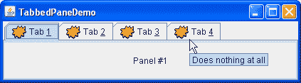

# 如何使用选项卡窗格

> 原文：[`docs.oracle.com/javase/tutorial/uiswing/components/tabbedpane.html`](https://docs.oracle.com/javase/tutorial/uiswing/components/tabbedpane.html)

使用[`JTabbedPane`](https://docs.oracle.com/javase/8/docs/api/javax/swing/JTabbedPane.html)类，您可以让多个组件，比如面板，共享相同的空间。用户通过选择对应所需组件的选项卡来选择要查看的组件。如果您想要类似的功能但不想使用选项卡界面，可以使用卡片布局而不是选项卡窗格。

## 创建选项卡窗格

要创建选项卡窗格，实例化`JTabbedPane`，创建您希望显示的组件，然后使用`addTab`方法将组件添加到选项卡窗格中。

以下图片介绍了一个名为`TabbedPaneDemo`的应用程序，其中有一个带有四个选项卡的选项卡窗格。



* * *

**试试这个：**

1.  单击“启动”按钮以使用[Java™ Web Start](http://www.oracle.com/technetwork/java/javase/javawebstart/index.html)运行 TabbedPaneDemo（[下载 JDK 7 或更高版本](http://www.oracle.com/technetwork/java/javase/downloads/index.html)）。或者，要自行编译和运行示例，请参考示例索引。

1.  将光标放在选项卡上。

    与标签相关联的工具提示显示出来。为了方便起见，您可以在将组件添加到选项卡窗格时指定工具提示文本。

1.  通过单击选项卡来选择一个选项卡。

    选项卡窗格显示与选项卡对应的组件。

1.  通过输入其助记符来选择一个选项卡。

    例如，在 Java 外观中，您可以通过键入 Alt-3 来选择标记为“Tab 3”的选项卡。

1.  在可滚动选项卡之间导航。

    此示例提供可滚动的选项卡。通过移动对话框的左侧或右侧边界来调整对话框的大小，以便选项卡不适合对话框内。在选项卡旁边会出现滚动箭头。

    单击箭头以查看其中一个隐藏的选项卡。

    请注意，单击箭头只会显示隐藏的标签，而不会选择新的标签。

* * *

正如`TabbedPaneDemo`示例所示，选项卡可以具有工具提示和助记符，并且可以同时显示文本和图像。

### 标签放置

默认的标签放置位置设置为`TOP`位置，如上所示。您可以使用`setTabPlacement`方法将标签放置位置更改为`LEFT`、`RIGHT`、`TOP`或`BOTTOM`。

### 选项卡窗格的代码

来自`TabbedPaneDemo.java`的以下代码创建了前面示例中的选项卡窗格。请注意，不需要事件处理代码。`JTabbedPane`对象会为您处理鼠标和键盘事件。

```java
JTabbedPane tabbedPane = new JTabbedPane();
ImageIcon icon = createImageIcon("images/middle.gif");

JComponent panel1 = makeTextPanel("Panel #1");
tabbedPane.addTab("Tab 1", icon, panel1,
                  "Does nothing");
tabbedPane.setMnemonicAt(0, KeyEvent.VK_1);

JComponent panel2 = makeTextPanel("Panel #2");
tabbedPane.addTab("Tab 2", icon, panel2,
                  "Does twice as much nothing");
tabbedPane.setMnemonicAt(1, KeyEvent.VK_2);

JComponent panel3 = makeTextPanel("Panel #3");
tabbedPane.addTab("Tab 3", icon, panel3,
                  "Still does nothing");
tabbedPane.setMnemonicAt(2, KeyEvent.VK_3);

JComponent panel4 = makeTextPanel(
        "Panel #4 (has a preferred size of 410 x 50).");
panel4.setPreferredSize(new Dimension(410, 50));
tabbedPane.addTab("Tab 4", icon, panel4,
                      "Does nothing at all");
tabbedPane.setMnemonicAt(3, KeyEvent.VK_4);

```

如前面的代码所示，`addTab`方法处理了在选项卡窗格中设置选项卡的大部分工作。`addTab`方法有几种形式，但它们都使用字符串标题和要由选项卡显示的组件。可选地，您可以指定图标和工具提示字符串。文本或图标（或两者）可以为 null。创建选项卡的另一种方法是使用`insertTab`方法，该方法允许您指定要添加的选项卡的索引。请注意，在此步骤中，`addTab`方法不允许指定索引。

## 切换到特定选项卡

有三种使用 GUI 切换到特定选项卡的方法。

1.  **使用鼠标。** 要切换到特定选项卡，用户可以用鼠标点击它。

1.  **使用键盘箭头。** 当`JTabbedPane`对象获得焦点时，可以使用键盘箭头从一个选项卡切换到另一个选项卡。

1.  **使用键盘助记键。** `setMnemonicAt`方法允许用户使用键盘切换到特定选项卡。例如，`setMnemonicAt(3, KeyEvent.VK_4)`将'4'设置为第四个选项卡的助记键（索引从 0 开始，因此第四个选项卡的索引为 3）；按下 Alt-4 将显示第四个选项卡的组件。通常，助记键使用选项卡标题中的字符，然后自动加下划线。

要通过编程方式切换到特定选项卡，可以使用[`setSelectedIndex`](https://docs.oracle.com/javase/8/docs/api/javax/swing/JTabbedPane.html#setSelectedIndex-int-)或[`setSelectedComponent`](https://docs.oracle.com/javase/8/docs/api/javax/swing/JTabbedPane.html#setSelectedComponent-java.awt.Component-)方法。

### 选项卡的首选大小

在构建要添加到选项卡窗格的组件时，请记住，无论哪个选项卡的子组件可见，每个子组件都会获得相同的空间来显示自己。选项卡窗格的首选大小刚好足够显示其最高子组件的首选高度和最宽子组件的首选宽度。类似地，选项卡窗格的最小大小取决于所有子组件的最大最小宽度和高度。

在`TabbedPaneDemo`示例中，第四个面板的首选宽度和高度大于其他面板的宽度和高度。因此，选项卡窗格的首选大小刚好足够显示第四个面板的首选大小。每个面板都获得完全相同的空间 - 假设选项卡窗格处于首选大小状态，宽度为 410 像素，高度为 50 像素。如果您不了解首选大小的使用方式，请参考布局管理工作原理。

### 带有自定义组件的选项卡

`TabComponentsDemo`示例介绍了一个选项卡窗格，其选项卡包含真实组件。使用自定义组件带来了新功能，如按钮、组合框、标签和其他组件到选项卡，并允许更复杂的用户交互。

这是一个带有选项卡关闭按钮的选项卡窗格。


* * *

**试试这个：**

1.  单击“启动”按钮以使用[Java™ Web Start](http://www.oracle.com/technetwork/java/javase/javawebstart/index.html)运行 TabComponentsDemo（[下载 JDK 7 或更高版本](http://www.oracle.com/technetwork/java/javase/downloads/index.html)）。或者，要自行编译和运行示例，请参考示例索引。

1.  将光标放在选项卡上。

1.  通过单击选项卡来选择它（确保不要点击小十字）。

1.  将光标放在带有小十字的小部件上。

    小十字变成品红色并被包裹在一个正方形中。与关闭按钮关联的工具提示会出现。

    用鼠标左键单击十字关闭选项卡。

1.  通过选择“重置 JTabbedPane”项目来恢复已删除的选项卡。

1.  请注意，带有自定义组件的选项卡显示在原始选项卡窗格选项卡的顶部。

    要查看下面的选项卡，请打开选项菜单并取消选中“使用 TabComponents”复选框。

1.  通过再次选择“使用 TabComponents”复选框来显示带有组件的选项卡。

1.  关闭所有选项卡。现在选项卡窗格是空的。

* * *

## 删除选项卡

下面的代码来自`ButtonTabComponent.java`，从选项卡窗格中移除一个选项卡。请注意，需要事件处理代码。由于每个选项卡包含一个真实的`JButton`对象，您必须将`ActionListener`附加到关闭按钮上。当用户点击按钮时，`actionPerformed`方法确定它所属的选项卡的索引，并移除相应的选项卡。

```java
public void actionPerformed(ActionEvent e) {
    int i = pane.indexOfTabComponent(ButtonTabComponent.this);
    if (i != -1) {
    pane.remove(i);
    }
}

```

## 为自定义选项卡添加标题

下面的代码取自`ButtonTabComponent.java`，展示了如何从原始选项卡窗格选项卡中获取自定义选项卡组件的标题。

```java
JLabel label = new JLabel(title) {
    public String getText() {
        int i = pane.indexOfTabComponent(ButtonTabComponent.this);
        if (i != -1) {
            return pane.getTitleAt(i);
        }
        return null;
    }
};

```

## 选项卡窗格 API

以下表格列出了常用的`JTabbedPane`构造函数和方法。使用选项卡窗格的 API 分为以下几个类别：

+   创建和设置选项卡窗格

+   插入、删除、查找和选择选项卡

+   更改选项卡外观

+   在选项卡上设置自定义组件

创建和设置选项卡窗格

| 方法或构造函数 | 目的 |
| --- | --- |

| [JTabbedPane()](https://docs.oracle.com/javase/8/docs/api/javax/swing/JTabbedPane.html#JTabbedPane--) [JTabbedPane(int)](https://docs.oracle.com/javase/8/docs/api/javax/swing/JTabbedPane.html#JTabbedPane-int-)

[JTabbedPane(int, int)](https://docs.oracle.com/javase/8/docs/api/javax/swing/JTabbedPane.html#JTabbedPane-int-int-) | 创建一个选项卡窗格。第一个可选参数指定选项卡应出现的位置。默认情况下，选项卡出现在选项卡窗格的顶部。您可以指定这些位置（在`SwingConstants`接口中定义，由`JTabbedPane`实现）：`TOP`、`BOTTOM`、`LEFT`、`RIGHT`。第二个可选参数指定选项卡布局策略。您可以指定这些策略之一（在`JTabbedPane`中定义）：[`WRAP_TAB_LAYOUT`](https://docs.oracle.com/javase/8/docs/api/javax/swing/JTabbedPane.html#WRAP_TAB_LAYOUT)或[`SCROLL_TAB_LAYOUT`](https://docs.oracle.com/javase/8/docs/api/javax/swing/JTabbedPane.html#SCROLL_TAB_LAYOUT)。 |

| [addTab(String, Icon, Component, String)](https://docs.oracle.com/javase/8/docs/api/javax/swing/JTabbedPane.html#addTab-java.lang.String-javax.swing.Icon-java.awt.Component-java.lang.String-) [addTab(String, Icon, Component)](https://docs.oracle.com/javase/8/docs/api/javax/swing/JTabbedPane.html#addTab-java.lang.String-javax.swing.Icon-java.awt.Component-)

[addTab(String, Component)](https://docs.oracle.com/javase/8/docs/api/javax/swing/JTabbedPane.html#addTab-java.lang.String-java.awt.Component-) | 向选项卡窗格添加一个新选项卡。第一个参数指定选项卡上的文本。可选的图标参数指定选项卡的图标。组件参数指定选项卡被选中时选项卡窗格应显示的组件。如果存在第四个参数，则指定选项卡的工具提示文本。 |

| [void setTabLayoutPolicy(int)](https://docs.oracle.com/javase/8/docs/api/javax/swing/JTabbedPane.html#setTabLayoutPolicy-int-) [int getTabLayoutPolicy()](https://docs.oracle.com/javase/8/docs/api/javax/swing/JTabbedPane.html#getTabLayoutPolicy--) | 设置或获取选项卡窗格在所有选项卡不适合单个运行时使用的布局策略。可能的值为`WRAP_TAB_LAYOUT`和`SCROLL_TAB_LAYOUT`。默认策略是`WRAP_TAB_LAYOUT`。 |
| --- | --- |
| [void setTabPlacement(int)](https://docs.oracle.com/javase/8/docs/api/javax/swing/JTabbedPane.html#setTabPlacement-int-) [int getTabPlacement()](https://docs.oracle.com/javase/8/docs/api/javax/swing/JTabbedPane.html#getTabPlacement--) | 设置或获取选项卡相对于内容出现的位置。可能的值（在`SwingConstants`中定义，由`JTabbedPane`实现）为`TOP`、`BOTTOM`、`LEFT`和`RIGHT`。 |

插入、删除、查找和选择选项卡

| 方法 | 目的 |
| --- | --- |
| [insertTab(String, Icon, Component, String, int)](https://docs.oracle.com/javase/8/docs/api/javax/swing/JTabbedPane.html#insertTab-java.lang.String-javax.swing.Icon-java.awt.Component-java.lang.String-int-) | 在指定的索引处插入一个选项卡，其中第一个选项卡的索引为 0。参数与`addTab`相同。 |
| [删除(组件)](https://docs.oracle.com/javase/8/docs/api/javax/swing/JTabbedPane.html#remove-java.awt.Component-) [删除指定索引处的选项卡](https://docs.oracle.com/javase/8/docs/api/javax/swing/JTabbedPane.html#removeTabAt-int-) | 删除与指定组件或索引对应的选项卡。 |
| [删除所有](https://docs.oracle.com/javase/8/docs/api/javax/swing/JTabbedPane.html#removeAll--) | 删除所有选项卡。 |

| [组件的索引](https://docs.oracle.com/javase/8/docs/api/javax/swing/JTabbedPane.html#indexOfComponent-java.awt.Component-) [选项卡的索引](https://docs.oracle.com/javase/8/docs/api/javax/swing/JTabbedPane.html#indexOfTab-java.lang.String-)

[选项卡的索引(图标)](https://docs.oracle.com/javase/8/docs/api/javax/swing/JTabbedPane.html#indexOfTab-javax.swing.Icon-) | 返回具有指定组件、标题或图标的选项卡的索引。 |

| [void setSelectedIndex(int)](https://docs.oracle.com/javase/8/docs/api/javax/swing/JTabbedPane.html#setSelectedIndex-int-) [void setSelectedComponent(Component)](https://docs.oracle.com/javase/8/docs/api/javax/swing/JTabbedPane.html#setSelectedComponent-java.awt.Component-) | 选择具有指定组件或索引的选项卡。选择选项卡会显示其关联的组件。 |
| --- | --- |
| [获取选定索引的整数](https://docs.oracle.com/javase/8/docs/api/javax/swing/JTabbedPane.html#getSelectedIndex--) [获取选定组件的组件](https://docs.oracle.com/javase/8/docs/api/javax/swing/JTabbedPane.html#getSelectedComponent--) | 返回选定选项卡的索引或组件。 |

更改选项卡外观

| 方法 | 目的 |
| --- | --- |
| [void setComponentAt(int, Component)](https://docs.oracle.com/javase/8/docs/api/javax/swing/JTabbedPane.html#setComponentAt-int-java.awt.Component-) [获取指定索引处选项卡关联的组件](https://docs.oracle.com/javase/8/docs/api/javax/swing/JTabbedPane.html#getComponentAt-int-) | 设置或获取与指定索引处选项卡关联的组件。第一个选项卡的索引为 0。 |
| [void setTitleAt(int, String)](https://docs.oracle.com/javase/8/docs/api/javax/swing/JTabbedPane.html#setTitleAt-int-java.lang.String-) [获取指定索引处选项卡的标题](https://docs.oracle.com/javase/8/docs/api/javax/swing/JTabbedPane.html#getTitleAt-int-) | 设置或获取指定索引处选项卡的标题。 |

| [void setIconAt(int, Icon)](https://docs.oracle.com/javase/8/docs/api/javax/swing/JTabbedPane.html#setIconAt-int-javax.swing.Icon-) [获取指定索引处的图标](https://docs.oracle.com/javase/8/docs/api/javax/swing/JTabbedPane.html#getIconAt-int-)

[void setDisabledIconAt(int, Icon)](https://docs.oracle.com/javase/8/docs/api/javax/swing/JTabbedPane.html#setDisabledIconAt-int-javax.swing.Icon-)

[获取指定索引处选项卡显示的禁用图标](https://docs.oracle.com/javase/8/docs/api/javax/swing/JTabbedPane.html#getDisabledIconAt-int-) | 设置或获取指定索引处选项卡显示的图标。 |

| [void setBackgroundAt(int, Color)](https://docs.oracle.com/javase/8/docs/api/javax/swing/JTabbedPane.html#setBackgroundAt-int-java.awt.Color-) [Color getBackgroundAt(int)](https://docs.oracle.com/javase/8/docs/api/javax/swing/JTabbedPane.html#getBackgroundAt-int-)

[void setForegroundAt(int, Color)](https://docs.oracle.com/javase/8/docs/api/javax/swing/JTabbedPane.html#setForegroundAt-int-java.awt.Color-)

[Color getForegroundAt(int)](https://docs.oracle.com/javase/8/docs/api/javax/swing/JTabbedPane.html#getForegroundAt-int-) | 设置或获取指定索引处选项卡使用的背景或前景颜色。默认情况下，选项卡使用选项卡窗格的背景和前景颜色。例如，如果选项卡窗格的前景色是黑色，则每个选项卡的标题都是黑色，除非您使用`setForegroundAt`指定另一种颜色。

| [void setEnabledAt(int, boolean)](https://docs.oracle.com/javase/8/docs/api/javax/swing/JTabbedPane.html#setEnabledAt-int-boolean-) [boolean isEnabledAt(int)](https://docs.oracle.com/javase/8/docs/api/javax/swing/JTabbedPane.html#isEnabledAt-int-) | 设置或获取指定索引处选项卡的启用状态。 |
| --- | --- |
| [void setMnemonicAt(int, int)](https://docs.oracle.com/javase/8/docs/api/javax/swing/JTabbedPane.html#setMnemonicAt-int-int-) [int getMnemonicAt(int)](https://docs.oracle.com/javase/8/docs/api/javax/swing/JTabbedPane.html#getMnemonicAt-int-) | 设置或获取访问指定选项卡的键盘助记符。 |
| [void setDisplayedMnemonicIndexAt(int, int)](https://docs.oracle.com/javase/8/docs/api/javax/swing/JTabbedPane.html#setDisplayedMnemonicIndexAt-int-int-) [int getDisplayedMnemonicIndexAt(int)](https://docs.oracle.com/javase/8/docs/api/javax/swing/JTabbedPane.html#getDisplayedMnemonicIndexAt-int-) | 设置或获取应该被装饰以表示助记符的字符。当助记符字符在选项卡标题中出现多次且您不希望第一次出现时被下划线标记时，这将非常有用。 |
| [void setToolTipTextAt(int, String)](https://docs.oracle.com/javase/8/docs/api/javax/swing/JTabbedPane.html#setToolTipTextAt-int-java.lang.String-) [String getToolTipTextAt(int)](https://docs.oracle.com/javase/8/docs/api/javax/swing/JTabbedPane.html#getToolTipTextAt-int-) | 设置或获取指定选项卡上显示的工具提示文本。 |

设置自定义组件在选项卡上

| 方法 | 目的 |
| --- | --- |
| [void setTabComponentAt(int, Component)](https://docs.oracle.com/javase/8/docs/api/javax/swing/JTabbedPane.html#setTabComponentAt-int-java.awt.Component-) | 设置负责为由第一个参数指定的选项卡渲染标题或图标（或两者）的组件。当指定空值时，`JTabbedPane`将渲染标题或图标。同一组件不能用于多个选项卡。 |
| [获取指定索引处的选项卡组件](https://docs.oracle.com/javase/8/docs/api/javax/swing/JTabbedPane.html#getTabComponentAt-int-) | 获取指定索引处选项卡的选项卡组件。如果指定选项卡没有选项卡组件，则返回空值。 |
| [检查组件是否属于选项卡](https://docs.oracle.com/javase/8/docs/api/javax/swing/JTabbedPane.html#indexOfTabComponent-java.awt.Component-) | 检查指定组件是否属于其中一个选项卡。返回相应选项卡的索引，如果没有这样的选项卡，则返回-1。 |

## 使用选项卡窗格的示例

此表列出了使用`JTabbedPane`的示例，并指向这些示例的描述位置。

| 示例 | 描述位置 | 备注 |
| --- | --- | --- |
| `TabbedPaneDemo` | 本页 | 演示一些选项卡窗格的功能，如工具提示、图标、可滚动布局和助记键。 |
| `TabComponentsDemo` | 本页 | 演示选项卡上的自定义组件。使用带有关闭按钮的选项卡窗格。 |
| `BoxAlignmentDemo` | 如何使用 BoxLayout | 将`JTabbedPane`用作框架内容窗格的唯一子元素。 |
| `BorderDemo` | 如何使用边框 | 以类似于`BoxAlignmentDemo`的方式使用其选项卡窗格。 |
| `DialogDemo` | 如何使用对话框 | 在框架内容窗格的中心有一个带有标签的选项卡窗格。 |
