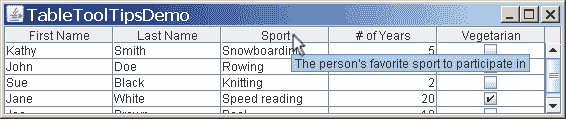
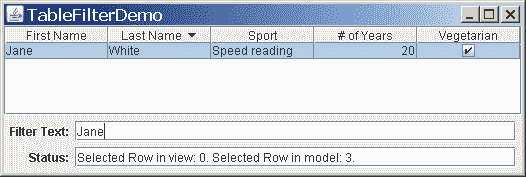

# 如何使用表格

> 原文：[`docs.oracle.com/javase/tutorial/uiswing/components/table.html`](https://docs.oracle.com/javase/tutorial/uiswing/components/table.html)

使用[`JTable`](https://docs.oracle.com/javase/8/docs/api/javax/swing/JTable.html)类可以显示数据表，可选择允许用户编辑数据。 `JTable`不包含或缓存数据；它只是您数据的一个视图。这里是一个典型表格在滚动窗格中显示的图片：


本节的其余部分将向您展示如何完成一些常见的与表格相关的任务。本节涵盖以下主题：

+   创建简单表格

+   将表格添加到容器中

+   设置和更改列宽

+   用户选择

+   创建表格模型

+   监听数据更改

+   触发数据更改事件

+   概念：编辑器和渲染器

+   使用自定义渲染器

+   为单元格指定工具提示

+   为列标题指定工具提示

+   排序和过滤

+   使用下拉框作为编辑器

+   使用其他编辑器

+   使用编辑器验证用户输入的文本

+   打印

+   使用表格的示例

## 创建简单表格

* * *

**试试这个：**

1.  点击“启动”按钮以使用[Java™ Web Start](http://www.oracle.com/technetwork/java/javase/javawebstart/index.html)运行`SimpleTableDemo`（[下载 JDK 7 或更高版本](http://www.oracle.com/technetwork/java/javase/downloads/index.html)）。或者，要自己编译和运行示例，请参考示例索引。

    

1.  点击包含“滑雪”的单元格。

    整个第一行被选中，表示您已选择了 Kathy Smith 的数据。特殊的高亮显示表示“滑雪”单元格可编辑。通常，双击文本单元格即可开始编辑。

1.  将光标放在“名字”上。现在按下鼠标按钮并向右拖动。

    如您所见，用户可以重新排列表格中的列。

1.  将光标放在列标题的右侧。现在按下鼠标按钮并向右或向左拖动。

    列的大小会改变，其他列会调整以填充剩余空间。

1.  调整包含表格的窗口大小，使其比显示整个表格所需的空间更大。

    所有表格单元格变宽，扩展以填充额外的水平空间。

* * *

在`SimpleTableDemo.java`中的表格使用字符串数组声明列名：

```java
String[] columnNames = {"First Name",
                        "Last Name",
                        "Sport",
                        "# of Years",
                        "Vegetarian"};

```

其数据被初始化并存储在二维对象数组中：

```java
Object[][] data = {
    {"Kathy", "Smith",
     "Snowboarding", new Integer(5), new Boolean(false)},
    {"John", "Doe",
     "Rowing", new Integer(3), new Boolean(true)},
    {"Sue", "Black",
     "Knitting", new Integer(2), new Boolean(false)},
    {"Jane", "White",
     "Speed reading", new Integer(20), new Boolean(true)},
    {"Joe", "Brown",
     "Pool", new Integer(10), new Boolean(false)}
};

```

然后使用这些数据和列名构建表格：

```java
JTable table = new JTable(data, columnNames);

```

有两个直接接受数据的`JTable`构造函数（`SimpleTableDemo`使用第一个）：

+   `JTable(Object[][] rowData, Object[] columnNames)`

+   `JTable(Vector rowData, Vector columnNames)`

这些构造函数的优点是易于使用。但是，这些构造函数也有缺点：

+   它们会自动使每个单元格可编辑。

+   它们将所有数据类型视为相同（字符串）。例如，如果表格列具有`Boolean`数据，表格可以将数据显示为复选框。但是，如果您使用前面列出的两个`JTable`构造函数之一，您的`Boolean`数据将显示为字符串。您可以在前一个图中的`Vegetarian`列中看到这种差异。

+   它们要求您将所有表格数据放入数组或向量中，这对于某些数据可能不合适。例如，如果您正在从数据库实例化一组对象，您可能希望直接查询对象以获取其值，而不是将所有值复制到数组或向量中。

如果您想绕过这些限制，您需要实现自己的表格模型，如创建表格模型中所述。

## 将表格添加到容器中

这是创建滚动窗格作为表格容器的典型代码：

```java
JScrollPane scrollPane = new JScrollPane(table);
table.setFillsViewportHeight(true);

```

此片段中的两行代码执行以下操作：

+   使用引用表格对象的参数调用`JScrollPane`构造函数。这将创建一个作为表格容器的滚动窗格；表格会自动添加到容器中。

+   调用`JTable.setFillsViewportHeight`来设置`fillsViewportHeight`属性。当此属性为`true`时，表格将使用容器的整个高度，即使表格没有足够的行来使用整个垂直空间。这使得将表格用作拖放目标更容易。

滚动窗格会自动将表头放置在视口顶部。当表格数据滚动时，列名仍然可见在查看区域的顶部。

如果您使用没有滚动窗格的表格，则必须自行获取表头组件并放置它。例如：

```java
container.setLayout(new BorderLayout());
container.add(table.getTableHeader(), BorderLayout.PAGE_START);
container.add(table, BorderLayout.CENTER);

```

## 设置和更改列宽度

默认情况下，表格中的所有列都具有相等的宽度，并且列会自动填充表格的整个宽度。当表格变宽或变窄时（当用户调整包含表格的窗口大小时可能会发生），所有列宽度会相应地更改。

当用户通过拖动列的右边框调整列的大小时，要么其他列的大小会改变，要么表格的大小会改变。默认情况下，表格的大小保持不变，拖动点左侧的列增加或减少的空间会导致拖动点右侧的所有列调整大小。

要自定义初始列宽度，您可以在表格的每一列上调用`setPreferredWidth`。这将设置列的首选宽度和它们的大致相对宽度。例如，将以下代码添加到`SimpleTableDemo`中会使其第三列比其他列更宽：

```java
TableColumn column = null;
for (int i = 0; i < 5; i++) {
    column = table.getColumnModel().getColumn(i);
    if (i == 2) {
        column.setPreferredWidth(100); //third column is bigger
    } else {
        column.setPreferredWidth(50);
    }
}

```

正如前面的代码所示，表格中的每一列都由一个[`TableColumn`](https://docs.oracle.com/javase/8/docs/api/javax/swing/table/TableColumn.html)对象表示。`TableColumn`提供了用于获取和设置列的最小、首选和最大宽度的方法，以及用于获取当前宽度的方法。有关根据绘制单元格内容所需空间的近似值设置单元格宽度的示例，请参见`TableRenderDemo.java`中的`initColumnSizes`方法。

当用户明确调整列宽时，列的*首选*宽度会被设置为用户指定的大小，成为列的新*当前*宽度。然而，当表格本身被调整大小时 — 通常是因为窗口大小调整 —；列的首选宽度不会改变。相反，现有的首选宽度会被用来计算新的列宽以填充可用空间。

您可以通过调用[`setAutoResizeMode`](https://docs.oracle.com/javase/8/docs/api/javax/swing/JTable.html#setAutoResizeMode-int-)来更改表格的调整大小行为。

## 用户选择

在其默认配置中，表格支持由一个或多个行组成的选择。用户可以选择一系列连续的行或任意一组行。用户指示的最后一个单元格会得到特殊的指示；在 Metal 外观中，该单元格会被勾勒出来。这个单元格被称为*主要选择*；有时被称为“焦点单元格”或“当前单元格”。

用户使用鼠标和/或键盘进行选择，如下表所述：

| 操作 | 鼠标操作 | 键盘操作 |
| --- | --- | --- |
| 选择单行。 | 点击。 | 上箭头或下箭头。 |
| 扩展连续选择。 | Shift-Click 或拖动行。 | Shift-Up Arrow 或 Shift-Down Arrow。 |
| 将行添加到选择/切换行选择。 | Control-Click | 使用 Control-Up Arrow 或 Control-Down Arrow 移动主要选择，然后使用空格键添加到选择或使用 Control-Space 键切换行选择。 |

要查看选择是如何工作的，请单击“启动”按钮以使用[Java™ Web Start](http://www.oracle.com/technetwork/java/javase/javawebstart/index.html)运行`TableSelectionDemo`（[下载 JDK 7 或更高版本](http://www.oracle.com/technetwork/java/javase/downloads/index.html)）。或者，要自行编译和运行示例，请参考示例索引。


此示例程序呈现了熟悉的表格，并允许用户操作某些 JTable 选项。还有一个文本窗格记录选择事件。

在下面的截图中，用户运行了程序，在第一行单击，然后在第三行按住控制键单击。注意最后单击的单元格周围的轮廓；这是 Metal 外观如何突出显示主要选择。


在“选择模式”下有一组单选按钮。单击标记为“单一选择”的按钮。现在您只能一次选择一行。如果单击“单一间隔选择”单选按钮，则可以选择必须是连续的一组行。

“选择模式”下的所有单选按钮都调用[`JTable.setSelectionMode`](https://docs.oracle.com/javase/8/docs/api/javax/swing/JTable.html#setSelectionMode-int-)。此方法接受一个参数，必须是`javax.swing.ListSelectionModel`中定义的以下常量之一：`MULTIPLE_INTERVAL_SELECTION`，`SINGLE_INTERVAL_SELECTION`和`SINGLE_SELECTION`。

回到`TableSelectionDemo`，注意“选择选项”下的三个选项复选框。每个复选框控制由`JTable`定义的`boolean`绑定变量的状态：

+   “行选择”控制`rowSelectionAllowed`，其具有 setter 方法`setRowSelectionAllowed`和 getter 方法`getRowSelectionAllowed`。当此绑定属性为`true`（且`columnSelectionAllowed`属性为`false`）时，用户可以按行选择。

+   “列选择”控制`columnSelectionAllowed`，其具有 setter 方法`setColumnSelectionAllowed`和 getter 方法`getColumnSelectionAllowed`。当此绑定属性为`true`（且`rowSelectionAllowed`绑定属性为`false`）时，用户可以按列选择。

+   “单元格选择”控制`cellSelectionEnabled`，其具有 setter 方法`setCellSelectionEnabled`和 getter 方法`getCellSelectionEnabled`。当此绑定属性为`true`时，用户可以选择单个单元格或矩形块的单元格。

* * *

**注意：** `JTable`使用非常简单的选择概念，作为行和列的交集进行管理。它不是设计为处理完全独立的单元格选择。

* * *

如果清除所有三个复选框（将所有三个绑定属性设置为`false`），则没有选择；只显示主要选择。

您可能注意到在多个间隔选择模式下，“单元格选择”复选框被禁用。这是因为在演示中不支持单元格选择。您可以在多个间隔选择模式下指定按单元格选择，但结果是产生不实用的选择的表格。

您可能还注意到，更改三个选择选项中的任何一个都可能影响其他选项。这是因为允许行选择和列选择与启用单元格选择完全相同。`JTable`会根据需要自动更新三个绑定变量，以保持它们一致。

* * *

**注意：** 将`cellSelectionEnabled`设置为一个值会同时将`rowSelectionEnabled`和`columnSelectionEnabled`设置为该值。将`rowSelectionEnabled`和`columnSelectionEnabled`都设置为一个值会同时将`cellSelectionEnabled`设置为该值。将`rowSelectionEnabled`和`columnSelectionEnabled`设置为不同的值会同时将`cellSelectionEnabled`设置为`false`。

* * *

要检索当前选择，请使用[`JTable.getSelectedRows`](https://docs.oracle.com/javase/8/docs/api/javax/swing/JTable.html#getSelectedRows--)返回一个行索引数组，以及[`JTable.getSelectedColumns`](https://docs.oracle.com/javase/8/docs/api/javax/swing/JTable.html#getSelectedColumns--)返回一个列索引数组。要检索主选择的坐标，请参考表本身和表的列模型的选择模型。以下代码格式化一个包含主选择行和列的字符串：

```java
String.format("Lead Selection: %d, %d. ",
    table.getSelectionModel().getLeadSelectionIndex(),
    table.getColumnModel().getSelectionModel().getLeadSelectionIndex());

```

用户选择会生成多个事件。有关这些事件的信息，请参考如何编写列表选择监听器中的编写事件监听器课程。

* * *

**注意：** 选择数据实际上描述了在“视图”中选择的单元格（表数据在任何排序或过滤后的外观），而不是在表模型中的单元格。除非您查看的数据已通过排序、过滤或用户操作列重新排列，否则此区别并不重要。在这种情况下，您必须使用排序和过滤中描述的转换方法转换选择坐标。

* * *

## 创建表模型

每个表对象都使用一个*表模型对象*来管理实际的表数据。表模型对象必须实现[`TableModel`](https://docs.oracle.com/javase/8/docs/api/javax/swing/table/TableModel.html)接口。如果程序员没有提供表模型对象，`JTable`会自动创建一个[`DefaultTableModel`](https://docs.oracle.com/javase/8/docs/api/javax/swing/table/DefaultTableModel.html)实例。下面展示了这种关系。


`SimpleTableDemo`使用的`JTable`构造函数会使用以下代码创建其表模型：

```java
new AbstractTableModel() {
    public String getColumnName(int col) {
        return columnNames[col].toString();
    }
    public int getRowCount() { return rowData.length; }
    public int getColumnCount() { return columnNames.length; }
    public Object getValueAt(int row, int col) {
        return rowData[row][col];
    }
    public boolean isCellEditable(int row, int col)
        { return true; }
    public void setValueAt(Object value, int row, int col) {
        rowData[row][col] = value;
        fireTableCellUpdated(row, col);
    }
}

```

如前面的代码所示，实现表模型可以很简单。通常，您会在[`AbstractTableModel`](https://docs.oracle.com/javase/8/docs/api/javax/swing/table/AbstractTableModel.html)类的子类中实现您的表模型。

您的模型可能将数据保存在数组、向量或哈希映射中，也可能从外部来源（如数据库）获取数据。甚至可能在执行时生成数据。

这个表格与`SimpleTableDemo`表格有以下不同之处：

+   `TableDemo`的自定义表格模型虽然简单，但可以轻松确定数据的类型，帮助`JTable`以最佳格式显示数据。另一方面，`SimpleTableDemo`自动创建的表格模型并不知道**# of Years**列包含数字（通常应右对齐并具有特定格式）。它也不知道`Vegetarian`列包含布尔值，可以用复选框表示。

+   在`TableDemo`中实现的自定义表格模型不允许您编辑名称列；但是，它允许您编辑其他列。在`SimpleTableDemo`中，所有单元格都是可编辑的。

请看下面从`TableDemo.java`中提取的代码，它与`SimpleTableDemo.java`不同。粗体字表示的代码表明了使该表格模型与`SimpleTableDemo`自动定义的表格模型不同的代码。

```java
public TableDemo() {
    ...
    JTable table = new JTable(new MyTableModel());
    ...
}

class MyTableModel extends AbstractTableModel {
    private String[] columnNames = *...//same as before...*
    private Object[][] data = *...//same as before...*

    public int getColumnCount() {
        return columnNames.length;
    }

    public int getRowCount() {
        return data.length;
    }

    public String getColumnName(int col) {
        return columnNames[col];
    }

    public Object getValueAt(int row, int col) {
        return data[row][col];
    }

    public Class getColumnClass(int c) {
        return getValueAt(0, c).getClass();
    }

    /*
     * Don't need to implement this method unless your table's
     * editable.
     */
    public boolean isCellEditable(int row, int col) {
        //Note that the data/cell address is constant,
        //no matter where the cell appears onscreen.
        if (col < 2) {
            return false;
        } else {
            return true;
        }
    }

    /*
     * Don't need to implement this method unless your table's
     * data can change.
     */
    public void setValueAt(Object value, int row, int col) {
        data[row][col] = value;
        fireTableCellUpdated(row, col);
    }
    ...
}

```

## 监听数据更改

表格模型可以有一组监听器，每当表格数据发生变化时就会通知它们。监听器是[`TableModelListener`](https://docs.oracle.com/javase/8/docs/api/javax/swing/event/TableModelListener.html)的实例。在下面的示例代码中，`SimpleTableDemo`被扩展以包含这样一个监听器。新代码用粗体表示。

```java
import javax.swing.event.*;
import javax.swing.table.TableModel;

public class SimpleTableDemo ... implements TableModelListener {
    ...
    public SimpleTableDemo() {
        ...
        table.getModel().addTableModelListener(this);
        ...
    }

    public void tableChanged(TableModelEvent e) {
        int row = e.getFirstRow();
        int column = e.getColumn();
        TableModel model = (TableModel)e.getSource();
        String columnName = model.getColumnName(column);
        Object data = model.getValueAt(row, column);

        *...// Do something with the data...*
    }
    ...
}

```

## 触发数据更改事件

为了触发数据更改事件，表格模型必须知道如何构造一个[`TableModelEvent`](https://docs.oracle.com/javase/8/docs/api/javax/swing/event/TableModelEvent.html)对象。这可能是一个复杂的过程，但已经在`DefaultTableModel`中实现。您可以允许`JTable`使用其默认的`DefaultTableModel`实例，或者创建自己的`DefaultTableModel`的自定义子类。

如果`DefaultTableModel`不适合作为您的自定义表格模型类的基类，请考虑子类化[`AbstractTableModel`](https://docs.oracle.com/javase/8/docs/api/javax/swing/table/AbstractTableModel.html)。这个类实现了一个简单的框架来构造`TableModelEvent`对象。您的自定义类只需在外部源更改表格数据时调用以下`AbstractTableModel`方法之一。

| 方法 | 变更 |
| --- | --- |
| `fireTableCellUpdated` | 更新指定单元格。 |
| `fireTableRowsUpdated` | 更新指定行 |
| `fireTableDataChanged` | 更新整个表格（仅数据）。 |
| `fireTableRowsInserted` | 插入新行。 |
| `fireTableRowsDeleted` | 删除现有行 |
| `fireTableStructureChanged`   | 使整个表格无效，包括数据和结构。 |

## 概念：编辑器和渲染器

在继续下面的几项任务之前，您需要了解表格如何绘制其单元格。您可能期望表格中的每个单元格都是一个组件。然而，出于性能原因，Swing 表格的实现方式不同。

相反，通常使用单个*单元格渲染器*来绘制包含相同类型数据的所有单元格。您可以将渲染器视为可配置的墨水印，表格用它来将适当格式的数据印在每个单元格上。当用户开始编辑单元格数据时，*单元格编辑器*接管单元格，控制单元格的编辑行为。

例如，在`TableDemo`中**# of Years**列中的每个单元格都包含`Number`数据 — 具体来说，是一个`Integer`对象。默认情况下，包含`Number`的列的单元格渲染器使用单个`JLabel`实例在列的单元格上绘制适当的数字，右对齐。如果用户开始编辑其中一个单元格，默认单元格编辑器使用右对齐的`JTextField`来控制单元格编辑。

要选择显示列中单元格的渲染器，表格首先确定您是否为该特定列指定了渲染器。如果没有，则表格调用表格模型的`getColumnClass`方法，该方法获取列单元格的数据类型。接下来，表格将列的数据类型与已注册单元格渲染器的数据类型列表进行比较。此列表由表格初始化，但您可以添加或更改。目前，表格将以下类型的数据放入列表中：

+   `Boolean` — 使用复选框渲染。

+   `Number` — 由右对齐的标签渲染。

+   `Double`、`Float` — 与`Number`相同，但对象到文本的转换由[`NumberFormat`](https://docs.oracle.com/javase/8/docs/api/java/text/NumberFormat.html)实例执行（使用当前区域设置的默认数字格式）。

+   `Date` — 由一个标签渲染，对象到文本的转换由[`DateFormat`](https://docs.oracle.com/javase/8/docs/api/java/text/DateFormat.html)实例执行（使用日期和时间的短格式）。

+   `ImageIcon`、`Icon` — 由居中的标签渲染。

+   `Object` — 由显示对象字符串值的标签渲染。

单元格编辑器是使用类似的算法选择的。

请记住，如果让表格创建自己的模型，它会将`Object`用作每列的类型。要指定更精确的列类型，表格模型必须适当定义`getColumnClass`方法，正如`TableDemo.java`所示。

请记住，尽管渲染器确定每个单元格或列标题的外观并可以指定其工具提示文本，但渲染器不处理事件。如果您需要捕获表格内发生的事件，您所使用的技术取决于您感兴趣的事件类型：

| 情况 | 如何获取事件 |
| --- | --- |
| 要检测正在编辑的单元格的事件... | 使用单元格编辑器（或在单元格编辑器上注册监听器）。 |
| 要检测行/列/单元格的选择和取消选择... | 使用如检测用户选择中描述的选择监听器。 |
| 要在列标题上检测鼠标事件... | 在表的`JTableHeader`对象上注册适当类型的鼠标监听器。（参见`TableSorter.java`的示例。） |
| 要检测其他事件... | 在`JTable`对象上注册适当的监听器。 |

接下来的几节告诉您如何通过指定渲染器和编辑器来自定义显示和编辑。您可以按列或数据类型指定单元格渲染器和编辑器。

## 使用自定义渲染器

本节告诉您如何创建和指定单元格渲染器。您可以使用`JTable`方法`setDefaultRenderer`设置特定类型的单元格渲染器。要指定特定列中的单元格应使用渲染器，可以使用`TableColumn`方法`setCellRenderer`。甚至可以通过创建`JTable`子类来指定特定单元格的渲染器。

定制默认渲染器`DefaultTableCellRenderer`渲染的文本或图像很容易。只需创建一个子类并实现`setValue`方法，使其调用适当的字符串或图像的`setText`或`setIcon`。例如，这是默认日期渲染器的实现方式：

```java
static class DateRenderer extends DefaultTableCellRenderer {
    DateFormat formatter;
    public DateRenderer() { super(); }

    public void setValue(Object value) {
        if (formatter==null) {
            formatter = DateFormat.getDateInstance();
        }
        setText((value == null) ? "" : formatter.format(value));
    }
}

```

如果扩展`DefaultTableCellRenderer`不够，可以使用另一个超类构建渲染器。最简单的方法是创建一个现有组件的子类，使您的子类实现[`TableCellRenderer`](https://docs.oracle.com/javase/8/docs/api/javax/swing/table/TableCellRenderer.html)接口。`TableCellRenderer`只需要一个方法：`getTableCellRendererComponent`。您实现此方法应设置渲染组件以反映传入状态，然后返回组件。

在`TableDialogEditDemo`的快照中，用于**Favorite Color**单元格的渲染器是一个名为`ColorRenderer`的`JLabel`子类。以下是`ColorRenderer.java`的摘录，展示了它的实现方式。

```java
public class ColorRenderer extends JLabel
                           implements TableCellRenderer {
    ...
    public ColorRenderer(boolean isBordered) {
        this.isBordered = isBordered;
        setOpaque(true); //MUST do this for background to show up.
    }

    public Component getTableCellRendererComponent(
                            JTable table, Object color,
                            boolean isSelected, boolean hasFocus,
                            int row, int column) {
        Color newColor = (Color)color;
        setBackground(newColor);
        if (isBordered) {
            if (isSelected) {
                ...
                //selectedBorder is a solid border in the color
                //table.getSelectionBackground().
                setBorder(selectedBorder);
            } else {
                ...
                //unselectedBorder is a solid border in the color
                //table.getBackground().
                setBorder(unselectedBorder);
            }
        }

        setToolTipText(...); *//Discussed in the following section*
        return this;
    }
}

```

这是从`TableDialogEditDemo.java`中注册`ColorRenderer`实例作为所有`Color`数据的默认渲染器的代码：

```java
table.setDefaultRenderer(Color.class, new ColorRenderer(true));

```

要指定特定单元格的渲染器，需要定义一个覆盖`getCellRenderer`方法的`JTable`子类。例如，以下代码使表格中第一列的第一个单元格使用自定义渲染器：

```java
TableCellRenderer weirdRenderer = new WeirdRenderer();
table = new JTable(...) {
    public TableCellRenderer getCellRenderer(int row, int column) {
        if ((row == 0) && (column == 0)) {
            return weirdRenderer;
        }
        // else...
        return super.getCellRenderer(row, column);
    }
};

```

## 为单元格指定工具提示

默认情况下，表格单元格显示的工具提示文本由单元格的渲染器确定。然而，有时通过覆盖`JTable`的`getToolTipText(MouseEvent)`方法来指定工具提示文本可能更简单。本节将向您展示如何同时使用这两种技术。

要通过其渲染器为单元格添加工具提示，首先需要获取或创建单元格渲染器。然后，在确保渲染组件是`JComponent`后，在其上调用`setToolTipText`方法。

在`TableRenderDemo`中设置单元格工具提示的示例。点击启动按钮以使用[Java™ Web Start](http://www.oracle.com/technetwork/java/javase/javawebstart/index.html)运行它（[下载 JDK 7 或更高版本](http://www.oracle.com/technetwork/java/javase/downloads/index.html)）。或者，要自行编译和运行示例，请参考示例索引。


源代码在`TableRenderDemo.java`中。它使用以下代码为**Sport**列的单元格添加工具提示：

```java
//Set up tool tips for the sport cells.
DefaultTableCellRenderer renderer =
        new DefaultTableCellRenderer();
renderer.setToolTipText("Click for combo box");
sportColumn.setCellRenderer(renderer);

```

尽管前面示例中的工具提示文本是静态的，但您也可以实现根据单元格或程序状态变化的工具提示。以下是几种实现方式：

+   在渲染器的`getTableCellRendererComponent`方法的实现中添加一点代码。

+   覆盖`JTable`方法`getToolTipText(MouseEvent)`。

在`TableDialogEditDemo`中添加代码到单元格渲染器的示例。点击启动按钮以使用[Java™ Web Start](http://www.oracle.com/technetwork/java/javase/javawebstart/index.html)运行它（[下载 JDK 7 或更高版本](http://www.oracle.com/technetwork/java/javase/downloads/index.html)）。或者，要自行编译和运行示例，请参考示例索引。


`TableDialogEditDemo`使用了一个颜色渲染器，实现在`ColorRenderer.java`中，使用粗体代码设置工具提示文本，如下所示：

```java
public class ColorRenderer extends JLabel 
                           implements TableCellRenderer {
    ...
    public Component getTableCellRendererComponent(
                            JTable table, Object color,
                            boolean isSelected, boolean hasFocus,
                            int row, int column) {
        Color newColor = (Color)color;
        ...
        setToolTipText("RGB value: " + newColor.getRed() + ", "
                                     + newColor.getGreen() + ", "
                                     + newColor.getBlue());
        return this;
    }
}

```

这是工具提示的示例：


您可以通过重写`JTable`的`getToolTipText(MouseEvent)`方法来指定工具提示文本。程序`TableToolTipsDemo`展示了如何操作。点击启动按钮以使用[Java™ Web Start](http://www.oracle.com/technetwork/java/javase/javawebstart/index.html)运行它（[下载 JDK 7 或更高版本](http://www.oracle.com/technetwork/java/javase/downloads/index.html)）。或者，要自行编译和运行示例，请参考示例索引。


工具提示的单元格位于**Sport**和**Vegetarian**列中。这是其工具提示的图片：


这是`TableToolTipsDemo.java`中实现**Sport**和**Vegetarian**列单元格工具提示的代码：

```java
JTable table = new JTable(new MyTableModel()) {    
    //Implement table cell tool tips.
    public String getToolTipText(MouseEvent e) {
        String tip = null;
        java.awt.Point p = e.getPoint();
        int rowIndex = rowAtPoint(p);
        int colIndex = columnAtPoint(p);
        int realColumnIndex = convertColumnIndexToModel(colIndex);

        if (realColumnIndex == 2) { //Sport column
            tip = "This person's favorite sport to "
                   + "participate in is: "
                   + getValueAt(rowIndex, colIndex);

        } else if (realColumnIndex == 4) { //Veggie column
            TableModel model = getModel();
            String firstName = (String)model.getValueAt(rowIndex,0);
            String lastName = (String)model.getValueAt(rowIndex,1);
            Boolean veggie = (Boolean)model.getValueAt(rowIndex,4);
            if (Boolean.TRUE.equals(veggie)) {
                tip = firstName + " " + lastName
                      + " is a vegetarian";
            } else {
                tip = firstName + " " + lastName
                      + " is not a vegetarian";
            }

        } else { //another column
            //You can omit this part if you know you don't 
            //have any renderers that supply their own tool 
            //tips.
            tip = super.getToolTipText(e);
        }
        return tip;
    }
    ...
}

```

代码相当简单，除了`convertColumnIndexToModel`的调用可能有点复杂。这个调用是必要的，因为如果用户移动列，视图对于列的索引将不匹配模型对于列的索引。例如，用户可能会拖动**Vegetarian**列（模型认为在索引 4 处），使其显示为第一列 - 在视图索引 0 处。由于`prepareRenderer`提供了视图索引，您需要将视图索引转换为模型索引，以确保选择了预期的列。

## 为列标题指定工具提示

您可以通过为表的`JTableHeader`设置工具提示文本来向列标题添加工具提示。通常，不同的列标题需要不同的工具提示文本。您可以通过重写表头的`getToolTipText`方法来更改文本。或者，您可以调用`TableColumn.setHeaderRenderer`来为表头提供自定义渲染器。

在`TableSorterDemo.java`中有一个示例，它为所有列标题使用相同的工具提示文本。以下是它设置工具提示文本的方式：

```java
table.getTableHeader().setToolTipText(
        "Click to sort; Shift-Click to sort in reverse order");

```

`TableToolTipsDemo.java`有一个示例，实现了根据列变化的列标题工具提示。如果运行`TableToolTipsDemo`（点击启动按钮）使用[Java™ Web Start](http://www.oracle.com/technetwork/java/javase/javawebstart/index.html)（[下载 JDK 7 或更高版本](http://www.oracle.com/technetwork/java/javase/downloads/index.html)）。或者，要自行编译和运行示例，请参考示例索引。


当您将鼠标悬停在除前两列之外的任何列标题上时，您将看到工具提示。对于名称列没有提供工具提示，因为它们似乎是不言自明的。这是其中一个列标题工具提示的图片：



以下代码实现了工具提示。基本上，它创建了`JTableHeader`的一个子类，覆盖了`getToolTipText(MouseEvent)`方法，以便返回当前列的文本。为了将修改后的表头与表格关联起来，重写了`JTable`方法`createDefaultTableHeader`，使其返回`JTableHeader`子类的一个实例。

```java
protected String[] columnToolTips = {
    null, // "First Name" assumed obvious
    null, // "Last Name" assumed obvious
    "The person's favorite sport to participate in",
    "The number of years the person has played the sport",
    "If checked, the person eats no meat"};
...

JTable table = new JTable(new MyTableModel()) {
    ...

    //Implement table header tool tips.
    protected JTableHeader createDefaultTableHeader() {
        return new JTableHeader(columnModel) {
            public String getToolTipText(MouseEvent e) {
                String tip = null;
                java.awt.Point p = e.getPoint();
                int index = columnModel.getColumnIndexAtX(p.x);
                int realIndex = 
                        columnModel.getColumn(index).getModelIndex();
                return columnToolTips[realIndex];
            }
        };
    }
};

```

## 排序和过滤

表格排序和过滤由一个*sorter*对象管理。提供一个 sorter 对象的最简单方法是将`autoCreateRowSorter`绑定属性设置为`true`：

```java
JTable table = new JTable();
table.setAutoCreateRowSorter(true);

```

此操作定义了一个是[`javax.swing.table.TableRowSorter`](https://docs.oracle.com/javase/8/docs/api/javax/swing/table/TableRowSorter.html)实例的行排序器。当用户单击列标题时，这提供了一个执行简单的区域特定排序的表格。这在``TableSortDemo.java``中演示，如下截图所示：


要更好地控制排序，您可以构造一个`TableRowSorter`的实例，并指定它是您表格的 sorter 对象。

```java
TableRowSorter<TableModel> sorter 
    = new TableRowSorter<TableModel>(table.getModel());
table.setRowSorter(sorter);

```

`TableRowSorter`使用[`java.util.Comparator`](https://docs.oracle.com/javase/8/docs/api/java/util/Comparator.html)对象来对其行进行排序。实现此接口的类必须提供一个名为`compare`的方法，该方法定义了为排序目的比较任意两个对象的方式。例如，以下代码创建了一个`Comparator`，按每个字符串中的最后一个单词对一组字符串进行排序：

```java
Comparator<String> comparator = new Comparator<String>() {
    public int compare(String s1, String s2) {
        String[] strings1 = s1.split("\\s");
        String[] strings2 = s2.split("\\s");
        return strings1[strings1.length - 1]
            .compareTo(strings2[strings2.length - 1]);
    }
};

```

这个例子相当简单；更典型的情况是，`Comparator`实现是[`java.text.Collator`](https://docs.oracle.com/javase/8/docs/api/java/text/Collator.html)的子类。您可以定义自己的子类，使用`Collator`中的工厂方法获取特定区域设置的`Comparator`，或者使用[`java.text.RuleBasedCollator`](https://docs.oracle.com/javase/8/docs/api/java/text/RuleBasedCollator.html)。

要确定用于列的`Comparator`，`TableRowSorter`尝试依次应用以下规则。按照下面列出的顺序遵循规则；提供 sorter 的第一个规则使用`Comparator`，其余规则被忽略。

1.  如果通过调用[`setComparator`](https://docs.oracle.com/javase/8/docs/api/javax/swing/DefaultRowSorter.html#setComparator-int-java.util.Comparator-)指定了比较器，则使用该比较器。

1.  如果表模型报告列数据由字符串组成（`TableModel.getColumnClass`为该列返回`String.class`），则使用一个根据当前区域设置对字符串进行排序的比较器。

1.  如果`TableModel.getColumnClass`返回的列类实现了`Comparable`，则使用一个根据[`Comparable.compareTo`](https://docs.oracle.com/javase/8/docs/api/java/lang/Comparable.html#compareTo-T-)返回的值对字符串进行排序的比较器。

1.  如果通过调用[`setStringConverter`](https://docs.oracle.com/javase/8/docs/api/javax/swing/table/TableRowSorter.html#setStringConverter-javax.swing.table.TableStringConverter-)为表指定了字符串转换器，则使用一个根据当前区域设置对生成的字符串表示进行排序的比较器。

1.  如果前述规则都不适用，则使用一个调用列数据的`toString`并根据当前区域设置对生成的字符串进行排序的比较器。

对于更复杂的排序类型，可以对`TableRowSorter`或其父类[`javax.swing.DefaultRowSorter`](https://docs.oracle.com/javase/8/docs/api/javax/swing/DefaultRowSorter.html)进行子类化。

要为列指定排序顺序和排序优先级，请调用[`setSortKeys`](https://docs.oracle.com/javase/8/docs/api/javax/swing/DefaultRowSorter.html#setSortKeys-java.util.List-)。以下是一个示例，按照示例中使用的表的前两列进行排序。在排序键列表中排序键的顺序表示排序中列的优先级。在这种情况下，第二列具有第一个排序键，因此按照名字和姓氏的顺序对行进行排序。

```java
List <RowSorter.SortKey> sortKeys 
    = new ArrayList<RowSorter.SortKey>();
sortKeys.add(new RowSorter.SortKey(1, SortOrder.ASCENDING));
sortKeys.add(new RowSorter.SortKey(0, SortOrder.ASCENDING));
sorter.setSortKeys(sortKeys); 

```

除了重新排序结果，表排序器还可以指定将显示哪些行。这称为*过滤*。`TableRowSorter`使用[`javax.swing.RowFilter`](https://docs.oracle.com/javase/8/docs/api/javax/swing/RowFilter.html)对象实现过滤。`RowFilter`实现了几个工厂方法，用于创建常见类型的过滤器。例如，[`regexFilter`](https://docs.oracle.com/javase/8/docs/api/javax/swing/RowFilter.html#regexFilter-java.lang.String-int...-)返回一个基于正则表达式进行过滤的`RowFilter`。

在以下示例代码中，您明确创建一个排序器对象，以便稍后用于指定过滤器：

```java
MyTableModel model = new MyTableModel();
sorter = new TableRowSorter<MyTableModel>(model);
table = new JTable(model);
table.setRowSorter(sorter);

```

然后，根据文本字段的当前值进行过滤：

```java
private void newFilter() {
    RowFilter<MyTableModel, Object> rf = null;
    //If current expression doesn't parse, don't update.
    try {
        rf = RowFilter.regexFilter(filterText.getText(), 0);
    } catch (java.util.regex.PatternSyntaxException e) {
        return;
    }
    sorter.setRowFilter(rf);
}

```

在下一个示例中，每次文本字段更改时都会调用`newFilter()`。当用户输入复杂的正则表达式时，`try...catch`会防止语法异常干扰输入。

当表格使用排序器时，用户看到的数据可能与数据模型指定的顺序不同，并且可能不包括数据模型指定的所有行。用户实际看到的数据称为*视图*，并具有自己的坐标系。`JTable`提供了一些方法，用于将模型坐标转换为视图坐标 — [`convertColumnIndexToView`](https://docs.oracle.com/javase/8/docs/api/javax/swing/JTable.html#convertColumnIndexToView-int-) 和 [`convertRowIndexToView`](https://docs.oracle.com/javase/8/docs/api/javax/swing/JTable.html#convertRowIndexToView-int-) — 以及将视图坐标转换为模型坐标 — [`convertColumnIndexToModel`](https://docs.oracle.com/javase/8/docs/api/javax/swing/JTable.html#convertColumnIndexToModel-int-) 和 [`convertRowIndexToModel`](https://docs.oracle.com/javase/8/docs/api/javax/swing/JTable.html#convertRowIndexToModel-int-)。

* * *

**注意：** 使用排序器时，始终记得转换单元格坐标。

* * *

以下示例将本节讨论的思想汇集在一起。`TableFilterDemo.java` 对`TableDemo`进行了少量更改。这些包括本节前面的代码片段，为主表提供了排序器，并使用文本字段提供过滤正则表达式。以下屏幕截图显示在进行任何排序或过滤之前的`TableFilterDemo`。请注意，模型中的第 3 行仍然与视图中的第 3 行相同：


如果用户在第二列上点击两次，则第四行变为第一行 — 但仅在视图中：


正如前面所述，用户在“过滤文本”文本字段中输入的文本定义了一个过滤器，确定显示哪些行。与排序一样，过滤可能导致视图坐标与模型坐标不一致：



以下是更新状态字段以反映当前选择的代码：

```java
table.getSelectionModel().addListSelectionListener(
        new ListSelectionListener() {
            public void valueChanged(ListSelectionEvent event) {
                int viewRow = table.getSelectedRow();
                if (viewRow < 0) {
                    //Selection got filtered away.
                    statusText.setText("");
                } else {
                    int modelRow = 
                        table.convertRowIndexToModel(viewRow);
                    statusText.setText(
                        String.format("Selected Row in view: %d. " +
                            "Selected Row in model: %d.", 
                            viewRow, modelRow));
                }
            }
        }
);

```

## 使用组合框作为编辑器

设置组合框作为编辑器很简单，如下例所示。粗体代码行设置了组合框作为特定列的编辑器。

```java
TableColumn sportColumn = table.getColumnModel().getColumn(2);
...
JComboBox comboBox = new JComboBox();
comboBox.addItem("Snowboarding");
comboBox.addItem("Rowing");
comboBox.addItem("Chasing toddlers");
comboBox.addItem("Speed reading");
comboBox.addItem("Teaching high school");
comboBox.addItem("None");
sportColumn.setCellEditor(new DefaultCellEditor(comboBox));

```

这是组合框编辑器的使用示例：


上述代码来自`TableRenderDemo.java`。您可以运行`TableRenderDemo`（点击启动按钮）使用[Java™ Web Start](http://www.oracle.com/technetwork/java/javase/javawebstart/index.html)（[下载 JDK 7 或更高版本](http://www.oracle.com/technetwork/java/javase/downloads/index.html)）。或者，要自行编译和运行示例，请参考示例索引。


## 使用其他编辑器

无论您是为单个单元格列设置编辑器（使用`TableColumn`的`setCellEditor`方法）还是为特定类型的数据设置编辑器（使用`JTable`的`setDefaultEditor`方法），您都需要使用符合`TableCellEditor`接口的参数来指定编辑器。幸运的是，`DefaultCellEditor`类实现了这个接口，并提供构造函数让您指定一个编辑组件，它可以是`JTextField`、`JCheckBox`或`JComboBox`。通常情况下，您不必显式指定复选框作为编辑器，因为具有`Boolean`数据的列会自动使用复选框渲染器和编辑器。

如果您想指定除文本字段、复选框或组合框之外的编辑器，该怎么办？由于`DefaultCellEditor`不支持其他类型的组件，您需要做更多的工作。您需要创建一个实现[`TableCellEditor`](https://docs.oracle.com/javase/8/docs/api/javax/swing/table/TableCellEditor.html)接口的类。[`AbstractCellEditor`](https://docs.oracle.com/javase/8/docs/api/javax/swing/AbstractCellEditor.html)类是一个很好的超类。它实现了`TableCellEditor`的超级接口[`CellEditor`](https://docs.oracle.com/javase/8/docs/api/javax/swing/CellEditor.html)，省去了您实现单元格编辑器所需的事件触发代码的麻烦。

您的单元格编辑器类至少需要定义两个方法 — `getCellEditorValue` 和 `getTableCellEditorComponent`。`getCellEditorValue`方法是`CellEditor`所需的，返回单元格的当前值。`getTableCellEditorComponent`方法是`TableCellEditor`所需的，应配置并返回您要用作编辑器的组件。

这是一个带有对话框的表格图片，间接地作为单元格编辑器。当用户开始编辑**Favorite Color**列中的单元格时，会出现一个按钮（真正的单元格编辑器），并弹出对话框，用户可以选择不同的颜色。


您可以运行`TableDialogEditDemo`（点击启动按钮）使用[Java™ Web Start](http://www.oracle.com/technetwork/java/javase/javawebstart/index.html)（[下载 JDK 7 或更高版本](http://www.oracle.com/technetwork/java/javase/downloads/index.html)）。或者，要自己编译和运行示例，请参考示例索引。


这里是代码，取自`ColorEditor.java`，用于实现单元格编辑器。

```java
public class ColorEditor extends AbstractCellEditor
                         implements TableCellEditor,
                                    ActionListener {
    Color currentColor;
    JButton button;
    JColorChooser colorChooser;
    JDialog dialog;
    protected static final String EDIT = "edit";

    public ColorEditor() {
        button = new JButton();
        button.setActionCommand(EDIT);
        button.addActionListener(this);
        button.setBorderPainted(false);

        //Set up the dialog that the button brings up.
        colorChooser = new JColorChooser();
        dialog = JColorChooser.createDialog(button,
                                        "Pick a Color",
                                        true,  //modal
                                        colorChooser,
                                        this,  //OK button handler
                                        null); //no CANCEL button handler
    }

    public void actionPerformed(ActionEvent e) {
        if (EDIT.equals(e.getActionCommand())) {
            //The user has clicked the cell, so
            //bring up the dialog.
            button.setBackground(currentColor);
            colorChooser.setColor(currentColor);
            dialog.setVisible(true);

            fireEditingStopped(); //Make the renderer reappear.

        } else { //User pressed dialog's "OK" button.
            currentColor = colorChooser.getColor();
        }
    }

    //Implement the one CellEditor method that AbstractCellEditor doesn't.
    public Object getCellEditorValue() {
        return currentColor;
    }

    //Implement the one method defined by TableCellEditor.
    public Component getTableCellEditorComponent(JTable table,
                                                 Object value,
                                                 boolean isSelected,
                                                 int row,
                                                 int column) {
        currentColor = (Color)value;
        return button;
    }
}

```

正如你所看到的，代码非常简单。唯一有点棘手的部分是在编辑器按钮的动作处理程序末尾调用`fireEditingStopped`。如果没有这个调用，即使模态对话框不再可见，编辑器仍然会保持活动状态。调用`fireEditingStopped`让表格知道它可以停用编辑器，让单元格再次由渲染器处理。

## 使用编辑器验证用户输入的文本

如果单元格的默认编辑器允许文本输入，如果单元格类型指定为`String`或`Object`之外的内容，则会获得一些免费的错误检查。错误检查是将输入的文本转换为正确类型对象的副作用。

当默认编辑器尝试创建与单元格列关联的类的新实例时，会自动检查用户输入的字符串。默认编辑器使用以`String`为参数的构造函数创建此实例。例如，在单元格类型为`Integer`的列中，当用户输入"123"时，默认编辑器使用等效于`new Integer("123")`的代码创建相应的`Integer`。如果构造函数抛出异常，则单元格的轮廓变为红色，并且拒绝让焦点移出单元格。如果您实现了用作列数据类型的类，如果您的类提供一个接受`String`类型单一参数的构造函数，您可以使用默认编辑器。

如果您喜欢将文本字段作为单元格的编辑器，但希望自定义它 — 也许更严格地检查用户输入的文本或在文本无效时做出不同反应 — 您可以更改单元格编辑器以使用格式化文本字段。格式化文本字段可以在用户输入时连续检查值，或在用户指示输入结束后（例如按下 Enter 键）检查值。

以下代码取自名为`TableFTFEditDemo.java`的演示，设置了一个格式化文本字段作为编辑器，限制所有整数值在 0 和 100 之间。您可以运行`TableFTFEditDemo`（点击启动按钮）使用[Java™ Web Start](http://www.oracle.com/technetwork/java/javase/javawebstart/index.html)（[下载 JDK 7 或更高版本](http://www.oracle.com/technetwork/java/javase/downloads/index.html)）。或者，要自行编译和运行示例，请参考示例索引。


以下代码使格式化文本字段成为包含`Integer`类型数据的所有列的编辑器。

```java
table.setDefaultEditor(Integer.class,
                       new IntegerEditor(0, 100));

```

`IntegerEditor`类是`DefaultCellEditor`的子类，它使用`JFormattedTextField`而不是`DefaultCellEditor`支持的`JTextField`。它首先设置一个格式化文本字段，使用整数格式并具有指定的最小和最大值，使用如何使用格式化文本字段中描述的 API。然后，它重写了`DefaultCellEditor`的`getTableCellEditorComponent`、`getCellEditorValue`和`stopCellEditing`方法的实现，添加了格式化文本字段所需的操作。

`getTableCellEditorComponent`的重写在编辑器显示之前设置格式化文本字段的*value*属性（而不仅仅是它从`JTextField`继承的*text*属性）。`getCellEditorValue`的重写保持单元格值为`Integer`，而不是格式化文本字段的解析器倾向于返回的`Long`值。最后，重写`stopCellEditing`让您检查文本是否有效，可能阻止编辑器被关闭。如果文本无效，您的`stopCellEditing`实现会弹出一个对话框，给用户选择继续编辑或恢复到上一个良好值的选项。源代码有点太长无法在此处包含，但您可以在`IntegerEditor.java`中找到它。

## 打印

`JTable`为打印表格提供了一个简单的 API。打印表格的最简单方法是调用[`JTable.print`](https://docs.oracle.com/javase/8/docs/api/javax/swing/JTable.html#print--)而不带参数：

```java
try {
    if (! table.print()) {
        System.err.println("User cancelled printing");
    }
} catch (java.awt.print.PrinterException e) {
    System.err.format("Cannot print %s%n", e.getMessage());
}

```

在普通的 Swing 应用程序上调用`print`会弹出一个标准的打印对话框。（在无头应用程序上，表格会直接打印。）返回值指示用户是否继续进行打印作业还是取消了。`JTable.print`可能会抛出`java.awt.print.PrinterException`，这是一个受检异常；这就是为什么上面的示例使用了`try ... catch`。

`JTable`提供了几个带有各种选项的`print`重载。以下代码来自``TablePrintDemo.java``展示了如何定义页眉：

```java
MessageFormat header = new MessageFormat("Page {0,number,integer}");
try {
    table.print(JTable.PrintMode.FIT_WIDTH, header, null);
} catch (java.awt.print.PrinterException e) {
    System.err.format("Cannot print %s%n", e.getMessage());
}

```

对于更复杂的打印应用程序，请使用[`JTable.getPrintable`](https://docs.oracle.com/javase/8/docs/api/javax/swing/JTable.html#getPrintable-javax.swing.JTable.PrintMode-java.text.MessageFormat-java.text.MessageFormat-)来获取表格的`Printable`对象。有关`Printable`的更多信息，请参考 2D 图形路径中的打印课程。

## 使用表格的示例

这个表格列出了使用`JTable`的示例以及这些示例的描述位置。

| 示例 | 描述位置 | 注释 |
| --- | --- | --- |
| `SimpleTableDemo` | 创建简单表格 | 一个基本的表格，没有自定义模型。不包括用于指定列宽度或检测用户编辑的代码。 |
| `SimpleTable- SelectionDemo` | 检测用户选择 | 向`SimpleTableDemo`添加单选和选择检测。通过修改程序的`ALLOW_COLUMN_SELECTION`和`ALLOW_ROW_SELECTION`常量，您可以尝试替代只允许选择行的表格默认设置。 |
| `TableDemo` | 创建表格模型 | 一个带有自定义模型的基本表格。 |
| `TableFTFEditDemo` | 使用编辑器验证用户输入文本 | 修改`TableDemo`以使用自定义编辑器（格式化文本字段变体）来处理所有`Integer`数据。 |
| `TableRenderDemo` | 使用下拉框作为编辑器 | 修改`TableDemo`以使用自定义编辑器（下拉框）来处理**Sport**列中的所有数据。还智能选择列大小。使用渲染器为运动单元格显示工具提示。 |
| `TableDialogEditDemo` | 使用其他编辑器 | 修改`TableDemo`以具有显示颜色并让您选择新颜色的单元格渲染器和编辑器，使用颜色选择对话框。 |
| `TableToolTipsDemo` | 为单元格指定工具提示, 为列标题指定工具提示, | 展示了如何使用多种技巧为单元格和列标题设置工具提示文本。 |
| `TableSortDemo` | 排序和过滤 | 展示了默认的排序器，允许用户通过点击表头对列进行排序。 |
| `TableFilterDemo` | 排序和过滤 | 展示了排序和过滤的方法，以及这可能导致视图坐标与模型坐标不一致。 |
| `TablePrintDemo` | 打印 | 展示了表格打印的方法。 |
| `ListSelectionDemo` | 如何编写列表选择监听器 | 展示了如何使用列表选择监听器来使用所有列表选择模式，该监听器在表格和列表之间共享。 |
| `SharedModelDemo` | 现在不适用 | 在`ListSelectionDemo`的基础上构建，使数据模型在表格和列表之间共享。如果你编辑表格的第一列中的项目，新值将反映在列表中。 |
