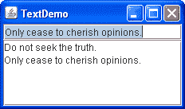

# 如何使用文本区域

> 原文：[`docs.oracle.com/javase/tutorial/uiswing/components/textarea.html`](https://docs.oracle.com/javase/tutorial/uiswing/components/textarea.html)

[`JTextArea`](https://docs.oracle.com/javase/8/docs/api/javax/swing/JTextArea.html)类提供了一个显示多行文本并允许用户编辑文本的组件。如果您只需要从用户那里获取一行输入，应该使用文本字段。如果您希望文本区域使用多种字体或其他样式显示其文本，应该使用编辑器窗格或文本窗格。如果显示的文本长度有限且用户永远不会编辑它，请使用标签。

教程的许多示例使用不可编辑的文本区域来显示程序输出。这里是一个名为`TextDemo`的示例的图片，它允许您使用文本字段（顶部）输入文本，然后将输入的文本附加到文本区域（底部）。



点击启动按钮以使用[Java™ Web Start](http://www.oracle.com/technetwork/java/javase/javawebstart/index.html)运行 TextDemo（[下载 JDK 7 或更高版本](http://www.oracle.com/technetwork/java/javase/downloads/index.html)）。或者，要自行编译和运行示例，请参考示例索引。


您可以在`TextDemo.java`中找到此程序的完整代码。以下代码创建并初始化了文本区域：

```java
textArea = new JTextArea(5, 20);
JScrollPane scrollPane = new JScrollPane(textArea); 
textArea.setEditable(false);

```

`JTextArea`构造函数的两个参数分别是文本区域应显示的行数和列数的提示。包含文本区域的滚动窗格在确定滚动窗格应有多大时会注意这些提示。

如果没有创建滚动窗格，文本区域将不会自动滚动。前面代码片段中显示的`JScrollPane`构造函数设置了文本区域在滚动窗格中的显示，并指定了在需要时滚动窗格的滚动条应该可见。如果需要更多信息，请参阅如何使用滚动窗格。

文本区域默认可编辑。代码`setEditable(false)`使文本区域不可编辑。它仍然可选择，用户可以从中复制数据，但用户不能直接更改文本区域的内容。

以下代码向文本区域添加文本。请注意，文本系统在内部使用'\n'字符表示换行；有关详细信息，请参阅[`DefaultEditorKit`](https://docs.oracle.com/javase/8/docs/api/javax/swing/text/DefaultEditorKit.html)的 API 文档。

```java
private final static String newline = "\n";
...
textArea.append(text + newline);

```

除非用户通过在文本区域中点击或拖动来移动插入点，否则文本区域会自动滚动，以便显示追加的文本。您可以通过将插入点移动到文本区域末尾来强制文本区域滚动到底部，方法是在调用`append`之后将插入点移动到文本区域末尾：

```java
textArea.setCaretPosition(textArea.getDocument().getLength());

```

## 自定义文本区域

您可以通过多种方式自定义文本区域。例如，尽管给定的文本区域只能显示一种字体和颜色的文本，但您可以设置它使用的字体和颜色。此自定义选项可在任何组件上执行。您还可以确定文本区域如何换行以及每个制表符的字符数。最后，您可以使用`JTextArea`类从`JTextComponent`类继承的方法来设置属性，如插入点、拖动支持或颜色选择。

下面的代码取自`TextSamplerDemo.java`，演示了如何初始化一个可编辑文本区域。文本区域使用指定的斜体字体，并在单词之间换行。

```java
JTextArea textArea = new JTextArea(
    "This is an editable JTextArea. " +
    "A text area is a \"plain\" text component, " +
    "which means that although it can display text " +
    "in any font, all of the text is in the same font."
);
textArea.setFont(new Font("Serif", Font.ITALIC, 16));
textArea.setLineWrap(true);
textArea.setWrapStyleWord(true);

```

默认情况下，文本区域不会自动换行显示过长的行。相反，它会将所有文本行放在一个行中，直到遇到换行符，并且如果文本区域位于滚动窗格中，则允许水平滚动。此示例通过调用`setLineWrap`方法打开了换行显示，并调用`setWrapStyleWord`方法指示文本区域应在单词边界而不是字符边界处换行。

为了提供滚动功能，示例将文本区域放在了一个滚动窗格中。

```java
JScrollPane areaScrollPane = new JScrollPane(textArea);
areaScrollPane.setVerticalScrollBarPolicy(
                JScrollPane.VERTICAL_SCROLLBAR_ALWAYS);
areaScrollPane.setPreferredSize(new Dimension(250, 250));

```

您可能已经注意到，在此示例中使用的`JTextArea`构造函数没有指定行数或列数。相反，代码通过设置滚动窗格的首选大小来限制文本区域的大小。

## 另一个示例：TextAreaDemo

`TextAreaDemo`示例介绍了一个带有特殊功能的可编辑文本区域——单词补全功能。当用户输入单词时，如果程序的词汇表中包含以已输入内容开头的单词，程序会提供补全提示。下面是`TextAreaDemo`应用程序的图片。


点击“启动”按钮以使用[Java™ Web Start](http://www.oracle.com/technetwork/java/javase/javawebstart/index.html)运行 TextAreaDemo（[下载 JDK 7 或更高版本](http://www.oracle.com/technetwork/java/javase/downloads/index.html)）。或者，要自行编译和运行示例，请参考示例索引。


您可以在`TextAreaDemo.java`中找到此程序的完整代码。

此示例为文本区域提供了默认滚动条策略的滚动功能。默认情况下，只有在显示区域完全填满文本且没有空间附加新单词时，垂直滚动条才会出现。您可以使用以下代码提供此类型的滚动窗格：

```java
  textArea.setWrapStyleWord(true);
  jScrollPane1 = new JScrollPane(textArea);

```

如上所述，文本区域是可编辑的。您可以通过键入和粘贴文本，或删除部分文本或整个内容来操作文本区域。还可以尝试使用文本区域内的标准键绑定来编辑文本。

现在探索单词完成功能是如何实现的。输入类似"Swing"或"special"的单词。一旦输入"sw"，程序会显示一个可能的完成"ing"，用浅蓝色突出显示。按 Enter 接受完成或继续输入。

以下代码向文本区域的文档添加了文档监听器：

```java
  textArea.getDocument().addDocumentListener(this);

```

当您开始输入单词时，`insertUpdate` 方法会检查程序的词汇表是否包含输入的前缀。一旦找到前缀的完成，对`invokeLater`方法的调用会提交一个任务以稍后更改文档。重要的是要记住，您不能在文档事件通知中修改文档，否则会出现异常。请查看下面的代码。

```java
String prefix = content.substring(w + 1).toLowerCase();
int n = Collections.binarySearch(words, prefix);
if (n < 0 && -n <= words.size()) {
    String match = words.get(-n - 1);
    if (match.startsWith(prefix)) {
        // A completion is found
        String completion = match.substring(pos - w);
        // We cannot modify Document from within notification,
        // so we submit a task that does the change later
        SwingUtilities.invokeLater(
            new CompletionTask(completion, pos + 1));
    }
} else {
    // Nothing found
    mode = Mode.INSERT;
}

```

粗体显示的代码演示了如何创建选择。光标首先设置在完整单词的末尾，然后移回到最后一个字符输入后的位置。`moveCaretPosition` 方法不仅将光标移动到新位置，还选择两个位置之间的文本。完成任务的代码如下所示：

```java
  private class CompletionTask implements Runnable {
        String completion;
        int position;

        CompletionTask(String completion, int position) {
            this.completion = completion;
            this.position = position;
        }

        public void run() {
            textArea.insert(completion, position);
            textArea.setCaretPosition(position + completion.length());
            textArea.moveCaretPosition(position);
            mode = Mode.COMPLETION;
        }
    }

```

## 文本区域 API

以下表格列出了常用的`JTextArea`构造函数和方法。您可能调用的其他方法在`JTextComponent`中定义，并在文本组件 API 中列出。

您还可以调用文本区域从其其他祖先继承的方法，例如`setPreferredSize`、`setForeground`、`setBackground`、`setFont`等。请参阅 The JComponent Class 以查看常用继承方法的表格。

使用文本区域的 API 包括以下类别：

+   设置或获取内容

+   微调外观

+   实现功能

设置或获取内容

| 方法或构造函数 | 目的 |
| --- | --- |

| [JTextArea()](https://docs.oracle.com/javase/8/docs/api/javax/swing/JTextArea.html#JTextArea--) [JTextArea(String)](https://docs.oracle.com/javase/8/docs/api/javax/swing/JTextArea.html#JTextArea-java.lang.String-)

[JTextArea(String, int, int)](https://docs.oracle.com/javase/8/docs/api/javax/swing/JTextArea.html#JTextArea-java.lang.String-int-int-)

[JTextArea(int, int)](https://docs.oracle.com/javase/8/docs/api/javax/swing/JTextArea.html#JTextArea-int-int-) | 创建文本区域。当存在时，`String`参数包含初始文本。`int`参数分别指定所需的列宽和行高。

| [void setText(String)](https://docs.oracle.com/javase/8/docs/api/javax/swing/text/JTextComponent.html#setText-java.lang.String-) [String getText()](https://docs.oracle.com/javase/8/docs/api/javax/swing/text/JTextComponent.html#getText--)

*(定义在`JTextComponent`中)* | 设置或获取文本区域显示的文本。

调整文本区域的外观

| 方法 | 目的 |
| --- | --- |

| [void setEditable(boolean)](https://docs.oracle.com/javase/8/docs/api/javax/swing/text/JTextComponent.html#setEditable-boolean-) [boolean isEditable()](https://docs.oracle.com/javase/8/docs/api/javax/swing/text/JTextComponent.html#isEditable--)

*(定义在`JTextComponent`中)* | 设置或指示用户是否可以编辑文本区域中的文本。

| [void setColumns(int);](https://docs.oracle.com/javase/8/docs/api/javax/swing/JTextArea.html#setColumns-int-) [int getColumns()](https://docs.oracle.com/javase/8/docs/api/javax/swing/JTextArea.html#getColumns--) | 设置或获取文本区域显示的列数。这实际上只是计算区域首选宽度的提示。 |
| --- | --- |
| [void setRows(int);](https://docs.oracle.com/javase/8/docs/api/javax/swing/JTextArea.html#setRows-int-) [int getRows()](https://docs.oracle.com/javase/8/docs/api/javax/swing/JTextArea.html#getRows--) | 设置或获取文本区域显示的行数。这是计算区域首选高度的提示。 |
| [int setTabSize(int)](https://docs.oracle.com/javase/8/docs/api/javax/swing/JTextArea.html#setTabSize-int-) | 设置制表符相当于的字符数。 |
| [int setLineWrap(boolean)](https://docs.oracle.com/javase/8/docs/api/javax/swing/JTextArea.html#setLineWrap-boolean-) | 设置是否在行过长无法适应分配的宽度时换行。默认情况下，此属性为 false，行不会换行。 |
| [int setWrapStyleWord(boolean)](https://docs.oracle.com/javase/8/docs/api/javax/swing/JTextArea.html#setWrapStyleWord-boolean-) | 设置行是否可以在空格（单词边界）或任何字符处换行。默认情况下，此属性为 false，行可以在任何字符处换行（如果打开了换行）。 |

实现文本区域的功能

| 方法 | 目的 |
| --- | --- |
| [void selectAll()](https://docs.oracle.com/javase/8/docs/api/javax/swing/text/JTextComponent.html#selectAll--) *(定义在`JTextComponent`中)* | 选择文本区域中的所有字符。 |
| [void append(String)](https://docs.oracle.com/javase/8/docs/api/javax/swing/JTextArea.html#append-java.lang.String-) | 将指定的文本添加到文本区域的末尾。 |
| [void insert(String, int)](https://docs.oracle.com/javase/8/docs/api/javax/swing/JTextArea.html#insert-java.lang.String-int-) | 在指定位置插入指定的文本。 |
| [void replaceRange(String, int, int)](https://docs.oracle.com/javase/8/docs/api/javax/swing/JTextArea.html#replaceRange-java.lang.String-int-int-) | 用指定的字符串替换指定位置之间的文本。 |

| [int getLineCount()](https://docs.oracle.com/javase/8/docs/api/javax/swing/JTextArea.html#getLineCount--) [int getLineOfOffset(int)](https://docs.oracle.com/javase/8/docs/api/javax/swing/JTextArea.html#getLineOfOffset-int-) 

[int getLineStartOffset(int)](https://docs.oracle.com/javase/8/docs/api/javax/swing/JTextArea.html#getLineStartOffset-int-) 

[int getLineEndOffset(int)](https://docs.oracle.com/javase/8/docs/api/javax/swing/JTextArea.html#getLineEndOffset-int-) | 用于查找行号或指定行的开头或结尾位置的实用程序。 |

## 使用文本区域的示例

这个表格列出了使用文本区域的示例，并指向这些示例的描述位置。

| 示例 | 描述位置 | 注释 |
| --- | --- | --- |
| 文本演示 | 本节 | 一个将用户输入的文本追加到文本区域的应用程序。 |
| 文本区域演示 | 本节 | 一个带有单词补全功能的文本区域的应用程序。 |
| 文本示例演示 | 使用文本组件 | 使用每个 Swing 文本组件中的一个。 |
| HTML 演示 | 如何在 Swing 组件中使用 HTML | 一个文本区域，允许用户输入 HTML 代码以在标签中显示。 |
| 基本拖放 | 拖放简介 | 演示了几个 Swing 组件的内置拖放功能，包括文本区域。 |
| 焦点概念演示 | 如何使用焦点子系统 | 演示了焦点如何使用几个包含文本区域的组件。 |
