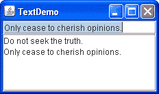
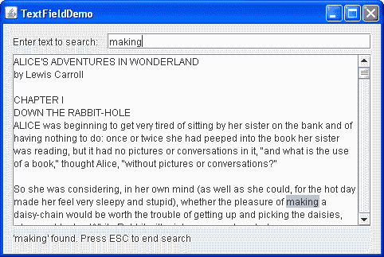

# 如何使用文本字段

> 原文：[`docs.oracle.com/javase/tutorial/uiswing/components/textfield.html`](https://docs.oracle.com/javase/tutorial/uiswing/components/textfield.html)

文本字段是一种基本的文本控件，允许用户输入少量文本。当用户指示输入文本完成（通常通过按 Enter 键），文本字段会触发一个 action event。如果您需要从用户获取多行输入，请使用文本区域。

Swing API 提供了几个类，用于包含文本字段的各种文本字段或包含文本字段的组件。

| [`JTextField`](https://docs.oracle.com/javase/8/docs/api/javax/swing/JTextField.html) | 本节内容涵盖：基本文本字段。 |
| --- | --- |
| `JFormattedTextField` | 允许您指定用户可以输入的合法字符集的`JTextField`子类。参见如何使用格式化文本字段。 |
| `JPasswordField` | 不显示用户输入的字符的`JTextField`子类。参见如何使用密码字段。 |
| `JComboBox` | 可编辑，并提供一个字符串菜单供选择。参见如何使用组合框。 |
| `JSpinner` | 将格式化文本字段与一对小按钮结合起来，使用户可以选择上一个或下一个可用值。参见如何使用微调器。 |

以下示例显示了一个基本文本字段和一个文本区域。文本字段可编辑，而文本区域不可编辑。当用户在文本字段中按 Enter 键时，程序将文本字段的内容复制到文本区域，并选择文本字段中的所有文本。



点击“启动”按钮以使用[Java™ Web Start](http://www.oracle.com/technetwork/java/javase/javawebstart/index.html)运行 TextDemo（[下载 JDK 7 或更高版本](http://www.oracle.com/technetwork/java/javase/downloads/index.html)）。或者，要自行编译和运行示例，请参考示例索引。


你可以在`TextDemo.java`中找到此程序的完整代码。以下代码创建并设置文本字段：

```java
textField = new JTextField(20);

```

传递给 `JTextField` 构造函数的整数参数，在示例中为 `20`，表示字段中的列数。此数字与字段当前字体提供的度量一起用于计算字段的首选宽度。它不限制用户可以输入的字符数。要实现这一点，你可以使用格式化文本字段或文档监听器，如文本组件功能中所述。

* * *

**注意：**

我们鼓励您为每个文本字段指定列数。如果不指定列数或首选大小，则字段的首选大小会随文本更改而更改，这可能导致不必要的布局更新。

* * *

下一行代码将一个 `TextDemo` 对象注册为文本字段的动作监听器。

```java
textField.addActionListener(this);

```

`actionPerformed` 方法处理文本字段的动作事件：

```java
private final static String newline = "\n";
...
public void actionPerformed(ActionEvent evt) {
    String text = textField.getText();
    textArea.append(text + newline);
    textField.selectAll();
}

```

注意使用 `JTextField` 的 `getText` 方法来检索当前文本字段中包含的文本。此方法返回的文本不包括触发动作事件的 Enter 键的换行符。

你已经看到了如何使用基本文本字段。因为 `JTextField` 类继承自 `JTextComponent` 类，文本字段非常灵活，几乎可以按照你喜欢的任何方式进行自定义。例如，你可以添加文档监听器或文档过滤器以在文本更改时收到通知，并在过滤器情况下相应地修改文本字段。有关文本组件的信息可以在文本组件功能中找到。但在自定义 `JTextField` 之前，请确保其他基于文本字段的组件中的一个不适合你的需求。

通常文本字段与描述文本字段的标签配对使用。请参阅使用文本字段的示例以获取有关创建这些配对的指导。

## 另一个示例：TextFieldDemo

`TextFieldDemo` 示例介绍了一个文本字段和一个文本区域。你可以在`TextFieldDemo.java`中找到此程序的完整代码。

当你在文本字段中输入字符时，程序会在文本区域中搜索输入的文本。如果找到该条目，则会进行高亮显示。如果程序未能找到该条目，则文本字段的背景变为粉色。文本区域下方的状态栏显示文本是否被找到。按下 Escape 键可开始新的搜索或完成当前搜索。这是 `TextFieldDemo` 应用程序的图片。



单击“启动”按钮以使用[Java™ Web Start](http://www.oracle.com/technetwork/java/javase/javawebstart/index.html)运行 TextFieldDemo（[下载 JDK 7 或更高版本](http://www.oracle.com/technetwork/java/javase/downloads/index.html)）。或者，要自行编译和运行示例，请参考示例索引。


为了突出显示文本，此示例使用了一个高亮器和一个绘制器。下面的代码创建并设置了文本区域的高亮器和绘制器。

```java
final Highlighter hilit;
final Highlighter.HighlightPainter painter;
...
hilit = new DefaultHighlighter();
painter = new DefaultHighlighter.DefaultHighlightPainter(HILIT_COLOR);
textArea.setHighlighter(hilit);

```

该代码向文本字段的文档添加了一个文档监听器。

```java
entry.getDocument().addDocumentListener(this);

```

文档监听器的 `insertUpdate` 和 `removeUpdate` 方法调用 `search` 方法，该方法不仅在文本区域中执行搜索，还处理高亮显示。以下代码突出显示找到的文本，将插入符设置为找到的匹配项的末尾，为文本字段设置默认背景，并在状态栏中显示消息。

```java
hilit.addHighlight(index, end, painter);
textArea.setCaretPosition(end);
entry.setBackground(entryBg);
message("'" + s + "' found. Press ESC to end search");

```

状态栏是一个 `JLabel` 对象。下面的代码展示了 `message` 方法的实现方式。

```java
private JLabel status;
...
void message(String msg) {
    status.setText(msg);
}

```

如果文本区域中没有匹配项，以下代码将更改文本字段的背景颜色为粉红色，并显示适当的信息消息。

```java
entry.setBackground(ERROR_COLOR);
message("'" + s + "' not found. Press ESC to start a new search");

```

`CancelAction` 类负责处理 Escape 键，如下所示。

```java
   class CancelAction extends AbstractAction {
       public void actionPerformed(ActionEvent ev) {
               hilit.removeAllHighlights();
               entry.setText("");
               entry.setBackground(entryBg);
           }
   }

```

## 文本字段 API

以下表格列出了常用的 `JTextField` 构造函数和方法。您可能会调用的其他方法在 `JTextComponent` 类中定义。请参阅 The Text Component API。

您还可以调用从文本字段的其他祖先继承的方法，例如 `setPreferredSize`、`setForeground`、`setBackground`、`setFont` 等。请参阅 The JComponent Class 以查看常用继承方法的表格。

使用文本字段的 API 分为以下几类：

+   设置或获取字段的内容

+   微调字段的外观

+   实现字段的功能

设置或获取字段的内容

| 方法或构造函数 | 目的 |
| --- | --- |

| [JTextField()](https://docs.oracle.com/javase/8/docs/api/javax/swing/JTextField.html#JTextField--) [JTextField(String)](https://docs.oracle.com/javase/8/docs/api/javax/swing/JTextField.html#JTextField-java.lang.String-)

[JTextField(String, int)](https://docs.oracle.com/javase/8/docs/api/javax/swing/JTextField.html#JTextField-java.lang.String-int-)

[JTextField(int)](https://docs.oracle.com/javase/8/docs/api/javax/swing/JTextField.html#JTextField-int-) | 创建一个文本字段。当存在时，`int` 参数指定了所需的列宽。`String` 参数包含字段的初始文本。 |

| [void setText(String)](https://docs.oracle.com/javase/8/docs/api/javax/swing/text/JTextComponent.html#setText-java.lang.String-) [String getText()](https://docs.oracle.com/javase/8/docs/api/javax/swing/text/JTextComponent.html#getText--) | 设置或获取文本字段显示的文本。 |

*(定义在`JTextComponent`中)* | 设置或获取文本字段显示的文本。 |

调整字段外观

| 方法 | 目的 |
| --- | --- |

| [void setEditable(boolean)](https://docs.oracle.com/javase/8/docs/api/javax/swing/text/JTextComponent.html#setEditable-boolean-) [boolean isEditable()](https://docs.oracle.com/javase/8/docs/api/javax/swing/text/JTextComponent.html#isEditable-boolean-) | 设置或指示用户是否可以编辑文本字段中的文本。 |

*(定义在`JTextComponent`中)* | 设置或指示用户是否可以编辑文本字段中的文本。 |

| [void setColumns(int);](https://docs.oracle.com/javase/8/docs/api/javax/swing/JTextField.html#setColumns-int-) [int getColumns()](https://docs.oracle.com/javase/8/docs/api/javax/swing/JTextField.html#getColumns--) | 设置或获取文本字段显示的列数。这实际上只是计算字段首选宽度的提示。 |
| --- | --- |
| [void setHorizontalAlignment(int);](https://docs.oracle.com/javase/8/docs/api/javax/swing/JTextField.html#setHorizontalAlignment-int-) [int getHorizontalAlignment()](https://docs.oracle.com/javase/8/docs/api/javax/swing/JTextField.html#getHorizontalAlignment--) | 设置或获取文本在其区域内水平对齐的方式。您可以使用`JTextField.LEADING`、`JTextField.CENTER`和`JTextField.TRAILING`作为参数。 |

实现字段功能

| 方法 | 目的 |
| --- | --- |
| [void addActionListener(ActionListener)](https://docs.oracle.com/javase/8/docs/api/javax/swing/JTextField.html#addActionListener-java.awt.event.ActionListener-) [void removeActionListener(ActionListener)](https://docs.oracle.com/javase/8/docs/api/javax/swing/JTextField.html#removeActionListener-java.awt.event.ActionListener-) | 添加或移除一个动作监听器。 |
| [void selectAll()](https://docs.oracle.com/javase/8/docs/api/javax/swing/text/JTextComponent.html#selectAll--) *(定义在`JTextComponent`中)* | 选择文本字段中的所有字符。 |

## 使用文本字段的示例

本表显示了一些使用文本字段的示例，并指向这些示例的描述位置。有关所有文本字段类型中类似的代码示例，例如处理布局，请查看相关组件的示例列表，如格式化文本字段和微调器。

| 示例 | 描述位置 | 注释 |
| --- | --- | --- |
| 文本演示 | 本节 | 使用基本文本字段和动作监听器的应用程序。 |
| 文本字段演示 | 本节 | 使用文本字段和文本区域的应用程序。在文本区域中搜索以从文本字段中找到条目。 |
| 对话框演示 | 如何制作对话框 | `CustomDialog.java` 包含一个检查数值的文本字段。您可以通过点击“更多对话框”选项卡，选择“输入验证对话框”选项，然后点击“显示！”按钮来弹出对话框。 |

| 文本示例演示 | 使用文本组件 | 使用`GridBagLayout`和一个便利方法来布局标签-文本字段对：

```java
addLabelTextRows(JLabel[] *labels*,
                 JTextField[] *textFields*,
                 GridBagLayout *gridbag*,
                 Container *container*)

```

|

| 文本输入演示 | 如何使用格式化文本字段 | 使用`SpringLayout`和`SpringUtilities`便利方法来布局标签-文本字段对：

```java
makeCompactGrid(Container *parent*,
                int *rows*, int *cols*,
                int *initialX*, int *initialY*,
                int *xPad*, int *yPad*)

```

|

如果您在 JavaFX 中编程，请参阅[文本字段](https://docs.oracle.com/javase/8/javafx/user-interface-tutorial/text-field.htm)。
