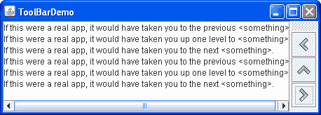
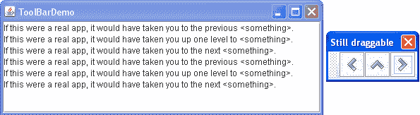
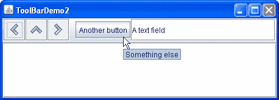

# 如何使用工具栏

> 原文：[`docs.oracle.com/javase/tutorial/uiswing/components/toolbar.html`](https://docs.oracle.com/javase/tutorial/uiswing/components/toolbar.html)

[`JToolBar`](https://docs.oracle.com/javase/8/docs/api/javax/swing/JToolBar.html)是一个容器，将多个组件（通常是带有图标的按钮）分组为一行或一列。通常，工具栏提供了访问菜单中同样功能的便捷方式。如何使用操作描述了如何在菜单项和工具栏按钮中提供相同的功能。

以下图片显示了一个名为`ToolBarDemo`的应用程序，其中包含一个位于文本区域上方的工具栏。点击“启动”按钮以使用[Java™ Web Start](http://www.oracle.com/technetwork/java/javase/javawebstart/index.html)运行 ToolBarDemo（[下载 JDK 7 或更高版本](http://www.oracle.com/technetwork/java/javase/downloads/index.html)）。或者，要自行编译和运行，请参考示例索引。


默认情况下，用户可以将工具栏拖动到容器的另一边缘或拖出到自己的窗口。下图显示了用户将工具栏拖动到容器右边缘后应用程序的外观。



要使拖动行为正常工作，工具栏必须位于使用`BorderLayout`布局管理器的容器中。工具栏影响的组件通常位于容器的中心。工具栏必须是容器中唯一的其他组件，并且不能位于中心。

下图显示了用户将工具栏拖出窗口后应用程序的外观。



以下代码创建了工具栏并将其添加到容器中。您可以在`ToolBarDemo.java`中找到整个程序。

```java
public class ToolBarDemo extends JPanel
                         implements ActionListener {
    ...
    public ToolBarDemo() {
        super(new BorderLayout());
        ...
        JToolBar toolBar = new JToolBar("Still draggable");
        addButtons(toolBar);
        ...
        setPreferredSize(new Dimension(450, 130));
        add(toolBar, BorderLayout.PAGE_START);
        add(scrollPane, BorderLayout.CENTER);
    }
    ...
}

```

此代码通过将两个组件放置在由边界布局控制的面板中，将工具栏放置在`PAGE_START`位置，滚动窗格放置在`CENTER`位置，将工具栏定位在滚动窗格上方。由于滚动窗格位于中心，容器中除了工具栏之外没有其他组件，默认情况下工具栏可以被拖动到容器的其他边缘。工具栏也可以被拖动到自己的窗口中，此时窗口的标题为“仍可拖动”，由`JToolBar`构造函数指定。

## 创建工具栏按钮

工具栏中的按钮是普通的`JButton`实例，使用了来自 Java 外观和感觉图形存储库的图像。如果您的工具栏具有 Java 外观和感觉，请使用[Java 外观和感觉图形存储库](http://www.oracle.com/technetwork/java/index-138612.html)中的图像。

这是创建按钮并将其添加到工具栏的代码。

```java
protected void addButtons(JToolBar toolBar) {
    JButton button = null;

    //first button
    button = makeNavigationButton("Back24", PREVIOUS,
                                  "Back to previous something-or-other",
                                  "Previous");
    toolBar.add(button);

    //second button
    button = makeNavigationButton("Up24", UP,
                                  "Up to something-or-other",
                                  "Up");
    toolBar.add(button);

    *...//similar code for creating and adding the third button...*
}

protected JButton makeNavigationButton(String imageName,
                                       String actionCommand,
                                       String toolTipText,
                                       String altText) {
    //Look for the image.
    String imgLocation = "images/"
                         + imageName
                         + ".gif";
    URL imageURL = ToolBarDemo.class.getResource(imgLocation);

    //Create and initialize the button.
    JButton button = new JButton();
    button.setActionCommand(actionCommand);
    button.setToolTipText(toolTipText);
    button.addActionListener(this);

    if (imageURL != null) {                      //image found
        button.setIcon(new ImageIcon(imageURL, altText));
    } else {                                     //no image found
        button.setText(altText);
        System.err.println("Resource not found: " + imgLocation);
    }

    return button;
}

```

第一次调用`makeNavigationButton`创建了第一个按钮的图像，使用了图形存储库中的 24x24“返回”导航图像。

除了找到按钮的图像之外，`makeNavigationButton`方法还创建按钮，设置其动作命令和工具提示文本的字符串，并为按钮添加动作监听器。如果图像丢失，该方法会打印错误消息并向按钮添加文本，以便按钮仍然可用。

* * *

**注意：**

如果工具栏中的任何按钮重复了其他组件（如菜单项）的功能，您可能应该按照如何使用操作中描述的方式创建并添加工具栏按钮。

* * *

## 自定义工具栏

通过向上述示例添加几行代码，我们可以展示一些更多的工具栏功能：

+   使用`setFloatable(false)`使工具栏无法移动。

+   使用`setRollover(true)`在用户用光标悬停在工具栏按钮上时视觉指示。

+   向工具栏添加分隔符。

+   向工具栏添加非按钮组件。

您可以通过运行 ToolBarDemo2 来查看这些功能。单击“启动”按钮以使用[Java™ Web Start](http://www.oracle.com/technetwork/java/javase/javawebstart/index.html)运行 ToolBarDemo2（[下载 JDK 7 或更高版本](http://www.oracle.com/technetwork/java/javase/downloads/index.html)）。或者，要自行编译和运行，请参考示例索引。


您可以在`ToolBarDemo2.java`中找到此程序的完整代码。下面您可以看到使用这些自定义功能的新 UI 的图片。



因为工具栏不再可以被拖动，所以它的左边缘不再有凸起。以下是关闭拖动的代码：

```java
toolBar.setFloatable(false);

```

工具栏处于悬停模式，因此光标下的按钮有视觉指示。视觉指示的类型取决于外观和感觉。例如，Metal 外观和感觉使用渐变效果来指示光标下的按钮，而其他类型的外观和感觉使用边框来实现此目的。以下是设置悬停模式的代码：

```java
toolBar.setRollover(true);

```

上面示例中的另一个明显区别是工具栏包含两个新组件，这些组件之前有一个称为分隔符的空格。这是添加分隔符的代码：

```java
toolBar.addSeparator();

```

这是添加新组件的代码：

```java
//fourth button
button = new JButton("Another button");
...
toolBar.add(button);

//fifth component is NOT a button!
JTextField textField = new JTextField("A text field");
...
toolBar.add(textField);

```

通过调用`setAlignmentY`方法，您可以轻松地使工具栏组件顶部对齐或底部对齐，而不是居中。例如，要使工具栏中所有组件的顶部对齐，请在每个组件上调用`setAlignmentY(TOP_ALIGNMENT)`。类似地，您可以使用`setAlignmentX`方法在工具栏垂直时指定组件的对齐方式。这种布局灵活性是可能的，因为工具栏使用`BoxLayout`来定位它们的组件。有关更多信息，请参阅如何使用 BoxLayout。

## 工具栏 API

以下表格列出了常用的[`JToolBar`](https://docs.oracle.com/javase/8/docs/api/javax/swing/JToolBar.html)构造函数和方法。您可能调用的其他方法在 The JComponent Class 中的 API 表中列出。

| 方法或构造函数 | 目的 |
| --- | --- |

| [JToolBar()](https://docs.oracle.com/javase/8/docs/api/javax/swing/JToolBar.html#JToolBar--) [JToolBar(int)](https://docs.oracle.com/javase/8/docs/api/javax/swing/JToolBar.html#JToolBar-int-)

[JToolBar(String)](https://docs.oracle.com/javase/8/docs/api/javax/swing/JToolBar.html#JToolBar-java.lang.String-)

[JToolBar(String, int)](https://docs.oracle.com/javase/8/docs/api/javax/swing/JToolBar.html#JToolBar-java.lang.String-int-) | 创建一个工具栏。可选的 int 参数允许您指定方向；默认为`HORIZONTAL`。可选的`String`参数允许您指定工具栏窗口的标题，如果它被拖到容器外部。|

| [Component add(Component)](https://docs.oracle.com/javase/8/docs/api/java/awt/Container.html#add-java.awt.Component-) | 将组件添加到工具栏。您可以使用`AbstractButton`定义的`setAction(Action)`方法将按钮与`Action`关联起来。 |
| --- | --- |
| [void addSeparator()](https://docs.oracle.com/javase/8/docs/api/javax/swing/JToolBar.html#addSeparator--) | 在工具栏末尾添加一个分隔符。 |
| [void setFloatable(boolean)](https://docs.oracle.com/javase/8/docs/api/javax/swing/JToolBar.html#setFloatable-boolean-) [boolean isFloatable()](https://docs.oracle.com/javase/8/docs/api/javax/swing/JToolBar.html#isFloatable--) | 浮动属性默认为 true，表示用户可以将工具栏拖出到单独的窗口中。要禁用工具栏拖动，请使用`toolBar.setFloatable(false)`。某些外观和感觉类型可能会忽略此属性。 |
| [void setRollover(boolean)](https://docs.oracle.com/javase/8/docs/api/javax/swing/JToolBar.html#setRollover-boolean-) [boolean isRollover()](https://docs.oracle.com/javase/8/docs/api/javax/swing/JToolBar.html#isRollover--) | 默认情况下，rollover 属性为 false。要使工具栏按钮在用户用光标悬停在其上时以视觉方式指示，将此属性设置为 true。某些外观可能会忽略此属性。 |

## 使用工具栏的示例

此表列出使用 `JToolBar` 的示例，并指向这些示例所描述的位置。

| 示例 | 描述位置 | 备注 |
| --- | --- | --- |
| `ToolBarDemo` | 本页 | 一个只有图标按钮的基本工具栏。 |
| `ToolBarDemo2` | 本页 | 演示了一个非浮动工具栏处于 rollover 模式，其中包含一个分隔符和一个非按钮组件。 |
| `ActionDemo` | 如何使用 Actions | 使用 `Action` 对象实现工具栏。 |
