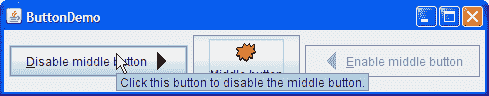

# 如何使用工具提示

> 原文：[`docs.oracle.com/javase/tutorial/uiswing/components/tooltip.html`](https://docs.oracle.com/javase/tutorial/uiswing/components/tooltip.html)

为任何`JComponent`对象创建工具提示很容易。使用`setToolTipText`方法为组件设置工具提示。例如，要向三个按钮添加工具提示，只需添加三行代码：

```java
b1.setToolTipText("Click this button to disable the middle button.");
b2.setToolTipText("This middle button does not react when you click it.");
b3.setToolTipText("Click this button to enable the middle button.");

```

当程序的用户将光标暂停在程序的任何按钮上时，按钮的工具提示将出现。您可以通过运行`ButtonDemo`示例来查看这一点，该示例在如何使用按钮、复选框和单选按钮中有解释。这是当光标暂停在`ButtonDemo`示例中的左按钮上时出现的工具提示的图片。



对于诸如选项卡窗格之类具有多个部分的组件，通常可以根据光标下的组件部分变化工具提示文本以反映该部分。例如，选项卡窗格可以使用此功能来解释当单击光标下的选项卡时会发生什么。当您实现选项卡窗格时，可以在传递给`addTab`或`setToolTipTextAt`方法的参数中指定特定于选项卡的工具提示文本。

即使在没有用于设置特定部分工具提示文本的 API 的组件中，您通常也可以自行完成工作。如果组件支持渲染器，则可以在自定义渲染器上设置工具提示文本。表格和树部分提供了由自定义渲染器确定的工具提示文本示例。适用于所有`JComponent`的另一种方法是创建组件的子类并覆盖其`getToolTipText(MouseEvent)`方法。

## 工具提示 API

大多数用于设置工具提示所需的 API 属于`JComponent`类，并且因此被大多数 Swing 组件继承。更多工具提示 API 可在诸如`JTabbedPane`之类的单独类中找到。一般来说，这些 API 足以指定和显示工具提示；通常不需要直接处理实现类[`JToolTip`](https://docs.oracle.com/javase/8/docs/api/javax/swing/JToolTip.html)和[`ToolTipManager`](https://docs.oracle.com/javase/8/docs/api/javax/swing/ToolTipManager.html)。

以下表格列出了`JComponent`类中的工具提示 API。有关各个组件对工具提示的支持信息，请参阅相关组件的操作指南部分。

`JComponent`类中的工具提示 API

| 方法 | 目的 |
| --- | --- |
| [setToolTipText(String)](https://docs.oracle.com/javase/8/docs/api/javax/swing/JComponent.html#setToolTipText-java.lang.String-) | 如果指定的字符串不为 null，则此方法将注册组件具有工具提示，并在显示时为工具提示提供指定的文本。如果参数为 null，则此方法将关闭此组件的工具提示。 |
| [String getToolTipText()](https://docs.oracle.com/javase/8/docs/api/javax/swing/JComponent.html#getToolTipText--) | 返回先前使用`setToolTipText`指定的字符串。 |
| [String getToolTipText(MouseEvent)](https://docs.oracle.com/javase/8/docs/api/javax/swing/JComponent.html#getToolTipText-java.awt.event.MouseEvent-) | 默认情况下，返回与`getToolTipText()`返回的相同值。多部分组件如`JTabbedPane`、`JTable`和`JTree`会重写此方法以返回与鼠标事件位置相关联的字符串。例如，选项卡窗格中的每个选项卡可以有不同的工具提示文本。 |
| [获取工具提示位置(MouseEvent)](https://docs.oracle.com/javase/8/docs/api/javax/swing/JComponent.html#getToolTipLocation-java.awt.event.MouseEvent-) | 返回组件工具提示的左上角出现的位置（在接收组件的坐标系中）。参数是导致工具提示显示的事件。默认返回值为 null，告诉 Swing 系统选择一个位置。 |

## 使用工具提示的示例

此表列出了一些使用工具提示的示例，并指向这些示例的描述位置。

| 示例 | 描述位置 | 注意事项 |
| --- | --- | --- |
| `ButtonDemo` | 本节和如何使用按钮、复选框和单选按钮 | 使用工具提示为按钮提供说明。 |
| `IconDemo` | 如何使用图标 | 在标签中使用工具提示提供图像的名称和大小信息。 |
| `TabbedPaneDemo` | 如何使用选项卡窗格 | 使用在`addTab`方法的参数中指定的选项卡特定工具提示文本。 |
| `TableRenderDemo` | 为单元格指定工具提示 | 使用渲染器为表添加工具提示。 |
| `TableToolTipsDemo` | 为单元格指定工具提示, 为列标题指定工具提示 | 使用各种技术为表添加工具提示。 |
| `TreeIconDemo2` | 自定义树的显示 | 使用自定义渲染器为树添加工具提示。 |
| `ActionDemo` | 如何使用操作 | 为使用`Action`创建的按钮添加工具提示。 |
