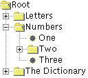
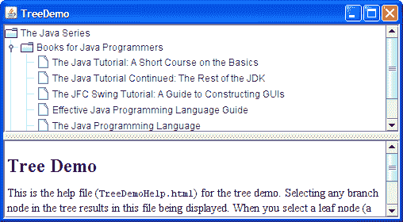
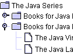
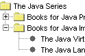
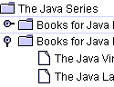
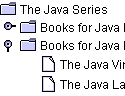
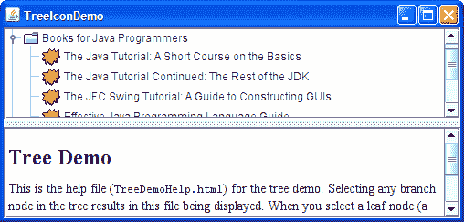
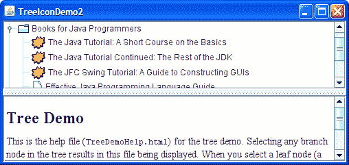
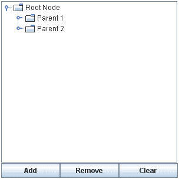
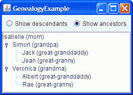

# 如何使用树

> 原文：[`docs.oracle.com/javase/tutorial/uiswing/components/tree.html`](https://docs.oracle.com/javase/tutorial/uiswing/components/tree.html)

使用[`JTree`](https://docs.oracle.com/javase/8/docs/api/javax/swing/JTree.html)类，您可以显示分层数据。`JTree`对象实际上不包含您的数据；它只是提供数据的视图。以下是一棵树的图片：



如前图所示，`JTree`垂直显示其数据。树显示的每一行都包含一个数据项，称为*节点*。每棵树都有一个*根*节点，所有节点都是从根节点派生的。默认情况下，树显示根节点，但您可以另行规定。节点可以有子节点，也可以没有。我们将可以有子节点的节点 — 无论它们当前是否*有*子节点 — 称为*分支*节点。不能有子节点的节点称为*叶*节点。

分支节点可以有任意数量的子节点。通常，用户可以通过单击来展开和折叠分支节点 — 使其子节点可见或不可见。默认情况下，除了根节点外，所有分支节点都是折叠的。程序可以通过监听树展开或树将展开事件来检测分支节点展开状态的变化，如如何编写树展开监听器和如何编写树将展开监听器中所述。

树中的特定节点可以通过 TreePath 标识，TreePath 是一个封装节点及其所有祖先的对象，或者通过其显示行标识，其中显示区域中的每一行显示一个节点。

+   展开的节点是一个非叶节点，当其所有祖先都展开时，将显示其子节点。

+   折叠的节点是隐藏的节点。

+   隐藏的节点是位于折叠祖先下的节点。

本节的其余部分讨论以下主题：

+   创建一棵树

+   响应节点选择

+   自定义树的显示

+   动态更改树

+   创建数据模型

+   树 API

+   使用树的示例

## 创建一棵树

这是一个应用程序的图片，其顶部显示了一个在滚动窗格中的树。



* * *

**试一试：**

1.  点击“启动”按钮以使用 [Java™ Web Start](http://www.oracle.com/technetwork/java/javase/javawebstart/index.html) 运行树演示（[下载 JDK 7 或更高版本](http://www.oracle.com/technetwork/java/javase/downloads/index.html)）。或者，要自行编译和运行示例，请参考示例索引。

1.  展开一个或多个节点。

    通过点击项目左侧的圆圈来执行此操作。

1.  折叠一个节点。

    通过点击已展开节点左侧的圆圈来执行此操作。

* * *

下面的代码取自 `TreeDemo.java`，创建了 `JTree` 对象并将其放入滚动窗格中：

```java
*//Where instance variables are declared:*
private JTree tree;
...
public TreeDemo() {
    ...
    DefaultMutableTreeNode top =
        new DefaultMutableTreeNode("The Java Series");
    createNodes(top);
    tree = new JTree(top);
    ...
    JScrollPane treeView = new JScrollPane(tree);
    ...
}

```

代码创建了一个 [`DefaultMutableTreeNode`](https://docs.oracle.com/javase/8/docs/api/javax/swing/tree/DefaultMutableTreeNode.html) 的实例作为树的根节点。然后创建树中的其余节点。之后，创建树，将根节点作为参数传递给 `JTree` 构造函数。最后，将树放入滚动窗格中，这是一个常见的策略，因为显示完整展开的树会占用太多空间。

这是创建根节点下节点的代码：

```java
private void createNodes(DefaultMutableTreeNode top) {
    DefaultMutableTreeNode category = null;
    DefaultMutableTreeNode book = null;

    category = new DefaultMutableTreeNode("Books for Java Programmers");
    top.add(category);

    //original Tutorial
    book = new DefaultMutableTreeNode(new BookInfo
        ("The Java Tutorial: A Short Course on the Basics",
        "tutorial.html"));
    category.add(book);

    //Tutorial Continued
    book = new DefaultMutableTreeNode(new BookInfo
        ("The Java Tutorial Continued: The Rest of the JDK",
        "tutorialcont.html"));
    category.add(book);

    //Swing Tutorial
    book = new DefaultMutableTreeNode(new BookInfo
        ("The Swing Tutorial: A Guide to Constructing GUIs",
        "swingtutorial.html"));
    category.add(book);

    *//...add more books for programmers...*

    category = new DefaultMutableTreeNode("Books for Java Implementers");
    top.add(category);

    //VM
    book = new DefaultMutableTreeNode(new BookInfo
        ("The Java Virtual Machine Specification",
         "vm.html"));
    category.add(book);

    //Language Spec
    book = new DefaultMutableTreeNode(new BookInfo
        ("The Java Language Specification",
         "jls.html"));
    category.add(book);
}

```

`DefaultMutableTreeNode` 构造函数的参数是*用户对象*，它是一个包含或指向与树节点关联数据的对象。用户对象可以是一个字符串，也可以是一个自定义对象。如果你实现了一个自定义对象，你应该实现它的 `toString` 方法，以便返回要为该节点显示的字符串。JTree 默认使用从 `toString` 返回的值来渲染每个节点，因此 `toString` 返回有意义的内容很重要。有时，重写 `toString` 是不可行的；在这种情况下，你可以重写 JTree 的 `convertValueToText` 方法，将模型中的对象映射为要显示的字符串。

例如，前面代码片段中使用的 `BookInfo` 类是一个自定义类，保存了两个数据：一本书的名称和描述该书的 HTML 文件的 URL。`toString` 方法被实现为返回书名。因此，与 `BookInfo` 对象关联的每个节点显示一个书名。

* * *

**注意：** 你可以通过在节点的字符串中放置 HTML 标签来指定树节点中的文本格式。有关详细信息，请参阅在 Swing 组件中使用 HTML。

* * *

总结一下，您可以通过调用`JTree`构造函数来创建一棵树，指定实现 TreeNode 的类作为参数。您可能应该将树放在滚动窗格中，以便树不会占用太多空间。您不必做任何事情来使树节点在用户点击时展开和折叠。但是，您必须添加一些代码，以使树在用户选择节点时做出响应 — 例如，通过点击节点。

## 响应节点选择

响应树节点选择很简单。您实现一个树选择监听器并在树上注册它。以下代码显示了`TreeDemo`程序中与选择相关的代码：

```java
*//Where the tree is initialized:*
    tree.getSelectionModel().setSelectionMode
            (TreeSelectionModel.SINGLE_TREE_SELECTION);

    //Listen for when the selection changes.
    tree.addTreeSelectionListener(this);
...
public void valueChanged(TreeSelectionEvent e) {
*//Returns the last path element of the selection.*
*//This method is useful only when the selection model allows a single selection.*
    DefaultMutableTreeNode node = (DefaultMutableTreeNode)
                       tree.getLastSelectedPathComponent();

    if (node == null)
    *//Nothing is selected.*     
    return;

    Object nodeInfo = node.getUserObject();
    if (node.isLeaf()) {
        BookInfo book = (BookInfo)nodeInfo;
        displayURL(book.bookURL);
    } else {
        displayURL(helpURL); 
    }
}

```

前面的代码执行以下任务：

+   获取树的默认[`TreeSelectionModel`](https://docs.oracle.com/javase/8/docs/api/javax/swing/tree/TreeSelectionModel.html)，然后设置它，以便一次最多只能选择一个树节点。

+   在树上注册一个事件处理程序。事件处理程序是一个实现[`TreeSelectionListener`](https://docs.oracle.com/javase/8/docs/api/javax/swing/event/TreeSelectionListener.html)接口的对象。

+   在事件处理程序中，通过调用树的`getLastSelectedPathComponent`方法确定哪个节点被选中。

+   使用`getUserObject`方法获取与节点关联的数据。

有关处理树选择事件的更多详细信息，请参见如何编写树选择监听器。

## 自定义树的显示

这里是一些树节点的图片，由 Java、Windows 和 Mac OS 外观实现绘制。

|  |  |  |
| --- | --- | --- |
| Java 外观 | Windows 外观 | Mac OS 外观 |

如前面的图所示，树通常为每个节点显示一个图标和一些文本。您可以自定义这些内容，我们将很快展示。

一棵树通常还会执行一些特定外观的绘制，以指示节点之间的关系。您可以以有限的方式自定义这种绘制。首先，您可以使用`tree.setRootVisible(true)`来显示根节点，或者使用`tree.setRootVisible(false)`来隐藏它。其次，您可以使用`tree.setShowsRootHandles(true)`来请求树的顶层节点 — 根节点（如果可见）或其子节点（如果不可见） — 具有可展开或折叠的手柄。

如果你正在使用 Java 外观，你可以自定义是否绘制线条以显示树节点之间的关系。默认情况下，Java 外观在节点之间绘制倾斜线。通过设置树的`JTree.lineStyle`客户端属性，你可以指定不同的约定。例如，要请求 Java 外观仅使用水平线来分组节点，请使用以下代码：

```java
tree.putClientProperty("JTree.lineStyle", "Horizontal");

```

要指定 Java 外观不绘制线条，请使用以下代码：

```java
tree.putClientProperty("JTree.lineStyle", "None");

```

以下快照显示了在使用 Java 外观时设置`JTree.lineStyle`属性的结果。

|  |  |  |
| --- | --- | --- |
| `"倾斜"`（默认） | `"水平"` | `"无"` |

无论外观如何，节点显示的默认图标是由节点是否为叶子以及如果不是叶子，则是否展开决定的。例如，在 Windows 和 Motif 外观实现中，每个叶子节点的默认图标是一个点；在 Java 外观中，默认叶子图标是一个类似纸张的符号。在我们展示的所有外观实现中，分支节点都用类似文件夹的符号标记。一些外观可能对展开的分支和折叠的分支有不同的图标。

你可以轻松更改用于叶子节点、展开的分支节点或折叠的分支节点的默认图标。要做到这一点，首先创建一个[`DefaultTreeCellRenderer`](https://docs.oracle.com/javase/8/docs/api/javax/swing/tree/DefaultTreeCellRenderer.html)的实例。你总是可以从头开始创建自己的 TreeCellRenderer 实现，重用你喜欢的任何组件。接下来，通过调用渲染器上的以下一个或多个方法来指定要使用的图标：`setLeafIcon`（用于叶子节点）、`setOpenIcon`（用于展开的分支节点）、`setClosedIcon`（用于折叠的分支节点）。如果你希望树不显示某种类型节点的图标，那么为图标指定`null`。设置好图标后，使用树的`setCellRenderer`方法指定`DefaultTreeCellRenderer`绘制其节点。以下是一个示例，取自`TreeIconDemo.java`：

```java
ImageIcon leafIcon = createImageIcon("images/middle.gif");
if (leafIcon != null) {
    DefaultTreeCellRenderer renderer = 
        new DefaultTreeCellRenderer();
    renderer.setLeafIcon(leafIcon);
    tree.setCellRenderer(renderer);
}

```

这是 TreeIconDemo 的屏幕截图：



* * *

**试一试：**

+   点击“启动”按钮以使用[Java™ Web Start](http://www.oracle.com/technetwork/java/javase/javawebstart/index.html)运行 TreeIconDemo（[下载 JDK 7 或更高版本](http://www.oracle.com/technetwork/java/javase/downloads/index.html)）。或者，要自行编译和运行示例，请参考示例索引。

* * *

如果要更精细地控制节点图标或提供工具提示，可以通过创建`DefaultTreeCellRenderer`的子类并重写`getTreeCellRendererComponent`方法来实现。因为`DefaultTreeCellRenderer`是`JLabel`的子类，可以使用任何`JLabel`方法 — 例如`setIcon` — 来自定义`DefaultTreeCellRenderer`。

下面的代码来自`TreeIconDemo2.java`，创建了一个单元格渲染器，根据节点文本数据中是否包含“教程”一词来变化叶图标。该渲染器也指定了工具提示文本，如粗体行所示。

* * *

**试试这个：**

+   点击“启动”按钮以使用[Java™ Web Start](http://www.oracle.com/technetwork/java/javase/javawebstart/index.html)运行 TreeIconDemo2（[下载 JDK 7 或更高版本](http://www.oracle.com/technetwork/java/javase/downloads/index.html)）。或者，要自行编译和运行示例，请参考示例索引。

* * *

```java
*//...where the tree is initialized:*
    //Enable tool tips.
    ToolTipManager.sharedInstance().registerComponent(tree);

    ImageIcon tutorialIcon = createImageIcon("images/middle.gif");
    if (tutorialIcon != null) {
        tree.setCellRenderer(new MyRenderer(tutorialIcon));
    }
...
class MyRenderer extends DefaultTreeCellRenderer {
    Icon tutorialIcon;

    public MyRenderer(Icon icon) {
        tutorialIcon = icon;
    }

    public Component getTreeCellRendererComponent(
                        JTree tree,
                        Object value,
                        boolean sel,
                        boolean expanded,
                        boolean leaf,
                        int row,
                        boolean hasFocus) {

        super.getTreeCellRendererComponent(
                        tree, value, sel,
                        expanded, leaf, row,
                        hasFocus);
        if (leaf && isTutorialBook(value)) {
            setIcon(tutorialIcon);
            setToolTipText("This book is in the Tutorial series.");
        } else {
            setToolTipText(null); //no tool tip
        } 

        return this;
    }

    protected boolean isTutorialBook(Object value) {
        DefaultMutableTreeNode node =
                (DefaultMutableTreeNode)value;
        BookInfo nodeInfo =
                (BookInfo)(node.getUserObject());
        String title = nodeInfo.bookName;
        if (title.indexOf("Tutorial") >= 0) {
            return true;
        }

        return false;
    }
}

```

这是结果：



您可能想知道单元格渲染器是如何工作的。当树绘制每个节点时，`JTree`及其外观特定实现实际上都不包含绘制节点的代码。相反，树使用单元格渲染器的绘制代码来绘制节点。例如，要绘制一个具有字符串“Java 编程语言”的叶节点，树会要求其单元格渲染器返回一个可以绘制带有该字符串的叶节点的组件。如果单元格渲染器是`DefaultTreeCellRenderer`，那么它会返回一个标签，该标签绘制默认叶图标，然后是字符串。

单元格渲染器只负责绘制；它无法处理事件。如果要向树添加事件处理程序，需要在树或者仅在选择节点时发生处理时在树的*单元格编辑器*上注册处理程序。有关单元格编辑器的信息，请参阅概念：编辑器和渲染器。该部分讨论了类似于树单元格编辑器和渲染器的表单元格编辑器和渲染器。

## 动态更改树

以下图显示了一个名为 DynamicTreeDemo 的应用程序，允许您向可见树添加节点并删除节点。您还可以编辑每个节点中的文本。



该应用程序基于教程读者 Richard Stanford 提供的示例。

* * *

**试试这个：**

+   点击“启动”按钮以使用[Java™ Web Start](http://www.oracle.com/technetwork/java/javase/javawebstart/index.html)运行 DynamicTreeDemo（[下载 JDK 7 或更高版本](http://www.oracle.com/technetwork/java/javase/downloads/index.html)）。或者，要自行编译和运行示例，请参考示例索引。

* * *

这是初始化树的代码：

```java
rootNode = new DefaultMutableTreeNode("Root Node");
treeModel = new DefaultTreeModel(rootNode);
treeModel.addTreeModelListener(new MyTreeModelListener());

tree = new JTree(treeModel);
tree.setEditable(true);
tree.getSelectionModel().setSelectionMode
        (TreeSelectionModel.SINGLE_TREE_SELECTION);
tree.setShowsRootHandles(true);

```

通过显式创建树的模型，代码确保树的模型是[`DefaultTreeModel`](https://docs.oracle.com/javase/8/docs/api/javax/swing/tree/DefaultTreeModel.html)的一个实例。这样，我们知道树模型支持的所有方法。例如，我们知道可以调用模型的`insertNodeInto`方法，即使该方法不是`TreeModel`接口所必需的。

要使树节点中的文本可编辑，我们在树上调用`setEditable(true)`。当用户完成编辑节点时，模型会生成一个树模型事件，告诉任何监听器，包括`JTree`，树节点已更改。请注意，虽然`DefaultMutableTreeNode`有用于更改节点内容的方法，但更改应通过`DefaultTreeModel`的封装方法进行。否则，将不会生成树模型事件，监听器如树也不会知道更新。

要通知节点更改，我们可以实现一个[`TreeModelListener`](https://docs.oracle.com/javase/8/docs/api/javax/swing/event/TreeModelListener.html)。以下是一个检测用户何时为树节点键入新名称的树模型监听器示例：

```java
class MyTreeModelListener implements TreeModelListener {
    public void treeNodesChanged(TreeModelEvent e) {
        DefaultMutableTreeNode node;
        node = (DefaultMutableTreeNode)
                 (e.getTreePath().getLastPathComponent());

        /*
         * If the event lists children, then the changed
         * node is the child of the node we have already
         * gotten.  Otherwise, the changed node and the
         * specified node are the same.
         */
        try {
            int index = e.getChildIndices()[0];
            node = (DefaultMutableTreeNode)
                   (node.getChildAt(index));
        } catch (NullPointerException exc) {}

        System.out.println("The user has finished editing the node.");
        System.out.println("New value: " + node.getUserObject());
    }
    public void treeNodesInserted(TreeModelEvent e) {
    }
    public void treeNodesRemoved(TreeModelEvent e) {
    }
    public void treeStructureChanged(TreeModelEvent e) {
    }
}

```

这是**Add**按钮的事件处理程序使用的代码，用于向树中添加新节点：

```java
treePanel.addObject("New Node " + newNodeSuffix++);
...
public DefaultMutableTreeNode addObject(Object child) {
    DefaultMutableTreeNode parentNode = null;
    TreePath parentPath = tree.getSelectionPath();

    if (parentPath == null) {
        //There is no selection. Default to the root node.
        parentNode = rootNode;
    } else {
        parentNode = (DefaultMutableTreeNode)
                     (parentPath.getLastPathComponent());
    }

    return addObject(parentNode, child, true);
}
...
public DefaultMutableTreeNode addObject(DefaultMutableTreeNode parent,
                                        Object child,
                                        boolean shouldBeVisible) {
    DefaultMutableTreeNode childNode =
            new DefaultMutableTreeNode(child);
    ...
    treeModel.insertNodeInto(childNode, parent,
                             parent.getChildCount());

    //Make sure the user can see the lovely new node.
    if (shouldBeVisible) {
        tree.scrollPathToVisible(new TreePath(childNode.getPath()));
    }
    return childNode;
}

```

该代码创建一个节点，将其插入到树模型中，然后（如果适用）请求展开其上方的节点，并滚动树，以便新节点可见。要将节点插入模型中，代码使用`DefaultTreeModel`类提供的`insertNodeInto`方法。

## 创建数据模型

如果`DefaultTreeModel`不符合您的需求，则需要编写自定义数据模型。您的数据模型必须实现[`TreeModel`](https://docs.oracle.com/javase/8/docs/api/javax/swing/tree/TreeModel.html)接口。`TreeModel`指定了获取树的特定节点、获取特定节点的子节点数量、确定节点是否为叶子节点、通知模型树变化以及添加和移除树模型侦听器的方法。

有趣的是，`TreeModel`接口接受任何类型的对象作为树节点。它不要求节点由`DefaultMutableTreeNode`对象表示，甚至不要求节点实现[`TreeNode`](https://docs.oracle.com/javase/8/docs/api/javax/swing/tree/TreeNode.html)接口。因此，如果`TreeNode`接口不适合您的树模型，可以自行设计树节点的表示。例如，如果您有一个现有的分层数据结构，您不需要复制它或强制将其转换为`TreeNode`模式。您只需实现您的树模型，使其使用现有数据结构中的信息即可。

以下图显示了一个名为 GenealogyExample 的应用程序，显示了特定人的后代或祖先。（感谢教程读者 Olivier Berlanger 提供此示例。）

* * *

**试一试：**

+   点击“启动”按钮以使用[Java™ Web Start](http://www.oracle.com/technetwork/java/javase/javawebstart/index.html)运行 Genealogy 示例（[下载 JDK 7 或更高版本](http://www.oracle.com/technetwork/java/javase/downloads/index.html)）。或者，要自行编译和运行示例，请参考示例索引。

* * *



您可以在`GenealogyModel.java`中找到自定义树模型实现。因为该模型是作为`Object`子类而不是`DefaultTreeModel`子类实现的，所以必须直接实现`TreeModel`接口。这需要实现获取节点信息的方法，例如根节点是哪个以及特定节点的子节点是什么。在`GenealogyModel`的情况下，每个节点由`Person`类型的对象表示，这是一个不实现`TreeNode`的自定义类。

树模型还必须实现用于添加和移除树模型监听器的方法，并且在树的结构或数据发生变化时向这些监听器发出`TreeModelEvent`。例如，当用户指示`GenealogyExample`从显示祖先切换到显示后代时，树模型进行更改，然后向其监听器（如树组件）发出事件以通知它们。

## 如何懒加载子节点

懒加载是应用程序的一个特征，当类的实际加载和实例化延迟到实际使用实例之前的时刻。

通过懒加载它们我们能获得什么？是的，这绝对会增加应用程序的性能。通过懒加载，你可以将内存资源专门用于在实际使用时加载和实例化对象。你还可以加快应用程序的初始加载时间。

你可以利用`TreeWillExpandListener`接口懒加载树的子节点之一的方法是。例如，你可以在应用程序中声明并加载树的根、祖父和父节点，如下面的代码所示：

让我们将根、祖父和父节点声明如下：

```java

class DemoArea extends JScrollPane
                   implements TreeWillExpandListener {
        .......
        .......

        private TreeNode createNodes() {
            DefaultMutableTreeNode root;
            DefaultMutableTreeNode grandparent;
            DefaultMutableTreeNode parent;

            root = new DefaultMutableTreeNode("San Francisco");

            grandparent = new DefaultMutableTreeNode("Potrero Hill");
            root.add(grandparent);

            parent = new DefaultMutableTreeNode("Restaurants");
            grandparent.add(parent);

            dummyParent = parent;
            return root;
        }

```

你可以像下面的代码所示将上述声明的节点加载到树中：

```java
TreeNode rootNode = createNodes();
tree = new JTree(rootNode);
tree.addTreeExpansionListener(this);
tree.addTreeWillExpandListener(this);
.......
.......
setViewportView(tree);

```

现在，每当应用程序中可见父节点`Restaurants`时，你可以懒加载子节点到应用程序中。为此，让我们在一个单独的方法中声明两个子节点，并按照下面的代码调用该方法：

```java
private void LoadLazyChildren(){
            DefaultMutableTreeNode child;
            child = new DefaultMutableTreeNode("Thai Barbeque");
            dummyParent.add(child);
            child = new DefaultMutableTreeNode("Goat Hill Pizza");
            dummyParent.add(child);
            textArea.append(" Thai Barbeque and Goat Hill Pizza are loaded lazily");
        }

        .......
        .......

public void treeWillExpand(TreeExpansionEvent e) 
                    throws ExpandVetoException {
            saySomething("You are about to expand node ", e);
            int n = JOptionPane.showOptionDialog(
                this, willExpandText, willExpandTitle,
                JOptionPane.YES_NO_OPTION,
                JOptionPane.QUESTION_MESSAGE,
                null,
                willExpandOptions,
                willExpandOptions[1]);

        LoadLazyChildren();
        }

```

请参阅如何编写 Tree-Will-Expand 监听器以获取 Tree-Will-Expand 监听器的描述。

## 树 API

树 API 非常广泛。以下表格列出了 API 的一部分，重点关注以下类别：

+   与树相关的类和接口

+   创建和设置树

+   实现选择

+   显示和隐藏节点

有关树 API 的更多信息，请参阅[`JTree`](https://docs.oracle.com/javase/8/docs/api/javax/swing/JTree.html)的 API 文档，以及[tree package](https://docs.oracle.com/javase/8/docs/api/javax/swing/tree/package-summary.html)中各个类和接口的文档。还请参阅 JComponent 类以获取有关`JTree`继承自其超类的 API 的信息。

**与树相关的类和接口**

| 类或接口 | 目的 |
| --- | --- |
| [JTree](https://docs.oracle.com/javase/8/docs/api/javax/swing/JTree.html) | 向用户展示树的组件。 |
| [TreePath](https://docs.oracle.com/javase/8/docs/api/javax/swing/tree/TreePath.html) | 表示到节点的路径。 |

| [TreeNode](https://docs.oracle.com/javase/8/docs/api/javax/swing/tree/TreeNode.html) [MutableTreeNode](https://docs.oracle.com/javase/8/docs/api/javax/swing/tree/MutableTreeNode.html)

[DefaultMutableTreeNode](https://docs.oracle.com/javase/8/docs/api/javax/swing/tree/DefaultMutableTreeNode.html) | 默认树模型期望其树节点实现的接口，以及默认树模型使用的实现。

| [TreeModel](https://docs.oracle.com/javase/8/docs/api/javax/swing/tree/TreeModel.html) [DefaultTreeModel](https://docs.oracle.com/javase/8/docs/api/javax/swing/tree/DefaultTreeModel.html) | 分别是树模型必须实现的接口和通常使用的实现。 |
| --- | --- |
| [TreeCellRenderer](https://docs.oracle.com/javase/8/docs/api/javax/swing/tree/TreeCellRenderer.html) [DefaultTreeCellRenderer](https://docs.oracle.com/javase/8/docs/api/javax/swing/tree/DefaultTreeCellRenderer.html) | 分别是树单元渲染器必须实现的接口和通常使用的实现。 |
| [TreeCellEditor](https://docs.oracle.com/javase/8/docs/api/javax/swing/tree/TreeCellEditor.html) [DefaultTreeCellEditor](https://docs.oracle.com/javase/8/docs/api/javax/swing/tree/DefaultTreeCellEditor.html) | 分别是树单元编辑器必须实现的接口和通常使用的实现。 |
| [TreeSelectionModel](https://docs.oracle.com/javase/8/docs/api/javax/swing/tree/TreeSelectionModel.html) [DefaultTreeSelectionModel](https://docs.oracle.com/javase/8/docs/api/javax/swing/tree/DefaultTreeSelectionModel.html) | 分别是树选择模型必须实现的接口和通常使用的实现。 |
| [TreeSelectionListener](https://docs.oracle.com/javase/8/docs/api/javax/swing/event/TreeSelectionListener.html) [TreeSelectionEvent](https://docs.oracle.com/javase/8/docs/api/javax/swing/event/TreeSelectionEvent.html) | 用于检测树选择更改的接口和事件类型。有关更多信息，请参见入门指南。 |
| [TreeModelListener](https://docs.oracle.com/javase/8/docs/api/javax/swing/event/TreeModelListener.html) [TreeModelEvent](https://docs.oracle.com/javase/8/docs/api/javax/swing/event/TreeModelEvent.html) | 用于检测树模型更改的接口和事件类型。有关更多信息，请参见如何编写树模型监听器。 |

| [TreeExpansionListener](https://docs.oracle.com/javase/8/docs/api/javax/swing/event/TreeExpansionListener.html) [TreeWillExpandListener](https://docs.oracle.com/javase/8/docs/api/javax/swing/event/TreeWillExpandListener.html)

[TreeExpansionEvent](https://docs.oracle.com/javase/8/docs/api/javax/swing/event/TreeExpansionEvent.html) | 用于检测树展开和折叠的接口和事件类型。有关更多信息，请参见如何编写树展开监听器和如何编写树将展开监听器。

| [ExpandVetoException](https://docs.oracle.com/javase/8/docs/api/javax/swing/tree/ExpandVetoException.html) | `TreeWillExpandListener` 可以抛出的异常，指示即将发生的展开/折叠不应发生。有关更多信息，请参阅如何编写 Tree-Will-Expand 监听器。 |
| --- | --- |

**创建和设置树**

| 构造函数或方法 | 目的 |
| --- | --- |

| [JTree(TreeNode)](https://docs.oracle.com/javase/8/docs/api/javax/swing/JTree.html#JTree-javax.swing.tree.TreeNode-) [JTree(TreeNode, boolean)](https://docs.oracle.com/javase/8/docs/api/javax/swing/JTree.html#JTree-javax.swing.tree.TreeNode-boolean-)

[JTree(TreeModel)](https://docs.oracle.com/javase/8/docs/api/javax/swing/JTree.html#JTree-javax.swing.tree.TreeModel-) 

[JTree()](https://docs.oracle.com/javase/8/docs/api/javax/swing/JTree.html#JTree--)

[JTree(Hashtable)](https://docs.oracle.com/javase/8/docs/api/javax/swing/JTree.html#JTree-java.util.Hashtable-)

[JTree(Object[])](https://docs.oracle.com/javase/8/docs/api/javax/swing/JTree.html#JTree-java.lang.Object:A-)

[JTree(Vector)](https://docs.oracle.com/javase/8/docs/api/javax/swing/JTree.html#JTree-java.util.Vector-) | 创建一棵树。`TreeNode` 参数指定根节点，由默认树模型管理。`TreeModel` 参数指定提供数据给表格的模型。此构造函数的无参数版本用于构建器中；它创建包含一些示例数据的树。如果您将`Hashtable`、对象数组或`Vector`作为参数指定，则参数将被视为根节点下的节点列表（不显示），并相应地构建模型和树节点。`boolean` 参数（如果存在）指定树应如何确定节点是否应显示为叶节点。如果参数为 false（默认值），任何没有子节点的节点都会显示为叶节点。如果参数为 true，则只有当其[`getAllowsChildren`](https://docs.oracle.com/javase/8/docs/api/javax/swing/tree/TreeNode.html#getAllowsChildren--)方法返回 false 时，节点才是叶节点。 |

| [void setCellRenderer(TreeCellRenderer)](https://docs.oracle.com/javase/8/docs/api/javax/swing/JTree.html#setCellRenderer-javax.swing.tree.TreeCellRenderer-) | 设置绘制每个节点的渲染器。 |
| --- | --- |
| [void setEditable(boolean)](https://docs.oracle.com/javase/8/docs/api/javax/swing/JTree.html#setEditable-boolean-) [void setCellEditor(TreeCellEditor)](https://docs.oracle.com/javase/8/docs/api/javax/swing/JTree.html#setCellEditor-javax.swing.tree.TreeCellEditor-) | 第一个方法设置用户是否可以编辑树节点。默认情况下，树节点不可编辑。第二个方法设置使用哪个自定义编辑器。 |
| [void setRootVisible(boolean)](https://docs.oracle.com/javase/8/docs/api/javax/swing/JTree.html#setRootVisible-boolean-) | 设置树是否显示根节点。如果树是使用一个接受数据结构的构造函数创建的，则默认值为 false，否则为 true。 |
| [void setShowsRootHandles(boolean)](https://docs.oracle.com/javase/8/docs/api/javax/swing/JTree.html#setShowsRootHandles-boolean-) | 设置树是否显示其最左侧节点的句柄，让您可以展开和折叠节点。默认值为 false。如果树不显示根节点，则应调用`setShowsRootHandles(true)`。 |
| [void setDragEnabled(boolean)](https://docs.oracle.com/javase/8/docs/api/javax/swing/JTree.html#setDragEnabled-boolean-) [boolean getDragEnabled()](https://docs.oracle.com/javase/8/docs/api/javax/swing/JTree.html#getDragEnabled--) | 设置或获取`dragEnabled`属性，该属性必须为 true 才能在此组件上启用拖放处理。默认值为 false。有关更多详细信息，请参阅拖放和数据传输。 |

**实现选择**

| 方法 | 目的 |
| --- | --- |
| [void addTreeSelectionListener(TreeSelectionListener)](https://docs.oracle.com/javase/8/docs/api/javax/swing/JTree.html#addTreeSelectionListener-javax.swing.event.TreeSelectionListener-) | 注册一个监听器以检测节点何时被选中或取消选中。 |
| [void setSelectionModel(TreeSelectionModel)](https://docs.oracle.com/javase/8/docs/api/javax/swing/JTree.html#setSelectionModel-javax.swing.tree.TreeSelectionModel-) [TreeSelectionModel getSelectionModel()](https://docs.oracle.com/javase/8/docs/api/javax/swing/JTree.html#getSelectionModel--) | 设置或获取用于控制节点选择的模型。您可以使用`setSelectionModel(null)`完全关闭节点选择。 |

| [void setSelectionMode(int)](https://docs.oracle.com/javase/8/docs/api/javax/swing/tree/TreeSelectionModel.html#setSelectionMode-int-) [int getSelectionMode()](https://docs.oracle.com/javase/8/docs/api/javax/swing/tree/TreeSelectionModel.html#getSelectionMode--) | 设置或获取当前选定节点的路径。

*(在`TreeSelectionModel`中)* | 设置或获取选择模式。该值可以是`CONTIGUOUS_TREE_SELECTION`、`DISCONTIGUOUS_TREE_SELECTION`或`SINGLE_TREE_SELECTION`（均在`TreeSelectionModel`中定义）。

| [获取最后选定的组件对象](https://docs.oracle.com/javase/8/docs/api/javax/swing/JTree.html#getLastSelectedPathComponent--) | 获取代表当前选定节点的对象。这相当于在`tree.getSelectionPath()`返回的值上调用`getLastPathComponent`。 |
| --- | --- |
| [void setSelectionPath(TreePath)](https://docs.oracle.com/javase/8/docs/api/javax/swing/JTree.html#setSelectionPath-javax.swing.tree.TreePath-) [TreePath getSelectionPath()](https://docs.oracle.com/javase/8/docs/api/javax/swing/JTree.html#getSelectionPath--) | 设置或获取当前选定节点的路径。 |
| [void setSelectionPaths(TreePath[])](https://docs.oracle.com/javase/8/docs/api/javax/swing/JTree.html#setSelectionPaths-javax.swing.tree.TreePath:A-) [TreePath[] getSelectionPaths()](https://docs.oracle.com/javase/8/docs/api/javax/swing/JTree.html#getSelectionPaths--) | 设置或获取当前选定节点的路径。 |
| [void setSelectionPath(TreePath)](https://docs.oracle.com/javase/8/docs/api/javax/swing/JTree.html#setSelectionPath-javax.swing.tree.TreePath-) [TreePath getSelectionPath()](https://docs.oracle.com/javase/8/docs/api/javax/swing/JTree.html#getSelectionPath--) | 设置或获取当前选定节点的路径。 |

**显示和隐藏节点**

| 方法 | 目的 |
| --- | --- |
| [void addTreeExpansionListener(TreeExpansionListener)](https://docs.oracle.com/javase/8/docs/api/javax/swing/JTree.html#addTreeExpansionListener-javax.swing.event.TreeExpansionListener-) [void addTreeWillExpandListener(TreeWillExpandListener)](https://docs.oracle.com/javase/8/docs/api/javax/swing/JTree.html#addTreeWillExpandListener-javax.swing.event.TreeWillExpandListener-) | 注册监听器以检测树节点何时已展开或折叠，或将要展开或折叠。要否决即将发生的展开或折叠，`TreeWillExpandListener`可以抛出`ExpandVetoException`。 |
| [void expandPath(TreePath)](https://docs.oracle.com/javase/8/docs/api/javax/swing/JTree.html#expandPath-javax.swing.tree.TreePath-) [void collapsePath(TreePath)](https://docs.oracle.com/javase/8/docs/api/javax/swing/JTree.html#collapsePath-javax.swing.tree.TreePath-) | 展开或折叠指定的树路径。 |
| [void scrollPathToVisible(TreePath)](https://docs.oracle.com/javase/8/docs/api/javax/swing/JTree.html#scrollPathToVisible-javax.swing.tree.TreePath-) | 确保指定路径的节点可见 - 该路径前面的节点已展开，并且节点在滚动窗格的可视区域内。 |
| [void makeVisible(TreePath)](https://docs.oracle.com/javase/8/docs/api/javax/swing/JTree.html#makeVisible-javax.swing.tree.TreePath-) | 确保指定路径的节点可见 - 该路径前面的节点已展开。该节点可能不会在可视区域内。 |
| [void setScrollsOnExpand(boolean)](https://docs.oracle.com/javase/8/docs/api/javax/swing/JTree.html#setScrollsOnExpand-boolean-) [boolean getScrollsOnExpand()](https://docs.oracle.com/javase/8/docs/api/javax/swing/JTree.html#getScrollsOnExpand--) | 设置或获取树是否尝试滚动以显示先前隐藏的节点。默认值为`true`。 |
| [void setToggleClickCount(int)](https://docs.oracle.com/javase/8/docs/api/javax/swing/JTree.html#setToggleClickCount-int-) [int getToggleClickCount()](https://docs.oracle.com/javase/8/docs/api/javax/swing/JTree.html#getToggleClickCount--) | 设置或获取节点展开或关闭前的鼠标点击次数。默认值为两次。 |
| [TreePath getNextMatch(String, int, Position.Bias)](https://docs.oracle.com/javase/8/docs/api/javax/swing/JTree.html#getNextMatch-java.lang.String-int-javax.swing.text.Position.Bias-) | 返回下一个以特定前缀开头的树元素的`TreePath`。 |

## 使用树的示例

此表列出了使用`JTree`的示例以及这些示例的描述位置。

| 示例 | 描述位置 | 备注 |
| --- | --- | --- |
| 树演示 | 创建树, 响应节点选择, 自定义树的显示 | 创建一个响应用户选择的树。还包含用于自定义 Java 外观和感觉线条样式的代码。 |
| 树图标演示 | 自定义树的显示 | 为 TreeDemo 添加自定义叶子图标。 |
| 树图标演示 2 | 自定义树的显示 | 自定义某些叶子节点图标，并为某些树节点提供工具提示。 |
| 动态树演示 | 动态更改树结构 | 演示如何向树中添加和移除节点。还允许编辑节点文本。 |
| 家谱示例 | 创建数据模型 | 实现自定义树模型和自定义节点类型。 |
| 树展开事件演示 | 如何编写树展开监听器 | 展示如何检测节点的展开和折叠。 |
| 树展开事件演示 2 | 如何编写树将展开监听器 | 展示如何否决节点的展开。 |

如果您在 JavaFX 中编程，请参阅[树视图](https://docs.oracle.com/javase/8/javafx/user-interface-tutorial/tree-view.htm)。
