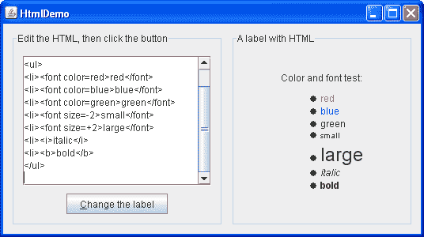
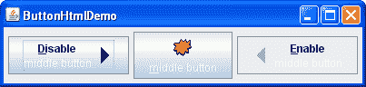

# 如何在 Swing 组件中使用 HTML

> 原文：[`docs.oracle.com/javase/tutorial/uiswing/components/html.html`](https://docs.oracle.com/javase/tutorial/uiswing/components/html.html)

许多 Swing 组件在其 GUI 的一部分中显示文本字符串。默认情况下，组件的文本以单一字体和颜色显示，全部显示在一行上。您可以通过调用组件的`setFont`和`setForeground`方法来确定组件文本的字体和颜色。例如，以下代码创建一个标签，然后设置其字体和颜色：

```java
label = new JLabel("A label");
label.setFont(new Font("Serif", Font.PLAIN, 14));
label.setForeground(new Color(0xffffdd));

```

如果您想在文本中混合字体或颜色，或者想要格式化，如多行，您可以使用 HTML。HTML 格式可以在所有 Swing 按钮、菜单项、标签、工具提示以及使用标签呈现文本的组件（如树和表格）中使用。

要指定组件的文本具有 HTML 格式，只需在文本开头放置`<html>`标记，然后在其余部分使用任何有效的 HTML。这是在按钮文本中使用 HTML 的示例：

```java
button = new JButton("<html><b><u>T</u>wo</b><br>lines</html>");

```

这是生成的按钮。 

## 一个示例：HtmlDemo

一个名为`HtmlDemo`的应用程序允许您通过在标签上设置文本来玩转 HTML 格式。您可以在`HtmlDemo.java`中找到此程序的完整代码。这是`HtmlDemo`示例的图片。



* * *

**试一试：**

1.  单击“启动”按钮以使用[Java™ Web Start](http://www.oracle.com/technetwork/java/javase/javawebstart/index.html)运行 HtmlDemo（[下载 JDK 7 或更高版本](http://www.oracle.com/technetwork/java/javase/downloads/index.html)）。或者，要自行编译和运行示例，请参考示例索引。

1.  编辑左侧文本区域中的 HTML 格式，并单击“更改标签”按钮。右侧的标签显示结果。

1.  从左侧的文本区域中删除<html>标记。标签的文本将不再被解析为 HTML。

* * *

## 示例 2：ButtonHtmlDemo

让我们看另一个使用 HTML 的示例。`ButtonHtmlDemo`为三个按钮添加字体、颜色和其他文本格式。您可以在`ButtonHtmlDemo.java`中找到此程序的完整代码。这是`ButtonHtmlDemo`示例的图片。



点击“启动”按钮以使用[Java™ Web Start](http://www.oracle.com/technetwork/java/javase/javawebstart/index.html)运行 ButtonHtmlDemo（[下载 JDK 7 或更高版本](http://www.oracle.com/technetwork/java/javase/downloads/index.html)）。或者，要自行编译和运行示例，请参考示例索引。


左右两个按钮具有多行文本和文本样式，并且是使用 HTML 实现的。另一方面，中间的按钮只使用了一行文本、字体和颜色，因此不需要 HTML。以下是指定这三个按钮的文本格式的代码：

```java
b1 = new JButton("<html><center><b><u>D</u>isable</b><br>"
                 + "<font color=#ffffdd>middle button</font>",
                 leftButtonIcon);
Font font = b1.getFont().deriveFont(Font.PLAIN);
b1.setFont(font);
...
b2 = new JButton("middle button", middleButtonIcon);
b2.setFont(font);
b2.setForeground(new Color(0xffffdd));
...
b3 = new JButton("<html><center><b><u>E</u>nable</b><br>"
                 + "<font color=#ffffdd>middle button</font>",
                 rightButtonIcon);
b3.setFont(font);

```

请注意，我们必须使用`<u>`标签来使使用 HTML 的按钮中的助记字符“D”和“E”被下划线标记。还要注意，当按钮被禁用时，其 HTML 文本不幸地保持为黑色，而不是变为灰色。（请参考[bug #4783068](http://bugs.java.com/bugdatabase/view_bug.do?bug_id=4783068)查看是否情况会发生变化。）

本节讨论了如何在普通的非文本组件中使用 HTML。有关主要用于格式化文本的组件的信息，请参阅使用文本组件。

如果你在使用 JavaFX 进行编程，请查看[HTML 编辑器](https://docs.oracle.com/javase/8/javafx/user-interface-tutorial/editor.htm)。
