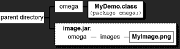

# 如何使用图标

> 原文：[`docs.oracle.com/javase/tutorial/uiswing/components/icon.html`](https://docs.oracle.com/javase/tutorial/uiswing/components/icon.html)

许多 Swing 组件，如标签、按钮和选项卡窗格，可以用*图标*进行装饰 — 一个固定大小的图片。图标是一个遵循[`Icon`](https://docs.oracle.com/javase/8/docs/api/javax/swing/Icon.html)接口的对象。Swing 提供了一个特别有用的`Icon`接口实现：[`ImageIcon`](https://docs.oracle.com/javase/8/docs/api/javax/swing/ImageIcon.html)，它可以从 GIF、JPEG 或 PNG 图像绘制图标。

这是一个带有三个标签的应用程序快照，其中两个标签装饰有图标：


该程序使用一个图像图标来包含和绘制黄色斑点。一个语句创建图像图标，另外两个语句将图像图标包含在两个标签中：

```java
ImageIcon icon = createImageIcon("images/middle.gif",
                                 "a pretty but meaningless splat");
label1 = new JLabel("Image and Text", icon, JLabel.CENTER);
...
label3 = new JLabel(icon);

```

`createImageIcon`方法（在前面的片段中使用）是我们在许多代码示例中使用的方法。它查找指定的文件并为该文件返回一个`ImageIcon`，如果找不到该文件则返回`null`。以下是一个典型的实现：

```java
/** Returns an ImageIcon, or null if the path was invalid. */
protected ImageIcon createImageIcon(String path,
                                           String description) {
    java.net.URL imgURL = getClass().getResource(path);
    if (imgURL != null) {
        return new ImageIcon(imgURL, description);
    } else {
        System.err.println("Couldn't find file: " + path);
        return null;
    }
}

```

在前面的片段中，`ImageIcon`构造函数的第一个参数是相对于当前类位置的，并将解析为绝对 URL。`description`参数是一个字符串，允许辅助技术帮助视觉障碍用户理解图标传达的信息。

通常，应用程序提供自己的一组用作应用程序一部分的图像，就像我们许多演示中使用的图像一样。您应该使用`Class`的`getResource`方法获取图像的路径。这允许应用程序验证图像是否可用，并在图像不可用时提供合理的错误处理。当图像不是应用程序的一部分时，不应使用`getResource`，而应直接使用`ImageIcon`构造函数。例如：

```java
ImageIcon icon = new ImageIcon("images/middle.gif",
                               "a pretty but meaningless splat");

```

当您向`ImageIcon`构造函数指定文件名或 URL 时，处理将被阻塞，直到图像数据完全加载或数据位置被证明无效为止。如果数据位置无效（但非空），则仍会成功创建`ImageIcon`；只是它没有大小，因此不会绘制任何内容。如`createImageIcon`方法所示，建议在将 URL 传递给`ImageIcon`构造函数之前首先验证 URL 是否指向现有文件。这样可以在文件不存在时进行优雅的错误处理。如果您希望在图像加载时获得更多信息，可以通过调用其`setImageObserver`方法在图像图标上注册观察者。

在底层，每个图像图标都使用一个[`Image`](https://docs.oracle.com/javase/8/docs/api/java/awt/Image.html)对象来保存图像数据。

本节的其余部分涵盖以下主题：

+   更复杂的图像图标示例

+   使用 getResource 加载图像

+   将图像加载到小程序中

+   提高加载图像图标时的感知性能

+   创建自定义图标实现

+   图像图标 API

+   使用图标的示例

## 更复杂的图像图标示例

这是一个使用六个图像图标的应用程序。其中五个显示缩略图图像，第六个显示全尺寸照片。


* * *

**试试这个：**

1.  单击“启动”按钮以使用 [Java™ Web Start](http://www.oracle.com/technetwork/java/javase/javawebstart/index.html) 运行 IconDemo（[下载 JDK 7 或更高版本](http://www.oracle.com/technetwork/java/javase/downloads/index.html)）。或者，要自行编译和运行示例，请参考示例索引。

    

1.  单击任何缩略图图像以查看全尺寸照片。

1.  将鼠标悬停在照片上。将显示一个工具提示，显示照片标题。

* * *

**IconDemoApp** 展示了以下方式中使用的图标：

+   作为附加到按钮的 GUI 元素（按钮上的缩略图图像）。

+   用于显示图像（五张照片）。

照片通过 `loadimages.execute` 在单独的线程中加载。稍后在本节中显示 `loadimages` 代码。

`ThumbnailAction` 类是 `IconDemoApp.java` 中的一个内部类，是 `AbstractAction` 的子类，用于管理我们的全尺寸图标、缩略图版本及其描述。当调用 `actionPerformed` 方法时，全尺寸图像将加载到主显示区域中。每个按钮都有自己的 `ThumbnailAction` 实例，指定要显示的不同图像。

```java
/**
 * Action class that shows the image specified in it's constructor.
 */
private class ThumbnailAction extends AbstractAction{

    /**
     *The icon if the full image we want to display.
     */
    private Icon displayPhoto;

    /**
     * @param Icon - The full size photo to show in the button.
     * @param Icon - The thumbnail to show in the button.
     * @param String - The description of the icon.
     */
    public ThumbnailAction(Icon photo, Icon thumb, String desc){
        displayPhoto = photo;

        // The short description becomes the tooltip of a button.
        putValue(SHORT_DESCRIPTION, desc);

        // The LARGE_ICON_KEY is actually the key for setting the
        // icon when an Action is applied to a button.
        putValue(LARGE_ICON_KEY, thumb);
    }

    /**
     * Shows the full image in the main area and sets the application title.
     */
    public void actionPerformed(ActionEvent e) {
        photographLabel.setIcon(displayPhoto);
        setTitle("Icon Demo: " + getValue(SHORT_DESCRIPTION).toString());
    }
}

```

## 使用 getResource 加载图像

大多数情况下，图像图标的数据来自图像文件。您的应用程序的类文件和图像文件可能以多种有效方式配置在文件服务器上。您可能将类文件放在一个 JAR 文件中，或者将图像文件放在一个 JAR 文件中；它们可能在同一个 JAR 文件中，也可能在不同的 JAR 文件中。以下图示说明了这些文件可以配置的几种方式：

|  |  |
| --- | --- |
| 类文件与包含 PNG 格式图像文件的图像目录相邻。 | 类文件与 JAR 文件在同一目录中。JAR 文件中包含一个 `images` 目录，其中包含所有图像。 |
|  |  |
| 类文件在一个 JAR 文件中，图片在另一个 JAR 文件中。 | 类和图片文件在同一个 JAR 文件中。 |

如果你正在编写真实世界的应用程序，很可能（也建议）将文件放入包中。有关包的更多信息，请参阅创建和使用包中的学习 Java 语言教程。以下是使用名为"omega"的包的一些可能配置：

|  |  |
| --- | --- |
| 类文件在名为`omega`的目录中。图片在`omega/images`目录中。 | 类文件在`omega`目录中。图片在不在`omega`目录内的 JAR 文件中，但是按照`omega/images`层次结构创建。 |
|  |
| 一个包含类文件在`omega`目录下，图片文件在`omega/images`目录下的大型 JAR 文件。 |

所有七种配置都是有效的，相同的代码读取图片：

```java
java.net.URL imageURL = myDemo.class.getResource("images/myImage.gif");
...
if (imageURL != null) {
    ImageIcon icon = new ImageIcon(imageURL);
}

```

`getResource`方法会导致类加载器在程序的类路径中查找目标文件，一旦找到所需文件就会返回一个 URL。在这个例子中，MyDemo 程序尝试从`omega`类加载`images/myImage.png`文件。类加载器会在程序的类路径中查找`/omega/images/myImage.png`。如果类加载器找到了文件，就会返回包含该文件的 JAR 文件或目录的 URL。如果类路径中的另一个 JAR 文件或目录包含`images/myImage.png`文件，类加载器会返回第一个包含该文件的实例。

有三种指定类路径的方式：

+   使用`-cp`或`-classpath`命令行参数。例如，在图片存储在名为`images.jar`的 JAR 文件中，而类文件在当前目录的情况下：

    ```java
    java -cp  .;images.jar  MyDemo  [Microsoft Windows]
    java -cp ".;images.jar" MyDemo  [UNIX-emulating shell on Microsoft
                                    Windows — you must quote the path]
    java -cp  .:images.jar  MyDemo  [UNIX]

    ```

    如果你的图片和类文件存储在不同的 JAR 文件中，你的命令行会类似于：

    ```java
    java -cp .;MyDemo.jar;images.jar MyDemo  [Microsoft Windows]

    ```

    在所有文件都在一个 JAR 文件中的情况下，你可以使用以下任一命令：

    ```java
    java -jar MyAppPlusImages.jar
    java -cp .;MyAppPlusImages.jar MyApp  [Microsoft Windows]

    ```

    欲了解更多信息，请参阅 JAR 文件教程。

+   在程序的 JNLP 文件中（Java Web Start 使用）。例如，这是`DragPictureDemo`使用的 JNLP 文件：

    ```java
    <?xml version="1.0" encoding="utf-8"?>
    <!-- JNLP File for DragPictureDemo -->
    <jnlp
      spec="1.0+"
      codebase="https://docs.oracle.com/javase/tutorialJWS/src/uiswing/misc/examples"
      href="DragPictureDemo.jnlp">
      <information>
        <title>DragPictureDemo</title>
        <vendor>The Java(tm) Tutorial: Sun Microsystems, Inc.</vendor>
        <homepage href="https://docs.oracle.com/javase/tutorial/uiswing/misc/examples/index.html#DragPictureDemo"/>
        <description>DragPictureDemo</description>
        <description kind="short">A demo showing how to install
            data transfer on a custom component.</description>
        <offline-allowed/>
      </information>
      <resources>
        <j2se version="1.6+"/>
        <jar href="allClasses.jar"/>
        <jar href="images.jar"/>
      </resources>
      <application-desc main-class="DragPictureDemo"/>
    </jnlp>

    ```

    在这个例子中，类文件和图片文件分别存储在不同的 JAR 文件中。使用 XML `jar`标签指定 JAR 文件。

+   设置`CLASSPATH`环境变量。这种方法*不推荐*。如果未设置`CLASSPATH`，则默认使用当前目录(".")，然后是随 JRE 一起提供的系统类的位置。

大多数 Swing 教程示例将图像放在包含示例类文件的目录下的`images`目录中。当为示例创建 JAR 文件时，我们保持相同的相对位置，尽管通常我们将类文件放在与图像 JAR 文件不同的 JAR 文件中。无论类文件和图像文件在文件系统中的位置如何 — 在一个 JAR 文件中，或在多个 JAR 文件中，在命名包中，或在默认包中 — 相同的代码使用`getResource`查找图像文件。

欲了解更多信息，请参阅[以位置无关的方式访问资源](https://docs.oracle.com/javase/8/docs/technotes/guides/lang/resources.html)和[应用程序开发注意事项](https://docs.oracle.com/javase/8/docs/technotes/guides/javaws/developersguide/development.html)。

## 将图像加载到 Applets 中

Applets 通常从提供 applet 的计算机加载图像数据。`APPLET`标签是您指定 applet 中使用的图像信息的地方。有关`APPLET`标签的更多信息，请参阅使用 APPLET 标签。

## 在加载图像图标时改善感知性能

由于访问照片图像可能很慢，`IconDemoApp.java`使用`SwingWorker`来改善用户感知的程序性能。

**后台图像加载** — 该程序使用[javax.swing.SwingWorker](https://docs.oracle.com/javase/8/docs/api/javax/swing/SwingWorker.html)对象在后台线程中加载每张照片图像并计算其缩略图。使用`SwingWorker`可以防止程序在加载和缩放图像时出现冻结的情况。

这是处理每个图像的代码：

```java
/**
 * SwingWorker class that loads the images a background thread and calls publish
 * when a new one is ready to be displayed.
 *
 * We use Void as the first SwingWorker param as we do not need to return
 * anything from doInBackground().
 */
private SwingWorker<Void, ThumbnailAction> loadimages = new SwingWorker<Void, ThumbnailAction>() {

    /**
     * Creates full size and thumbnail versions of the target image files.
     */
    @Override
    protected Void doInBackground() throws Exception {
        for (int i = 0; i < imageCaptions.length; i++) {
            ImageIcon icon;
            icon = createImageIcon(imagedir + imageFileNames[i], imageCaptions[i]);

            ThumbnailAction thumbAction;
            if(icon != null){

                ImageIcon thumbnailIcon = new
                     ImageIcon(getScaledImage(icon.getImage(), 32, 32));

                thumbAction = new ThumbnailAction(icon, thumbnailIcon, imageCaptions[i]);

            } else {
                // the image failed to load for some reason
                // so load a placeholder instead
                thumbAction = new ThumbnailAction(placeholderIcon, placeholderIcon, imageCaptions[i]);
            }
            publish(thumbAction);
        }
        // unfortunately we must return something, and only null is valid to
        // return when the return type is void.
        return null;
    }

    /**
     * Process all loaded images.
     */
    @Override
    protected void process(List<ThumbnailAction> chunks) {
        for (ThumbnailAction thumbAction : chunks) {
            JButton thumbButton = new JButton(thumbAction);
            // add the new button BEFORE the last glue
            // this centers the buttons in the toolbar
            buttonBar.add(thumbButton, buttonBar.getComponentCount() - 1);
        }
    }
};

```

SwingWorker 在后台线程中调用`doInBackground`方法。该方法将全尺寸图像、缩略图图像和标题放入`ThumbnailAction`对象中。然后，SwingWorker 将`ThumbnailAction`传递给`process`方法。`process`方法在事件分发线程上执行，并通过向工具栏添加按钮来更新 GUI。`JButton`有一个接受动作对象的构造函数。动作对象确定按钮的许多属性。在我们的情况下，按钮图标、标题和按下按钮时执行的操作都由`ThumbnailAction`确定。

**开销** — 该程序最终将所有源图像加载到内存中。这在所有情况下可能并不理想。加载大量非常大的文件可能会导致程序分配大量内存。应注意管理加载的图像数量和大小。

与所有与性能相关的问题一样，这种技术在某些情况下适用，而在其他情况下则不适用。此外，这里描述的技术旨在改善程序的感知性能，但不一定影响其实际性能。

## 创建自定义图标实现

当`createImageIcon`方法无法找到图像时会返回 null，但程序应该怎么做呢？一种可能性是忽略该图像并继续。另一个选择是在无法加载真实图像时提供某种默认图标来显示。再次调用`createImageIcon`可能会导致另一个 null，因此使用它不是一个好主意。相反，让我们创建一个自定义`Icon`实现。


您可以在`MissingIcon.java`中找到自定义图标类的实现。以下是其代码中的有趣部分：

```java
/**
 * The "missing icon" is a white box with a black border and a red x.
 * It's used to display something when there are issues loading an
 * icon from an external location.
 *
 * @author Collin Fagan
 */
public class MissingIcon implements Icon{

    private int width = 32;
    private int height = 32;

    private BasicStroke stroke = new BasicStroke(4);

    public void paintIcon(Component c, Graphics g, int x, int y) {
        Graphics2D g2d = (Graphics2D) g.create();

        g2d.setColor(Color.WHITE);
        g2d.fillRect(x +1 ,y + 1,width -2 ,height -2);

        g2d.setColor(Color.BLACK);
        g2d.drawRect(x +1 ,y + 1,width -2 ,height -2);

        g2d.setColor(Color.RED);

        g2d.setStroke(stroke);
        g2d.drawLine(x +10, y + 10, x + width -10, y + height -10);
        g2d.drawLine(x +10, y + height -10, x + width -10, y + 10);

        g2d.dispose();
    }

    public int getIconWidth() {
        return width;
    }

    public int getIconHeight() {
        return height;
    }
}

```

`paintIcon`方法接收一个`Graphics`对象。`Graphics`对象使`paintIcon`方法可以访问整个 Java2D API。有关绘图和 Java2D 的更多信息，请参见执行自定义绘图。

以下代码演示了`MissingIcon`类在`SwingWorker`的`doInBackground`方法中的使用。

```java
private MissingIcon placeholderIcon = new MissingIcon();

...
if(icon != null) {
    ...

} else {
    // the image failed to load for some reason
    // so load a placeholder instead
    thumbAction = new ThumbnailAction(placeholderIcon, placeholderIcon, imageCaptions[i]);
}

```

使用自定义图标会有一些影响：

+   因为图标的外观是动态确定的，图标绘制代码可以使用任何信息 — 例如组件和应用程序状态 — 来确定要绘制什么。

+   根据平台和图像类型，使用自定义图标可能会提高性能，因为绘制简单形状有时比复制图像更快。

+   因为`MissingIcon`不执行任何文件 I/O，所以不需要单独的线程来加载图像。

## 图像图标 API

以下表格列出了常用的`ImageIcon`构造函数和方法。请注意，`ImageIcon`不是`JComponent`甚至不是`Component`的子类。

使用图像图标的 API 分为以下几类：

+   设置、获取和绘制图像图标的图像

+   设置或获取有关图像图标的信息

+   观察图像图标的图像加载状态

设置、获取和绘制图像图标的图像

| 方法或构造函数 | 目的 |
| --- | --- |

| [ImageIcon()](https://docs.oracle.com/javase/8/docs/api/javax/swing/ImageIcon.html#ImageIcon--) [ImageIcon(byte[])](https://docs.oracle.com/javase/8/docs/api/javax/swing/ImageIcon.html#ImageIcon-byte:A-) |

[ImageIcon(byte[], String)](https://docs.oracle.com/javase/8/docs/api/javax/swing/ImageIcon.html#ImageIcon-byte:A-java.lang.String-)

[ImageIcon(Image)](https://docs.oracle.com/javase/8/docs/api/javax/swing/ImageIcon.html#ImageIcon-java.awt.Image-)

[ImageIcon(Image, String)](https://docs.oracle.com/javase/8/docs/api/javax/swing/ImageIcon.html#ImageIcon-java.awt.Image-java.lang.String-)

[ImageIcon(String)](https://docs.oracle.com/javase/8/docs/api/javax/swing/ImageIcon.html#ImageIcon-java.lang.String-)

[ImageIcon(String, String)](https://docs.oracle.com/javase/8/docs/api/javax/swing/ImageIcon.html#ImageIcon-java.lang.String-java.lang.String-)

[ImageIcon(URL)](https://docs.oracle.com/javase/8/docs/api/javax/swing/ImageIcon.html#ImageIcon-java.net.URL-)

[ImageIcon(URL, String)](https://docs.oracle.com/javase/8/docs/api/javax/swing/ImageIcon.html#ImageIcon-java.net.URL-java.lang.String-) | 创建一个`ImageIcon`实例，并初始化为包含指定图像。第一个参数指示源——图像、字节数组、文件名或 URL——从中应加载图像图标的图像。源必须是`java.awt.Image`类支持的格式：即 GIF、JPEG 或 PNG。第二个参数（如果存在）为图像提供描述。描述也可以通过`setDescription`设置，并为辅助技术提供有用的文本信息。 |

| [void setImage(Image)](https://docs.oracle.com/javase/8/docs/api/javax/swing/ImageIcon.html#setImage-java.awt.Image-) [Image getImage()](https://docs.oracle.com/javase/8/docs/api/javax/swing/ImageIcon.html#getImage--) | 设置或获取图像图标显示的图像。 |
| --- | --- |
| [void paintIcon(Component, Graphics, int, int)](https://docs.oracle.com/javase/8/docs/api/javax/swing/ImageIcon.html#paintIcon-java.awt.Component-java.awt.Graphics-int-int-) | 在指定的图形上下文中绘制图像图标的图像。只有在实现执行自己的绘图的自定义图标时才会覆盖此方法。`Component`对象用作图像观察者。您可以依赖`Component`类提供的默认行为，并传入任何组件。两个`int`参数指定绘制图标的左上角。 |
| [URL getResource(String)](https://docs.oracle.com/javase/8/docs/api/java/lang/ClassLoader.html#getResource-java.lang.String-) in (*java.lang.ClassLoader*) | 查找具有给定名称的资源。有关更多信息，请参见使用 getResource 加载图像。 |
| [InputStream getResourceAsStream(String)](https://docs.oracle.com/javase/8/docs/api/java/lang/ClassLoader.html#getResourceAsStream-java.lang.String-) in (*java.lang.ClassLoader*) | 查找具有给定名称的资源，并返回用于读取资源的输入流。有关更多信息，请参见将图像加载到小程序中讨论。 |

设置或获取有关图像图标的信息

| 方法 | 目的 |
| --- | --- |
| [void setDescription(String)](https://docs.oracle.com/javase/8/docs/api/javax/swing/ImageIcon.html#setDescription-java.lang.String-) [String getDescription()](https://docs.oracle.com/javase/8/docs/api/javax/swing/ImageIcon.html#getDescription--) | 设置或获取图像的描述。此描述供辅助技术使用。 |
| [int getIconWidth()](https://docs.oracle.com/javase/8/docs/api/javax/swing/ImageIcon.html#getIconWidth--) [int getIconHeight()](https://docs.oracle.com/javase/8/docs/api/javax/swing/ImageIcon.html#getIconHeight--) | 获取图像图标的宽度或高度（以像素为单位）。 |

观察图像图标的图像加载

| 方法 | 目的 |
| --- | --- |
| [void setImageObserver(ImageObserver)](https://docs.oracle.com/javase/8/docs/api/javax/swing/ImageIcon.html#setImageObserver-java.awt.image.ImageObserver-) [ImageObserver getImageObserver()](https://docs.oracle.com/javase/8/docs/api/javax/swing/ImageIcon.html#getImageObserver--) | 为图像图标设置或获取图像观察器。 |
| [int getImageLoadStatus()](https://docs.oracle.com/javase/8/docs/api/javax/swing/ImageIcon.html#getImageLoadStatus--) | 获取图像图标的图像加载状态。此方法返回的值由`MediaTracker`定义。 |

## 使用图标的示例

以下表格列出了仅有的一些使用`ImageIcon`的示例。

| 示例 | 描述位置 | 注释 |
| --- | --- | --- |
| `LabelDemo` | 本节和如何使用标签 | 演示如何在应用程序的标签中使用图标，带有或不带有相应文本。 |
| `IconDemo` | 本节 | 使用标签显示大图像；使用既有图像又有文本的按钮。 |
| `CustomIconDemo` | 本节 | 使用由`ArrowIcon.java`实现的自定义图标类。 |
| `TumbleItem` | 如何制作小程序 | 一个小程序。在动画中使用图像图标。展示如何调用`ImageIcon`的`paintIcon`方法。 |
| `ButtonDemo` | 如何使用按钮、复选框和单选按钮 | 展示如何在应用程序的按钮中使用图标。 |
| `CheckBoxDemo` | 如何使用复选框 | 使用多个 GIF 图像。 |
| `TabbedPaneDemo` | 如何使用选项卡窗格 | 演示如何在选项卡窗格中添加图标到选项卡中。 |
| `DialogDemo` | 如何制作对话框 | 展示如何在对话框中使用标准图标。 |
| `TreeIconDemo` | 如何使用树 | 展示如何更改树节点显示的图标。 |
| `ActionDemo` | 如何使用操作 | 展示如何使用`Action`在工具栏按钮或菜单项中指定图标。 |
| `FileChooserDemo2` | 如何使用文件选择器 | 使用了 `PNG` 图像。展示了如何在文件选择器中实现图像预览和图像过滤器。 |

* * *

**注意：** `IconDemo` 中使用的照片版权归 ©2006 [spriggs.net](http://photos.spriggs.net/) 所有，并在 [知识共享许可协议](http://creativecommons.org/licenses/by-sa/3.0/) 下授权使用。

* * *
