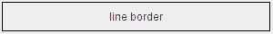
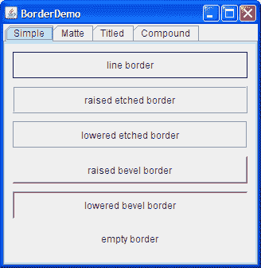
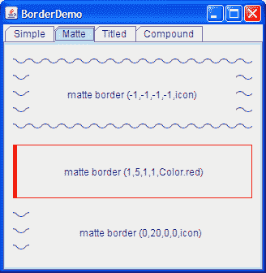
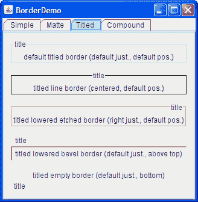
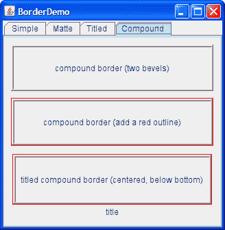

# 如何使用边框

> 原文：[`docs.oracle.com/javase/tutorial/uiswing/components/border.html`](https://docs.oracle.com/javase/tutorial/uiswing/components/border.html)

每个`JComponent`可以有一个或多个边框。边框是非常有用的对象，虽然它们本身不是组件，但知道如何绘制 Swing 组件的边缘。边框不仅用于绘制线条和花哨的边缘，还用于为组件提供标题和周围的空白空间。

* * *

**注意：**

我们的示例在`JPanel`、`JLabel`和`JComponent`的自定义子类上设置了边框。尽管从技术上讲，您可以在任何继承自`JComponent`的对象上设置边框，但许多标准 Swing 组件的外观和感觉实现与用户设置的边框不兼容。通常情况下，当您想在除了`JPanel`或`JLabel`之外的标准 Swing 组件上设置边框时，我们建议将组件放在`JPanel`中，并在`JPanel`上设置边框。

* * *

要在`JComponent`周围放置边框，可以使用其`setBorder`方法。您可以使用[`BorderFactory`](https://docs.oracle.com/javase/8/docs/api/javax/swing/BorderFactory.html)类来创建 Swing 提供的大多数边框。如果您需要引用边框，比如因为您想在多个组件中使用它，可以将其保存在[`Border`](https://docs.oracle.com/javase/8/docs/api/javax/swing/border/Border.html)类型的变量中。以下是创建带边框容器的代码示例：

```java
JPanel pane = new JPanel();
pane.setBorder(BorderFactory.createLineBorder(Color.black));

```

这是一个包含标签组件的容器的图片。边框绘制的黑线标记了容器的边缘。



本页的其余部分讨论以下主题：

+   BorderDemo 示例

+   使用 Swing 提供的边框

+   创建自定义边框

+   边框 API

+   使用边框的示例

## BorderDemo 示例

以下图片展示了一个名为`BorderDemo`的应用程序，显示了 Swing 提供的边框。稍后我们会展示创建这些边框的代码，在使用 Swing 提供的边框中。

单击启动按钮以使用[Java™ Web Start](http://www.oracle.com/technetwork/java/javase/javawebstart/index.html)运行 BorderDemo 示例（[下载 JDK 7 或更高版本](http://www.oracle.com/technetwork/java/javase/downloads/index.html)）。或者，要自行编译和运行示例，请参考示例索引。




下一张图片展示了一些**镜面边框**。创建镜面边框时，您需要指定组件顶部、左侧、底部和右侧各占据多少像素。然后，您需要指定镜面边框要绘制的颜色或图标。在选择图标和确定组件大小时需要小心；否则，图标可能会被截断或在组件的角落处不匹配。



下一张图片展示了**带标题的边框**。使用带标题的边框，您可以将任何边框转换为显示文本描述的边框。如果不指定边框，将使用特定外观的边框。例如，在 Java 外观中，默认的带标题边框使用灰色线条，在 Windows 外观中默认的带标题边框使用浮雕边框。默认情况下，标题横跨边框的左上角，如下图顶部所示。



下一张图片展示了**复合边框**。使用复合边框，您可以组合任意两个边框，这些边框本身可以是复合边框。



## 使用 Swing 提供的边框

接下来的代码展示了如何创建和设置前面图中看到的边框。您可以在`BorderDemo.java`中找到程序的代码。

```java
//Keep references to the next few borders,
//for use in titles and compound borders.
Border blackline, raisedetched, loweredetched,
       raisedbevel, loweredbevel, empty;

blackline = BorderFactory.createLineBorder(Color.black);
raisedetched = BorderFactory.createEtchedBorder(EtchedBorder.RAISED);
loweredetched = BorderFactory.createEtchedBorder(EtchedBorder.LOWERED);
raisedbevel = BorderFactory.createRaisedBevelBorder();
loweredbevel = BorderFactory.createLoweredBevelBorder();
empty = BorderFactory.createEmptyBorder();

//Simple borders
jComp1.setBorder(blackline);
jComp2.setBorder(raisedbevel);
jComp3.setBorder(loweredbevel);
jComp4.setBorder(empty);

//Matte borders
ImageIcon icon = createImageIcon("images/wavy.gif",
                                 "wavy-line border icon"); //20x22

jComp5.setBorder(BorderFactory.createMatteBorder(
                                   -1, -1, -1, -1, icon));
jComp6.setBorder(BorderFactory.createMatteBorder(
                                    1, 5, 1, 1, Color.red));
jComp7.setBorder(BorderFactory.createMatteBorder(
                                    0, 20, 0, 0, icon));

//Titled borders
TitledBorder title;
title = BorderFactory.createTitledBorder("title");
jComp8.setBorder(title);

title = BorderFactory.createTitledBorder(
                       blackline, "title");
title.setTitleJustification(TitledBorder.CENTER);
jComp9.setBorder(title);

title = BorderFactory.createTitledBorder(
                       loweredetched, "title");
title.setTitleJustification(TitledBorder.RIGHT);
jComp10.setBorder(title);

title = BorderFactory.createTitledBorder(
                       loweredbevel, "title");
title.setTitlePosition(TitledBorder.ABOVE_TOP);
jComp11.setBorder(title);

title = BorderFactory.createTitledBorder(
                       empty, "title");
title.setTitlePosition(TitledBorder.BOTTOM);
jComp12.setBorder(title);

//Compound borders
Border compound;
Border redline = BorderFactory.createLineBorder(Color.red);

//This creates a nice frame.
compound = BorderFactory.createCompoundBorder(
                          raisedbevel, loweredbevel);
jComp13.setBorder(compound);

//Add a red outline to the frame.
compound = BorderFactory.createCompoundBorder(
                          redline, compound);
jComp14.setBorder(compound);

//Add a title to the red-outlined frame.
compound = BorderFactory.createTitledBorder(
                          compound, "title",
                          TitledBorder.CENTER,
                          TitledBorder.BELOW_BOTTOM);
jComp15.setBorder(compound);

```

正如您可能注意到的，代码使用`BorderFactory`类来创建每个边框。`BorderFactory`类位于`javax.swing`包中，返回实现[`Border`](https://docs.oracle.com/javase/8/docs/api/javax/swing/border/Border.html)接口的对象。

`Border`接口及其 Swing 提供的实现位于[`javax.swing.border`](https://docs.oracle.com/javase/8/docs/api/javax/swing/border/package-summary.html)包中。通常情况下，您不需要直接使用边框包中的任何内容，除非在指定特定边框类的常量或引用`Border`类型时。

## 创建自定义边框

如果`BorderFactory`不能提供足够的控制来定义边框的形式，那么您可能需要直接使用边框包中的 API — 或者甚至定义自己的边框。除了包含`Border`接口外，边框包还包含实现您已经看到的边框的类：[`LineBorder`](https://docs.oracle.com/javase/8/docs/api/javax/swing/border/LineBorder.html)、[`EtchedBorder`](https://docs.oracle.com/javase/8/docs/api/javax/swing/border/EtchedBorder.html)、[`BevelBorder`](https://docs.oracle.com/javase/8/docs/api/javax/swing/border/BevelBorder.html)、[`EmptyBorder`](https://docs.oracle.com/javase/8/docs/api/javax/swing/border/EmptyBorder.html)、[`MatteBorder`](https://docs.oracle.com/javase/8/docs/api/javax/swing/border/MatteBorder.html)、[`TitledBorder`](https://docs.oracle.com/javase/8/docs/api/javax/swing/border/TitledBorder.html)和[`CompoundBorder`](https://docs.oracle.com/javase/8/docs/api/javax/swing/border/CompoundBorder.html)。边框包还包含一个名为[`SoftBevelBorder`](https://docs.oracle.com/javase/8/docs/api/javax/swing/border/SoftBevelBorder.html)的类，它产生类似于`BevelBorder`但边缘更柔和的效果。

如果没有适合的 Swing 边框，您可以实现自己的边框。通常，您可以通过创建[`AbstractBorder`](https://docs.oracle.com/javase/8/docs/api/javax/swing/border/AbstractBorder.html)类的子类来实现这一点。在您的子类中，您必须实现至少一个构造函数和以下两个方法：

+   `paintBorder`，其中包含绘制代码，`JComponent`执行以绘制边框。

+   `getBorderInsets`，指定边框需要绘制自身所需的空间量。

如果自定义边框有插入（通常会有插入），您需要重写[`AbstractBorder.getBorderInsets(Component c)`](https://docs.oracle.com/javase/8/docs/api/javax/swing/border/AbstractBorder.html#getBorderInsets-java.awt.Component-)和[`AbstractBorder.getBorderInsets(Component c, Insets insets)`](https://docs.oracle.com/javase/8/docs/api/javax/swing/border/AbstractBorder.html#getBorderInsets-java.awt.Component-java.awt.Insets-)来提供正确的插入。

有关实现边框的示例，请参阅`javax.swing.border`包中类的源代码。

## 边框 API

以下表格列出了常用的边框方法。使用边框的 API 分为两类：

+   使用 BorderFactory 创建边框

+   设置或获取组件的边框

使用 BorderFactory 创建边框

| 方法 | 目的 |
| --- | --- |
| [创建线边框(Color)](https://docs.oracle.com/javase/8/docs/api/javax/swing/BorderFactory.html#createLineBorder-java.awt.Color-) [创建线边框(Color, int)](https://docs.oracle.com/javase/8/docs/api/javax/swing/BorderFactory.html#createLineBorder-java.awt.Color-int-) | 创建一个线边框。第一个参数是一个`java.awt.Color`对象，指定线的颜色。可选的第二个参数指定线的宽度（以像素为单位）。 |

| [创建浮雕边框()](https://docs.oracle.com/javase/8/docs/api/javax/swing/BorderFactory.html#createEtchedBorder--) [创建浮雕边框(Color, Color)](https://docs.oracle.com/javase/8/docs/api/javax/swing/BorderFactory.html#createEtchedBorder-java.awt.Color-java.awt.Color-)

[创建浮雕边框(int)](https://docs.oracle.com/javase/8/docs/api/javax/swing/BorderFactory.html#createEtchedBorder-int-)

[创建浮雕边框(int, Color, Color)](https://docs.oracle.com/javase/8/docs/api/javax/swing/BorderFactory.html#createEtchedBorder-int-java.awt.Color-java.awt.Color-) | 创建一个浮雕边框。可选的`Color`参数指定要使用的高亮和阴影颜色。带有`int`参数的方法允许将边框方法指定为`EtchedBorder.RAISED`或`EtchedBorder.LOWERED`。没有`int`参数的方法创建一个降低的浮雕边框。

| [创建降低斜角边框()](https://docs.oracle.com/javase/8/docs/api/javax/swing/BorderFactory.html#createLoweredBevelBorder--) | 创建一个边框，使组件看起来比周围区域更低。 |
| --- | --- |
| [创建凸起斜角边框()](https://docs.oracle.com/javase/8/docs/api/javax/swing/BorderFactory.html#createRaisedBevelBorder--) | 创建一个边框，使组件看起来比周围区域更高。 |

|  [创建斜角边框(int, Color, Color)](https://docs.oracle.com/javase/8/docs/api/javax/swing/BorderFactory.html#createBevelBorder-int-java.awt.Color-java.awt.Color-)

[创建斜角边框(int, Color, Color, Color, Color)](https://docs.oracle.com/javase/8/docs/api/javax/swing/BorderFactory.html#createBevelBorder-int-java.awt.Color-java.awt.Color-java.awt.Color-java.awt.Color-) | 创建一个凸起或凹陷的斜角边框，指定要使用的颜色。整数参数可以是`BevelBorder.RAISED`或`BevelBorder.LOWERED`。使用三个参数的构造函数，您可以指定高亮和阴影颜色。使用五个参数的构造函数，您按顺序指定外部高亮，内部高亮，外部阴影和内部阴影颜色。

| [Border createEmptyBorder()](https://docs.oracle.com/javase/8/docs/api/javax/swing/BorderFactory.html#createEmptyBorder--) [Border createEmptyBorder(int, int, int, int)](https://docs.oracle.com/javase/8/docs/api/javax/swing/BorderFactory.html#createEmptyBorder-int-int-int-int-) | 创建一个不可见的边框。如果不指定参数，则边框不占用空间，这在创建没有可见边界的标题边框时很有用。可选参数指定边框在组件顶部、左侧、底部和右侧（按顺序）占用的像素数。此方法可用于在组件周围放置空白空间。 |
| --- | --- |
| [MatteBorder createMatteBorder(int, int, int, int, Color)](https://docs.oracle.com/javase/8/docs/api/javax/swing/BorderFactory.html#createMatteBorder-int-int-int-int-java.awt.Color-) [MatteBorder createMatteBorder(int, int, int, int, Icon)](https://docs.oracle.com/javase/8/docs/api/javax/swing/BorderFactory.html#createMatteBorder-int-int-int-int-javax.swing.Icon-) | 创建一个亚光边框。整数参数指定边框在组件顶部、左侧、底部和右侧（按顺序）占用的像素数。颜色参数指定边框应填充其区域的颜色。图标参数指定边框应平铺其区域的图标。 |

| [TitledBorder createTitledBorder(String)](https://docs.oracle.com/javase/8/docs/api/javax/swing/BorderFactory.html#createTitledBorder-java.lang.String-) [TitledBorder createTitledBorder(Border)](https://docs.oracle.com/javase/8/docs/api/javax/swing/BorderFactory.html#createTitledBorder-javax.swing.border.Border-)

[TitledBorder createTitledBorder(Border, String)](https://docs.oracle.com/javase/8/docs/api/javax/swing/BorderFactory.html#createTitledBorder-javax.swing.border.Border-java.lang.String-)

[TitledBorder createTitledBorder(Border, String, int, int)](https://docs.oracle.com/javase/8/docs/api/javax/swing/BorderFactory.html#createTitledBorder-javax.swing.border.Border-java.lang.String-int-int-)

[TitledBorder createTitledBorder(Border, String, int, int, Font)](https://docs.oracle.com/javase/8/docs/api/javax/swing/BorderFactory.html#createTitledBorder-javax.swing.border.Border-java.lang.String-int-int-java.awt.Font-)

[TitledBorder createTitledBorder(Border, String, int, int, Font, Color)](https://docs.oracle.com/javase/8/docs/api/javax/swing/BorderFactory.html#createTitledBorder-javax.swing.border.Border-java.lang.String-int-int-java.awt.Font-java.awt.Color-) | 创建一个带标题的边框。字符串参数指定要显示的标题。可选的字体和颜色参数指定标题文本要使用的字体和颜色。边框参数指定应显示的边框以及标题。如果未指定边框，则使用特定于外观的默认边框。默认情况下，标题跨越其伴侣边框的顶部，并且左对齐。可选的整数参数按顺序指定标题的位置和对齐方式。[`TitledBorder`](https://docs.oracle.com/javase/8/docs/api/javax/swing/border/TitledBorder.html)定义了这些可能的位置：`ABOVE_TOP`，`TOP`（默认），`BELOW_TOP`，`ABOVE_BOTTOM`，`BOTTOM`和`BELOW_BOTTOM`。您可以将对齐方式指定为`LEADING`（默认），`CENTER`或`TRAILING`。在具有西方字母表的语言环境中，`LEADING`等同于`LEFT`，`TRAILING`等同于`RIGHT`。 |

|  [CompoundBorder createCompoundBorder(Border, Border)](https://docs.oracle.com/javase/8/docs/api/javax/swing/BorderFactory.html#createCompoundBorder-javax.swing.border.Border-javax.swing.border.Border-) | 将两个边框合并为一个。第一个参数指定外边框；第二个参数指定内边框。 |
| --- | --- |

设置或获取组件的边框

| 方法 | 目的 |
| --- | --- |
| [void setBorder(Border)](https://docs.oracle.com/javase/8/docs/api/javax/swing/JComponent.html#setBorder-javax.swing.border.Border-) [Border getBorder()](https://docs.oracle.com/javase/8/docs/api/javax/swing/JComponent.html#getBorder--) | 设置或获取接收`JComponent`的边框。 |

| [void setBorderPainted(boolean)](https://docs.oracle.com/javase/8/docs/api/javax/swing/AbstractButton.html#setBorderPainted-boolean-) [boolean isBorderPainted()](https://docs.oracle.com/javase/8/docs/api/javax/swing/AbstractButton.html#isBorderPainted--) 

（在`AbstractButton`，`JMenuBar`，`JPopupMenu`，`JProgressBar`和`JToolBar`中） | 设置或获取组件的边框是否应显示。 |

## 使用边框的示例

本课程中的许多示例使用边框。以下表格列出了一些有趣的案例。

| 示例 | 描述位置 | 备注 |
| --- | --- | --- |
| `BorderDemo` | 本节 | 展示`BorderFactory`可以创建的每种边框类型的示例。还使用空边框在每个窗格及其内容之间添加间距。 |
| `BoxAlignmentDemo` | 如何使用 BoxLayout | 使用带标题的边框。 |
| `BoxLayoutDemo` | 如何使用 BoxLayout | 使用红线显示容器的边缘位置，以便您可以看到 BoxLayout 中额外空间是如何分配的。 |
| `ComboBoxDemo2` | 如何使用组合框 | 使用复合边框将线边框与空边框结合在一起。空边框在线和组件内部之间提供空间。 |
