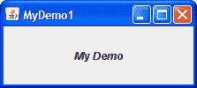

# 问题和练习：使用 Swing 组件

> 原文：[`docs.oracle.com/javase/tutorial/uiswing/QandE/questions-ch3.html`](https://docs.oracle.com/javase/tutorial/uiswing/QandE/questions-ch3.html)

使用本课程中的信息和组件使用说明部分来帮助你完成这些问题和练习。

## 问题

1\. 找到最适合以下需求的组件。写下组件的通用名称（如“框架”）并在线找到组件的使用说明页面。

a. 一个让用户选择颜色的组件。

b. 一个显示图标但不对用户点击做出反应的组件。

c. 一个看起来像按钮的组件，当按下时，会弹出一个菜单供用户选择。

d. 一个看起来像框架的容器，但实际上（通常与其他类似容器一起）出现在真实框架内部。

e. 一个容器，让用户确定两个组件如何共享有限的空间。

2\. 你使用哪种方法将菜单栏添加到顶层容器（如`JFrame`）？

3\. 你使用哪种方法来指定顶层容器（如`JFrame`或`JDialog`）的默认按钮？

4\. 你使用哪种方法来启用和禁用诸如`JButton`之类的组件？它是在哪个类中定义的？

5\. a. 哪些 Swing 组件使用`ListSelectionModel`？[*提示：*每个接口和类规范顶部的“Use”链接会带你到一个页面，展示了该接口或类在 API 中的引用位置。]

b. 这些组件是否使用其他模型来处理组件状态的其他方面？如果是，请列出其他模型的类型。

6\. 哪种类型的模型保存文本组件的内容？

## 练习

1\. 实现一个 GUI 程序，外观如下所示。将主方法放在名为`MyDemo1`的类中。

2\. 复制`MyDemo1.java`并命名为`MyDemo2.java`。在`MyDemo2`中添加一个菜单栏。

3\. 将`MyDemo1.java`复制到`MyDemo3.java`。在`MyDemo3.java`中添加一个按钮（`JButton`）。将其设置为默认按钮。

检查你的答案。
