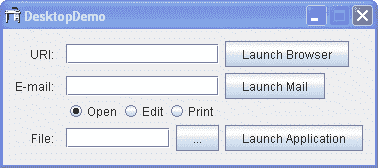
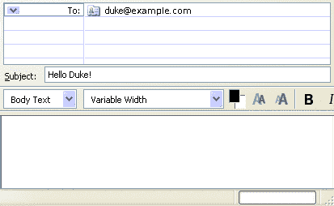

# 如何与 Desktop 类集成

> 原文：[`docs.oracle.com/javase/tutorial/uiswing/misc/desktop.html`](https://docs.oracle.com/javase/tutorial/uiswing/misc/desktop.html)

Java™ 标准版 6 缩小了本机应用程序和 Java 应用程序之间性能和集成之间的差距。除了新的 系统托盘 功能、启动画面 支持和增强的 JTables 打印 功能外，Java SE 版本 6 还提供了 Desktop API (`java.awt.Desktop`) API，允许 Java 应用程序与主机平台上与特定文件类型关联的默认应用程序进行交互。

[`Desktop`](https://docs.oracle.com/javase/8/docs/api/java/awt/Desktop.html) 类提供了新的功能。该 API 源自 JDesktop Integration Components (JDIC) 项目。JDIC 项目的目标是使基于 Java 技术的应用程序成为桌面的“一等公民”，实现无缝集成。JDIC 为 Java 应用程序提供了访问本机桌面提供的功能和设施。关于新的 Desktop API，这意味着 Java 应用程序可以执行以下操作：

+   启动主机系统的默认浏览器并打开特定的统一资源标识符（URI）

+   启动主机系统的默认电子邮件客户端

+   启动应用程序以打开、编辑或打印与这些应用程序关联的文件

* * *

**注意：**

Desktop API 使用主机操作系统的文件关联来启动与特定文件类型关联的应用程序。例如，如果 OpenDocument 文本（.odt）文件扩展名与 OpenOffice Writer 应用程序关联，Java 应用程序可以启动 OpenOffice Writer 来打开、编辑或甚至打印具有该关联的文件。根据主机系统，不同的应用程序可能与不同的操作关联。例如，如果特定文件无法打印，请首先检查其扩展名在给定操作系统上是否具有打印关联。

* * *

使用 [`isDesktopSupported()`](https://docs.oracle.com/javase/8/docs/api/java/awt/Desktop.html#isDesktopSupported--) 方法来确定 Desktop API 是否可用。在 Solaris 操作系统和 Linux 平台上，此 API 依赖于 Gnome 库。如果这些库不可用，该方法将返回 false。在确定 Desktop API 受支持后，即 `isDesktopSupported()` 返回 true 后，应用程序可以使用静态方法 [`getDesktop()`](https://docs.oracle.com/javase/8/docs/api/java/awt/Desktop.html#getDesktop--) 来检索一个 `Desktop` 实例。

如果一个应用在没有键盘、鼠标或显示器的环境中运行（即“无头”环境），`getDesktop()` 方法会抛出一个 `java.awt.HeadlessException` 异常。

一旦检索到，`Desktop` 实例允许应用程序浏览、发送邮件、打开、编辑，甚至打印文件或 URI，但前提是检索到的 `Desktop` 实例支持这些活动。每个活动称为一个操作，每个操作表示为 `Desktop.Action` 枚举实例：

+   `BROWSE` — 代表主机默认浏览器执行的浏览操作。

+   `MAIL` — 代表主机默认电子邮件客户端执行的邮件操作。

+   `OPEN` — 代表应用程序执行的打开操作，与打开特定文件类型相关联。

+   `EDIT` — 代表应用程序执行的编辑操作，与编辑特定文件类型相关联。

+   `PRINT` — 代表应用程序执行的打印操作，与打印特定文件类型相关联。

即使在相同的文件类型上，不同的应用程序也可以注册这些不同的操作。例如，Firefox 浏览器可能会在 OPEN 操作中启动，Emacs 在 EDIT 操作中启动，而打印操作可能使用不同的应用程序。您主机桌面的关联用于确定应该调用哪个应用程序。在 JDK 6 中，使用当前版本的 Desktop API 无法操作桌面文件关联，这些关联只能通过特定于平台的工具在此时创建或更改。

下面的示例展示了上述提到的功能。

* * *

**试一试：**

1.  编译并运行示例，参考 示例索引。

1.  DesktopDemo 对话框将出现。

1.  在 URI 文本字段中输入一个 URI 值，例如 – `https://docs.oracle.com/javase/tutorial`。

1.  按下启动浏览器按钮。

1.  确保默认浏览器窗口打开并加载教程主页。

1.  将 URI 更改为任意值，按下启动浏览器按钮，并确保所请求的网页成功加载。

1.  切换回 DesktopDemo 对话框，在电子邮件文本字段中输入邮件接收者名称。你也可以使用支持 CC、BCC、SUBJECT 和 BODY 字段的 `mailto` 方案，例如 – `duke@example.com?SUBJECT=Hello Duke!`。

1.  按下启动邮件按钮。

1.  默认电子邮件客户端的合成对话框将出现。确保收件人和主题字段如下。

1.  你可以继续撰写消息或尝试在电子邮件字段中输入不同的邮件方案组合。

1.  切换回 DesktopDemo 对话框，按下省略号按钮选择任何文本文件。

1.  选择打开、编辑或打印以设置操作类型，然后按下启动应用程序按钮。

1.  确保操作完成正确。尝试其他文件格式，例如`.odt`、`.html`、`.pdf`。注意：如果尝试编辑`.pdf`文件，则 DesktopDemo 返回以下消息：`无法对<文件名>文件执行给定操作`

以下代码片段提供了有关 DeskDemo 应用程序实现的更多细节。DesktopDemo 构造函数在实例化 UI 后立即禁用少数组件，并检查 Desktop API 是否可用。

```java
 public DesktopDemo() {
        // init all GUI components
        initComponents();
        // disable buttons that launch browser, email client,
        // disable buttons that open, edit, print files
        disableActions();
        // before any Desktop APIs are used, first check whether the API is
        // supported by this particular VM on this particular host
        if (Desktop.isDesktopSupported()) {
            desktop = Desktop.getDesktop();
            // now enable buttons for actions that are supported.
            enableSupportedActions();
        }
        ...

    /**
     * Disable all graphical components until we know
     * whether their functionality is supported.
     */
    private void disableActions() {
        txtBrowserURI.setEnabled(false);
        btnLaunchBrowser.setEnabled(false);

        txtMailTo.setEnabled(false);
        btnLaunchEmail.setEnabled(false);

        rbEdit.setEnabled(false);
        rbOpen.setEnabled(false);
        rbPrint.setEnabled(false);

        txtFile.setEnabled(false);
        btnLaunchApplication.setEnabled(false);        
    }

   ...

```

一旦获得 Desktop 对象，您可以查询该对象以找出支持的具体操作。如果 Desktop 对象不支持特定操作，或者 Desktop API 本身不受支持，DesktopDemo 将简单地保持受影响的图形组件禁用。

```java
/**
     * Enable actions that are supported on this host.
     * The actions are the following: open browser, 
     * open email client, and open, edit, and print
     * files using their associated application.
     */
    private void enableSupportedActions() {
        if (desktop.isSupported(Desktop.Action.BROWSE)) {
            txtBrowserURI.setEnabled(true);
            btnLaunchBrowser.setEnabled(true);
        }

        if (desktop.isSupported(Desktop.Action.MAIL)) {
            txtMailTo.setEnabled(true);
            btnLaunchEmail.setEnabled(true);
        }

        if (desktop.isSupported(Desktop.Action.OPEN)) {
            rbOpen.setEnabled(true);
        }
        if (desktop.isSupported(Desktop.Action.EDIT)) {
            rbEdit.setEnabled(true);
        }
        if (desktop.isSupported(Desktop.Action.PRINT)) {
            rbPrint.setEnabled(true);
        }

        if (rbEdit.isEnabled() || rbOpen.isEnabled() || rbPrint.isEnabled()) {
            txtFile.setEnabled(true);
            btnLaunchApplication.setEnabled(true);
        }
    }

```

`browse(uri)`方法可能会抛出各种异常，包括如果 URI 为 null 则抛出 NullPointerException，如果不支持 BROWSE 操作则抛出 UnsupportedOperationException。如果默认浏览器或应用程序无法找到或启动，则此方法可能会抛出 IOException，如果安全管理器拒绝调用，则可能会抛出 SecurityException。

```java
private void onLaunchBrowser(ActionEvent evt) {
        URI uri = null;
        try {
            uri = new URI(txtBrowserURI.getText());
            desktop.browse(uri);
        } catch(IOException ioe) {
            System.out.println("The system cannot find the " + uri + 
                " file specified");
            //ioe.printStackTrace();
        } catch(URISyntaxException use) {
            System.out.println("Illegal character in path");
            //use.printStackTrace();
        }
    }

```

应用程序可以通过调用此 Desktop 实例的`mail(uriMailTo)`方法启动主机的默认电子邮件客户端（如果支持该操作）。

```java
private void onLaunchMail(ActionEvent evt) {
        String mailTo = txtMailTo.getText();
        URI uriMailTo = null;
        try {
            if (mailTo.length() > 0) {
                uriMailTo = new URI("mailto", mailTo, null);
                desktop.mail(uriMailTo);
            } else {
                desktop.mail();
            }
        } catch(IOException ioe) {
            ioe.printStackTrace();
        } catch(URISyntaxException use) {
            use.printStackTrace();
        }
    }

```

Java 应用程序可以使用`Desktop`类的`open()`、`edit()`和`print()`方法从其关联的应用程序打开、编辑和打印文件。

```java
private void onLaunchDefaultApplication(ActionEvent evt) {
        String fileName = txtFile.getText();
        File file = new File(fileName);

        try {
            switch(action) {
                case OPEN:
                    desktop.open(file);
                    break;
                case EDIT:
                    desktop.edit(file);
                    break;
                case PRINT:
                    desktop.print(file);
                    break;
            }
        } catch (IOException ioe) {
            //ioe.printStackTrace();
            System.out.println("Cannot perform the given operation 
                to the " + file + " file");
        }
    }

```

此演示的完整代码可在`DesktopDemo.java`文件中找到。

## Desktop API

`Desktop`类允许 Java 应用程序启动处理 URI 或文件的本机桌面应用程序。

| 方法 | 目的 |
| --- | --- |
| [isDesktopSupported()](https://docs.oracle.com/javase/8/docs/api/java/awt/Desktop.html#isDesktopSupported--) | 测试当前平台是否支持此类。如果支持，使用`getDesktop()`来检索一个实例。 |
| [getDesktop()](https://docs.oracle.com/javase/8/docs/api/java/awt/Desktop.html#getDesktop--) | 返回当前浏览器上下文的`Desktop`实例。在某些平台上，可能不支持 Desktop API。使用`isDesktopSupported()`方法来确定当前桌面是否受支持。 |
| [isSupported(Desktop.Action)](https://docs.oracle.com/javase/8/docs/api/java/awt/Desktop.html#isSupported-java.awt.Desktop.Action-) | 测试当前平台是否支持某个操作。使用`Desktop.Action`枚举的以下常量：`BROWSE`、`EDIT`、`MAIL`、`OPEN`、`PRINT`。 |
| [browse(URI)](https://docs.oracle.com/javase/8/docs/api/java/awt/Desktop.html#browse-java.net.URI-) | 启动默认浏览器以显示 URI。如果默认浏览器无法处理指定的 URI，则调用注册用于处理指定类型 URI 的应用程序。应用程序是根据 URI 类定义的协议和路径确定的。 |
| [邮件(URI)](https://docs.oracle.com/javase/8/docs/api/java/awt/Desktop.html#mail-java.net.URI-) | 启动用户默认邮件客户端的邮件撰写窗口，填写`mailto: URI`指定的消息字段。 |
| [打开(File)](https://docs.oracle.com/javase/8/docs/api/java/awt/Desktop.html#open-java.io.File-) | 启动关联的应用程序以打开文件。 |
| [编辑(File)](https://docs.oracle.com/javase/8/docs/api/java/awt/Desktop.html#edit-java.io.File-) | 启动关联的编辑器应用程序并打开文件进行编辑。 |
| [打印(File)](https://docs.oracle.com/javase/8/docs/api/java/awt/Desktop.html#print-java.io.File-) | 使用本机桌面打印设施打印文件，使用关联应用程序的打印命令。 |

## 使用 Desktop API 的示例

下表列出了使用 Desktop 类集成的示例。

| 示例 | 描述位置 | 备注 |
| --- | --- | --- |
| `DesktopDemo` | 本节 | 使用指定的 URI 和默认电子邮件客户端启动主机系统的默认浏览器；启动应用程序以打开、编辑或打印文件。 |
