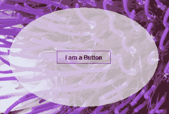

# 如何创建半透明和形状窗口

> 原文：[`docs.oracle.com/javase/tutorial/uiswing/misc/trans_shaped_windows.html`](https://docs.oracle.com/javase/tutorial/uiswing/misc/trans_shaped_windows.html)

从 Java 平台标准版 6（Java SE 6）更新 10 版本开始，您可以向您的 Swing 应用程序添加半透明和形状窗口。本页面涵盖以下主题：

+   支持的功能

+   确定平台的功能

+   如何实现统一半透明度

+   如何实现每像素半透明度

+   如何实现形状窗口

+   Java SE Release 6 Update 10 API

## 支持的功能

此功能作为 JDK 7 版本中的公共 AWT 包的一部分，采用三种形式，如下：

+   您可以创建一个具有*统一*半透明度的窗口，其中每个像素具有相同的半透明度（或 alpha 值）。以下屏幕截图显示了一个具有 45%半透明度的窗口。

    * * *

    **试试这个：**

    单击“启动”按钮以使用[Java™ Web Start](http://www.oracle.com/technetwork/java/javase/javawebstart/index.html)运行 TranslucentWindowDemo 示例。此示例需要[JDK 7](http://www.oracle.com/technetwork/java/javase/downloads/index.html)或更高版本。或者，要执行编译和运行示例，请参考示例索引。

    

    * * *

+   您可以创建一个具有*每像素*半透明度的窗口，其中每个像素都有自己的 alpha 值。使用此功能，您可以例如创建一个通过定义 alpha 值梯度而逐渐消失的窗口。以下屏幕截图显示了一个从顶部（完全半透明）到底部（完全不透明）具有渐变半透明度的窗口。

    * * *

    **试试这个：**

    单击“启动”按钮以使用[Java™ Web Start](http://www.oracle.com/technetwork/java/javase/javawebstart/index.html)运行 GradientTranslucentWindowDemo 示例。此示例需要[JDK 7](http://www.oracle.com/technetwork/java/javase/downloads/index.html)或更高版本。或者，要自行编译和运行示例，请参考示例索引。

    

    * * *

+   您可以创建具有任何 `Shape` 对象的窗口，可以定义。形状窗口可以是不透明的，也可以使用统一的或逐像素的半透明度。以下屏幕截图显示了一个椭圆形状的窗口，透明度为 30%。

    * * *

    **试试这个：**

    点击“启动”按钮以使用[Java™ Web Start](http://www.oracle.com/technetwork/java/javase/javawebstart/index.html)运行 ShapedWindowDemo 示例。此示例需要[JDK 7](http://www.oracle.com/technetwork/java/javase/downloads/index.html)或更高版本。或者，要自行编译和运行示例，请参考示例索引。

    

    * * *

## 确定平台的功能

并非所有平台都支持所有这些功能。当代码尝试在不支持这些功能的平台上调用 `setShape` 或 `setOpacity` 方法时，会抛出 `UnsupportedOperationException` 异常。因此，最佳实践是首先检查平台是否支持您要实现的功能。`GraphicsDevice` 类提供了 [`isWindowTranslucencySupported(GraphicsDevice.WindowTranslucency)`](https://docs.oracle.com/javase/8/docs/api/java/awt/GraphicsDevice.html#isWindowTranslucencySupported-java.awt.GraphicsDevice.WindowTranslucency-) 方法，您可以用于此目的。您将一个在 [`GraphicsDevice.WindowTranslucency`](https://docs.oracle.com/javase/8/docs/api/java/awt/GraphicsDevice.WindowTranslucency.html) 中定义的三个枚举值之一传递给此方法：

+   `TRANSLUCENT` – 底层平台支持具有统一半透明度的窗口，其中每个像素具有相同的 alpha 值。

+   `PERPIXEL_TRANSLUCENT` – 底层平台支持具有逐像素半透明度的窗口。此功能用于实现渐隐窗口。

+   `PERPIXEL_TRANSPARENT` – 底层平台支持自定义形状的窗口。

`GraphicsConfiguration` 类还提供了 [`isTranslucencyCapable`](https://docs.oracle.com/javase/8/docs/api/java/awt/GraphicsConfiguration.html#isTranslucencyCapable--) 方法，用于确定给定 `GraphicsConfiguration` 对象是否支持 `PERPIXEL_TRANSLUCENT` 半透明度。

* * *

**版本说明：** 半透明和自定义形状窗口 API 首次添加到 Java SE 6 Update 10 版本作为私有 API。此功能在 JDK 7 版本中移至公共 AWT 包。本教程描述了 JDK 7 版本中可用的 API。请参阅 Java SE 6 Update 10 API，了解 Java SE 6 Update 10 版本中私有 API 与 JDK 7 版本中公共 API 的映射。

* * *

以下代码显示如何检查所有三种功能：

```java
import static java.awt.GraphicsDevice.WindowTranslucency.*;

// Determine what the default GraphicsDevice can support.
GraphicsEnvironment ge =
    GraphicsEnvironment.getLocalGraphicsEnvironment();
GraphicsDevice gd = ge.getDefaultScreenDevice();

boolean isUniformTranslucencySupported =
    gd.isWindowTranslucencySupported(TRANSLUCENT);
boolean isPerPixelTranslucencySupported =
    gd.isWindowTranslucencySupported(PERPIXEL_TRANSLUCENT);
boolean isShapedWindowSupported =
    gd.isWindowTranslucencySupported(PERPIXEL_TRANSPARENT);

```

* * *

**注意：** 这些功能都不适用于全屏模式下的窗口。在全屏模式下调用任何相关方法会导致抛出`IllegalComponentStateException`异常。

* * *

## 如何实现统一的透明度

你可以通过在`Window`类中调用[`setOpacity(float)`](https://docs.oracle.com/javase/8/docs/api/java/awt/Window.html#setOpacity-float-)方法来创建每个像素具有相同透明度的窗口。传递给该方法的`float`参数表示窗口的透明度，应该是介于 0 和 1 之间的值。数字越小，窗口越透明。还有一个对应的[`getOpacity`](https://docs.oracle.com/javase/8/docs/api/java/awt/Window.html#getOpacity--)方法。

``TranslucentWindowDemo.java``示例创建一个 55% 不透明（45% 半透明）的窗口。如果底层平台不支持半透明窗口，示例将退出。与不透明度相关的代码显示为粗体。

```java
import java.awt.*;
import javax.swing.*;
import static java.awt.GraphicsDevice.WindowTranslucency.*;

public class TranslucentWindowDemo extends JFrame {
    public TranslucentWindowDemo() {
        super("TranslucentWindow");
        setLayout(new GridBagLayout());

        setSize(300,200);
        setLocationRelativeTo(null);
        setDefaultCloseOperation(JFrame.EXIT_ON_CLOSE);

        //Add a sample button.
        add(new JButton("I am a Button"));
    }

    public static void main(String[] args) {
        // Determine if the GraphicsDevice supports translucency.
        GraphicsEnvironment ge = 
            GraphicsEnvironment.getLocalGraphicsEnvironment();
        GraphicsDevice gd = ge.getDefaultScreenDevice();

        //If translucent windows aren't supported, exit.
        if (!gd.isWindowTranslucencySupported(TRANSLUCENT)) {
            System.err.println(
                "Translucency is not supported");
                System.exit(0);
        }

        JFrame.setDefaultLookAndFeelDecorated(true);

        // Create the GUI on the event-dispatching thread
        SwingUtilities.invokeLater(new Runnable() {
            @Override
            public void run() {
                TranslucentWindowDemo tw = new TranslucentWindowDemo();

                // Set the window to 55% opaque (45% translucent).
                tw.setOpacity(0.55f);

                // Display the window.
                tw.setVisible(true);
            }
        });
    }
}

```

注意按钮也受到统一的透明度影响。设置不透明度会影响整个窗口，包括窗口包含的任何组件。

## 如何实现每个像素的半透明效果

创建一个使用每个像素半透明的窗口涉及定义窗口占用的矩形区域上的 alpha 值。当像素的 alpha 值为零时，该像素完全透明。当像素的 alpha 值为 255 时，该像素完全不透明。当像素的 alpha 值为 128 时，该像素为 50% 半透明，依此类推。创建 alpha 值之间的平滑插值的简单方法是使用[`GradientPaint`](https://docs.oracle.com/javase/8/docs/api/java/awt/GradientPaint.html)类。包含的示例使用了这种方法。

调用[`setBackground(new Color(0,0,0,0))`](https://docs.oracle.com/javase/8/docs/api/java/awt/Window.html#setBackground-java.awt.Color-)在窗口上会导致软件使用 alpha 值来渲染每个像素的半透明效果。实际上，调用`setBackground(new Color(0,0,0,alpha)`，其中`alpha`小于 255，会安装每个像素的透明度。因此，如果你调用`setBackground(new Color(0,0,0,128))`并且不做其他操作，窗口将以每个背景像素 50% 的半透明度渲染。然而，如果你正在创建自己的 alpha 值范围，你很可能会想要一个 alpha 值为 0。

虽然公共 API 没有禁止，但通常你会想要在无装饰窗口上启用每个像素的半透明效果。在大多数情况下，在带装饰的窗口上使用每个像素的半透明效果是没有意义的。这样做可能会禁用装饰，或导致其他依赖平台的副作用。

要确定窗口是否使用每个像素的半透明效果，可以使用[`isOpaque`](https://docs.oracle.com/javase/8/docs/api/java/awt/Window.html#isOpaque--)方法。

以下是实现示例所需的步骤。 

1.  在窗口上调用 `setBackground(new Color(0,0,0,0))`。

1.  创建一个覆盖 `paintComponent` 方法的 `JPanel` 实例。

1.  在 `paintComponent` 方法中，创建一个 `GradientPaint` 实例。

1.  在示例中，矩形的顶部具有 alpha 值为 0（最透明），底部具有 alpha 值为 255（最不透明）。`GradientPaint` 类会平滑地插值矩形从顶部到底部的 alpha 值。

1.  将 `GradientPaint` 实例设置为面板的绘制方法。

这是 ``GradientTranslucentWindowDemo.java`` 示例的代码。如果底层平台不支持像素级半透明，此示例将退出。与创建渐变窗口相关的代码以粗体显示。

```java
import java.awt.*;
import javax.swing.*;
import static java.awt.GraphicsDevice.WindowTranslucency.*;

public class GradientTranslucentWindowDemo extends JFrame {
    public GradientTranslucentWindowDemo() {
        super("GradientTranslucentWindow");

        setBackground(new Color(0,0,0,0));
        setSize(new Dimension(300,200));
        setLocationRelativeTo(null);
        setDefaultCloseOperation(JFrame.EXIT_ON_CLOSE);

        JPanel panel = new JPanel() {
            @Override
            protected void paintComponent(Graphics g) {
                if (g instanceof Graphics2D) {
                    final int R = 240;
                    final int G = 240;
                    final int B = 240;

                    Paint p =
                        new GradientPaint(0.0f, 0.0f, new Color(R, G, B, 0),
                            0.0f, getHeight(), new Color(R, G, B, 255), true);
                    Graphics2D g2d = (Graphics2D)g;
                    g2d.setPaint(p);
                    g2d.fillRect(0, 0, getWidth(), getHeight());
                }
            }
        };
        setContentPane(panel);
        setLayout(new GridBagLayout());
        add(new JButton("I am a Button"));
    }

    public static void main(String[] args) {
        // Determine what the GraphicsDevice can support.
        GraphicsEnvironment ge = 
            GraphicsEnvironment.getLocalGraphicsEnvironment();
        GraphicsDevice gd = ge.getDefaultScreenDevice();
        boolean isPerPixelTranslucencySupported = 
            gd.isWindowTranslucencySupported(PERPIXEL_TRANSLUCENT);

        //If translucent windows aren't supported, exit.
        if (!isPerPixelTranslucencySupported) {
            System.out.println(
                "Per-pixel translucency is not supported");
                System.exit(0);
        }

        JFrame.setDefaultLookAndFeelDecorated(true);

        // Create the GUI on the event-dispatching thread
        SwingUtilities.invokeLater(new Runnable() {
            @Override
            public void run() {
                GradientTranslucentWindowDemo gtw = new
                    GradientTranslucentWindowDemo();

                // Display the window.
                gtw.setVisible(true);
            }
        });
    }
}

```

请注意，按钮不受像素级半透明的影响。设置像素级半透明会影响背景像素。如果您想要一个窗口只对背景像素产生统一的半透明效果，可以调用 `setBackground(new Color(0,0,0,alpha))`，其中 `alpha` 指定您期望的半透明度。

## 如何实现形状窗口

你可以通过在 `Window` 类中调用 [`setShape(Shape)`](https://docs.oracle.com/javase/8/docs/api/java/awt/Window.html#setShape-java.awt.Shape-) 方法来创建一个具有形状的窗口。传递给该方法的 `Shape` 参数决定了窗口的裁剪方式。当在窗口上设置形状时，窗口装饰不会重新形成新的形状，因此在无装饰窗口上设置形状效果最佳。

设置窗口形状的最佳实践是在组件事件监听器的 `componentResized` 方法中调用 `setShape`。这种做法将确保为窗口的实际大小正确计算形状。以下示例使用了这种方法。

``ShapedWindowDemo.java`` 示例创建了一个椭圆形状的窗口，透明度为 70%。如果底层平台不支持形状窗口，示例将退出。如果底层平台不支持半透明性，则示例将使用标准不透明窗口。您可以修改此示例以创建一个同时使用像素级半透明的形状窗口。

与窗口形状相关的代码以粗体显示。

```java
import java.awt.*;
import java.awt.event.*;
import javax.swing.*;
import java.awt.geom.Ellipse2D;
import static java.awt.GraphicsDevice.WindowTranslucency.*;

public class ShapedWindowDemo extends JFrame {
    public ShapedWindowDemo() {
        super("ShapedWindow");
        setLayout(new GridBagLayout());

        // It is best practice to set the window's shape in
        // the componentResized method.  Then, if the window
        // changes size, the shape will be correctly recalculated.
        addComponentListener(new ComponentAdapter() {
            // Give the window an elliptical shape.
            // If the window is resized, the shape is recalculated here.
            @Override
            public void componentResized(ComponentEvent e) {
                setShape(new Ellipse2D.Double(0,0,getWidth(),getHeight()));
            }
        });

        setUndecorated(true);
        setSize(300,200);
        setLocationRelativeTo(null);
        setDefaultCloseOperation(JFrame.EXIT_ON_CLOSE);

        add(new JButton("I am a Button"));
    }

    public static void main(String[] args) {
        // Determine what the GraphicsDevice can support.
        GraphicsEnvironment ge = 
            GraphicsEnvironment.getLocalGraphicsEnvironment();
        GraphicsDevice gd = ge.getDefaultScreenDevice();
        final boolean isTranslucencySupported = 
            gd.isWindowTranslucencySupported(TRANSLUCENT);

        //If shaped windows aren't supported, exit.
        if (!gd.isWindowTranslucencySupported(PERPIXEL_TRANSPARENT)) {
            System.err.println("Shaped windows are not supported");
            System.exit(0);
        }

        //If translucent windows aren't supported, 
        //create an opaque window.
        if (!isTranslucencySupported) {
            System.out.println(
                "Translucency is not supported, creating an opaque window");
        }

        // Create the GUI on the event-dispatching thread
        SwingUtilities.invokeLater(new Runnable() {
            @Override
            public void run() {
                ShapedWindowDemo sw = new ShapedWindowDemo();

                // Set the window to 70% translucency, if supported.
                if (isTranslucencySupported) {
                    sw.setOpacity(0.7f);
                }

                // Display the window.
                sw.setVisible(true);
            }
        });
    }
}

```

## Java SE 6 Update 10 API

在更新版本中更改公共 API 是不允许的，因此当在 Java SE 6 Update 10 版本中添加了半透明和形状窗口功能时，它是在私有的 `com.sun.awt.AWTUtilities` 类中实现的。对于 JDK 7 版本，此功能已移至公共 AWT 包。以下表格显示了私有方法如何映射到公共方法。

| Java SE 6 Update 10 中的方法 | JDK 7 中的等效方法 |
| --- | --- |
| `AWTUtilities.isTranslucencySupported(Translucency)` | `GraphicsDevice.isWindowTranslucencySupported(WindowTranslucency)` |
| `AWTUtilities.isTranslucencyCapable(GraphicsConfiguration)` | `GraphicsConfiguration.isTranslucencyCapable()` |
| `AWTUtilities.setWindowOpacity(Window, float)` | `Window.setOpacity(float)` |
| `AWTUtilities.setWindowShape(Window, Shape)` | `Window.setShape(Shape)` |
| `AWTUtilities.setWindowOpaque(boolean)` | `Window.setBackground(Color)` 通过将`new Color(0,0,0,alpha)`传递给这个方法，其中`alpha`小于 255，可以实现逐像素的半透明。 |
