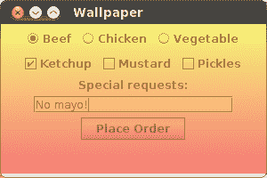
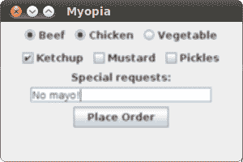
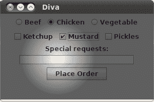
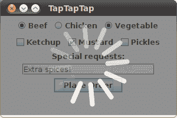
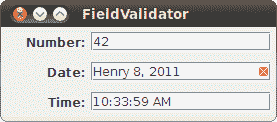

# 如何使用`JLayer`类装饰组件

> 原文：[`docs.oracle.com/javase/tutorial/uiswing/misc/jlayer.html`](https://docs.oracle.com/javase/tutorial/uiswing/misc/jlayer.html)

`JLayer`类是 Swing 组件的灵活而强大的*装饰器*。它使您能够在组件上绘制并响应组件事件，而无需直接修改底层组件。

本文档描述了展示`JLayer`类功能的示例。提供完整的源代码。

+   使用`JLayer`类

+   使用`LayerUI`类

+   在组件上绘制

+   响应事件

+   动画繁忙指示器

+   验证文本字段

要了解本页面上的材料的简要介绍，请观看以下视频。

[`www.youtube.com/embed/6mQYsWCkx4g`](http://www.youtube.com/embed/6mQYsWCkx4g)

视频需要启用 JavaScript 的网络浏览器和互联网连接。如果无法查看视频，请尝试[在 YouTube 上观看](http://www.youtube.com/watch?v=6mQYsWCkx4g)。

## 使用`JLayer`类

`javax.swing.JLayer`类是一个团队的一半。另一半是`javax.swing.plaf.LayerUI`类。假设您想在`JButton`对象上方进行一些自定义绘制（*装饰*`JButton`对象）。您想要装饰的组件是*目标*。

+   创建目标组件。

+   创建`LayerUI`子类的实例来进行绘制。

+   创建包装目标和`LayerUI`对象的`JLayer`对象。

+   使用`JLayer`对象在用户界面中就像使用目标组件一样。

例如，要将`JPanel`子类的实例添加到`JFrame`对象中，可以类似地执行以下操作：

```java
JFrame f = new JFrame();

JPanel panel = createPanel();

f.add (panel);

```

要装饰`JPanel`对象，可以类似地执行以下操作：

```java
JFrame f = new JFrame();

JPanel panel = createPanel();
LayerUI<JPanel> layerUI = new MyLayerUISubclass();
JLayer<JPanel> jlayer = new JLayer<JPanel>(panel, layerUI);

f.add (jlayer);

```

使用泛型确保`JPanel`对象和`LayerUI`对象是兼容的类型。在上一个示例中，`JLayer`对象和`LayerUI`对象都与`JPanel`类一起使用。

`JLayer`类通常使用其视图组件的确切类型进行泛型化，而`LayerUI`类设计用于与其泛型参数或任何祖先的`JLayer`类一起使用。

例如，可以将`LayerUI<JComponent>`对象与`JLayer<AbstractButton>`对象一起使用。

`LayerUI`对象负责为`JLayer`对象进行自定义装饰和事件处理。当您创建`LayerUI`子类的实例时，您的自定义行为可以适用于具有适当泛型类型的每个`JLayer`对象。这就是为什么`JLayer`类是`final`的；所有自定义行为都封装在您的`LayerUI`子类中，因此不需要创建`JLayer`子类。

## 使用`LayerUI`类

`LayerUI`类大部分行为都继承自`ComponentUI`类。以下是最常重写的方法：

+   当目标组件需要绘制时，会调用`paint(Graphics g, JComponent c)`方法。为了以与 Swing 相同的方式呈现组件，调用`super.paint(g, c)`方法。

+   当你的`LayerUI`子类与一个组件关联时，会调用`installUI(JComponent c)`方法。在这里执行任何必要的初始化。传入的组件是相应的`JLayer`对象。使用`JLayer`类的`getView()`方法检索目标组件。

+   当你的`LayerUI`子类不再与给定组件关联时，会调用`uninstallUI(JComponent c)`方法。如果需要，进行清理。

## 在组件上绘制

要使用`JLayer`类，你需要一个良好的`LayerUI`子类。最简单的`LayerUI`类改变了组件的绘制方式。例如，这里有一个在组件上绘制透明颜色渐变的示例。

```java
class WallpaperLayerUI extends LayerUI<JComponent> {
  @Override
  public void paint(Graphics g, JComponent c) {
    super.paint(g, c);

    Graphics2D g2 = (Graphics2D) g.create();

    int w = c.getWidth();
    int h = c.getHeight();
    g2.setComposite(AlphaComposite.getInstance(
            AlphaComposite.SRC_OVER, .5f));
    g2.setPaint(new GradientPaint(0, 0, Color.yellow, 0, h, Color.red));
    g2.fillRect(0, 0, w, h);

    g2.dispose();
  }
}

```

`paint()`方法是自定义绘制发生的地方。调用`super.paint()`方法会绘制`JPanel`对象的内容。在设置了 50%透明度的合成后，绘制颜色渐变。

定义了`LayerUI`子类之后，使用它很简单。这里是一些使用`WallpaperLayerUI`类的源代码：

```java
import java.awt.*;
import javax.swing.*;
import javax.swing.plaf.LayerUI;

public class Wallpaper {
  public static void main(String[] args) {
    javax.swing.SwingUtilities.invokeLater(new Runnable() {
      public void run() {
        createUI();
      }
    });
  }

  public static void createUI() {
    JFrame f = new JFrame("Wallpaper");

    JPanel panel = createPanel();
    LayerUI<JComponent> layerUI = new WallpaperLayerUI();
    JLayer<JComponent> jlayer = new JLayer<JComponent>(panel, layerUI);

    f.add (jlayer);

    f.setSize(300, 200);
    f.setDefaultCloseOperation (JFrame.EXIT_ON_CLOSE);
    f.setLocationRelativeTo (null);
    f.setVisible (true);
  }

  private static JPanel createPanel() {
    JPanel p = new JPanel();

    ButtonGroup entreeGroup = new ButtonGroup();
    JRadioButton radioButton;
    p.add(radioButton = new JRadioButton("Beef", true));
    entreeGroup.add(radioButton);
    p.add(radioButton = new JRadioButton("Chicken"));
    entreeGroup.add(radioButton);
    p.add(radioButton = new JRadioButton("Vegetable"));
    entreeGroup.add(radioButton);

    p.add(new JCheckBox("Ketchup"));
    p.add(new JCheckBox("Mustard"));
    p.add(new JCheckBox("Pickles"));

    p.add(new JLabel("Special requests:"));
    p.add(new JTextField(20));

    JButton orderButton = new JButton("Place Order");
    p.add(orderButton);

    return p;
  }
}

```

这是结果：



源代码：

`Wallpaper NetBeans 项目`

`Wallpaper.java`

使用[Java Web Start](http://www.oracle.com/technetwork/java/javase/javawebstart/index.html)运行：


`LayerUI`类的`paint()`方法让你完全控制组件的绘制方式。这里是另一个`LayerUI`子类，展示了如何使用 Java 2D 图像处理修改面板的整个内容：

```java
class BlurLayerUI extends LayerUI<JComponent> {
  private BufferedImage mOffscreenImage;
  private BufferedImageOp mOperation;

  public BlurLayerUI() {
    float ninth = 1.0f / 9.0f;
    float[] blurKernel = {
      ninth, ninth, ninth,
      ninth, ninth, ninth,
      ninth, ninth, ninth
    };
    mOperation = new ConvolveOp(
            new Kernel(3, 3, blurKernel),
            ConvolveOp.EDGE_NO_OP, null);
  }

  @Override
  public void paint (Graphics g, JComponent c) {
    int w = c.getWidth();
    int h = c.getHeight();

    if (w == 0 || h == 0) {
      return;
    }

    // Only create the off-screen image if the one we have
    // is the wrong size.
    if (mOffscreenImage == null ||
            mOffscreenImage.getWidth() != w ||
            mOffscreenImage.getHeight() != h) {
      mOffscreenImage = new BufferedImage(w, h, BufferedImage.TYPE_INT_RGB);
    }

    Graphics2D ig2 = mOffscreenImage.createGraphics();
    ig2.setClip(g.getClip());
    super.paint(ig2, c);
    ig2.dispose();

    Graphics2D g2 = (Graphics2D)g;
    g2.drawImage(mOffscreenImage, mOperation, 0, 0);
  }
}

```

在`paint()`方法中，面板被渲染到一个离屏图像中。离屏图像使用卷积运算符进行处理，然后绘制到屏幕上。

整个用户界面仍然活跃，只是模糊了：



源代码：

`Myopia NetBeans 项目`

`Myopia.java`

使用[Java Web Start](http://www.oracle.com/technetwork/java/javase/javawebstart/index.html)运行：


## 响应事件

你的`LayerUI`子类也可以接收其对应组件的所有事件。然而，`JLayer`实例必须注册对特定类型事件的兴趣。这是通过`JLayer`类的`setLayerEventMask()`方法实现的。通常情况下，这个调用是在`LayerUI`类的`installUI()`方法中进行初始化时进行的。

例如，以下摘录显示了一个`LayerUI`子类的部分内容，该子类注册接收鼠标和鼠标移动事件。

```java
public void installUI(JComponent c) {
  super.installUI(c);
  JLayer jlayer = (JLayer)c;
  jlayer.setLayerEventMask(
    AWTEvent.MOUSE_EVENT_MASK |
    AWTEvent.MOUSE_MOTION_EVENT_MASK
  );
}

```

所有发送到你的`JLayer`子类的事件都会路由到一个事件处理方法，其名称与事件类型匹配。例如，你可以通过重写相应的方法来响应鼠标和鼠标移动事件：

```java
protected void processMouseEvent(MouseEvent e, JLayer l) {
  // ...
}

protected void processMouseMotionEvent(MouseEvent e, JLayer l) {
  // ...
}

```

以下是一个`LayerUI`子类，它在面板内鼠标移动时绘制一个半透明的圆圈。

```java
class SpotlightLayerUI extends LayerUI<JPanel> {
  private boolean mActive;
  private int mX, mY;

  @Override
  public void installUI(JComponent c) {
    super.installUI(c);
    JLayer jlayer = (JLayer)c;
    jlayer.setLayerEventMask(
      AWTEvent.MOUSE_EVENT_MASK |
      AWTEvent.MOUSE_MOTION_EVENT_MASK
    );
  }

  @Override
  public void uninstallUI(JComponent c) {
    JLayer jlayer = (JLayer)c;
    jlayer.setLayerEventMask(0);
    super.uninstallUI(c);
  }

  @Override
  public void paint (Graphics g, JComponent c) {
    Graphics2D g2 = (Graphics2D)g.create();

    // Paint the view.
    super.paint (g2, c);

    if (mActive) {
      // Create a radial gradient, transparent in the middle.
      java.awt.geom.Point2D center = new java.awt.geom.Point2D.Float(mX, mY);
      float radius = 72;
      float[] dist = {0.0f, 1.0f};
      Color[] colors = {new Color(0.0f, 0.0f, 0.0f, 0.0f), Color.BLACK};
      RadialGradientPaint p =
          new RadialGradientPaint(center, radius, dist, colors);
      g2.setPaint(p);
      g2.setComposite(AlphaComposite.getInstance(
          AlphaComposite.SRC_OVER, .6f));
      g2.fillRect(0, 0, c.getWidth(), c.getHeight());
    }

    g2.dispose();
  }

  @Override
  protected void processMouseEvent(MouseEvent e, JLayer l) {
    if (e.getID() == MouseEvent.MOUSE_ENTERED) mActive = true;
    if (e.getID() == MouseEvent.MOUSE_EXITED) mActive = false;
    l.repaint();
  }

  @Override
  protected void processMouseMotionEvent(MouseEvent e, JLayer l) {
    Point p = SwingUtilities.convertPoint(e.getComponent(), e.getPoint(), l);
    mX = p.x;
    mY = p.y;
    l.repaint();
  }
}

```

`mActive`变量指示鼠标是否在面板坐标内。在`installUI()`方法中，调用`setLayerEventMask()`方法来指示`LayerUI`子类对接收鼠标和鼠标移动事件的兴趣。

在`processMouseEvent()`方法中，根据鼠标位置设置`mActive`标志。在`processMouseMotionEvent()`方法中，鼠标移动的坐标存储在`mX`和`mY`成员变量中，以便稍后在`paint()`方法中使用。

`paint()`方法显示了面板的默认外观，然后叠加了一个径向渐变以实现聚光灯效果：



源代码：

`Diva NetBeans Project`

`Diva.java`

使用[Java Web Start](http://www.oracle.com/technetwork/java/javase/javawebstart/index.html)运行：


## 动画繁忙指示器

这个示例是一个动画繁忙指示器。它展示了在`LayerUI`子类中的动画，并具有淡入和淡出效果。它比之前的示例更复杂，但基于相同的原则定义了一个用于自定义绘制的`paint()`方法。

点击**下订单**按钮，查看 4 秒钟的繁忙指示器。注意面板变灰并且指示器旋转。指示器的元素具有不同程度的透明度。

`LayerUI`子类`WaitLayerUI`类展示了如何触发属性更改事件以更新组件。`WaitLayerUI`类使用`Timer`对象以每秒 24 次的速度更新其状态。这是在计时器的目标方法`actionPerformed()`中完成的。

`actionPerformed()`方法使用`firePropertyChange()`方法指示内部状态已更新。这会触发对`applyPropertyChange()`方法的调用，该方法重新绘制`JLayer`对象：



源代码：

`TapTapTap NetBeans 项目`

`TapTapTap.java`

使用 [Java Web Start](http://www.oracle.com/technetwork/java/javase/javawebstart/index.html) 运行：


## 验证文本字段

本文档中的最后一个示例展示了如何使用 `JLayer` 类装饰文本字段，以显示它们是否包含有效数据。虽然其他示例使用 `JLayer` 类来包装面板或一般组件，但此示例显示了如何专门包装 `JFormattedTextField` 组件。它还演示了单个 `LayerUI` 子类实现可以用于多个 `JLayer` 实例。

`JLayer` 类用于为具有无效数据的字段提供视觉指示。当 `ValidationLayerUI` 类绘制文本字段时，如果字段内容无法解析，它会绘制一个红色的 X。以下是一个示例：



源代码：

`FieldValidator NetBeans 项目`

`FieldValidator.java`

使用 [Java Web Start](http://www.oracle.com/technetwork/java/javase/javawebstart/index.html) 运行：


