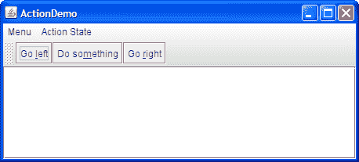
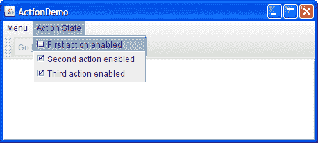
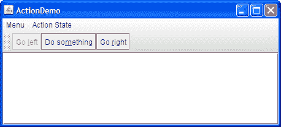

# 如何使用动作

> 原文：[`docs.oracle.com/javase/tutorial/uiswing/misc/action.html`](https://docs.oracle.com/javase/tutorial/uiswing/misc/action.html)

[`Action`](https://docs.oracle.com/javase/8/docs/api/javax/swing/Action.html)可用于将功能和状态与组件分离。例如，如果有两个或更多执行相同功能的组件，请考虑使用`Action`对象来实现该功能。`Action`对象是一个 action listener，不仅提供动作事件处理，还提供对动作事件触发组件的状态的集中处理，例如工具栏按钮、菜单项、常用按钮和文本字段。动作可以处理的状态包括文本、图标、助记键、启用和选定状态。

通常使用`setAction`方法将动作附加到组件。当在组件上调用`setAction`时会发生什么：

+   组件的状态会更新以匹配`Action`的状态。例如，如果`Action`的文本和图标值已设置，则组件的文本和图标将设置为这些值。

+   `Action`对象在组件上注册为动作监听器。

+   如果`Action`的状态发生变化，组件的状态将更新以匹配`Action`。例如，如果更改动作的启用状态，则所有附加到它的组件将更改其启用状态以匹配动作。

这里有一个示例，创建一个工具栏按钮和菜单项，执行相同的功能：

```java
Action leftAction = new LeftAction(); *//LeftAction code is shown later*
...
button = new JButton(leftAction)
...
menuItem = new JMenuItem(leftAction);

```

要创建一个`Action`对象，通常创建[`AbstractAction`](https://docs.oracle.com/javase/8/docs/api/javax/swing/AbstractAction.html)的子类，然后实例化它。在子类中，必须实现`actionPerformed`方法，在动作事件发生时做出适当反应。这里有一个创建和实例化`AbstractAction`子类的示例：

```java
leftAction = new LeftAction("Go left", anIcon,
             "This is the left button.",
             new Integer(KeyEvent.VK_L));
...
class LeftAction extends AbstractAction {
    public LeftAction(String text, ImageIcon icon,
                      String desc, Integer mnemonic) {
        super(text, icon);
        putValue(SHORT_DESCRIPTION, desc);
        putValue(MNEMONIC_KEY, mnemonic);
    }
    public void actionPerformed(ActionEvent e) {
        displayResult("Action for first button/menu item", e);
    }
}

```

当前面的代码创建的动作附加到按钮和菜单项时，按钮和菜单项将显示与动作关联的文本和图标。按钮和菜单项上使用`L`字符作为助记键，并且它们的工具提示文本设置为`SHORT_DESCRIPTION`字符串，后跟助记键的表示。

例如，我们提供了一个简单的示例，`ActionDemo.java`，定义了三个操作。每个操作都附加到一个按钮和一个菜单项。由于为每个按钮的操作设置了助记符值，按键序列`Alt-L`激活左按钮，`Alt-M`激活中间按钮，`Alt-R`激活右按钮。左按钮的工具提示显示*这是左按钮。Alt-L.* 所有这些配置都是自动完成的，程序不需要显式调用设置助记符或工具提示文本。正如我们稍后将展示的，程序确实调用设置按钮文本，但只是为了避免使用操作已设置的值。



* * *

**试试这个：**

1.  点击“启动”按钮以使用[Java™ Web Start](http://www.oracle.com/technetwork/java/javase/javawebstart/index.html)运行 ActionDemo（[下载 JDK 7 或更高版本](http://www.oracle.com/technetwork/java/javase/downloads/index.html)）。或者，要自行编译和运行示例，请参考示例索引。

    

1.  从左侧菜单中选择顶部项目（**菜单 > 向左**）。

    文本区域显示一些文本，标识事件源和接收事件的操作监听器。

1.  点击工具栏中最左边的按钮。

    文本区域再次显示有关事件的信息。请注意，尽管事件的来源不同，但两个事件都是由相同的操作监听器检测到的：附加到组件的`Action`对象。

1.  从**操作状态**菜单中选择顶部项目。

    这将禁用“向左”`Action`对象，进而禁用其关联的菜单项和按钮。

* * *

当“向左”操作被禁用时，用户看到的情况如下：

|  |  |
| --- | --- |

这是禁用“向左”操作的代码：

```java
boolean selected = ...//*true if the action should be enabled;*
                      //*false, otherwise*
leftAction.setEnabled(selected);

```

在使用`Action`创建组件后，您可能需要自定义它们。例如，您可能希望通过添加或删除图标或文本来自定义其中一个组件的外观。例如，`ActionDemo.java`的菜单中没有图标，按钮中也没有文本。以下是实现此目的的代码：

```java
menuItem = new JMenuItem();
menuItem.setAction(leftAction);
menuItem.setIcon(null); //arbitrarily chose not to use icon in menu
...
button = new JButton();
button.setAction(leftAction);
button.setText(""); //an icon-only button

```

我们选择通过将图标属性设置为`null`，将文本设置为空字符串，从同一个操作中创建一个仅图标的按钮和一个仅文本的菜单项。然而，如果`Action`的属性发生变化，小部件可能会尝试再次从`Action`中重置图标和文本。

## 操作 API

以下表格列出了常用的`Action`构造函数和方法。 使用`Action`对象的 API 分为三类：

+   支持设置/获取操作的组件

+   创建和使用 AbstractAction

+   操作属性

支持设置/获取操作的组件

| 类 | 目的 |
| --- | --- |

| [AbstractButton](https://docs.oracle.com/javase/8/docs/api/javax/swing/AbstractButton.html#setAction-javax.swing.Action-) [JComboBox](https://docs.oracle.com/javase/8/docs/api/javax/swing/JComboBox.html#setAction-javax.swing.Action-)

[JTextField](https://docs.oracle.com/javase/8/docs/api/javax/swing/JTextField.html#setAction-javax.swing.Action-) | 这些组件及其子类可以通过`setAction`直接分配一个操作。 有关通常与操作关联的组件的更多信息，请参阅关于工具栏按钮、菜单项、常见按钮和文本字段的部分。 有关每个组件从`Action`中获取哪些属性的详细信息，请参阅相关类的 API 文档[`configurePropertiesFromAction`](https://docs.oracle.com/javase/8/docs/api/javax/swing/JMenuItem.html#configurePropertiesFromAction-javax.swing.Action-)方法。 还请参考[`buttonActions`](https://docs.oracle.com/javase/8/docs/api/javax/swing/Action.html#buttonActions)表。 |

创建和使用 AbstractAction

| 构造函数或方法 | 目的 |
| --- | --- |

| [AbstractAction()](https://docs.oracle.com/javase/8/docs/api/javax/swing/AbstractAction.html#AbstractAction--) [AbstractAction(String)](https://docs.oracle.com/javase/8/docs/api/javax/swing/AbstractAction.html#AbstractAction-java.lang.String-)

[AbstractAction(String, Icon)](https://docs.oracle.com/javase/8/docs/api/javax/swing/AbstractAction.html#AbstractAction-java.lang.String-javax.swing.Icon-) | 创建一个`Action`对象。 通过参数，您可以指定要在操作附加到的组件中使用的文本和图标。 |

| [void setEnabled(boolean)](https://docs.oracle.com/javase/8/docs/api/javax/swing/AbstractAction.html#setEnabled-boolean-) [boolean isEnabled()](https://docs.oracle.com/javase/8/docs/api/javax/swing/AbstractAction.html#isEnabled--) | 设置或获取操作控制的组件是否启用。 调用`setEnabled(false)`会禁用操作控制的所有组件。 类似地，调用`setEnabled(true)`会启用操作的组件。 |
| --- | --- |
| [void putValue(String, Object)](https://docs.oracle.com/javase/8/docs/api/javax/swing/AbstractAction.html#putValue-java.lang.String-java.lang.Object-) [Object getValue(String)](https://docs.oracle.com/javase/8/docs/api/javax/swing/AbstractAction.html#getValue-java.lang.String-) | 设置或获取与指定键关联的对象。 用于设置和获取与操作关联的属性。 |

操作属性

该表定义了可以在动作上设置的属性。第二列列出了哪些组件会自动使用这些属性（以及具体调用的方法）。例如，在附加到菜单项的动作上设置`ACCELERATOR_KEY`，意味着将自动调用`JMenuItem.setAccelerator(KeyStroke)`。

| 属性 | 自动应用于：类

*(调用方法)* | 目的 |

| [ACCELERATOR_KEY](https://docs.oracle.com/javase/8/docs/api/javax/swing/Action.html#ACCELERATOR_KEY) | `JMenuItem` (*setAccelerator*) | 用作动作加速器的`KeyStroke`。有关加速器与助记键的讨论，请参见启用键盘操作。 |
| --- | --- | --- |
| [ACTION_COMMAND_KEY](https://docs.oracle.com/javase/8/docs/api/javax/swing/Action.html#ACTION_COMMAND_KEY) | `AbstractButton`, `JCheckBox`, `JRadioButton` (*setActionCommand*) | 与`ActionEvent`相关联的命令字符串。 |
| [LONG_DESCRIPTION](https://docs.oracle.com/javase/8/docs/api/javax/swing/Action.html#LONG_DESCRIPTION) | 无 | 动作的更长描述。可用于上下文相关的帮助。 |
| [MNEMONIC_KEY](https://docs.oracle.com/javase/8/docs/api/javax/swing/Action.html#MNEMONIC_KEY) | `AbstractButton`, `JMenuItem`, `JCheckBox`, `JRadioButton` (*setMnemonic*) | 动作的助记键。有关加速器与助记键的讨论，请参见启用键盘操作。 |
| [NAME](https://docs.oracle.com/javase/8/docs/api/javax/swing/Action.html#NAME) | `AbstractButton`, `JMenuItem`, `JCheckBox`, `JRadioButton` (*setText*) | 动作的名称。您可以在使用`AbstractAction(String)`或`AbstractAction(String, Icon)`构造函数创建动作时设置此属性。 |
| [SHORT_DESCRIPTION](https://docs.oracle.com/javase/8/docs/api/javax/swing/Action.html#SHORT_DESCRIPTION) | `AbstractButton`, `JCheckBox`, `JRadioButton` (*setToolTipText*) | 动作的简短描述。 |
| [SMALL_ICON](https://docs.oracle.com/javase/8/docs/api/javax/swing/Action.html#SMALL_ICON) | `AbstractButton`, `JMenuItem` (*setIcon*) | 工具栏或按钮上用于动作的图标。您可以在使用`AbstractAction(name, icon)`构造函数创建动作时设置此属性。 |

## 使用动作的示例

以下示例使用`Action`对象。

| 示例 | 描述位置 | 备注 |
| --- | --- | --- |
| `ActionDemo` | 本节 | 使用动作将按钮和菜单项绑定到同一个函数。 |
| `TextComponentDemo` | 文本组件特性 | 使用文本操作创建菜单项，用于文本编辑命令，如剪切、复制和粘贴，并将按键绑定到插入符移动。还实现了自定义`AbstractAction`子类来实现撤销和重做。关于文本操作的讨论始于概念：关于编辑器工具包。 |
