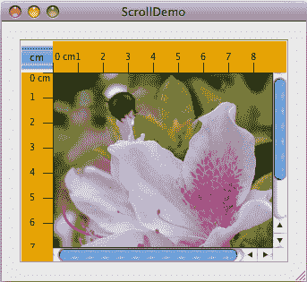
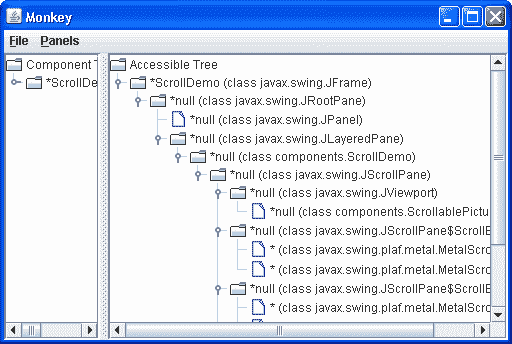
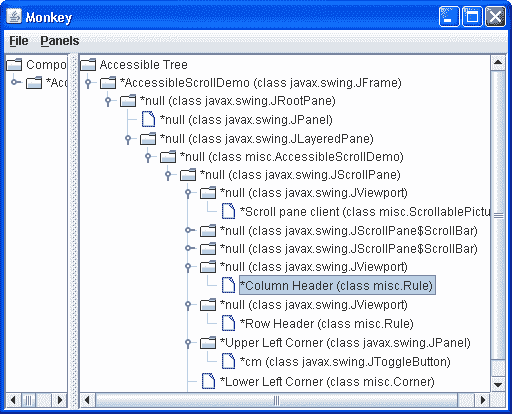
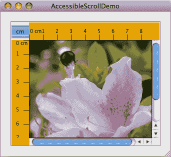
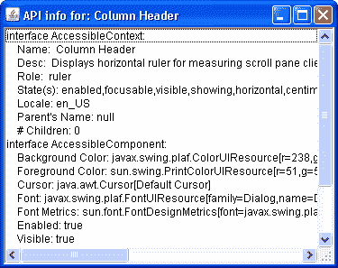
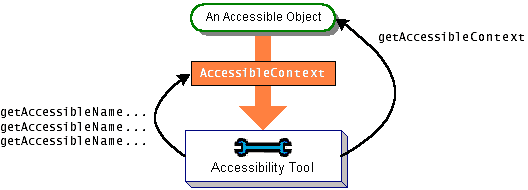

# 如何支持辅助技术

> 原文：[`docs.oracle.com/javase/tutorial/uiswing/misc/access.html`](https://docs.oracle.com/javase/tutorial/uiswing/misc/access.html)

你可能想知道辅助技术到底是什么，以及为什么你应该关心。主要来说，辅助技术存在是为了让有永久或暂时残疾的人能够使用计算机。例如，如果你患上了腕管综合症，你可以使用辅助技术完成工作而不用手。

辅助技术 — 语音界面、屏幕阅读器、替代输入设备等等 — 不仅对残疾人有用，也适用于在非办公环境中使用计算机的人群。例如，如果你被困在交通拥堵中，你可以使用辅助技术来检查你的电子邮件，只需使用语音输入和输出。支持辅助技术的信息也可以用于其他工具，比如自动化 GUI 测试工具和输入设备如触摸屏。辅助技术通过使用在[`javax.accessibility`](https://docs.oracle.com/javase/8/docs/api/javax/accessibility/package-summary.html)包中定义的辅助功能 API 从组件获取信息。

因为对辅助功能 API 的支持内置在 Swing 组件中，你的 Swing 程序可能会很好地与辅助技术配合工作，即使你没有做任何特殊处理。例如，辅助技术可以自动获取以下代码设置的文本信息：

```java
JButton button = new JButton("I'm a Swing button!");
label = new JLabel(labelPrefix + "0    ");
label.setText(labelPrefix + numClicks);
JFrame frame = new JFrame("SwingApplication");

```

辅助技术还可以获取与组件关联的工具提示文本（如果有的话），并用它来向用户描述组件。

使你的程序与辅助技术顺畅配合是很容易的，而且在美国可能是联邦法律要求的。

本节的其余部分涵盖了以下主题：

+   支持辅助功能的规则

+   辅助功能测试

+   在组件上设置可访问名称和描述

+   概念：辅助功能的工作原理

+   使自定义组件可访问

+   辅助功能 API

+   使用辅助功能 API 的示例

## 支持辅助功能的规则

以下是一些你可以做的事情，使你的程序尽可能与辅助技术配合良好：

+   如果一个组件没有显示一个短字符串（作为其默认名称），可以使用`setAccessibleName`方法指定一个名称。你可能想为仅包含图像的按钮、提供逻辑分组的面板、文本区域等设置这个名称。

+   在有意义的情况下为组件设置工具提示文本。例如：

    ```java
    aJComponent.setToolTipText(
         "Clicking this component causes XYZ to happen.");

    ```

+   如果你不想为一个组件提供工具提示，可以使用`setAccessibleDescription`方法提供一个描述，辅助技术可以向用户提供。例如：

    ```java
    aJComponent.getAccessibleContext().
        setAccessibleDescription(
        "Clicking this component causes XYZ to happen.");

    ```

+   尽可能指定键盘替代方案。确保您的程序只能使用键盘。尝试隐藏鼠标！请注意，如果焦点在可编辑文本组件中，则可以使用 Shift-Tab 将焦点移动到下一个组件。

    对于键盘替代方案的支持因组件而异。按钮使用`setMnemonic`方法支持键盘替代方案。菜单继承按钮助记符支持，并且还支持加速键，如启用键盘操作中所述。其他组件可以使用键绑定将用户输入与程序操作关联起来。

+   为程序中的所有`ImageIcon`对象分配文本描述。您可以使用`setDescription`方法或`ImageIcon`构造函数的一个`String`形式来设置此属性。

+   如果一组组件形成一个逻辑组，请尝试将它们放入一个容器中。例如，使用`JPanel`来包含单选按钮组中的所有单选按钮。

+   每当您有一个描述另一个组件的标签时，请使用`setLabelFor`方法，以便辅助技术可以找到与标签关联的组件。当标签显示另一个组件的助记符（例如文本字段）时，这一点尤为重要。

+   如果您创建了自定义组件，请确保它支持可访问性。特别要注意的是，`JComponent`的子类不会自动支持可访问性。继承自其他 Swing 组件的自定义组件应根据需要覆盖继承的可访问性信息。有关更多信息，请参见概念：可访问性工作原理和使自定义组件可访问。

+   使用提供的辅助功能实用程序示例来测试您的程序。尽管这些示例的主要目的是向程序员展示如何在实现辅助技术时使用辅助功能 API，但这些示例对于测试可访问性的应用程序程序也非常有用。测试可访问性展示了`ScrollDemo`与 Monkey 一起运行的情况，Monkey 是辅助功能实用程序示例之一。Monkey 显示程序中可访问组件的树，并允许您与这些组件进行交互。

+   最后，不要破坏免费获得的内容！如果您的 GUI 有一个不可访问的容器 — 例如，您自己的`Container`或`JComponent`的子类或任何其他不实现`Accessible`接口的容器 — 那么该容器内的任何组件都将无法访问。

## 测试可访问性

随附辅助工具的示例可以让您了解您的程序的可访问性如何。有关获取这些实用程序的说明，请参阅[Java SE 桌面可访问性主页](http://www.oracle.com/technetwork/java/javase/tech/index-jsp-140174.html)。按照辅助工具文档中的说明设置 Java 虚拟机（VM）以自动运行一个或多个实用程序。

让我们使用一个辅助工具来比较我们的演示程序的原始版本和已应用支持可访问性规则的版本。这里是一个名为`ScrollDemo`的程序的图片。



* * *

**试试这个：**

1.  点击启动按钮运行`ScrollDemo`，使用[Java™ Web Start](http://www.oracle.com/technetwork/java/javase/javawebstart/index.html)（[下载 JDK 7 或更高版本](http://www.oracle.com/technetwork/java/javase/downloads/index.html)）。或者，要自行编译和运行示例，请参考示例索引。

    

1.  接下来，点击启动按钮运行`AccessibleScrollDemo`，使用[Java™ Web Start](http://www.oracle.com/technetwork/java/javase/javawebstart/index.html)（[下载 JDK 7 或更高版本](http://www.oracle.com/technetwork/java/javase/downloads/index.html)）。或者，要自行编译和运行示例，请参考示例索引。

1.  将两个版本并排进行比较。唯一显著的区别是在可访问版本中，**cm**切换按钮和照片具有工具提示。

1.  现在在名为 Monkey 的辅助工具下运行这两个版本。请注意，当辅助工具已被下载并在`accessibility.properties`文件中配置时，当您点击运行 ScrollDemo 和 AccessibleScrollDemo 链接（在步骤 1 和 2 中）时，Monkey 窗口会自动弹出。

    如果 Monkey 窗口在启动时没有出现，问题可能是`accessibility.properties`文件不存在于 Java Web Start 使用的 VM 版本中。您可以通过运行 Java Web Start 应用程序管理器并选择**文件 > 首选项 > Java**来更改您使用的 VM。

1.  请注意，当 Monkey 窗口弹出时，您需要选择**文件 > 刷新树**以查看信息出现在`可访问树`下。然后，您可以通过依次单击每个文件夹图标显示的水平图标来展开树。当树已经展开时，您可以查看各个组件的详细信息。在修改后的版本中，原始版本中无法访问的自定义组件（规则和角落）现在可以访问。这对辅助技术可能产生很大的影响。

* * *

这是 Monkey 在`ScrollDemo`上运行的快照：



分割窗格的左侧显示程序的实际组件层次结构。右侧显示层次结构中的可访问组件，这是我们感兴趣的。

首先要注意的是，即使在`ScrollDemo`中没有明确的支持，Monkey 也能够发现关于程序中各个组件的许多信息。大多数组件及其子级都显示在树中。然而，大多数组件的名称为空（null），这相当没有帮助。描述也为空。

进一步的问题出现在程序的自定义组件上。两个标尺是无法访问的，因此它们不包括在可访问树中。包含标尺的视口显示为叶节点，因为它们没有可访问的子级。自定义角落也不在可访问树中。

现在这里是`AccessibleScrollDemo`的 Monkey 窗口图片：



现在，规则被列为视口的子级，角落被列为滚动窗格的子级。此外，许多组件现在具有非空名称。

在 Monkey 的上一个快照中，选择了列标题项。Monkey 会在`ScrollDemo`程序中突出显示相应的组件。



当选择一个项目时，您可以使用 Monkey 的**面板**菜单来打开四个不同的面板之一，让您与所选组件进行交互。选择**面板 > 可访问性 API 面板**会打开一个类似下图所示的面板。该面板显示通过`AccessibleContext`基类和`AccessibleComponent`接口定义的方法可用的信息。



Monkey 有另外三个面板：

+   **AccessibleAction**：显示可访问组件支持的操作，并允许您调用该操作。仅适用于上下文实现了`AccessibleAction`接口的可访问组件。

+   **AccessibleSelection**：显示可访问组件的当前选择并允许您操作选择。仅适用于上下文实现了`AccessibleSelection`接口的可访问组件。

+   **AccessibleHypertext**：显示可访问组件中包含的任何超链接，并允许您遍历它们。仅适用于上下文实现了`AccessibleHypertext`接口的可访问组件。

辅助功能实用工具示例可作为测试工具，帮助您了解程序中组件的可访问性如何。然而，即使您的组件在 Monkey 或其他示例中表现良好，它们仍然可能不完全可访问，因为 Monkey 和其他示例仅对辅助功能 API 的某些部分进行了测试。

唯一真正的可访问性测试是使用真实世界的辅助技术运行您的程序，但是您可能会发现以下免费开源屏幕阅读器有用：[NonVisual Desktop Access (NVDA)](http://www.nvda-project.org/)。

## 在组件上设置可访问名称和描述

为程序的组件提供可访问名称和描述是使程序可访问性的最简单和最重要的步骤之一。以下是创建滚动窗格和其使用的自定义组件的`AccessibleScrollDemo`构造函数的完整列表。粗体语句提供了辅助技术可以使用的组件名称和描述。

```java
public AccessibleScrollDemo() {
    // Get the image to use.
    ImageIcon bee = createImageIcon("images/flyingBee.jpg",
                      "Photograph of a flying bee.");

    // Create the row and column headers.
    columnView = new Rule(Rule.HORIZONTAL, true);
    if (bee != null) {
        columnView.setPreferredWidth(bee.getIconWidth());
    } else {
        columnView.setPreferredWidth(320);
    }
    columnView.getAccessibleContext().setAccessibleName("Column Header");
    columnView.getAccessibleContext().
            setAccessibleDescription("Displays horizontal ruler for " +
                                     "measuring scroll pane client.");
    rowView = new Rule(Rule.VERTICAL, true);
    if (bee != null) {
        rowView.setPreferredHeight(bee.getIconHeight());
    } else {
        rowView.setPreferredHeight(480);
    }
    rowView.getAccessibleContext().setAccessibleName("Row Header");
    rowView.getAccessibleContext().
            setAccessibleDescription("Displays vertical ruler for " +
                                     "measuring scroll pane client.");

    // Create the corners.
    JPanel buttonCorner = new JPanel();
    isMetric = new JToggleButton("cm", true);
    isMetric.setFont(new Font("SansSerif", Font.PLAIN, 11));
    isMetric.setMargin(new Insets(2,2,2,2));
    isMetric.addItemListener(this);
    isMetric.setToolTipText("Toggles rulers' unit of measure " +
                            "between inches and centimeters.");
    buttonCorner.add(isMetric); //Use the default FlowLayout
    buttonCorner.getAccessibleContext().
                 setAccessibleName("Upper Left Corner");

    String desc = "Fills the corner of a scroll pane " +
                  "with color for aesthetic reasons.";
    Corner lowerLeft = new Corner();
    lowerLeft.getAccessibleContext().
              setAccessibleName("Lower Left Corner");
    lowerLeft.getAccessibleContext().setAccessibleDescription(desc);

    Corner upperRight = new Corner();
    upperRight.getAccessibleContext().
               setAccessibleName("Upper Right Corner");
    upperRight.getAccessibleContext().setAccessibleDescription(desc);

    // Set up the scroll pane.
    picture = new ScrollablePicture(bee,
                                    columnView.getIncrement());
    picture.setToolTipText(bee.getDescription());
    picture.getAccessibleContext().setAccessibleName(
                                     "Scroll pane client");

    JScrollPane pictureScrollPane = new JScrollPane(picture);
    pictureScrollPane.setPreferredSize(new Dimension(300, 250));
    pictureScrollPane.setViewportBorder(
            BorderFactory.createLineBorder(Color.black));

    pictureScrollPane.setColumnHeaderView(columnView);
    pictureScrollPane.setRowHeaderView(rowView);

    // In theory, to support internationalization you would change
    // UPPER_LEFT_CORNER to UPPER_LEADING_CORNER,
    // LOWER_LEFT_CORNER to LOWER_LEADING_CORNER, and
    // UPPER_RIGHT_CORNER to UPPER_TRAILING_CORNER.  In practice,
    // bug #4467063 makes that impossible (at least in 1.4.0).
    pictureScrollPane.setCorner(JScrollPane.UPPER_LEFT_CORNER,
                                buttonCorner);
    pictureScrollPane.setCorner(JScrollPane.LOWER_LEFT_CORNER,
                                lowerLeft);
    pictureScrollPane.setCorner(JScrollPane.UPPER_RIGHT_CORNER,
                                upperRight);

    // Put it in this panel.
    setLayout(new BoxLayout(this, BoxLayout.X_AXIS));
    add(pictureScrollPane);
    setBorder(BorderFactory.createEmptyBorder(20,20,20,20));
}

```

通常，程序通过组件的可访问上下文直接设置组件的名称和描述。其他时候，程序通过工具提示间接设置可访问描述。在**cm**切换按钮的情况下，描述会自动设置为按钮上的文本。

## 概念：可访问性工作原理

如果对象实现了[`Accessible`](https://docs.oracle.com/javase/8/docs/api/javax/accessibility/Accessible.html)接口，则该对象是可访问的。`Accessible`接口仅定义了一个方法`getAccessibleContext`，该方法返回一个[`AccessibleContext`](https://docs.oracle.com/javase/8/docs/api/javax/accessibility/AccessibleContext.html)对象。`AccessibleContext`对象是一个中介，包含可访问对象的可访问信息。以下图显示了辅助技术如何从可访问对象获取可访问上下文并查询信息：



`AccessibleContext`是一个抽象类，定义了可访问对象必须提供关于自身的最小信息集。最小信息集包括名称、描述、角色、状态集等。为了标识其可访问对象具有特定功能，可访问上下文可以实现如可访问接口表中所示的一个或多个接口。例如，`JButton`实现了`AccessibleAction`、`AccessibleValue`、`AccessibleText`和`AccessibleExtendedComponent`。`JButton`不需要实现`AccessibleIcon`，因为这是由按钮附加的`ImageIcon`实现的。

因为`JComponent`类本身没有实现`Accessible`接口，其直接子类的实例是不可访问的。如果你编写一个直接继承自`JComponent`的自定义组件，你需要显式地让它实现`Accessible`接口。`JComponent`确实有一个可访问的上下文，称为`AccessibleJComponent`，它实现了`AccessibleComponent`接口并提供了最少量的可访问信息。你可以通过创建`AccessibleJComponent`的子类并重写重要方法为你的自定义组件提供可访问的上下文。使自定义组件可访问展示了两个示例。

所有其他标准的 Swing 组件都实现了`Accessible`接口，并具有一个实现一个或多个前述接口的可访问上下文。Swing 组件的可访问上下文被实现为内部类，并具有以下样式的名称：

```java
*Component*.Accessible*Component*

```

如果你创建一个标准 Swing 组件的子类，并且你的子类与其超类有很大不同，那么你应该为其提供一个自定义的可访问上下文。最简单的方法是创建超类可访问上下文类的子类，并根据需要重写方法。例如，如果你创建一个与`JLabel`有很大不同的`JLabel`子类，那么你的`JLabel`子类应该包含一个扩展`AccessibleJLabel`的内部类。下一节将展示如何做到这一点，使用`JComponent`子类扩展`AccessibleJComponent`的示例。

## 使自定义组件可访问

滚动演示程序使用了三个自定义组件类。`ScrollablePicture`是`JLabel`的子类，而`Corner`和`Rule`都是`JComponent`的子类。

`ScrollablePicture`类完全依赖于从`JLabel`通过[`JLabel.AccessibleJLabel`](https://docs.oracle.com/javase/8/docs/api/javax/swing/JLabel.AccessibleJLabel.html)继承的可访问性。创建`ScrollablePicture`实例的代码为可滚动图片设置了工具提示文本。工具提示文本被上下文用作组件的可访问描述。这种行为由`AccessibleJLabel`提供。

`Corner`类的可访问版本仅包含足够的代码使其实例可访问。我们通过向原始版本的`Corner`添加粗体显示的代码来实现辅助功能支持。

```java
public class Corner extends JComponent implements Accessible {

    protected void paintComponent(Graphics g) {
        //Fill me with dirty brown/orange.
        g.setColor(new Color(230, 163, 4));
        g.fillRect(0, 0, getWidth(), getHeight());
    }

    public AccessibleContext getAccessibleContext() {
        if (accessibleContext == null) {
            accessibleContext = new AccessibleCorner();
        }
        return accessibleContext;
    }

    protected class AccessibleCorner extends AccessibleJComponent {
        //Inherit everything, override nothing.
    }
}

```

此类提供的所有辅助功能都继承自[`AccessibleJComponent`](https://docs.oracle.com/javase/8/docs/api/javax/swing/JComponent.AccessibleJComponent.html)。这种方法对于`Corner`来说是可以的，因为`AccessibleJComponent`提供了合理数量的默认辅助功能信息，并且角落不那么有趣：它们只是为了在屏幕上占据一点空间。其他类，如`Rule`，需要提供定制信息。

`Rule`以与`Corner`相同的方式为自身提供可访问上下文，但上下文覆盖了两个方法以提供有关组件角色和状态的详细信息：

```java
protected class AccessibleRuler extends AccessibleJComponent {

    public AccessibleRole getAccessibleRole() {
        return AccessibleRuleRole.RULER;
    }

    public AccessibleStateSet getAccessibleStateSet() {
        AccessibleStateSet states =
            super.getAccessibleStateSet();
        if (orientation == VERTICAL) {
            states.add(AccessibleState.VERTICAL);
        } else {
            states.add(AccessibleState.HORIZONTAL);
        }
        if (isMetric) {
            states.add(AccessibleRulerState.CENTIMETERS);
        } else {
            states.add(AccessibleRulerState.INCHES);
        }
        return states;
    }
}

```

[`AccessibleRole`](https://docs.oracle.com/javase/8/docs/api/javax/accessibility/AccessibleRole.html)是标识 Swing 组件可以扮演的角色的对象枚举。它包含预定义的角色，如标签、按钮等。我们示例中的标尺不适合任何预定义角色，因此程序在`AccessibleRole`的子类中发明了一个新角色：

```java
class AccessibleRuleRole extends AccessibleRole {
    public static final AccessibleRuleRole RULER
        = new AccessibleRuleRole("ruler");

    protected AccessibleRuleRole(String key) {
        super(key);
    }

    //Should really provide localizable versions of these names.
    public String toDisplayString(String resourceBundleName,
                                  Locale locale) {
        return key;
    }
}

```

任何具有状态的组件都可以通过覆盖`getAccessibleStateSet`方法向辅助技术提供状态信息。规则有两组状态：其方向可以是垂直或水平，其度量单位可以是厘米或英寸。[`AccessibleState`](https://docs.oracle.com/javase/8/docs/api/javax/accessibility/AccessibleState.html)是预定义状态的枚举。此程序使用其预定义的垂直和水平方向状态。因为`AccessibleState`不包含厘米和英寸的内容，所以程序创建一个子类来提供适当的状态：

```java
class AccessibleRulerState extends AccessibleState {
    public static final AccessibleRulerState INCHES
        = new AccessibleRulerState("inches");
    public static final AccessibleRulerState CENTIMETERS
        = new AccessibleRulerState("centimeters");

    protected AccessibleRulerState(String key) {
        super(key);
    }

    //Should really provide localizable versions of these names.
    public String toDisplayString(String resourceBundleName,
                                  Locale locale) {
        return key;
    }
}

```

您已经了解了如何为两个简单的组件实现辅助功能，这些组件仅存在于屏幕上绘制自身。执行更多操作的组件，例如响应鼠标或键盘事件，需要提供更复杂的可访问上下文。您可以通过深入研究 Swing 组件的源代码来找到实现可访问上下文的示例。

## 辅助功能 API

本节中的表格仅涵盖辅助功能 API 的一部分。有关辅助功能 API 的更多信息，请参阅[辅助功能包](https://docs.oracle.com/javase/8/docs/api/javax/accessibility/package-summary.html)中类和包的 API 文档。此外，请参考各个 Swing 组件的可访问上下文的 API 文档。

支持辅助功能的 API 分为以下几类：

+   命名和链接组件

+   创建自定义可访问组件

+   可访问接口

命名和链接组件

| 方法 | 目的 |
| --- | --- |

| [getAccessibleContext().setAccessibleName(String)](https://docs.oracle.com/javase/8/docs/api/javax/accessibility/AccessibleContext.html#setAccessibleName-java.lang.String-) [getAccessibleContext().setAccessibleDescription(String)](https://docs.oracle.com/javase/8/docs/api/javax/accessibility/AccessibleContext.html#setAccessibleDescription-java.lang.String-)

(*在 `JComponent` 或 `Accessible` 对象上*) | 为可访问对象提供名称或描述。 |

| [void setToolTipText(String)](https://docs.oracle.com/javase/8/docs/api/javax/swing/JComponent.html#setToolTipText-java.lang.String-) (*在 `JComponent` 中*) | 设置组件的工具提示。如果您不设置描述，许多可访问上下文将使用工具提示文本作为可访问描述。 |
| --- | --- |
| [void setLabelFor(Component)](https://docs.oracle.com/javase/8/docs/api/javax/swing/JLabel.html#setLabelFor-java.awt.Component-) (*在 `JLabel` 中*) | 将标签与组件关联起来。这告诉辅助技术，标签描述另一个组件。 |
| [void setDescription(String)](https://docs.oracle.com/javase/8/docs/api/javax/swing/ImageIcon.html#setDescription-java.lang.String-) (*在 `ImageIcon` 中*) | 为图像图标提供描述。 |

使自定义组件可访问

| 接口或类 | 目的 |
| --- | --- |
| [可访问性](https://docs.oracle.com/javase/8/docs/api/javax/accessibility/Accessible.html) (*一个接口*) | 实现此接口的组件是可访问的。`JComponent` 的子类必须显式实现这一点。 |

| [AccessibleContext](https://docs.oracle.com/javase/8/docs/api/javax/accessibility/AccessibleContext.html) [*JComponent*.Accessible*JComponent*](https://docs.oracle.com/javase/8/docs/api/javax/swing/JComponent.AccessibleJComponent.html)

(*一个抽象类及其子类*) | `AccessibleContext` 定义了可访问对象所需的最小信息集。每个 Swing 组件的可访问上下文都是此类的子类，并按照所示命名。例如，`JTree` 的可访问上下文是 `JTree.AccessibleJTree`。要提供自定义的可访问上下文，自定义组件应包含一个是 `AccessibleContext` 子类的内部类。有关更多信息，请参见使自定义组件可访问。 |

| [AccessibleRole](https://docs.oracle.com/javase/8/docs/api/javax/accessibility/AccessibleRole.html) [AccessibleStateSet](https://docs.oracle.com/javase/8/docs/api/javax/accessibility/AccessibleStateSet.html)

(*类*) | 分别定义由 `AccessibleContext` 对象的 `getAccessibleRole` 和 `getAccessibleStateSet` 方法返回的对象。 |

| [AccessibleRelation](https://docs.oracle.com/javase/8/docs/api/javax/accessibility/AccessibleRelation.html) [AccessibleRelationSet](https://docs.oracle.com/javase/8/docs/api/javax/accessibility/AccessibleRelationSet.html)

| 定义实现此接口的组件与一个或多个其他对象之间的关系。 |
| --- |

可访问接口

| 接口 | 目的 |
| --- | --- |
| [可访问操作](https://docs.oracle.com/javase/8/docs/api/javax/accessibility/AccessibleAction.html) | 表明对象可以执行操作。通过实现这个接口，可访问上下文可以提供关于可访问对象可以执行的操作的信息，并告诉可访问对象执行这些操作。 |
| [可访问组件](https://docs.oracle.com/javase/8/docs/api/javax/accessibility/AccessibleComponent.html) | 表明可访问对象在屏幕上存在。通过这个接口，可访问对象可以提供关于其大小、位置、可见性等信息。所有标准 Swing 组件的可访问上下文都直接或间接实现了这个接口。您的自定义组件的可访问上下文应该也这样做。首选使用`AccessibleExtendedComponent`方法。 |
| [可访问可编辑文本](https://docs.oracle.com/javase/8/docs/api/javax/accessibility/AccessibleEditableText.html)  | 表明可访问对象显示可编辑文本。除了从其超接口`AccessibleText`中可获得的信息外，还提供了用于剪切、粘贴、删除、选择和插入文本的方法。 |
| [可访问扩展组件](https://docs.oracle.com/javase/8/docs/api/javax/accessibility/AccessibleExtendedComponent.html)  | 除了从其超接口`AccessibleComponent`中可获得的信息外，还提供了用于获取键绑定、边框文本和工具提示文本的方法。 |
| [可访问扩展表格](https://docs.oracle.com/javase/8/docs/api/javax/accessibility/AccessibleExtendedTable.html)  | 除了从其超接口`AccessibleTable`中可获得的信息外，还提供了在索引和其行或列之间转换的方法。 |
| [可访问超文本](https://docs.oracle.com/javase/8/docs/api/javax/accessibility/AccessibleHypertext.html) | 表明可访问对象包含超链接。通过这个接口，可访问对象可以提供关于其链接的信息，并允许对其进行遍历。 |
| [可访问图标](https://docs.oracle.com/javase/8/docs/api/javax/accessibility/AccessibleIcon.html) | 表明可访问对象有一个关联的图标。提供了返回有关图标的信息，如大小和描述的方法。 |
| [可访问键绑定](https://docs.oracle.com/javase/8/docs/api/javax/accessibility/AccessibleKeyBinding.html)  | 表明可访问对象支持一个或多个可用于选择对象的键盘快捷键。提供了返回给定对象的键绑定的方法。 |
| [可访问选择](https://docs.oracle.com/javase/8/docs/api/javax/accessibility/AccessibleSelection.html) | 表明可访问对象可以包含选择。实现此接口的可访问上下文可以报告有关当前选择的信息，并可以修改选择。 |
| [可访问表格](https://docs.oracle.com/javase/8/docs/api/javax/accessibility/AccessibleTable.html) | 表明可访问对象以二维数据对象呈现数据。通过此接口提供有关表格的信息，如表格标题、行列大小、描述和名称。推荐使用`AccessibleExtendedTable`方法。 |
| [可访问文本](https://docs.oracle.com/javase/8/docs/api/javax/accessibility/AccessibleText.html) | 表明可访问对象显示文本。此接口提供返回文本的全部或部分、应用于文本的属性以及文本的其他信息（如长度）的方法。 |
| [可访问数值](https://docs.oracle.com/javase/8/docs/api/javax/accessibility/AccessibleValue.html) | 表明对象具有数值。通过此接口，可访问对象提供有关其当前值及最小和最大值的信息。 |

## 使用辅助功能 API 的示例

下表列出了一些对辅助技术有良好支持的示例。

| 示例 | 描述位置 | 备注 |
| --- | --- | --- |
| `AccessibleScrollDemo` | 本节 | 包含两个实现`Accessible`接口的自定义组件。要查看此程序的较不可访问版本，请参见如何使用滚动窗格。 |
| `ButtonDemo` | 如何使用通用按钮 API | 使用三个按钮。通过按钮文本、助记键和工具提示支持可访问性。 |
