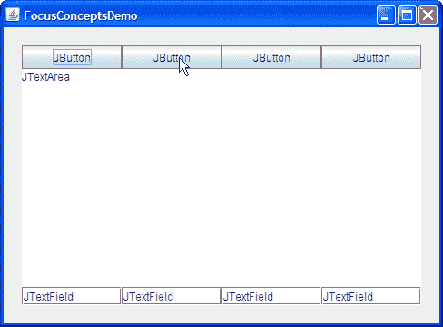
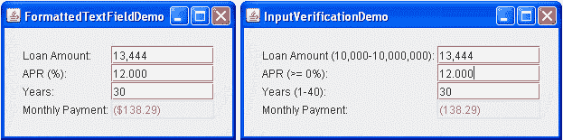
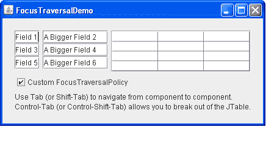
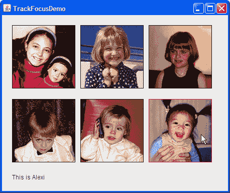

# 如何使用焦点子系统

> 原文：[`docs.oracle.com/javase/tutorial/uiswing/misc/focus.html`](https://docs.oracle.com/javase/tutorial/uiswing/misc/focus.html)

许多组件 - 即使是主要通过鼠标操作的组件，如按钮 - 也可以通过键盘操作。要使按键影响组件，组件必须具有键盘焦点。

从用户的角度来看，具有键盘焦点的组件通常很显眼 - 例如带有虚线或黑色边框。包含该组件的窗口也比屏幕上的其他窗口更显眼。这些视觉提示让用户知道任何键入将与哪个组件相关联。窗口系统中一次只能有一个组件具有键盘焦点。

窗口如何获得焦点取决于窗口系统。在所有平台上，没有绝对可靠的方法来确保窗口获得焦点。在某些操作系统上，例如 Microsoft Windows，前置窗口通常成为焦点窗口。在这些情况下，[`Window.toFront`](https://docs.oracle.com/javase/8/docs/api/java/awt/Window.html#toFront--)方法将窗口移至前台，从而使其获得焦点。但是，在其他操作系统上，例如 Solaris™ 操作系统，窗口管理器可能根据光标位置选择焦点窗口，在这种情况下，`Window.toFront`方法的行为不同。

当用户单击组件、在组件之间切换选项卡或以其他方式与组件交互时，组件通常会获得焦点。组件也可以通过编程方式获得焦点，例如当其包含的框架或对话框可见时。以下代码片段显示了如何在窗口获得焦点时每次都给特定组件焦点：

```java
//Make textField get the focus whenever frame is activated.
frame.addWindowFocusListener(new WindowAdapter() {
    public void windowGainedFocus(WindowEvent e) {
        textField.requestFocusInWindow();
    }
});

```

如果要确保特定组件在窗口首次激活时获得焦点，可以在组件实现后但在框架显示之前在组件上调用[`requestFocusInWindow`](https://docs.oracle.com/javase/8/docs/api/java/awt/Component.html#requestFocusInWindow--)方法。以下示例代码显示了如何执行此操作：

```java
    *//...Where initialization occurs...*
    JFrame frame = new JFrame("Test");
    JPanel panel = new JPanel(new BorderLayout());

    *//...Create a variety of components here...*

    //Create the component that will have the initial focus.
    JButton button = new JButton("I am first");
    panel.add(button);
    frame.getContentPane().add(panel);  //Add it to the panel

    frame.pack();  //Realize the components.
    //This button will have the initial focus.
    button.requestFocusInWindow(); 
    frame.setVisible(true); //Display the window.

```

或者，您可以将自定义`FocusTraversalPolicy`应用于框架，并调用`getDefaultComponent`方法确定哪个组件将获得焦点。

本节的其余部分涵盖以下主题：

+   焦点子系统简介

+   验证输入

+   使自定义组件可聚焦

+   自定义焦点遍历

+   跟踪多个组件的焦点变化

+   焦点转移时间

+   焦点 API

+   焦点示例

## 焦点子系统简介

焦点子系统旨在尽可能隐形地执行正确操作。在大多数情况下，它的行为是合理的，如果不是，您可以以各种方式调整其行为。一些常见情况可能包括：

+   排序正确，但焦点未设置在第一个组件上。如前一节中的代码片段所示，您可以使用`requestFocusInWindow`方法在窗口可见时将焦点设置在组件上。

+   排序错误。要解决此问题，您可以更改包含层次结构，更改组件添加到其容器的顺序，或者创建自定义焦点遍历策略。有关更多详细信息，请参见自定义焦点遍历。

+   组件必须防止失去焦点，或者在组件失去焦点之前检查一个值。输入验证是解决此问题的方法。

+   自定义组件没有获得焦点。要解决此问题，您需要确保它满足使自定义组件可聚焦中概述的所有要求。

`FocusConceptsDemo`示例演示了一些概念。



* * *

**试试这个：**

1.  单击“启动”按钮以使用[Java™ Web Start](http://www.oracle.com/technetwork/java/javase/javawebstart/index.html)运行 FocusConceptsDemo（[下载 JDK 7 或更高版本](http://www.oracle.com/technetwork/java/javase/downloads/index.html)）。或者，要自行编译和运行示例，请参考示例索引。

1.  如有必要，单击窗口以使其获得焦点。

1.  使用 Tab 键从组件到组件移动焦点。

    您会注意到当焦点移入文本区域时，它会停留在文本区域中。

1.  使用 Control-Tab 将焦点移出文本区域。

1.  使用 Shift-Tab 向相反方向移动焦点。

1.  使用 Control-Shift-Tab 向相反方向移出文本区域的焦点。

* * *

`KeyboardFocusManager`是焦点子系统的关键元素。它管理状态并启动更改。键盘管理器跟踪*焦点所有者* —— 接收键盘输入的组件。*焦点窗口*是包含焦点所有者的窗口。

* * *

**JWindow 和焦点：** 在 GUI 中使用 `JWindow` 组件时，你应该知道 `JWindow` 组件的拥有框架必须可见，以便窗口中的任何组件能够获得焦点。默认情况下，如果你没有为 `JWindow` 组件指定拥有框架，系统会为其创建一个不可见的拥有框架。结果是，`JWindow` 组件中的组件可能无法获得焦点。解决方法要么在创建 [`JWindow`](https://docs.oracle.com/javase/8/docs/api/javax/swing/JWindow.html) 组件时指定一个可见的拥有框架，要么使用一个无装饰的 `JFrame` 组件代替。

* * *

*焦点循环*（或*焦点遍历循环*）是一组在包含层次结构中共享共同祖先的组件。*焦点循环根*是特定焦点遍历循环的根容器。默认情况下，每个 `JWindow` 和 `JInternalFrame` 组件都可以是焦点循环根。焦点循环根本身可以包含一个或多个焦点循环根。以下 Swing 对象可以是焦点循环根：`JApplet`、`JDesktopPane`、`JDialog`、`JEditorPane`、`JFrame`、`JInternalFrame` 和 `JWindow`。虽然 `JTable` 和 `JTree` 对象看起来可能是焦点循环根，但实际上它们不是。

*焦点遍历策略*确定一组组件被导航的顺序。Swing 提供了 [`LayoutFocusTraversalPolicy`](https://docs.oracle.com/javase/8/docs/api/javax/swing/LayoutFocusTraversalPolicy.html) 类，根据布局管理器相关因素（如组件的大小、位置和方向）决定导航顺序。在焦点循环中，组件可以向前或向后导航。在焦点循环根的层次结构中，向上遍历将焦点从当前循环中移出到父循环中。

在大多数外观和感觉模型中，使用 Tab 和 Shift-Tab 键导航组件。这些键是默认的*焦点遍历键*，可以通过编程方式进行更改。例如，你可以通过以下四行代码将 Enter 添加为前向焦点遍历键：

```java
Set forwardKeys = getFocusTraversalKeys(
    KeyboardFocusManager.FORWARD_TRAVERSAL_KEYS);
Set newForwardKeys = new HashSet(forwardKeys);
newForwardKeys.add(KeyStroke.getKeyStroke(KeyEvent.VK_ENTER, 0));
setFocusTraversalKeys(KeyboardFocusManager.FORWARD_TRAVERSAL_KEYS,
    newForwardKeys);

```

Tab 在正向方向中移动焦点。Shift-Tab 在反向方向中移动焦点。例如，在 FocusConceptsDemo 中，第一个按钮具有初始焦点。通过 Tab 键将焦点移动到文本区域中的按钮。额外的 Tab 键将在文本区域内移动光标，但不会移出文本区域，因为在文本区域内，Tab *不*是焦点遍历键。然而，Control-Tab 将焦点移出文本区域并进入第一个文本字段。同样，Control-Shift-Tab 将焦点移出文本区域并进入上一个组件。按照惯例，Control 键用于将焦点移出任何将 Tab 视为特殊方式的组件，例如 `JTable`。

您刚刚收到了对焦点架构的简要介绍。如果您想了解更多细节，请参阅[焦点子系统](https://docs.oracle.com/javase/8/docs/api/java/awt/doc-files/FocusSpec.html)的规范。

## 输入验证

GUI 设计的一个常见要求是限制用户输入的组件，例如，只允许十进制格式（例如货币）的数字输入或者只允许邮政编码为 5 位数字的文本字段。一个易于使用的格式化文本字段组件允许输入限制为各种本地化格式。您还可以为文本字段指定一个自定义格式化程序，该格式化程序可以执行特殊检查，例如确定值不仅格式正确，而且合理。

您可以使用输入验证器作为自定义格式化程序的替代方案，或者当您有一个不是文本字段的组件时。输入验证器允许您拒绝特定值，例如格式正确但无效的邮政编码，或者超出所需范围的值，例如高于 110°F 的体温。要使用输入验证器，您需要创建一个[``InputVerifier``](https://docs.oracle.com/javase/8/docs/api/javax/swing/InputVerifier.html)的子类，创建您子类的实例，并将该实例设置为一个或多个组件的输入验证器。

组件的输入验证器在组件即将失去焦点时进行查询。如果组件的值不可接受，输入验证器可以采取适当的措施，例如拒绝将焦点移交给组件或者用上次有效值替换用户的输入，然后允许焦点转移到下一个组件。但是，当焦点转移到另一个顶级组件时，不会调用`InputVerifier`。

以下两个示例展示了抵押贷款计算器。一个使用格式化文本字段，另一个使用标准文本字段进行输入验证。



* * *

**试试这个：**

1.  点击“启动”按钮以使用[Java™ Web Start](http://www.oracle.com/technetwork/java/javase/javawebstart/index.html)运行 FormattedTextFieldDemo（[下载 JDK 7 或更高版本](http://www.oracle.com/technetwork/java/javase/downloads/index.html)）。或者，要自行编译和运行示例，请参考示例索引。

1.  单击“启动”按钮以使用[Java™ Web Start](http://www.oracle.com/technetwork/java/javase/javawebstart/index.html)运行 InputVerificationDemo（[下载 JDK 7 或更高版本](http://www.oracle.com/technetwork/java/javase/downloads/index.html)）。或者，要自行编译和运行示例，请参考示例索引。

1.  将两个抵押贷款计算器并排放置。您会发现输入验证演示为每个可编辑文本字段的相关标签指定了有效的输入值。尝试在两个示例中输入格式不正确的值以观察行为。然后尝试输入格式正确但不可接受的值。

* * *

您可以在`InputVerificationDemo.java`中找到输入验证演示的代码。以下是`MyVerifier`的`InputVerifier`子类的代码：

```java
class MyVerifier extends InputVerifier
                 implements ActionListener {
    double MIN_AMOUNT = 10000.0;
    double MAX_AMOUNT = 10000000.0;
    double MIN_RATE = 0.0;
    int MIN_PERIOD = 1;
    int MAX_PERIOD = 40;

   public boolean shouldYieldFocus(JComponent input) {
        boolean inputOK = verify(input);
        makeItPretty(input);
        updatePayment();

        if (inputOK) {
            return true;
        } else {
            Toolkit.getDefaultToolkit().beep();
            return false;
        }
    }

    protected void updatePayment() {
        double amount = DEFAULT_AMOUNT;
        double rate = DEFAULT_RATE;
        int numPeriods = DEFAULT_PERIOD;
        double payment = 0.0;

        //Parse the values.
        try {
            amount = moneyFormat.parse(amountField.getText()).
                              doubleValue();
        } catch (ParseException pe) {pe.printStackTrace();}
        try {
            rate = percentFormat.parse(rateField.getText()).
                                 doubleValue();
        } catch (ParseException pe) {pe.printStackTrace();}
        try {
            numPeriods = decimalFormat.parse(numPeriodsField.getText()).
                              intValue();
        } catch (ParseException pe) {pe.printStackTrace();}

        //Calculate the result and update the GUI.
        payment = computePayment(amount, rate, numPeriods);
        paymentField.setText(paymentFormat.format(payment));
    }

    //This method checks input, but should cause no side effects.
    public boolean verify(JComponent input) {
        return checkField(input, false);
    }

    protected void makeItPretty(JComponent input) {
        checkField(input, true);
    }

    protected boolean checkField(JComponent input, boolean changeIt) {
        if (input == amountField) {
            return checkAmountField(changeIt);
        } else if (input == rateField) {
            return checkRateField(changeIt);
        } else if (input == numPeriodsField) {
            return checkNumPeriodsField(changeIt);
        } else {
            return true; //should not happen
        }
    }

    //Checks that the amount field is valid.  If it is valid,
    //it returns true; otherwise, returns false.  If the
    //change argument is true, this method sets the
    //value to the minimum or maximum value if necessary and
    // (even if not) sets it to the parsed number so that it
    // looks good -- no letters, for example.
    protected boolean checkAmountField(boolean change) {
        boolean wasValid = true;
        double amount = DEFAULT_AMOUNT;

        //Parse the value.
        try {
            amount = moneyFormat.parse(amountField.getText()).
                              doubleValue();
        } catch (ParseException pe) {
            pe.printStackTrace();
            wasValid = false;
        }

        //Value was invalid.
        if ((amount < MIN_AMOUNT) || (amount > MAX_AMOUNT)) {
            wasValid = false;
            if (change) {
                if (amount < MIN_AMOUNT) {
                    amount = MIN_AMOUNT;
                } else { // amount is greater than MAX_AMOUNT
                    amount = MAX_AMOUNT;
                }
            }
        }

        //Whether value was valid or not, format it nicely.
        if (change) {
            amountField.setText(moneyFormat.format(amount));
            amountField.selectAll();
        }

        return wasValid;
    }

    //Checks that the rate field is valid.  If it is valid,
    //it returns true; otherwise, returns false.  If the
    //change argument is true, this method reigns in the
    //value if necessary and (even if not) sets it to the
    //parsed number so that it looks good -- no letters,
    //for example.
    protected boolean checkRateField(boolean change) {
        *...//Similar to checkAmountField...*
    }

    //Checks that the numPeriods field is valid.  If it is valid,
    //it returns true; otherwise, returns false.  If the
    //change argument is true, this method reigns in the
    //value if necessary and (even if not) sets it to the
    //parsed number so that it looks good -- no letters,
    //for example.
    protected boolean checkNumPeriodsField(boolean change) {
        *...//Similar to checkAmountField...*
    }

    public void actionPerformed(ActionEvent e) {
        JTextField source = (JTextField)e.getSource();
        shouldYieldFocus(source); //ignore return value
        source.selectAll();
    }
}

```

请注意，`verify`方法被实现用于检测无效值，但不执行其他操作。`verify`方法仅用于确定输入是否有效，不应弹出对话框或引起其他任何副作用。`shouldYieldFocus`方法调用`verify`，如果值无效，则将其设置为最小值或最大值。`shouldYieldFocus`方法允许引起副作用，在本例中，它始终格式化文本字段，还可能更改其值。在我们的示例中，`shouldYieldFocus`方法始终返回 true，以确保焦点的传递实际上从未被阻止。这只是验证可以实现的一种方式。查找另一个名为`InputVerificationDialogDemo`的演示的另一个版本，当用户输入无效时会弹出对话框，并要求用户输入合法值。

使用`JComponent`类的`setInputVerifier`方法安装输入验证器。例如，`InputVerificationDemo`具有以下代码：

```java
private MyVerifier verifier = new MyVerifier();
...
amountField.setInputVerifier(verifier);

```

## 使自定义组件可聚焦

要使组件获得焦点，必须满足三个要求：可见、启用和可聚焦。还可以提供输入映射。有关输入映射的更多信息，请阅读如何使用键绑定。

TrackFocusDemo 示例定义了简单的组件`Picture`。其构造函数如下所示：

```java
public Picture(Image image) {
    this.image = image;
    setFocusable(true);
    addMouseListener(this);
    addFocusListener(this);
}

```

调用`setFocusable(true)`方法使组件可聚焦。如果在其`WHEN_FOCUSED`输入映射中显式为组件指定键绑定，则无需调用`setFocusable`方法。

为了在焦点发生变化时进行可视化显示（仅在组件具有焦点时绘制红色边框），`Picture`具有一个焦点监听器。

当用户单击图片时获得焦点时，组件具有鼠标监听器。监听器的`mouseClicked`方法请求将焦点转移到图片。以下是代码：

```java
public void mouseClicked(MouseEvent e) {
    //Since the user clicked on us, let us get focus!
    requestFocusInWindow();
}

```

有关 TrackFocusDemo 示例的更多讨论，请参见跟踪多个组件的焦点变化。

## 自定义焦点遍历

焦点子系统确定了在使用焦点遍历键（如 Tab 键）导航时应用的默认顺序。Swing 应用程序的策略由[`LayoutFocusTraversalPolicy`](https://docs.oracle.com/javase/8/docs/api/javax/swing/LayoutFocusTraversalPolicy.html)确定。您可以通过使用[`setFocusCycleRoot`](https://docs.oracle.com/javase/8/docs/api/java/awt/Container.html#setFocusCycleRoot-boolean-)方法在任何`Container`上设置焦点遍历策略。但是，如果容器不是焦点循环根，则可能没有明显效果。或者，您可以将焦点遍历策略提供者传递给`FocusTraversalPolicy`方法，而不是焦点循环根。使用[`isFocusTraversalPolicyProvider()`](https://docs.oracle.com/javase/8/docs/api/java/awt/Container.html#isFocusTraversalPolicyProvider--)方法来确定`Container`是否是焦点遍历策略提供者。使用[`setFocusTraversalPolicyProvider()`](https://docs.oracle.com/javase/8/docs/api/java/awt/Container.html#setFocusTraversalPolicyProvider-boolean-)方法设置一个容器来提供焦点遍历策略。

`FocusTraversalDemo`示例演示了如何自定义焦点行为。



* * *

**试试这个：**

1.  单击“启动”按钮以使用[Java™ Web Start](http://www.oracle.com/technetwork/java/javase/javawebstart/index.html)运行 FocusTraversalDemo（[下载 JDK 7 或更高版本](http://www.oracle.com/technetwork/java/javase/downloads/index.html)）。或者，要自行编译和运行示例，请参考示例索引。

1.  单击窗口，如果需要，使其获得焦点。

1.  当您通过组件进行制表时，请注意焦点顺序。焦点顺序是由组件添加到内容窗格的顺序确定的。还要注意，复选框永远不会获得焦点；我们将其从焦点循环中移除。

1.  要将焦点移出表格，请使用 Control-Tab 或 Control-Shift-Tab。

1.  单击**自定义 FocusTraversalPolicy**复选框。此框在框架上安装了自定义焦点遍历策略。

1.  再次通过组件进行制表。请注意，焦点顺序现在是从左到右，从上到下的顺序。

* * *

您可以在`FocusTraversalDemo.java`中找到演示代码。

通过这行代码从焦点循环中移除复选框：

```java
togglePolicy.setFocusable(false);

```

这是应用程序的自定义`FocusTraversalPolicy`：

```java
...
JTextField tf1 = new JTextField("Field 1");
JTextField tf2 = new JTextField("A Bigger Field 2");
JTextField tf3 = new JTextField("Field 3");
JTextField tf4 = new JTextField("A Bigger Field 4");
JTextField tf5 = new JTextField("Field 5");
JTextField tf6 = new JTextField("A Bigger Field 6");
JTable table = new JTable(4,3);
...
public FocusTraversalDemo() {
    super(new BorderLayout());

    JTextField tf1 = new JTextField("Field 1");
    JTextField tf2 = new JTextField("A Bigger Field 2");
    JTextField tf3 = new JTextField("Field 3");
    JTextField tf4 = new JTextField("A Bigger Field 4");
    JTextField tf5 = new JTextField("Field 5");
    JTextField tf6 = new JTextField("A Bigger Field 6");
    JTable table = new JTable(4,3);
    togglePolicy = new JCheckBox("Custom FocusTraversalPolicy");
    togglePolicy.setActionCommand("toggle");
    togglePolicy.addActionListener(this);
    togglePolicy.setFocusable(false);  //Remove it from the focus cycle.
    //Note that HTML is allowed and will break this run of text
    //across two lines.
    label = new JLabel("<html>Use Tab (or Shift-Tab) to navigate from component to component.<p>Control-Tab 
    (or Control-Shift-Tab) allows you to break out of the JTable.</html>");

    JPanel leftTextPanel = new JPanel(new GridLayout(3,2));
    leftTextPanel.add(tf1, BorderLayout.PAGE_START);
    leftTextPanel.add(tf3, BorderLayout.CENTER);
    leftTextPanel.add(tf5, BorderLayout.PAGE_END);
    leftTextPanel.setBorder(BorderFactory.createEmptyBorder(0,0,5,5));
    JPanel rightTextPanel = new JPanel(new GridLayout(3,2));
    rightTextPanel.add(tf2, BorderLayout.PAGE_START);
    rightTextPanel.add(tf4, BorderLayout.CENTER);
    rightTextPanel.add(tf6, BorderLayout.PAGE_END);
    rightTextPanel.setBorder(BorderFactory.createEmptyBorder(0,0,5,5));
    JPanel tablePanel = new JPanel(new GridLayout(0,1));
    tablePanel.add(table, BorderLayout.CENTER);
    tablePanel.setBorder(BorderFactory.createEtchedBorder());
    JPanel bottomPanel = new JPanel(new GridLayout(2,1));
    bottomPanel.add(togglePolicy, BorderLayout.PAGE_START);
    bottomPanel.add(label, BorderLayout.PAGE_END);

    add(leftTextPanel, BorderLayout.LINE_START);
    add(rightTextPanel, BorderLayout.CENTER);
    add(tablePanel, BorderLayout.LINE_END);
    add(bottomPanel, BorderLayout.PAGE_END);
    setBorder(BorderFactory.createEmptyBorder(20,20,20,20));
    Vector<Component> order = new Vector<Component>(7);
    order.add(tf1);
    order.add(tf2);
    order.add(tf3);
    order.add(tf4);
    order.add(tf5);
    order.add(tf6);
    order.add(table);
    newPolicy = new MyOwnFocusTraversalPolicy(order);
}

```

要使用自定义`FocusTraversalPolicy`，请在任何焦点循环根上实现以下代码。

```java
    MyOwnFocusTraversalPolicy newPolicy = new MyOwnFocusTraversalPolicy();
    frame.setFocusTraversalPolicy(newPolicy);

```

您可以通过将`FocusTraversalPolicy`设置为`null`来删除自定义焦点遍历策略，这将恢复默认策略。

## 跟踪多个组件的焦点更改

在某些情况下，应用程序可能需要跟踪具有焦点的组件。这些信息可能用于动态更新菜单或可能是状态栏。如果只需要在特定组件上跟踪焦点，可能有必要实现焦点事件监听器。

如果焦点监听器不合适，您可以在`KeyboardFocusManager`上注册`PropertyChangeListener`。属性更改侦听器会通知涉及焦点的每次更改，包括焦点所有者、焦点窗口和默认焦点遍历策略的更改。查看 KeyboardFocusManager Properties 表以获取完整列表。

以下示例演示通过在键盘焦点管理器上安装属性更改侦听器来跟踪焦点所有者。



* * *

**试试这个：**

1.  单击“启动”按钮以使用[Java™ Web Start](http://www.oracle.com/technetwork/java/javase/javawebstart/index.html)运行 TrackFocusDemo（[下载 JDK 7 或更高版本](http://www.oracle.com/technetwork/java/javase/downloads/index.html)）。或者，要自行编译和运行示例，请参考示例索引。

1.  如果需要，点击窗口使其获得焦点。

1.  窗口显示六幅图像，每幅图像都由`Picture`组件显示。具有焦点的`Picture`以红色边框标识。窗口底部的标签描述具有焦点的`Picture`。

1.  通过使用 Tab 或 Shift-Tab 移动焦点到另一个`Picture`，或者通过单击图像来移动焦点。由于在键盘焦点管理器上注册了属性更改侦听器，因此焦点的变化会被检测到，并且标签会相应更新。

* * *

您可以在`TrackFocusDemo.java`中查看演示代码。用于绘制图像的自定义组件可以在`Picture.java`中找到。以下是定义和安装属性更改侦听器的代码：

```java
KeyboardFocusManager focusManager =
    KeyboardFocusManager.getCurrentKeyboardFocusManager();
focusManager.addPropertyChangeListener(
    new PropertyChangeListener() {
        public void propertyChange(PropertyChangeEvent e) {
            String prop = e.getPropertyName();
            if (("focusOwner".equals(prop)) &&
                  ((e.getNewValue()) instanceof Picture)) {
                Component comp = (Component)e.getNewValue();
                String name = comp.getName();
                Integer num = new Integer(name);
                int index = num.intValue();
                if (index < 0 || index > comments.length) {
                    index = 0;
                }
                info.setText(comments[index]);
            }
        }
    }
);

```

自定义组件`Picture`负责绘制图像。所有六个组件都是这样定义的：

```java
pic1 = new Picture(createImageIcon("images/" +
            mayaString + ".gif", mayaString).getImage());
pic1.setName("1");

```

## 定时焦点转移

焦点转移是异步的。这种特性可能会导致一些奇怪的与时间相关的问题和假设，尤其是在焦点的自动转移过程中。例如，想象一个包含“开始”按钮、“取消”按钮和文本字段的窗口的应用程序。这些组件按照这个顺序添加：

1.  开始按钮

1.  文本字段

1.  取消按钮

当应用程序启动时，`LayoutFocusTraversalPolicy`确定焦点遍历策略——在本例中，它是组件添加到其容器的顺序。在这个示例中，期望的行为是“开始”按钮具有初始焦点，当单击“开始”按钮时，它被禁用，然后“取消”按钮接收焦点。实现这种行为的正确方法是按照期望的顺序将组件添加到容器中，或者创建一个自定义的焦点遍历策略。如果由于某种原因无法实现这一点，那么可以使用以下代码片段实现这种行为：

```java
public void actionPerformed(ActionEvent e) {
    //This works.
    start.setEnabled(false);
    cancel.requestFocusInWindow();
}

```

如期望的那样，焦点从“开始”按钮转移到“取消”按钮，而不是文本字段。但是，如果以相反的顺序调用相同的方法，则会产生不同的结果，如下所示：

```java
public void actionPerformed(ActionEvent e) {
    //This does not work.
    cancel.requestFocusInWindow();
    start.setEnabled(false);
}

```

在这种情况下，在“开始”按钮离开之前就请求了“取消”按钮的焦点。调用`requestFocusInWindow`方法会启动焦点转移，但不会立即将焦点移动到“取消”按钮。当“开始”按钮被禁用时，焦点会转移到下一个组件（因此总是有一个具有焦点的组件），在这种情况下，焦点会移动到文本字段，*而不是*“取消”按钮。

有几种情况下，您需要在可能影响焦点的所有其他更改之后发出焦点请求：

+   隐藏焦点所有者。

+   使焦点所有者不可聚焦。

+   在焦点所有者上调用`removeNotify`方法。

+   对焦点所有者的容器执行上述任何操作，或者导致焦点策略发生更改，以使容器不再接受该组件作为焦点所有者。

+   处置包含焦点所有者的顶层窗口。

### 焦点 API

以下表格列出了与焦点相关的常用构造函数和方法。焦点 API 分为四个类别：

+   组件的有用方法

+   创建和使用自定义焦点遍历策略

+   输入验证 API

+   KeyboardFocusManager 属性

有关焦点架构的更详细信息，请参阅[焦点子系统](https://docs.oracle.com/javase/8/docs/api/java/awt/doc-files/FocusSpec.html)的规范。您可能还会发现如何编写焦点侦听器有用。

组件的有用方法：

| 方法（在`Component`中） | 目的 |
| --- | --- |
| [isFocusOwner()](https://docs.oracle.com/javase/8/docs/api/java/awt/Component.html#isFocusOwner--) | 如果组件是焦点所有者，则返回`true`。 |

| [setRequestFocusEnabled(boolean)](https://docs.oracle.com/javase/8/docs/api/javax/swing/JComponent.html#setRequestFocusEnabled-boolean-) [isRequestFocusEnabled()](https://docs.oracle.com/javase/8/docs/api/javax/swing/JComponent.html#isRequestFocusEnabled--)

(*in `JComponent`)* | 设置或检查此组件是否应获得焦点。将`setRequestFocusEnabled`设置为`false`通常会阻止鼠标点击使组件获得焦点，但仍允许键盘导航使组件获得焦点。此方法仅适用于接收鼠标事件的组件。例如，您可以在`JButton`上使用此方法，但不能在`JPanel`上使用。如果编写自定义组件，则需要遵守此属性。此方法比`setFocusable`方法更可取，并将使您的程序更适合使用辅助技术的用户。 |

| [setFocusable(boolean)](https://docs.oracle.com/javase/8/docs/api/java/awt/Component.html#setFocusable-boolean-) [isFocusable()](https://docs.oracle.com/javase/8/docs/api/java/awt/Component.html#isFocusable--) | 设置或获取组件的可聚焦状态。组件必须是可聚焦的才能获得焦点。当使用`setFocusable(false)`将组件从焦点循环中移除后，无法再使用键盘导航到该组件。建议使用`setRequestFocusEnabled`方法，以便您的程序可以被使用辅助技术的用户运行。 |
| --- | --- |
| [requestFocusInWindow()](https://docs.oracle.com/javase/8/docs/api/java/awt/Component.html#requestFocusInWindow--) | 请求此组件获取焦点。组件的窗口必须是当前焦点窗口。要满足此请求，`JComponent`的子类必须可见、启用且可聚焦，并且必须具有此请求的输入映射。在触发`FOCUS_GAINED`事件之前，不应假定组件已获得焦点。此方法优于依赖于平台的`requestFocus`方法。 |

| [setFocusTraversalKeys(int, Set)](https://docs.oracle.com/javase/8/docs/api/java/awt/Container.html#setFocusTraversalKeys-int-java.util.Set-) [getFocusTraversalKeys(int)](https://docs.oracle.com/javase/8/docs/api/java/awt/Container.html#getFocusTraversalKeys-int-)

[areFocusTraversalKeysSet(int)](https://docs.oracle.com/javase/8/docs/api/java/awt/Container.html#areFocusTraversalKeysSet-int-)

(*在`java.awt.Container`中*) | 设置或获取特定方向的焦点遍历键，或确定此容器上是否已明确设置了任何焦点遍历键。如果未设置任何焦点遍历键，则会从祖先或键盘焦点管理器继承。可以为以下方向设置焦点遍历键：`KeyboardFocusManager.FORWARD_TRAVERSAL_KEYS`、`KeyboardFocusManager.BACKWARD_TRAVERSAL_KEYS`、`KeyboardFocusManager.UP_CYCLE_TRAVERSAL_KEYS`或`KeyboardFocusManager.DOWN_CYCLE_TRAVERSAL_KEYS`。如果设置了`UP_CYCLE_TRAVERSAL_KEYS`或`DOWN_CYCLE_TRAVERSAL_KEYS`，还必须在焦点遍历策略上调用[`setImplicitDownCycleTraversal(false)`](https://docs.oracle.com/javase/8/docs/api/javax/swing/SortingFocusTraversalPolicy.html#setImplicitDownCycleTraversal-boolean-)。

创建和使用自定义焦点遍历策略

| 类或方法 | 目的 |
| --- | --- |
| [LayoutFocusTraversalPolicy](https://docs.oracle.com/javase/8/docs/api/javax/swing/LayoutFocusTraversalPolicy.html) | 默认情况下确定 Swing 组件的焦点遍历策略的类。 |
| [getComponentAfter(Container, Component)](https://docs.oracle.com/javase/8/docs/api/javax/swing/LayoutFocusTraversalPolicy.html#getComponentAfter-java.awt.Container-java.awt.Component-) | 给定作为输入的组件，返回下一个应该获得焦点的组件。 |
| [getComponentBefore(Container, Component)](https://docs.oracle.com/javase/8/docs/api/javax/swing/LayoutFocusTraversalPolicy.html#getComponentBefore-java.awt.Container-java.awt.Component-) | 给定作为输入的组件，返回在此组件之前应该获得焦点的组件。该方法用于向后切换。 |
| [getDefaultComponent(Container)](https://docs.oracle.com/javase/8/docs/api/javax/swing/SortingFocusTraversalPolicy.html#getDefaultComponent-java.awt.Container-) (*在`javax.swing.SortingFocusTraversalPolicy`中*) | 返回应该具有默认焦点的组件。 |
| [getFirstComponent(Container)](https://docs.oracle.com/javase/8/docs/api/javax/swing/LayoutFocusTraversalPolicy.html#getFirstComponent-java.awt.Container-) | 返回遍历循环中的第一个组件。 |
| [getInitialComponent(Container)](https://docs.oracle.com/javase/8/docs/api/javax/swing/InternalFrameFocusTraversalPolicy.html#getInitialComponent-java.awt.Container-) | 返回当窗口首次可见时应该接收焦点的组件。 |
| [getLastComponent(Container)](https://docs.oracle.com/javase/8/docs/api/javax/swing/LayoutFocusTraversalPolicy.html#getLastComponent-java.awt.Container-) | 返回遍历循环中的最后一个组件。 |

| [setFocusTraversalPolicy(FocusTraversalPolicy)](https://docs.oracle.com/javase/8/docs/api/java/awt/Container.html#setFocusTraversalPolicy-java.awt.FocusTraversalPolicy-) [getFocusTraversalPolicy(FocusTraversalPolicy)](https://docs.oracle.com/javase/8/docs/api/java/awt/Container.html#getFocusTraversalPolicy--)

(*在 `java.awt.Container` 中*) | 设置或获取焦点遍历策略，或确定是否已设置策略。请注意，在不是焦点循环根的容器上设置焦点遍历策略可能没有明显效果。`null` 值表示未明确设置策略。如果未设置策略，则从父焦点循环根继承策略。 |

| [isFocusCycleRoot()](https://docs.oracle.com/javase/8/docs/api/java/awt/Container.html#isFocusCycleRoot--) [setFocusCycleRoot(boolean)](https://docs.oracle.com/javase/8/docs/api/java/awt/Container.html#setFocusCycleRoot-boolean-)

(*在 `java.awt.Container` 中*) | 检查或设置容器是否是焦点遍历循环的根。 |

| [isFocusTraversalPolicyProvider()](https://docs.oracle.com/javase/8/docs/api/java/awt/Container.html#isFocusTraversalPolicyProvider--) [setFocusTraversalPolicyProvider(boolean)](https://docs.oracle.com/javase/8/docs/api/java/awt/Container.html#setFocusTraversalPolicyProvider-boolean-)

(*在 `java.awt.Container` 中*) | 检查或设置容器是否用于提供焦点遍历策略。 |

输入验证 API

| 类或方法 | 目的 |
| --- | --- |
| [InputVerifier](https://docs.oracle.com/javase/8/docs/api/javax/swing/InputVerifier.html) | 允许通过焦点机制进行输入验证的抽象类。当尝试从包含输入验证器的组件转移焦点时，直到验证器满足为止焦点不会放弃。 |
| [shouldYieldFocus(JComponent)](https://docs.oracle.com/javase/8/docs/api/javax/swing/InputVerifier.html#shouldYieldFocus-javax.swing.JComponent-) *(在 `InputVerifier` 中)* | 当组件具有输入验证器时，系统调用此方法以确定焦点是否可以离开此组件。此方法可能引起副作用，如弹出对话框。如果此方法返回 `false`，焦点将保留在传递给方法的组件上。 |
| [verify(JComponent)](https://docs.oracle.com/javase/8/docs/api/javax/swing/InputVerifier.html#verify-javax.swing.JComponent-) *(在 `InputVerifier` 中)* | 您需要重写此方法以检查组件的输入是否有效。如果有效，应返回 `true`，否则返回 `false`。此方法不应引起任何副作用，如弹出对话框。此方法由 `shouldYieldFocus` 调用。 |

| [setInputVerifier(inputVerifier)](https://docs.oracle.com/javase/8/docs/api/javax/swing/JComponent.html#setInputVerifier-javax.swing.InputVerifier-) [getInputVerifier()](https://docs.oracle.com/javase/8/docs/api/javax/swing/JComponent.html#getInputVerifier--)

*(在`JComponent`中)* | 设置或获取分配给组件的输入验证器。默认情况下，组件没有输入验证器。 |

| [setVerifyInputWhenFocusTarget(boolean)](https://docs.oracle.com/javase/8/docs/api/javax/swing/JComponent.html#setVerifyInputWhenFocusTarget-boolean-) [getVerifyInputWhenFocusTarget()](https://docs.oracle.com/javase/8/docs/api/javax/swing/JComponent.html#getVerifyInputWhenFocusTarget--) |

*(在`JComponent`中)* | 设置或获取当前焦点所有者的输入验证器在此组件请求焦点之前是否被调用。默认值为`true`。对于应该在输入无效时接收焦点的组件（例如取消按钮或滚动条），应将此方法设置为`false`。 |

键盘焦点管理器属性

此表定义了[`KeyboardFocusManager`](https://docs.oracle.com/javase/8/docs/api/java/awt/KeyboardFocusManager.html)的绑定属性。可以通过调用[`addPropertyChangeListener`](https://docs.oracle.com/javase/8/docs/api/java/awt/KeyboardFocusManager.html#addPropertyChangeListener-java.beans.PropertyChangeListener-)方法为这些属性注册监听器。

| 属性 | 目的 |
| --- | --- |
| focusOwner | 当前接收键事件的组件。 |
| permanentFocusOwner | 最近接收到永久`FOCUS_GAINED`事件的组件。通常与`focusOwner`相同，除非当前正在生效临时焦点更改。 |
| focusedWindow | 具有焦点所有者的窗口。 |
| activeWindow | 该组件必须始终是`Frame`或`Dialog`。活动窗口要么是焦点窗口，要么是焦点窗口的第一个框架或对话框的所有者。 |
| defaultFocusTraversalPolicy | 默认的焦点遍历策略，可以通过`Container`类的`setFocusTraversalPolicy`方法设置。 |
| forwardDefaultFocusTraversalKeys | 正向遍历的默认焦点键集。对于多行文本组件，默认为 Control-Tab。对于所有其他组件，默认为 Tab 和 Control-Tab。 |
| backwardDefaultFocusTraversalKeys | 后向遍历的默认焦点键集。对于多行文本组件，默认为 Control-Shift-Tab。对于所有其他组件，默认为 Shift-Tab 和 Control-Shift-Tab。 |
| upCycleDefaultFocusTraversalKeys | 上行循环的默认焦点键集。对于 Swing 组件，默认情况下这些键为 null。如果您在`KeyboardFocusManager`上设置了这些键，或者在焦点循环根上设置了`downCycleFocusTraversalKeys`，则还必须在焦点遍历策略上调用[`setImplicitDownCycleTraversal(false)`](https://docs.oracle.com/javase/8/docs/api/javax/swing/SortingFocusTraversalPolicy.html#setImplicitDownCycleTraversal-boolean-)方法。 |
| downCycleDefaultFocusTraversalKeys | 下一个循环的默认焦点键集。这些键在 Swing 组件中默认为 null。如果您在`KeyboardFocusManager`上设置了这些键，或者在焦点循环根上设置了`upCycleFocusTraversalKeys`，您还必须在焦点遍历策略上调用[`setImplicitDownCycleTraversal(false)`](https://docs.oracle.com/javase/8/docs/api/javax/swing/SortingFocusTraversalPolicy.html#setImplicitDownCycleTraversal-boolean-)方法。 |
| currentFocusCycleRoot | 当前焦点循环根容器。 |

### 使用焦点的示例

以下表格列出了操纵焦点的示例：

| 示例 | 描述位置 | 注释 |
| --- | --- | --- |
| `FocusConceptsDemo` | 本节 | 演示基本的默认焦点行为。 |
| `FocusTraversalDemo` | 本节 | 演示如何覆盖默认的焦点顺序。 |
| `TrackFocusDemo` | 本节 | 演示如何使用`PropertyChangeListener`来跟踪焦点所有者。还实现了一个自定义的可聚焦组件。 |
| `InputVerificationDemo` | 本节 | 演示如何实现一个`InputVerifier`来验证用户输入。 |
| `InputVerificationDialogDemo` | 本节 | 演示如何实现一个`InputVerifier`，当用户输入无效时弹出对话框。 |
| `FocusEventDemo` | 如何编写焦点监听器 | 报告发生在几个组件上的所有焦点事件，以展示焦点事件触发的情况。 |
