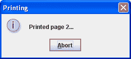
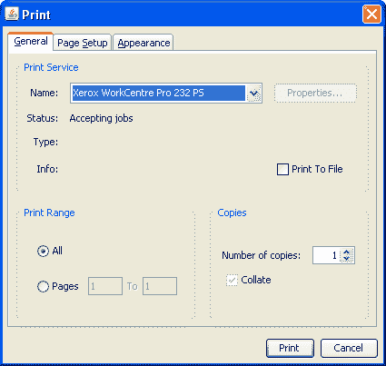

# 如何打印表格

> 原文：[`docs.oracle.com/javase/tutorial/uiswing/misc/printtable.html`](https://docs.oracle.com/javase/tutorial/uiswing/misc/printtable.html)

`JTable`类提供了打印表格的支持。`JTable`打印 API 包括允许你实现基本和高级打印任务的方法。对于常见的打印任务，当你只需要简单打印一个表格时，直接使用`print`方法。`print`方法有多种形式，带有不同的参数集。此方法准备你的表格，获取相应的`Printable`对象，并将其发送到打印机。

如果`Printable`对象的默认实现不符合你的需求，你可以通过重写`getPrintable`方法来自定义打印布局，以包装默认的`Printable`或者完全替换它。

打印表格的最简单方法是无参数调用`print`方法。请参见下面的代码示例。

```java
try {
    boolean complete = table.print();
    if (complete) {
        /* show a success message  */
        ...
    } else {
        /*show a message indicating that printing was cancelled */
        ...
    }
} catch (PrinterException pe) {
    /* Printing failed, report to the user */
    ...
}

```

当你无参数调用`print`方法时，会显示一个打印对话框，然后以`FIT_WIDTH`模式交互式打印你的表格，没有页眉或页脚。下面的代码示例显示了带有完整参数集的`print`方法签名。

```java
boolean complete = table.print(JTable.PrintMode printMode,
                               MessageFormat headerFormat,
                               MessageFormat footerFormat, 
                               boolean showPrintDialog,
                               PrintRequestAttributeSet attr,
                               boolean interactive,
                               PrintService service);

```

当你调用`print`方法并传入所有参数时，你明确选择了打印特性，如打印模式、页眉和页脚文本、打印属性、目标打印服务，以及是否显示打印对话框，以及是否交互式或非交互式打印。要决定哪些参数最适合你的需求，请参阅下面可用特性的描述。

`JTable`打印 API 提供以下特性：

+   交互式或非交互式打印

+   显示打印对话框

+   向打印布局添加页眉或页脚（或两者）

+   选择打印模式

+   自动布局和分页

## 交互式或非交互式打印

在交互模式下，会显示一个带有中止选项的进度对话框，用于打印过程中。这里是一个进度对话框的示例。



此对话框使用户能够跟踪打印进度。进度对话框是模态的，这意味着在屏幕上显示时，用户无法与表格交互。在打印过程中，重要的是你的表格保持不变，否则打印行为将是未定义的。然而，交互式打印不会阻止其他开发人员的代码修改表格。例如，有另一个线程使用`SwingUtilities.invokeLater`方法发布更新。因此，为确保正确的打印行为，你应该确保你自己的代码在打印过程中不修改表格。

或者，您可以以非交互方式打印表格。在此模式下，打印立即在事件分派线程上开始，并完全阻止任何事件的处理。一方面，此模式安全地保护表格免受任何更改，直到打印完成。另一方面，此模式完全剥夺用户与 GUI 的任何交互。这就是为什么只有在从不可见 GUI 的应用程序打印时才能推荐非交互打印。

## 打印对话框

您可以显示一个标准的打印对话框，允许用户执行以下操作：

+   选择打印机

+   指定打印份数

+   更改打印属性

+   在开始打印之前取消打印

+   开始打印



您可能注意到打印对话框中没有指定打印输出的总页数。这是因为表打印实现使用了`Printable`API，而在打印时不知道总页数。

## 向打印布局添加页眉或页脚（或两者）

头部和页脚由[`MessageFormat`](https://docs.oracle.com/javase/8/docs/api/java/text/MessageFormat.html)参数提供。这些参数允许对头部和页脚进行本地化。阅读[`MessageFormat`](https://docs.oracle.com/javase/8/docs/api/java/text/MessageFormat.html)类的文档，因为一些字符，如单引号，是特殊的，需要避免使用。头部和页脚都居中。您可以使用{0}插入页码。

`MessageFormat footer = new MessageFormat("第 - {0} 页");`

由于在打印时不知道输出的总页数，因此无法指定类似"第 1 页，共 5 页"的编号格式。

## 打印模式

打印模式负责缩放输出并将其分布在页面上。您可以以以下一种模式之一打印表格：

+   `PrintMode.NORMAL`

+   `PrintMode.FIT_WIDTH`

在`NORMAL`模式下，表格以其当前大小打印。如果列不适合一页，它们将根据表的`ComponentOrientation`跨越额外的页面。在`FIT_WIDTH`模式下，如果需要，表格的大小会更小，以便在每页上容纳所有列。请注意，宽度和高度都会按比例缩放，以提供相同纵横比的输出。在两种模式下，行会按顺序跨越多个页面，每页尽可能多的行。

## 自动布局和分页

使用`JTable`打印 API，您无需关心布局和分页。您只需为`print`方法指定适当的参数，如打印模式和页脚文本格式（如果您想在页脚插入页码）。如前所示，您可以通过在提供给`MessageFormat`页脚参数的字符串中包含`"{0}"`来在页脚中指定页码。在打印输出中，{0}将被当前页码替换。

## 表打印示例

让我们看一个名为`TablePrintDemo1`的示例。此程序的完整代码可以在`TablePrintDemo1.java`中找到。这个演示的丰富 GUI 是由[NetBeans IDE GUI 构建器](http://netbeans.org/kb/docs/java/quickstart-gui.html)自动生成的。这是`TablePrintDemo1`应用程序的图片。


* * *

**试试这个：**

1.  单击“启动”按钮以使用[Java™ Web Start](http://www.oracle.com/technetwork/java/javase/javawebstart/index.html)运行 TablePrintDemo1（[下载 JDK 7 或更高版本](http://www.oracle.com/technetwork/java/javase/downloads/index.html)）。或者，要自行编译和运行示例，请参考示例索引。

1.  应用程序窗口底部的每个复选框都有工具提示。将光标悬停在复选框上以查找其目的。

1.  在“页眉”或“页脚”复选框中编辑文本，或两者都提供不同的页眉或页脚。

1.  取消选中“页眉”或“页脚”复选框，或两者都关闭页眉或页脚。

1.  取消选中“显示打印对话框”复选框以关闭打印对话框。

1.  取消选中“适应打印页面宽度”复选框以选择在`NORMAL`模式下打印。

1.  取消选中“交互式（显示状态对话框）”复选框以关闭打印对话框。

1.  单击“打印”按钮，根据所选选项打印表格。

每当 Web 启动的应用程序尝试打印时，Java Web Start 会弹出一个安全对话框，询问用户是否允许打印。要继续打印，用户必须接受请求。

当您取消交互复选框时，会出现一条消息，警告用户打印非交互式的缺点。您可以在`PrintGradesTable`方法中找到打印代码。调用此方法时，该方法首先从 GUI 组件中获取选定的选项集，然后调用`print`方法如下。

```java
boolean complete = gradesTable.print(mode, header, footer,
                                     showPrintDialog, null,
                                     interactive, null);

```

`print`方法返回的值然后用于显示成功消息或用户取消打印的消息。

另一个重要特性是表打印 API 使用表渲染器。通过使用表的渲染器，API 提供了一个打印输出，看起来像屏幕上的表格。看一下屏幕上表格的最后一列。它包含自定义图像，表示每个学生的通过或失败状态。现在看打印结果。您会发现勾号和叉号看起来一样。

这是`FIT_WIDTH`模式下 TablePrintDemo1 打印结果的图片。


*此图已经缩小以适应页面。

点击图片查看其原始大小。

### TablePrintDemo2 示例

TablePrintDemo2 示例基于先前的演示，并具有相同的界面。唯一的区别在于打印输出。如果你更仔细地查看 TablePrintDemo1 的打印结果，你可能会注意到勾号和 X 号有些模糊。TablePrintDemo2 示例展示了如何自定义表格以使图像在表格打印中更易辨认。在这个演示中，重写的`getTableCellRendererComponent`方法会判断表格是否正在打印，并返回更清晰的黑白图像。如果表格没有被打印，它会返回在屏幕上看到的彩色图像。

点击启动按钮以使用[Java™ Web Start](http://www.oracle.com/technetwork/java/javase/javawebstart/index.html)运行 TablePrintDemo2（[下载 JDK 7 或更高版本](http://www.oracle.com/technetwork/java/javase/downloads/index.html)）。或者，要自行编译和运行示例，请参考示例索引。


`JComponent`类中定义的[`isPaintingForPrint`](https://docs.oracle.com/javase/8/docs/api/javax/swing/JComponent.html#isPaintingForPrint--)方法允许我们自定义打印内容与屏幕上看到的内容之间的差异。从`TablePrintDemo2.java`中提取的自定义单元格渲染器的代码如下。此代码根据`isPaintingForPrint`方法返回的值选择要使用的图像。

```java
    /**
     * A custom cell renderer that extends TablePrinteDemo1's renderer, to instead
     * use clearer black and white versions of the icons when printing.
     */
    protected static class BWPassedColumnRenderer extends PassedColumnRenderer {
            public Component getTableCellRendererComponent(JTable table,
                                                           Object value,
                                                           boolean isSelected,
                                                           boolean hasFocus,
                                                           int row,
                                                           int column) {

            super.getTableCellRendererComponent(table, value, isSelected,
                                                hasFocus, row, column);

            /* if we're currently printing, use the black and white icons */
            if (table.isPaintingForPrint()) {
                boolean status = (Boolean)value;
                setIcon(status ? passedIconBW : failedIconBW);
            } /* otherwise, the superclass (colored) icons are used */

            return this;
        }
    }

```

这是以`FIT_WIDTH`模式打印的 TablePrintDemo2 的结果图片。


*此图已经缩小以适应页面。

点击图片查看其原始大小。

### TablePrintDemo3 示例

TablePrintDemo3 示例基于前两个演示。此示例展示了如何通过包装默认的`Printable`对象并添加额外装饰来提供自定义的`Printable`实现。这个演示具有类似的界面，但是头部和底部的复选框被禁用，因为自定义的可打印对象将提供自己的页眉和页脚。

点击“启动”按钮以使用[Java™ Web Start](http://www.oracle.com/technetwork/java/javase/javawebstart/index.html)运行 TablePrintDemo3（[下载 JDK 7 或更高版本](http://www.oracle.com/technetwork/java/javase/downloads/index.html)）。或者，要自行编译和运行示例，请参考示例索引。


此示例将表格打印在剪贴板图像内部。这里是以`FIT_WIDTH`模式打印结果的图片。


*此图已经缩小以适应页面。

点击图片查看其原始大小。

此程序的完整代码可以在`TablePrintDemo3.java`中找到。在此演示中，使用了`JTable`类的自定义子类`FancyPrintingJTable`。这个`FancyPrintingJTable`类重写了`getPrintable`方法，以返回一个自定义可打印对象，该对象用自己的装饰、页眉和页脚包装默认可打印对象。这里是`getPrintable`方法的实现。

```java
public Printable getPrintable(PrintMode printMode,
                              MessageFormat headerFormat,
                              MessageFormat footerFormat) {

     MessageFormat pageNumber = new MessageFormat("- {0} -");

     /* Fetch the default printable */
     Printable delegate = super.getPrintable(printMode, null, pageNumber);

     /* Return a fancy printable that wraps the default */
     return new FancyPrintable(delegate);
}

```

`FancyPrintable`类负责将默认可打印对象包装成另一个可打印对象，并设置剪贴板图像。当实例化此类的一个实例时，它会加载组装剪贴板图像所需的图像，计算剪贴板图像所需的区域，计算表格的缩小区域，将表格打印到较小区域，并组装并打印剪贴板图像。

注意代码在组装剪贴板图像时对页面大小的灵活性。代码考虑实际页面尺寸，并组装辅助图像，根据需要拉伸其中一些图像，以使最终的剪贴板图像适合实际页面尺寸。下图显示了辅助图像，并指示这些图像如何形成最终输出。


*此图已经缩小以适应页面。

点击图片查看其原始大小。

## 表打印 API

此部分列出了`JTable`类中定义的允许您打印表格的方法。

| 方法 | 目的 |
| --- | --- |

| [boolean print()](https://docs.oracle.com/javase/8/docs/api/javax/swing/JTable.html#print--) [boolean print(printMode)](https://docs.oracle.com/javase/8/docs/api/javax/swing/JTable.html#print-javax.swing.JTable.PrintMode-)

[boolean print(printMode, MessageFormat, MessageFormat)](https://docs.oracle.com/javase/8/docs/api/javax/swing/JTable.html#print-javax.swing.JTable.PrintMode-java.text.MessageFormat-java.text.MessageFormat-) 

[boolean print(printMode, MessageFormat, MessageFormat, boolean, PrintRequestAttributeSet, boolean)](https://docs.oracle.com/javase/8/docs/api/javax/swing/JTable.html#print-javax.swing.JTable.PrintMode-java.text.MessageFormat-java.text.MessageFormat-boolean-javax.print.attribute.PrintRequestAttributeSet-boolean-)

[boolean print(printMode, MessageFormat, MessageFormat, boolean, PrintRequestAttributeSet, boolean, PrintService)](https://docs.oracle.com/javase/8/docs/api/javax/swing/JTable.html#print-javax.swing.JTable.PrintMode-java.text.MessageFormat-java.text.MessageFormat-boolean-javax.print.attribute.PrintRequestAttributeSet-boolean-javax.print.PrintService-) | 在没有参数的情况下调用时，显示打印对话框，然后以`FIT_WIDTH`模式交互式打印此表格，不包含页眉或页脚文本。如果用户继续打印，则返回`true`，如果用户取消打印，则返回`false`。在使用完整参数集调用时，根据指定的参数打印此表格。第一个参数指定打印模式。两个`MessageFormat`参数指定页眉和页脚文本。第一个布尔参数定义是否显示打印对话框。另一个布尔参数指定是否交互式打印。使用另外两个参数可以指定打印属性和打印服务。

每当省略`PrintService`参数时，将使用默认打印机。

| [Printable getPrintable(PrintMode, MessageFormat, MessageFormat)](https://docs.oracle.com/javase/8/docs/api/javax/swing/JTable.html#getPrintable-javax.swing.JTable.PrintMode-java.text.MessageFormat-java.text.MessageFormat-) | 返回用于打印表格的`Printable`。重写此方法以获取自定义的`Printable`对象。您可以将一个`Printable`对象包装到另一个中以获得各种布局。 |
| --- | --- |

## 使用表格打印的示例

此表列出了使用表格打印的示例，并指向这些示例所描述的位置。

| 示例 | 描述位置 | 备注 |
| --- | --- | --- |
| `TablePrintDemo` | 如何使用表格 | 展示了表格打印的基本功能，如显示打印对话框，然后以`FIT_WIDTH`模式交互式打印，并将页码作为页眉。 |
| `TablePrintDemo1` | 本页面 | 展示了表格打印的基础知识，并提供了丰富的图形用户界面。允许用户指定页眉或页脚文本，选择打印模式，打开或关闭打印对话框，并选择交互式或非交互式打印。 |
| `TablePrintDemo2` | 本页面 | 基于 TablePrintDemo1，这个示例具有相同的界面。这个演示展示了如何自定义表格，使打印结果与屏幕上显示的表格看起来不同。 |
| `TablePrintDemo3` | 本页面 | 这个演示展示了高级表格打印功能，例如将默认的可打印表格包装成另一个可打印表格，以获得不同的布局。 |
