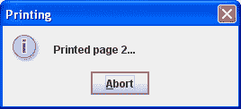
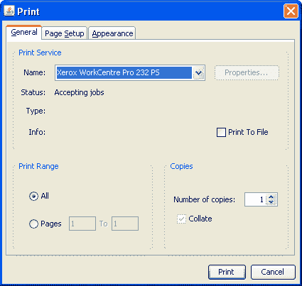
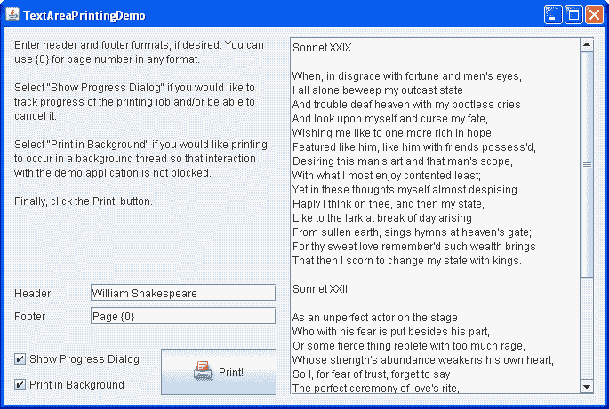
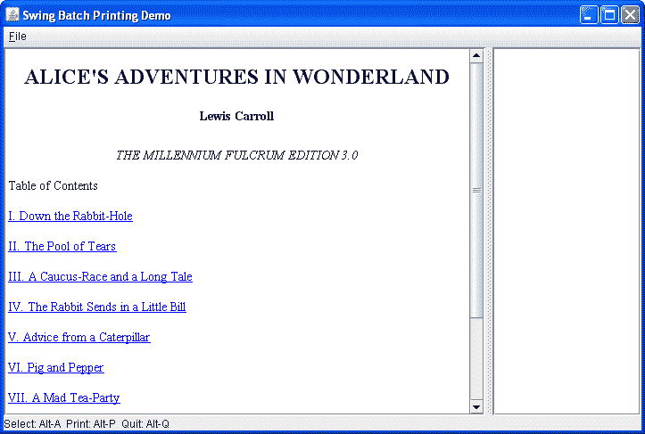

# 如何打印文本

> 原文：[`docs.oracle.com/javase/tutorial/uiswing/misc/printtext.html`](https://docs.oracle.com/javase/tutorial/uiswing/misc/printtext.html)

`JTextComponent` 类提供了打印文本文档的支持。`JTextComponent` API 包括允许您实现基本和高级打印任务的方法。支持的格式包括 HTML、RTF 和纯文本。对于简单打印文本文档等常见打印任务，直接使用 `print` 方法。`print` 方法有多种形式，带有不同的参数集。该方法准备您的文本文档，获取相应的 `Printable` 对象，并将其发送到打印机。

如果默认的 `Printable` 对象实现不符合您的需求，您可以通过重写 `getPrintable` 方法来自定义打印布局，以包装默认的 `Printable` 或完全替换它。

打印文本组件的最简单方法是不带参数调用 `print` 方法。请参阅下面的代码示例。

```java
try {
    boolean complete = textComponent.print();
    if (complete) {
        /* show a success message  */
        ...
    } else {
        /*show a message indicating that printing was cancelled */
        ...
    }
} catch (PrinterException pe) {
    /* Printing failed, report to the user */
    ...
}

```

当您不带参数调用 `print` 方法时，将显示一个打印对话框，然后您的文本组件将交互式打印，没有页眉或页脚。下面的代码示例显示了带有完整参数集的 `print` 方法签名。

```java
boolean complete = textComponent.print(MessageFormat headerFormat,
                                       MessageFormat footerFormat, 
                                       boolean showPrintDialog,
                                       PrintService service
                                       PrintRequestAttributeSet attributes,
                                       boolean interactive);

```

当您使用所有参数调用 `print` 方法时，您可以显式选择打印功能，如页眉和页脚文本、打印属性、目标打印服务，以及是否显示打印对话框，以及是打印交互式还是非交互式。要决定哪些参数最适合您的需求，请参阅下面可用功能的描述。

`JTextComponent` 打印 API 提供以下功能：

+   交互式或非交互式打印

+   显示打印对话框

+   向打印布局添加页眉或页脚（或两者）

+   自动布局和分页

## 交互式或非交互式打印

在交互模式下，将显示一个带有中止选项的进度对话框，用于打印过程。这里是一个进度对话框的示例。



该对话框允许用户跟踪打印进度。当在事件分派线程上调用 `print` 方法时，进度对话框是模态的，否则是非模态的。在打印过程中，确保您的文档保持不变很重要，否则打印行为是未定义的。`print` 方法确保您的文档不会被更改，并在打印期间禁用组件。

如果您在事件分派线程上以非交互模式调用 `print` 方法，则所有事件，包括重绘，都将被阻塞。这就是为什么只建议在具有不可见 GUI 的应用程序上在 EDT 上非交互地打印。

## 打印对话框

您可以显示一个标准的打印对话框，允许用户执行以下操作：

+   选择打印机

+   指定打印份数

+   更改打印属性

+   取消打印之前的启动

+   开始打印



您可能会注意到打印对话框没有指定打印输出中的总页数。这是因为文本打印实现使用了`Printable` API，并且在打印时不知道总页数。

## 向打印布局添加页眉或页脚（或两者）

头部和页脚由[`MessageFormat`](https://docs.oracle.com/javase/8/docs/api/java/text/MessageFormat.html)参数提供。这些参数允许对头部和页脚进行本地化。阅读[`MessageFormat`](https://docs.oracle.com/javase/8/docs/api/java/text/MessageFormat.html)类的文档，因为像单引号这样的字符是特殊的，需要避免使用。头部和页脚都居中。您可以使用`{0}`插入页码。

`MessageFormat footer = new MessageFormat("第 - {0} 页");`

由于在打印时不知道输出中的总页数，因此无法指定类似“第 1 页 / 共 5 页”这样的编号格式。

## 自动布局和分页

使用`JTextComponent`打印 API，您无需关心布局和分页。布局和分页都是自动完成的。文档内容会被格式化以适应页面大小，并跨多个页面展开。如果您想在页脚插入页码，只需为`print`方法指定适当的页脚文本格式。正如之前演示的，您可以通过在提供给`MessageFormat`页脚参数的字符串中包含`"{0}"`来指定页脚中的页码。在打印输出中，{0}将被当前页码替换。

## 文本区域打印示例

让我们看一个名为`TextAreaPrintingDemo`的示例。此演示的主要特点是根据用户的选择在事件分发线程或后台线程上打印文本文档。此演示显示一个文本区域，允许选择几个打印功能，并根据所选选项打印文本区域的内容。此程序的完整代码可以在`TextAreaPrintingDemo.java`中找到。此演示的丰富 GUI 是使用[NetBeans IDE GUI 构建器](http://netbeans.org/kb/docs/java/quickstart-gui.html)构建的。这是`TextAreaPrintingDemo`应用程序的图片。



* * *

**尝试这个：**

1.  点击“启动”按钮，使用[Java™ Web Start](http://www.oracle.com/technetwork/java/javase/javawebstart/index.html)来运行 TextAreaPrintingDemo（[下载 JDK 7 或更高版本](http://www.oracle.com/technetwork/java/javase/downloads/index.html)）。或者，要自行编译和运行示例，请参考示例索引。

1.  在“页眉”或“页脚”复选框中编辑文本，以提供不同的页眉或页脚。

1.  清除“显示进度对话框”复选框，如果您想要在不显示进度对话框的情况下打印，这意味着非交互式打印。请注意，一旦开始打印，您将无法取消打印。

1.  清除“后台打印”复选框以选择在事件分发线程上打印。请注意，在 EDT 上非交互式打印将使您的应用程序无响应 —— 在打印过程中将阻塞与您的应用程序的交互。

1.  点击“打印”按钮，根据所选选项打印文本区域的内容。

每当 Web 启动的应用程序尝试打印时，Java Web Start 会打开一个安全对话框，询问用户是否允许打印，除非在系统设置中已经授予了此权限。要继续打印，用户必须接受请求。

为“打印”按钮注册了一个动作监听器。当用户点击“打印”按钮时，`actionPerformed`方法调用`print`方法，启动打印任务。打印任务是一个`SwingWorker`对象。下面的代码示例显示了`PrintingTask`类的实现方式。

```java
private class PrintingTask extends SwingWorker<Object, Object> {
    private final MessageFormat headerFormat;
    private final MessageFormat footerFormat;
    private final boolean interactive;
    private volatile boolean complete = false;
    private volatile String message;

    public PrintingTask(MessageFormat header, MessageFormat footer,
                        boolean interactive) {
        this.headerFormat = header;
        this.footerFormat = footer;
        this.interactive = interactive;
    }

    @Override
    protected Object doInBackground() {
        try {
            complete = text.print(headerFormat, footerFormat,
                    true, null, null, interactive);
            message = "Printing " + (complete ? "complete" : "canceled");
        } catch (PrinterException ex) {
            message = "Sorry, a printer error occurred";
        } catch (SecurityException ex) {
            message =
                "Sorry, cannot access the printer due to security reasons";
        }
        return null;
    }

    @Override
    protected void done() {
        message(!complete, message);
    }
}

```

下面的代码示例显示了`print`方法如何从 GUI 组件中获取所选选项集，然后创建`PrintingTask`类的实例，并执行打印操作。

```java
private void print(java.awt.event.ActionEvent evt) {
        MessageFormat header = createFormat(headerField);
        MessageFormat footer = createFormat(footerField);
        boolean interactive = interactiveCheck.isSelected();
        boolean background = backgroundCheck.isSelected();

        PrintingTask task = new PrintingTask(header, footer, interactive);
        if (background) {
            task.execute();
        } else {
            task.run()
        }
    }

```

粗体代码说明了根据`background`参数的值调用`PrintingTask`的方法。每当用户喜欢在后台线程上打印时，将调用`execute`方法，该方法安排打印任务在后台线程上执行。否则，`run`方法在 EDT 上执行打印任务。

由于打印大型文档是一项耗时的任务，建议在后台线程上执行打印操作。

## 文本批量打印示例

`TextBatchPrintingDemo`示例演示了在后台线程上打印不可见的 HTML 文本文档。启动时，此演示显示一个带有 URL 列表的页面。你可以访问一个 HTML 页面，将显示的页面添加到打印列表中，一旦选择了所有需要的页面，就可以在后台线程上一次性打印它们。此程序的整个代码可以在`TextBatchPrintingDemo.java`中找到。这是`TextBatchPrintingDemo`应用程序的图片。



* * *

**试试这个：**

1.  点击启动按钮以使用[Java™ Web Start](http://www.oracle.com/technetwork/java/javase/javawebstart/index.html)运行 TextBatchPrintingDemo（[下载 JDK 7 或更高版本](http://www.oracle.com/technetwork/java/javase/downloads/index.html)）。或者，要自行编译和运行示例，请参考示例索引。

1.  点击任何链接查看相应的 HTML 页面。

1.  按下 ALT+A 或选择文件 > 添加页面菜单项将显示的页面添加到右侧的打印列表中。

1.  按下 ALT+H 或选择文件 > 主页菜单项返回到演示的主页。

1.  将需要的页面添加到打印列表中。

1.  按下 ALT+C 或选择文件 > 清除所选菜单项，如果需要清除打印列表并重新构建。

1.  按下 ALT+P 或选择文件 > 打印所选菜单项以打印所选页面。

1.  按下 ALT+Q 或选择文件 > 退出菜单项来退出应用程序。

你可以在`printSelectedPages`方法中找到打印代码。调用时，此方法首先获取选择打印的页面数量。下面的代码示例显示了`printSelectedPages`方法如何为每个页面创建一个`Runnable`对象，然后在单独的线程上打印当前页面。

```java
for (int i = 0; i < n; i++) {
    final PageItem item = (PageItem) pages.getElementAt(i);
    // This method is called from EDT.  Printing is a time-consuming
    // task, so it should be done outside EDT, in a separate thread.
    Runnable printTask = new Runnable() {
        public void run() {
            try {
                item.print(
                        // Two "false" args mean "no print dialog" and
                        // "non-interactive" (ie, batch-mode printing).
                                null, null, false, printService, null, false);
            } catch (PrinterException pe) {
                JOptionPane.showMessageDialog(null,
                        "Error printing " + item.getPage() + "\n" + pe,
                        "Print Error", JOptionPane.WARNING_MESSAGE);
            }
        }
    };
    new Thread(printTask).start();

```

## 文本打印 API

此部分列出了`JTextComponent`类中定义的允许打印文本文档的方法。

| 方法 | 目的 |
| --- | --- |

| [boolean print()](https://docs.oracle.com/javase/8/docs/api/javax/swing/text/JTextComponent.html#print--) [boolean print(MessageFormat, MessageFormat)](https://docs.oracle.com/javase/8/docs/api/javax/swing/text/JTextComponent.html#print-java.text.MessageFormat-java.text.MessageFormat-)

[boolean print(MessageFormat, MessageFormat, boolean, PrintRequestAttributeSet, boolean, PrintService)](https://docs.oracle.com/javase/8/docs/api/javax/swing/text/JTextComponent.html#print-java.text.MessageFormat-java.text.MessageFormat-boolean-javax.print.PrintService-javax.print.attribute.PrintRequestAttributeSet-boolean-) | 在没有参数的情况下调用时，显示打印对话框，然后交互式打印此文本组件，没有页眉或页脚文本。如果用户继续打印，则返回`true`，如果用户取消打印，则返回`false`。当使用两个`MessageFormat`参数调用时，显示打印对话框，然后交互式打印此文本组件，并显示指定的页眉和页脚文本。

当使用完整参数集调用时，根据指定的参数打印此文本组件。两个`MessageFormat`参数指定页眉和页脚文本。第一个布尔参数定义是否显示打印对话框。另一个布尔参数指定是否交互式打印。使用另外两个参数，您可以指定打印属性和打印服务。

每当省略一个`PrintService`参数时，将使用默认打印机。

| [Printable getPrintable(MessageFormat, MessageFormat)](https://docs.oracle.com/javase/8/docs/api/javax/swing/text/JTextComponent.html#getPrintable-java.text.MessageFormat-java.text.MessageFormat-) | 返回一个`Printable`对象，用于打印您的文本组件。重写此方法以获得自定义的 Printable 对象。您可以将一个 Printable 对象包装到另一个中，以获得复杂的报告和文档。 |
| --- | --- |

## 使用文本打印的示例

此表列出了使用文本打印的示例，并指向这些示例的描述位置。

| 示例 | 描述位置 | 注释 |
| --- | --- | --- |
| `TextAreaPrintingDemo` | 本页面 | 演示了文本打印的基础知识，并提供了丰富的 GUI。允许用户指定页眉或页脚文本，打开或关闭打印对话框，交互式或非交互式选择打印，然后根据所选选项打印。 |
| `TextBatchPrintingDemo` | 本页面 | 此演示显示了一个带有 URL 列表的文本组件，允许用户查看 HTML 页面，将它们添加到打印列表，并在后台线程上一次打印所有选定的页面。 |
