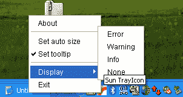

# 如何使用系统托盘

> 原文：[`docs.oracle.com/javase/tutorial/uiswing/misc/systemtray.html`](https://docs.oracle.com/javase/tutorial/uiswing/misc/systemtray.html)

系统托盘是桌面的一个专门区域，用户可以访问当前运行的程序。在各种操作系统上，这个区域可能有不同的称呼。在 Microsoft Windows 上，系统托盘被称为任务栏状态区，而在 GNU Network Object Model Environment (GNOME) 桌面上被称为通知区域。在 K Desktop Environment (KDE) 中，这个区域被称为系统托盘。然而，在每个系统上，托盘区域被桌面上所有运行的应用程序共享。

[`java.awt.SystemTray`](https://docs.oracle.com/javase/8/docs/api/java/awt/SystemTray.html) 类是在 Java™ SE 版本 6 中引入的，代表桌面的系统托盘。可以通过调用静态方法 `SystemTray.getSystemTray()` 来访问系统托盘。在调用此方法之前，使用静态方法 [`isSupported()`](https://docs.oracle.com/javase/8/docs/api/java/awt/SystemTray.html#isSupported--) 来检查系统托盘是否受支持。如果该平台不支持系统托盘，则 `isSupported()` 方法返回 false。如果应用程序在这种情况下尝试调用 `getSystemTray()` 方法，该方法将抛出 `java.lang.UnsupportedOperationException`。

应用程序无法创建 `SystemTray` 类的实例。只能存在一个在该类中创建的单个实例，并且可以使用 [`getSystemTray()`](https://docs.oracle.com/javase/8/docs/api/java/awt/SystemTray.html#getSystemTray--) 方法获取此实例。

系统托盘包含一个或多个托盘图标，可以使用 [`add(java.awt.TrayIcon)`](https://docs.oracle.com/javase/8/docs/api/java/awt/SystemTray.html#add-java.awt.TrayIcon-) 方法将它们添加到托盘中。当不再需要时，可以使用 [`remove(java.awt.TrayIcon)`](https://docs.oracle.com/javase/8/docs/api/java/awt/SystemTray.html#remove-java.awt.TrayIcon-) 方法将它们移除。

* * *

**注意：** 如果操作系统或 Java 运行时确定无法将图标添加到系统托盘，则 `add()` 方法可能会抛出 `AWTException`。例如，如果桌面上不存在系统托盘，则 X-Window 桌面会抛出 `AWTException`。

* * *

[`TrayIcon`](https://docs.oracle.com/javase/8/docs/api/java/awt/TrayIcon.html)类的功能不仅限于在托盘中显示的图标。它还包括文本工具提示、弹出菜单、气球消息以及与之关联的一组监听器。`TrayIcon`对象生成各种鼠标事件，并支持添加相应的监听器以接收这些事件的通知。`TrayIcon`类本身处理某些事件。例如，默认情况下，在托盘图标上执行右键单击时，它会显示指定的弹出菜单。执行双击时，`TrayIcon`对象生成一个`ActionEvent`来启动应用程序。当鼠标指针悬停在托盘图标上时，将显示工具提示。图标图像会自动调整大小以适应在托盘上分配给图像的空间。

以下演示使用 AWT 包开发，演示了 SystemTray 和 TrayIcon 类的功能。



不幸的是，`TrayIcon`类的当前实现对 Swing 弹出菜单（`JPopupMenu`类）的支持有限，并且不允许应用程序使用`javax.swing`包的所有功能。针对此问题的解决方案建议在 Bug 数据库中描述，参见 Bug ID [6285881](http://bugs.java.com/bugdatabase/view_bug.do?bug_id=6285881)。

* * *

**试试这个：**

1.  将`bulb.gif`图像文件放置在`image`目录中。编译并运行示例，参考示例索引。

1.  托盘图标将出现在系统托盘中。

1.  双击托盘图标启动相应的应用程序。对话框将显示。

1.  将鼠标指针悬停在托盘图标上，然后单击鼠标右键。弹出菜单将出现。

1.  选择设置自动调整大小复选框菜单项。注意图标外观已更改如下。

1.  选择设置工具提示复选框菜单项。将鼠标指针悬停在托盘图标上。工具提示将出现。

1.  选择关于菜单项。对话框将出现。关闭对话框。

1.  选择任何显示子菜单项。这些项中的每一个都会显示特定类型的消息对话框：错误、警告、信息或标准。

1.  使用退出菜单项退出应用程序。

    * * *

以下代码片段显示了如何向系统托盘添加托盘图标并应用弹出菜单：

```java
...
        //Check the SystemTray is supported
        if (!SystemTray.isSupported()) {
            System.out.println("SystemTray is not supported");
            return;
        }
        final PopupMenu popup = new PopupMenu();
        final TrayIcon trayIcon =
                new TrayIcon(createImage("images/bulb.gif", "tray icon"));
        final SystemTray tray = SystemTray.getSystemTray();

        // Create a pop-up menu components
        MenuItem aboutItem = new MenuItem("About");
        CheckboxMenuItem cb1 = new CheckboxMenuItem("Set auto size");
        CheckboxMenuItem cb2 = new CheckboxMenuItem("Set tooltip");
        Menu displayMenu = new Menu("Display");
        MenuItem errorItem = new MenuItem("Error");
        MenuItem warningItem = new MenuItem("Warning");
        MenuItem infoItem = new MenuItem("Info");
        MenuItem noneItem = new MenuItem("None");
        MenuItem exitItem = new MenuItem("Exit");

        //Add components to pop-up menu
        popup.add(aboutItem);
        popup.addSeparator();
        popup.add(cb1);
        popup.add(cb2);
        popup.addSeparator();
        popup.add(displayMenu);
        displayMenu.add(errorItem);
        displayMenu.add(warningItem);
        displayMenu.add(infoItem);
        displayMenu.add(noneItem);
        popup.add(exitItem);

        trayIcon.setPopupMenu(popup);

        try {
            tray.add(trayIcon);
        } catch (AWTException e) {
            System.out.println("TrayIcon could not be added.");
        }
...

```

此演示的完整代码可在`TrayIconDemo.java`文件中找到。此演示还使用`bulb.gif`图像文件。

解除对应用 Swing 组件的当前限制将使开发人员能够添加诸如`JMenuItem`（带图像）、`JRadioButtonMenuItem`和`JCheckBoxMenuItem`等组件。

## SystemTray API

`SystemTray`类中只能存在一个创建的实例。

| 方法 | 目的 |
| --- | --- |
| [添加](https://docs.oracle.com/javase/8/docs/api/java/awt/SystemTray.html#add-java.awt.TrayIcon-) | 将一个托盘图标添加到系统托盘中。一旦添加，托盘图标将在系统托盘中可见。托盘中图标显示的顺序没有指定 — 这取决于平台和实现。 |
| [getSystemTray](https://docs.oracle.com/javase/8/docs/api/java/awt/SystemTray.html#getSystemTray--) | 获取代表桌面托盘区域的`SystemTray`实例。该方法始终为每个应用程序返回相同的实例。在某些平台上，可能不支持系统托盘。使用`isSupported()`方法检查系统托盘是否受支持。 |
| [isSupported](https://docs.oracle.com/javase/8/docs/api/java/awt/SystemTray.html#isSupported--) | 返回有关当前平台是否支持系统托盘的信息。除了显示托盘图标外，最小的系统托盘支持包括弹出菜单（参见`TrayIcon.setPopupMenu(PopupMenu)`方法）或操作事件（参见`TrayIcon.addActionListener(ActionListener)`）。 |

## TrayIcon API

一个`TrayIcon`对象代表一个可以添加到系统托盘的托盘图标。`TrayIcon`对象可以具有工具提示（文本）、图像、弹出菜单和与之关联的一组监听器。

| 方法 | 目的 |
| --- | --- |
| [setImageAutoSize](https://docs.oracle.com/javase/8/docs/api/java/awt/TrayIcon.html#setImageAutoSize-boolean-) | 设置自动调整大小属性。自动调整大小确定托盘图像是否自动调整大小以适应托盘上为图像分配的空间。默认情况下，自动调整大小属性设置为`false`。 |
| [setPopupMenu](https://docs.oracle.com/javase/8/docs/api/java/awt/TrayIcon.html#setPopupMenu-java.awt.PopupMenu-) | 为此`TrayIcon`对象设置弹出菜单。如果弹出菜单为`null`，则不会将弹出菜单与此`TrayIcon`对象关联。 |
| [setToolTip](https://docs.oracle.com/javase/8/docs/api/java/awt/TrayIcon.html#setToolTip-java.lang.String-) | 为此`TrayIcon`对象设置工具提示字符串。当鼠标悬停在图标上时，工具提示将自动显示。将工具提示设置为`null`会移除任何工具提示文本。在某些平台上，工具提示字符串可能会被截断；可以显示的字符数取决于平台。 |

## 使用 SystemTray API 的示例

以下表列出了使用添加到系统托盘的托盘图标的示例。

| 示例 | 描述位置 | 备注 |
| --- | --- | --- |
| `TrayIconDemo` | 此部分 | 在系统托盘中创建托盘图标，并向托盘图标添加弹出菜单。 |
