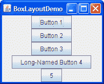
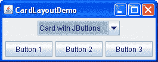
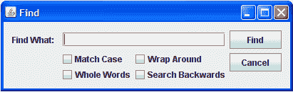

# 布局管理器的可视化指南

> 原文：[`docs.oracle.com/javase/tutorial/uiswing/layout/visual.html`](https://docs.oracle.com/javase/tutorial/uiswing/layout/visual.html)

有几个 AWT 和 Swing 类提供了用于一般用途的布局管理器：

+   `BorderLayout`

+   `BoxLayout`

+   `CardLayout`

+   `FlowLayout`

+   `GridBagLayout`

+   `GridLayout`

+   `GroupLayout`

+   `SpringLayout`

本节展示了使用这些布局管理器的示例 GUI，并告诉您在哪里找到每个布局管理器的操作说明页面。您可以在操作说明页面和示例索引中找到运行示例的链接。

* * *

**注意：** 本课程涵盖了手动编写布局代码，这可能具有挑战性。如果您对学习布局管理的所有细节不感兴趣，您可能更喜欢使用`GroupLayout`布局管理器结合构建工具来布局您的 GUI。其中一个构建工具是 NetBeans IDE。否则，如果您想手动编写代码并且不想使用`GroupLayout`，那么推荐使用`GridBagLayout`作为下一个最灵活和强大的布局管理器。

* * *

如果您有兴趣使用 JavaFX 创建 GUI，请参阅[JavaFX 中的布局](https://docs.oracle.com/javase/8/javafx/layout-tutorial/index.html)。

## BorderLayout

每个内容窗格都初始化为使用`BorderLayout`。（正如使用顶级容器中解释的，内容窗格是所有框架、小程序和对话框中的主要容器。）`BorderLayout` 将组件放在最多五个区域：顶部、底部、左侧、右侧和中心。所有额外的空间都放在中心区域。使用 JToolBar 创建的工具栏必须在`BorderLayout`容器内创建，如果您希望能够将工具栏从其起始位置拖放到其他位置。更多细节，请参阅如何使用 BorderLayout。

## BoxLayout

`BoxLayout` 类将组件放在单行或单列中。它尊重组件的请求的最大尺寸，并且还允许您对齐组件。更多细节，请参阅如何使用 BoxLayout。

## CardLayout

 

`CardLayout`类允许您在不同时间包含不同组件的区域。`CardLayout`通常由组合框控制，组合框的状态确定`CardLayout`显示的哪个面板（一组组件）。使用选项卡窗格的替代方法是使用`CardLayout`，它提供类似的功能，但具有预定义的 GUI。更多详情，请参阅如何使用 CardLayout。

## FlowLayout

`FlowLayout`是每个`JPanel`的默认布局管理器。它简单地将组件按照一行排列，如果其容器宽度不够，则开始新行。CardLayoutDemo 中的两个面板，如前面所示，都使用`FlowLayout`。更多详情，请参阅如何使用 FlowLayout。

## GridBagLayout

`GridBagLayout`是一种复杂、灵活的布局管理器。它通过将组件放置在单元格网格内来对齐组件，允许组件跨越多个单元格。网格中的行可以具有不同的高度，网格列可以具有不同的宽度。更多详情，请参阅如何使用 GridBagLayout。

## GridLayout

`GridLayout`简单地使一组组件大小相等，并以请求的行数和列数显示它们。更多详情，请参阅如何使用 GridLayout。

## GroupLayout

`GroupLayout`是一种为 GUI 构建工具开发的布局管理器，但也可以手动使用。`GroupLayout`分别处理水平和垂直布局。布局针对每个维度独立定义。因此，每个组件在布局中需要定义两次。上面显示的查找窗口是`GroupLayout`的一个示例。更多详情，请参阅如何使用 GroupLayout。

## SpringLayout

`SpringLayout`是一种为 GUI 构建工具设计的灵活布局管理器。它允许您指定其控制下组件的边缘之间的精确关系。例如，您可以定义一个组件的左边缘与第二个组件的右边缘之间的一定距离（可以动态计算）。`SpringLayout`根据一组约束条件布置其关联容器的子组件，如如何使用 SpringLayout 中所示。
