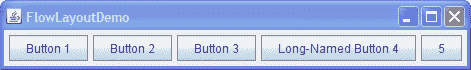
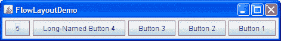

# 使用布局管理器

> 原文：[`docs.oracle.com/javase/tutorial/uiswing/layout/using.html`](https://docs.oracle.com/javase/tutorial/uiswing/layout/using.html)

布局管理器是实现`LayoutManager`接口*的对象，确定容器内组件的大小和位置。尽管组件可以提供大小和对齐提示，但容器的布局管理器最终决定容器内组件的大小和位置。

* * *

**注意：**本课程涵盖了手动编写布局代码，这可能具有挑战性。如果您不想学习布局管理的所有细节，可以选择使用`GroupLayout`布局管理器结合构建工具来布局您的 GUI。其中一个构建工具是 NetBeans IDE。否则，如果您想手动编写代码并且不想使用`GroupLayout`，那么建议使用`GridBagLayout`作为下一个最灵活和强大的布局管理器。

* * *

如果您有兴趣使用 JavaFX 创建 GUI，请参阅[JavaFX 中的布局](https://docs.oracle.com/javase/8/javafx/layout-tutorial/index.html)。

本节讨论了与使用布局管理器相关的一些常见任务：

+   设置布局管理器

+   向容器添加组件

+   提供大小和对齐提示

+   在组件之间放置空间

+   设置容器的方向

+   选择布局管理器的提示

+   第三方布局管理器

## 设置布局管理器

通常情况下，您需要关注的唯一容器的布局管理器是`JPanel`和内容窗格。每个`JPanel`对象在初始化时都会使用`FlowLayout`，除非在创建`JPanel`时另行指定。内容窗格默认使用`BorderLayout`。如果您不喜欢面板或内容窗格使用的默认布局管理器，可以自由更改为其他布局管理器。但是，除非您使用`JToolBar`，否则`FlowLayout`和`BorderLayout`管理器仅适用于原型设计。任何真实的应用程序都需要重新设置布局管理器。再次强调，您应该使用适当的工具来执行此操作，而不是手动编写管理器。

您可以使用`JPanel`构造函数设置面板的布局管理器。例如：

```java
JPanel panel = new JPanel(new BorderLayout());

```

创建容器后，可以使用`setLayout`方法设置其布局管理器。例如：

```java
Container contentPane = frame.getContentPane();
contentPane.setLayout(new FlowLayout());

```

尽管我们*强烈建议*您使用布局管理器，但您也可以在没有布局管理器的情况下进行布局。通过将容器的布局属性设置为 null，您使容器不使用布局管理器。使用这种策略，称为*绝对定位*，您必须指定容器内每个组件的大小和位置。绝对定位的一个缺点是，当顶层容器调整大小时，它不会调整得很好。它也无法很好地适应用户和系统之间的差异，例如不同的字体大小和区域设置。

## 向容器添加组件

当您向面板或内容窗格添加组件时，您为`add`方法指定的参数取决于面板或内容窗格使用的布局管理器。实际上，一些布局管理器甚至不需要您显式添加组件；例如，`GroupLayout`。例如，`BorderLayout`要求您使用类似以下代码指定应将组件添加到的区域（使用`BorderLayout`中定义的常量之一）：

```java
pane.add(aComponent, BorderLayout.PAGE_START);

```

每个布局管理器的操作指南中都详细说明了您需要为`add`方法指定哪些参数（如果有的话）。一些布局管理器，如`GridBagLayout`和`SpringLayout`，需要复杂的设置过程。然而，许多布局管理器只是根据它们添加到容器中的顺序来放置组件。

除了`JPanel`和内容窗格之外的 Swing 容器通常提供了 API，您应该使用这些 API 而不是`add`方法。例如，不要直接向滚动窗格（或者实际上是其视口）添加组件，而是要么在`JScrollPane`构造函数中指定组件，要么使用`setViewportView`方法。由于有了这样的专门 API，您不需要知道许多 Swing 容器使用的布局管理器（如果有的话）。（对于好奇的人：滚动窗格实际上使用了一个名为`ScrollPaneLayout`的布局管理器。）

有关如何向特定容器添加组件的信息，请参阅该容器的操作指南页面。您可以使用各种组件的使用方法找到组件的操作指南页面。

## 提供大小和对齐提示

有时，您需要自定义组件向其容器的布局管理器提供的大小提示，以便组件能够被很好地布局。您可以通过指定组件的最小、首选和最大大小来实现这一点。您可以调用组件的设置大小提示方法——`setMinimumSize`、`setPreferredSize`和`setMaximumSize`。或者您可以创建一个子类，重写适当的获取器方法——`getMinimumSize`、`getPreferredSize`和`getMaximumSize`。以下是使组件的最大大小无限制的示例：

```java
component.setMaximumSize(new Dimension(Integer.MAX_VALUE,
                                       Integer.MAX_VALUE));

```

许多布局管理器不关注组件的请求的最大尺寸。然而，`BoxLayout`和`SpringLayout`会关注。此外，`GroupLayout`提供了明确设置最小、首选或最大尺寸的能力，而无需触及组件。

除了提供大小提示外，您还可以提供对齐提示。例如，您可以指定两个组件的顶部边缘应该对齐。您可以通过调用组件的`setAlignmentX`和`setAlignmentY`方法，或者通过覆盖组件的`getAlignmentX`和`getAlignmentY`方法来设置对齐提示。尽管大多数布局管理器会忽略对齐提示，但`BoxLayout`会遵守它们。您可以在如何使用 BoxLayout 中找到设置对齐的示例。

## 在组件之间放置空间

影响容器中可见组件之间空间量的三个因素：

布局管理器

一些布局管理器会自动在组件之间放置空间；其他则不会。有些允许您指定组件之间的空间量。有关间距支持的信息，请参见每个布局管理器的操作页面。

不可见组件

你可以创建轻量级组件，不进行绘制，但可以在 GUI 中占据空间。通常情况下，您可以在由`BoxLayout`控制的容器中使用不可见组件。参见如何使用 BoxLayout 以查看使用不可见组件的示例。

空边框

无论使用何种布局管理器，您都可以通过向组件添加空边框来影响组件之间的视觉空间量。最适合空边框的候选组件是通常没有默认边框的组件，例如面板和标签。一些其他组件可能在某些外观和感觉实现中无法很好地与边框配合工作，因为它们的绘制代码的实现方式不同。有关边框的信息，请参见如何使用边框。

## 设置容器的方向

本网站使用英语编写，文本从左到右，然后从上到下。然而，许多其他语言具有不同的方向。`componentOrientation`属性提供了一种指示特定组件应该使用与默认的从左到右，从上到下方向不同的方式的方法。在诸如单选按钮之类的组件中，方向可能被用作提示，指示外观和感觉应该切换按钮中图标和文本的位置。在容器中，方向被用作布局管理器的提示。

要设置容器的方向，您可以使用`Component`定义的方法[`setComponentOrientation`](https://docs.oracle.com/javase/8/docs/api/java/awt/Component.html#setComponentOrientation-java.awt.ComponentOrientation-)或者，为了同时设置容器的子组件的方向，使用[`applyComponentOrientation`](https://docs.oracle.com/javase/8/docs/api/java/awt/Component.html#applyComponentOrientation-java.awt.ComponentOrientation-)。任一方法的参数可以是常量，如`ComponentOrientation.RIGHT_TO_LEFT`，或者可以是调用`ComponentOrientation`方法[`getOrientation(Locale)`](https://docs.oracle.com/javase/8/docs/api/java/awt/ComponentOrientation.html#getOrientation-java.util.Locale-)。例如，以下代码使所有`JComponent`都使用阿拉伯语区域设置进行初始化，然后相应地设置内容窗格和其中所有组件的方向：

```java
JComponent.setDefaultLocale(new Locale("ar"));
JFrame frame = new JFrame();
...
Container contentPane = frame.getContentPane();
contentPane.applyComponentOrientation(
    ComponentOrientation.getOrientation(
        contentPane.getLocale()));

```

这里有两张图片展示了`FlowLayout`在完全相同的容器中以不同方向布局组件的方式。



默认方向（从左到右）



从右到左方向

支持组件方向的标准布局管理器包括`FlowLayout`、`BorderLayout`、`BoxLayout`、`GridBagLayout`和`GridLayout`。

* * *

**注意：** 必须注意将组件方向应用于渲染器、编辑器和通过容器层次结构的正常遍历无法访问的任何其他组件。

* * *

## 选择布局管理器的提示

布局管理器有不同的优势和劣势。本节讨论了一些常见的布局场景以及哪些布局管理器可能适用于每种场景。然而，再次强烈建议您使用构建工具来创建您的布局管理器，比如[NetBeans IDE Matisse GUI builder](http://netbeans.org/kb/trails/matisse.html)，而不是手动编码管理器。下面列出的场景仅供信息参考，以防您想知道不同情况下使用哪种类型的管理器，或者您绝对必须手动编码您的管理器。

如果我们讨论的布局管理器都不适合您的情况，并且您不能使用构建工具，请随意使用您可能编写或找到的其他布局管理器。还要记住，灵活的布局管理器如`GridBagLayout`和`SpringLayout`可以满足许多布局需求。

**场景：** 您需要在尽可能多的空间中显示一个组件。

如果它是容器中唯一的组件，请使用`GridLayout`或`BorderLayout`。否则，`BorderLayout`或`GridBagLayout`可能是一个很好的选择。

如果使用`BorderLayout`，您需要将占用大量空间的组件放在中心位置。使用`GridBagLayout`，您需要设置组件的约束条件，使`fill=GridBagConstraints.BOTH`。另一种可能性是使用`BoxLayout`，使占用大量空间的组件指定非常大的首选大小和最大大小。

**场景：** 您需要以它们的自然大小在一个紧凑的行中显示几个组件。

考虑使用`JPanel`来组合组件，并使用`JPanel`的默认`FlowLayout`管理器或`BoxLayout`管理器。`SpringLayout`也适用于这种情况。

**场景：** 您需要以行和列的方式显示几个相同大小的组件。

`GridLayout`非常适合这种情况。

**场景：** 您需要以行或列的方式显示几个组件，可能在它们之间有不同数量的空间，自定义对齐方式或自定义组件大小。

`BoxLayout`非常适合这种情况。

**场景：** 您需要显示对齐的列，就像在一个类似表单的界面中，一个标签列用于描述相邻列中的文本字段。

`SpringLayout`是这种情况的自然选择。几个教程示例中使用的`SpringUtilities`类定义了一个`makeCompactGrid`方法，让您可以轻松地对齐多行和多列的组件。

**场景：** 您有一个包含许多组件的复杂布局。

考虑使用非常灵活的布局管理器，如`GridBagLayout`或`SpringLayout`，或将组件分组到一个或多个`JPanel`中以简化布局。如果采用后一种方法，每个`JPanel`可能会使用不同的布局管理器。

## 第三方布局管理器

Swing 社区创建了其他第三方布局管理器，以补充 Java 平台提供的布局管理器。以下列表并非绝对，但下面列出的布局管理器是最受欢迎的：

+   [MiGLayout](http://www.miglayout.com/)

+   [Karsten Lentzsch 的 FormLayout](http://www.jgoodies.com/)

* * *

*早在 JDK 1.1 时引入了第二个接口`LayoutManager2`。`LayoutManager2`扩展了`LayoutManager`，提供了最大尺寸和对齐支持。`LayoutManager2`还添加了`addLayoutComponent`方法，接受一个`Object`，以及`invalidateLayout`方法。布局管理器还需要`LayoutManager2`提供的通知，因此任何现代布局管理器都需要实现它。
