# 如何使用 BoxLayout

> 原文：[`docs.oracle.com/javase/tutorial/uiswing/layout/box.html`](https://docs.oracle.com/javase/tutorial/uiswing/layout/box.html)

* * *

**注意：** 本课程涵盖了手动编写布局代码，这可能具有挑战性。如果你不想学习布局管理的所有细节，可以选择使用`GroupLayout`布局管理器结合构建工具来布局你的 GUI。其中一个构建工具是 NetBeans IDE。否则，如果你想手动编码而不想使用`GroupLayout`，那么推荐使用`GridBagLayout`作为下一个最灵活和强大的布局管理器。

* * *

如果你有兴趣使用 JavaFX 来创建你的 GUI，请查看[JavaFX 布局教程](https://docs.oracle.com/javase/8/javafx/layout-tutorial/index.html)。

Swing 包含一个名为[`BoxLayout`](https://docs.oracle.com/javase/8/docs/api/javax/swing/BoxLayout.html)的通用布局管理器。`BoxLayout`可以将其组件堆叠在一起或者按行排列 - 由你选择。你可以将其视为`FlowLayout`的一个版本，但功能更强大。这里是一个应用程序的图片，演示了如何使用`BoxLayout`来显示一个居中的组件列：

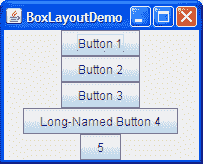

点击“启动”按钮以使用[Java™ Web Start](http://www.oracle.com/technetwork/java/javase/javawebstart/index.html)运行 BoxLayoutDemo（[下载 JDK 7 或更高版本](http://www.oracle.com/technetwork/java/javase/downloads/index.html)）。或者，要自行编译和运行示例，请参考示例索引。


你可以在`BoxLayoutDemo.java`中查看代码。

以下图片展示了一个使用两个`BoxLayout`实例的 GUI。在 GUI 的顶部，一个从上到下的盒式布局将一个标签放在滚动窗格上方。在 GUI 的底部，一个从左到右的盒式布局将两个按钮并排放置。`BorderLayout`结合了 GUI 的两部分，并确保任何多余的空间都给了滚动窗格。

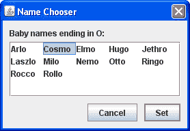

你可以在示例索引中找到运行 ListDialog 以及其源文件的链接，用于使用 Swing 组件。

以下代码取自``ListDialog.java``，布局了 GUI。这段代码位于对话框的构造函数中，该对话框是作为`JDialog`子类实现的。粗体代码设置了 Box 布局并向其中添加了组件。

```java
JScrollPane listScroller = new JScrollPane(list);
listScroller.setPreferredSize(new Dimension(250, 80));
listScroller.setAlignmentX(LEFT_ALIGNMENT);
...
//Lay out the label and scroll pane from top to bottom.
JPanel listPane = new JPanel();
listPane.setLayout(new BoxLayout(listPane, BoxLayout.PAGE_AXIS));
JLabel label = new JLabel(labelText);
...
listPane.add(label);
listPane.add(Box.createRigidArea(new Dimension(0,5)));
listPane.add(listScroller);
listPane.setBorder(BorderFactory.createEmptyBorder(10,10,10,10));

//Lay out the buttons from left to right.
JPanel buttonPane = new JPanel();
buttonPane.setLayout(new BoxLayout(buttonPane, BoxLayout.LINE_AXIS));
buttonPane.setBorder(BorderFactory.createEmptyBorder(0, 10, 10, 10));
buttonPane.add(Box.createHorizontalGlue());
buttonPane.add(cancelButton);
buttonPane.add(Box.createRigidArea(new Dimension(10, 0)));
buttonPane.add(setButton);

//Put everything together, using the content pane's BorderLayout.
Container contentPane = getContentPane();
contentPane.add(listPane, BorderLayout.CENTER);
contentPane.add(buttonPane, BorderLayout.PAGE_END);

```

第一行粗体代码创建了一个从上到下的 Box 布局，并将其设置为`listPane`的布局管理器。`BoxLayout` 构造函数的两个参数是它管理的容器和组件将被布局的轴。`PAGE_AXIS` 常量指定组件应该按照页面上行流动的方向进行布局，由目标容器的`ComponentOrientation`属性确定。`LINE_AXIS` 常量指定组件应该按照文本行的方向进行布局，由目标容器的`ComponentOrientation`属性确定。这些常量允许通过以正确的从左到右、从右到左或从上到下的方向为所用语言的容器中的组件进行布局来进行国际化。

接下来的三行粗体代码将标签和滚动窗格添加到容器中，并使用一个*刚性区域*分隔它们 — 一个用于在组件之间添加空间的不可见组件。在这种情况下，刚性区域没有宽度，并在标签和滚动窗格之间放置了确切的`5 像素`。稍后在使用不可见组件作为填充中讨论了刚性区域。

下一块粗体代码创建了一个从左到右的 Box 布局，并为`buttonPane`容器设置了布局。然后代码向容器添加了两个按钮，使用一个刚性区域在按钮之间放置了`10 像素`。为了将按钮放置在其容器的右侧，添加到容器的第一个组件是*glue*。这个 glue 是一个不可见组件，根据需要增长以吸收其容器中的任何额外空间。在使用不可见组件作为填充中讨论了 glue。

作为使用不可见组件的替代方案，有时可以使用空边框来在组件周围创建空间，尤其是面板。例如，前面的代码片段使用空边框在对话框及其内容的所有边缘之间以及内容的两个部分之间放置了`10 像素`。边框完全独立于布局管理器。它们只是 Swing 组件如何绘制其边缘并在组件内容和边缘之间提供填充的方式。更多信息请参见如何使用边框。

以下部分更详细地讨论了`BoxLayout`：

+   Box 布局特性

+   使用不可见组件作为填充

+   修复对齐问题

+   指定组件大小

+   Box 布局 API

+   使用 Box 布局的示例

不要让`BoxLayout`讨论的长度吓到你！你可能已经可以使用`BoxLayout`了。如果遇到问题或想利用`BoxLayout`的功能，继续阅读。

## Box Layout 特点

如前所述，`BoxLayout`将组件排列在彼此上方或一行中。在安排组件时，BoxLayout 会考虑组件的对齐方式以及最小、首选和最大尺寸。在本节中，我们将讨论从上到下的布局。相同的概念适用于从左到右或从右到左的布局。只需用 Y 替换 X，宽度替换高度等。

* * *

**版本说明：**在 JDK 版本 1.4 之前，没有为以本地化方式指定框布局轴的常量。相反，在创建`BoxLayout`时，您指定`X_AXIS`（从左到右）或`Y_AXIS`（从上到下）。我们的示例现在使用常量`LINE_AXIS`和`PAGE_AXIS`，因为它们可以使程序适应具有不同方向的语言。在默认的从左到右方向中，`LINE_AXIS`指定从左到右的布局，`PAGE_AXIS`指定从上到下的布局。

* * *

当`BoxLayout`从上到下布局组件时，它会尝试将每个组件的大小设置为组件的首选高度。如果布局的垂直空间与首选高度之和不匹配，那么`BoxLayout`会尝试调整组件的大小以填充空间。组件会增长或缩小以填充空间，`BoxLayout`会遵守每个组件的最小和最大尺寸。任何额外的空间都会出现在容器的底部。

对于从上到下的框布局，容器的首选宽度是子组件的最大首选宽度。如果容器被强制变宽，`BoxLayout`会尝试将每个组件的宽度调整为容器的宽度（减去插入）。如果组件的最大尺寸小于容器的宽度，则 X 对齐会起作用。

X 对齐不仅影响组件相对位置，还影响组件（作为一组）在容器中的位置。以下图示说明了具有受限制最大宽度的组件的对齐方式。

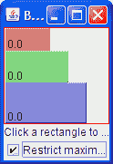  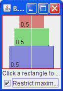  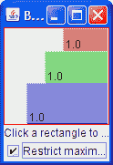

在第一个图中，所有三个组件的 X 对齐为 0.0（`Component.LEFT_ALIGNMENT`）。这意味着组件的左侧应对齐。此外，这意味着所有三个组件在容器中尽可能靠左位置。

在第二个图中，所有三个组件的 X 对齐为 0.5（`Component.CENTER_ALIGNMENT`）。这意味着组件的中心应该对齐，并且组件应该位于其容器的水平中心。

在第三个图中，组件的 X 对齐为 1.0（`Component.RIGHT_ALIGNMENT`）。您可以猜测这对于组件的对齐和位置相对于其容器意味着什么。

您可能想知道当组件具有受限制的最大尺寸和不同的 X 对齐方式时会发生什么。下一个图显示了一个示例：

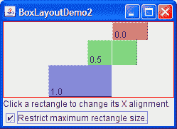

如您所见，具有 X 对齐为 0.0（`Component.LEFT_ALIGNMENT`）的组件的左侧与具有 0.5 X 对齐（`Component.CENTER_ALIGNMENT`）的组件的中心对齐，后者与具有 X 对齐为 1.0（`Component.RIGHT_ALIGNMENT`）的组件的右侧对齐。这种混合对齐方式在修复对齐问题中进一步讨论。

如果没有任何组件具有最大宽度会怎么样？在这种情况下，如果所有组件具有相同的 X 对齐方式，则所有组件将与其容器一样宽。如果 X 对齐方式不同，则具有 X 对齐为 0.0（左）或 1.0（右）的任何组件将较小。所有具有中间 X 对齐方式（例如中心）的组件将与其容器一样宽。以下是两个示例：

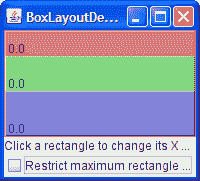  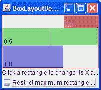

要更好地了解`BoxLayout`，您可以运行自己的 BoxLayoutDemo2 实验。

* * *

**试试这个：**

1.  单击“启动”按钮以使用[Java™ Web Start](http://www.oracle.com/technetwork/java/javase/javawebstart/index.html)运行 BoxLayoutDemo2（[下载 JDK 7 或更高版本](http://www.oracle.com/technetwork/java/javase/downloads/index.html)）。或者，要自行编译和运行示例，请参考示例索引。

    您可以在`BoxLayoutDemo2.java`中查看代码。

    您将看到一个类似上面的窗口，其中包含三个矩形。每个矩形都是`BLDComponent`的一个实例，它是`JComponent`的子类。

1.  单击其中一个矩形内部。

    这是如何更改矩形的 X 对齐方式。

1.  单击窗口底部的复选框。

    这将关闭所有矩形的限制尺寸。

1.  使窗口变得更高。

    这使得矩形的容器比矩形的首选大小之和更大。容器是一个带有红色轮廓的`JPanel`，这样您就可以知道容器的边缘在哪里。

* * *

## 使用不可见组件作为填充器

由框布局控制的每个组件都与其相邻组件紧密相连。如果您希望在组件之间有空间，可以向一个或两个组件添加空的边框，或插入不可见组件来提供空间。您可以借助`Box`类创建不可见组件。

[`Box`](https://docs.oracle.com/javase/8/docs/api/javax/swing/Box.html)类定义了一个嵌套类[`Box.Filler`](https://docs.oracle.com/javase/8/docs/api/javax/swing/Box.Filler.html)，这是一个透明的组件，不绘制任何内容，用于在其他组件之间提供空间。然而，`Filler`实际上并不是不可见的，因为没有调用`setVisible(false)`。`Box`类提供了便利方法来帮助您创建常见类型的填充器。以下表格详细介绍了如何使用`Box`和`Box.Filler`创建不可见组件。

| 类型 | 大小约束 | 创建方式 |
| --- | --- | --- |
| 刚性区域 |   | `Box.createRigidArea(size)` |
| 粘合剂，水平 |   | `Box.createHorizontalGlue()` |
| 粘合剂，垂直 |   | `Box.createVerticalGlue()` |
| 自定义`Box.Filler` | *(如指定)* | `new Box.Filler(minSize, prefSize, maxSize)` |

这是您通常如何使用每种类型的填充器：

**刚性区域**

当您希望在两个组件之间有固定大小的空间时，请使用此选项。例如，在从左到右的框中在两个组件之间放置 5 像素，您可以使用以下代码：

```java
container.add(firstComponent);
container.add(Box.createRigidArea(new Dimension(5,0)));
container.add(secondComponent);

```

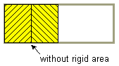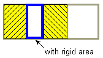

* * *

**注意：** `Box`类提供了另一种用于在组件之间放置固定空间的填充器：垂直或水平支柱。不幸的是，支柱具有无限的最大高度或宽度（分别用于水平和垂直支柱）。这意味着，如果您在垂直框内使用水平框，水平框有时可能会变得太高。因此，我们建议您使用刚性区域而不是支柱。

* * *

**粘合剂**

使用这个方法可以指定布局中多余的空间应该去哪里。将其视为一种弹性胶水 — 有弹性和可伸缩性，但除非你拉开它粘附的组件，否则不占用空间。例如，在一个从左到右的盒式布局中，在两个组件之间放置水平粘合剂，可以使任何额外的空间都在这些组件之间，而不是在所有组件的右侧。以下是一个示例，使得从左到右的盒式布局中的空间在两个组件之间，而不是在组件的右侧：

```java
container.add(firstComponent);
container.add(Box.createHorizontalGlue());
container.add(secondComponent);

```

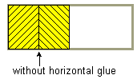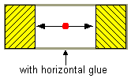

**自定义`Box.Filler`**

使用这个方法可以指定组件的最小、首选和最大尺寸。例如，要在一个从左到右的布局中创建一些填充物，使得两个组件之间至少有 5 像素的间距，并确保容器的最小高度为 100 像素，你可以使用以下代码：

```java
container.add(firstComponent);
Dimension minSize = new Dimension(5, 100);
Dimension prefSize = new Dimension(5, 100);
Dimension maxSize = new Dimension(Short.MAX_VALUE, 100);
container.add(new Box.Filler(minSize, prefSize, maxSize));
container.add(secondComponent);

```

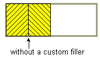 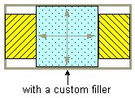

## 修复对齐问题

有时候`BoxLayout`会出现两种类型的对齐问题：

+   一组组件都具有相同的对齐方式，但你想要改变它们的对齐方式以使它们看起来更好。例如，你可能希望一组从左到右的按钮的底部对齐，而不是它们的中心对齐。以下是一个示例：

    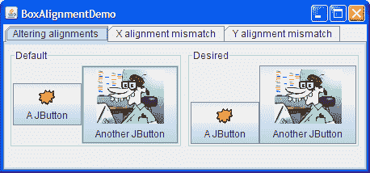

+   由`BoxLayout`控制的两个或更多组件具有不同的默认对齐方式，导致它们对齐不正确。例如，如下所示，如果一个标签和一个面板在一个从上到下的盒式布局中，标签的左边缘默认与面板的中心对齐。

    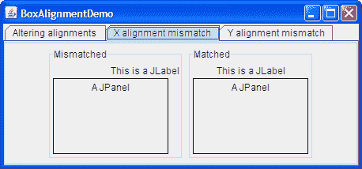

一般来说，由从上到下的`BoxLayout`对象控制的所有组件应该具有相同的 X 对齐方式。同样，由从左到右的`BoxLayout`控制的所有组件通常应该具有相同的 Y 对齐方式。你可以通过调用其`setAlignmentX`方法来设置`JComponent`的 X 对齐方式。所有组件都可以选择的另一种方法是在组件类的自定义子类中覆盖`getAlignmentX`方法。类似地，你可以通过调用`setAlignmentY`方法或覆盖`getAlignmentY`来设置组件的 Y 对齐方式。

这里有一个示例，取自一个名为`BoxAlignmentDemo`的应用程序，将两个按钮的 Y 对齐方式更改为底部对齐：

```java
button1.setAlignmentY(Component.BOTTOM_ALIGNMENT);
button2.setAlignmentY(Component.BOTTOM_ALIGNMENT);

```

点击“启动”按钮以使用[Java™ Web Start](http://www.oracle.com/technetwork/java/javase/javawebstart/index.html)运行 BoxAlignmentDemo（[下载 JDK 7 或更高版本](http://www.oracle.com/technetwork/java/javase/downloads/index.html)）。或者，要自行编译和运行示例，请参考示例索引。


默认情况下，大多数组件都具有中心 X 和 Y 对齐。然而，按钮、组合框、标签和菜单项具有不同的默认 X 对齐值：`LEFT_ALIGNMENT`。前面的图片展示了如果将一个左对齐的组件（如标签）与一个在由上至下控制的容器中的中心对齐组件放在一起会发生什么。

`BoxAlignmentDemo`程序提供了修复不匹配对齐问题的示例。通常，只需将有问题的按钮或标签设置为中心对齐即可。例如：

```java
label.setAlignmentX(Component.CENTER_ALIGNMENT);

```

## 指定组件尺寸

正如之前提到的，`BoxLayout`会关注组件的请求的最小、首选和最大尺寸。在微调布局时，你可能需要调整这些尺寸。

有时需要调整尺寸是显而易见的。例如，按钮的最大尺寸通常与其首选尺寸相同。如果希望在有额外空间时将按钮绘制得更宽，那么需要更改其最大尺寸。

然而，有时需要调整尺寸并不那么明显。你可能会在框布局中得到意想不到的结果，而不知道原因。在这种情况下，通常最好首先将问题视为对齐问题。如果调整对齐方式没有帮助，那么可能存在尺寸问题。我们稍后会进一步讨论这个问题。

* * *

**注意：** 虽然`BoxLayout`会关注组件的最大尺寸，但许多布局管理器不会。例如，如果你将一个按钮放在`BorderLayout`的底部，那么按钮的宽度可能会超过其首选宽度，无论按钮的最大尺寸是多少。另一方面，`BoxLayout`永远不会使按钮的宽度超过其最大尺寸。

* * *

你可以通过两种方式更改最小、首选和最大尺寸：

+   通过调用适当的`set*Xxx*Size`方法（由`JComponent`类定义）。例如：

    ```java
    comp.setMinimumSize(new Dimension(50, 25));
    comp.setPreferredSize(new Dimension(50, 25));
    comp.setMaximumSize(new Dimension(Short.MAX_VALUE,
                                      Short.MAX_VALUE));

    ```

+   通过覆盖适当的`get*Xxx*Size`方法。例如：

    ```java
    *...//in a subclass of a component class:*
    public Dimension getMaximumSize() {
        size = getPreferredSize();
        size.width = Short.MAX_VALUE;
        return size;
    }

    ```

如果你在使用框布局时遇到问题，并且已经排除了对齐问题，那么问题很可能与尺寸有关。例如，如果由框布局控制的容器占用了太多空间，那么容器中的一个或多个组件可能需要限制其最大尺寸。

您可以使用两种技术来追踪箱式布局中的尺寸问题：

+   在问题的 Swing 组件外部添加花哨的线条边框。这样你就可以看到它们的真实大小。例如：

    ```java
    comp.setBorder(BorderFactory.createCompoundBorder(
                       BorderFactory.createLineBorder(Color.red),
                       comp.getBorder()));

    ```

+   使用`System.out.println`来打印组件的最小、首选和最大尺寸，也许还有它们的边界。

## Box 布局 API

以下表格列出了常用的`BoxLayout`和`Box`构造函数和方法。使用箱式布局的 API 分为以下几类：

+   创建`BoxLayout`对象

+   创建空间填充器

+   其他有用的方法

创建`BoxLayout`对象

| 构造函数或方法 | 目的 |
| --- | --- |
| `BoxLayout(Container, int)` | 创建一个控制指定`Container`的`BoxLayout`实例。整数参数指定容器的组件应该沿着哪个轴布局。当容器具有默认组件方向时，`BoxLayout.LINE_AXIS`指定组件从左到右布局，`BoxLayout.PAGE_AXIS`指定组件从上到下布局。 |
| `Box(int)` | 创建一个`Box` - 使用指定轴的`BoxLayout`的容器。 |
| `static Box createHorizontalBox()` *(在`Box`中)* | 创建一个从左到右布局其组件的`Box`。 |
| `static Box createVerticalBox()` *(在`Box`中)* | 创建一个从上到下布局其组件的`Box`。 |

创建空间填充器

*这些方法在`Box`类中定义。*

| 构造函数或方法 | 目的 |
| --- | --- |
| `Component createRigidArea(Dimension)` | 创建一个刚性组件。 |

| `Component createHorizontalGlue() Component createVerticalGlue()`

| `Component createGlue()` | 创建一个粘合剂组件。水平粘合剂和垂直粘合剂非常有用。 |

| `Component createHorizontalStrut() Component createVerticalStrut()` | 创建一个“支柱”组件。我们建议使用刚性区域而不是支柱。 |
| --- | --- |
| `Box.Filler(Dimension, Dimension, Dimension)` | 创建一个具有指定最小、首选和最大尺寸的组件（参数按照指定顺序提供）。有关详细信息，请参阅本节前面的自定义`Box.Filler`讨论。 |

其他有用的方法

| 方法 | 目的 |
| --- | --- |
| `void changeShape(Dimension, Dimension, Dimension)` *(在`Box.Filler`中)* | 更改接收者`Box.Filler`对象的最小、首选和最大尺寸。布局会相应更改。 |

## 使用 Box 布局的示例

以下表格列出了使用箱式布局的许多示例。

| 示例 | 描述位置 | 注释 |
| --- | --- | --- |
| BoxLayoutDemo2 | 本页 | 使用箱式布局创建一个居中的列组件。 |
| BoxAlignmentDemo | 本页 | 演示如何解决常见的对齐问题。 |
| BoxLayoutDemo | 本页面 | 让您尝试对齐和最大尺寸。 |
| ListDialog | 本页面 | 一个简单但逼真的例子，展示了如何同时使用自顶向下箱式布局和左右箱式布局。使用水平粘合剂、刚性区域和空边框。还设置了组件的 X 对齐方式。 |
| InternalFrameEventDemo | 如何编写内部框架监听器 | 使用自顶向下布局来将按钮和滚动窗格居中放置在内部框架中。 |
| MenuGlueDemo | 自定义菜单布局 | 展示如何使用粘合组件将菜单右对齐在菜单栏中。 |
| MenuLayoutDemo | 自定义菜单布局 | 展示如何通过将菜单栏更改为使用自顶向下的箱式布局，以及上下文菜单更改为使用左右的箱式布局来自定义菜单布局。 |
| `ConversionPanel.java` 在 Converter 演示中 | 如何使用面板 | 通过将组件的宽度设置为相同，以及它们容器的宽度设置为相同，来在不同的箱式布局控制容器中对齐两个组件。 |
