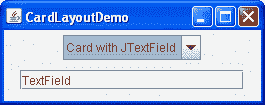
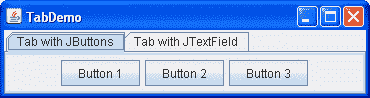

# 如何使用 CardLayout

> 原文：[`docs.oracle.com/javase/tutorial/uiswing/layout/card.html`](https://docs.oracle.com/javase/tutorial/uiswing/layout/card.html)

* * *

**注意：** 本课程涵盖手动编写布局代码，这可能具有挑战性。如果您对学习布局管理的所有细节不感兴趣，您可能更喜欢使用`GroupLayout`布局管理器结合构建工具来布局您的 GUI。其中一个构建工具是 NetBeans IDE。否则，如果您想手动编码而不想使用`GroupLayout`，那么建议使用`GridBagLayout`作为下一个最灵活和强大的布局管理器。

* * *

如果您有兴趣使用 JavaFX 创建 GUI，请参阅[JavaFX 中的布局](https://docs.oracle.com/javase/8/javafx/layout-tutorial/index.html)。

以下图表示一个应用程序的快照，该应用程序使用[`CardLayout`](https://docs.oracle.com/javase/8/docs/api/java/awt/CardLayout.html)类在两个面板之间切换。

 

点击“启动”按钮以使用[Java™ Web Start](http://www.oracle.com/technetwork/java/javase/javawebstart/index.html)运行 CardLayoutDemo（[下载 Java SE](http://www.oracle.com/technetwork/java/javase/downloads/index.html)）。或者，要自行编译和运行示例，请参考示例索引。


这个演示的完整代码在`CardLayoutDemo.java`文件中。

`CardLayout`类管理两个或多个组件（通常是`JPanel`实例），它们共享相同的显示空间。使用`CardLayout`类时，让用户通过使用组合框在组件之间进行选择。`CardLayoutDemo`应用程序是一个示例，用于说明此功能。

另一种完成相同任务的方法是使用选项卡窗格。下图显示了前面示例的选项卡窗格版本：



因为选项卡窗格提供了自己的 GUI，所以使用选项卡窗格比使用`CardLayout`类更简单。例如，使用选项卡窗格实现前面的示例会导致代码行数更少的程序。

单击“启动”按钮以使用[Java™ Web Start](http://www.oracle.com/technetwork/java/javase/javawebstart/index.html)运行 TabDemo（[下载 JDK 7 或更高版本](http://www.oracle.com/technetwork/java/javase/downloads/index.html)）。或者，要自行编译和运行示例，请参考示例索引。


此演示的完整代码位于`TabDemo.java`文件中。

从概念上讲，`CardLayout`管理的每个组件都像一叠扑克牌或交换卡片，任何时候只有顶部卡片可见。您可以通过以下任何方式选择显示的卡片：

+   通过请求第一张或最后一张卡片，按照添加到容器的顺序

+   通过向前或向后翻转卡片堆栈来选择卡片。

+   通过指定具有特定名称的卡片

`CardLayoutDemo`类使用最后一种方案。

来自`CardLayoutDemo.java`应用程序的以下代码片段创建了`CardLayout`对象及其管理的组件。

```java
*//Where instance variables are declared:*
JPanel cards;
final static String BUTTONPANEL = "Card with JButtons";
final static String TEXTPANEL = "Card with JTextField";

*//Where the components controlled by the CardLayout are initialized:*
//Create the "cards".
JPanel card1 = new JPanel();
...
JPanel card2 = new JPanel();
...

//Create the panel that contains the "cards".
cards = new JPanel(new CardLayout());
cards.add(card1, BUTTONPANEL);
cards.add(card2, TEXTPANEL);

```

要将组件添加到`CardLayout`对象管理的容器中，请指定一个标识要添加的组件的字符串。例如，在此演示中，第一个面板的字符串是`"Card with JButtons"`，第二个面板的字符串是`"Card with JTextField"`。在此演示中，这些字符串也在组合框中使用。

要选择`CardLayout`对象显示的组件，请在您的代码示例中添加额外的代码：

```java
*//Where the GUI is assembled:*
//Put the JComboBox in a JPanel to get a nicer look.
JPanel comboBoxPane = new JPanel(); //use FlowLayout
String comboBoxItems[] = { BUTTONPANEL, TEXTPANEL };
JComboBox cb = new JComboBox(comboBoxItems);
cb.setEditable(false);
cb.addItemListener(this);
comboBoxPane.add(cb);
...
pane.add(comboBoxPane, BorderLayout.PAGE_START);
pane.add(cards, BorderLayout.CENTER);
...

//Method came from the ItemListener class implementation,
//contains functionality to process the combo box item selecting
public void itemStateChanged(ItemEvent evt) {
    CardLayout cl = (CardLayout)(cards.getLayout());
    cl.show(cards, (String)evt.getItem());
}

```

此示例显示，要使用`CardLayout`类的`show`方法，必须设置当前可见的组件。`show`方法中的第一个参数是`CardLayout`控制的容器，即`CardLayout`管理的组件的容器。第二个参数是标识要显示的组件的字符串。这个字符串与将组件添加到容器时使用的字符串相同。

## CardLayout API

以下表格列出了用于选择组件的`CardLayout`类方法。对于每个方法，第一个参数是`CardLayout`是布局管理器的容器（`CardLayout`控制的卡片的容器）。

| 方法 | 目的 |
| --- | --- |
| [`first (Container *parent*)`](https://docs.oracle.com/javase/8/docs/api/java/awt/CardLayout.html#first-java.awt.Container-) | 翻转到容器的第一张卡片。 |
| [`next (Container *parent*)`](https://docs.oracle.com/javase/8/docs/api/java/awt/CardLayout.html#next-java.awt.Container-) | 翻转到容器的下一张卡片。如果当前可见的卡片是最后一张，则此方法将翻转到布局中的第一张卡片。 |
| [`previous (Container *parent*)`](https://docs.oracle.com/javase/8/docs/api/java/awt/CardLayout.html#previous-java.awt.Container-) | 翻转到容器的上一张卡片。如果当前可见的卡片是第一张，则此方法将翻转到布局中的最后一张卡片。 |
| [`last (Container *parent*)`](https://docs.oracle.com/javase/8/docs/api/java/awt/CardLayout.html#last-java.awt.Container-) | 翻转到容器的最后一张卡片。 |
| [`show (Container *parent*, String *name*)`](https://docs.oracle.com/javase/8/docs/api/java/awt/CardLayout.html#show-java.awt.Container-java.lang.String-) | 使用指定的 `name` 使用 [`addLayoutComponent`](https://docs.oracle.com/javase/8/docs/api/java/awt/CardLayout.html#addLayoutComponent-java.awt.Component-java.lang.Object-) 方法添加到此布局中的组件进行翻转。 |

## 使用 CardLayout 的示例

在这个教程中，只有一个示例使用了 `CardLayout`，即 `CardLayoutDemo`。一般来说，我们的示例使用 选项卡面板 而不是 `CardLayout`，因为选项卡面板提供了自己的 GUI。
