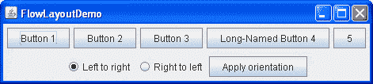

# 如何使用流式布局

> 原文：[`docs.oracle.com/javase/tutorial/uiswing/layout/flow.html`](https://docs.oracle.com/javase/tutorial/uiswing/layout/flow.html)

* * *

**注意：** 本课程涵盖了手动编写布局代码，这可能具有挑战性。如果您不想学习布局管理的所有细节，您可能更喜欢使用`GroupLayout`布局管理器结合构建工具来布局您的 GUI。其中一个构建工具是 NetBeans IDE。否则，如果您想手动编码而不想使用`GroupLayout`，那么推荐使用`GridBagLayout`作为下一个最灵活和强大的布局管理器。

* * *

如果您有兴趣使用 JavaFX 创建 GUI，请参阅[JavaFX 中的布局](https://docs.oracle.com/javase/8/javafx/layout-tutorial/index.html)。

[`FlowLayout`](https://docs.oracle.com/javase/8/docs/api/java/awt/FlowLayout.html)类提供了一个非常简单的布局管理器，默认情况下由`JPanel`对象使用。以下图表示使用流式布局的应用程序的快照：



单击“启动”按钮以使用[Java™ Web Start](http://www.oracle.com/technetwork/java/javase/javawebstart/index.html)运行`FlowLayoutDemo`（[下载 JDK 7 或更高版本](http://www.oracle.com/technetwork/java/javase/downloads/index.html)）。或者，要自行编译和运行示例，请参考示例索引。


此演示的完整代码位于`FlowLayoutDemo.java`文件中。

`FlowLayout` 类将组件放在一行中，大小为它们的首选大小。如果容器中的水平空间太小，无法将所有组件放在一行中，`FlowLayout` 类将使用多行。如果容器比一行组件所需的宽度更宽，则默认情况下，该行在容器内水平居中。要指定行是左对齐还是右对齐，请使用带有对齐参数的`FlowLayout`构造函数。`FlowLayout`类的另一个构造函数指定在组件周围放置多少垂直或水平填充。

下面的代码片段创建了一个`FlowLayout`对象和它管理的组件。

```java
FlowLayout experimentLayout = new FlowLayout();

...

    compsToExperiment.setLayout(experimentLayout);

    compsToExperiment.add(new JButton("Button 1"));
    compsToExperiment.add(new JButton("Button 2"));
    compsToExperiment.add(new JButton("Button 3"));
    compsToExperiment.add(new JButton("Long-Named Button 4"));
    compsToExperiment.add(new JButton("5"));

```

选择“从左到右”或“从右到左”选项，并单击“应用方向”按钮以设置组件的方向。以下代码片段将“从左到右”组件方向应用于`experimentLayout`。

```java
        compsToExperiment.setComponentOrientation(
                ComponentOrientation.LEFT_TO_RIGHT);

```

## 流式布局 API

以下表列出了`FlowLayout`类的构造函数。

| 构造函数 | 目的 |
| --- | --- |
| [`FlowLayout()`](https://docs.oracle.com/javase/8/docs/api/java/awt/FlowLayout.html#FlowLayout--) | 构造一个具有居中对齐和水平垂直间隙的默认大小为`5 像素`的新`FlowLayout`对象。 |
| [`FlowLayout(int *align*)`](https://docs.oracle.com/javase/8/docs/api/java/awt/FlowLayout.html#FlowLayout-int-) | 创建一个新的流式布局管理器，具有指定的对齐方式和水平垂直间隙，默认大小为`5 像素`。对齐参数可以是`FlowLayout.LEADING`，`FlowLayout.CENTER`或`FlowLayout.TRAILING`。当`FlowLayout`对象控制具有从左到右组件方向（默认）的容器时，`LEADING`值指定左对齐的组件，`TRAILING`值指定右对齐的组件。 |
| [`FlowLayout (int *align*, int *hgap*, int *vgap*)`](https://docs.oracle.com/javase/8/docs/api/java/awt/FlowLayout.html#FlowLayout-int-int-int-) | 创建一个新的流式布局管理器，具有指定的对齐方式和指定的水平和垂直间隙。`hgap`和`vgap`参数指定组件之间要放置的像素数。 |

## 使用 FlowLayout 的示例

以下表格列出了使用`FlowLayout`类的代码示例，并提供到相关部分的链接。

| 示例 | 描述位置 | 备注 |
| --- | --- | --- |
| `FlowLayoutDemo` | 本页 | 设置内容窗格使用`FlowLayout`。如果将`RIGHT_TO_LEFT`常量设置为`true`并重新编译，您可以看到`FlowLayout`如何处理具有从右到左组件方向的容器。 |
| `CardLayoutDemo` | 如何使用 CardLayout | 在`BorderLayout`的顶部部分很好地居中一个组件，并将组件放在使用`FlowLayout`的`JPanel`中。 |
| `ButtonDemo` | 如何使用按钮、复选框和单选按钮 | 使用`JPanel`的默认`FlowLayout`。 |
| `TextInputDemo` | 如何使用格式化文本字段 | 使用一个右对齐的`FlowLayout`呈现两个按钮的面板。 |
