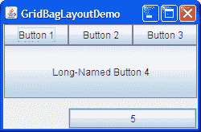
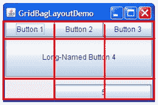
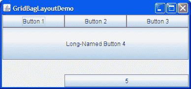
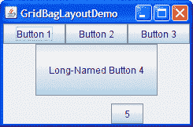
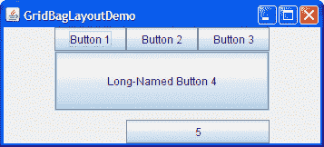

# 如何使用 GridBagLayout

> 原文：[`docs.oracle.com/javase/tutorial/uiswing/layout/gridbag.html`](https://docs.oracle.com/javase/tutorial/uiswing/layout/gridbag.html)

* * *

**注意：** 本课程涵盖了手动编写布局代码，这可能具有挑战性。如果您对学习布局管理的所有细节不感兴趣，您可能更喜欢使用 `GroupLayout` 布局管理器结合构建工具来布局您的 GUI。其中一个构建工具是 NetBeans IDE。否则，如果您想手动编写代码而不想使用 `GroupLayout`，那么推荐使用 `GridBagLayout` 作为下一个最灵活和强大的布局管理器。

* * *

如果您有兴趣使用 JavaFX 创建您的 GUI，请参阅 [JavaFX 中的布局](https://docs.oracle.com/javase/8/javafx/layout-tutorial/index.html)。

这是一个使用 [`GridBagLayout`](https://docs.oracle.com/javase/8/docs/api/java/awt/GridBagLayout.html) 的示例图片。



点击“启动”按钮以使用 [Java™ Web Start](http://www.oracle.com/technetwork/java/javase/javawebstart/index.html) 运行 GridBagLayoutDemo（[下载 JDK 7 或更高版本](http://www.oracle.com/technetwork/java/javase/downloads/index.html)）。或者，要自行编译和运行示例，请参考 示例索引。


`GridBagDemo` 的代码位于 `GridBagLayoutDemo.java` 中。

`GridBagLayout` 是 Java 平台提供的最灵活 — 也是最复杂 — 布局管理器之一。`GridBagLayout` 将组件放置在行和列的网格中，允许指定的组件跨越多行或多列。并非所有行都必须具有相同的高度。同样，并非所有列都必须具有相同的宽度。基本上，`GridBagLayout` 将组件放置在网格中的矩形（单元格）中，然后使用组件的首选大小来确定单元格的大小。

以下图显示了前面小程序的网格。您可以看到，网格有三行三列。第二行的按钮跨越所有列；第三行的按钮跨越了右侧两列。



如果您按照下图所示放大窗口，您会注意到包含按钮 5 的底部行获得了所有新的垂直空间。新的水平空间均匀分配给所有列。此调整大小行为基于程序为`GridBagLayout`中的各个组件分配的权重。您还会注意到每个组件占用所有可用的水平空间 — 但不占用所有可用的垂直空间（正如您可以看到的按钮 5）。此行为也由程序指定。



程序指定其组件的大小和位置特征的方式是为每个组件指定*约束条件*。在组件上设置约束的首选方法是使用`Container.add`变体，传递一个`GridBagConstraints`对象，如下一节所示。

以下各节解释了您可以设置的约束条件并提供了示例。

## 指定约束条件

以下代码是典型的使用[`GridBagLayout`](https://docs.oracle.com/javase/8/docs/api/java/awt/GridBagLayout.html)的容器中的内容。您将在下一节看到更详细的示例。

```java
JPanel pane = new JPanel(new GridBagLayout());
GridBagConstraints c = new GridBagConstraints();

*//For each component to be added to this container:*
*//...Create the component...*
*//...Set instance variables in the GridBagConstraints instance...*
pane.add(theComponent, c);

```

正如您可能从上面的示例中猜到的那样，即使组件具有不同的约束条件，也可以重用相同的`GridBagConstraints`实例。但是，建议您不要重用`GridBagConstraints`，因为如果您忘记为每个新实例重置字段，这很容易导致引入细微的错误。

* * *

**注意：**以下讨论假定`GridBagLayout`控制具有从左到右组件方向的容器。

* * *

您可以设置以下[`GridBagConstraints`](https://docs.oracle.com/javase/8/docs/api/java/awt/GridBagConstraints.html)实例变量：

**`gridx`**，**`gridy`**

指定组件左上角的行和列。最左侧的列地址为`gridx=0`，最顶部的行地址为`gridy=0`。使用`GridBagConstraints.RELATIVE`（默认值）指定组件放置在刚刚在此组件之前添加到容器的组件的右侧（对于`gridx`）或下方（对于`gridy`）。我们建议为每个组件指定`gridx`和`gridy`值，而不仅仅使用`GridBagConstraints.RELATIVE`；这样往往会产生更可预测的布局。

**`gridwidth`**，**`gridheight`**

指定组件显示区域中的列数（对于`gridwidth`）或行数（对于`gridheight`）。这些约束指定组件使用的单元格数，*而不是*它使用的像素数。默认值为 1。使用`GridBagConstraints.REMAINDER`指定组件为其行（对于`gridwidth`）或列（对于`gridheight`）中的最后一个。使用`GridBagConstraints.RELATIVE`指定组件为其行（对于`gridwidth`）或列（对于`gridheight`）中的倒数第二个。我们建议为每个组件指定`gridwidth`和`gridheight`值，而不仅仅使用`GridBagConstraints.RELATIVE`和`GridBagConstraints.REMAINDER`；这样往往会产生更可预测的布局。

**注意：** `GridBagLayout`不允许组件跨越多行，除非组件位于最左侧列，或者您已为组件指定了正值的`gridx`和`gridy`值。

**`fill`**

当组件的显示区域大于组件请求的大小时使用，以确定是否以及如何调整组件的大小。有效值（定义为`GridBagConstraints`常量）包括`NONE`（默认值），`HORIZONTAL`（使组件足够宽以水平填充其显示区域，但不更改其高度），`VERTICAL`（使组件足够高以垂直填充其显示区域，但不更改其宽度）和`BOTH`（使组件完全填充其显示区域）。

**`ipadx`**，**`ipady`**

指定内部填充：需要添加到组件大小的量。默认值为零。组件的宽度至少为其最小宽度加上`ipadx*2`像素，因为填充应用于组件的两侧。同样，组件的高度至少为其最小高度加上`ipady*2`像素。

**`insets`**

指定组件的外部填充--组件与其显示区域边缘之间的最小空间量。该值被指定为一个[`Insets`](https://docs.oracle.com/javase/8/docs/api/java/awt/Insets.html)对象。默认情况下，每个组件都没有外部填充。

**`anchor`**

当组件比其显示区域小时使用，以确定在区域内的哪个位置放置组件。有效值（定义为`GridBagConstraints`常量）为`CENTER`（默认值），`PAGE_START`，`PAGE_END`，`LINE_START`，`LINE_END`，`FIRST_LINE_START`，`FIRST_LINE_END`，`LAST_LINE_END`和`LAST_LINE_START`。

这里是一个容器中这些值在默认的从左到右的组件方向中如何解释的图片。

| FIRST_LINE_START | PAGE_START | FIRST_LINE_END |
| --- | --- | --- |
| LINE_START | CENTER | LINE_END |
| LAST_LINE_START | PAGE_END | LAST_LINE_END |

* * *

**版本说明：** `PAGE_*` 和 `*LINE_*` 常量是在 1.4 版本中引入的。之前的版本需要使用指向罗盘方向的常量。例如，`NORTHEAST` 表示显示区域的右上部分。我们建议您使用新的常量，因为它们更容易本地化。

* * *

**`weightx`**，**`weighty`**

指定权重是一门艺术，可以对 `GridBagLayout` 控制的组件的外观产生重大影响。权重用于确定如何在列之间（`weightx`）和行之间（`weighty`）分配空间；这对于指定调整大小行为很重要。

除非您至少为 `weightx` 或 `weighty` 指定一个非零值，否则所有组件都会聚集在容器的中心。这是因为当权重为 0.0（默认值）时，`GridBagLayout` 将任何额外的空间放在其单元格网格和容器边缘之间。

通常，权重用 0.0 和 1.0 来指定极端值：中间的数字根据需要使用。较大的数字表示组件的行或列应该获得更多的空间。对于每一列，权重与该列中指定的最高 `weightx` 相关，每个多列组件的权重在组件所在的列之间以某种方式分配。同样，每一行的权重与该行中指定的最高 `weighty` 相关。额外的空间倾向于分配给最右边的列和底部的行。

下一节将深入讨论约束条件，以解释示例程序的工作原理。

## 示例解释

这里，再次展示了 GridBagLayoutDemo 应用程序的图片。


点击“启动”按钮以使用 [Java™ Web Start](http://www.oracle.com/technetwork/java/javase/javawebstart/index.html) 运行 GridBagLayoutDemo（[下载 JDK 7 或更高版本](http://www.oracle.com/technetwork/java/javase/downloads/index.html)）。或者，要自行编译和运行示例，请参考示例索引。


以下代码创建了 `GridBagLayout` 和它管理的组件。您可以在 `GridBagLayoutDemo.java` 中找到整个源文件。

```java
JButton button;
pane.setLayout(new GridBagLayout());
GridBagConstraints c = new GridBagConstraints();
if (shouldFill) {
                //natural height, maximum width
                c.fill = GridBagConstraints.HORIZONTAL;
}

button = new JButton("Button 1");
if (shouldWeightX) {
                   c.weightx = 0.5;
}
c.fill = GridBagConstraints.HORIZONTAL;
c.gridx = 0;
c.gridy = 0;
pane.add(button, c);

button = new JButton("Button 2");
c.fill = GridBagConstraints.HORIZONTAL;
c.weightx = 0.5;
c.gridx = 1;
c.gridy = 0;
pane.add(button, c);

button = new JButton("Button 3");
c.fill = GridBagConstraints.HORIZONTAL;
c.weightx = 0.5;
c.gridx = 2;
c.gridy = 0;
pane.add(button, c);

button = new JButton("Long-Named Button 4");
c.fill = GridBagConstraints.HORIZONTAL;
c.ipady = 40;      //make this component tall
c.weightx = 0.0;
c.gridwidth = 3;
c.gridx = 0;
c.gridy = 1;
pane.add(button, c);

button = new JButton("5");
c.fill = GridBagConstraints.HORIZONTAL;
c.ipady = 0;       //reset to default
c.weighty = 1.0;   //request any extra vertical space
c.anchor = GridBagConstraints.PAGE_END; //bottom of space
c.insets = new Insets(10,0,0,0);  //top padding
c.gridx = 1;       //aligned with button 2
c.gridwidth = 2;   //2 columns wide
c.gridy = 2;       //third row
pane.add(button, c);

```

此示例对`GridBagLayout`管理的所有组件使用一个`GridBagConstraints`实例，但在实际情况中，建议不要重用`GridBagConstraints`，因为如果忘记为每个新实例重置字段，很容易引入细微错误。在将每个组件添加到容器之前，代码设置（或重置为默认值）`GridBagConstraints`对象中的适当实例变量。然后将组件添加到其容器，将`GridBagConstraints`对象指定为`add`方法的第二个参数。

例如，要使按钮 4 变得特别高，示例中有这段代码：

```java
c.ipady = 40;

```

在设置下一个组件的约束之前，代码将`ipady`的值重置为默认值：

```java
c.ipady = 0;

```

如果组件的显示区域大于组件本身，则可以使用`GridBagConstraints.anchor`约束指定组件在显示区域中的显示位置。`anchor`约束的值可以是绝对的（北、南、东、西等），也可以是相对于方向的（在页面的开始、在行的末尾、在第一行的开始等），或者相对于组件的基线。有关`anchor`约束的可能值的完整列表，包括基线相关值，请参阅[`GridBagConstraints.anchor`](https://docs.oracle.com/javase/8/docs/api/java/awt/GridBagConstraints.html#anchor)的 API 文档。您可以在上面的代码片段中看到，按钮 5 指定应在显示区域的末尾显示，通过设置`GridBagConstraints.PAGE_END`作为锚点。

* * *

**注意：** 教程的示例以不同的方式指定约束对象，您可能在其他程序中也会看到。我们的示例以前是通过在`GridBagLayout`对象上调用`setConstraints`方法来指定约束。例如：

```java
GridBagLayout gridbag = new GridBagLayout();
pane.setLayout(gridbag);
...
gridbag.setConstraints(button, c);
pane.add(button);

```

但是，我们建议您使用`Container.add`方法，因为这比使用`setConstraints`更清晰。

* * *

这里是一个表格，显示了`GridBagLayoutDemo`内容窗格中每个组件的所有约束条件。非默认值用**粗体**标记。与前一表项不同的值用*斜体*标记。

| 组件 | 约束条件 |
| --- | --- |
| 所有组件 |

```java
ipadx = 0
fill = GridBagConstraints.HORIZONTAL

```

|

| 按钮 1 |
| --- |

```java
ipady = 0 weightx = 0.5 weighty = 0.0 gridwidth = 1 anchor = GridBagConstraints.CENTER insets = new Insets(0,0,0,0) gridx = 0 gridy = 0

```

|

| 按钮 2 |
| --- |

```java
weightx = 0.5
***gridx = 1***
gridy = 0

```

|

| 按钮 3 |
| --- |

```java
weightx = 0.5
***gridx = 2***
gridy = 0

```

|

| 按钮 4 |
| --- |

```java
***ipady = 40***
*weightx = 0.0*
***gridwidth = 3***
***gridx = 0***
***gridy = 1***

```

|

| 按钮 5 |
| --- |

```java
*ipady = 0*
weightx = 0.0
***weighty = 1.0***
***anchor = GridBagConstraints.PAGE_END***
***insets = new Insets(10,0,0,0)***
***gridwidth = 2***
***gridx = 1***
***gridy = 2***

```

|

`GridBagLayoutDemo`有两个跨越多列的组件（按钮 4 和按钮 5）。为了使按钮 4 变高，我们向其添加了内部填充（`ipady`）。为了在按钮 4 和按钮 5 之间留出空间，我们使用插入来在按钮 5 上方添加至少 10 像素，并使按钮 5 贴近其单元格的底边。

`pane`容器中的所有组件都尽可能宽，给定它们所占用的单元格。程序通过将`GridBagConstraints`的`fill`实例变量设置为`GridBagConstraints.HORIZONTAL`来实现这一点，并为所有组件保持该设置。如果程序没有指定填充，按钮将保持其自然宽度，如下所示：



当您放大 GridBagLayoutDemo 的窗口时，列会成比例增长。这是因为第一行中的每个组件，每个组件都是一列宽，`weightx = 0.5`。这些组件的`weightx`的实际值并不重要。重要的是所有组件，因此所有列，具有大于 0 的相等权重。如果由`GridBagLayout`管理的任何组件未设置`weightx`，则当组件的容器变宽时，组件将保持在容器中心聚集在一起，如下所示：



如果容器的大小比首选大小小或大，则任何空间都根据`GridBagContainer`的权重分配。

请注意，如果您放大窗口，只有最后一行会变高。这是因为只有按钮 5 的`weighty`大于零。

## GridBagLayout API

`GridBagLayout`和`GridBagConstraints`类各自只有一个构造函数，没有参数。您不是在`GridBagConstraints`对象上调用方法，而是操作其实例变量，如指定约束中所述。通常，您在`GridBagLayout`对象上调用的唯一方法是`setConstraints`，如示例解释中所示。

## 使用 GridBagLayout 的示例

您可以在本教程中找到使用`GridBagLayout`的示例。以下表格列出了一些示例。

| 示例 | 描述位置 | 注释 |
| --- | --- | --- |
| `GridBagLayoutDemo` | 本节 | 使用许多功能——权重、插入、内部填充、水平填充、精确单元格定位、多列单元格和锚定（组件在单元格内的定位）。 |
| `TextSamplerDemo` | 使用文本组件 | 对齐两对标签和文本字段，并在容器的整个宽度上添加一个标签。 |
| `ContainerEventDemo` | 如何编写容器监听器 | 使用权重、填充和相对定位在容器中定位五个组件。 |
