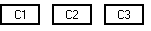
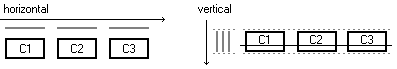
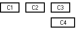
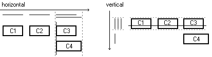
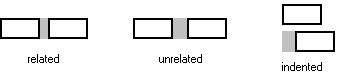
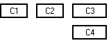

# 如何使用 GroupLayout

> 原文：[`docs.oracle.com/javase/tutorial/uiswing/layout/group.html`](https://docs.oracle.com/javase/tutorial/uiswing/layout/group.html)

`GroupLayout` 是为 GUI 构建器（如 NetBeans IDE 提供的 GUI 构建器 Matisse）开发的布局管理器。尽管布局管理器最初是为适应 GUI 构建器的需求而设计的，但它也适用于手动编码。本讨论将教你`GroupLayout`的工作原理，并向你展示如何使用`GroupLayout`构建 GUI，无论你选择使用像 Matisse 这样的 GUI 构建器还是编写自己的代码。

* * *

**注意：** 本课程涵盖了手动编写布局代码，这可能具有挑战性。如果您对学习布局管理的所有细节不感兴趣，您可能更喜欢使用`GroupLayout`布局管理器结合构建工具来布局您的 GUI。其中一个构建工具是 NetBeans IDE。否则，如果您想手动编写代码而不想使用`GroupLayout`，那么推荐使用`GridBagLayout`作为下一个最灵活和强大的布局管理器。

* * *

如果您有兴趣使用 JavaFX 创建 GUI，请参阅[JavaFX 中的布局](https://docs.oracle.com/javase/8/javafx/layout-tutorial/index.html)。

## 设计原则：独立维度

`GroupLayout` 分别处理水平和垂直布局。每个维度的布局都是独立定义的。在定义*水平*布局时，你不需要担心*垂直*维度，反之亦然，因为沿着每个轴的布局完全独立于沿着另一个轴的布局。

当只关注一个维度时，你只需一次解决一半的问题。这比同时处理两个维度要容易。这意味着，当然，每个组件在布局中需要定义两次。如果忘记这样做，`GroupLayout` 将生成异常。

## 布局组织：分层组

`GroupLayout` 使用两种类型的布局——顺序和并行，结合了分层组合。

1.  采用**顺序**排列，组件就像`BoxLayout`或`FlowLayout`沿一个轴一样简单地一个接一个地放置。每个组件的位置都是相对于前一个组件定义的。

1.  第二种方式将组件**并排**放置——在同一空间中叠加。它们可以沿垂直轴基线对齐、顶部对齐或底部对齐。沿水平轴，如果组件大小不同，它们可以左对齐、右对齐或居中对齐。

通常，沿一个维度并排放置的组件在另一个维度上是顺序排列的，以避免重叠。

这两种布局之所以强大，是因为它们可以被嵌套层次化。为此，`GroupLayout` 定义了**布局组**。一个组可以是顺序的或并行的，并且可以包含组件、其他组和间隙（下面讨论）。

顺序组的大小是包含元素的大小之和，而并行组的大小对应于最大元素的大小（尽管，根据元素和基线的位置，基线对齐组的大小可能比最大元素稍大一些）。

定义布局意味着定义组件如何通过组合顺序和并行排列进行分组。

让我们用一个简单的例子来看看它在实践中是如何工作的。

## 一个例子

让我们从一些简单的东西开始，只有一排中的三个组件：



我们将使用组来表示此布局。从水平轴开始，很容易看到有一个从左到右排列的*顺序组*，包含 3 个组件。沿着垂直轴，有一个相同位置、大小和基线的*并行组*，包含相同的 3 个组件：



在伪代码中，布局规范可能看起来像这样（真正的代码在下面的*编写代码*部分）：

```java
horizontal layout = sequential group { c1, c2, c3 }
vertical layout = parallel group (BASELINE) { c1, c2, c3 }

```

这说明了前面提到的一个原则：在一个维度上顺序组合的组件通常在另一个维度上形成并行组。

现在让我们再添加一个组件 C4，与 C3 左对齐：



沿着水平轴，新组件占据与 C3 相同的水平空间，以便与 C3 形成并行组。沿着垂直轴，C4 与最初的三个组件的并行组形成顺序组。



在伪代码中，布局规范现在看起来像这样：

```java
horizontal layout = sequential group { c1, c2, parallel group (LEFT) { c3, c4 } }
vertical layout = sequential group { parallel group (BASELINE) { c1, c2, c3 }, c4 }

```

现在您了解了使用`GroupLayout`设计布局的最重要方面。还有一些细节需要解释：如何添加间隙，如何定义大小和调整大小行为，如何定义对齐布局，以及如何编写真实代码。

## 间隙

间隙可以被视为具有特定大小的不可见组件。可以像组件或其他组件一样向组中添加任意大小的间隙。使用间隙，您可以精确控制组件之间的距离或与容器边框的距离。

`GroupLayout`还定义了*自动*间隙，这些间隙对应于相邻组件之间（或组件与容器边框之间）的*首选距离*。这样的间隙的大小是动态计算的，基于应用程序使用的外观和感觉（`LayoutStyle`类用于此）。使用自动（首选）间隙有两个优点：您不必指定间隙的像素大小，它们会自动调整到 UI 运行的外观和感觉，反映实际的外观和感觉指南。

`GroupLayout`区分两个组件之间的首选间隙和组件与容器边框之间的首选间隙。在`GroupLayout` API 中有相应的方法用于添加这些间隙（`addPreferredGap`和`setContainerGap`）。有三种类型的组件间隙：**相关**，**不相关**和**缩进**。`LayoutStyle.ComponentPlacement`枚举定义了用作`addPreferredGap`方法参数的相应常量：`RELATED`，`UNRELATED`和`INDENT`。相关和不相关间隙之间的区别仅在于大小 - 不相关组件之间的距离稍大一些。*缩进*表示当一个组件位于另一个组件下方并带有缩进时，两个组件之间的首选水平距离。



如上所述，`GroupLayout`可以自动插入间隙 - 如果您没有显式添加自己的间隙，它会为您添加*相关*的首选间隙。但这不是默认行为。您必须通过在`GroupLayout`上调用`setAutoCreateGaps(true)`和`setAutoCreateContainerGaps(true)`来打开此功能。然后您将自动获得正确的间距。

## 编写代码

现在，让我们看一下创建上述布局的实际代码。

假设我们有一个名为`panel`的容器和已经呈现的相同四个组件（`c1`，`c2`，`c3`和`c4`）。首先，我们创建一个新的`GroupLayout`对象并将其与面板关联：

```java
GroupLayout layout = new GroupLayout(panel);
 panel.setLayout(layout);

```

我们指定自动插入间隙：

```java
layout.setAutoCreateGaps(true);
layout.setAutoCreateContainerGaps(true);

```

然后，我们定义组并添加组件。我们使用`setHorizontalGroup`和`setVerticalGroup`方法为每个维度建立根组。通过`createSequentialGroup`和`createParallelGroup`方法创建组。使用`addComponent`方法将组件添加到组中。

```java
layout.setHorizontalGroup(
   layout.createSequentialGroup()
      .addComponent(c1)
      .addComponent(c2)
      .addGroup(layout.createParallelGroup(GroupLayout.Alignment.LEADING)
           .addComponent(c3)
           .addComponent(c4))
);
layout.setVerticalGroup(
   layout.createSequentialGroup()
      .addGroup(layout.createParallelGroup(GroupLayout.Alignment.BASELINE)
           .addComponent(c1)
           .addComponent(c2)
           .addComponent(c3))
      .addComponent(c4)
);

```

您可以为平行组指定对齐方式。它可以是`GroupLayout.Alignment`枚举中定义的以下常量之一：`LEADING`，`TRAILING`，`CENTER`和`BASELINE`。这些常量用于两个维度，并取决于组件方向是从左到右还是从右到左（从上到下还是从下到上）。例如，如果水平（垂直）组件方向是从左到右（从上到下），`LEADING`表示左（上），而`TRAILING`表示右（下）。`CENTER`表示在两个维度上“居中”。如果不指定对齐方式，将使用`LEADING`。`BASELINE`对齐方式仅在垂直维度上有效。

* * *

**注意：**

组布局中的对齐仅对不同大小的组件有意义。相同大小的组件将自动对齐到每个`GroupLayout.Alignment`常量。

* * *

有关代码的一些注释：

+   您不需要直接将组件添加到容器中 - 当使用其中一个 addComponent 方法时，这将隐式完成。

+   注意`addComponent`方法的链式调用用于填充组。`addComponent`方法总是返回调用它的组。由于这一点，你不需要使用局部变量来保存组。

+   缩进代码是个好主意，这样可以更容易看到组的层次结构。给每个组件一个新行，在层次结构中的每个新组添加一个缩进级别。一个好的源代码编辑器会帮助你匹配括号来关闭`createXXXGroup`方法。遵循这些简单规则，更容易添加新组件或移除现有组件。

## 组件大小和可调整性

在布局中可调整大小的组件数量没有限制。

在`GroupLayout`中，每个组件的大小受到三个值的限制；最小大小、首选大小和最大大小。这些大小控制组件在布局中的调整大小。`GroupLayout.addComponent(...)`方法允许指定大小约束。

如果没有明确指定，布局会通过使用组件的`getMinimumSize()`、`getPreferredSize()`和`getMaximumSize()`方法来询问组件的默认大小。对于大多数组件，比如使`JTextField`可调整大小或`JButton`固定大小，你不需要指定任何内容，因为这些组件本身具有默认的调整大小行为。另一方面，你可以覆盖默认行为。例如，你可以使`JTextField`固定大小或`JButton`可调整大小。

`GroupLayout`定义了提供对调整大小行为精确控制的常量。它们可以作为`addComponent(Component comp, int min, int pref, int max)`方法的参数使用。以下是两个示例：

1.  强制组件可调整大小（允许缩小和增长）：

    ```java
    *group*.addComponent(component, 0, GroupLayout.DEFAULT_SIZE, Short.MAX_VALUE) ...

    ```

    这允许组件在零大小（最小）到任意大小（`Short.MAX_VALUE`作为最大大小表示“无限”）之间调整大小。如果我们不希望组件在其默认最小大小以下缩小，我们会在第二个参数中使用`GroupLayout.DEFAULT_SIZE`而不是`0`。

1.  要使组件固定大小（禁止调整大小）：

    ```java
    group.addComponent(component, GroupLayout.PREFERRED_SIZE, GroupLayout.DEFAULT_SIZE,
              GroupLayout.PREFERRED_SIZE) ...

    ```

在这些示例中，组件的初始大小不会改变，其默认大小是组件的首选大小。如果我们想要为组件指定特定大小，我们会在第二个参数中指定，而不是使用`GroupLayout.DEFAULT_SIZE`。

可调整大小的间隙

指定大小和可调整性也适用于间隙，包括首选间隙。例如，你可以指定两个组件之间的首选间隙，它就像一个*弹簧*，将组件推开（到容器的相反侧）。两个组件的首选距离仅用作间隙的最小大小。请看下面的代码片段：

```java
layout.createSequentialGroup()
    .addComponent(c1)
    .addPreferredGap(LayoutStyle.ComponentPlacement.RELATED,
                     GroupLayout.DEFAULT_SIZE, Short.MAX_VALUE)
    .addComponent(c2);

```

## 并排组大小

放置在平行组中的可调整大小的元素被拉伸以填充由组中最大元素确定的空间，因此它们最终以相同大小对齐。`GroupLayout`还提供了控制是否应调整封闭平行组本身的功能。如果组调整大小被抑制，它会阻止包含的元素超过组的首选大小。这样，您可以使一组组件在两侧对齐，或者限制单个组件具有相同的大小。

让我们尝试使我们的例子中的两个组件（水平维度上的`c3`和`c4`）大小相同：

```java
layout.createParallelGroup(GroupLayout.Alignment.LEADING, false)
  .addComponent(c3, GroupLayout.DEFAULT_SIZE, GroupLayout.DEFAULT_SIZE, Short.MAX_VALUE)
  .addComponent(c4, GroupLayout.DEFAULT_SIZE, GroupLayout.DEFAULT_SIZE, Short.MAX_VALUE);

```

底层机制的工作方式如下：

1.  平行组的大小设置为最大元素的首选大小；因此在我们的例子中是`c4`的首选大小。

1.  可调整大小的元素被拉伸到组的大小。在我们的例子中，只有`c3`被有效地拉伸，`c4`的大小已经对应于组的大小。

结果，`c3`和`c4`将具有相同的宽度。组件不会进一步调整大小，因为平行组本身不可调整大小（上面`createParallelGroup`方法的第二个参数为`false`）。



给细心读者的问题：为什么在这个例子中我们将平行组中的两个组件都定义为可调整大小？似乎只有`c3`可调整大小就足够了，因为`c4`无论如何都不会被拉伸...

答案是：由于平台和本地化的独立性。否则，我们将不得不依赖于`c4`组件始终比`c3`大。但是当应用程序在不同平台上运行或被翻译成另一种语言时，这可能会发生变化。通过使两个组件都可调整大小，它们会相互调整，无论哪一个在特定时刻更大。

## 使组件大小相同

前面的情况是特殊的，因为组件在同一个平行组中。但是如果我们希望不相关的组件具有相同的大小怎么办？显然，通过分组不能始终保证相同的大小。对话框底部一行中的“确定”和“取消”按钮就是一个很好的例子。为此，`GroupLayout`提供了一个`linkSize`方法。该方法允许将任意组件的大小链接在一起，而不管它们放置在何处。链接组件的结果大小根据最大组件设置。例如：

```java
layout.linkSize(SwingConstants.HORIZONTAL, c3, c4);

```

在这个例子中，尺寸在水平维度上是有选择性地链接的。

## 运行时更改您的 GUI

有两个重要的方法可以在运行时对 GUI 进行更改，`replace()` 和 `setHonorsVisibility()`。使用这两种方法，您可以在运行时交换组件或更改组件的可见性，并使 GUI 相应地重新排列。

`replace(Component existingComponent, Component newComponent)` 用新组件替换现有组件。动态布局所需的常见操作之一是能够像这样替换组件。例如，也许复选框在显示图形或树的组件之间切换。 `GroupLayout` 通过 `replace()` 方法使这种情况变得简单。您可以在不重新创建所有组的情况下交换组件。

用户界面中的另一个常见操作是动态更改组件的可见性。也许组件只有在用户完成表单的早期部分时才显示。为了避免在这种情况下组件移动，应该占用空间，无论组件的可见性如何。 `GroupLayout` 提供了两种配置不可见组件处理方式的方法。 `setHonorsVisibility(boolean)` 方法全局设置了不可见组件的处理方式。默认值为 true，表示不可见组件被视为不存在。另一方面，值为 false 为不可见组件提供空间，将其视为可见。 `setHonorsVisibility(Component,Boolean)` 方法可用于在特定组件级别配置行为。为了确定如何处理可见性，`GroupLayout` 首先检查组件是否已指定值，如果没有，则检查全局属性的设置。

* * *

**一些历史：**

Java 标准版 6 中的 `GroupLayout` 由三个不同的工作部分组成：获取组件基线的能力，获取组件之间首选间隔的能力（`LayoutStyle`），以及 `GroupLayout`。这项工作最初是作为一个开源项目在 [`java.net/projects/swing-layout/`](http://java.net/projects/swing-layout/) 上完成的。

NetBeans 5.0 通过 swing-layout 项目支持 `GroupLayout`。由于这项工作的成功，所有三个部分都已合并到了 Java 标准版 6 中的 `GroupLayout` 中。Java SE 6 中的 `GroupLayout` 与 swing-layout 中的主要区别在于包名称和方法名称。NetBeans 5.5 提供了针对 Java SE 6 中的 `GroupLayout` 或 swing-layout 中的 `GroupLayout` 的定位能力。NetBeans 定位的版本取决于项目定位的 Java 平台版本。定位 Java SE 6 的项目使用 Java SE 中的 `GroupLayout`，否则使用 swing-layout 中的 `GroupLayout`。

* * *
