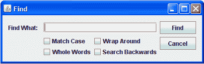
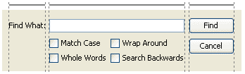
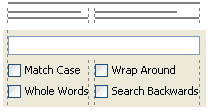
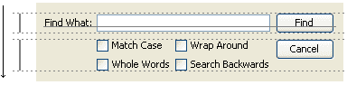
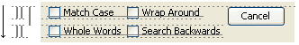

# 一个 GroupLayout 示例

> 原文：[`docs.oracle.com/javase/tutorial/uiswing/layout/groupExample.html`](https://docs.oracle.com/javase/tutorial/uiswing/layout/groupExample.html)

* * *

**注意：** 本课程涵盖了手动编写布局代码，这可能具有挑战性。如果您对学习布局管理的所有细节不感兴趣，您可能更喜欢使用`GroupLayout`布局管理器结合构建工具来布局您的 GUI。其中一个构建工具是 NetBeans IDE。否则，如果您想手动编码而不想使用`GroupLayout`，那么建议使用`GridBagLayout`作为下一个最灵活和强大的布局管理器。

* * *

如果您有兴趣使用 JavaFX 创建 GUI，请参阅[JavaFX 中的布局](https://docs.oracle.com/javase/8/javafx/layout-tutorial/index.html)。

作为使用`GroupLayout`创建 GUI 的示例，让我们为这个“查找”对话框创建一个布局：



## 横向布局

从*左到右*检查水平维度，我们可以看到有 3 个组成序列。第一个实际上不是一个组，只是一个组件--标签。第二个是包含文本字段和复选框的组（我们稍后将对其进行分解）。第三个是两个按钮的组。如下图所示：



让我们用代码勾画出顺序组。请注意，`GroupLayout.Alignment.LEADING`对应于水平维度中的左对齐。还请注意，我们不指定间隙，假设*自动插入间隙*功能已打开。

```java
layout.setHorizontalGroup(layout.createSequentialGroup()
    .addComponent(label)
    .addGroup(layout.createParallelGroup(GroupLayout.Alignment.LEADING))
    .addGroup(layout.createParallelGroup(GroupLayout.Alignment.LEADING))
);

```

现在让我们分解中间的组。这是最难的部分。有一个文本字段与两个包含两个复选框的并行组序列。请参考以下插图：



让我们添加相应的代码：

```java
layout.setHorizontalGroup(layout.createSequentialGroup()
    .addComponent(label)
    .addGroup(layout.createParallelGroup(GroupLayout.Alignment.LEADING)
         .addComponent(textField)
         .addGroup(layout.createSequentialGroup()
              .addGroup(layout.createParallelGroup(GroupLayout.Alignment.LEADING)
                  .addComponent(caseCheckBox)
                  .addComponent(wholeCheckBox))
              .addGroup(layout.createParallelGroup(GroupLayout.Alignment.LEADING)
                  .addComponent(wrapCheckBox)
                  .addComponent(backCheckBox))))
     .addGroup(layout.createParallelGroup(GroupLayout.Alignment.LEADING))
);

```

我们希望文本字段可以调整大小，但由于`JTextField`默认返回正确的最大大小，这是自动发生的。

右侧剩余的组很简单：只包含两个按钮。以下是代码：

```java
layout.setHorizontalGroup(layout.createSequentialGroup()
    .addComponent(label)
    .addGroup(layout.createParallelGroup(GroupLayout.Alignment.LEADING)
        .addComponent(textField)
        .addGroup(layout.createSequentialGroup()
            .addGroup(layout.createParallelGroup(GroupLayout.Alignment.LEADING)
                .addComponent(caseCheckBox)
                .addComponent(wholeCheckBox))
            .addGroup(layout.createParallelGroup(GroupLayout.Alignment.LEADING)
                .addComponent(wrapCheckBox)
                .addComponent(backCheckBox))))
    .addGroup(layout.createParallelGroup(GroupLayout.Alignment.LEADING)
        .addComponent(findButton)
        .addComponent(cancelButton))
);

```

最后，我们希望按钮始终保持相同大小，因此让我们将它们链接起来：

```java
layout.linkSize(SwingConstants.HORIZONTAL, findButton, cancelButton);

```

现在我们完成了水平维度。让我们切换到垂直维度。从现在开始，我们只需要考虑 y 轴。

## 纵向布局

在纵向维度上，我们从*上到下*检查布局。我们绝对希望第一行上的所有组件都对齐在基线上。因此，在垂直轴上，有一个基线组的序列，然后是剩余组件的一组。请参考以下图片。



让我们勾画出代码。首先，我们需要定义两个并行组。请注意，`GroupLayout.Alignment.LEADING`对应于垂直维度中的顶部对齐。

```java
layout.setVerticalGroup(layout.createSequentialGroup()
    .addGroup(layout.createParallelGroup(GroupLayout.Alignment.BASELINE))
    .addGroup(layout.createParallelGroup(GroupLayout.Alignment.LEADING))
);

```

我们可以立即填充基线组：

```java
layout.setVerticalGroup(layout.createSequentialGroup()
    .addGroup(layout.createParallelGroup(GroupLayout.Alignment.BASELINE)
        .addComponent(label)
        .addComponent(textField)
        .addComponent(findButton))
    .addGroup(layout.createParallelGroup(GroupLayout.Alignment.LEADING))
);

```

现在让我们看看底部组。请注意，取消按钮与复选框不在共享基线上；它与顶部对齐。因此，第二个平行组包括按钮和两个基线组的顺序组，其中包含复选框：



相应的代码如下所示：

```java
layout.setVerticalGroup(layout.createSequentialGroup()
    .addGroup(layout.createParallelGroup(GroupLayout.Alignment.BASELINE)
        .addComponent(label)
        .addComponent(textField)
        .addComponent(findButton))
    .addGroup(layout.createParallelGroup(GroupLayout.Alignment.LEADING)
        .addGroup(layout.createSequentialGroup()
            .addGroup(layout.createParallelGroup(GroupLayout.Alignment.BASELINE)
                .addComponent(caseCheckBox)
                .addComponent(wrapCheckBox))
            .addGroup(layout.createParallelGroup(GroupLayout.Alignment.BASELINE)
                .addComponent(wholeCheckBox)
                .addComponent(backCheckBox)))
        .addComponent(cancelButton))
);

```

因此，我们创建了一个完整的布局，包括调整大小行为，而不需要指定一个像素的数字——一个真正的跨平台布局。请注意，我们不需要指定组件之间的间隙，我们会自动获得正确的间距，并根据外观和感觉指南。这是查找对话框布局的完整代码：

```java
GroupLayout layout = new GroupLayout(getContentPane());
getContentPane().setLayout(layout);
layout.setAutoCreateGaps(true);
layout.setAutoCreateContainerGaps(true);

layout.setHorizontalGroup(layout.createSequentialGroup()
    .addComponent(label)
    .addGroup(layout.createParallelGroup(GroupLayout.Alignment.LEADING)
        .addComponent(textField)
        .addGroup(layout.createSequentialGroup()
            .addGroup(layout.createParallelGroup(GroupLayout.Alignment.LEADING)
                .addComponent(caseCheckBox)
                .addComponent(wholeCheckBox))
            .addGroup(layout.createParallelGroup(GroupLayout.Alignment.LEADING)
                .addComponent(wrapCheckBox)
                .addComponent(backCheckBox))))
    .addGroup(layout.createParallelGroup(GroupLayout.Alignment.LEADING)
        .addComponent(findButton)
        .addComponent(cancelButton))
);
layout.linkSize(SwingConstants.HORIZONTAL, findButton, cancelButton);

layout.setVerticalGroup(layout.createSequentialGroup()
    .addGroup(layout.createParallelGroup(GroupLayout.Alignment.BASELINE)
        .addComponent(label)
        .addComponent(textField)
        .addComponent(findButton))
    .addGroup(layout.createParallelGroup(GroupLayout.Alignment.LEADING)
        .addGroup(layout.createSequentialGroup()
            .addGroup(layout.createParallelGroup(GroupLayout.Alignment.BASELINE)
                .addComponent(caseCheckBox)
                .addComponent(wrapCheckBox))
            .addGroup(layout.createParallelGroup(GroupLayout.Alignment.BASELINE)
                .addComponent(wholeCheckBox)
                .addComponent(backCheckBox)))
        .addComponent(cancelButton))
);

```

这是完整的`Find.java`文件。您可以编译并运行它。尝试水平调整对话框的大小，看看布局如何自动调整到新的大小。
