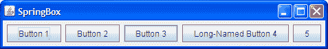

# 如何使用 SpringLayout

> 原文：[`docs.oracle.com/javase/tutorial/uiswing/layout/spring.html`](https://docs.oracle.com/javase/tutorial/uiswing/layout/spring.html)

* * *

**注意：**本课程涵盖手动编写布局代码，这可能具有挑战性。如果您不想学习布局管理的所有细节，您可能更喜欢使用`GroupLayout`布局管理器结合构建工具来布置您的 GUI。其中一个构建工具是 NetBeans IDE。否则，如果您想手动编码而不想使用`GroupLayout`，那么建议使用`GridBagLayout`作为下一个最灵活和强大的布局管理器。

* * *

如果您有兴趣使用 JavaFX 创建 GUI，请参阅[使用 JavaFX 中的布局](https://docs.oracle.com/javase/8/javafx/layout-tutorial/index.html)。

[`SpringLayout`](https://docs.oracle.com/javase/8/docs/api/javax/swing/SpringLayout.html)类是在 JDK 版本 1.4 中添加的，用于支持 GUI 构建器中的布局。`SpringLayout`是一个非常灵活的布局管理器，可以模拟其他布局管理器的许多功能。但是，`SpringLayout`是非常低级的，因此您真的应该只在 GUI 构建器中使用它，而不是尝试手动编写弹簧布局管理器。

本节以一个简单的示例开始，展示创建第一个弹簧布局所需记住的所有事项，以及当您忘记它们时会发生什么！后来，它介绍了几种不同类型网格中布置组件的实用方法。

这里是我们将要涵盖的一些布局的图片：



## 弹簧布局的工作原理

Spring 布局通过在组件边缘之间定义方向关系或*约束*来完成其工作。例如，您可以定义一个组件的左边缘与另一个组件的右边缘之间的固定距离（比如 5 像素）。

在`SpringLayout`中，每个边缘的位置取决于另一个边缘的位置。如果随后添加约束以为边缘创建新的绑定，则将丢弃先前的绑定，边缘仍然依赖于单个边缘。

与许多布局管理器不同，`SpringLayout`不会自动设置其管理的组件的位置。如果您手动编写使用`SpringLayout`的 GUI，请记但通过约束西/东和北/南位置来初始化组件位置。根据您使用的约束，您可能还需要显式设置容器的大小。

组件定义了*边缘*属性，这些属性由`Spring`实例连接。每个弹簧有四个属性 — 其*最小*、*首选*和*最大*值，以及其实际（当前）*值*。与每个组件相关联的弹簧被收集到一个`SpringLayout.Constraints`对象中。

`Spring`类的一个实例包含三个特征其行为的属性：最小值、首选值和最大值。这些属性中的每一个可能参与根据一系列规则定义其第四个值属性。

`Spring`类的一个实例可以被视为一个机械弹簧，当弹簧被压缩或拉伸远离其首选值时，它提供一个校正力。这个力被建模为距离首选值的线性函数，但具有两个不同的常数 -- 一个用于压缩力，一个用于张力力。这些常数由弹簧的最小值和最大值指定，以便当弹簧处于其最小值时产生与其处于最大值时产生的相等且相反的力。因此，首选值和最小值之间的差值代表了弹簧可以被压缩的容易程度。其最大值和首选值之间的差值表示了`Spring`可以被拉伸的容易程度。

基于此，`SpringLayout`可以被视为一组通过边缘上的一组弹簧连接的对象。

## 示例：SpringDemo

这一部分将带您了解为使用`SpringLayout`指定容器约束条件的典型步骤。第一个示例，`SpringDemo1.java`，是一个非常简单的应用程序，其中包含一个由弹簧布局控制的内容窗格中的标签和文本字段。以下是相关代码：

```java
public class SpringDemo1 {
    public static void main(String[] args) {
        ...
        Container contentPane = frame.getContentPane();
        SpringLayout layout = new SpringLayout();
        contentPane.setLayout(layout);
        contentPane.add(new JLabel("Label: "));
        contentPane.add(new JTextField("Text field", 15));
        ...
        frame.pack();
        frame.setVisible(true);
    }
}

```

单击“启动”按钮以使用[Java™ Web Start](http://www.oracle.com/technetwork/java/javase/javawebstart/index.html)运行 SpringDemo1（[下载 JDK 7 或更高版本](http://www.oracle.com/technetwork/java/javase/downloads/index.html)）。或者，要自行编译和运行示例，请参考示例索引。


当 GUI 首次出现时，它看起来是这样的：


当调整大小使其变大时，它看起来是这样的：


显然，我们有一些问题。窗口不仅显示得太小，而且即使调整大小，组件仍然位于（0,0）处。这是因为我们没有设置任何弹簧来指定组件的位置和容器的宽度。一个小小的安慰是，至少组件都处于其首选大小 — 我们从`SpringLayout`为每个组件创建的默认弹簧中免费获得了这一点。

我们的下一个示例，`SpringDemo2.java`，通过为每个组件指定位置来改善情况。点击“启动”按钮以使用[Java™ Web Start](http://www.oracle.com/technetwork/java/javase/javawebstart/index.html)运行 SpringDemo2（[下载 JDK 7 或更高版本](http://www.oracle.com/technetwork/java/javase/downloads/index.html)）。或者，要自行编译和运行示例，请参考示例索引。


在这个示例中，我们将指定组件应该在一行中显示，并且它们之间有 5 个像素的间距。以下代码指定了标签的位置：

```java
//Adjust constraints for the label so it's at (5,5).
layout.putConstraint(SpringLayout.WEST, label,
                     5,
                     SpringLayout.WEST, contentPane);
layout.putConstraint(SpringLayout.NORTH, label,
                     5,
                     SpringLayout.NORTH, contentPane);

```

第一个`putConstraint`调用指定标签的左（西）边缘应距其容器的左边缘 5 像素。这对应于 *x* 坐标为 5。第二个`putConstraint`调用设置了标签的顶部（北）边缘与其容器之间的类似关系，导致 *y* 坐标为 5。

这是设置文本字段位置的代码：

```java
//Adjust constraints for the text field so it's at
//(*<label's right edge>* + 5, 5).
layout.putConstraint(SpringLayout.WEST, textField,
                     5,
                     SpringLayout.EAST, label);
layout.putConstraint(SpringLayout.NORTH, textField,
                     5,
                     SpringLayout.NORTH, contentPane);

```

第一个`putConstraint`调用使文本字段的左（西）边缘与标签的右（东）边缘相隔 5 像素。第二个`putConstraint`调用与第一个片段中的第二个调用类似，并具有将组件的 *y* 坐标设置为 5 的相同效果。

前面的示例仍然存在容器显示得太小的问题。但是当我们调整窗口大小时，组件就位于正确位置了：


为了使容器最初以正确的大小显示，我们需要设置定义容器右（东）边和底部（南）边的弹簧。默认情况下，没有设置右边和底部容器边缘的约束。通过设置这些约束来定义容器的大小。`SpringDemo3.java`展示了如何做到这一点。点击启动按钮使用[Java™ Web Start](http://www.oracle.com/technetwork/java/javase/javawebstart/index.html)来运行 SpringDemo3（[下载 JDK 7 或更高版本](http://www.oracle.com/technetwork/java/javase/downloads/index.html)）。或者，要自己编译和运行示例，请参考示例索引。


这里是设置容器弹簧的代码：

```java
layout.putConstraint(SpringLayout.EAST, contentPane,
                     5,
                     SpringLayout.EAST, textField);
layout.putConstraint(SpringLayout.SOUTH, contentPane,
                     5,
                     SpringLayout.SOUTH, textField);

```

第一个`putConstraint`调用使容器的右边距离文本字段的右边缘向右移动 5 像素。第二个调用使其底边距离最高组件的底边超出 5 像素（为简单起见，我们假设是文本字段）。

最终，窗口以正确的大小显示：


当我们使窗口变大时，我们可以看到弹簧布局在起作用，将额外空间分配给可用的组件。


在这种情况下，弹簧布局选择将所有额外空间都分配给文本字段。虽然弹簧布局似乎对待标签和文本字段有所不同，但弹簧布局对任何 Swing 或 AWT 组件都没有特殊知识。它依赖于组件的最小、首选和最大大小属性的值。下一节将讨论弹簧布局如何使用这些属性，以及为什么它们可能导致空间分配不均匀。

## 弹簧和组件大小

`SpringLayout`对象会自动为`SpringLayout`控制的每个组件的高度和宽度安装`Spring`。这些弹簧本质上是组件的`getMinimumSize`、`getPreferredSize`和`getMaximumSize`方法的封装。通过“封装”我们的意思是这些弹簧不仅从这些方法中初始化适当的值，而且这些弹簧会跟踪这些值。例如，代表组件宽度的`Spring`对象是一种特殊类型的弹簧，它简单地将其实现委托给组件的相关大小方法。这样，随着组件特性的变化，弹簧会与大小方法保持同步。

当组件的`getMaximumSize`和`getPreferredSize`方法返回相同的值时，`SpringLayout`将其解释为组件不应该被拉伸。`JLabel`和`JButton`是以这种方式实现的组件的示例。因此，SpringDemo3 示例中的标签不会被拉伸。

一些组件的`getMaximumSize`方法，如`JTextField`，返回其最大尺寸的宽度和高度值为`Integer.MAX_VALUE`，表示组件可以增长到任意大小。因此，当 SpringDemo3 窗口被放大时，`SpringLayout`将所有额外空间分配给唯一可以增长的弹簧 — 决定文本字段大小的弹簧。

## 关于 SpringLayout API 的更多信息

SpringDemo 示例使用`SpringLayout`方法`putConstraint`来设置与每个组件关联的弹簧。`putConstraint`方法是一个方便的方法，让您修改组件的约束而无需使用完整的弹簧布局 API。这里再次是从`SpringDemo3`设置标签位置的代码：

```java
layout.putConstraint(SpringLayout.WEST, label,
                     5,
                     SpringLayout.WEST, contentPane);
layout.putConstraint(SpringLayout.NORTH, label,
                     5,
                     SpringLayout.NORTH, contentPane);

```

这里是直接使用`SpringLayout.Constraints`和`Spring`类的等效代码：

```java
SpringLayout.Constraints  contentPaneCons = 
        layout.getConstraints(contentPane);
contentPaneCons.setX(Spring.sum(Spring.constant(5),
                          contentPaneCons
                          .getConstraint(SpringLayout.WEST)));
contentPaneCons.setY(Spring.sum(Spring.constant(5),
                          contentPaneCons
                          .getConstraint(SpringLayout.NORTH)));

```

要查看整个演示如何转换为使用此 API，请查看`SpringDemo4.java`。该文件还包括一个更加精心制作（并且更长）的代码版本，用于设置容器的大小。点击“启动”按钮以使用[Java™ Web Start](http://www.oracle.com/technetwork/java/javase/javawebstart/index.html)运行 SpringDemo4（[下载 JDK 7 或更高版本](http://www.oracle.com/technetwork/java/javase/downloads/index.html)）。或者，要自行编译和运行示例，请参考示例索引。


正如前面的片段所暗示的，`SpringLayout`和`SpringLayout.Constraints`倾向于使用不同的约定来描述弹簧。`SpringLayout` API 使用边缘来定义其约束。弹簧连接边缘以建立它们之间的线性关系。边缘由组件使用以下常量定义：

+   `SpringLayout.NORTH`指定组件边界矩形的顶边。

+   `SpringLayout.SOUTH`指定组件边界矩形的底边。

+   `SpringLayout.EAST`指定组件边界矩形的右边缘。

+   `SpringLayout.WEST`指定组件边界矩形的左边缘。

+   `SpringLayout.BASELINE`指定组件的基线。

+   `SpringLayout.HORIZONTAL_CENTER`指定组件边界矩形的水平中心。

+   `SpringLayout.VERTICAL_CENTER`指定组件边界矩形的垂直中心。

边与`Spring`对象不同，`SpringLayout.Constraints`类了解边，但仅对以下属性有`Spring`对象：

+   *x*

+   *y*

+   *width*

+   *height*

每个`Constraints`对象维护其弹簧与其代表的边之间的以下关系：

```java
 west = x
north = y
 east = x + width
south = y + height

```

如果您感到困惑，不要担心。下一节介绍了一些实用方法，您可以使用这些方法来完成一些常见的布局任务，而无需了解弹簧布局 API 的任何内容。

## 网格的实用方法

因为`SpringLayout`类是为 GUI 构建器创建的，为布局设置单独的弹簧可能会很麻烦。本节介绍了一些方法，您可以使用这些方法来安装布局一组组件所需的所有弹簧。这些方法模拟了`GridLayout`、`GridBagLayout`和`BoxLayout`类的一些特性。

两个方法，称为`makeGrid`和`makeCompactGrid`，在`SpringUtilities.java`中定义。这两种方法都通过将组件分组到行和列中，并使用`Spring.max`方法来创建宽度或高度弹簧，使得行或列足够大以容纳其中的所有组件。在`makeCompactGrid`方法中，相同的宽度或高度弹簧用于特定列或行中的所有组件。相比之下，在`makeGrid`方法中，宽度和高度弹簧由容器中的每个组件共享，强制它们的大小都相同。此外，[`Spring`](https://docs.oracle.com/javase/8/docs/api/javax/swing/Spring.html)提供了用于创建不同类型弹簧的工厂方法，包括依赖于其他弹簧的弹簧。

让我们看看这些方法是如何运作的。我们的第一个示例，在源文件`SpringGrid.java`中实现，显示了一堆数字在文本字段中。中心文本字段比其他字段宽得多。就像`GridLayout`一样，有一个大单元格会强制所有单元格大小相等。点击启动按钮以使用[Java™ Web Start](http://www.oracle.com/technetwork/java/javase/javawebstart/index.html)运行 SpringGrid（[下载 JDK 7 或更高版本](http://www.oracle.com/technetwork/java/javase/downloads/index.html)）。或者，要自行编译和运行示例，请参考示例索引。


这是在 SpringGrid 中创建和布局文本字段的代码：

```java
JPanel panel = new JPanel(new SpringLayout());
for (int i = 0; i < 9; i++) {
    JTextField textField = new JTextField(Integer.toString(i));
    ...*//when i==4, put long text in the text field*...
    panel.add(textField);
}
...
SpringUtilities.makeGrid(panel,
                         3, 3, //rows, cols
                         5, 5, //initialX, initialY
                         5, 5);//xPad, yPad

```

现在让我们看一个示例，在源文件`SpringCompactGrid.java`中，该示例使用`makeCompactGrid`方法而不是`makeGrid`。此示例显示了大量数字，以展示弹簧布局最小化所需空间的能力。点击“启动”按钮以使用[Java™ Web Start](http://www.oracle.com/technetwork/java/javase/javawebstart/index.html)运行 SpringCompactGrid（[下载 JDK 7 或更高版本](http://www.oracle.com/technetwork/java/javase/downloads/index.html)）。或者，要自行编译和运行示例，请参考示例索引。


这是 SpringCompactGrid GUI 的外观：


这是创建并布局 SpringCompactGrid 中文本字段的代码：

```java
JPanel panel = new JPanel(new SpringLayout());

int rows = 10;
int cols = 10;
for (int r = 0; r < rows; r++) {
    for (int c = 0; c < cols; c++) {
        int anInt = (int) Math.pow(r, c);
        JTextField textField =
                new JTextField(Integer.toString(anInt));
        panel.add(textField);
    }
}

//Lay out the panel.
SpringUtilities.makeCompactGrid(panel, //parent
                                rows, cols,
                                3, 3,  //initX, initY
                                3, 3); //xPad, yPad

```

`makeCompactGrid`方法最方便的用途之一是将标签与组件关联，其中标签位于一列，组件位于另一列。文件`SpringForm.java`以这种方式使用`makeCompactGrid`，如下图所示。


点击“启动”按钮以使用[Java™ Web Start](http://www.oracle.com/technetwork/java/javase/javawebstart/index.html)运行 SpringForm（[下载 JDK 7 或更高版本](http://www.oracle.com/technetwork/java/javase/downloads/index.html)）。或者，要自行编译和运行示例，请参考示例索引。


这是创建并布局 SpringForm 中标签-文本字段对的代码：

```java
String[] labels = {"Name: ", "Fax: ", "Email: ", "Address: "};
int numPairs = labels.length;

//Create and populate the panel.
JPanel p = new JPanel(new SpringLayout());
for (int i = 0; i < numPairs; i++) {
    JLabel l = new JLabel(labels[i], JLabel.TRAILING);
    p.add(l);
    JTextField textField = new JTextField(10);
    l.setLabelFor(textField);
    p.add(textField);
}

//Lay out the panel.
SpringUtilities.makeCompactGrid(p,
                                numPairs, 2, //rows, cols
                                6, 6,        //initX, initY
                                6, 6);       //xPad, yPad

```

因为我们使用了真正的布局管理器而不是绝对定位，布局管理器会动态响应涉及组件的更改。例如，如果标签的名称是本地化的，弹簧布局会生成一个根据需要给第一列更多或更少空间的配置。正如下图所示，当窗口调整大小时，灵活大小的组件——文本字段——会占用所有多余空间，而标签则保持所需空间。


我们在`SpringBox.java`中的`makeCompactGrid`方法的最后一个示例显示了一些配置为在单行中布局的按钮。单击“启动”按钮以使用[Java™ Web Start](http://www.oracle.com/technetwork/java/javase/javawebstart/index.html)运行 SpringBox（[下载 JDK 7 或更高版本](http://www.oracle.com/technetwork/java/javase/downloads/index.html)）。或者，要自己编译和运行示例，请参考示例索引。


请注意，在单行的情况下，行为几乎与`BoxLayout`的行为相同。不仅组件的布局方式与`BoxLayout`安排它们的方式相同，而且使用`SpringLayout`的容器的最小、首选和最大尺寸返回与`BoxLayout`相同的结果。这是产生此布局的`makeCompactGrid`调用：

```java
//Lay out the buttons in one row and as many columns
//as necessary, with 6 pixels of padding all around.
SpringUtilities.makeCompactGrid(contentPane, 1,
                                contentPane.getComponentCount(),
                                6, 6, 6, 6);

```

让我们看看当我们调整窗口大小时会发生什么。这是一个奇特的特殊情况，值得注意，因为在你的第一个布局中可能会意外遇到它。


什么都没动！这是因为没有定义任何组件（按钮）或它们之间的间距是可伸缩的。在这种情况下，弹簧布局计算出父容器的最大尺寸等于其首选尺寸，这意味着父容器本身不可伸缩。如果 AWT 拒绝调整大小不可伸缩的窗口可能会更少混淆，但它没有。布局管理器在这里无法做出任何明智的操作，因为没有组件会占用所需的空间。它不会崩溃，而是什么都不做，保持所有组件不变。

## SpringLayout API

使用`SpringLayout`的 API 分布在三个类中：

+   `SpringLayout`

+   `SpringLayout.Constraints`

+   `Spring`

SpringLayout

| 构造函数或方法 | 目的 |
| --- | --- |
| [SpringLayout()](https://docs.oracle.com/javase/8/docs/api/javax/swing/SpringLayout.html#SpringLayout--) | 创建一个`SpringLayout`实例。 |
| [SpringLayout.Constraints getConstraints(Component)](https://docs.oracle.com/javase/8/docs/api/javax/swing/SpringLayout.html#getConstraints-java.awt.Component-) | 获取与指定组件关联的约束（弹簧集合）。 |
| [Spring getConstraint(String, Component)](https://docs.oracle.com/javase/8/docs/api/javax/swing/SpringLayout.html#getConstraint-java.lang.String-java.awt.Component-) | 获取组件边缘的弹簧。第一个参数指定边缘，必须是以下`SpringLayout`常量之一：`NORTH`、`SOUTH`、`EAST`或`WEST`。 |
| [void putConstraint(String, Component, int, String, Component)](https://docs.oracle.com/javase/8/docs/api/javax/swing/SpringLayout.html#putConstraint-java.lang.String-java.awt.Component-int-java.lang.String-java.awt.Component-) [void putConstraint(String, Component, Spring, String, Component)](https://docs.oracle.com/javase/8/docs/api/javax/swing/SpringLayout.html#putConstraint-java.lang.String-java.awt.Component-javax.swing.Spring-java.lang.String-java.awt.Component-) | 定义两个组件边缘之间关系的便捷方法。前两个参数指定第一个组件及其受影响的边缘。后两个参数指定第二个组件及其受影响的边缘。第三个参数指定确定两者之间距离的 spring。当第三个参数为整数时，创建一个常量 spring 以提供组件边缘之间的固定距离。 |

SpringLayout.Constraints

| 构造函数或方法 | 目的 |
| --- | --- |

| [SpringLayout.Constraints()](https://docs.oracle.com/javase/8/docs/api/javax/swing/SpringLayout.Constraints.html#SpringLayout.Constraints--) [SpringLayout.Constraints(Spring, Spring)](https://docs.oracle.com/javase/8/docs/api/javax/swing/SpringLayout.Constraints.html#SpringLayout.Constraints-javax.swing.Spring-javax.swing.Spring-) | 创建一个`SpringLayout.Constraints`实例。 |

[SpringLayout.Constraints(Spring, Spring, Spring, Spring)](https://docs.oracle.com/javase/8/docs/api/javax/swing/SpringLayout.Constraints.html#SpringLayout.Constraints-javax.swing.Spring-javax.swing.Spring-javax.swing.Spring-javax.swing.Spring-) | 创建一个`SpringLayout.Constraints`实例。前两个参数分别指定 X 和 Y springs，后两个参数分别指定高度和宽度 springs。省略参数会导致相应的 spring 为`null`，`SpringLayout`通常会用适当的默认值替换。 |

| [Spring getConstraint(String)](https://docs.oracle.com/javase/8/docs/api/javax/swing/SpringLayout.Constraints.html#getConstraint-java.lang.String-) [Spring getHeight()](https://docs.oracle.com/javase/8/docs/api/javax/swing/SpringLayout.Constraints.html#getHeight--) | 获取约束`Spring`。获取高度`Spring`。 |

[Spring getWidth()](https://docs.oracle.com/javase/8/docs/api/javax/swing/SpringLayout.Constraints.html#getWidth--) | 获取宽度`Spring`。 |

[Spring getX()](https://docs.oracle.com/javase/8/docs/api/javax/swing/SpringLayout.Constraints.html#getX--) | 获取 X 坐标`Spring`。 |

[Spring getY()](https://docs.oracle.com/javase/8/docs/api/javax/swing/SpringLayout.Constraints.html#getY--) | 获取 Y 坐标`Spring`。 |

[void setConstraint(String, Spring)](https://docs.oracle.com/javase/8/docs/api/javax/swing/SpringLayout.Constraints.html#setConstraint-java.lang.String-javax.swing.Spring-) | 设置`SpringLayout.Constraints`的约束。第一个参数指定 X spring，第二个参数指定 Y spring。 |

[void setHeight(Spring)](https://docs.oracle.com/javase/8/docs/api/javax/swing/SpringLayout.Constraints.html#setHeight-javax.swing.Spring-) | 设置高度`Spring`。 |

[void setWidth(Spring)](https://docs.oracle.com/javase/8/docs/api/javax/swing/SpringLayout.Constraints.html#setWidth-javax.swing.Spring-) | 设置宽度`Spring`。 |

[void setX(Spring)](https://docs.oracle.com/javase/8/docs/api/javax/swing/SpringLayout.Constraints.html#setX-javax.swing.Spring-)

[void setY(Spring)](https://docs.oracle.com/javase/8/docs/api/javax/swing/SpringLayout.Constraints.html#setY-javax.swing.Spring-) | 获取或设置指定的弹簧。`getConstraint` 和 `setConstraint` 方法的字符串参数指定一个边缘名称，并且必须是 `SpringLayout` 常量 `NORTH`、`SOUTH`、`EAST` 或 `WEST` 中的一个。 |

Spring

| 方法 | 目的 |
| --- | --- |
| [静态 Spring constant(int)](https://docs.oracle.com/javase/8/docs/api/javax/swing/Spring.html#constant-int-) [静态 Spring constant(int, int, int)](https://docs.oracle.com/javase/8/docs/api/javax/swing/Spring.html#constant-int-int-int-) | 创建一个不跟踪组件大小的弹簧。三参数版本创建一个弹簧，其最小值、首选值和最大值按指定顺序设置。一参数版本创建一个弹簧，其最小值、首选值和最大值都设置为指定整数。尽管名称是常量，但由 `constant` 返回的弹簧是可变的。为使布局正常工作，`SpringLayout` 可能被迫调整“常量”弹簧。因此，除非（1）您真正希望弹簧始终完全相同，并且（2）其他弹簧在布局中提供了一些灵活性，否则应避免重用常量弹簧。 |

| [静态 Spring sum(Spring, Spring)](https://docs.oracle.com/javase/8/docs/api/javax/swing/Spring.html#sum-javax.swing.Spring-javax.swing.Spring-) [静态 Spring max(Spring, Spring)](https://docs.oracle.com/javase/8/docs/api/javax/swing/Spring.html#max-javax.swing.Spring-javax.swing.Spring-)

[静态 Spring minus(Spring)](https://docs.oracle.com/javase/8/docs/api/javax/swing/Spring.html#minus-javax.swing.Spring-) | 创建一个经过某种数学操作的弹簧。`sum` 方法将两个弹簧相加。`max` 方法返回一个值始终大于或等于两个参数值的弹簧。`minus` 方法返回一个与参数方向相反的弹簧。`minus` 方法可用于创建 `sum` 方法的参数，从而获得两个弹簧之间的差异。 |

| [int getMinimumValue()](https://docs.oracle.com/javase/8/docs/api/javax/swing/Spring.html#getMinimumValue--) [int getPreferredValue()](https://docs.oracle.com/javase/8/docs/api/javax/swing/Spring.html#getPreferredValue--)

[int getMaximumValue()](https://docs.oracle.com/javase/8/docs/api/javax/swing/Spring.html#getMaximumValue--) | 从弹簧获取相应的值。对于由 `SpringLayout` 创建的自动跟踪组件的弹簧，这些方法会调用组件相应的 `get*Xxx*Size` 方法。 |

| [获取值()](https://docs.oracle.com/javase/8/docs/api/javax/swing/Spring.html#getValue--) [设置值(int)](https://docs.oracle.com/javase/8/docs/api/javax/swing/Spring.html#setValue-int-) | 获取或设置弹簧的当前值。 |
| --- | --- |

## 使用 SpringLayout 的示例

以下表格列出了一些使用弹簧布局的示例。

| 示例 | 描述位置 | 注释 |
| --- | --- | --- |
| `SpringDemo3` | 本页 | 使用`SpringLayout`创建一排均匀间隔、自然大小的组件。 |
| `SpringDemo4` | 本页 | 重新实现 SpringDemo3 以直接使用`SpringLayout.Constraints`和`Spring`。 |
| `SpringGrid` | 本页 | 使用`SpringLayout`和`makeGrid`实用方法创建所有组件大小相同的布局。 |
| `SpringCompactGrid` | 本页 | 使用`SpringLayout`和`makeCompactGrid`实用方法创建一种布局，其中一行中的所有组件具有相同的高度，一列中的所有组件具有相同的宽度。 |
| `SpringForm` | 本页 | 使用`SpringLayout`和`makeCompactGrid`对齐标签-文本字段对。 |
| `SpringBox` | 本页 | 使用`SpringLayout`和`makeCompactGrid`演示布局单行组件时，当没有弹簧可以增长时会发生什么。 |
| `SpinnerDemo` | 如何使用微调器 | 使用`SpringLayout`和`makeCompactGrid`布局标签-微调器对的行。 |
| `TextInputDemo` | 如何使用格式化文本字段 | 使用`SpringLayout`和`makeCompactGrid`布局标记组件的行。这些组件是文本字段、格式化文本字段和微调器的混合。 |
