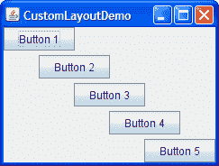

# 创建自定义布局管理器

> 原文：[`docs.oracle.com/javase/tutorial/uiswing/layout/custom.html`](https://docs.oracle.com/javase/tutorial/uiswing/layout/custom.html)

在开始创建自定义布局管理器之前，请确保没有现有的布局管理器符合您的要求。特别是像`GridBagLayout`、`SpringLayout`和`BoxLayout`这样的布局管理器在许多情况下都足够灵活。您还可以从其他来源找到布局管理器，比如从互联网上。最后，您可以通过将组件分组到诸如面板之类的容器中来简化布局。

* * *

**注意：** 本课程涵盖了手动编写布局代码，这可能具有挑战性。如果您不想学习布局管理的所有细节，您可能更喜欢使用`GroupLayout`布局管理器结合构建工具来布局您的 GUI。其中一个构建工具是 NetBeans IDE。否则，如果您想手动编码而不想使用`GroupLayout`，那么推荐使用`GridBagLayout`作为下一个最灵活和强大的布局管理器。

* * *

如果您有兴趣使用 JavaFX 来创建您的 GUI，请参阅[在 JavaFX 中使用布局](https://docs.oracle.com/javase/8/javafx/layout-tutorial/index.html)。

要创建自定义布局管理器，您必须创建一个实现[`LayoutManager`](https://docs.oracle.com/javase/8/docs/api/java/awt/LayoutManager.html)接口的类。您可以直接实现它，或者实现其子接口[`LayoutManager2`](https://docs.oracle.com/javase/8/docs/api/java/awt/LayoutManager2.html)。

每个布局管理器必须至少实现`LayoutManager`接口所需的以下五个方法：

**`void addLayoutComponent(String, Component)`**

被`Container`类的`add`方法调用。通常不将字符串与其组件关联的布局管理器在此方法中不执行任何操作。

**`void removeLayoutComponent(Component)`**

被`Container`方法`remove`和`removeAll`调用。布局管理器重写此方法以清除与`Component`关联的内部状态。

**`Dimension preferredLayoutSize(Container)`**

被`Container`类的`getPreferredSize`方法调用，该方法本身在各种情况下被调用。此方法应计算并返回容器的理想大小，假设其中的组件将达到或超过其首选大小。此方法必须考虑容器的内部边框，这些边框由[`getInsets`](https://docs.oracle.com/javase/8/docs/api/java/awt/Container.html#getInsets--)方法返回。

**`Dimension minimumLayoutSize(Container)`**

被`Container`的`getMinimumSize`方法调用，该方法本身在各种情况下都会被调用。该方法应计算并返回容器的最小尺寸，假设其中的组件将在其最小尺寸或以上。该方法必须考虑容器的内部边框，这些边框由`getInsets`方法返回。

**`void layoutContainer(Container)`**

用于定位和调整容器中每个组件的大小。布局管理器的`layoutContainer`方法实际上不会绘制组件。它只是调用每个组件的`setSize`、`setLocation`和`setBounds`方法中的一个或多个来设置组件的大小和位置。

该方法必须考虑容器的内部边框，这些边框由`getInsets`方法返回。如果适用，它还应考虑容器的方向（由[`getComponentOrientation`](https://docs.oracle.com/javase/8/docs/api/java/awt/Component.html#getComponentOrientation--)方法返回）。您不能假设在调用`layoutContainer`之前将调用`preferredLayoutSize`或`minimumLayoutSize`方法。

除了实现前述的五个方法外，布局管理器通常会实现至少一个公共构造函数和`toString`方法。

如果您希望支持组件约束、最大尺寸或对齐方式，则您的布局管理器应实现`LayoutManager2`接口。事实上，出于这些原因以及许多其他原因，几乎所有现代布局管理器都需要实现`LayoutManager2`。该接口在`LayoutManager`所需的五个方法基础上添加了五个方法：

+   `addLayoutComponent(Component, Object)`

+   `getLayoutAlignmentX(Container)`

+   `getLayoutAlignmentY(Container)`

+   `invalidateLayout(Container)`

+   `maximumLayoutSize(Container)`

这些方法中，最重要的是`addLayoutComponent(Component, Object)`和`invalidateLayout(Container)`。`addLayoutComponent`方法用于使用指定的约束对象向布局中添加组件。`invalidateLayout`方法用于使布局失效，因此如果布局管理器缓存了信息，则应将其丢弃。有关`LayoutManager2`的更多信息，请参阅[`LayoutManager2`](https://docs.oracle.com/javase/8/docs/api/java/awt/LayoutManager2.html) API 文档。

最后，每当您创建自定义布局管理器时，都应注意保持对不再是`Container`子级的`Component`实例的引用。换句话说，布局管理器应覆盖`removeLayoutComponent`以清除与`Component`相关的任何缓存状态。

## 自定义布局的示例

示例`CustomLayoutDemo`使用了一个名为`DiagonalLayout`的自定义布局管理器。您可以在`DiagonalLayout.java`中找到布局管理器的源代码。`DialogLayout`以对角线方式从左到右布置组件，每行一个组件。这里是使用`DialogLayout`布置五个按钮的 CustomLayoutDemo 的图片。

点击启动按钮以使用[Java™ Web Start](http://www.oracle.com/technetwork/java/javase/javawebstart/index.html)运行`CustomLayoutDemo`（[下载 JDK 7 或更高版本](http://www.oracle.com/technetwork/java/javase/downloads/index.html)）。或者，要自行编译和运行示例，请参考示例索引。

