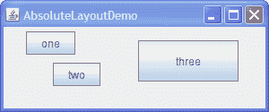

# 不使用布局管理器（绝对定位）

> 原文：[`docs.oracle.com/javase/tutorial/uiswing/layout/none.html`](https://docs.oracle.com/javase/tutorial/uiswing/layout/none.html)

尽管可以不使用布局管理器，但尽可能使用布局管理器。布局管理器使得更容易调整外观和感觉依赖的组件外观，不同的字体大小，容器的大小变化以及不同的语言环境。布局管理器也可以轻松地被其他容器以及其他程序重复使用。

* * *

**注意：**本课程涵盖了手动编写布局代码，这可能具有挑战性。如果您不想学习布局管理的所有细节，您可能更喜欢使用`GroupLayout`布局管理器结合构建工具来布局您的 GUI。其中一个构建工具是 NetBeans IDE。否则，如果您想手动编码而不想使用`GroupLayout`，那么推荐使用`GridBagLayout`作为下一个最灵活和强大的布局管理器。

* * *

如果您有兴趣使用 JavaFX 创建 GUI，请参阅[在 JavaFX 中使用布局](https://docs.oracle.com/javase/8/javafx/layout-tutorial/index.html)。

如果一个容器包含的组件的大小不受容器的大小、字体、外观和语言更改的影响，那么绝对定位可能是合理的。包含内部框架的桌面窗格属于这一类别。内部框架的大小和位置不直接取决于桌面窗格的大小。程序员确定内部框架在桌面窗格内的初始大小和位置，然后用户可以移动或调整框架的大小。在这种情况下，布局管理器是不必要的。

另一种适合使用绝对定位的情况是自定义容器，该容器执行特定于容器的大小和位置计算，并且可能需要了解容器的专门状态。这是分割窗格的情况。

创建一个没有布局管理器的容器涉及以下步骤。

1.  将容器的布局管理器设置为 null，调用`setLayout(null)`。

1.  对容器的每个子元素调用`Component`类的`setbounds`方法。

1.  调用`Component`类的`repaint`方法。

然而，使用绝对定位创建容器可能会在包含容器的窗口调整大小时出现问题。

这是一个内容窗格使用绝对定位的框架的快照。



点击“启动”按钮以使用[Java™ Web Start](http://www.oracle.com/technetwork/java/javase/javawebstart/index.html)运行 AbsoluteLayoutDemo（[下载 JDK 7 或更高版本](http://www.oracle.com/technetwork/java/javase/downloads/index.html)）。或者，要自行编译和运行示例，请参考示例索引。


其代码位于`AbsoluteLayoutDemo.java`中。以下代码片段显示了如何在内容窗格中创建和布局组件。

```java
pane.setLayout(null);

JButton b1 = new JButton("one");
JButton b2 = new JButton("two");
JButton b3 = new JButton("three");

pane.add(b1);
pane.add(b2);
pane.add(b3);

Insets insets = pane.getInsets();
Dimension size = b1.getPreferredSize();
b1.setBounds(25 + insets.left, 5 + insets.top,
             size.width, size.height);
size = b2.getPreferredSize();
b2.setBounds(55 + insets.left, 40 + insets.top,
             size.width, size.height);
size = b3.getPreferredSize();
b3.setBounds(150 + insets.left, 15 + insets.top,
             size.width + 50, size.height + 20);

...*//In the main method:*
Insets insets = frame.getInsets();
frame.setSize(300 + insets.left + insets.right,
              125 + insets.top + insets.bottom);

```
