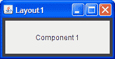

# 问题和练习：在容器内布置组件

> 原文：[`docs.oracle.com/javase/tutorial/uiswing/QandE/questions-ch4.html`](https://docs.oracle.com/javase/tutorial/uiswing/QandE/questions-ch4.html)

## 问题

在以下每个问题中，选择最适合描述布局的布局管理器。假设由布局管理器控制的容器是`JPanel`。

1\. 该容器有一个组件应尽可能占据空间

|  |  |
| --- | --- |

a. `BorderLayout`

b. `GridLayout`

c. `GridBagLayout`

d. a 和 b

e. b 和 c

2\. 该容器有一行组件，应该以相同大小显示，填充容器的整个区域。

 

a. `FlowLayout`

b. `GridLayout`

c. `BoxLayout`

d. a 和 b

3\. 该容器以列形式显示多个组件，额外的空间位于前两个组件之间。

|  |  |
| --- | --- |

a. `FlowLayout`

b. `BoxLayout`

c. `GridLayout`

d. `BorderLayout`

4\. 该容器可以在不同时间显示三个完全不同的组件，可能取决于用户输入或程序状态。即使组件的大小不同，从一个组件切换到下一个也不应更改为组件分配的空间量。

 

a. `SpringLayout`

b. `BoxLayout`

c. `CardLayout`

d. `GridBagLayout`

## 练习

1\. 实现问题 1 中描述和显示的布局。

2\. 实现问题 2 中描述和显示的布局。

3\. 实现问题 3 中描述和显示的布局。

4\. 实现问题 4 中描述和显示的布局。

5\. 通过添加一行代码，使您为练习 2 编写的程序显示组件从右到左，而不是从左到右。

 检查您的答案。
