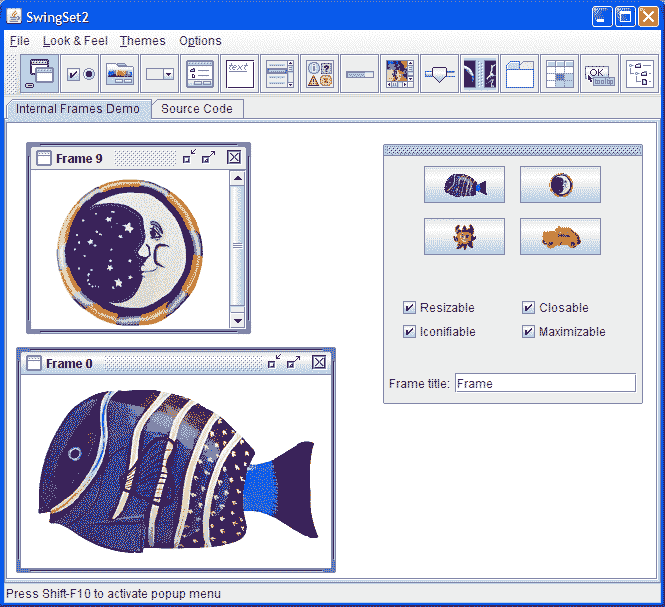
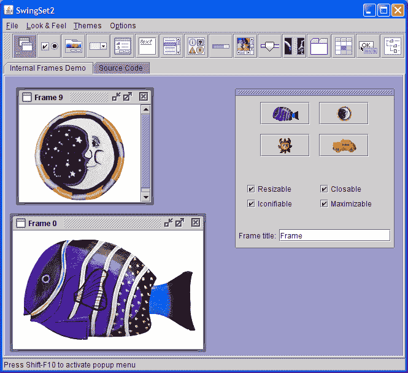

# 如何设置外观和感觉

> 原文：[`docs.oracle.com/javase/tutorial/uiswing/lookandfeel/plaf.html`](https://docs.oracle.com/javase/tutorial/uiswing/lookandfeel/plaf.html)

Swing 的架构设计使您可以更改应用程序 GUI 的“外观和感觉”（L&F）（请参阅[A Swing Architecture Overview](http://www.oracle.com/technetwork/java/architecture-142923.html)）。“外观”指的是 GUI 小部件的外观（更正式地说，`JComponents`），而“感觉”指的是小部件的行为方式。

Swing 的架构通过将每个组件分为两个不同的类来实现多个 L&Fs 的功能：一个`JComponent`子类和一个对应的`ComponentUI`子类。例如，每个`JList`实例都有一个`ListUI`的具体实现（`ListUI`扩展自`ComponentUI`）。在 Swing 的文档中，`ComponentUI`子类被称为各种名称——“UI”，“组件 UI”，“UI 代理”和“外观和感觉代理”都用来标识`ComponentUI`子类。

大多数开发人员几乎不需要直接与 UI 代理交互。在大多数情况下，UI 代理由`JComponent`子类内部用于关键功能，`JComponent`子类提供了所有对 UI 代理的访问的覆盖方法。例如，`JComponent`子类中的所有绘图都委托给 UI 代理。通过委托绘图，外观可以根据 L&F 的不同而变化。

每个 L&F 都有责任为 Swing 定义的每个`ComponentUI`子类提供具体实现。例如，Java 外观和感觉创建一个`MetalTabbedPaneUI`实例来为`JTabbedPane`提供 L&F。UI 代理的实际创建由 Swing 为您处理——在大多数情况下，您几乎不需要直接与 UI 代理交互。

本节的其余部分讨论以下主题：

+   可用的外观和感觉

+   以编程方式设置外观和感觉

+   指定外观和感觉：命令行

+   指定外观和感觉：swing.properties

+   UI 管理器如何选择外观和感觉

+   启动后更改外观和感觉

+   一个示例

+   主题

+   SwingSet2 演示程序

## 可用的外观和感觉

Sun 的 JRE 提供以下 L&Fs：

1.  `CrossPlatformLookAndFeel`—这是在所有平台上看起来相同的“Java L&F”（也称为“Metal”）。它是 Java API 的一部分（`javax.swing.plaf.metal`），如果您在代码中不做任何设置，则将使用默认值。

1.  `SystemLookAndFeel`—在这里，应用程序使用与其运行的系统相对应的 L&F。系统 L&F 在运行时确定，应用程序会询问系统返回适当 L&F 的名称。

1.  Synth——用 XML 文件创建自己的外观和感觉的基础。

1.  多路复用—一种让 UI 方法同时委托给多个不同外观实现的方式。

对于 Linux 和 Solaris，如果安装了 GTK+ 2.2 或更高版本，则系统 L&Fs 是“GTK+”，否则是“Motif”。对于 Windows，系统 L&F 是“Windows”，模仿正在运行的特定 Windows OS 的 L&F—经典 Windows、XP 或 Vista。GTK+、Motif 和 Windows L&Fs 由 Sun 提供，并随 Java SDK 和 JRE 一起提供，尽管它们不是 Java API 的一部分。

苹果提供了自己的 JVM，其中包含他们专有的 L&F。

总之，当您使用 `SystemLookAndFeel` 时，您将看到以下内容：

| 平台 | 外观和感觉 |
| --- | --- |
| Solaris、安装了 GTK+ 2.2 或更高版本的 Linux | GTK+ |
| 其他 Solaris、Linux | Motif |
| IBM UNIX | IBM* |
| HP UX | HP* |
| 经典 Windows | Windows |
| Windows XP | Windows XP |
| Windows Vista | Windows Vista |
| Macintosh | Macintosh* |

* 由系统供应商提供。

在 API 中看不到系统 L&F。它需要的 GTK+、Motif 和 Windows 包已随 Java SDK 一起提供：

```java
com.sun.java.swing.plaf.gtk.GTKLookAndFeel
com.sun.java.swing.plaf.motif.MotifLookAndFeel
com.sun.java.swing.plaf.windows.WindowsLookAndFeel

```

请注意路径包括 `java`，而不是 `javax`。

* * *

**注意：** GTK+ L&F 只能在安装了 GTK+ 2.2 或更高版本的 UNIX 或 Linux 系统上运行，而 Windows L&F 只能在 Windows 系统上运行。与 Java（Metal）L&F 一样，Motif L&F 可在任何平台上运行。

* * *

所有 Sun 的 L&Fs 都有很多共同点。这种共同点在 API 中的 `Basic` 外观和感觉中定义（`javax.swing.plaf.basic`）。Motif 和 Windows L&Fs 分别通过扩展 `javax.swing.plaf.basic` 中的 UI 代理类构建（可以通过相同的方式构建自定义 L&F）。"Basic" L&F 不会在不被扩展的情况下使用。

在 API 中，您将看到四个 L&F 包：

+   `javax.swing.plaf.basic`—在创建自定义 L&F 时要扩展的基本 UI 代理

+   `javax.swing.plaf.metal`—Java L&F，也被称为跨平台 L&F（"Metal" 是这个 L&F 的 Sun 项目名称）。这个 L&F 的当前默认“主题”（下面讨论）是“Ocean”，因此通常被称为 Ocean L&F。

+   `javax.swing.plaf.multi`—一个多路复用外观，允许 UI 方法同时委托给多个外观实现。它可以用于增强特定外观的行为，例如在 Windows 外观之上提供音频提示的外观。这是创建残障人士可访问的外观的一种方式。

+   `javax.swing.plaf.synth`—使用 XML 文件轻松配置的 L&F（在本课程的下一部分讨论）

您不限于使用 Java 平台提供的 L&Fs。您可以使用程序类路径中的任何 L&F。外部 L&Fs 通常以一个或多个 JAR 文件的形式提供，您可以在运行时将其添加到程序的类路径中。例如：

```java
java -classpath .;C:\java\lafdir\customlaf.jar YourSwingApplication

```

一旦外部 L&F 在程序的类路径中，程序就可以像使用 Java 平台提供的任何 L&Fs 一样使用它。

## 以编程方式设置外观和感觉

* * *

**注意：** 如果要设置外观和感觉，应该在应用程序中的第一步就这样做。否则，你可能会在请求的外观和感觉之外初始化 Java 外观和感觉。当静态字段引用 Swing 类时，可能会无意中发生这种情况，导致加载外观和感觉。如果尚未指定外观和感觉，则加载 JRE 的默认外观和感觉。对于 Sun 的 JRE，默认是 Java 外观和感觉，对于 Apple 的 JRE 是 Apple 外观和感觉，依此类推。

* * *

Swing 组件使用的外观和感觉是通过`javax.swing`包中的`UIManager`类指定的。每当创建一个 Swing 组件时，该组件都会向 UI 管理器请求实现组件外观和感觉的 UI 委托。例如，每个`JLabel`构造函数都会查询 UI 管理器以获取适用于标签的 UI 委托对象。然后使用该 UI 委托对象来实现所有的绘制和事件处理。

要以编程方式指定外观和感觉，可以使用`UIManager.setLookAndFeel()`方法，并将适当的`LookAndFeel`子类的完全限定名称作为参数。例如，以下代码中的粗体代码使程序使用跨平台的 Java 外观和感觉：

```java
public static void main(String[] args) {
    try {
            // Set cross-platform Java L&F (also called "Metal")
        UIManager.setLookAndFeel(
            UIManager.getCrossPlatformLookAndFeelClassName());
    } 
    catch (UnsupportedLookAndFeelException e) {
       // handle exception
    }
    catch (ClassNotFoundException e) {
       // handle exception
    }
    catch (InstantiationException e) {
       // handle exception
    }
    catch (IllegalAccessException e) {
       // handle exception
    }

    new SwingApplication(); //Create and show the GUI.
}

```

或者，这段代码使程序使用系统外观和感觉：

```java
public static void main(String[] args) {
    try {
            // Set System L&F
        UIManager.setLookAndFeel(
            UIManager.getSystemLookAndFeelClassName());
    } 
    catch (UnsupportedLookAndFeelException e) {
       // handle exception
    }
    catch (ClassNotFoundException e) {
       // handle exception
    }
    catch (InstantiationException e) {
       // handle exception
    }
    catch (IllegalAccessException e) {
       // handle exception
    }

    new SwingApplication(); //Create and show the GUI.
}

```

你也可以将外观和感觉的实际类名作为`UIManager.setLookAndFeel()`的参数。例如，

```java
// Set cross-platform Java L&F (also called "Metal")
UIManager.setLookAndFeel("javax.swing.plaf.metal.MetalLookAndFeel");

```

或

```java
// Set Motif L&F on any platform
UIManager.setLookAndFeel("com.sun.java.swing.plaf.motif.MotifLookAndFeel");

```

你不限于前面的参数。你可以为程序类路径中的任何外观和感觉指定名称。

## 指定外观和感觉：命令行

你可以通过使用`-D`标志设置`swing.defaultlaf`属性在命令行中指定外观和感觉。例如：

```java
java -Dswing.defaultlaf=com.sun.java.swing.plaf.gtk.GTKLookAndFeel MyApp

java -Dswing.defaultlaf=com.sun.java.swing.plaf.windows.WindowsLookAndFeel MyApp

```

## 指定外观和感觉：swing.properties 文件

另一种指定当前外观和感觉的方法是使用`swing.properties`文件来设置`swing.defaultlaf`属性。这个文件可能需要你自己创建，在 Sun 的 Java 发布版本的`lib`目录中（其他 Java 供应商可能使用不同的位置）。例如，如果你在`*javaHomeDirectory*\bin`中使用 Java 解释器，那么`swing.properties`文件（如果存在）就在`*javaHomeDirectory*\lib`中。以下是`swing.properties`文件的示例内容：

```java
# Swing properties
swing.defaultlaf=com.sun.java.swing.plaf.windows.WindowsLookAndFeel

```

## UI 管理器如何选择外观和感觉

当 UI 管理器需要设置外观和感觉时，以下是外观和感觉确定步骤：

1.  如果程序在需要外观和感觉之前设置了外观和感觉，UI 管理器会尝试创建指定外观和感觉类的实例。如果成功，所有组件都将使用该外观和感觉。

1.  如果程序没有成功指定外观和感觉，那么 UI 管理器将使用`swing.defaultlaf`属性指定的外观和感觉。如果`swing.properties`文件和命令行中都指定了该属性，则以命令行定义为准。

1.  如果这些步骤都没有导致有效的外观和感觉，Sun 的 JRE 将使用 Java 外观和感觉。其他供应商，如苹果，将使用其默认外观和感觉。

## 启动后更改外观和感觉

即使程序的 GUI 可见，您也可以使用`setLookAndFeel`更改外观和感觉。为了使现有组件反映新的外观和感觉，每个顶级容器调用一次`SwingUtilities`的`updateComponentTreeUI`方法。然后，您可能希望调整每个顶级容器的大小以反映其包含组件的新大小。例如：

```java
UIManager.setLookAndFeel(lnfName);
SwingUtilities.updateComponentTreeUI(frame);
frame.pack();

```

## 一个示例

在以下示例中，`LookAndFeelDemo.java`，您可以尝试不同的外观和感觉。该程序创建了一个简单的 GUI，带有一个按钮和一个标签。每次单击按钮时，标签会递增。

您可以通过更改第 18 行的`LOOKANDFEEL`常量来更改外观和感觉。前几行的注释告诉您哪些值是可接受的：

```java
    // Specify the look and feel to use by defining the LOOKANDFEEL constant
    // Valid values are: null (use the default), "Metal", "System", "Motif",
    // and "GTK"
    final static String LOOKANDFEEL = "Motif";

```

这里将常量设置为"Motif"，这是一个可以在任何平台上运行的外观和感觉（默认为"Metal"）。"GTK+"不会在 Windows 上运行，而"Windows"只会在 Windows 上运行。如果选择无法运行的外观和感觉，您将获得 Java 或 Metal 外观和感觉。

在实际设置外观和感觉的代码部分，您将看到几种不同的设置方式，如上所述：

```java
if (LOOKANDFEEL.equals("Metal")) {
   lookAndFeel = UIManager.getCrossPlatformLookAndFeelClassName();
   //  an alternative way to set the Metal L&F is to replace the 
   // previous line with:
   // lookAndFeel = "javax.swing.plaf.metal.MetalLookAndFeel";

```

您可以通过注释/取消注释两个替代方案来验证这两个参数是否有效。

这是`LookAndFeelDemo`源文件的列表：

```java

package lookandfeel;

import javax.swing.*;          
import java.awt.*;
import java.awt.event.*;
import javax.swing.plaf.metal.*;

public class LookAndFeelDemo implements ActionListener {
    private static String labelPrefix = "Number of button clicks: ";
    private int numClicks = 0;
    final JLabel label = new JLabel(labelPrefix + "0    ");

    // Specify the look and feel to use by defining the LOOKANDFEEL constant
    // Valid values are: null (use the default), "Metal", "System", "Motif",
    // and "GTK"
    final static String LOOKANDFEEL = "Metal";

    // If you choose the Metal L&F, you can also choose a theme.
    // Specify the theme to use by defining the THEME constant
    // Valid values are: "DefaultMetal", "Ocean",  and "Test"
    final static String THEME = "Test";

    public Component createComponents() {
        JButton button = new JButton("I'm a Swing button!");
        button.setMnemonic(KeyEvent.VK_I);
        button.addActionListener(this);
        label.setLabelFor(button);

        JPanel pane = new JPanel(new GridLayout(0, 1));
        pane.add(button);
        pane.add(label);
        pane.setBorder(BorderFactory.createEmptyBorder(
                                        30, //top
                                        30, //left
                                        10, //bottom
                                        30) //right
                                        );

        return pane;
    }

    public void actionPerformed(ActionEvent e) {
        numClicks++;
        label.setText(labelPrefix + numClicks);
    }

    private static void initLookAndFeel() {
        String lookAndFeel = null;

        if (LOOKANDFEEL != null) {
            if (LOOKANDFEEL.equals("Metal")) {
                lookAndFeel = UIManager.getCrossPlatformLookAndFeelClassName();
              //  an alternative way to set the Metal L&F is to replace the 
              // previous line with:
              // lookAndFeel = "javax.swing.plaf.metal.MetalLookAndFeel";

            }

            else if (LOOKANDFEEL.equals("System")) {
                lookAndFeel = UIManager.getSystemLookAndFeelClassName();
            } 

            else if (LOOKANDFEEL.equals("Motif")) {
                lookAndFeel = "com.sun.java.swing.plaf.motif.MotifLookAndFeel";
            } 

            else if (LOOKANDFEEL.equals("GTK")) { 
                lookAndFeel = "com.sun.java.swing.plaf.gtk.GTKLookAndFeel";
            } 

            else {
                System.err.println("Unexpected value of LOOKANDFEEL specified: "
                                   + LOOKANDFEEL);
                lookAndFeel = UIManager.getCrossPlatformLookAndFeelClassName();
            }

            try {

                UIManager.setLookAndFeel(lookAndFeel);

                // If L&F = "Metal", set the theme

                if (LOOKANDFEEL.equals("Metal")) {
                  if (THEME.equals("DefaultMetal"))
                     MetalLookAndFeel.setCurrentTheme(new DefaultMetalTheme());
                  else if (THEME.equals("Ocean"))
                     MetalLookAndFeel.setCurrentTheme(new OceanTheme());
                  else
                     MetalLookAndFeel.setCurrentTheme(new TestTheme());

                  UIManager.setLookAndFeel(new MetalLookAndFeel()); 
                }	

            } 

            catch (ClassNotFoundException e) {
                System.err.println("Couldn't find class for specified look and feel:"
                                   + lookAndFeel);
                System.err.println("Did you include the L&F library in the class path?");
                System.err.println("Using the default look and feel.");
            } 

            catch (UnsupportedLookAndFeelException e) {
                System.err.println("Can't use the specified look and feel ("
                                   + lookAndFeel
                                   + ") on this platform.");
                System.err.println("Using the default look and feel.");
            } 

            catch (Exception e) {
                System.err.println("Couldn't get specified look and feel ("
                                   + lookAndFeel
                                   + "), for some reason.");
                System.err.println("Using the default look and feel.");
                e.printStackTrace();
            }
        }
    }

    private static void createAndShowGUI() {
        //Set the look and feel.
        initLookAndFeel();

        //Make sure we have nice window decorations.
        JFrame.setDefaultLookAndFeelDecorated(true);

        //Create and set up the window.
        JFrame frame = new JFrame("SwingApplication");
        frame.setDefaultCloseOperation(JFrame.EXIT_ON_CLOSE);

        LookAndFeelDemo app = new LookAndFeelDemo();
        Component contents = app.createComponents();
        frame.getContentPane().add(contents, BorderLayout.CENTER);

        //Display the window.
        frame.pack();
        frame.setVisible(true);
    }

    public static void main(String[] args) {
        //Schedule a job for the event dispatch thread:
        //creating and showing this application's GUI.
        javax.swing.SwingUtilities.invokeLater(new Runnable() {
            public void run() {
                createAndShowGUI();
            }
        });
    }
}

```

## 主题

主题被引入作为轻松更改跨平台 Java（Metal）外观和感觉的颜色和字体的一种方式。在上面列出的示例程序`LookAndfeelDemo.java`中，您可以通过将第 23 行的`THEME`常量设置为三个值之一来更改金属外观和感觉的主题。

+   `DefaultMetal`

+   `Ocean`

+   `Test`

`Ocean`，比纯金属外观稍柔和，自 Java SE 5 以来一直是金属（Java）外观的默认主题。尽管它的名字是`DefaultMetal`，但它不是金属的默认主题（在 Java SE 5 之前是，这解释了它的名字）。`Test`主题是在``TestTheme.java``中定义的主题，您必须使用`LookAndfeelDemo.java`编译。正如所写，`TestTheme.java`设置了三种主要颜色（结果有些奇怪）。您可以修改`TestTheme.java`以测试任何您喜欢的颜色。

设置主题的代码部分从`LookAndfeelDemo.java`的第 92 行开始。请注意，您必须使用金属外观和感觉来设置主题。

```java
 if (LOOKANDFEEL.equals("Metal")) {
    if (THEME.equals("DefaultMetal"))
       MetalLookAndFeel.setCurrentTheme(new DefaultMetalTheme());
    else if (THEME.equals("Ocean"))
       MetalLookAndFeel.setCurrentTheme(new OceanTheme());
    else
       MetalLookAndFeel.setCurrentTheme(new TestTheme());

    UIManager.setLookAndFeel(new MetalLookAndFeel()); 
 }      

```

## SwingSet2 演示程序

当您下载[JDK 和 JavaFX 演示和示例](http://www.oracle.com/technetwork/java/javase/downloads/index.html)捆绑包并打开它时，会看到一个包含名为`SwingSet2`的演示程序的`demo\jfc`文件夹。该程序具有丰富的图形用户界面，并允许您从菜单中更改外观。此外，如果您正在使用 Java（Metal）外观，您可以选择各种不同的主题。各种主题的文件（例如，`RubyTheme.java`）位于`SwingSet2\src`文件夹中。

这是“Ocean”主题，是跨平台 Java（Metal）外观的默认主题：



这是“Steel”主题，是跨平台 Java（Metal）外观的原始主题：



要在已安装 JDK 的系统上运行`SwingSet2`演示程序，请使用以下命令：

```java
java -jar SwingSet2.jar

```

这将为您提供 Ocean 的默认主题。

要获得金属 L&F，请运行以下命令：

```java
java -Dswing.metalTheme=steel -jar SwingSet2.jar

```
