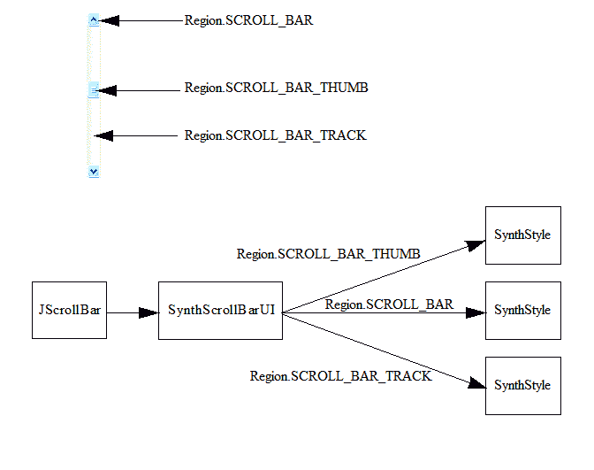
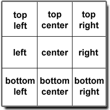
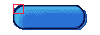

# 合成外观

> 原文：[`docs.oracle.com/javase/tutorial/uiswing/lookandfeel/synth.html`](https://docs.oracle.com/javase/tutorial/uiswing/lookandfeel/synth.html)

创建自定义外观或修改现有外观可能是一项艰巨的任务。[`javax.swing.plaf.synth`](https://docs.oracle.com/javase/8/docs/api/javax/swing/plaf/synth/package-summary.html)包可用于以更少的工作量创建自定义外观。您可以通过编程方式或使用外部 XML 文件创建合成外观。以下讨论专注于使用外部 XML 文件创建合成外观。有关通过编程方式创建合成外观的讨论，请参阅 API 文档。

使用合成外观，您提供“外观”。合成本身提供“感觉”。因此，您可以将合成 L&F 视为“皮肤”。

## 合成架构

请回顾前一个主题，每个 L&F 都有责任为 Swing 定义的许多`ComponentUI`子类提供具体实现。合成 L&F 为您处理了这一切。要使用合成，您无需创建任何`ComponentUI`—您只需指定每个组件如何绘制，以及影响布局和大小的各种属性。

合成在比组件更细粒度的级别上运行—这个细粒度级别称为“区域”。每个组件都有一个或多个区域。许多组件只有一个区域，例如`JButton`。其他组件有多个区域，例如`JScrollBar`。由合成提供的每个`ComponentUI`将`SynthStyle`与`ComponentUI`定义的每个区域关联起来。例如，合成为`JScrollBar`定义了三个区域：轨道、拇指和滚动条本身。合成为`JScrollBar`定义的`ScrollBarUI`（为`JScrollBar`定义的`ComponentUI`子类）实现将`SynthStyle`与每个区域关联起来。



`SynthStyle`提供了合成`ComponentUI`实现所使用的样式信息。例如，`SynthStyle`定义了前景色、背景色、字体信息等。此外，每个`SynthStyle`都有一个用于绘制区域的`SynthPainter`。例如，`SynthPainter`定义了`paintScrollBarThumbBackground`和`paintScrollBarThumbBorder`两种方法，用于绘制滚动条拇指区域。

在合成中，每个`ComponentUI`都使用`SynthStyleFactory`获取`SynthStyles`。有两种定义`SynthStyleFactory`的方法：通过 Synth XML 文件或以编程方式。以下代码展示了如何加载指定合成外观的 XML 文件——在幕后，这将创建一个从 XML 文件中填充`SynthStyles`的`SynthStyleFactory`实现：

```java
  SynthLookAndFeel laf = new SynthLookAndFeel();
  laf.load(MyClass.class.getResourceAsStream("laf.xml"), MyClass.class);
  UIManager.setLookAndFeel(laf);

```

编程路线涉及创建一个返回 `SynthStyles` 的 `SynthStyleFactory` 实现。以下代码创建了一个为按钮和树返回不同 `SynthStyles` 的自定义 `SynthStyleFactory`：

```java
 class MyStyleFactory extends SynthStyleFactory {
     public SynthStyle getStyle(JComponent c, Region id) {
         if (id == Region.BUTTON) {
             return buttonStyle;
         }
         else if (id == Region.TREE) {
             return treeStyle;
         }
         return defaultStyle;
     }
 }
 SynthLookAndFeel laf = new SynthLookAndFeel();
 UIManager.setLookAndFeel(laf);
 SynthLookAndFeel.setStyleFactory(new MyStyleFactory());

```

## XML 文件

Synth XML 文件的 DTD 解释可以在[`javax.swing.plaf.synth/doc-files/synthFileFormat.html`](https://docs.oracle.com/javase/8/docs/api/javax/swing/plaf/synth/doc-files/synthFileFormat.html)找到。

当加载 Synth 外观时，只有那些有定义（绑定到区域的“style”，如下所述）的 GUI 组件（或区域）才会被呈现。对于任何组件都没有默认行为——没有在 Synth XML 文件中定义样式，GUI 就是一块空白画布。

要指定组件（或区域）的呈现方式，您的 XML 文件必须包含一个 <style> 元素，然后使用 <bind> 元素将其*绑定*到该区域。举个例子，让我们定义一个包括字体、前景色和背景色的样式，然后将该样式绑定到所有组件。在您开发 Synth XML 文件时包含这样的元素是个好主意——这样，您尚未定义的组件至少会有颜色和字体：

```java
<synth>
  <style id="basicStyle">
    <font name="Verdana" size="16"/>
    <state>
      <color value="WHITE" type="BACKGROUND"/>
      <color value="BLACK" type="FOREGROUND"/>
    </state>
  </style>
  <bind style="basicStyle" type="region" key=".*"/>
</synth>

```

让我们分析这个样式定义：

1.  <style> 元素是 Synth XML 文件的基本构建块。它包含描述区域呈现所需的所有信息。一个 <style> 元素可以描述多个区域，就像这里所做的那样。但一般来说，最好为每个组件或区域创建一个 <style> 元素。请注意，<style> 元素被赋予一个标识符，字符串“basicStyle”。此标识符将在后面的 <bind> 元素中使用。

1.  <style> 元素的 <font> 元素将字体设置为 Verdana，大小为 16。

1.  将在下面讨论 <style> 元素的 <state> 元素。区域的 <state> 元素可以具有七个可能值中的一个或混合值。当未指定值时，定义适用于所有状态，这是本意。因此，在此元素中定义了“所有状态”的背景色和前景色。

1.  最后，刚刚定义的具有标识符“basicStyle”的 <style> 元素被*绑定*到所有区域。 <bind> 元素将“basicStyle”绑定到“region”类型。绑定适用于哪种或哪些区域类型由“key”属性给出，在本例中为“.*”，表示“所有”的正则表达式。

在创建一些实际示例之前，让我们先看一下 Synth XML 文件的各部分。我们将从 <bind> 元素开始，展示如何将给定的 <style> 应用于组件或区域。

## <bind> 元素

每当定义一个 <style> 元素时，必须在其生效之前将其绑定到一个或多个组件或区域。为此目的使用 <bind> 元素。它需要三个属性：

1.  `style` 是先前定义的样式的唯一标识符。

1.  `type` 可以是“name”或“region”。如果 `type` 是名称，则使用 `component.getName()` 方法获取名称。如果 `type` 是区域，则使用 `javax.swing.plaf.synth` 包中 `Region` 类中定义的适当常量。

1.  `key` 是用于确定样式绑定到哪些组件或区域的正则表达式。

区域是标识组件或组件部分的一种方式。区域基于 [`Region`](https://docs.oracle.com/javase/8/docs/api/javax/swing/plaf/synth/Region.html) 类中的常量，通过去除下划线进行修改：

例如，要识别 SPLIT_PANE 区域，您可以使用 SPLITPANE、splitpane 或 SplitPane（不区分大小写）。

当将样式绑定到区域时，该样式将应用于具有该区域的*所有*组件。您可以将样式绑定到多个区域，并且可以将多个样式绑定到一个区域。例如，

```java
<style id="styleOne">
   <!-- styleOne definition goes here -->
</style>

<style id="styleTwo">
   <!-- styleTwo definition goes here -->
</style>

<bind style="styleOne" type="region" key="Button"/>
<bind style="styleOne" type="region" key="RadioButton"/>
<bind style="styleOne" type="region" key="ArrowButton"/>

<bind style="styleTwo" type="region" key="ArrowButton"/>

```

您可以绑定到单独命名的组件，无论它们是否*也*作为区域绑定。例如，假设您希望在 GUI 中将“OK”和“Cancel”按钮与所有其他按钮区别对待。首先，您将使用 `component.setName()` 方法为 OK 和 Cancel 按钮命名。然后，您将定义三种样式：一种用于一般按钮（区域 = “Button”），一种用于 OK 按钮（名称 = “OK”），一种用于 Cancel 按钮（名称 = “Cancel”）。最后，您将像这样绑定这些样式：

```java
<bind style="styleButton" type="region" key="Button">
<bind style="styleOK" type="name" key="OK">
<bind style="styleCancel" type="name" key="Cancel">

```

因此，“OK”按钮同时绑定到“styleButton”和“styleOK”，而“Cancel”按钮同时绑定到“styleButton”和“styleCancel”。

当一个组件或区域绑定到多个样式时，这些样式会合并

* * *

**注意：**

就像一个样式可以绑定到多个区域或名称一样，多个样式可以绑定到一个区域或名称。这些多个样式将合并为该区域或名称。优先考虑文件中后定义的样式。

* * *

## `<state>` 元素

`<state>` 元素允许您为依赖于其“状态”的区域定义外观。例如，通常希望已经`PRESSED`的按钮看起来与其`ENABLED`状态下的按钮不同。在 Synth XML DTD 中定义了七个可能的 `<state>` 值。它们是：

1.  `ENABLED`

1.  `MOUSE_OVER`

1.  `PRESSED`

1.  `DISABLED`

1.  `FOCUSED`

1.  `SELECTED`

1.  `DEFAULT`

您还可以有由“and”分隔的复合状态，例如，ENABLED 和 FOCUSED。如果不指定值，则定义的外观将应用于所有状态。

以下是指定每个状态的绘制器的样式示例。所有按钮都以某种方式绘制，除非状态为“PRESSED”，在这种情况下它们会以不同的方式绘制：

```java
<style id="buttonStyle">
  <property key="Button.textShiftOffset" type="integer" value="1"/>
  <insets top="10" left="10" right="10" bottom="10"/>

  <state>
    <imagePainter method="buttonBackground" path="images/button.png"
                         sourceInsets="10 10 10 10"/>
  </state>
  <state value="PRESSED">
    <color value="#9BC3B1" type="BACKGROUND"/>
    <imagePainter method="buttonBackground" path="images/button2.png"
                        sourceInsets="10 10 10 10"/>
  </state>
</style>
<bind style="buttonStyle" type="region" key="Button"/>

```

暂时忽略 `<property>` 和 `<insets>` 元素，您可以看到按下的按钮与未按下的按钮绘制方式不同。

使用的<state>值是最接近区域状态的定义状态。匹配是通过匹配区域状态的值的数量来确定的。如果没有状态值匹配，则使用没有值的状态。如果有匹配，则将选择具有最多个匹配的状态。例如，以下代码定义了三个状态：

```java
<state id="zero">
  <color value="RED" type="BACKGROUND"/>
</state>
<state value="SELECTED and PRESSED" id="one">
  <color value="RED" type="BACKGROUND"/>
</state>
<state value="SELECTED" id="two">
  <color value="BLUE" type="BACKGROUND"/>
</state>

```

如果区域的状态至少包含 SELECTED 和 PRESSED，将选择状态一。如果状态包含 SELECTED，但不包含 PRESSED，则将使用状态二。如果状态既不包含 SELECTED 也不包含 PRESSED，则将使用状态零。

当当前状态与两个状态定义的相同数量的值匹配时，将使用第一个在样式中定义的状态。例如，`MOUSE_OVER`状态始终为`PRESSED`按钮为真（除非鼠标悬停在上面，否则无法按下按钮）。因此，如果首先声明`MOUSE_OVER`状态，则它将始终优先于`PRESSED`，并且不会执行为`PRESSED`定义的任何绘画。

```java
<state value="PRESSED"> 
   <imagePainter method="buttonBackground" path="images/button_press.png"
                          sourceInsets="9 10 9 10" />
   <color type="TEXT_FOREGROUND" value="#FFFFFF"/>      
</state>

<state value="MOUSE_OVER">    
   <imagePainter method="buttonBackground" path="images/button_on.png"
                          sourceInsets="10 10 10 10" />
   <color type="TEXT_FOREGROUND" value="#FFFFFF"/>
</state>

```

上面的代码将正常工作。但是，如果颠倒文件中`MOUSE_OVER`和`PRESSED`状态的顺序，则永远不会使用`PRESSED`状态。这是因为任何处于`PRESSED`状态的状态也是`MOUSE_OVER`状态。由于首先定义了`MOUSE_OVER`状态，因此将使用它。

## 颜色和字体

<color> 元素需要两个属性：

1.  `value`可以是`java.awt.Color`常量之一，例如 RED、WHITE、BLACK、BLUE 等。也可以是 RGB 值的十六进制表示，例如#FF00FF 或#326A3B。

1.  `type`描述颜色应用的位置—可以是 BACKGROUND、FOREGROUND、FOCUS、TEXT_BACKGROUND 或 TEXT_FOREGROUND。

例如：

```java
  <style id="basicStyle">
    <state>
      <color value="WHITE" type="BACKGROUND"/>
      <color value="BLACK" type="FOREGROUND"/>
    </state>
  </style>

```

<font> 元素有三个属性：

1.  `name`—字体的名称。例如，Arial 或 Verdana。

1.  `size`—字体的大小，以像素为单位。

1.  `style`（可选）—BOLD、ITALIC 或 BOLD ITALIC。如果省略，则获得普通字体。

例如：

```java
  <style id="basicStyle">
    <font name="Verdana" size="16"/>
  </style>

```

每个<color>元素和<font>元素都有一种替代用法。每个都可以有一个`id`属性或一个`idref`属性。使用`id`属性，您可以定义一个颜色，稍后可以通过使用`idref`属性重用。例如，

```java
<color id="backColor" value="WHITE" type="BACKGROUND"/>
<font id="textFont" name="Verdana" size="16"/>
...
...
...
<color idref="backColor"/>
<font idref="textFont"/>

```

## 插图

`insets` 在组件绘制时增加了组件的大小。例如，没有插图时，一个带有`Cancel`标题的按钮将刚好足够大以容纳所选字体的标题。有了像这样的<insets>元素

```java
<insets top="15" left="20" right="20" bottom="15"/>,

```

按钮将在标题上下增加 15 像素，并在标题左右增加 20 像素。

## 使用图像绘制

Synth 的文件格式允许通过图像定制绘图。Synth 的图像绘图器将图像分解为九个不同的区域：顶部、右上、右侧、右下、底部、左下、左侧、左上和中心。这些区域中的每一个都会绘制到目标中。顶部、左侧、底部和右侧边缘会平铺或拉伸，而角部分（`sourceInsets`）保持固定。

* * *

**注意：**

`<insets>`元素与`sourceInsets`属性之间没有关系。`<insets>`元素定义了区域占用的空间，而`sourceInsets`属性定义了如何绘制图像。`<insets>`和`sourceInsets`通常是相似的，但不一定相同。

* * *

您可以使用`paintCenter`属性指定中心区域是否应绘制。以下图显示了九个区域：



让我们以创建一个按钮为例。为此，我们可以使用以下图像（显示比实际尺寸大）：



左上角的红色框是 10 像素的正方形（包括框边）—它显示了绘制时不应拉伸的角区域。为实现此目的，应将顶部和左侧的`sourceInsets`设置为 10。我们将使用以下样式和绑定：

```java
<style id="buttonStyle">
   <insets top="15" left="20" right="20" bottom="15"/>
   <state>
      <imagePainter method="buttonBackground" path="images/button.png"
        sourceInsets="10 10 10 10"/>
   </state>
</style>
<bind style="buttonStyle" type="region" key="button"/>

```

`<state>`元素内的行指定按钮背景应使用图像`images/button.png`绘制。该路径是相对于传递给 SynthLookAndFeel 的 load 方法的类的。`sourceInsets`属性指定不应拉伸的图像区域。在这种情况下，顶部、左侧、底部和右侧的插入量均为 10。这将导致绘图器不拉伸图像每个角的 10 x 10 像素区域。

`<bind>`将`buttonStyle`绑定到所有按钮。

`<imagePainter>`元素提供了渲染区域部分所需的所有信息。它只需要几个属性：

+   method—这指定要用于绘制的`javax.swing.plaf.synth.SynthPainter`类中的方法之一。`SynthPainter`类包含大约 100 个以`paint`开头的方法。确定所需的方法后，删除`paint`前缀，将剩余的第一个字母改为小写，并将结果用作`method`属性。例如，`SynthPainter`方法`paintButtonBackground`变为属性`buttonBackground`。

+   path—要使用的图像的路径，相对于传递给 SynthLookAndFeel 的 load 方法的类。

+   sourceInsets—以像素为单位的插入量，表示不应拉伸的角区域的宽度和高度。它们按顺序映射到顶部、左侧、底部和右侧。

+   paintCenter（可选）：此属性允许您保留图像的中心或去除它（例如，在文本字段中，以便可以绘制文本）。

下面的清单显示了用于根据按钮的`<state>`加载不同图像的 XML 代码

```java
  <style id="buttonStyle">
    <property key="Button.textShiftOffset" type="integer" value="1"/>
    <insets top="15" left="20" right="20" bottom="15"/>
    <state>
      <imagePainter method="buttonBackground" path="images/button.png"
                    sourceInsets="10 10 10 10"/>
    </state>
    <state value="PRESSED">
      <imagePainter method="buttonBackground" path="images/button2.png"
                    sourceInsets="10 10 10 10"/>
    </state>
  </style>
  <bind style="buttonStyle" type="region" key="button"/>

```

`button2.png`显示了按钮`.png`的按下版本，向右移动了一个像素。该行

```java
<property key="Button.textShiftOffset" type="integer" value="1"/>

```

相应地移动按钮文本，如下一节所讨论的。

## `<property>`元素

`<property>`元素用于向`<style>`元素添加键值对。许多组件使用键值对来配置它们的视觉外观。

`<property>`元素有三个属性：

+   `key`—属性的名称。

+   `type`—属性的数据类型。

+   `value`—属性的值。

有一个属性表（`componentProperties.html`），列出了每个组件支持的属性：[`javax/swing/plaf/synth/doc-files/componentProperties.html`](https://docs.oracle.com/javase/8/docs/api/javax/swing/plaf/synth/doc-files/componentProperties.html)。

由于`button2.png`图像在被按下时会使视觉按钮向下移动一个像素，我们也应该移动按钮文本。有一个按钮属性可以实现这一点：

```java
<property key="Button.textShiftOffset" type="integer" value="1"/>

```

## 一个示例

以下是一个示例，使用上面定义的按钮样式。按钮样式，再加上一个“背景样式”，其中定义了绑定到所有区域的字体和颜色的定义（类似于上面标题为“XML 文件”的“basicStyle”）合并在一起，存储在`buttonSkin.xml`中。以下是`buttonSkin.xml`的清单：

```java
<!-- Synth skin that includes an image for buttons -->
<synth>
  <!-- Style that all regions will use -->
  <style id="backingStyle">
    <!-- Make all the regions that use this skin opaque-->
    <opaque value="TRUE"/>
    <font name="Dialog" size="12"/>
    <state>
      <!-- Provide default colors -->
      <color value="#9BC3B1" type="BACKGROUND"/>
      <color value="RED" type="FOREGROUND"/>
    </state>
  </style>
  <bind style="backingStyle" type="region" key=".*"/>
  <style id="buttonStyle">
    <!-- Shift the text one pixel when pressed -->
    <property key="Button.textShiftOffset" type="integer" value="1"/>
    <insets top="15" left="20" right="20" bottom="15"/>
    <state>
      <imagePainter method="buttonBackground" path="images/button.png"
                    sourceInsets="10 10 10 10"/>
    </state>
    <state value="PRESSED">
      <imagePainter method="buttonBackground" path="images/button2.png"
                    sourceInsets="10 10 10 10"/>
    </state>
  </style>
  <!-- Bind buttonStyle to all JButtons -->
  <bind style="buttonStyle" type="region" key="button"/> 
</synth>

```

我们可以加载这个 XML 文件，以在一个名为`SynthApplication.java`的简单应用程序中使用 Synth 外观。该应用程序的 GUI 包括一个按钮和一个标签。每次点击按钮时，标签都会递增。

* * *

**注意：**

标签被绘制，尽管`buttonSkin.xml`中没有为其定义样式。这是因为有一个包含字体和颜色的通用“背景样式”。

* * *

这是`SynthApplication.java`文件的清单。

* * *

**试一试：**

单击“启动”按钮以使用[Java™ Web Start](http://www.oracle.com/technetwork/java/javase/javawebstart/index.html)运行 SynthApplication 示例（[下载 JDK 7 或更高版本](http://www.oracle.com/technetwork/java/javase/downloads/index.html)）。或者，要自行编译和运行示例，请参考示例索引。


* * *

## 使用图标绘制

单选按钮和复选框通常通过固定大小的图标来呈现它们的状态。对于这些情况，您可以创建一个图标并将其绑定到适当的属性（参考属性表，[`javax/swing/plaf/synth/doc-files/componentProperties.html`](https://docs.oracle.com/javase/8/docs/api/javax/swing/plaf/synth/doc-files/componentProperties.html)）。例如，要绘制选中或未选中的单选按钮，请使用以下代码：

```java
<style id="radioButton">
   <imageIcon id="radio_off" path="images/radio_button_off.png"/>
   <imageIcon id="radio_on" path="images/radio_button_on.png"/>
   <property key="RadioButton.icon" value="radio_off"/>
   <state value="SELECTED">   
      <property key="RadioButton.icon" value="radio_on"/>
   </state>
</style>
<bind style="radioButton" type="region" key="RadioButton"/>        

```

## 自定义绘制器

Synth 的文件格式允许通过[`JavaBeans 组件的长期持久性`](http://www.oracle.com/technetwork/java/persistence3-139471.html)来嵌入任意对象。这种能力在提供超出 Synth 提供的基于图像的绘制器时特别有用。例如，以下 XML 代码指定在文本字段的背景中渲染渐变：

```java
<synth>
  <object id="gradient" class="GradientPainter"/>
  <style id="textfield">
    <painter method="textFieldBackground" idref="gradient"/>
  </style>
  <bind style="textfield" type="region" key="textfield"/>
</synth>

```

GradientPainter 类如下所示：

```java
public class GradientPainter extends SynthPainter {
   public void paintTextFieldBackground(SynthContext context,
                                        Graphics g, int x, int y,
                                        int w, int h) {
      // For simplicity this always recreates the GradientPaint. In a
      // real app you should cache this to avoid garbage.
      Graphics2D g2 = (Graphics2D)g;
      g2.setPaint(new GradientPaint((float)x, (float)y, Color.WHITE,
                 (float)(x + w), (float)(y + h), Color.RED));
      g2.fillRect(x, y, w, h);
      g2.setPaint(null);
   }
}

```

## 结论

在本课程中，我们已经介绍了使用`javax.swing.plaf.synth`包创建自定义外观的方法。课程的重点在于使用外部 XML 文件来定义外观。下一课将展示使用 Synth 框架和 XML 文件创建搜索对话框的示例应用程序。
